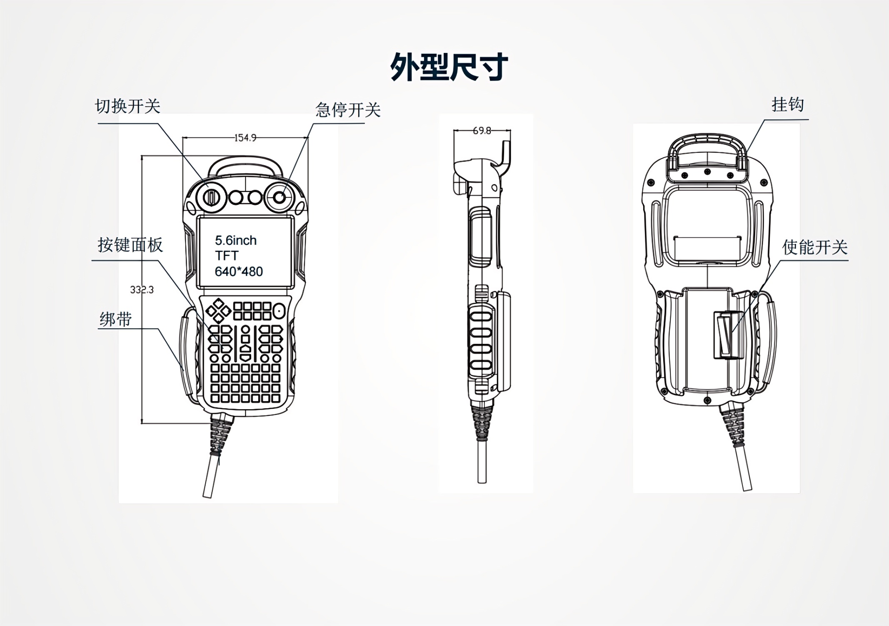
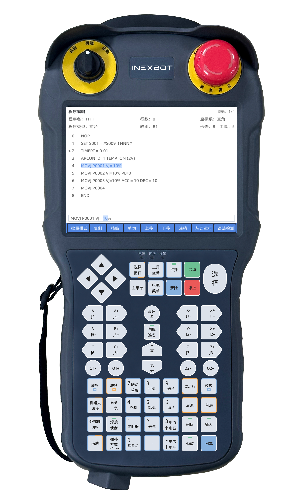

# T31 竖版示教器

## 产品简介

T31 竖版示教器是纳博特面向工业机器人焊接应用设计的专用示教设备，采用竖版屏幕布局，配备 5.6 寸 TFT 显示屏（分辨率 640×480）和 61 个自定义薄膜按键，支持三档切换开关和选配使能开关，为焊接操作提供专业的人机交互界面。

## 产品参数

| 规格 | 参数 |
| :--- | :--- |
| 显示屏 | TFT 5.6 inch |
| 分辨率 | 640×480 |
| 触控屏 | 4 线工业电阻触控屏 |
| CPU | 1.2GHz ARM CPU |
| 存储器 | 512MB |
| RTC | 内置实时时钟 |
| 通讯总线 | Ethernet |
| USB | USB HOST 2.0 |
| 按键 | 61 个自定义薄膜按键 |
| 指示灯 | 12 个自定义 LED 指示灯 |
| 切换开关 | 三档切换开关 |
| 使能开关 | 三段双触点使能开关，可选配 |
| 急停开关 | 常闭急停，单触点/双触点可选 |
| 连接线 | 标配 WS28K16ZMQ-PS（威普）连接器，5m 线材，线材材质可选 |
| 额定功率 | < 5W |
| 输入电压 | 18V - 36V |
| 允许失电 | <5ms |
| 雷击浪涌 | ±2KV |
| 群脉冲测试 | ±2KV |
| 静电测试 | 接触放电 4KV，空气放电 8KV |
| 工作温度 | -20℃ - 60℃ |
| 存储温度 | -20℃ - 70℃ |
| 环境湿度 | 10 - 90%RH（无冷凝） |
| 抗震性 | 10 - 25 Hz（X/Z 方向 2G/10 分钟） |
| 跌落高度 | 1m 跌落高度 |
| 防护等级 | IP 54 |
| 机械结构 | 工程塑胶 |
| 整机尺寸 | 332 × 154 × 69.8 mm |
| 整机重量 | < 0.9 kg（不包含线缆） |

## 产品尺寸

## 功能部件

### 急停开关

常闭急停设计，符合工业安全标准，支持单触点或双触点配置，紧急情况下可快速切断机器人运动。

### 选择开关

三档切换开关，用于切换机器人操作模式，控制运行/示教/远程等状态。

### 使能开关（选配）

三段双触点使能开关为选配功能部件，确保示教过程中机器人在操作人员可控状态下运动，提供额外的安全保障。

## 产品外观

## Q&A

**Q：T31 和 T30 有什么区别？**

A：T31 采用竖版 5.6 寸屏幕设计（分辨率 640×480），T30 采用横版 8 寸屏幕（分辨率 800×600）；T31 面向焊接应用优化，配备 61 个自定义按键和 12 个自定义 LED 指示灯，支持更丰富的焊接工艺监控功能；T30 通用性更强，配备 12 个功能按键和 12 个轴按键。

**Q：T31 的防护等级是多少？**

A：T31 防护等级为 IP 54，可防止飞溅水尘侵入，适应一般工业焊接现场环境。

**Q：T31 支持同时控制多台机器人吗？**

A：T31 配合纳博特控制器使用，可管理最多 4 台工业机器人，适合多机协同焊接工作站。

**Q：T31 支持哪些急停开关配置？**

A：T31 急停开关为常闭型，支持单触点或双触点两种配置可选，满足不同安全等级需求。

**Q：T31 的使能开关是标配还是选配？**

A：使能开关为选配部件，用户可根据实际需求选择是否配置。

**Q：T31 支持离线编程吗？**

A：支持。T31 支持示教编程、离线编程、拖动示教等多种编程方式，配合纳博特控制系统可实现灵活的编程操作。

**Q：T31 的按键是否可以自定义？**

A：是的，T31 配备 61 个自定义薄膜按键和 12 个自定义 LED 指示灯，用户可根据实际工艺需求自定义按键功能。
