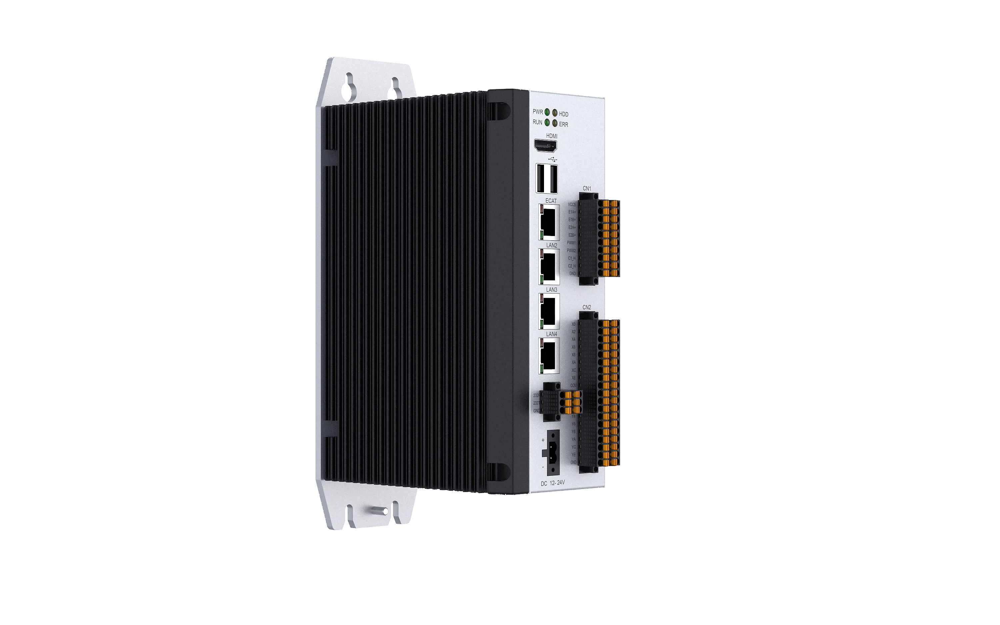
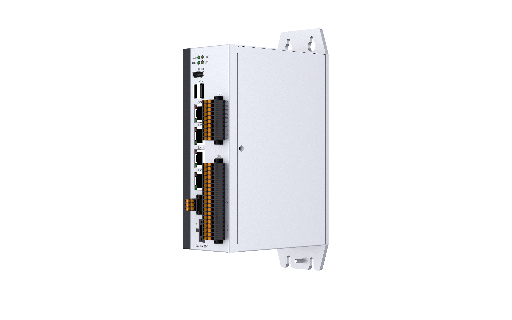
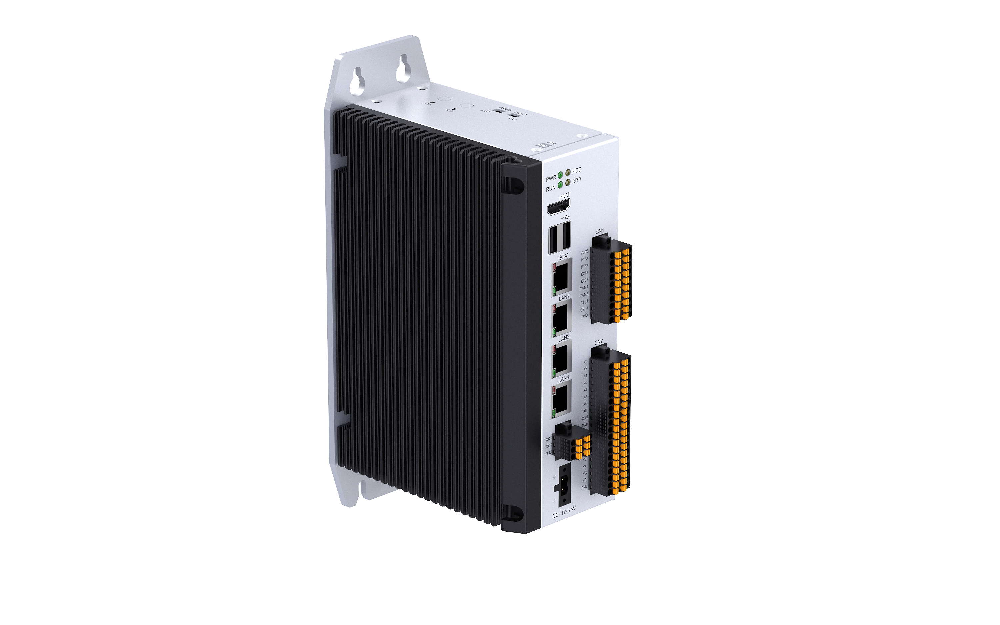

# 工业机器人控制器 C1201

## 产品简介

纳博特 C1201 工业机器人控制系统采用 IPC+RTOS 设计，采用 X86 计算平台和 Linux RT 实时操作系统。

C1201 控制器内置多网口、数字输入/输出端口、RS485/232 COM 接口以及 CAN 接口，方便用户与设备连接。C1201 增加超级电容+管理 IC，当外部掉电后可提供 10s 供电时间。

纳博特自主研发的控制算法，可以支持串联多关节、并联多关节、SCARA、直角坐标、连杆结构等标准构型机器人，还可定制开发特种结构多关节机器人。

因为纳博特优秀的硬件平台和算法能力，NRC 系列控制系统可支持异构多机协作，或最多 64 轴同步运动和插补计算。

目前纳博特已经具备弧焊、氩弧焊、激光焊、电阻焊（点焊）、激光切割、喷涂、点胶、码垛、传送带跟踪等多种通用工艺，并可根据用户需求进行定制工艺开发。

利用 NexDroid OpenAPI 接口，用户也可以自行设计开发工艺系统和人机交互界面，甚至可以自行实现专用的机器人正逆解与轨迹规划算法。

纳博特控制系统已经在上万台工业机器人设备上得到质量验证，其可靠性与稳定性值得客户信赖。

## 产品特点

- **X86 计算平台**：采用 Intel X86 架构处理器，性能强劲，运行稳定
- **Linux RT 实时系统**：搭载 Linux RT 实时操作系统，保障运动控制的确定性与实时性
- **超级电容保护**：外部掉电后可提供 10s 供电时间，防止数据丢失
- **最多 64 轴同步**：支持最多 64 轴同步插补运动，满足大型自动化系统需求
- **多机协作**：支持一台控制器同时控制 4 台工业机器人，程序与参数独立
- **丰富接口**：多网口、16 路 DI、16 路 DO、RS485/RS232、CAN 等接口配置
- **多协议支持**：支持 EtherCAT、Profinet、Ethernet/IP、CAN、OPC-UA、FinsTCP、TCP/IP、ModbusTCP、ModbusRTU

## 技术架构

### 总线型架构，扩展性良好

NRC 系列机器人控制器采用 EtherCAT、Canopen 总线实现伺服主从站连接，支持最多 64 轴同步运动，广泛应用于机器人、CNC 设备的控制。相比传统脉冲控制型方案，大幅降低系统布线与维护成本，可扩展性极佳。

### 轨迹优化，支持多机器人协作且支持二次开发

NRC 支持多机器人协作，能同时完成 4 台工业机器人的协作控制，并支持客户进行二次开发。

## 产品优势

### 接口丰富

C1201 控制器内置多网口、数字输入/输出端口、RS485/232 COM 接口以及 CAN 接口，方便用户与设备连接。

### 真正意义的多机

支持一台控制器同时控制 4 台机器人，每一台机器人的参数、程序相互独立，在运行及远程模式下可以令所有机器人同步运行、停止；在支持一托多的同时也支持每一台机器人搭配任意种类的外部轴，包括地轨、变位机、龙门架；同时支持双机协作模式，可令两台机器人的启停完全同步。

### 自带通用工艺

系统内置上下料、码垛、焊接、焊缝跟踪、视觉、激光切割、传送带跟踪、碰撞检测、拖拽示教等多种通用工艺，并可根据用户需求进行定制。通过使用已经内置的通用工艺功能，用户可以方便快速地实现所需工艺。

## 产品参数

| 项目 | 参数 |
| :--- | :--- |
| 型号 | C1201 |
| CPU | Intel Celeron J6412 2.0GHz |
| 内存 | 4G |
| 电源 | 24V（±10%），增加超级电容+管理 IC，外部掉电后可提供 10s 供电时间 |
| 操作系统 | Linux RT |
| 网口 | 1×EtherCAT，3×Ethernet |
| USB | 2×USB 3.0 |
| 串口 | 1×RS232，1×RS485，带隔离 |
| I/O | 16×隔离 DI，16×隔离 DO |
| CAN | 2×CAN |
| 编码器 | A、B 相差分输入，5V 供电输出，32 位有符号计数，2 路 |
| PWM | 2 路输出，单端，占空比 0-100% 可调，电压 5V 或 24V，频率 2MHz 以内 |
| 示教器 | （选配）T30 机器人专用示教器：8 寸 TFT 全触屏，Linux+QT |
| 控制轴数 | 64 轴同步插补运动 / 串联 6 轴机器人 + 地轨 + 2 轴变位机 × 2 |
| 通讯协议 | EtherCAT、Profinet、Ethernet/IP、CAN、OPC-UA、FinsTCP、TCP/IP、ModbusTCP、ModbusRTU |
| 操作模式 | 示教模式、再现模式、远程模式 |
| 编程方式 | 示教编程、离线编程、拖动示教 |
| 运动功能 | 点到点、直线、圆弧、样条曲线、直线横摆、FLYBY |
| 指令系统 | 运动指令、逻辑指令、输入输出指令、运算指令 |
| 位置控制方式 | 点到点控制、连续轨迹控制 |
| 坐标系统 | 关节坐标系、机器人坐标系、工具坐标系、用户坐标系 |
| 结构算法 | 6 轴串联机器人等 20 余种构型 |
| 应用 | 弧焊、氩弧焊、激光焊、电阻焊（点焊）、冲压、上下料、激光切割、喷涂、点胶、码垛、传送带跟踪等 |

## 产品外观

## 尺寸图

## Q&A

**Q：C1201 最多能控制多少个轴？**

A：C1201 最多支持 64 轴同步插补运动，可满足大型自动化产线和多机协同系统的控制需求。

**Q：C1201 和 C1102 有什么区别？**

A：C1201 采用 Intel Celeron J6412 处理器（X86 架构），C1102 采用 Intel Celeron J1900；两者均支持最多 64 轴同步运动，但 C1201 接口更丰富（3 路 Ethernet vs 1 路，2 路 CAN vs 1 路），且增加了超级电容 10s 断电保护和编码器、PWM 接口。

**Q：C1201 的断电保护功能有什么作用？**

A：C1201 内置超级电容和管理 IC，当外部电源突然中断时，可提供最长 10 秒的后备供电时间，确保控制系统完成数据保存和安全停机，防止因突然断电导致的数据丢失和设备损坏。

**Q：C1201 支持哪些机器人构型？**

A：C1201 支持串联多关节、并联多关节、SCARA、直角坐标、连杆结构等多种标准构型机器人，并可根据用户需求定制开发特种结构多关节机器人。

**Q：C1201 内置了哪些工艺包？**

A：C1201 内置弧焊、氩弧焊、激光焊、电阻焊（点焊）、激光切割、喷涂、点胶、码垛、传送带跟踪、焊缝跟踪、视觉、碰撞检测、拖拽示教等多种通用工艺，并支持定制工艺开发。

**Q：C1201 支持同时控制多台机器人吗？**

A：支持。C1201 支持一台控制器同时控制最多 4 台工业机器人，每台机器人的参数和程序相互独立，并支持双机协作模式，令两台机器人启停完全同步。
