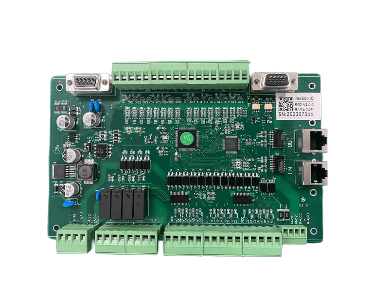

# R4D EtherCAT IO模块

## 产品简介

R4D——多功能，可定制。R4D 是纳博特推出的高性能 EtherCAT 现场总线分布式 IO 模块，尺寸为 122×200mm，支持 100Mbps 总线速率和分布式时钟功能，集成数字量、模拟量、编码器及 CAN 扩展接口，可根据用户需求进行功能定制。

## 产品参数

| 项目 | 参数 |
| :--- | :--- |
| 尺寸 | 122 × 200mm |
| 总线速率 | 100Mbps |
| 分布式时钟 | 支持 |
| 供电 | 24V DC |
| 数字量输入 | 16 入，极性可配 |
| 数字量输出 | 16 出（4 路继电器，12 路 MOS 管） |
| 模拟量输入 | 2 路，0~10V |
| 模拟量输出 | 2 路，0~10V |
| 编码器 | AB 相计数（差分信号接口） |
| 扩展接口 | CAN |
| 工作温度 | 0~60°C |
| 相对湿度 | 95%，无冷凝 |
| 通信周期 | 最小 200us |

## 产品优势

### 多功能

R4D 集成了数字量输入/输出、模拟量输入/输出、编码器接口等多种功能，一台模块即可满足工业现场多种信号类型的接入需求，减少设备种类，简化系统配置。

### 加入 PWM 接口

R4D 支持 PWM 输出功能，可用于调速、调光等应用场景，扩展了模块的应用范围。

### 可定制

R4D 支持根据用户需求进行功能定制，可灵活适配不同应用场景的特定需求。

### 可扩展

R4D 内置 CAN 扩展接口，支持通过 CAN 总线连接更多外部设备，实现系统功能扩展。

### 质量可靠

R4D 采用工业级设计，支持 24V DC 供电，工作温度范围 0~60°C，相对湿度耐受 95%（无冷凝），适应工业现场复杂环境，总线速率 100Mbps，通信周期最短 200us，确保高速稳定的数据传输。

## 产品外观

## Q&A

**Q：R4D 和 R4C 有什么区别？**

A：R4D 和 R4C 尺寸相同（122×200mm），数字输入/输出和模拟量接口配置相同；主要区别在于扩展接口：R4D 配备 CAN 扩展接口，R4C 配备预留 CAN&485 接口（R4C 的接口为预留状态，R4D 的 CAN 接口为正式功能）。

**Q：R4D 支持哪些 EtherCAT 功能？**

A：R4D 支持 100Mbps 总线速率和分布式时钟（DC）功能，最小通信周期可达 200us，可与纳博特控制器及支持标准 EtherCAT 协议的主站设备连接。

**Q：R4D 的编码器接口支持哪些类型？**

A：R4D 支持 AB 相增量编码器输入，采用差分信号接口。

**Q：R4D 支持 PWM 输出吗？**

A：支持。R4D 内置 PWM 输出接口，可用于调速、调光等应用场景。

**Q：R4D 的工作温度范围是多少？**

A：R4D 工作温度范围为 0~60°C，存储温度范围更宽，适合工业现场部署。

**Q：R4D 的 CAN 扩展接口可以连接哪些设备？**

A：R4D 的 CAN 扩展接口可连接支持 CANopen 或自定义 CAN 协议的设备，如传感器、远程 IO 扩展模块、驱动器等。
