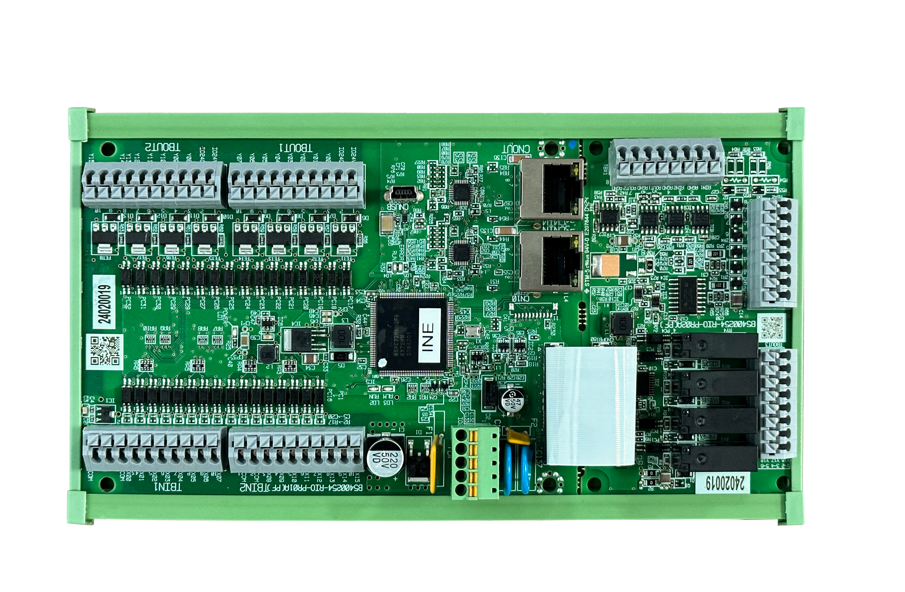

# R5B EtherCAT IO模块

## 产品简介

R5B 是纳博特推出的高性能 EtherCAT 现场总线分布式 IO 模块，支持 100Mbps 总线速率和分布式时钟功能，可与纳博特控制器及主流 EtherCAT 主站无缝对接，实现数字量、模拟量及编码器信号的高速采集与输出。

## 产品参数

| 项目 | 参数 |
| :--- | :--- |
| 尺寸 | 116 × 210.9mm |
| 总线速率 | 100Mbps |
| 分布式时钟 | 支持 |
| 供电 | 24V DC |
| 数字量输入 | 16 入，极性可配 |
| 数字量输出 | 20 出（16 路晶体管 + 4 路继电器） |
| 模拟量输入 | 2 路，0~10V |
| 模拟量输出 | 2 路，0~10V |
| 编码器 | AB 相计数（差分信号接口） |
| 工作温度 | 0~60°C |
| 相对湿度 | 90%，无冷凝 |
| 通信周期 | 最小 200us |

## 产品优势

### 功能拆分

R5B 采用模块化功能设计，将数字量输入、数字量输出、模拟量输入、模拟量输出及编码器接口分别独立实现，用户可根据实际需求灵活配置。

### 功能强大

R5B 配备 16 路数字输入、20 路数字输出（其中 4 路为继电器输出，可承受更高负载）、2 路模拟量输入、2 路模拟量输出，以及 AB 相编码器接口，功能全面，满足多种工业现场需求。

### 稳定性高

R5B 采用工业级设计，支持 24V DC 供电，工作温度范围 0~60°C，相对湿度耐受 90%（无冷凝），适应工业现场复杂环境，总线速率 100Mbps，通信周期最短 200us，确保高速稳定的数据传输。

## 产品外观

## Q&A

**Q：R5B 和 R4D/R4C 有什么区别？**

A：R5B 数字输出为 20 路（16 路晶体管 + 4 路继电器），R4D/R4C 为 16 路（4 路继电器 + 12 路 MOS 管）；R5B 尺寸为 116×210.9mm，比 R4D/R4C（122×200mm）略大；R5B 特别适合激光焊接等需要更多数字输出通道的应用场景。

**Q：R5B 支持哪些 EtherCAT 功能？**

A：R5B 支持 100Mbps 总线速率、分布式时钟（DC）功能，最小通信周期可达 200us，可与纳博特控制器及支持标准 EtherCAT 协议的主站设备连接。

**Q：R5B 的编码器接口支持哪些类型？**

A：R5B 支持 AB 相增量编码器输入，采用差分信号接口。

**Q：R5B 的继电器输出有什么优势？**

A：R5B 提供 4 路继电器输出，相比晶体管和 MOS 管输出，继电器可承受更高的负载电流和电压，适合驱动接触器、电磁阀等感性负载。

**Q：R5B 的工作温度范围是多少？**

A：R5B 工作温度范围为 0~60°C，存储温度范围更宽，适合工业现场部署。
