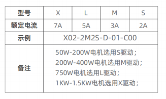
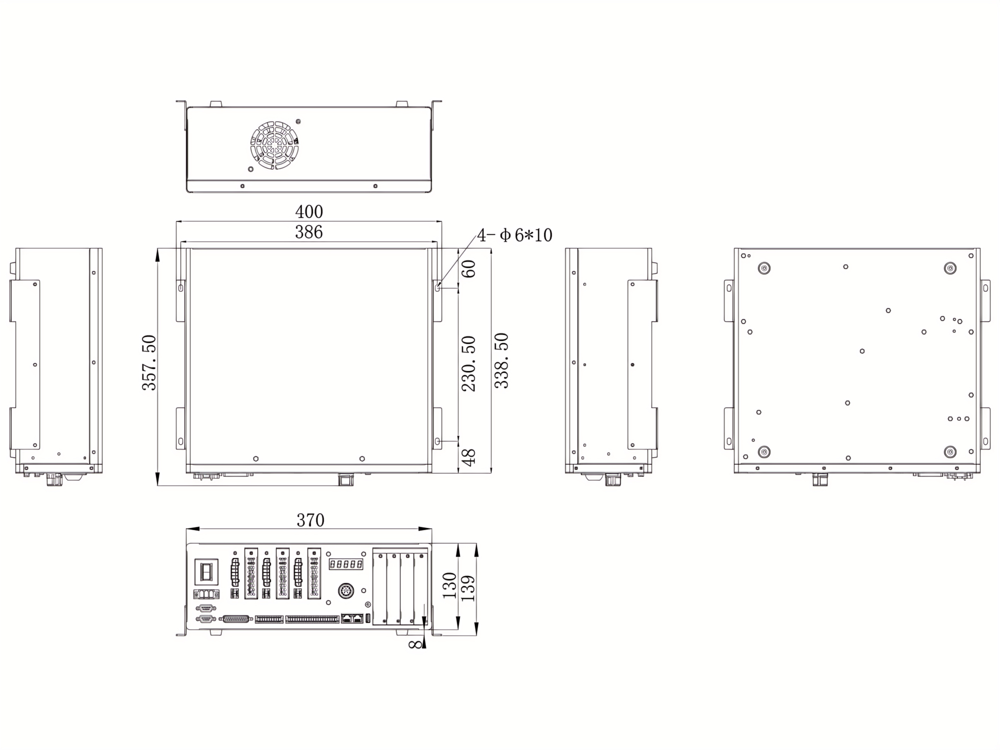
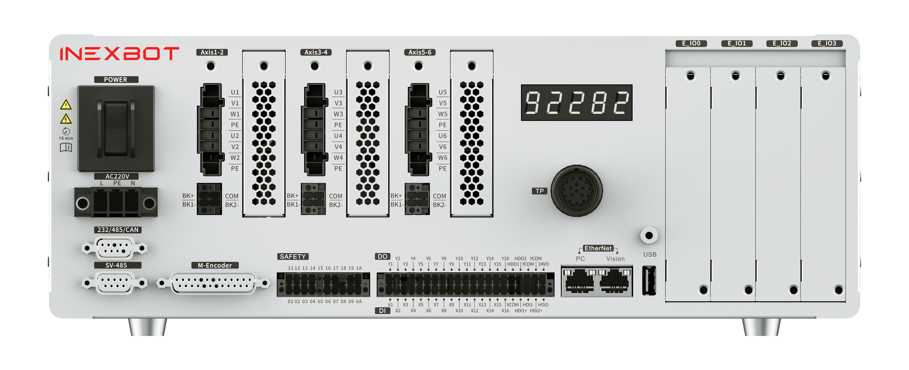

# X02驱控一体柜

## 产品简介

X02 驱控一体柜是纳博特面向协作机器人应用推出的紧凑型控制柜产品，体积小巧，以小见大，适用于多种工业自动化场景。

## 产品参数

| 产品 | 参数 |
| :--- | :--- |
| 电源输入 | 220V 10A |
| 网口 | 1×EtherCAT，2×Ethernet |
| USB | 1×USB 2.0 |
| COM | 1×RS232，1×RS485，带隔离 |
| I/O | 16×隔离 DI，16×隔离 DO，2AI（-10V~10V），2AO（0V~10V） |
| CAN | 1×CAN |
| 尺寸 | 357.5mm × 370mm × 130mm |
| 编码器 | 2路增量式编码器 ABZ（速率 4Mbps，差分输入），非隔离 |
| 示教器 | （选配）T30-X 协作机器人专用示教器：8 寸 TFT 全触屏，Linux+QT |
| 通讯协议 | EtherCAT、Profinet、Ethernet/IP、CAN、FinsTCP、TCP/IP、ModbusTCP、ModbusRTU |
| 操作模式 | 示教模式、再现模式、远程模式 |
| 编程方式 | 示教编程、离线编程、拖动示教 |
| 坐标系统 | 关节坐标系、机器人坐标系、工具坐标系、用户坐标系 |
| 应用 | 弧焊、氩弧焊、激光焊、电阻焊（点焊）、冲压、上下料、激光切割、喷涂、点胶、码垛、传送带跟踪等 |
| 防护等级 | IP20 |
| 整机重量 | 4轴：8kg；6轴：9kg |

## 选型指南

### 解释

根据机器人轴数和负载需求选择合适的配置。

### 支持编码器类型

| 类型 | 分辨率 |
| :--- | :--- |
| 多摩川 | 17/23 |
| 安驰 | 17/23 |

## 布局尺寸

产品布局及尺寸请参见下图：

## 产品优势

### 体积小巧，以小见大

X02 驱控一体柜采用紧凑型设计，体积小巧，节省安装空间，适合空间受限的工业现场部署。

### 生产安全，有力保障

配备完善的安全保护机制，保障人机协作安全。

### 多项工艺，一台就行

内置多种通用工艺，支持弧焊、上下料、喷涂、点胶等多种应用，一台控制柜满足多项生产需求。

### 智控赋能，柔性生产

支持示教编程、离线编程、拖动示教等多种编程方式，配合智能控制算法，实现柔性化生产。

## 产品外观

## Q&A

**Q：X02 支持几轴机器人？**

A：X02 驱控一体柜支持 4 轴和 6 轴协作机器人，整机重量分别为 8kg 和 9kg。

**Q：X02 的通讯接口有哪些？**

A：X02 配备 1×EtherCAT、2×Ethernet、1×RS232、1×RS485（带隔离）、1×CAN，以及 16×隔离 DI、16×隔离 DO、2×AI、2×AO。

**Q：X02 支持哪些编码器？**

A：X02 支持多摩川和安驰的增量式编码器，分辨率为 17 位或 23 位。

**Q：X02 的防护等级是多少？**

A：X02 防护等级为 IP20，适用于一般室内工业环境。

**Q：X02 可以选配示教器吗？**

A：可以。X02 支持选配 T30-X 协作机器人专用示教器，采用 8 寸 TFT 全触屏，搭载 Linux+QT 系统。
