---

title: "冲压工艺3.0手册"

description: "冲压工艺机器人操作与参数设置完整指南"

author: "iNexBot"

date: "2026-08-11"

tags: ["冲压自动化", "模板配置", "工艺参数", "码垛", “卸垛”，"故障处理", "IO定义"]

category: "操作手册"

version: "1.0.0"

language: "zh-CN"

---
## 主界面

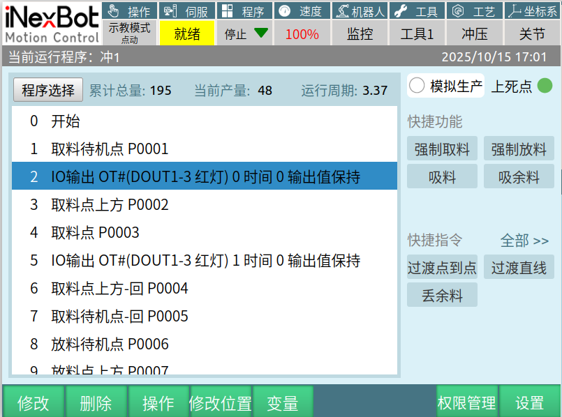

当前运行程序：显示当前打开的程序名称。

程序选择：点击程序选择，可选择已经创建的程序。

累积总量：机器人从第一次生产，到当前生产的总数量。

当前产量：机器人进行一次取料放料冲压，计数一次。（无冲床，完成一次取料放料，回到取料待机点。）长按当前产量，两秒后清除产量数值。

运行周期：机器人从取料待机点运行到放料待机点所用的时间。（有冲床则加上冲床冲压时间。）

模拟生产：选中后，运行程序，只走生产的轨迹，冲床不进行冲压。

放料上死点：冲床在上死点时，显示为绿色，未在上死点显示为红色。（放料工位是冲床，显示上死点状态，选择中转台则不显示上死点。）

### 快捷功能

强制取料：点击强制取料，机器人会执行一次取料过程。

强制放料：点击强制放料，机器人会执行一次放料过程。

吸料：控制主吸料Y05进行取料放料。

吸余料：控制副吸料Y06进行取料放料。

### 快捷指令

过渡点到点：在程序里面插入关节插补点位。

过渡直线：在程序里面插入直线插补点位。

丢余料：在程序里面插入丢余料指令，作用：用来控制副吸料吸盘关闭。

先在程序内选中需要插入过渡点的上一条指令，再把机器人移动到需要过渡的点位，点击过渡点到点，就将当前机器人的位置插入程序中。

全部：点击全部可跳转到指令插入界面。

底侧状况栏

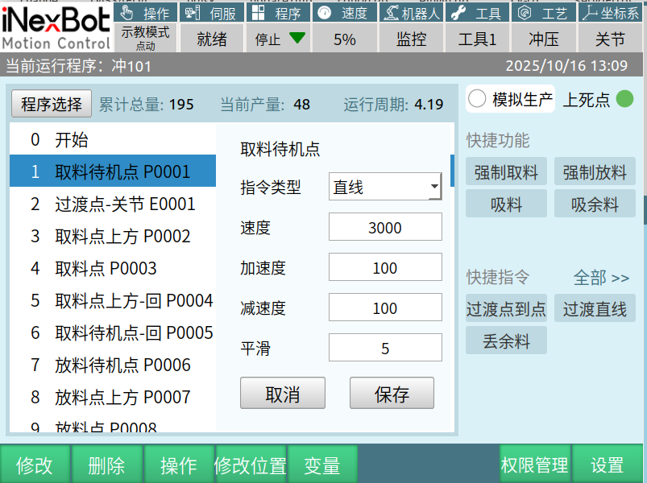

修改：用于修改插补方式、指令速度，加速度，减速度，平滑。

删除：用于删除新插入的指令，不可删除标定后生成的冲压指令。

操作：点击操作后，可对非冲压类指令，进行批量操作、复制、粘贴、剪切、上移、下移、注销等操作。

修改位置：将机器人当前位置写入指令点位内。（只能修改带点位指令）

变量：点击变量，可进入局部变量界面（如下图所示），对已创建的点位和数值进行操作。

权限管理：点击权限管理，进入用户登录页面，用户权限分为三种：操作员、技术员、管理员。

设置：点击设置可进入参数设置界面，对冲压工艺参数进行修改。

## 程序创建

创建示例

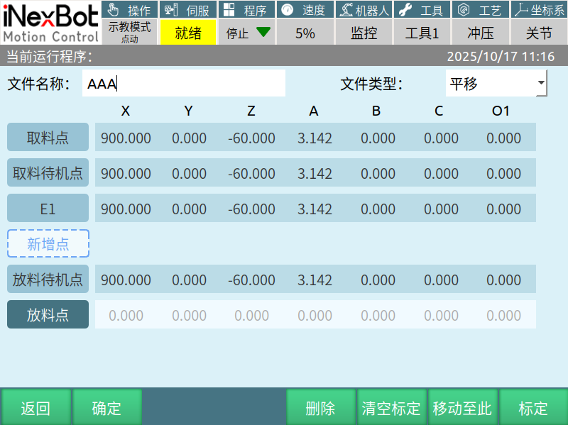

以上图平移为例，

第一步：点击程序选择——点击新建，进入上图界面，选择文件类型平移

第二步：点击取料点，选中后，再点击标定，机器人当前点位就写入了取料点中，标定后就会显示点位信息。

第三步：按照第二步流程依次标定其余点位，如果需要添加新的点位，可以点击新增点添加过渡点进去。

第四步：写入文件名称，注意不要和已创建的名字重叠，否则无法保存。

第五步：点击确定，就创建好了程序。界面会跳转到主界面。

### 文件类型

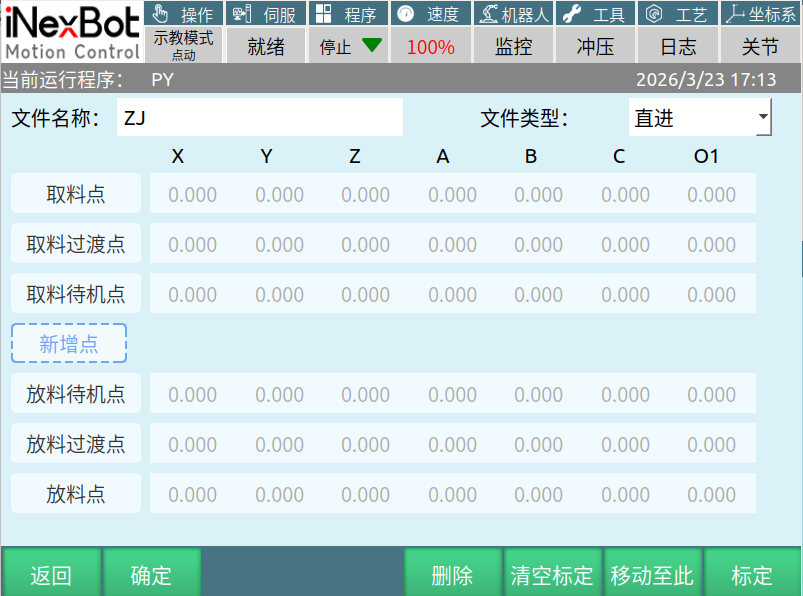

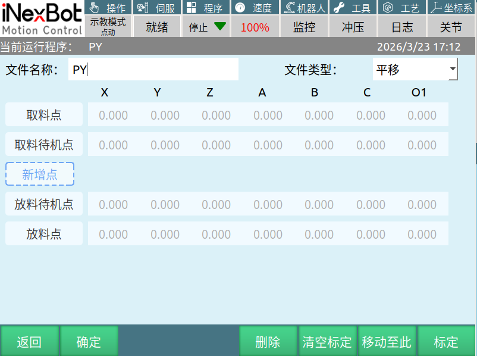

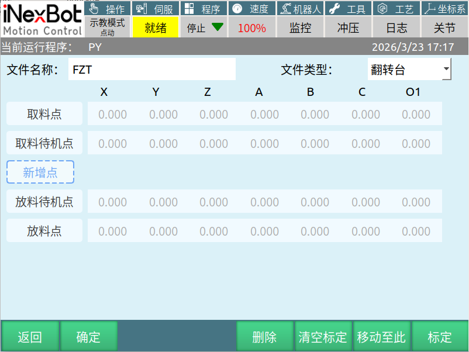

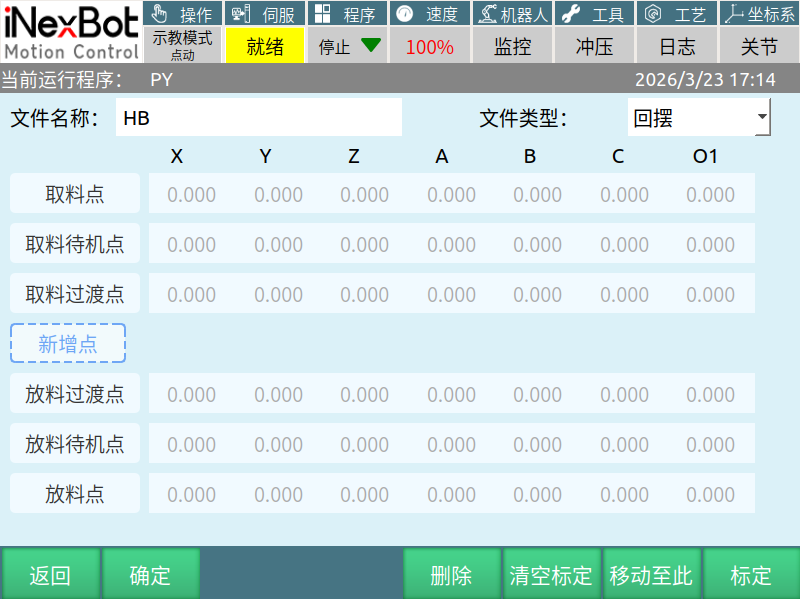

## 工艺参数

### 上料机

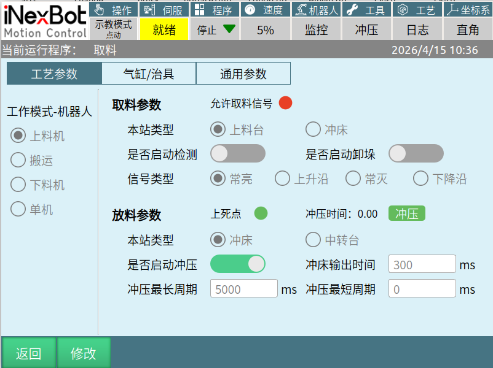

#### 取料参数——上料台

是否启动检测：打开开关，按照信号类型进行检测，关闭则不检测。

信号类型：

1. 常亮：X13信号置1。

2. 上升沿：X13信号从0置1。

3. 常灭：X13信号置0。

4. 下降沿：X13信号从1置0。

是否启动卸垛：打开后，会调用卸垛功能，关闭则卸垛功能不生效。

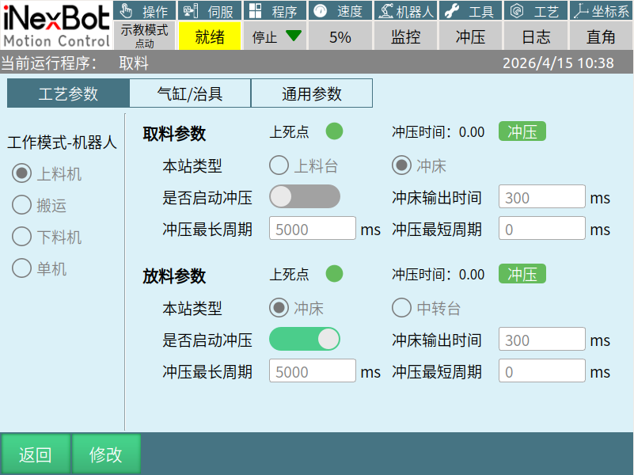

#### 取料参数——冲床

#### 同放料参数——冲床

用于控制取料冲床使用。

#### 放料参数——冲床

上死点：冲床位于上死点时，显示为绿色，没在上死点显示为红色。

冲压时间：记录冲床进行一次冲压的时间。

冲压（强制冲压按钮）：点击冲压按钮，冲床会进行一次冲压。（只在管理员模式下可用）

是否启动冲压：打开，机器人运行过程中会启动冲床，关闭则不会启动冲床。

冲床输出时间：数值设置为800（单位：ms）时，冲床启动信号会维持800ms后关闭。

冲压最长周期和最短周期：冲床冲压一次的时间范围，不在这个范围内，视为冲压异常。

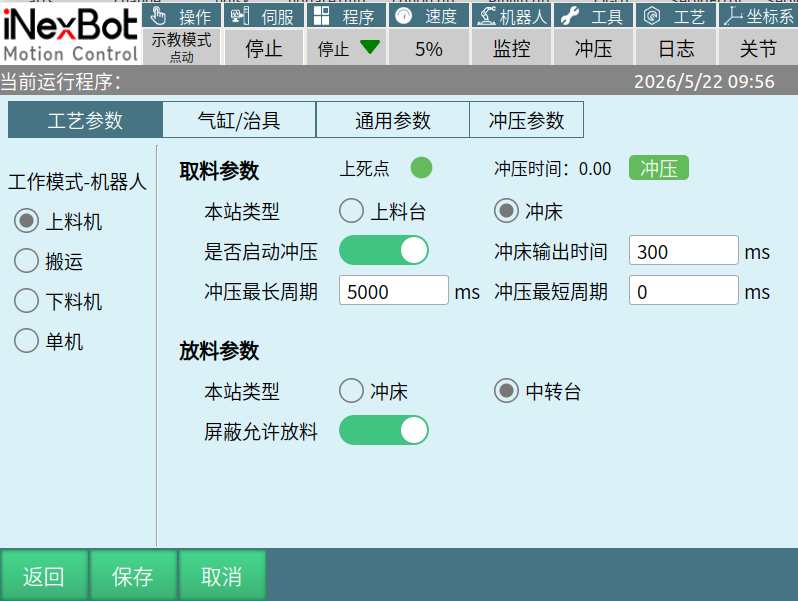

#### 放料参数——中转台

放料参数选择中转台，机器人不会启动冲床和判断冲床上死点，只判断允许放料信号。

屏蔽允许取料信号：打开后，上料机机器人，放料的时候，不再判断允许放料信号。关闭则会在放料待机点判断允许放料信号。

### 搬运

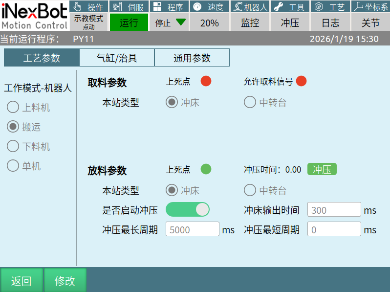

#### 取料参数——冲床

上死点：取料冲床位于上死点时，显示为绿色，未处于上死点显示为红色。

允许取料信号：X13信号置1时，信号灯显示为绿色，置0时显示为红色。

#### 取料参数——中转台

选择中转台，不显示上死点和允许取料信号灯。不进行冲压上死点判断，只判断允许取料信号。

#### 放料参数——冲床

同上料机放料参数——冲床

#### 放料参数——中转台

放料参数选择中转台，机器人不会启动冲床和判断冲床上死点，只判断允许放料信号。

### 下料机

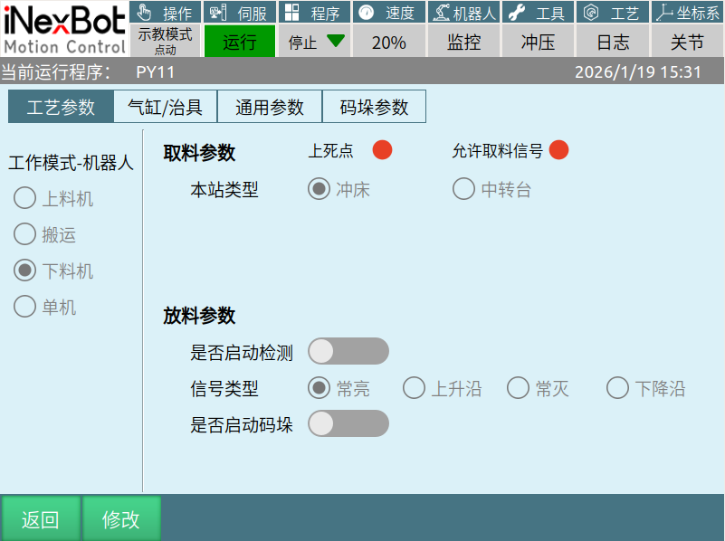

#### 取料参数——冲床

上死点：冲床位于上死点时，显示为绿色，未处于上死点显示为红色。

#### 允许取料信号：X13信号置1时，信号灯显示为绿色，置0时显示为红色。

#### 取料参数——中转台

选择中转台，不显示上死点和允许取料信号灯。不进行冲压上死点判断，只判断允许取料信号。

#### 放料参数

是否启动检测：打开开关，按照信号类型进行检测，关闭则不检测。

信号类型：

1. 常亮：X14信号置1。

2. 上升沿：X14信号从0置1。

3. 常灭：X14信号置0。

4. 下降沿：X14信号从1置0。

是否启动码垛：打开后，调用码垛功能，关闭则码垛功能不生效。

注意：上料机的放料工位，选择冲床，下一台机器人的取料工位，一定要与上料机放料工位的本站类型（指冲床和中转台选项）保持一致。

### 单机

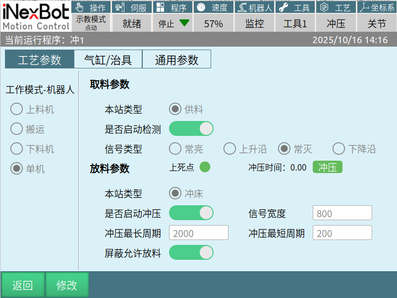

#### 取料参数

本站类型：供料（只有这一个选项）

是否启动检测：打开开关，会按照所选择的信号类型，获取允许取料信号。关闭则不再检测X13信号。

信号类型：

1. 常亮：X13信号置1。

2. 上升沿：X13信号从0置1。

3. 常灭：X13信号置0。

4、下降沿：X13信号从1置0。

#### 放料参数——冲床（只有冲床一种）

同上料机放料参数——冲床

屏蔽允许放料：打开后，不检测允许放料信号X14，关闭则检测允许放料信号X14。

## 气缸/治具

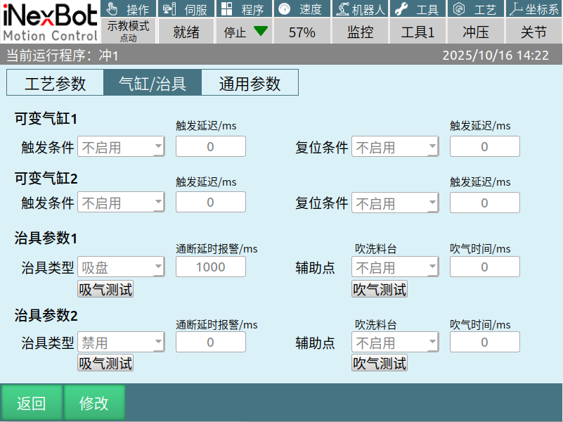

可变气缸1：暂未做功能

可变气缸2：暂未做功能

### 主治具

治具类型：1、吸盘2、电磁铁3、气缸4、禁用

吸盘判断逻辑：在取料点打开主副吸料开关并判断是否构成真空，在放料点关闭并判断是否破空。

电磁铁判断逻辑：跟吸盘的区别是在放料点上方－回，判断是否破空。

吸气测试：点击吸气测试，主吸料Y05会输出信号。

通断延时报警/ms：填写数值后（单位：ms），机器人吸盘吸料检测时间。

辅助点——吹洗料台：1、不启用2、启用。

吹气测试：点击吹气测试控件，主吹气Y07会输出信号。

吹气时间/ms：填写数值后（单位：ms），主吹气Y07会输出相应的时间。

### 副治具

治具类型：1、吸盘2、电磁铁3、气缸4、禁用。

吸盘判断逻辑：在取料点打开主副吸料开关并判断是否构成真空，在放料点关闭并判断是否破空。

电磁铁判断逻辑：跟吸盘的区别是在放料点上方回，判断是否破空。

吸气测试：点击吸气测试控件，副吸料Y06会输出信号。

通断延时报警/ms：填写数值后（单位：ms），机器人吸盘吸料检测时间。

辅助点——吹洗料台：1、不启用2、启用。

吹气测试：点击吹气测试控件，副吹气Y08会输出信号。

吹气时间/ms：填写数值后（单位：ms），副吹气Y08会输出相应的时间。

注：当关闭真空检测开关时，机器人会按照治具1、2的通断延时报警数值，选择较大的数值，在取料点和放料点位置停留相应的时间。

当打开真空检测开关时，机器人吸到料，直接离开取料点，或者放完料直接离开放料点。取料点未吸到料，会运行到取料待机点-回，报真空检测失败；放料点放料失败，会回到放料待机点－回，报破空检测失败。

## 码垛参数

### 卸垛参数

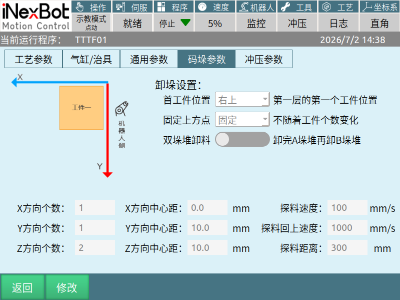

双垛堆卸料：卸两垛料。

X方向个数：首工件X方向工件数量。

Y方向个数：首工件Y方向工件数量。

Z方向个数：工件总个数（填写数值大于实际工件个数即可）

X方向中心距：X方向工件中心之间的距离。（对应工件宽度或者长度，单位：mm）

Y方向中心距：Y方向工件中心之间的距离。（对应工件宽度或者长度，单位：mm）

Z方向中心距：Z方向工件中心之间的距离。（对应工件厚度，单位：mm）

探料距离：填垛堆的厚度。单位：mm。

探料回上速度：探到料后回取料点上方的速度，单位：mm/s。

探料速度：范围：1-100，单位：mm/s。

实际使用：

卸垛工件计数逻辑：正常取放料过程中，在取料点构成真空，并在放料点构成破空，卸垛工件加1。

探料生效逻辑：取料的时候，在取料点未构成真空，提示取料失败并开始探料，探料过程中构成真空后，机器人会继续往下去放料。

双垛堆卸料开关打开后如下图所示：

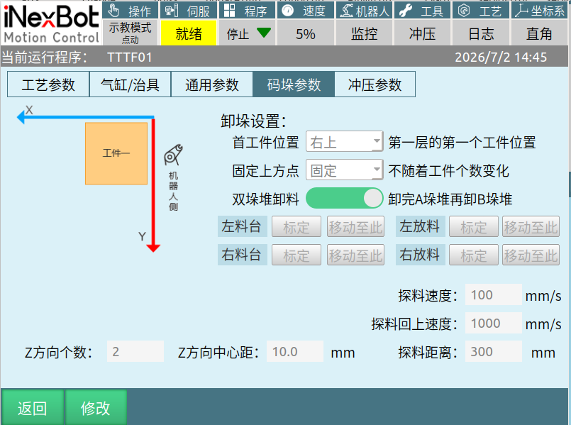

左料台：第一个垛堆的取料点位置

右料台：第二个垛堆的取料点位置

左放料：第一个垛堆的放料点位置

右放料：第二个垛堆的放料点位置

开启后会新增两个垛堆有料的输入信号方别是X09,X10两个信号，用来判断垛堆是否有料。

### 码垛参数

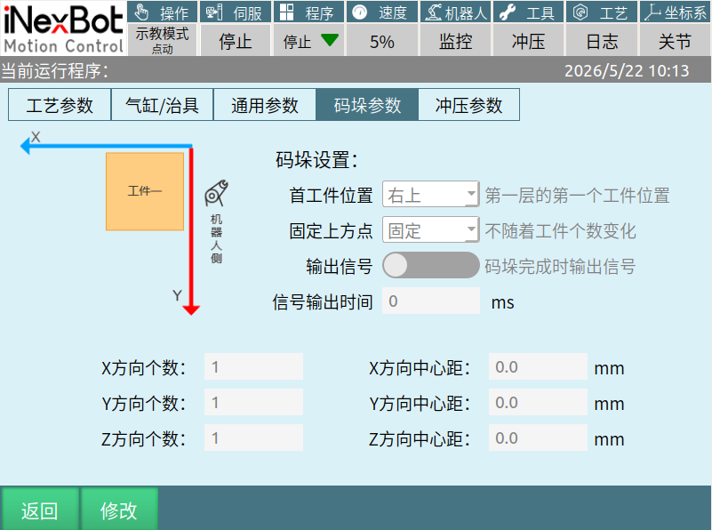

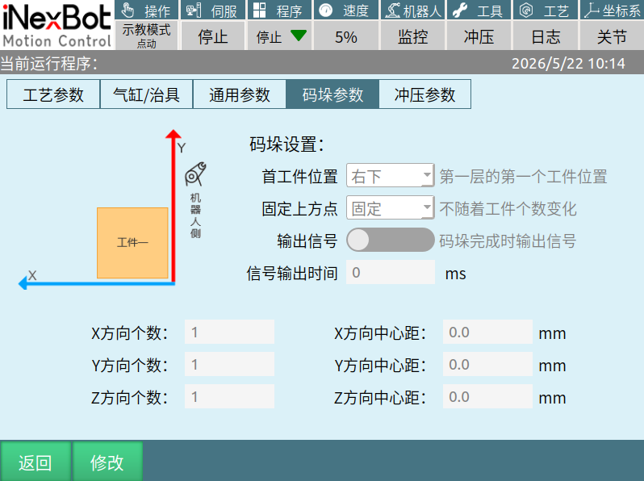

首工件位置：右上、右下。如上图所示。

输出信号：打开后，码垛完一次，Y17输出。关闭则不会输出。（此功能需要配合传送带使用，打开后码垛完成自动复位，并重新开始码垛。）

信号输出时间：Y17输出信号维持的时间，单位：ms。

X方向个数：首工件X方向工件数量。

Y方向个数：首工件Y方向工件数量。

Z方向个数：垛堆工件数量。

X方向中心距：X方向工件中心之间的距离。（对应工件宽度或者长度，单位：mm）

Y方向中心距：Y方向工件中心之间的距离。（对应工件宽度或者长度，单位：mm）

Z方向中心距：Z方向工件中心之间的距离。（对应工件厚度，单位：mm）

码垛示例：

如图所示：X方向工件数量为2，Y方向工件数量为2，Z方向数量为1。XYZ方向中心距为100mm，即长宽高都是100mm的正方体工件，首工件位置为右下。

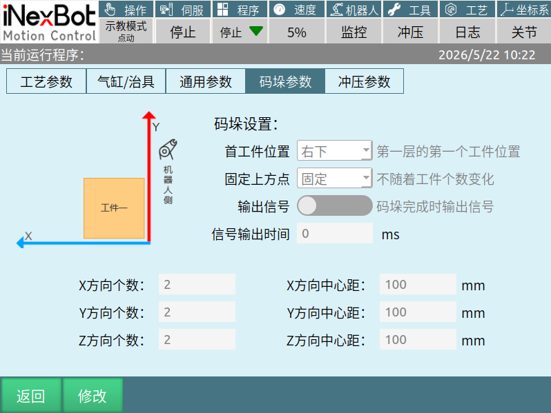

码垛顺序如图工件序号所示，XY为机器人X、Y轴+方向。

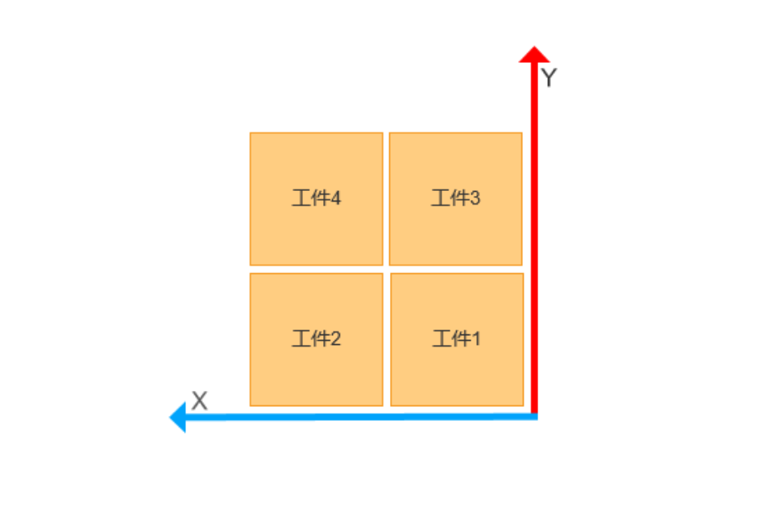

码垛顺序：第一层工件1→第一层工件2→第一层工件3→第一层工件4→第二层工件1→第一层工件2→第一层工件3→第一层工件4。

注：卸垛只在上料机工作模式下生效，码垛只在下料机工作模式下生效。

使用完整码垛，启用后会把辅助点、工件点设置的点位，调用到生成模板中的放料点上方和放料点位置。

## 冲压参数

界面打开关闭逻辑：长按右上角时间下面的位置2秒，此界面会显示出来，再长按两秒此界面隐藏。

### 功能启用

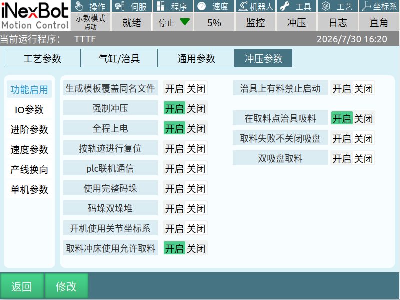

生成模板覆盖同名文件：打开后，在示教编程界面，标定后生成的文件可直接覆盖旧的同名作业文件。关闭则不生效。用于重新创建的文件，直接覆盖旧命名的文件。

强制冲压：打开后，工艺参数内的冲压时间后面，显示强制冲压按钮，关闭则不显示。主要用于防止工人误操作。

全程上电：打开后，按下伺服键就直接上电，关闭后，按下伺服键，会显示就绪状态。用于T34、T41无伺服使能键的示教器。

按轨迹进行复位：开启后，按复位键，机器人会按照指令轨迹，回到取料待机点或者放料待机点。关闭后，按复位键，机器人会按照ZXY各轴依次进行复位，回到取料待机点或者放料待机点。打开用于六轴串联多关节机器人的复位，关闭则用于摆臂机器人的复位。

PLC联机通信：开启后，允许取料、允许放料由Modbus控制，io接线信号失效。用于PLC控制机器人之间允许取料、允许放料、放料完成、取料完成信号的交互。多用于PLC总控控制机器人之间的信号交互。

使用完整码垛：开启后，码垛功能会调用完整码垛工艺，相较于打开前的码垛工艺，参数更详细。关闭后，依旧使用之前的码垛功能。用于多个垛堆或者垛堆负杂的场景。

码垛双垛堆：开启后可调用完整码垛的工艺1和工艺2。关闭后只能调用完整码垛的工艺1。

开机使用关节坐标系：打开后，断电重启或者软重启，机器人默认为关节坐标系，关闭则默认为直角坐标系。

取料冲床使用允许取料：打开后上料机获取到允许取料信号，就直接启动冲床，关闭后，不判断允许取料信号，取料完成就直接启动冲床，多用于卷料的冲压。

治具上有料禁止启动：打开后主吸盘真空置1，启动就会警告启动时手上不能有料，关闭后正常启动使用。

在取料点治具吸料：打开后吸盘会在取料点，打开吸盘吸气。关闭后，会在取料上方点打开吸盘吸气。用于气管过长，启动后真空泵需要时间的现场。

取料失败不关闭吸盘：正常机器人报真空检测失败后，会关闭主副吸料输出，打开后，报真空检测失败也不会关闭主副吸料输出。用于检测机器人是否打开了主治具真空，多用于经常性报真空检测超时的场景。

双吸盘取料：打开后，取料前会检测两个治具是否都有料或者无料，主副治具状态，不一致就会报出警告进行提示。用于单个吸盘吸力不足或者工件比较重的场景。

### IO参数

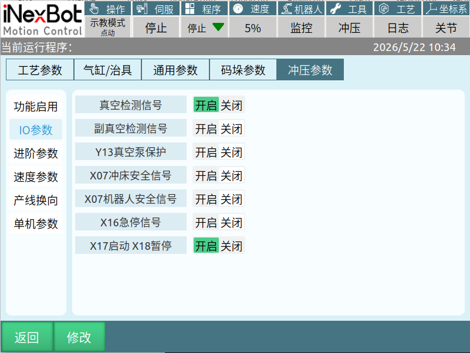

真空检测信号：用于检测主治具取放料情况，打开后，检测到掉料问题或者放料粘料问题时，会报错，关闭则不检测也不报错。

副治具真空检测信号：用于检测副治具取放料情况，打开后，检测到掉料问题或者放料粘料问题时，会报错，关闭则不检测也不报错。

Y13真空泵保护：开启：运行程序就会打开Y13。机器人处于停止状态时，机器人手上有料，Y13输出信号会一直保持打开状态，机器人手上无料，10分钟后会关闭Y13输出信号。用于关闭真空泵。

X07冲床安全信号：开启此功能，冲床启动前会判断一次X07信号，X07置1，正常启动冲床，未置1则不启动冲床并报错。用于冲床启动前的安全判定。大多将传感器放在机器人一轴下，确保机器人大臂处于安全范围；

X07机器人安全信号：开启后，输出放料完成前会判断此信号，X07有信号则正常输出放料完成信号，没信号则不输出放料完成信号并报错。用于大负载机器人，提前启动冲床，在安全位置输出放料完成信号，防止机械臂相撞。（不能和X07冲床安全信号同时使用。）

X16急停信号：开启：X16信号置1，报紧急急停，关闭： X16信号置1，不报错。（报错信号可改为置0生效，需要通过修改控制器配置文件生效。）

X17启动X18暂停：打开后，X17--IO启动功能生效，该信号置1，启动机器人，X18--IO暂停功能生效，该信号置1，当前程序运行结束后，在取料待机点暂停。用于通过IO控制器机器人的启动与暂停。

#### 进阶参数

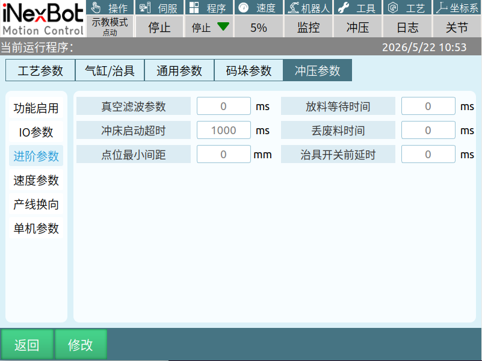

真空滤波参数：设置相应的时间，会过滤掉主治具真空信号干扰。主要用于过滤外部环境导致的主治具真空干扰。最大可填300。

冲压启动超时：冲床启动信号发出后，在设定的时间内，冲床上死点没有发生变化，就会报错提示。用于检测冲床启动状态。

点位最小间隔：启动程序时，会对比取料待机点到取料点上方的距离，放料待机点到放料点上方的距离，如果Y值的距离小于设置距离，会报错。填0功能不生效。用于防止点位设置错误，导致的撞机问题。

放料等待时间：在放料点停留的时间，单位：ms，主要用于防止粘料。

丢废料时间：在丢余料指令，停留的时间，单位ms。防止废料粘料。

治具开关前延时：打开后，机器人会在取料点停留设置的时间后，才打开主副治具开关，在放料点停留设置的时间后，才关闭主副治具开关。用来防止机器人末端停止时抖动导致料吸歪或者放歪。

### 速度参数

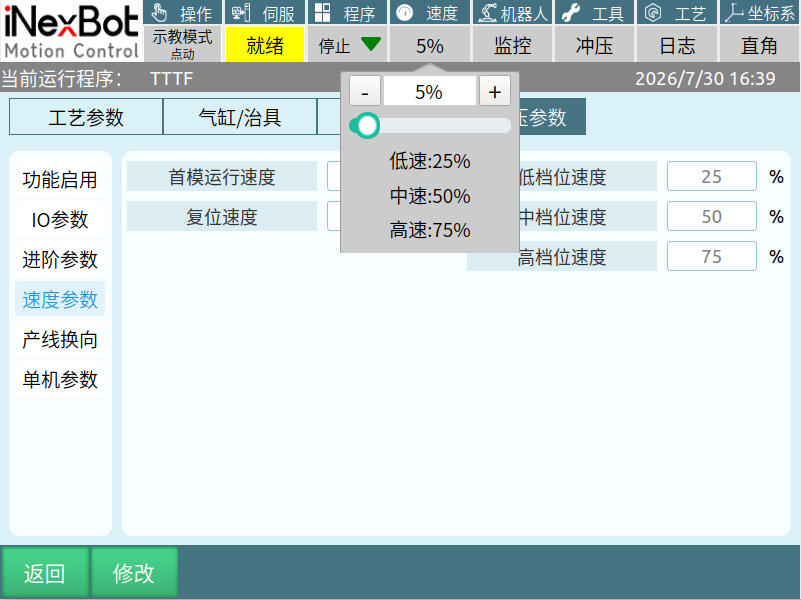

首模运行速度：机器人停止后（包含报错停止、切模式停止和断电重启后的停止。），再次启动，第一次运行速度按照首模运行速度运行。设置的参数范围为1-100，机器人实际速度=全局速度百分比×首模速度百分比。

复位速度：使用复位功能时，按照此速度来复位。复位速度20%=全局速度20%。

低档位速度：点击全局速度后，下拉栏低速的速度百分比。

中档位速度：点击全局速度后，下拉栏中速的速度百分比。

高档位速度：点击全局速度后，下拉栏高速的速度百分比。

### 产线换向

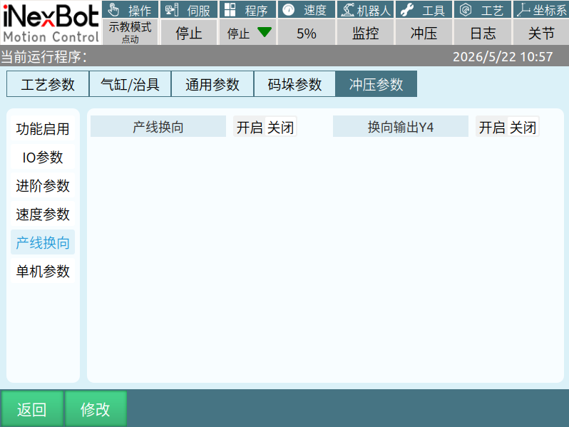

产线换向：打开后，不用换线就可以进行换向处理，需要提前将两个冲床模式和两个冲床启动线接好，首尾两台机器人，需要更换工艺参数内的工作模式。关闭则还原为原来的样子。用于产线反向使用。

换向输出Y4：开启后，开启产线换向功能，IO输出端口Y4会输出，关闭则不会输出。用于判断当前是否使用了反向功能，多用于PLC读取反向状态。

### 单机参数

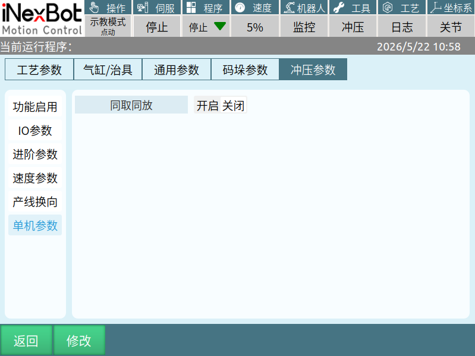

#### 同取同放：开启后，机器人会在取料待机点等待冲床冲压结束。关闭后则不等待。开启后，用于单台机器人，取料的时候，同时取取料台的料和冲床内冲压好的料，放料时，同时放未冲压的料到冲床内和已冲好的料到料框内。关闭后，用于单台机器人一次取放一张料的情况。

### 电磁铁参数

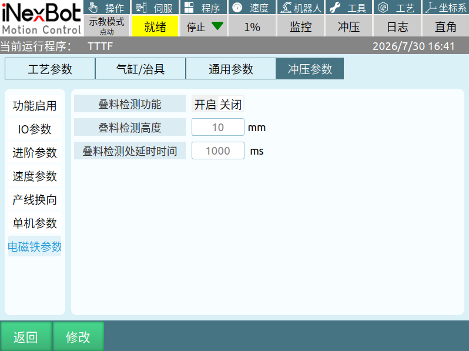

叠料检测功能：打开后会在取放料回上的时候，检测是否有叠料问题。

叠料检测高度：设置在取放料点到取放料上方点之间，不能高于取放料点到取放料回上点的高度。

叠料检测处延时时间：设置后，会在叠料检测处停留设置的时间。用于检测是否叠料。

## 运行逻辑

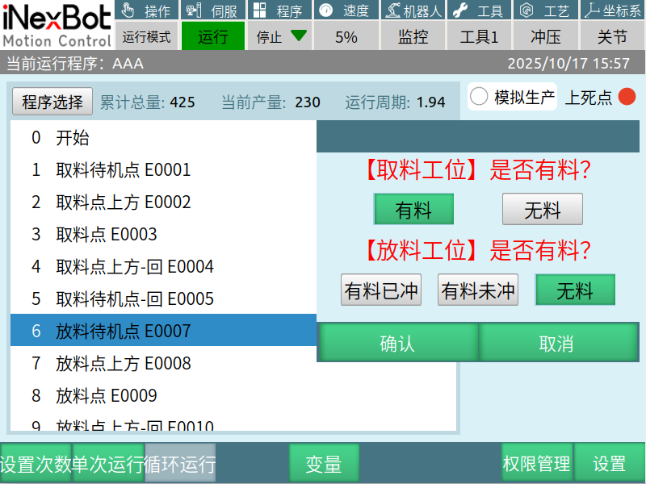

### 机器人手上无料时

取料工位－－有料：本站机器人会直接去取料不进行信号判断。

取料工位－－无料：会判断前站是否满足允许取料信号，再去取料。

### 机器人手上有料时（先放后取再放）

放料工位－－无料：会在放料待机点等待允许放料信号，获取到信号后，继续进行放料。

放料工位－－有料未冲：本站会发出冲床启动信号让冲床进行一次冲压，机器人会在放料待机点等待允许放料信号，获取到信号后，继续进行放料。

放料工位－－有料已冲：机器人会在放料待机点等待允许放料信号，获取到信号后，继续进行放料。选择有料已冲时，下工位机器人手上无料，下工位机器人会直接过去取料。

### 启动示例

本站为搬运，取料工位是冲床，放料工位是中转台时，启动程序，弹窗如下图所示：

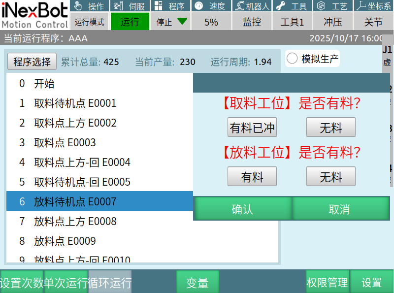

1. 机器人手上无料时

取料工位－－有料已冲：本站机器人会判断冲床是否在上死点后，再去取料。

取料工位－－无料：本站机器人会等待允许取料信号满足后，再去取料。

2. 机器人手上有料（先放后取再放）

放料工位－－无料：机器人会直接过去放料。

放料工位－－有料：机器人会等待下工位发出取料完成信号后，再去放料。

## IO定义

### 监控

路径：最上方导航栏，速度旁边的监控，点击一下就出现下图。

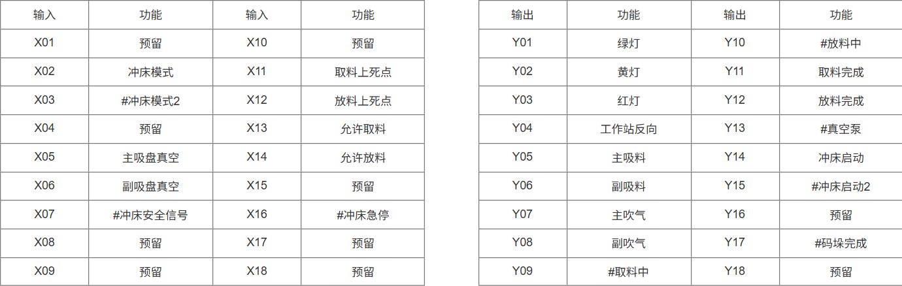

### IO端口说明

X02冲床模式：接放料工位的冲床，当程序运行时，X02需要处于置1状态，该信号发生变化，就会报冲床模式错误。

X03冲床模式2：需要使用换向功能时，接取料冲床。功能与X02一致。

X05主吸盘真空：接主吸盘，主吸盘与工件之间处于负压时，该信号置1，一般用于吸取需要放到下一工位的主料。

X06副吸盘真空：接副吸盘，副吸盘与工件之间处于负压时，该信号置1，一般用于吸取余料（需要丢弃不用的废料）

X11取料上死点：接取料工位冲床，用于检测冲床的上死点信号，当冲床处于上死点时，该信号置1，该信号不置1时，本站不会去取料工位取料。

X12放料上死点：接放料工位的冲床，用于检测冲床的上死点信号，当冲床处于上死点时，该信号置1，该信号不置1时，本站不会去放料工位放料。

X13允许取料：接上一台控制器的Y12，当X13从0置1时，本站机器人会去取料工位取料。

X14允许放料：接下一台控制器的Y11，当X14从0置1时，本站机器人会去放料工位放料。

X16紧急急停：可接示教器上的急停，当该信号置1时，报紧急停止被触发，信号置0时，报错才可以被清掉。

Y05主吸料：用于控制主吸盘吸气，该信号置1时，主吸盘吸气，吸取物料，信号置0，吸气停止。

Y06副吸料：用于控制副吸盘吸气，该信号置1时，副吸盘吸气，吸取物料，信号置0，吸气停止。

Y11取料完成：接上一台控制器的X14，Y11信号置1时，表示本站取料完成。

Y12放料完成：接下一台控制器的X13，Y12信号置1时，表示本站放料完成，放料完成逻辑：1、放料工位是冲床，本站机器人将料放到，放料冲床内，冲床进行冲压结束后，输出放料完成信号。2、放料工位为中转台，本站机器人在放料点，放料结束后，回到放料待机点－回指令，输出放料完成信号。

Y14冲床启动：接放料工位冲床，用于启动冲床进行冲压。

Y15冲床启动2：需要使用换向功能的时候，接取料冲床，用于启动冲床。

### 接线示例

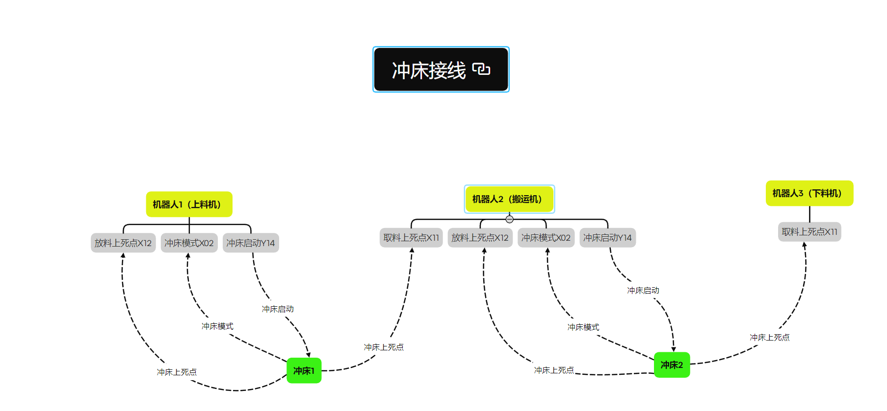

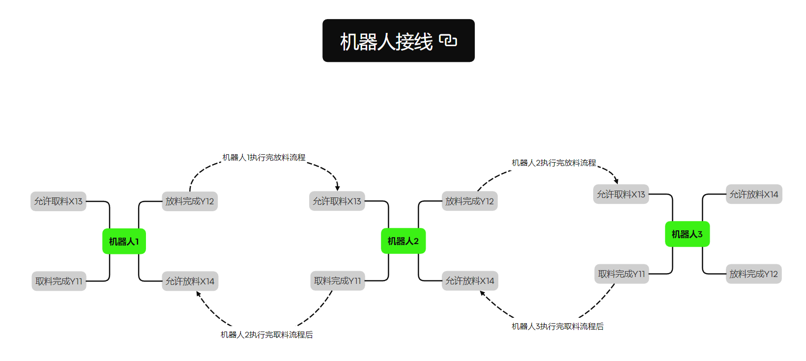

接线注意事项：

1. 确保上下两台或多台自带IO的控制器或者外接IO板的电源使用的是同一个24V电源，或者共地线。

2. 接线后，将输出打开，查看输出接的输入端口信号是否会置1，验证接线是否正确。

3. 接线后将输出端口依次打开，查看是否有出现打开一个输出端口，两个输入端口置1的问题，如果出现上述问题，可能是由于两个输入端口铜丝外露接线连在一起导致的。

## 附件1－报警处理

1. 报主治具（或者副治具）真空检测超时；原因：取料时取料失败、取完料之后在去放料的过程中掉料。

2. 报破空检测失败；原因：程序过了放料点，工件还在吸盘上吸附，或者主吸盘真空信号未置0。

3. 报冲床模式错误；原因：冲床模式X02信号未置1。

4. 报检测到放料冲床上死点异常掉落；原因：放料工位冲床冲压完之后，人工再次冲压或者冲床从上死点异常掉落。

5. 报允许放料信号异常；原因：放料过程中，允许放料信号变化。

6. 报允许取料信号异常：原因：取料过程中，允许取料信号变化。

7. 报冲床信号异常，冲床执行周期小于冲压最短周期；原因：冲床冲压时间小于冲压最短周期，可能是最小周期时间未设置好，或者冲床上死点信号受到干扰导致。

8. 报冲床信号异常，冲床未回到上死点，冲压时间超过最长周期；原因：冲床冲压时间大于冲压最长周期。

9. 报冲床信号异常，未执行冲压过程；原因：输出冲床启动信号后，冲床上死点上时间没有变化，或者冲床未启动。

10. 提示启动错误机器人不在安全位置；原因：工作模式为上料机、搬运、下料机，启动时，机器人当前位置未在取料待机点到放料待机点之间。工作模式为单机时，机器人当前位置，没在取料待机点。

11. 报冲床安全信号异常；原因：启用冲床安全信号功能，运行程序启动冲床时，冲床安全信号X07未置1。

12. X16紧急停止被触发；原因：X16信号被触发。

13. 放料待机点与放料上方点间距过小，取料待机点与取料上方点间距过小；原因：放料待机点到放料点上方的距离和取料待机点到取料点上方的距离，小于冲压参数内设置的点位最小间隔。

14. 取料冲床未在上死点，放料冲床未在上死点；原因：启动冲床时，冲床未在上死点，或者上死点没接信号。

## 附件2－异常处理

- 1、机器人出现提前放料问题：

  - A、去掉放料点上方指令的平滑。

  - B、看是否启动了吹气功能。

- 2、机器人在放料点和取料点，都停留相同的时间；原因：真空检测开关未打开。

- 3、只在放料点停留；原因：设置了放料时间，查看冲压参数——放料时间是否设置了数值。

- 4、机器人运行过程中有停顿：

  - A、平滑未拉满；

  - B、位于取料待机点和放料待机点位置停顿，可能是信号未满足。

- 5、频繁报真空检测超时：

- A、主吸料输出和主吸盘真空输入，是否过继电器。

- B、电柜是否加了风扇。

- C、料是否真的没有吸出来，或者掉料。

- D、检查吸盘是否损坏。

- 6、频繁报允许取料，允许放料信号异常：

- A、将每台机器人的地线串起来

- B、检查线路是不是接错了。

- 

## 附件3冲压指令各指令信号逻辑

| 1：取料待机点 | ·无 | ·无 | 搬运和下料逻辑 ·上工位允许取料X13=0-1 取料机床上死点X11=1-0-1 上料机信号 ·下工位允许取料X13 信号类型由工艺参数内设置 |
| --- | --- | --- | --- |
| 2：取料上方点 | ·主吹气Y07=1 ·副吹气Y08=1 | ·输出取料中Y09=1 | ·无 |
| 3：取料点 | 开启双治具 ·主吸料Y05=1 ·副吸盘Y06=1 单治具 ·主吸盘Y05=1 | ·无 | 真空检测开始 ·主吸盘真空X03=1通断检测时间内真空建立完成 ·副吸盘真空X04=1通断检测时间内真空建立完成 |
| 4：取料上方点-回 | ·无 | ·无 | ·无 |
| 5：取料待机点-回 | ·取料中 Y09=0 ·取料完成Y11=1 | ·无 | ·无 |
| 6：放料待机点 | ·无 | ·无 | 搬运和上料逻辑 ·下工位允许放料X14=0-1 ·放料机床上死点X12=1-0-1 下料机信号 ·下工位允许取料X14 信号类型由工艺参数内设置 |
| 7：放料上放点 | 开启治具辅助 ·主吹气Y07=1 ·副吹气Y08=1 | ·放料中Y10=1 | ·无 |
| 8：放料点 | 开启双治具 ·主吸料Y05=0 单治具 ·主吸盘Y05=0 | ·无 | ·主吸盘真空X05=0通断检测时间内真空破空完成 ·副吸盘真空X06=0通断检测时间内真空破空完成。 |
| 9：放料上方点－回 | ·无 | ·无 | ·无 |
| 10：放料待机点-回 | ·冲床启动Y14=1 ·放料中Y10=0 | ·无 | ·无 |

## 附件4-IO定义表

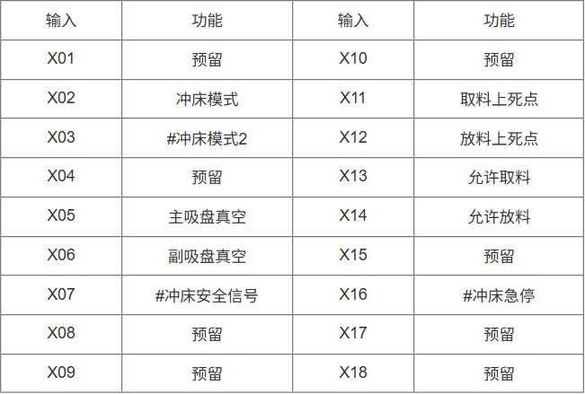

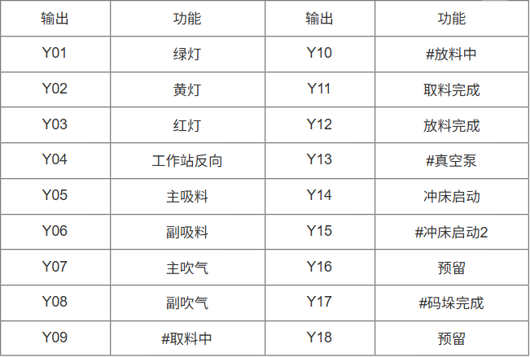
