# 示教器与控制器多语言翻译及升级指南

## 已有官方翻译包的情况

### 示教器界面语言升级

**准备文件**：将官方提供的语言翻译包（.zip 格式）拷贝至 U 盘根目录。

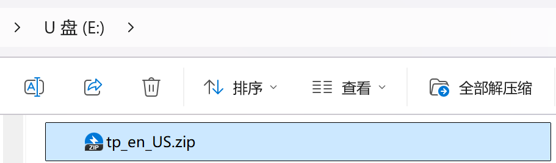

**执行升级**：

- 将 U 盘插入示教器 USB 接口。
- 进入示教器界面：**设置 → 系统设置 → 版本升级**，点击【检测升级】。
- 在弹出的文件选择框中，选中对应的语言包（如 tp_en_US.zip），点击【确定】开始升级。

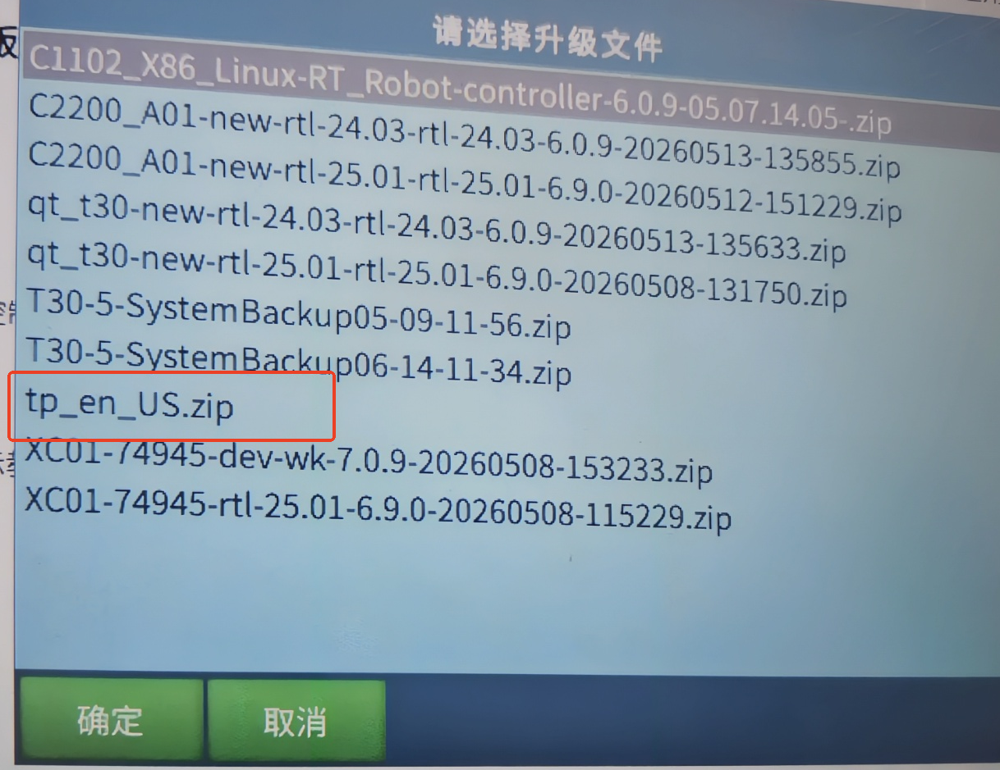

**切换语言**：升级完成后，进入 **设置 → 示教器配置**，点击【修改】，在"界面语言"与"指令语言"下拉列表中选择目标语言，保存并重启示教器即可生效。

### 控制器消息语言配置（需客户自行翻译）

说明：控制器消息库采用 JSON 格式，需客户自行翻译键值内容。

**导出配置**：在示教器中导出当前控制器配置，解压后默认包含以下基础语言文件：

- msg_languages_Chinese.json
- msg_languages_English.json
- msg_languages_Korean.json

**翻译文件**：

- 复制任一基准文件（如 msg_languages_Chinese.json），重命名为目标语言格式：msg_languages_\*\*\*.json（\*\*\* 替换为英文语言名，如俄语为 Russian）。
- 使用专业文本编辑器（推荐 VS Code、Notepad++ 等）打开文件，翻译 value 字段内容，**保持 JSON 结构与键名（key）不变**。

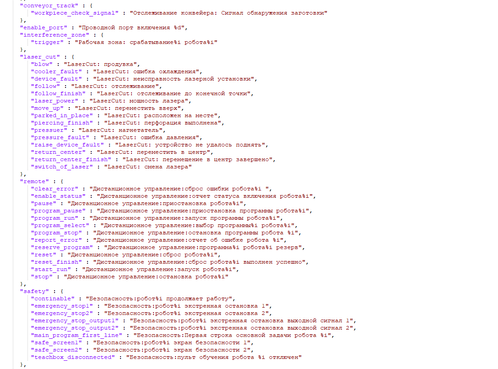

**导入配置**：将翻译完成的 .json 文件放回配置文件夹，打包后通过示教器导入控制器配置。

**激活语言**：导入成功后，进入 **设置 → 系统设置 → 示教器配置**，下拉列表将出现新增的语言选项。选择对应语言并**重启系统**，控制器消息语言即切换完成。

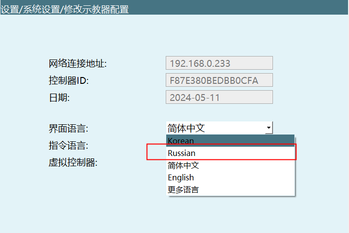

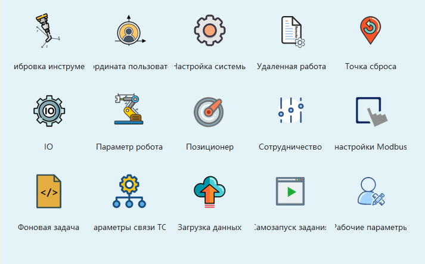

**注意：若未同步升级对应的界面.qm 文件，系统可能提示"缺少对应的 qm 文件"，请确保界面语言包已完整升级。**

## 无翻译包的情况（客户完全自主翻译）

### 环境准备：安装 Qt Linguist

1. 下载并安装 Qt 5.7.0 开发环境：qt-opensource-windows-x86-mingw530-5.7.0.exe

2. 按提示完成安装（注册 Qt 账号后可跳过登录或注册后继续），组件选择默认即可，安装完成后启动 **Qt Linguist** 工具。

#### 具体详细操作步骤如下：

Windows下安装的QT软件：qt-opensource-windows-x86-mingw530-5.7.0

1. 双击qt-opensource-windows-x86-mingw530-5.7.0 开始安装。

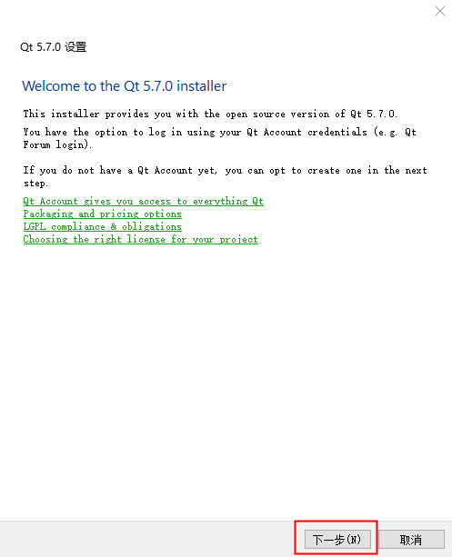

2. 按下一步，进入登录界面，按next->下一步；如果没有账号的要进行注册，注册在Sign-up处。

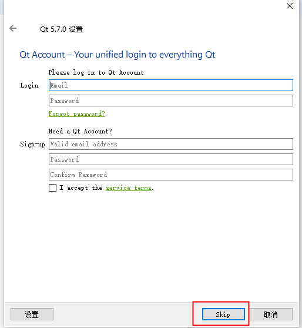

3. 注册完之后点击skip。

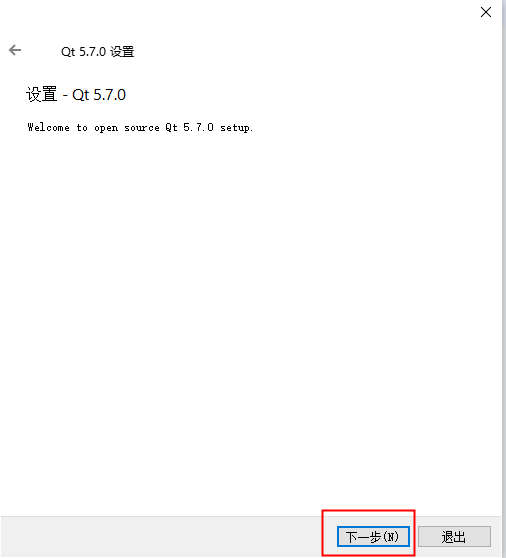

4. 一直点击下一步，进入此界面选择第一条。

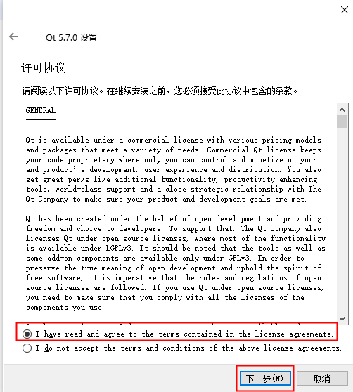

5. 一直点击下一步，进入此界面后点击安装。

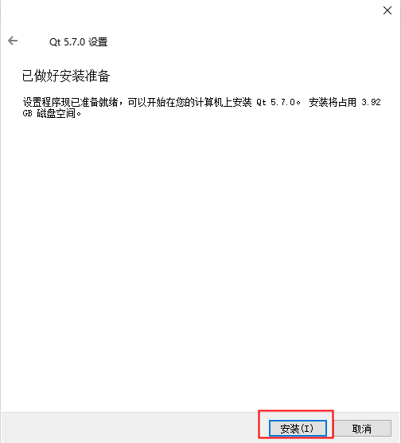

6. 提示正在安装，安装时间大概几分钟，请耐心等待。

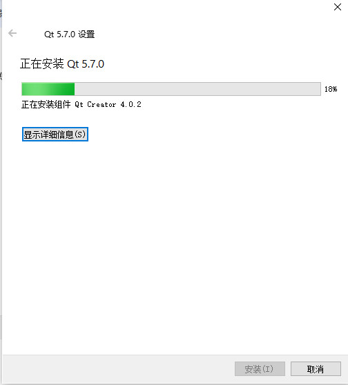

7. 安装完成。

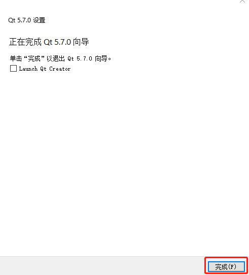

### 使用 Linguist 进行翻译

1. 打开 Linguist，将待翻译的源文件 tp_en.ts 拖拽至主窗口。

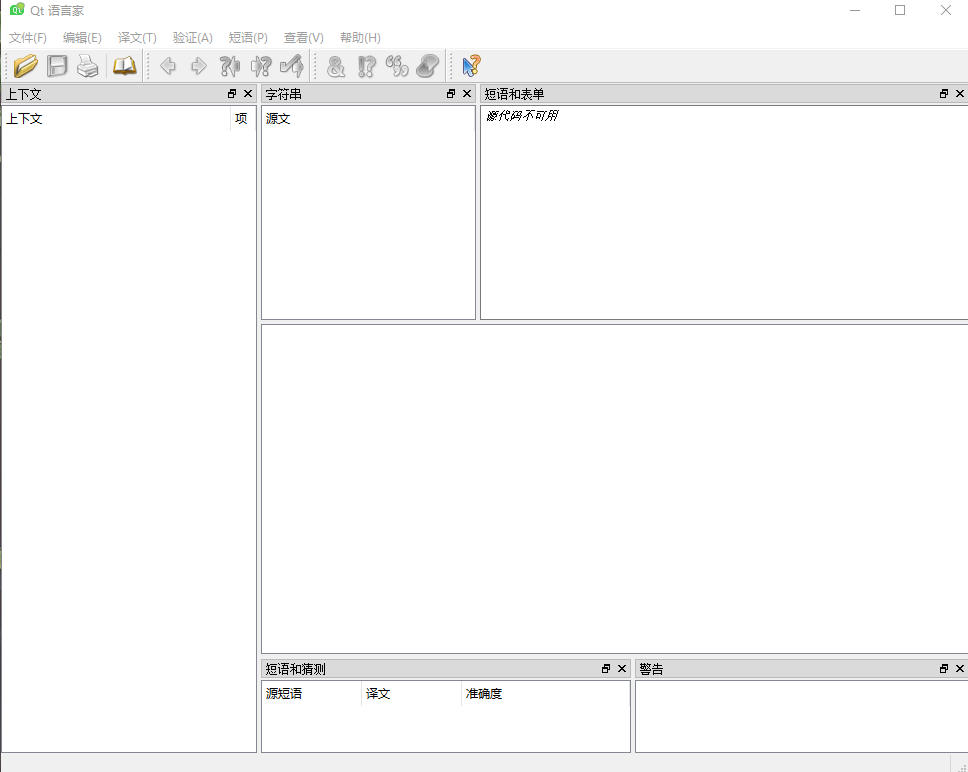

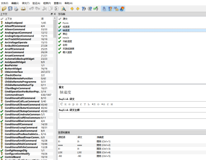

2. 在右侧列表中逐条翻译：

- 在 Translation 输入框填入对应译文。
- 状态栏显示 已翻译数/总数（如 8368/13228）。
- 翻译无误后，点击顶部工具栏的 **✅（验证完成）** 图标标记该条目。

**提示：若条目旁显示 ?，表示该条目未翻译或存在语法冲突，请检查补全**。

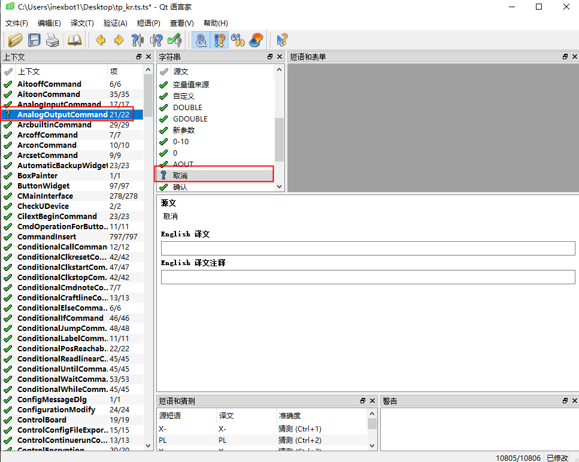

3. 全部翻译完成后，点击菜单栏 **文件 → 保存**（或 另存为），文件仍保持 .ts 格式备用。

### 编译、打包与升级

1. **发布编译**：点击 **文件 → 发布**（或 另存为发布），生成编译后的二进制语言文件 tp_en_US.qm。

2. **重命名**：将生成的 .qm 文件按系统规范重命名，例如：tp_language_Russian.qm。

3. **打包升级**：

- 将 .qm 文件压缩为 .zip 格式（压缩包内需直接包含 .qm 文件，勿带多余文件夹）。
- 按 **1.1 节步骤** 将压缩包拷贝至 U 盘根目录，通过示教器 **设置 → 系统设置 → 版本升级** 完成导入与激活。

## 重要注意事项

| 事项 | 说明 |
| :--- | :--- |
| **文件格式** | .ts 为 XML 源码文件，.qm 为编译后的二进制文件，.json 为控制器消息字典，请勿混淆。 |
| **命名规范** | 控制器 JSON 命名：msg_languages_\<LanguageName\>.json 示教器 QM 命名：tp_language_\<LanguageName\>.qm |
| **生效条件** | 所有语言切换操作后，**必须重启示教器/控制器系统**方可完全生效。 |
| **备份建议** | 升级或修改配置前，务必完整备份当前系统配置及原始语言文件。 |

## 常见问题解答

### Q1: 如何判断语言翻译包是否安装成功？

**A1:** 升级完成后，进入 **设置 → 示教器配置**，查看"界面语言"与"指令语言"下拉列表中是否存在目标语言选项。如果存在且能正常切换，说明安装成功。

### Q2: 为什么切换语言后部分界面仍显示旧语言？

**A2:** 可能原因及解决方法：
- 界面语言包未完整升级，请重新导入完整的 .qm 文件
- 未重启示教器系统，语言切换需要重启才能完全生效
- 检查是否同时升级了示教器界面语言和控制器消息语言

### Q3: Qt Linguist 翻译时显示条目未翻译怎么办？

**A3:** 若条目旁显示 ?，表示该条目未翻译或存在语法冲突。请检查：
- 该条目是否填写了译文内容
- 译文是否符合目标语言的语法规范
- 确保所有需要翻译的条目都已完成翻译后再保存发布

### Q4: 控制器消息语言和示教器界面语言有什么区别？

**A4:** 两者区别如下：
- **示教器界面语言**：指系统界面、菜单、按钮等界面元素的语言
- **控制器消息语言**：指控制器发出的报警、提示、状态消息等内容的语言
- 两者需要分别升级，互不影响

### Q5: 翻译文件时需要注意什么？

**A5:** 翻译时请注意：
- 保持 JSON 结构的完整性，不要删除或修改 key 字段
- 只翻译 value 字段的内容
- 特殊字符需要进行转义处理
- 建议使用专业文本编辑器（如 VS Code）进行编辑，避免格式错误

### Q6: 如何创建自定义语言的翻译包？

**A6:** 创建步骤如下：
1. 导出原有语言文件作为模板
2. 复制文件并按规范重命名（msg_languages_YourLanguageName.json）
3. 使用文本编辑器翻译所有 value 字段
4. 导入配置并重启系统
5. 在示教器配置中选择新语言验证效果
