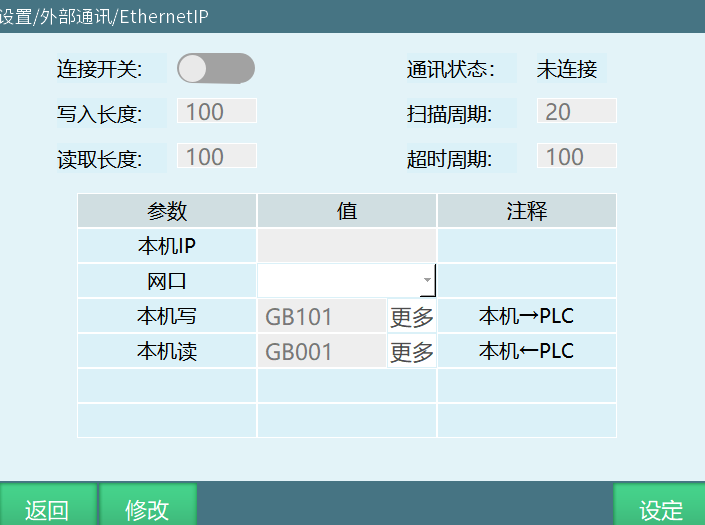
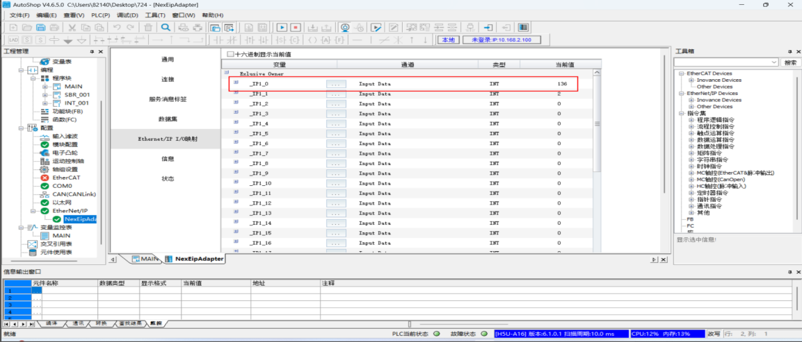
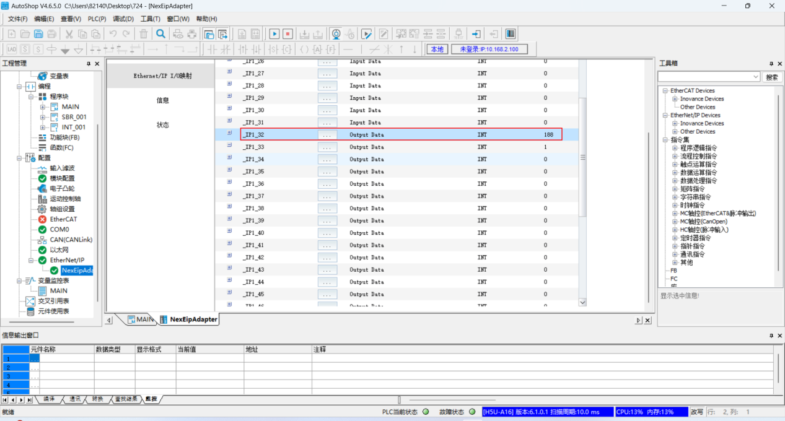
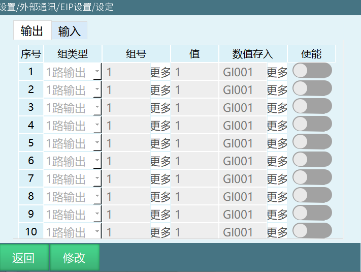
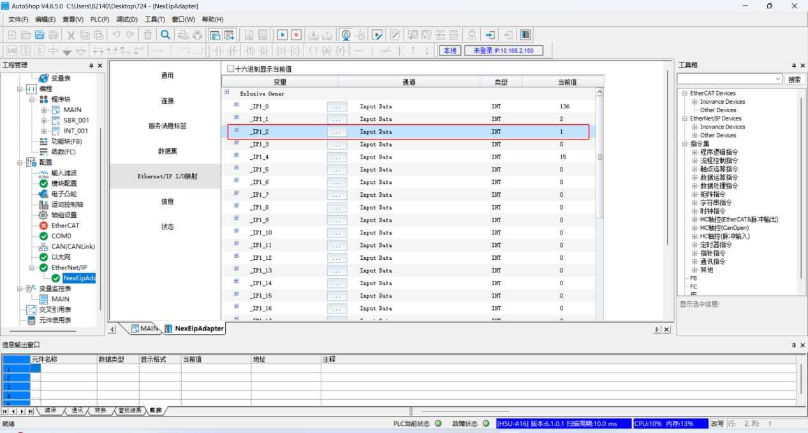
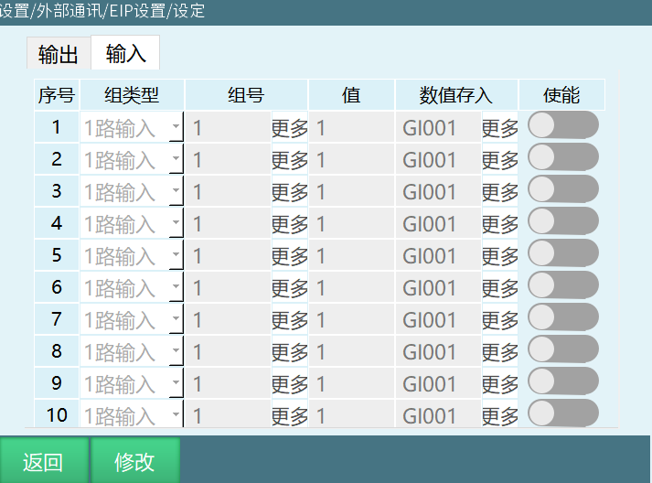
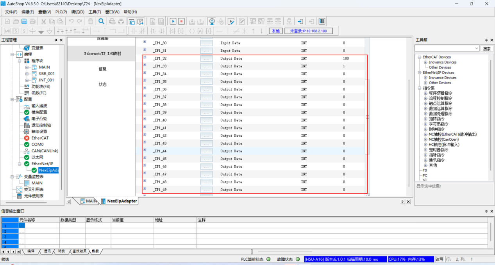
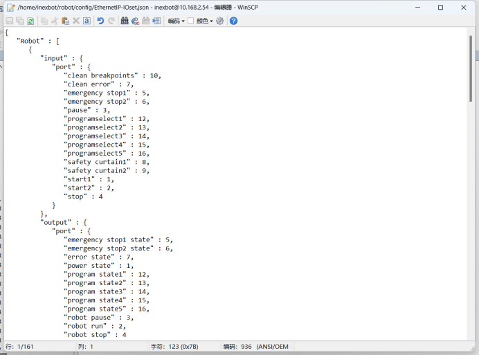

# EIP功能操作说明

## EIP主界面

| 参数 | 说明 |
| :--- | :--- |
| 连接开关 | 打开开关后，控制器可被PLC扫描到 |
| 通讯状态 | 根据控制器和PLC是否连接成功，分为已连接和未连接两种状态 |
| 写入长度 | 最长为256位，最短为16位（前十六个端口做有功能，具体功能可看EIP.xlsx表格） |
| 读取长度 | 最长为256位，最短为16位（前十六个端口做有功能，具体功能可看EIP.xlsx表格） |
| 扫描周期 | 控制器的扫描间隔，应该小于PLC端设置的RIP |
| 超时周期 | 范围为100--1000ms |
| 本机IP | 控制器IP地址，会自动识别，不能手填 |
| 网口 | 这个网口是选择EIP通信的网口，如果是多网口（两个网口以上）设备建议让EIP通信和示教器网口分开 |
| 本机写 | 本机的一些状态，写入到PLC中。数据由GB001开始依次存入全局布尔型变量中。起始变量可自行填写，但是变量长度必须大于或者等于写入长度 |
| 本机读 | PLC写入控制器，由GB257依次存入全局布尔型变量中。起始变量可自行填写，但是变量长度必须大于或者等于写入长度 |

> 注：本机读写的变量不能重叠，且变量编号必须大于写入长度或者读取长度。

## 设定界面

### 设定界面--输出界面

**输出界面：** 将数值写入PLC中，为AutoShop软件中Input Data部分。

| 参数 | 说明 |
| :--- | :--- |
| 序号 | 目前只有十组 |
| 组类型 | 目前有1路输出、4路输出、8路输出、12路输出、16路输出 |
| 数值存入 | 将值部分的数值，存入到全局整型变量和全局浮点型变量内 |
| 使能 | 当开关处于打开状态时，该功能才生效，反之不生效 |

#### 输出组类型详细说明

| 组类型 | 分组说明 | 总组数 | 组号起始 | 值范围 |
| :--- | :--- | :--- | :--- | :--- |
| 1路输出 | 一个端口为一组 | 256组 | 由17开始（前十六个端口中做有功能） | 0 或 1 |
| 4路输出 | 4个端口为一组 | 64组 | 由5开始（前十六个端口中做有功能） | 0 -- 15 |
| 8路输出 | 8个端口为一组 | 32组 | 由3开始（前十六个端口中做有功能） | 0 -- 255 |
| 12路输出 | 12个端口为一组 | 22组左右 | 由2开始（前十六个端口中做有功能） | 0 -- 4095 |
| 16路输出 | 16个端口为一组 | 16组 | 由2开始（前十六个端口中做有功能） | 0 -- 65535 |

> 注：各路输出，占用的端口不能一样，否则序号排前的数值，会被序号排后的数值覆盖。

### 设定界面--输入界面

**输入界面：** 由PLC写入控制器中，为AutoShop软件中Output Data部分。

| 参数 | 说明 |
| :--- | :--- |
| 序号 | 目前只有十组 |
| 组类型 | 目前有1路输入、4路输入、8路输入、12路输入、16路输入 |
| 数值存入 | 将值部分的数值，存入到全局整型变量或者全局浮点型变量内 |
| 使能 | 当开关处于打开状态时，该功能才生效，反之不生效 |

#### 输入组类型详细说明

| 组类型 | 分组说明 | 总组数 | 组号起始 | 值范围 |
| :--- | :--- | :--- | :--- | :--- |
| 1路输入 | 一个端口为一组 | 256组 | 由17开始（前十六个端口中做有功能） | 0 或 1 |
| 4路输入 | 4个端口为一组 | 64组 | 由5开始（前十六个端口中做有功能） | 0 -- 15 |
| 8路输入 | 8个端口为一组 | 32组 | 由3开始（前十六个端口中做有功能） | 0 -- 255 |
| 12路输入 | 12个端口为一组 | 21组左右 | 由2开始（前十六个端口中做有功能） | 0 -- 4095 |
| 16路输入 | 16个端口为一组 | 16组 | 由2开始（前十六个端口中做有功能） | 0 -- 65535 |

> 注：输入输出界面的数值存入，变量不能填写的一样，避免数值被覆盖。

## 自定义前十六个端口配置

前十六个端口可自定义，可去后台的robot目录下的config文件夹内EthernetIP-IOset.json文件进行修改。

代码后的数字代表的是端口。

### Input端口功能（PLC → 控制器）

| 功能名称 | 端口号 | 说明 |
| :--- | :--- | :--- |
| start1 | 1 | 启动1 |
| start2 | 2 | 启动2 |
| pause | 3 | 暂停 |
| stop | 4 | 停止 |
| emergency stop1 | 5 | 紧急急停1 |
| emergency stop2 | 6 | 紧急急停2 |
| clean error | 7 | 清错 |
| safety curtain1 | 8 | 安全光幕1 |
| safety curtain2 | 9 | 安全光幕2 |
| clean breakpoints | 10 | 清除断点 |
| programselect1 | 12 | 程序1 |
| programselect2 | 13 | 程序2 |
| programselect3 | 14 | 程序3 |
| programselect4 | 15 | 程序4 |
| programselect5 | 16 | 程序5 |

### Output端口功能（控制器 → PLC）

| 功能名称 | 端口号 | 说明 |
| :--- | :--- | :--- |
| power state | 1 | 上电状态 |
| robot run | 2 | 机器人运行状态 |
| robot pause | 3 | 机器人停止状态 |
| robot stop | 4 | 机器人暂停状态 |
| emergency stop1 state | 5 | 急停1状态 |
| emergency stop2 state | 6 | 急停2状态 |
| error state | 7 | 报错提示 |
| program state1 | 12 | 程序1输出 |
| program state2 | 13 | 程序2输出 |
| program state3 | 14 | 程序3输出 |
| program state4 | 15 | 程序4输出 |
| program state5 | 16 | 程序5输出 |

## AI 检索专用问答对 (Q&A for Retrieval)

**Q: EIP功能中连接开关的作用是什么？**

A: 打开连接开关后，控制器可被PLC扫描到。

**Q: EIP通讯状态有哪几种？**

A: 根据控制器和PLC是否连接成功，通讯状态分为已连接和未连接两种状态。

**Q: EIP写入长度和读取长度的范围是多少？**

A: 写入长度最长为256位，最短为16位；读取长度最长为256位，最短为16位。前十六个端口做有功能。

**Q: EIP扫描周期设置时需要注意什么？**

A: 扫描周期是控制器的扫描间隔，应该小于PLC端设置的RIP。

**Q: EIP超时周期的范围是多少？**

A: 超时周期的范围为100--1000ms。

**Q: EIP本机IP如何设置？**

A: 本机IP即控制器IP地址，会自动识别，不能手填。

**Q: EIP多网口设备设置网口时需要注意什么？**

A: 如果是多网口（两个网口以上）设备，建议让EIP通信和示教器网口分开。

**Q: EIP本机写和本机读的变量起始位置分别是什么？**

A: 本机写数据由GB001开始依次存入全局布尔型变量中；本机读由GB257依次存入全局布尔型变量中。起始变量可自行填写，但是变量长度必须大于或者等于写入长度。

**Q: EIP本机读写变量需要注意什么？**

A: 本机读写的变量不能重叠，且变量编号必须大于写入长度或者读取长度。

**Q: EIP设定界面输出界面的作用是什么？**

A: 输出界面将数值写入PLC中，对应AutoShop软件中的Input Data部分。

**Q: EIP设定界面输入界面的作用是什么？**

A: 输入界面由PLC写入控制器中，对应AutoShop软件中的Output Data部分。

**Q: EIP输出界面有哪几种组类型？**

A: 目前有1路输出、4路输出、8路输出、12路输出、16路输出共5种组类型。

**Q: EIP输出各路占用端口时需要注意什么？**

A: 各路输出占用的端口不能一样，否则序号排前的数值会被序号排后的数值覆盖。

**Q: EIP输入输出界面的数值存入变量需要注意什么？**

A: 输入输出界面的数值存入，变量不能填写的一样，避免数值被覆盖。

**Q: EIP前十六个端口如何自定义？**

A: 前十六个端口可自定义，可去后台的robot目录下的config文件夹内EthernetIP-IOset.json文件进行修改。

## 版本历史

| 版本 | 日期 | 变更内容 | 作者 |
| :--- | :--- | :--- | :--- |
| 1.0.0 | 2026-07-01 | 初始版本 | jmz-09 |
