---
title: "IO功能使用手册"
description: "介绍IO功能的使用方法"
author: "tongmengyuan123"
date: "2026-07-01"
tags: ["IO","输入输出","模拟量","脉冲输出"]
category: "操作手册"
version: "1.0.0"
language: "zh-CN"
---

# IO功能使用手册

## 1 **IO**

### 1.1 **输入输出指令**

#### 1.1.1 **DIN-IO输入**

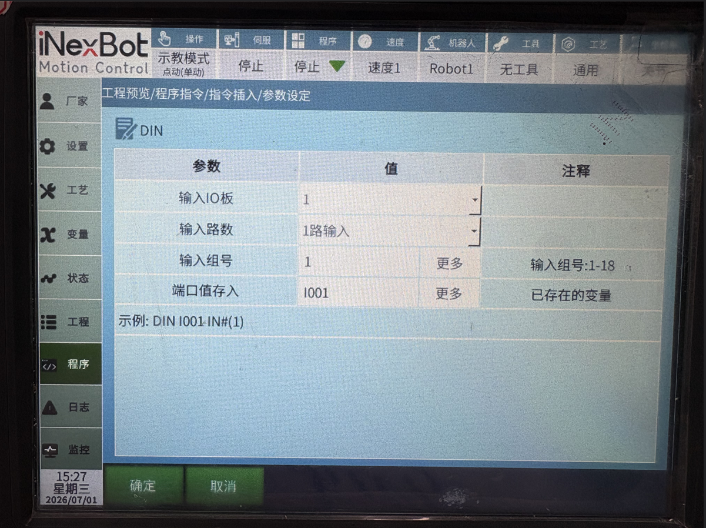

该指令用于将数字输入状态读入一个变量中，该变量可以为局部整型变量、全局整型变量（INT、GINT）或局部布尔变量、全局布尔变量（B、GB）。

**输入IO板：**可以选择使用IO板1-4。

**输入路数：**IN#-1路输入，此时1路为1组，第1-16组分别对应第1-16号端口；

IGH#-4路输入，此时每4路为1组，即1-4路端口、5-8路端口、9-12路端口、13-16路端口分别为1-4组，此时组号可填写1-4，如想同时读取第5-8路端口的输入状态，则可填写组号为2；

IG#-8路输入，此时每8路为1组，即1-8为1号组，9-16为2号组。如想同时读取9-16号端口的输入状态，则组号填2；

若同时读入多路端口，则将端口状态转换为10进制保存入变量中。并且读取的组号可以从对应变量中获取。

例如读取5-8路端口，同时有4路，其状态分别为如下，并且将其存在I001中。

| 端口 | 1 | 2 | 3 | 4 |
| :--- | :--- | :--- | :--- | :--- |
| 状态 | 0 | 1 | 1 | 0 |

则二进制值为0110，转换为10进制为6。

则在系统中保存的为DIN I001 IGH#(1) 6。

例如读取9-16路端口，同时有8路，其状态分别为如下，并且将其存在GI001中。

| 端口 | 16 | 15 | 14 | 13 | 12 | 11 | 10 | 9 |
| :--- | :--- | :--- | :--- | :--- | :--- | :--- | :--- | :--- |
| 状态 | 0 | 1 | 1 | 0 | 1 | 0 | 0 | 1 |

则二进制值为01101001，转换为10进制为105。

则在系统中保存的为DIN GI001 IG#(2) 105。

**输入组号：**可以设置同时读取1/4/8路输入状态，也可以通过绑定变量的变量值。

**端口值存入**：将IO输入读取到的值存入到选择的变量中。

#### 1.1.2 **DOUT-IO输出**

该指令用于通过数字IO板输出数字信号。

**输出IO板：**选择需要输出的IO板，可选择1-4。

**输出路数：**OT#-1路输出，此时1路为1组，第1-18组分别对应第1-18号端口；

OGH#-4路输出，此时每4路为1组，即1-4路端口、5-8路端口、9-12路端口、13-16路端口分别为1-4组，此时组号可填写1-4，如想同时输出第5-8路端口，则可填写组号为2；

OG#-8路输出，此时每8路为1组，即1-8为1号组，9-16为2号组。如想同时输出9-16号端口，则组号填2。

**输出组号：**可以设置同时输出1/4/8路IO，也可以通过绑定变量的变量值。

**输出值：**可以选择自行选择或者通过变量输出，也可以通过绑定变量的变量值。

若选择自选，则勾选每一组IO中每一路端口的状态，勾选输出为1，不勾选输出为0。

若选择通过变量输出，则在输出时将会把变量值从10进制转换为2进制，具体方法如DIN。

**时间：**指令执行后等待指定时间，然后取反输出。

**错误停止处理**：在IO信号输出的过程中，产生了错误报警。IO信号会做出不同的处理方式。

选择**输出值保持**，在程序运行的情况下，触发报警或其他意外情况下，端口输出会保持现状，并且计时时间暂停。待清除报警错误，程序开始正常运行时，IO输出计时继续暂停之前剩余的时间，计时时间结束时端口会取反。

选择**计时结束停止**，无论什么情况下，只要端口计时时间结束，都会将端口值取反，不受暂停、报错的影响。

#### 1.1.3 **AIN-模拟输入**

该指令用于将模拟量IO板的单一端口输入值读入到一个变量中。

**模拟输入口：**选择需要读取的输入端口.

**变量名：**请选择需要读入到的变量的变量名，如GD001。

#### 1.1.4 **AOUT-模拟输出**

该指令用于设置模拟量IO板单一端口的输出值。输出值可以为浮点数。

**模拟输出口：**选择需要设置值的输出端口。

**变量值来源：**请选择全局浮点型GDOUBLE或局部浮点型DOUBLE变量或手填值。

#### 1.1.5 **PULSEOUT-脉冲输出**

该指令用于控制支持PWM的IO板脉冲输出。

**个数：**脉冲输出总个数。

**频率：**脉冲输出频率；例如默认值100，则1s输出100个。

支持该功能的IO板如下：

> 华太IOPWM
>
> INEXBOT R1PWM

使用方法：

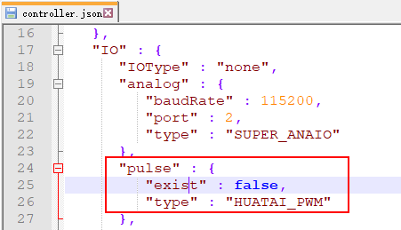

修改配置文件controller.json；

找到"IO"-"pulse"内的exist参数，改为turn；

> turn：功能可用；
>
> false：功能关闭。

找到"IO"-"pulse"内的type参数，改为对应IO板；

> HUATAI_PWM：华太IO；
>
> INEXBOT_PWM：纳博特R1。

#### 1.1.6 **READ_DOUT-读取输出**

该指令用于将当前数字量IO板的输出状态读入到一个变量中。其使用方法同DIN，只是读取的为输出的状态。

## 2 **IO状态提示设置**

在状态提示设置界面中，可以设置开机提示、机器人运行状态、报错提示、使能、模式状态、紧急停止等功能所对应的I/O
端口与该端口对应的电平。

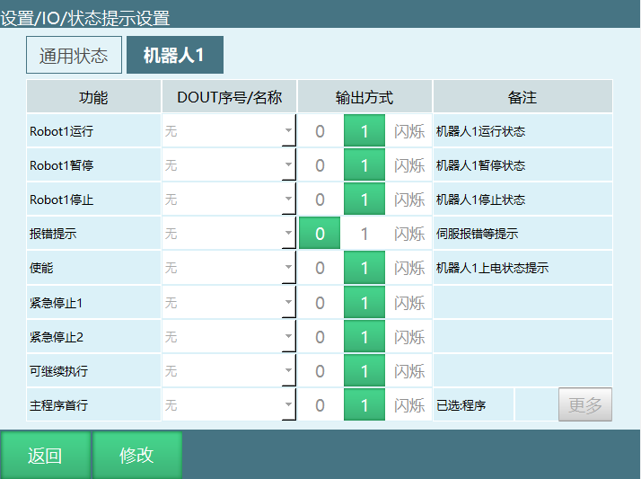

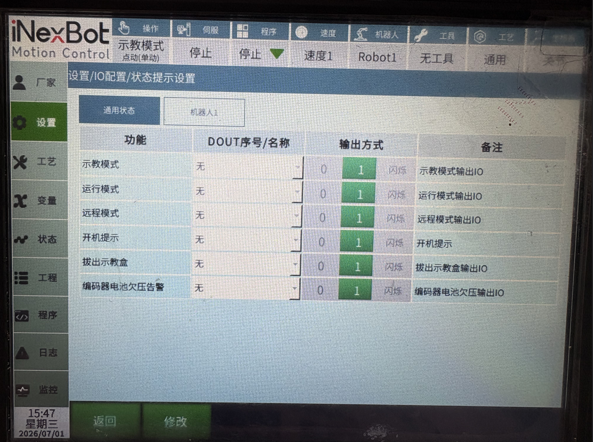

**Robot1运行：**机器人1运行时对应端口输出高/低电平。

**Robot1暂停：**机器人1暂停时对应端口输出高/低电平。

**Robot1停止：**机器人1停止时对应端口输出高/低电平。

**报错提示：**机器人伺服报错时对应端口输出高/低电平，可设置常亮或闪烁。

**使能：**机器人上电时对应端口输出高/低电平。

**紧急停止1：**紧急停止信号触发后对应端口输出高电平或低电平，可自行设置。

**紧急停止2：**紧急停止信号触发后对应端口输出高电平或低电平，可自行设置。

**主程序首行：**对应端口输出一个高电平参数为1的信号，程序光标跳至主程序首行。

**可继续执行**：对应端口输出一个高电平参数为1的信号，可运行暂停的程序。

**开机提示：**控制器开机输出状态，开机输出高电平。

**示教模式：**示教模式时对应端口输出高/低电平。

**运行模式：**运行模式时对应端口输出高/低电平。

**远程模式：**远程模式时对应端口输出高/低电平。

**拔出示教盒：**拔出示教盒后对应端口输出高电平或者低电平，可自行设置。

## 3 **IO安全设置**

在安全设置界面中，可以设置紧急停止、安全光幕等功能所对应的I/O
端口与该端口对应的电平。

IO紧急停止被解除后，需先点击清错按钮清错，然后才可进行其他操作。

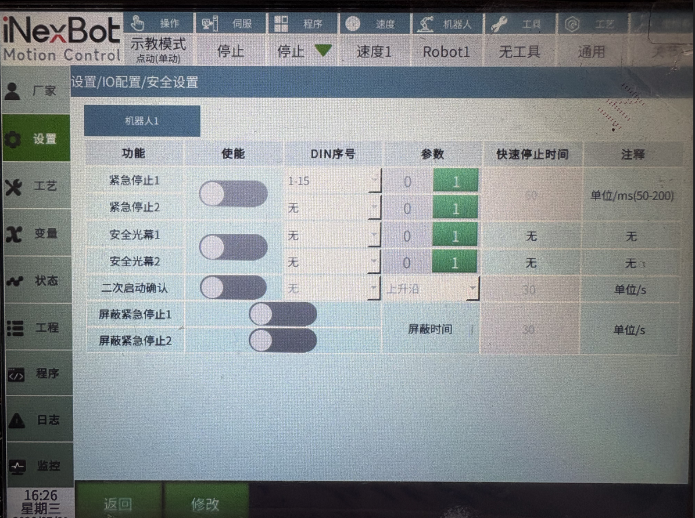

**紧急停止：**触发紧急停止信号后机器人下电并切至伺服停止。

**安全光幕：**触发安全光幕机器人暂停，再次按下启动按钮可继续运行。

**屏蔽紧急停止：**打开后屏蔽时间内，紧急停止信号被屏蔽。

**二次启动确认：**打开后，启动之后还需触发二次启动信号才能运行。

点击设置-IO-安全设置，打开二次启动确认使能

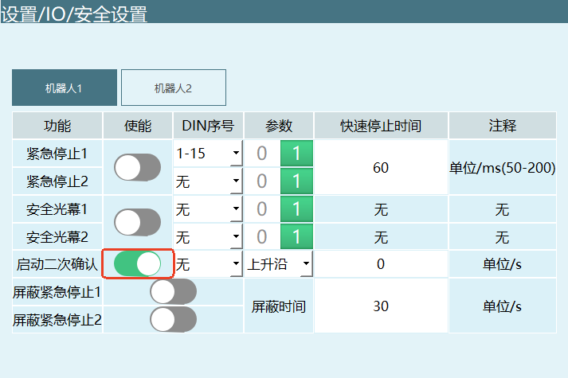

选择对应的DIN序号

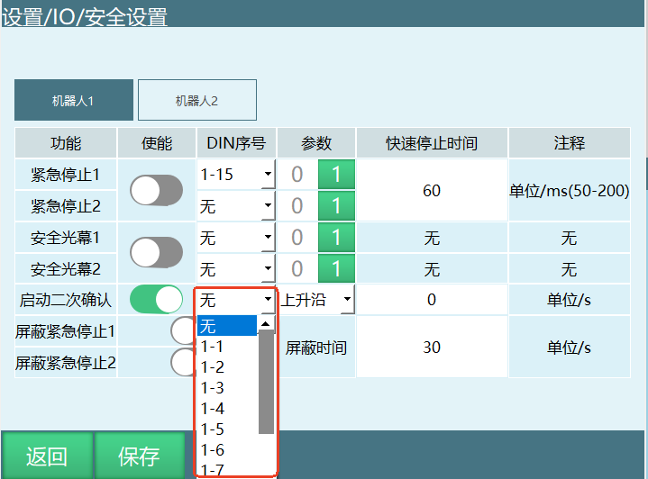

选择触发方式（上升沿：0-1，下降沿：1-0）

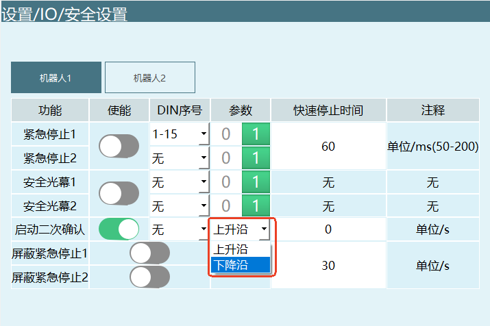

填写启动二次确认时间（范围：\[0-100000)，单位：s)，二次启动确认时间在触发示教器启动后开始计时

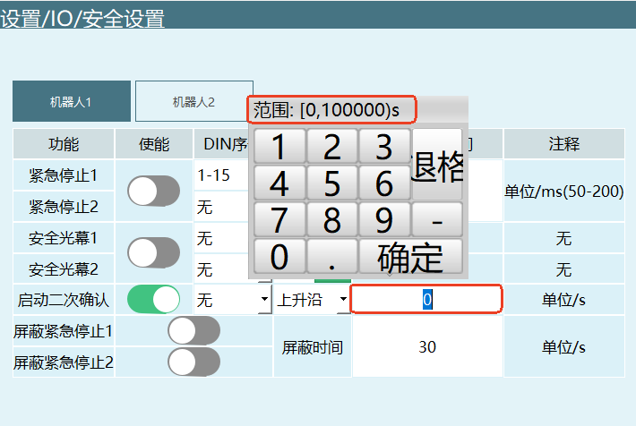

注意：

1、在示教模式下，无论是否打开二次启动确认使能都不影响操作。

2、在运行模式下，若打开二次启动确认使能，需要点击示教器上的启动按钮之后，再触发一下二次启动确认信号。二次启动信号需要在设置的确认时间内触发，否则将会触发报警。

3、在远程模式下，若打开二次启动确认使能，需要触发启动IO或使用modbus触发启动之后，再触发一下二次启动确认信号。二次启动信号需要在设置的确认时间内触发，否则将会触发报警。

4、若多次触发示教器启动，以第一次触发的时间为准计算超时；在远程或运行模式下启动后，若修改模式，二次启动确认时间一直计算，直到超时报警或触发二次启动信号。

### 3.1 **IO复位**

当程序运行停止或报错时，IO复位功能能使IO的输出端口恢复到初始状态。IO复位分为IO复位、切模式停止、程序报错停止三种。

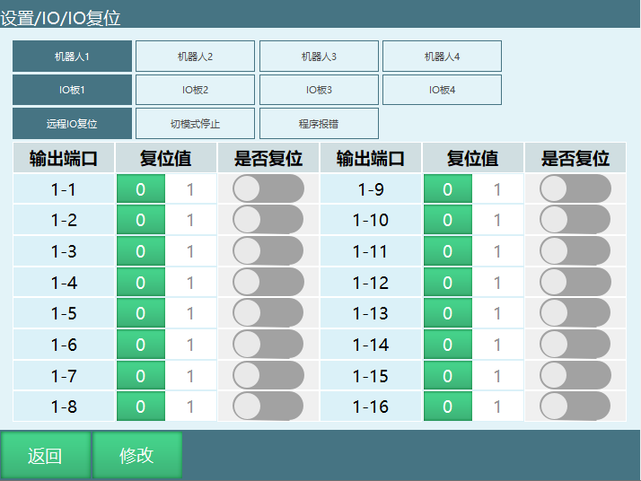

**远程IO复位：**在远程模式时，给复位信号，机器人执行复位程序回到复位点时，会将该界面设置的IO端口复位到复位值。如果复位程序中途停止了，则不会进行IO复位。

**切模式停止：**在运行程序时，切换模式到示教或远程模式导致程序停止，会将该界面设置的IO端口复位到复位值。

**程序报错停止：**程序发生错误导致程序停止，会将该界面设置的IO端口复位到复位值。具体的错误类型：伺服报错、IO设置的报错、系统运行中的报错。

**使用步骤：**

1.  进入IO复位界面；

2.  选择机器人；

3.  点击进入复位情景（IO复位、切模式停止、程序报错停止）；

4.  选择IO板；

5.  打开需要复位的IO端口对应的"是否复位"开关；

6.  选择复位值（0/1），0为低电平，1为高电平。

### 3.2 **IO配置**

系统会根据硬件连接顺序自动识别IO型号，无需设置；可用于查看IO板数目及型号。

进入【设置】-【IO】-【IO配置】。

此时输入框为灰色且不能输入数值。

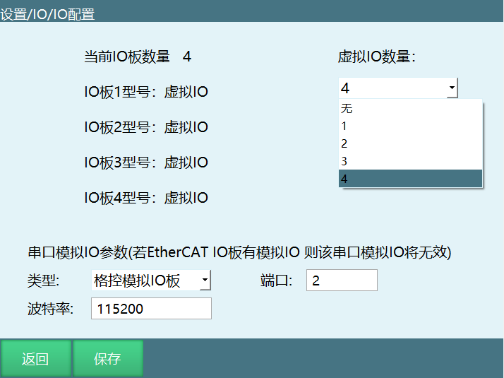

点击修改后，修改按钮变成保存，虚拟IO板数量下拉框选择需要的虚拟IO。

**注：虚拟IO仅供程序调试及程序演示使用，并没有任何IO信号接入。**

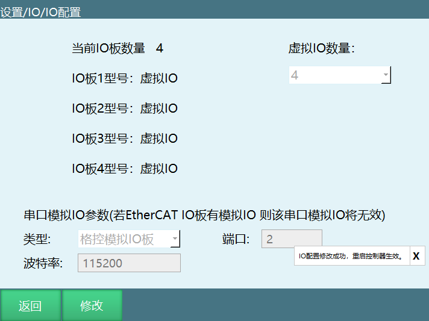

点击保存，重启生效，修改成功。

### 3.3 **使能IO**

如果使用使能硬接线示教盒，需在连接好线缆后，在此页面选择对应的DIN的端口并打开使能开关，上电使能功能则由IO板输入信号控制；非使能硬接线示教盒请勿设置。

打开此功能后，示教盒使能按钮失效，不可使用。

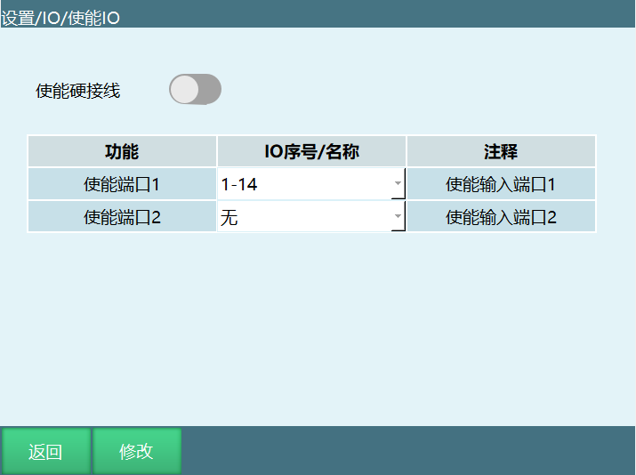

使能端口1为上电使能，使能端口2为下电使能。上电只需要打开使能端口1，在任何情况下，只要使能端口2打开，均会下电。

### 3.4 **报警消息**

此功能可以自定义IO输入输出端口报警内容，报警信息优先级高于其他类型IO报警信息。

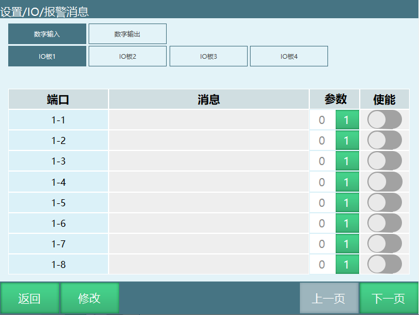

例如：设置IO紧急停止信号端口为15用于接防碰撞IO,
1触发、0解除；则触发DIN1会报
"机器人1IO紧急停止被触发"；此时在报警消息界面找到DIN1，消息栏输入"触发防碰撞"，则再次触发DIN15时报错"触发防碰撞"，不会在报"机器人1IO紧急停止被触发"。

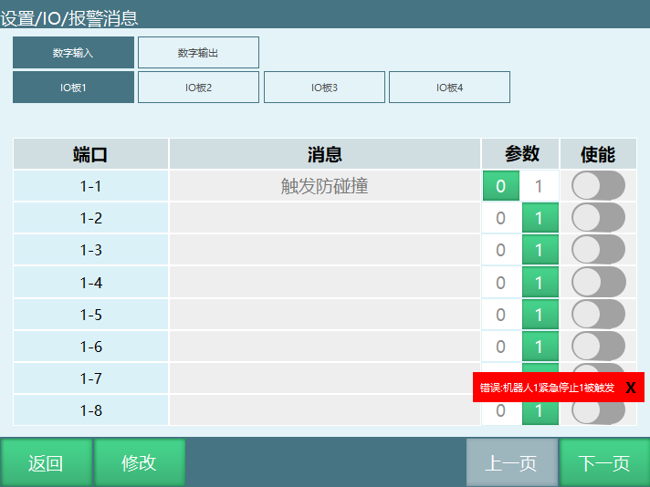

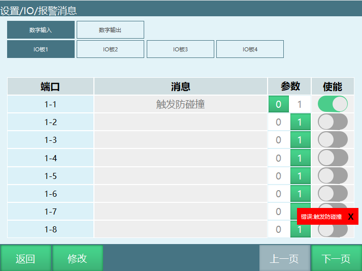

### 3.5 **端口名称**

端口名称最大支持输入5个汉字或者10个英文，设置成功后在使用IO端口相关下拉框选项时会自动显示该名称。

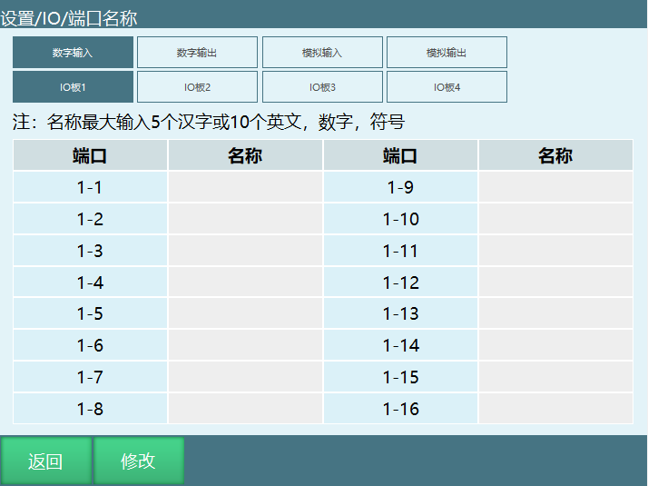

如设置DIN1-1
名称为"使能端口"，则在【状态】的【输入输出】中，会显示DIN1名称"使能端口"。

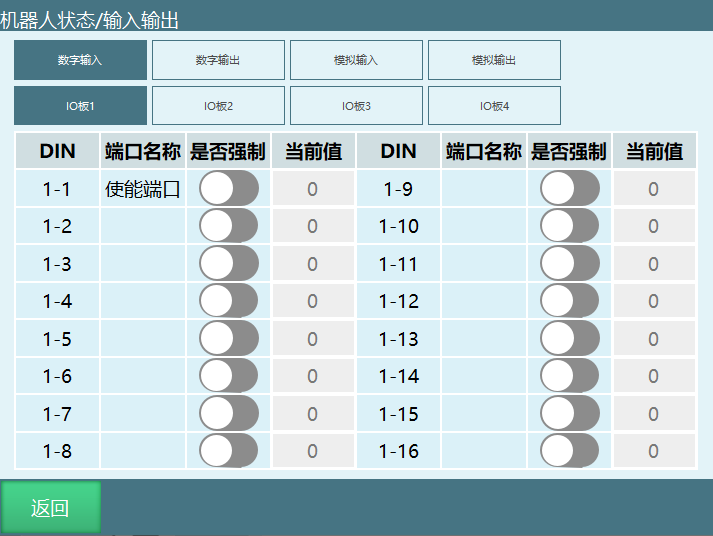

## 4 远程模式IO预约简要说明

信号说明：

| 类型 | 功能 | 支持模式 | 触发/输出方式 | 说明 |
| :--- | :--- | :--- | :--- | :--- |
| 数字IO输入 | 启动 | 远程模式 | 上升沿 | 参数为1时，信号0变1时有效 |
| 数字IO输入 | 停止 | 远程模式 | 持续有效 | 参数为1时，信号持续有效 |
| 数字IO输入 | 暂停 | 远程模式 | 持续有效 | 参数为1时，信号持续有效 |
| 数字IO输入 | 清除报警 | 远程模式 | 上升沿 | 参数为1时，信号0变1时有效 |
| 数字IO输入 | 预约即启动 | 远程模式 | 无 | 打开时，预约成功即上电 |
| 数字IO输入 | IO远程程序1-10 | 远程模式 | 脉冲（周期0.6s） | 参数为1时，信号0-1-0时有效，程序预约成功至少需要触发0.6秒以上 |
| 数字IO输入 | 紧急停止1 | 示教、运行、远程 | 高电平 | 1毫秒扫描一次，扫描到即触发 |
| 数字IO输入 | 紧急停止2 | 示教、运行、远程 | 高电平 | - |
| 数字IO输入 | 安全光幕1 | 运行（运行中）、远程（运行中） | 高电平 | - |
| 数字IO输入 | 安全光幕2 | 运行（运行中）、远程（运行中） | 高电平 | - |
| 数字IO输入 | 屏蔽紧急停止1 | 配合紧急停止使用 | 按钮打开即屏蔽紧急停止功能，设置时间到后重新检测紧急停止信号 | - |
| 数字IO输入 | 屏蔽紧急停止2 | 配合紧急停止使用 | - | - |
| 数字IO输出 | 开机提示 | 无模式限制 | 常亮、闪烁，仅在开机输出 | 输出高电平 |
| 数字IO输出 | Robot1运行 | 示教、运行、远程模式 | 常亮、闪烁 | 程序运行时输出高电平 |
| 数字IO输出 | Robot1暂停 | 示教、运行、远程模式 | 常亮、闪烁 | 程序暂停时输出高电平 |
| 数字IO输出 | Robot1停止 | 示教、运行、远程模式 | 常亮、闪烁 | 程序停止时输出高电平 |
| 数字IO输出 | 报错提示 | 无模式限制 | 常亮、闪烁 | 常亮输出高电平；闪烁输出脉冲（周期1s,0.5s亮、0.5s灭） |
| 数字IO输出 | 使能 | 无模式限制 | 常亮、闪烁 | 输出高电平 |
| 数字IO输出 | IO远程程序1-10预约输出 | 远程模式 | 常亮、闪烁 | 未预约/已预约时不亮；预约中时闪烁，周期1.2s，0.6s亮、0.6s灭；运行中时常亮，输出高电平 |
| 数字IO输出 | 紧急停止1 | 信号触发时 | 高电平、低电平、闪烁 | 参数为1时，输出高电平 |
| 数字IO输出 | 紧急停止2 | 信号触发时 | - | - |
| 数字IO输出 | 拔出示教盒 | 无模式限制 | 高电平、低电平、闪烁 | 点击拔出示教盒，输出1或0 |
| 数字IO输出 | 可继续执行 | 信号触发时 | 高电平、低电平、闪烁 | 输出一个高电平参数为1的信号，可运行暂停的程序 |
| 数字IO输出 | 主程序首行 | 示教、运行、远程模式 | 高电平、低电平、闪烁 | 输出一个高电平参数为1的信号，程序光标跳至主程序首行 |

*注：本说明均是以输出1为输出高电平为例*

### 4.1 远程模式状态说明

**未预约：**进入远程模式后，没有预约过程序，或预约后又取消预约，显示未预约。

**预约中：**预约成功显示预约中。

**运行中：**程序正在运行显示运行中。

**已预约：**程序运行完成或程序被触发停止，显示已预约。

远程模式不能修改速度，速度修改需提前在【设置-远程程序设置】中修改。

**预约程序：**

触发对应程序的IO口即成功预约程序，取消需再次触发该程序对应的IO口。

启动直接触发对应触发的IO口即可。

预约即启动，信号0-1（按下按钮）0.6秒以上时间后1-0（松开按钮），程序直接运行；预约即启动时启动信号可不设置。

预约的程序运行后可再次预约。

**故障排查：**

IO功能设置成功后请前往状态-IO功能状态查看是否设置成功或有无冲突功能。

**复位点设置：**

复位点功能支持关节、直线运动到安全点，或者使用复位程序指令自定义复位轨迹和位置。

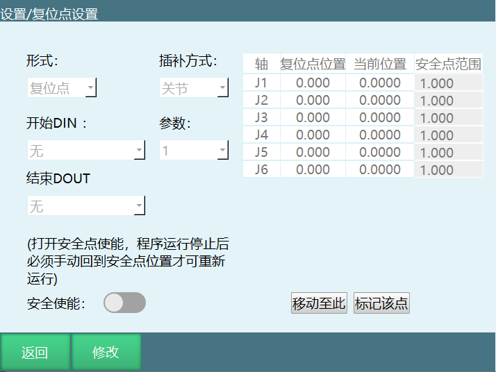

**形式：**复位点、复位程序。

**插补方式：**关节、直线；关节插补时运动速度为全局速度的10%，直线插补时运动速度为100mm/s；复位程序时运行速度等于指令速度x状态栏速度。

**安全使能：**打开后程序运行会判断机器人是否在复位点（安全点）位置，必须在复位点位置才能继续运行程序。

**开始DIN：**复位点触发信号。

**参数：**复位点触发信号0有效或者1有效。

**结束DOUT：**回复位点后状态信号输出。

**安全点范围：**每个轴的安全范围误差，范围内被判定为在复位点（安全点）。

**标记该点：**将当前机器人坐标设置为复位点，点击确认之后设置成功。

**移动至此：**以关节插补方式运动到复位点。

### 4.2 远程模式控制权说明

当控制系统中同时存在示教器、触摸屏与I/O控制设备时，其控制权优先级为示教器＞触摸屏＞I/O
控制设备。

切换到远程模式后控制权切换到触摸屏。若无触摸屏则切换到I/O
控制。此时示教器界面仅显示Modbus 模块与I/O模块连接状态与I/O程序。

同时有触摸屏与I/O模块时，在触摸屏中设置I/O模块使能。

### 4.3 远程IO控制

#### 4.3.1 远程I/O功能选择设置

在"远程程序设置-远程IO功能"中，可以设置远程IO控制启动、停止、暂停、急停、清除报警等功能所对应的I/O端口与该端口对应的电平，可以设置I/O模块远程控制所运行的程序。

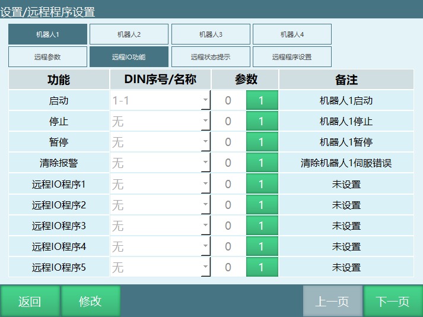

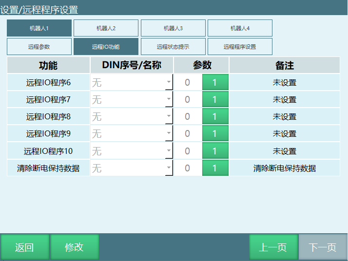

设置的I/O模块的程序只能选择在"远程程序设置"界面中已设定的程序。

远程预约程序最多支持10个.

预约即启动：打开后，第一个预约的程序预约成功后即立刻上电运行，此时可以预约其他程序。

#### 4.3.2 远程程序设置

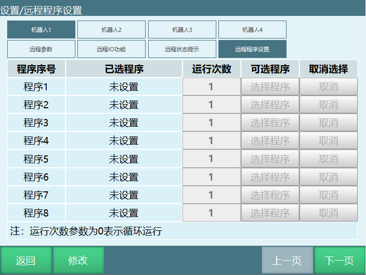

远程程序设置界面中可以设置触摸屏与I/O控制模块所使用的程序。

如果有多个机器人，可以在机器人处选择要设置的机器人，并设置该机器人的各程序。

I/O控制模块所使用的程序需在I/O功能界面中设置。

远程程序界面已选中的程序可点击取消按钮取消。

运行次数填对应的数字即可，0代表循环运行。

#### 4.3.3 预约模式

在"设置/操作参数"中：

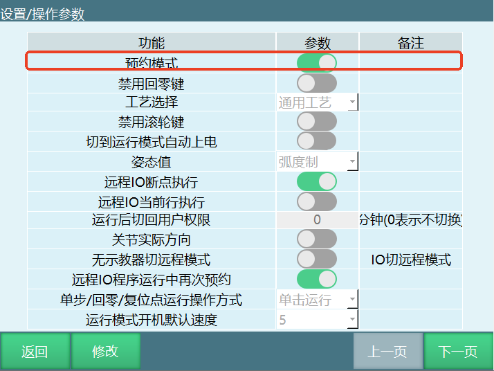

打开预约模式使能后，触发远程IO程序信号，程序预约成功，触发启动信号，机器人运行。

关闭预约模式使能后，触发远程IO程序信号，机器人直接运行且此时再触发其他远程IO程序信号无效，机器人运行结束后可重新触发远程IO程序信号。无需设置启动信号。

## 5 远程功能的使用

### 5.1 远程功能概述

设定10个远程程序和每个程序的运行次数，运行前将10个程序排好队列，运行时按照队列的顺序和运行次数运行，队列运行完成后停止等待再次排队。

远程功能使用步骤：

**编写程序------设置远程程序------设置IO------切换到远程模式------预约排序------运行。**

1.  编写程序：

新建程序并插入指令，请确保程序可正常运行。

2.  设置远程程序：

进入"设置-远程程序设置"界面，设置好程序1-程序10的程序名与运行次数，**[若想要单个程序无限循环运行，则设置该程序的运行次数为0]{.underline}**。这里的程序名指向"工程"界面中的程序，当修改程序内的指令后，远程程序会跟着自动修改，不需重新设置远程程序。

若修改了程序的程序名，请在远程程序设置界面中重新设置该程序。

3.  设置IO：

在"IO-IO功能"界面中设置各个功能对应的IO端口与有效值，当有效值为1时高电平有效，有效值为0时低电平有效。

其中的程序1-程序10对应的IO端口功能不是选择该程序运行，而是在远程模式中给该程序排队。

4.  切换到远程模式：

将模式选择钥匙旋转到远程模式位置或点击程序中的模式状态，选择远程模式。

当示教器没有连接控制器时，启动控制器自动进入远程模式。

当控制器同时连接IO、Modbus设备、示教器时，三个设备的优先级为示教器\>Modbus设备\>IO设备。当切换到远程模式后，以Modbus设备有效，IO设备无效，此时关闭Modbus设备中的使能按钮，则IO有效。

5.  预约排序：

例：IO功能中的IO功能设置为：

> 运行 端口1有效值1
>
> 停止 端口2 有效值1
>
> 暂停 端口3 有效值1
>
> 清除错误 端口4有效值1
>
> 程序1端口5有效值1
>
> 程序2 端口6 有效值1
>
> 程序3 端口7 有效值1
>
> 程序4 端口8 有效值1
>
> 程序5端口9 有效值1
>
> 程序6端口10有效值1
>
> 程序7端口11有效值1
>
> 程序8端口12有效值1
>
> 程序9端口13有效值1
>
> 程序10端口14有效值1

则排序方式为给6号端口一个高电平1秒钟后松开，则程序2排在第一个，给8号端口一个高电平1秒后松开，程序4排在第二个，以此类推。若想要在队列中取消某一程序的排队，则再给对应的IO端口一个1秒的高电平，该程序就会在队列中取消。

队列中只能有10个程序，同一个程序不能重复排队。

当一个程序运行中，可以将该程序重新加入队列末尾。

6.  运行：

给有运行功能的端口一个高电平，机器人便开始按照队列中的顺序与运行次数开始运行。运行完成后伺服不下电，此时再将程序加入到队列中，机器人会立刻运行该程序。

当队列中没有程序就使其运行，则机器人上电不运动，此时将程序排入队列中，机器人立刻执行该程序。

查看运行情况：

远程IO控制查看程序运行详细情况可点击远程模式界面内的"查看程序"按钮，modbus也可以通过此功能查看。

运行总数清零：

清除当前运行程序的运行总次数，只可以清除运行总数，不能清除运行次数。

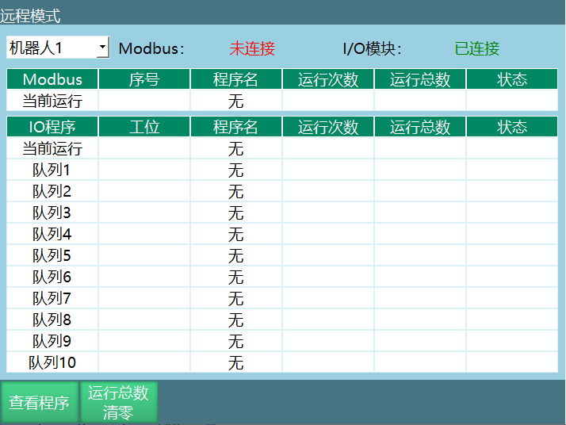

## AI 检索专用问答对 (Q&A for Retrieval)

**Q: IO功能支持哪些输入输出指令？**
A: IO功能支持的输入输出指令包括：DIN（IO输入）、DOUT（IO输出）、AIN（模拟输入）、AOUT（模拟输出）、PULSEOUT（脉冲输出）、READ_DOUT（读取输出）。

**Q: DIN指令的作用是什么？**
A: DIN指令用于将数字输入状态读入一个变量中，支持1路、4路、8路输入，可将端口状态转换为十进制保存到变量中。

**Q: DOUT指令支持哪些输出方式？**
A: DOUT指令支持自选输出和变量输出两种方式。自选输出可直接勾选端口状态；变量输出会将变量值从十进制转换为二进制输出。

**Q: IO状态提示设置包含哪些功能？**
A: IO状态提示设置包含：开机提示、机器人运行状态（运行、暂停、停止）、报错提示、使能、模式状态（示教/运行/远程）、紧急停止、主程序首行、可继续执行、拔出示教盒等功能对应的IO端口设置。

**Q: IO安全设置包含哪些内容？**
A: IO安全设置包含：紧急停止、安全光幕、屏蔽紧急停止、IO复位、IO配置、使能IO、报警消息、端口名称等功能。

**Q: IO复位功能有哪些类型？**
A: IO复位功能分为三种类型：远程IO复位（远程模式下复位信号触发）、切模式停止（切换模式导致程序停止）、程序报错停止（程序错误导致停止）。

**Q: 远程模式IO预约支持哪些信号？**
A: 远程模式IO预约支持的信号包括：启动、停止、暂停、清除报警、预约即启动、IO远程程序1-10、紧急停止、安全光幕、屏蔽紧急停止等数字IO输入信号。

**Q: 远程模式的控制权优先级是什么？**
A: 远程模式的控制权优先级为：示教器 > 触摸屏 > IO控制设备。

**Q: Modbus功能支持哪些连接方式？**
A: Modbus功能支持TCP和RTU两种连接方式，可作为主站或从站，支持多客户端同时连接。

**Q: 远程程序设置的步骤是什么？**
A: 远程程序设置的步骤为：编写程序 → 设置远程程序（程序1-10及运行次数） → 设置IO（功能对应的IO端口） → 切换到远程模式 → 预约排序 → 运行。

## 版本历史

| 版本 | 日期 | 作者 | 变更说明 |
| :--- | :--- | :--- | :--- |
| 1.0.0 | 2026-07-01 | tongmengyuan123 | 初始版本 |
