# 专用工艺

## 使用步骤

1.  点击设置-系统设置-维护模式，进入维护模式参数界面，点击工艺选择通用工艺。界面如下所示。

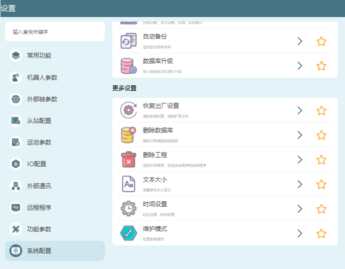

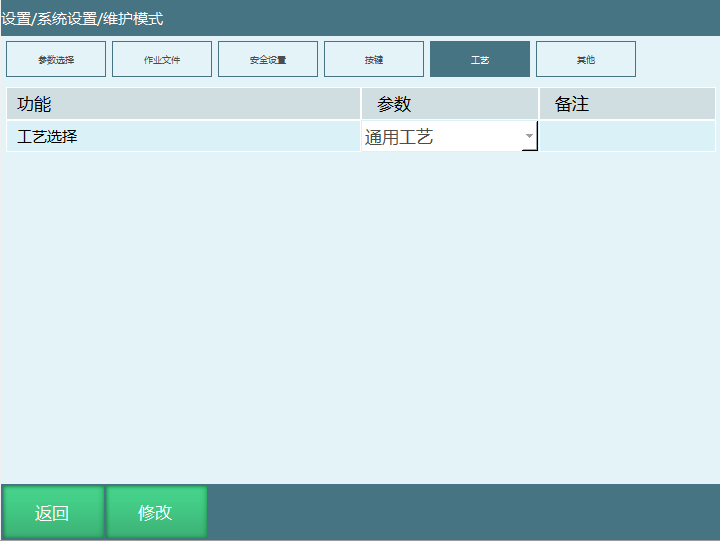

2.  通用工艺模式下编写作业文件，如图：

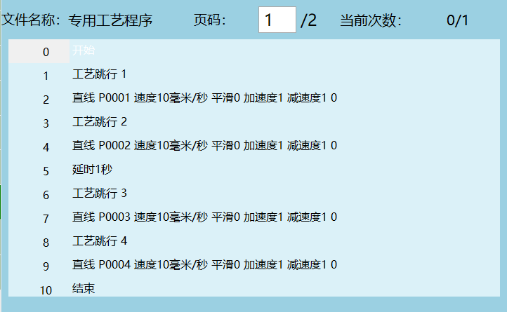

3.  编写XML文件，修改参数保存。

以下示例仅作说明，无实际含义。

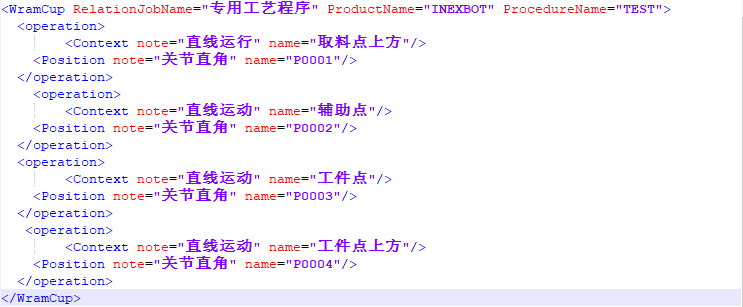

4.  维护模式界面的工艺选择切换为专用工艺。

5.  点击工艺-专用工艺-导入（导入xml文件，xml文件要放在U盘的importxml文件夹中），选中要导入的文件，点击"确定"（XML文件只存储点位，获取的点位是哪个，比如P0001，不存储点位实际位置，点位实际位置由程序指令存储）。

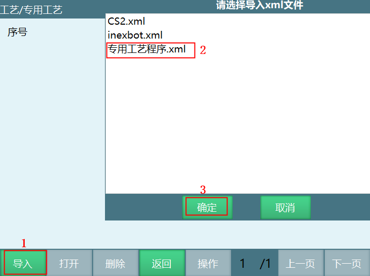

6.  作业文件导入成功后，打开导入的作业文件，如下图所示：

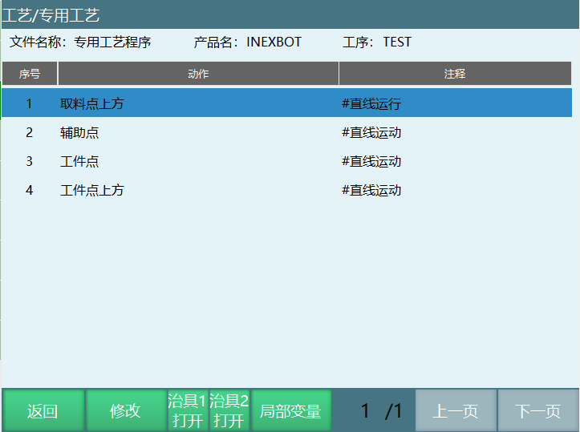

## 专用工艺界面说明

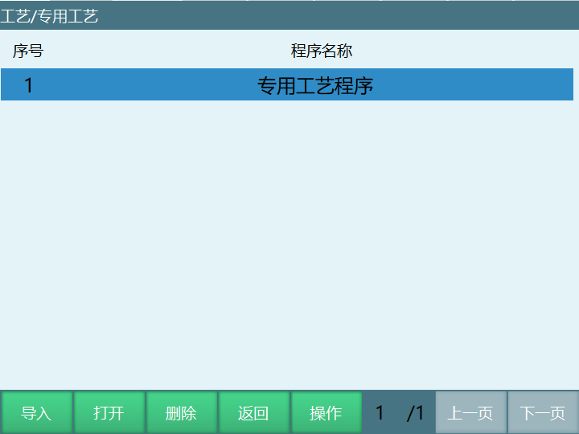

1.  导入：导入xml文件，文件格式本章手册后面会有介绍。

2.  打开：打开导入的文件，如下图所示：

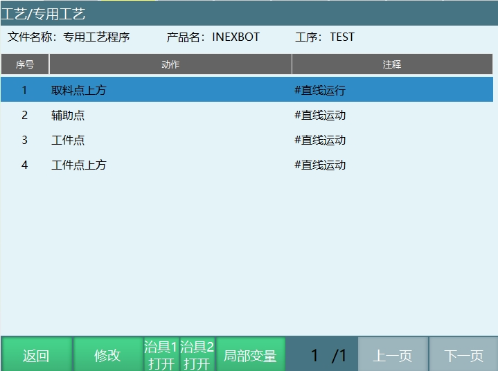

- 返回：退出当前界面。

- 修改：修改定义的位置变量点位，如下图所示将机器人移动到目标位置时点击【将当前位置赋值给该点】，点位修改成功。

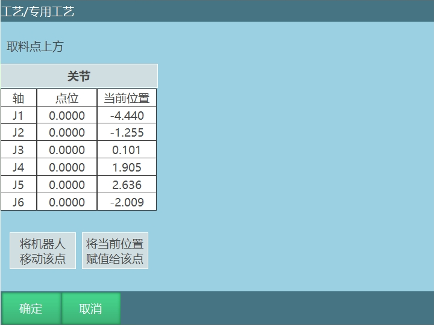

- 治具1打开：控制全局变量GB005,按下治具1打开按钮GB005=1，松开GB005=0。

- 治具2打开：控制全局变量GB006,按下治具2打开按钮GB006=1，松开GB006=0。

- 局部变量：查看定义的局部变量的点位信息，示教模式下点击【局部变量】可以修改目标位置的点位。

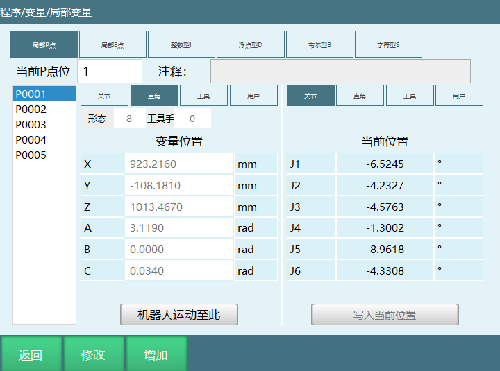

3.  删除：删除选中的专用工艺程序，点击【删除】，再点击提示框【确定】按键，程序被删除。如图所示：

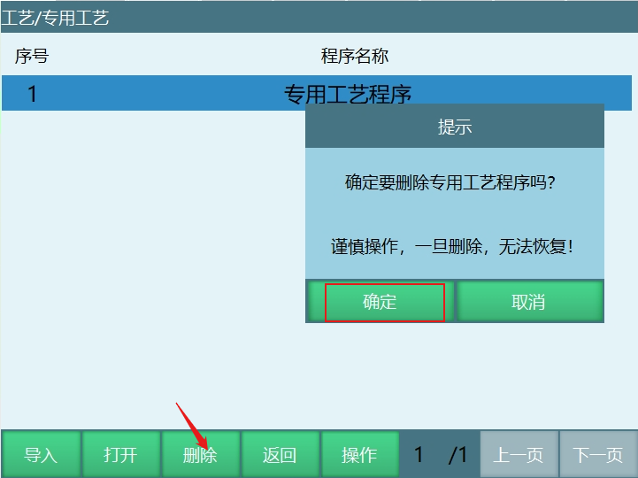

4.  返回：返回工艺界面。

5.  操作：点击【操作】对当前选中的程序可以进行复制和重命名。

## 专用工艺xml文件格式

下图展示了xml文件格式：

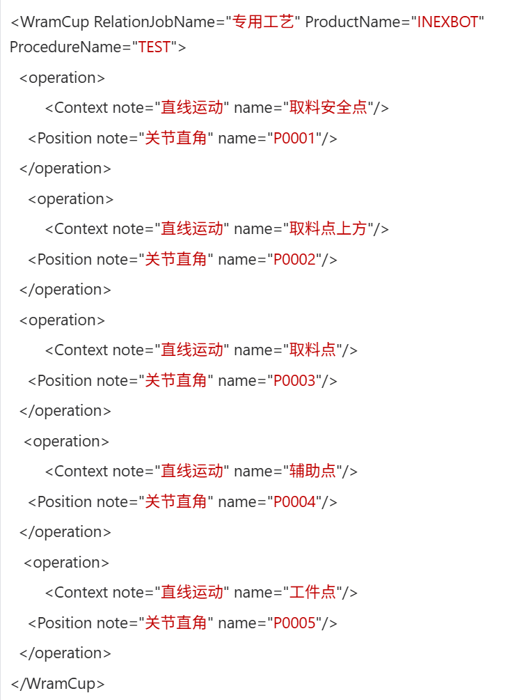 

**注释**  
- 红色字体部分为用户可修改的部分，编写时\<operation\>和\</operation\>为一个工艺跳行。
- 移动类指令对应此类型代码。 

## 示例说明

### 编写程序

1.  程序在通用模式下编写，新建一个程序，（新建程序的程序名称必须与XML文件代码中的程序名称以及作业文件名称保持一致。例如：新建的作业名称为"专用工艺程序"，则XML文件中RelationJobName=\"专用工艺程序\"）

<!-- -->

2.  打开"专用工艺程序"作业文件，插入工艺跳行指令，如下所示。（工艺跳行只用于专用工艺页面下的程序光标跳行，实际程序运行顺序是根据程序里的顺序进行运行）

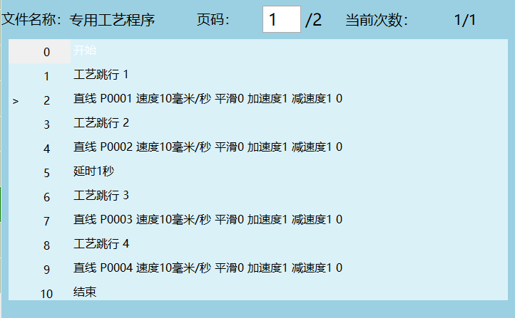

3.  在插入移动类指令时选择的点位应和XML文件中的点位相对应。

### 编写XML文件

1.  新建xml文件，用Notepad++编辑修改。如下图：

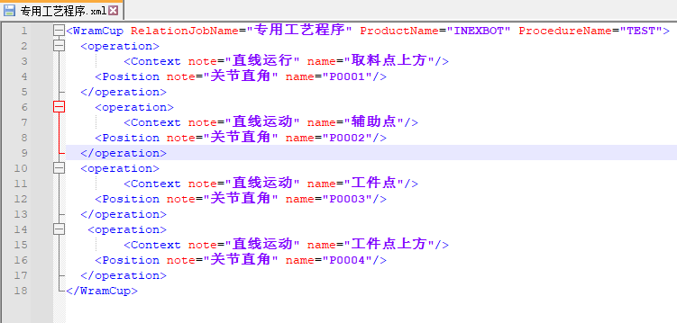

2.  导入XML文件后，将示教盒从通用工艺模式切换到专用工艺模式，然后点击"工程"，选择"专用工艺程序"作业文件，切换到运行模式，点击启动即可运行。

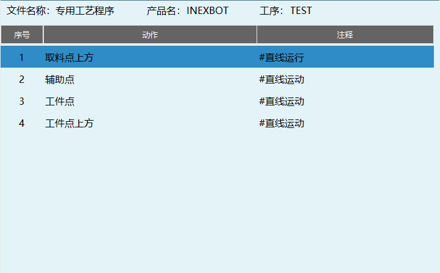

第一行：如上图专用工艺程序界面显示为序号1。

对应通用工艺模式的第一个工艺跳行：第1,2条指令，机器人运动到P0001点（取料点上方）。

第二行：显示为序号2。

对应通用工艺模式的第二个工艺跳行：运行3,4条指令，机器人运动到P0002点（辅助点）。

第三行：显示为序号3。

对应通用工艺模式的第三个工艺跳行：运行6,7条指令，机器人运动到P0003点（工件点）。

第四行：显示为序号4。

对应通用工艺模式的第四个工艺跳行：运行7,8条指令，机器人移动到P0004（工件点上方）。

## 程序运行

操作模式切换为运行模式，点击示教器上的"开始"键程序开始运行。

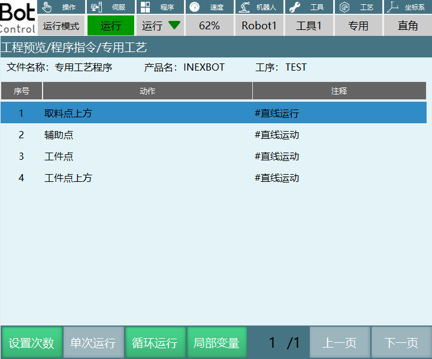

设置次数：程序的运行次数，运行完设置的次数后程序停止运行。

单次运行：程序只运行一次。

循环运行：程序无限循环运行。

局部变量：程序运行时只能查看目标点位信息，无法修改点位。

注意事项：工艺跳行指令行数对应专用工艺程序界面的序号，如下所示第一行指令对应的行数3，运行专用工艺程序时会先跳行到序号3行，然后跳行到第一行开始运行程序。

工艺跳行不连续时无法单步运行专用工艺程序。

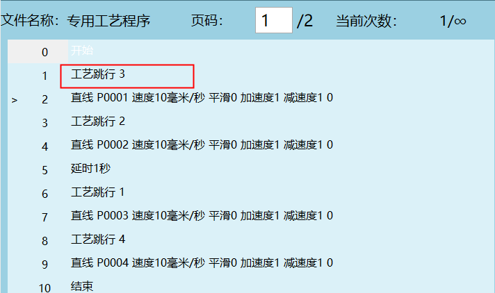
