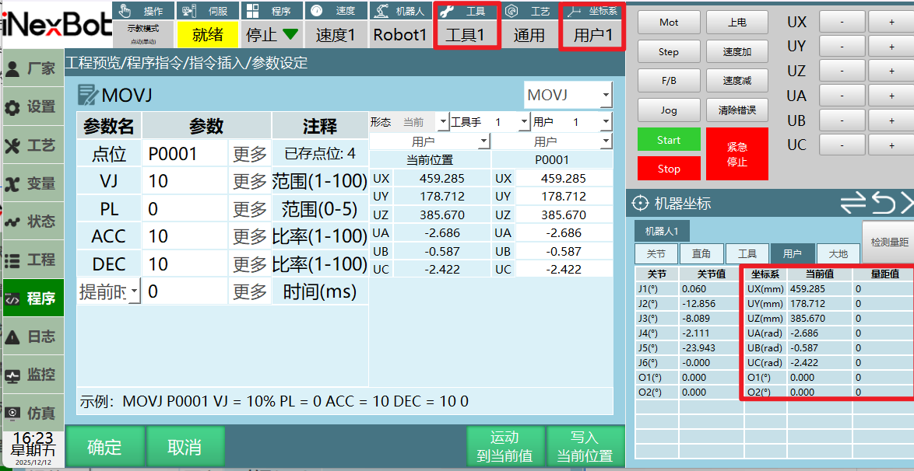
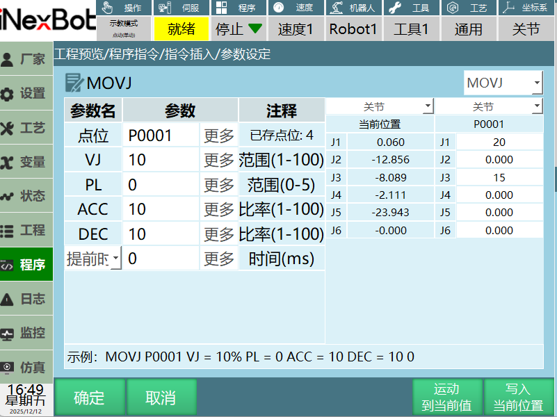
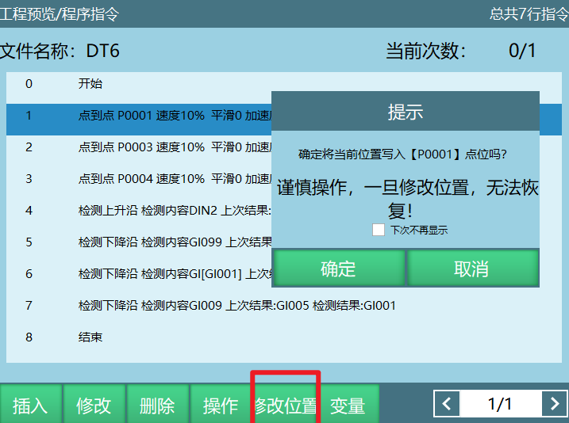
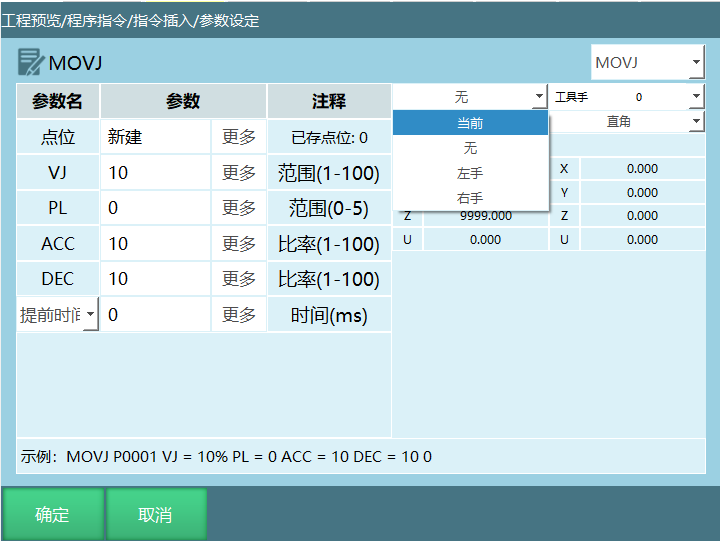
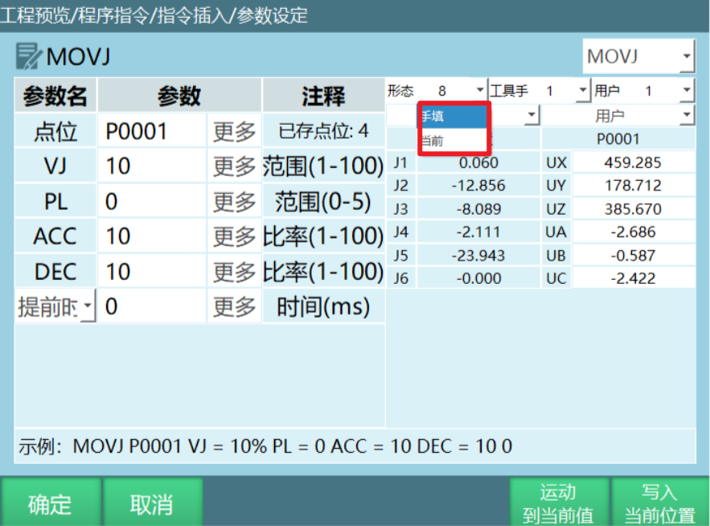
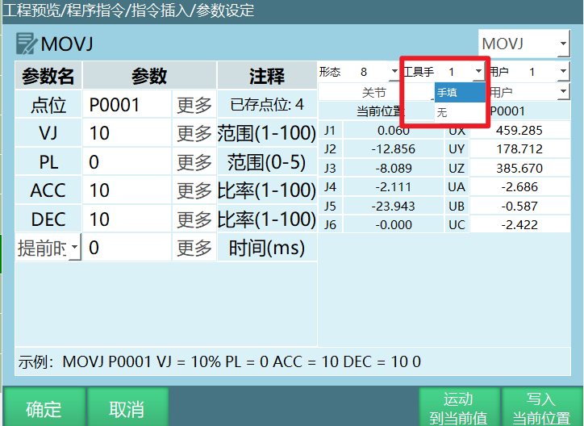
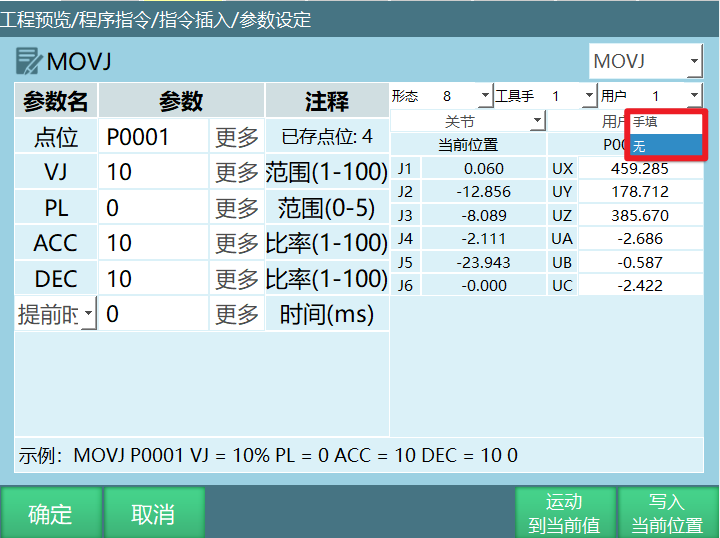
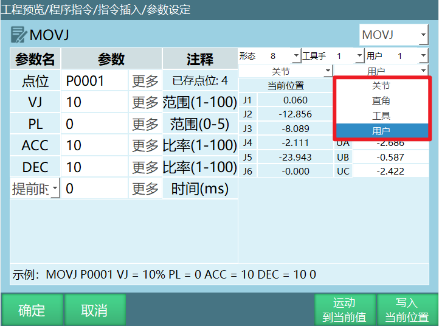

# 修改机器人点位

本章节将对如何修改机器人点位进行具体详解。

## 如何修改点位

### 将当前位置设为目标点位

1. 插入指令选择新建一个P变量或者GP变量；
2. 如果点位选择"新建"，需要点击参数设定界面的确定按钮，点击确定后一个新的局部位置变量新建成功；
3. 如果选择的是GP点/P点，在参数设定界面可以直接点击【写入当前位置】；
4. 【写入当前位置】：会将机器人当前的工具编号、当前的形态、当前的坐标系及当前坐标系下点位值写入目标变量；
5. 点击【确定】，会有消息条提示：变量修改成功。

### 手动修改目标点位

1. 手动修改机器人位置及手动修改目标变量的点位值，默认就是可以手动修改的；
2. 填入需要的坐标值,如上图所示将P0001目标变量的关节坐标一轴手动修改为20，三轴手动修改为15，点击【确定】将修改后的点位位置存入目标变量，小白条提示修改成功。点击【取消】则返回程序页面；
3. 【运动到当前值】将机器人移动到选择的目标变量存入的位置，例如：在一个作业文件里面插入了多条运动指令，如果想要单独移动某一个点位可选中指令在程序指令界面，按下上电使能，点击【运动到当前值】,机器人到达目标点位。

### 快捷键【修改位置】

1. 选中指令，点击【修改位置】，会将机器人当前的工具编号、当前的形态、当前的坐标系及当前坐标系下点位值写入指令变量；
2. 点击【确定】，则修改成功，点击【取消】，则未修改成功。

## 目标点位信息参数

### 形态

形态范围：[0,8]

1. 机型为6轴串联多关节机器人有形态参数，如形态参数选择当前，则控制系统自动通过转换方式计算出机器人当前的形态值,形态值是通过机器人1、3、5轴的关节点位来计算的，如果范围在[-90,+90]之间则为1，不在为0；
2. 形态值为机器人1轴、3轴、5轴位置的二进制转换为十进制然后再加1。

例如：某个六轴机器人1轴为59度、2轴为69度、3轴为79度、4轴为89度、5轴为99度、6轴为109度；

结果如下：二进制数110 = 十进制6，形态值为十进制结果再加1，该点位形态值为7。

| 轴 | 1轴 | 3轴 | 5轴 |
| :--- | :--- | :--- | :--- |
| 二进制数值 | 1 | 1 | 0 |

3. 机型为四轴SCARA机器人时有左右手参数。

修改目标点位形态：

1. 支持手填和当前，手填：可以自己填形态值0-8，当前：根据点位信息计算出一个形态值；
2. 修改完成后，点击【确定】形态值修改成功。

### 工具手

范围：[0,999]。

修改目标点位的工具手：

1. 支持手填和无，点击工具手，选择手填，修改的工具手号，范围1-999；
2. 修改完成后，点击【确定】工具手修改成功。

注意事项：当目标点位的坐标为直角，工具或者用户坐标时修改的点位工具要和实际使用工具一致，否则程序运行时出错！

### 用户坐标

坐标范围：[0,999]

修改目标点位的用户坐标：

1. 支持手填和无，点击工具手，选择手填，修改的工具手号，范围1-999；修改完成后，点击【确定】用户坐标号修改成功。

注意事项：当目标点位的坐标为用户坐标时修改的点位用户要和实际使用用户一致，否则程序运行时出错！

### 坐标系

1. 选择需要修改的坐标系修改完成后，点击【确定】坐标系修改成功。

---

## AI 检索专用问答对 (Q&A for Retrieval)

**Q：如何将当前位置设为目标点位？**

A：插入指令选择新建一个P变量或者GP变量，如果点位选择"新建"，需要点击参数设定界面的确定按钮；如果选择的是GP点/P点，在参数设定界面可以直接点击【写入当前位置】，点击【确定】完成设置。

**Q：如何手动修改目标点位？**

A：手动修改机器人位置及目标变量的点位值，填入需要的坐标值，点击【确定】将修改后的点位位置存入目标变量。点击【运动到当前值】可将机器人移动到选择的目标变量存入的位置。

**Q：如何使用快捷键修改位置？**

A：选中指令，点击【修改位置】，会将机器人当前的工具编号、当前的形态、当前的坐标系及当前坐标系下点位值写入指令变量，点击【确定】完成修改。

**Q：形态值的范围是多少？如何计算？**

A：形态范围为[0,8]。形态值是通过机器人1、3、5轴的关节点位来计算的，如果范围在[-90,+90]之间则为1，不在为0；形态值为机器人1轴、3轴、5轴位置的二进制转换为十进制然后再加1。

**Q：工具手编号的范围是多少？**

A：工具手编号范围为[0,999]，"0"表示无工具手。

**Q：用户坐标编号的范围是多少？**

A：用户坐标编号范围为[0,999]，"0"表示无用户坐标。

---

## 版本历史

| 版本 | 日期 | 变更内容 | 作者 |
| :--- | :--- | :--- | :--- |
| 1.0.0 | 2026-06-22 | 初始版本 | tongmengyuan123 |