# 变量类+字符串类
**变量类：**

\"√\"表示支持此条指令。
| 指令类型 | 前台 | 全局后台 | 局部后台 |
| :---: | :---: | :---: | :---: |
| 赋值 | √ | √ | √ |
| 写入文件 | √ | √ | √ |
---

**字符串类：**

\"√\"表示支持此条指令。
| 指令类型 | 前台 | 全局后台 | 局部后台 |
| :---: | :---: | :---: | :---: |
| 字符串追加 | √ |  |  |
| 字符串索引截取 | √ |  |  |
| 字符串分隔符拆分 | √ |  |  |
| 字符串定位查询 | √ |  |  |
| 字符串长度 | √ |  |  |
| 字符串转非字符串 | √ |  |  |
| 非字符串转字符串 | √ |  |  |
---

## 变量类

### 变量类型

#### 数值变量
| 变量类型 | 全局变量 | 局部变量 |
| :---: | :---: | :---: |
| 整型     | GINT     | INT |
| 浮点型     | DOUBLE | DOUBLE |
| 布尔型     | GBOOL | BOOL |
| 字符型     | GSTRING | STRING |
---

#### 位置变量

| 变量类型 | 说明 |
| :---: | :---: |
| P | 记录机器人位置数据的局部点位变量 |
| GP | 记录机器人位置数据的全局点位变量 |
| E | 1.   机器人在连接外部轴时，记录外部轴位置数据的局部点位变量   2.  当设置双机模式时，记录两台机器人位置数据的局部点位变量  |
| GE | 1.   机器人在连接外部轴时，记录外部轴位置数据的全局点位变量   2.  当设置双机模式时，记录两台机器人位置数据的全局点位变量  |
---

注意事项：新建或者修改的局部点位数据只保存于当前的作业文件，全局点位的数据会一直保存，不同的作业文件可以调用相同的全局位置变量，当其中的一个文件修改了全局点位，另一个作业中被调用的相同全局变量的数据也会被修改。

### 全局数值变量

点击变量-全局数值，进入全局数值变量界面。

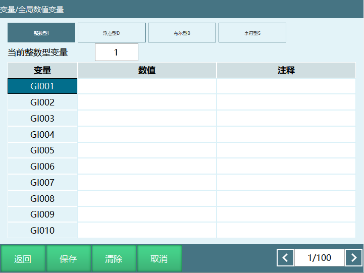

【修改】选中需要修改的变量名，点击"修改"然后给变量赋值、给变量添加注释。

【清除】清除变量里面存的值，点击清除后，变量值变为0，清除按钮只会清除当前界面的值。

【取消】对选中的变量不进行任何操作。

【保存】保存修改后的变量值。

【返回】返回到变量界面。

【当前整数型变量】填入数值，点击小键盘上的确定，可以直接定位到对应变量

【注释】用户可以给变量添加注释，方便用户标记该变量的作用

#### 全局数值变量赋值

**手动赋值：**

1. 在全局数值变量选中需要修改的变量，点击"修改"然后输入数值。

2. 点击"保存"变量赋值成功。

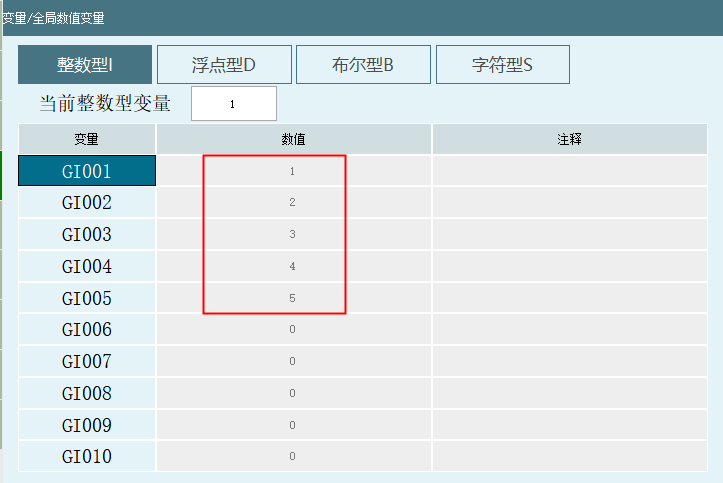

**指令赋值：**

1. 新建工程，打开工程文件；

2. 插入指令，指令类型选择变量类，选择赋值指令；

3. 点击【确定】进入指令参数设置界面，选择变量类型和填入变量值；

4. 点击【确定】赋值指令插入成功，如果需要给多个不同的变量赋值，重复前面的步骤就可以；

5. 指令执行完后，可以在监控-数值变量界面或者全局数值变量界面查看变量值。

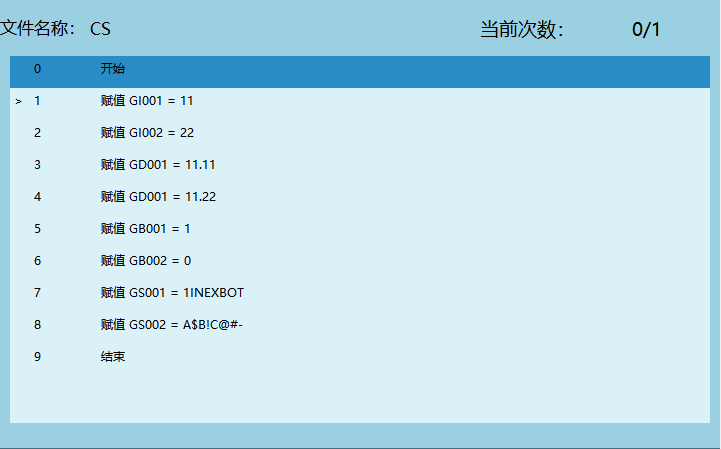

### 局部数值变量

说明：

1. 局部数值变量赋值的值只作用于当前程序；

例如：新建程序A和程序B，程序A里面赋值I001=10，然后打开程序B，在变量界面查看I001的值，变量界面显示I001=0。

2. 定义的所有局部数值变量一般只能用于当前程序，其他程序、后台程序都无法使用。

> 注：若使用指令调用后台，子程序时，声明局部数值变量参数即可在主程序中使用。

定义局部变量需要在打开的程序界面点击【变量】，进入局部变量参数设置界面。

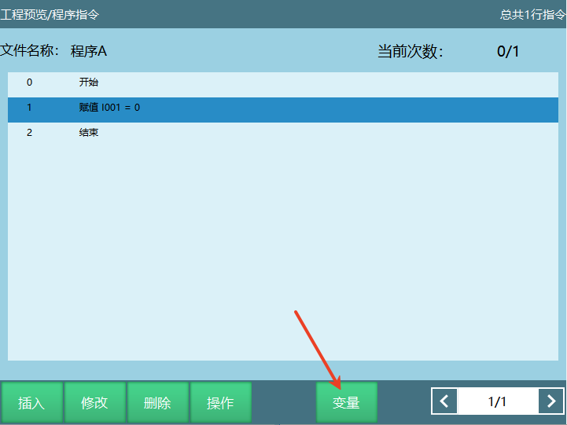

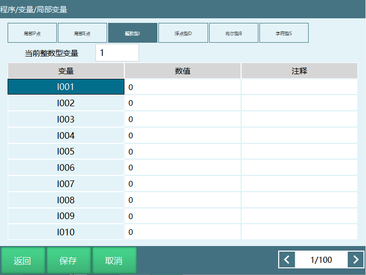

【修改】修改选中编号的变量值。

【保存】给目标变量修改值后，点击保存，变量值修改成功。

【取消】对选中变量不进行任何操作。

【返回】点击返回按钮，返回到程序界面。

【当前整数型变量】填入数值，点击小键盘上的确定，可以直接定位到对应变量

【注释】用户可以给变量添加注释，方便用户标记该变量的作用

#### 局部数值变量赋值

**手动赋值：**

1. 在程序-变量-局部变量界面，点击【修改】给需要赋值的变量输入数值；

2. 点击【保存】，变量修改成功。

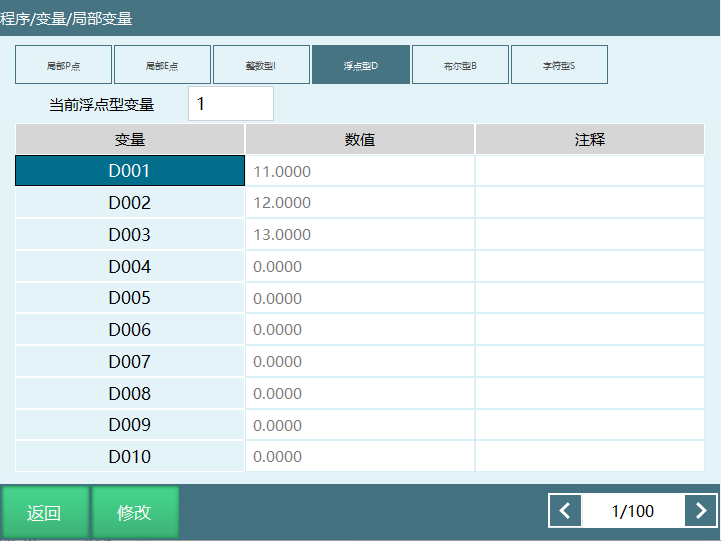
注意事项：通过手动给变量赋的值我们认为是这个变量的初始数值，通过指令给变量赋的值不会修改初始数值，局部变量界面变量值的显示是一直不变的，除非用户再次手动修改了初始值。

例如：我们通过指令给D001赋值为22，指令运行结束后在此界面查看D001=11。

**指令赋值：**

1. 新建工程，打开工程文件；

2. 插入指令，指令类型选择变量类，选择赋值指令；

3. 点击【确定】进入指令参数设置界面，选择变量类型和填入变量值；

4. 点击【确定】赋值指令插入成功，如果需要给多个不同的变量赋值，重复前面的步骤就可以；

5. 在指令执行时，可以在监控-数值变量界面监控变量数值的变化。

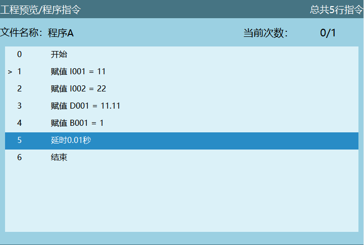

### 数值变量的应用

数值变量应用在不同的工艺、功能和指令等。

1. **工艺使用**：码垛工艺里面通过变量来记录码垛的层数，码垛的数目和当前层码垛数目。

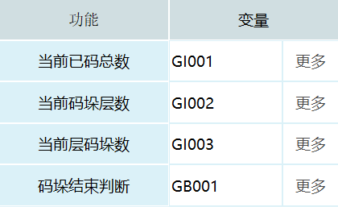

2. **指令使用**：
   - 计时指令通过绑定变量计时，程序在运行的时候，可以通过计时指令把程序运行的时间存入到变量

   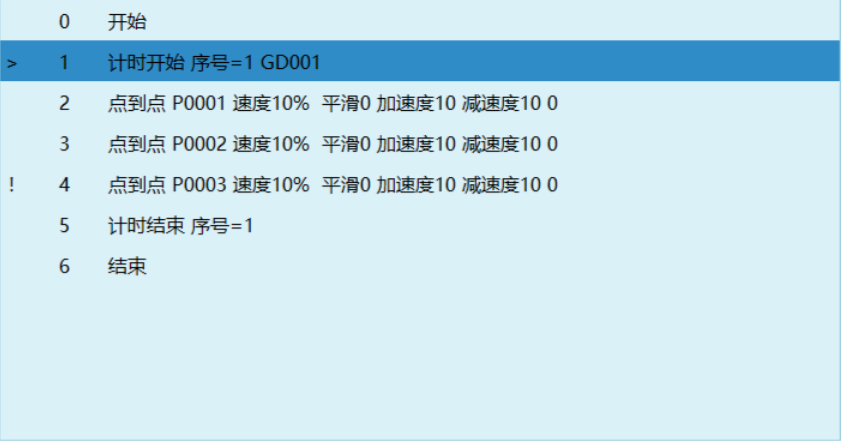
   
   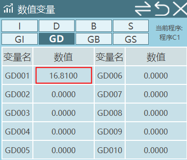

3. **条件判断指令通过变量作为判断的条件**

   - 例如：插入IF指令，判断条件是当I001<=5时执行IF语句里面的指令，当I001>5时，退出IF语句执行ENDIF后面的指令。

   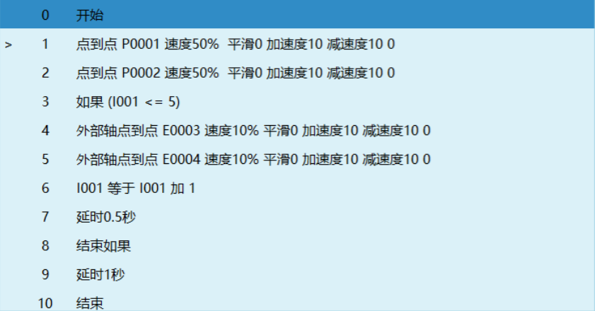

4. **位置变量类指令**：点位的加、减、改可以通过给变量赋值的形式对点位进行修改，运动控制类、程序控制类等指令类型都会用到绑定变量功能。

### 全局位置变量

点击变量-全局位置，进入全局位置界面。

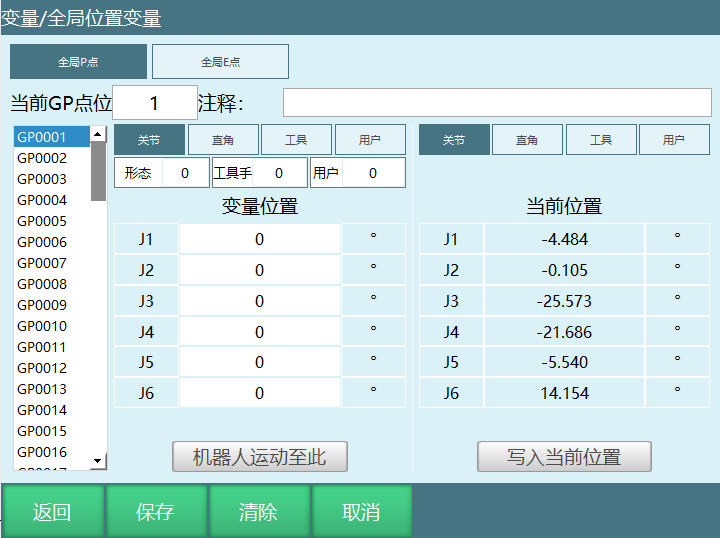

【修改】手动修改目标变量的点位，点击修改，填入参数后点击小键盘上的确定。

【保存】修改完点位后，点击保存，点位修改成功。

【清除】清除目标变量的点位信息，点击保存后点位数据清除成功。

【取消】取消对目标变量的修改和清除操作。

【返回】返回到变量界面。

【当前GP点位/当前GE点位】填写数值后点击小键盘上的确定，会直接定位到对应的变量，如果输入100，会直接定位到GP0100。

【注释】变量添加注释说明，方便用户知道每个位置变量所代表的意思。

【变量位置】可以将机器人不同位置的点位信息存入到选择的变量，当带有外部轴时，也会记录外部轴的位置信息，此参数可以手动修改。

【当前位置】机器人当前的位置信息，当带有外部轴时，也会记录外部轴当前的位置信息。此参数不能修改。

【机器人运动至此】在示教模式下上使能，然后点击运动至此，机器人运动到目标点位。

【写入当前位置】点击修改，再点击写入当前位置，会把机器人当前的点位信息写入到选择的变量。如果要将机器人当前关节坐标下的点位写入到变量，需要选中关节，然后再点击写入当前位置，如果要将机器人当前直角坐标下的点位写入到变量，需要选中直角，然后再点击写入当前位置，点击保存，写入位置成功。其它坐标下写入点位也是一样步骤。

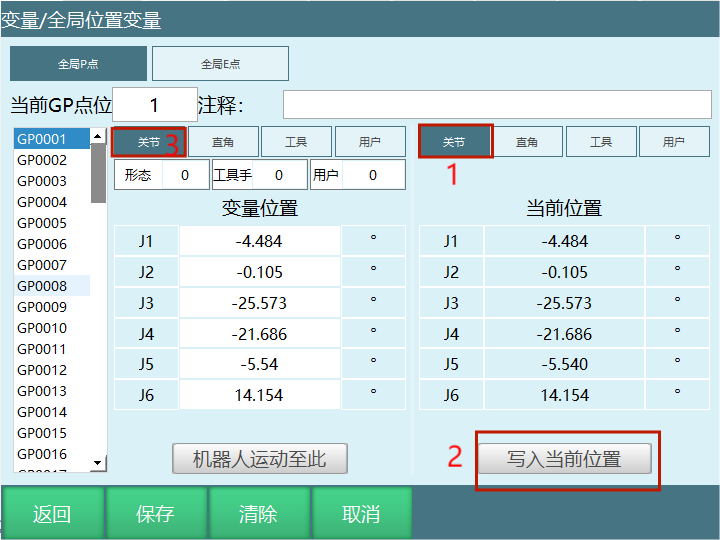

#### 全局位置变量修改

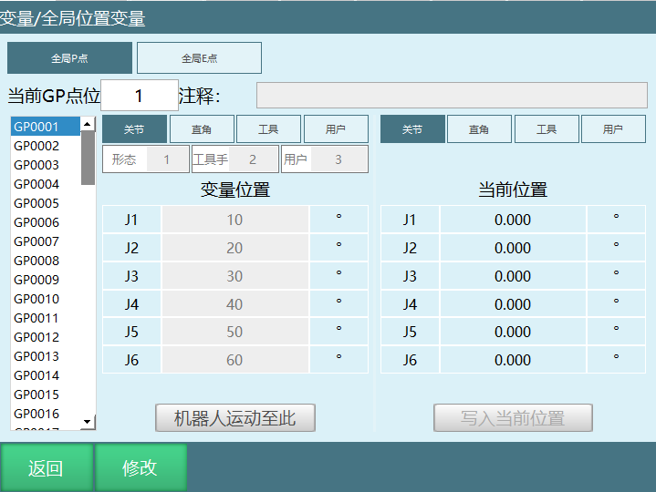

**全局位置变量界面修改GP点：**

1. **手动修改**：
   - 点击【修改】，选中需要修改的变量，然后在变量位置给每一个轴赋值，如果需要修改形态、工具手、用户这些参数信息时，在对应的输入框填入合理的参数值；
   - 点击【保存】变量位置信息修改成功。

2. **写入机器人当前位置修改**：
   - 示教模式下点动机器人，让机器人运动到目标位置后，点击【修改】；
   - 点击写入当前位置；
   - 点击【保存】目标变量修改成功。

**参数界面修改全局GP点：**

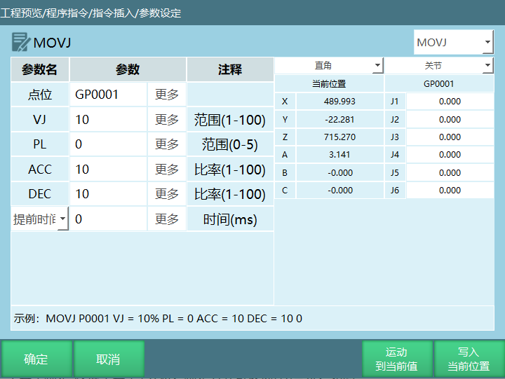

【运动到当前值】运动到设置的目标点位

【写入当前位置】机器人运动到目标点位后点击"写入当前位置"点位写入成功，如果是手动写入目标点位后必须先运动到设置的点，然后再点击"写入当前位置"点位写入成功，点击"确定"点位修改成功

【确定】参数修改完成后点击确定修改成功

【取消】点击取消参数未修改

注意事项：

1. 全局位置变量在不同的作业文件里面是可以直接被调用的；

2. 全局位置变量界面修改的GP点点位信息和参数设定界面修改的全局GP点点位信息是同步的，如果在全局位置变量界面点位被修改，则参数设定界面的全局点位也会被修改，例如：在参数设定界面修改GP0001的形态参数为2，那在全局位置变量界面GP0001的形态参数也会修改为2；

3. 如果程序A里面插入了GP0001和GP0002，程序B里面也插入了GP0001和GP0002，那这两个程序里面GP0001和GP0002的点位是相同的，如果修改了程序A里面的两个点位，程序B里面的点位也会被修改，会造成程序B在运行的时候出现问题；

4. 不同作业文件建议不要调用相同的全局GP点，否则其中一个作业文件如果修改了全局点位信息，那其他作业文件中被调用的相同的全局GP点也会被修改，会造成其他作业文件在运行的时候出现问题。

### 局部位置变量

点击【工程】-选择【程序】-在程序界面点击【变量】，进入局部位置变量界面。

说明：局部位置变量P仅能用于单独的一个作业文件，不能在所有的作业文件之间调用。

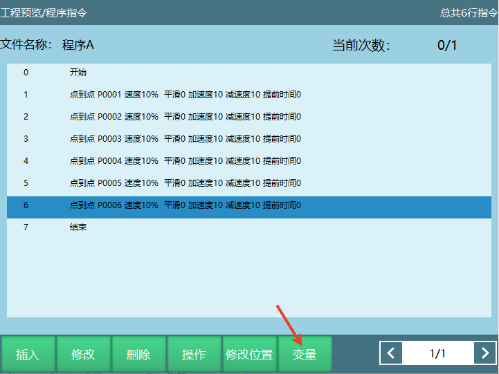

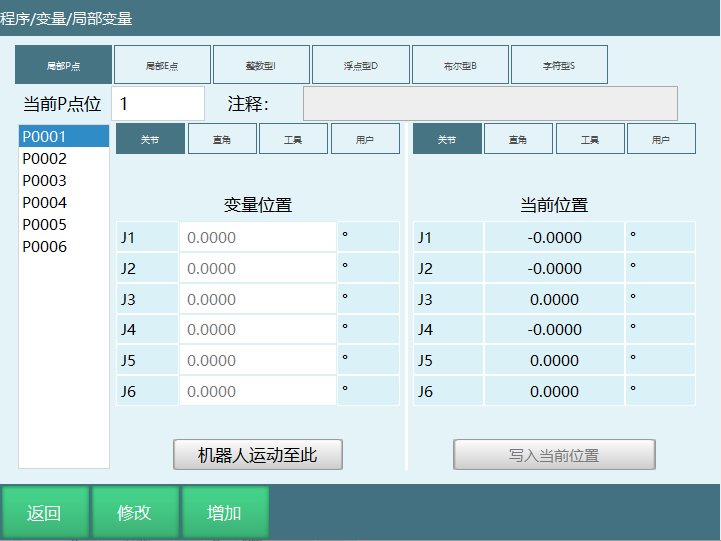

【修改】手动修改目标变量的点位，点击修改，填入参数后点击小键盘上的确定。

【返回】返回到程序指令界面。

【保存】修改完点位后点击保存，点位修改成功。

【增加】选中局部P点，点击增加会新建一个新的P点，选中局部E点，点击增加会新建一个新的E点，例如：现在局部P点的点位个数是在P0006，点击增加，点位个数会变到P0007。

【取消】原有变量的点位信息不进行任何修改。

【当前P点位/当前E点位】填写数值后点击小键盘上的确定，会直接定位到对应的变量，例如输入5，会直接定位到P0005。

【变量位置】可以将机器人不同位置的点位信息存入到选择的变量，当带有外部轴时，也会记录外部轴的位置信息。此参数可以手动修改。

【当前位置】机器人当前的位置信息，当带有外部轴时，也会记录外部轴当前的位置信息。此参数不能修改。

【机器人运动至此】在示教模式下上使能，然后点击运动至此，机器人运动到目标点位。

【写入当前位置】点击修改，再点击写入当前位置，会把机器人当前的点位信息存入到选择的变量。如果要将机器人当前关节坐标下的点位写入到变量，需要选中关节，然后再点击写入当前位置，如果要将机器人当前直角坐标下的点位写入到变量，需要选中直角，然后再点击写入当前位置，点击保存，写入位置成功。其它坐标下写入点位也是一样操作步骤。

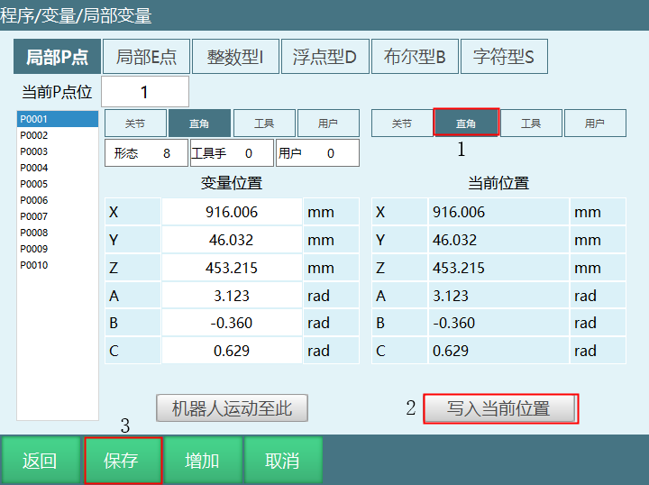

#### 局部位置变量修改

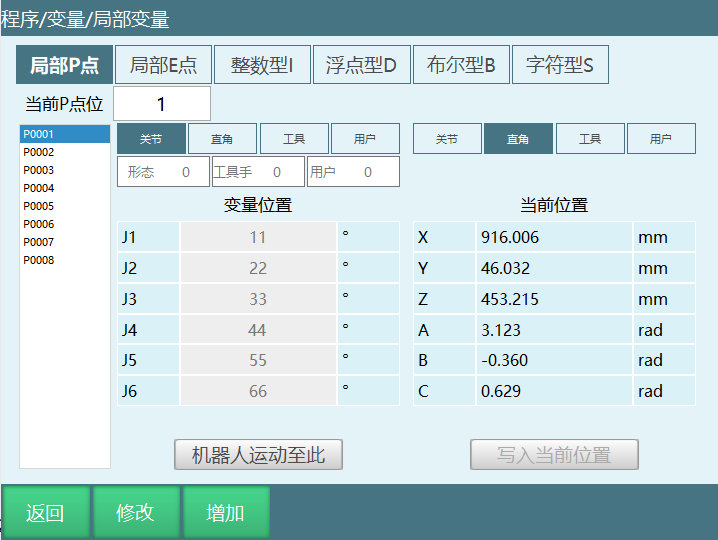

**局部位置变量界面修改P点：**

1. **手动修改**：
   - 点击【修改】，选中需要修改的变量，然后在变量位置给每一个坐标轴赋值，如果需要修改形态、工具手、用户这些参数信息时，在对应的输入框填入合理的参数值；
   - 点击【保存】变量位置信息修改成功。

2. **写入机器人当前位置修改**：
   - 示教模式下点动机器人，让机器人运动到目标位置后，点击【修改】；
   - 点击写入当前位置；
   - 点击【保存】目标变量修改成功。

**参数界面修改局部P点：**

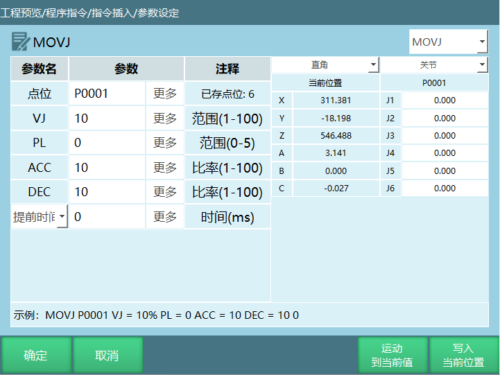

【运动到当前值】运动到设置的目标点位

【写入当前位置】写入目标点位后必须先运动到设置的点，然后再点击"写入当前位置"点位写入成功，点击"确定"点位修改成功

【确定】参数修改完成后点击确定修改成功

【取消】点击取消参数未修改

注意事项：

1. 局部位置变量界面的点位信息和参数设定界面的点位信息是同步的，如果在局部位置变量界面修改了P0001点的点位信息，在参数设定界面看P0001的点位信息被修改，如果在参数设定界面修改了P0001的用户坐标号为3，那在局部位置变量界面P0001的用户坐标号修改为3。

### 点位形态、工具手、用户值修改方式

1. 新建点位时形态、工具手、用户坐标默认取当前值。

修改工具坐标：插入的点位上方下拉框选中工具，选择工具手，点击确定，工具手修改成功。

修改用户坐标：插入的点位上方下拉框选中用户，选择用户坐标，点击确定，用户坐标修改成功。

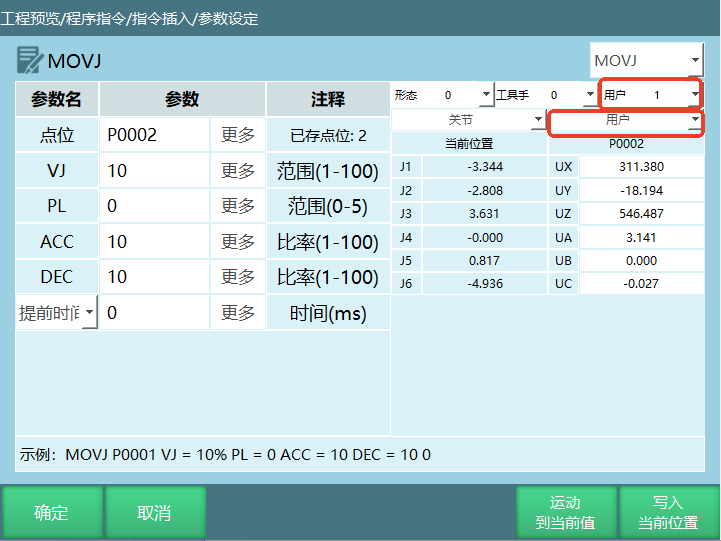

**手动设置形态、工具手、用户坐标**

1. 新建点位：可以直接修改形态、工具手、用户坐标。

 修改工具手：如图所示，插入点位时，修改坐标为工具，写入工具手，点击确定，工具手修改成功。

- 修改用户坐标和形态的方法和修改工具手一样；

- 点击【写入当前位置】会改变当前点位已有形态、工具手、用户值。

2. 指令-位置变量类-设置点位信息，可以改坐标系、形态等等。

1. 插入设置点位信息指令。

- 位置变量：选择想要修改的目标点位GP/GE/P/E，只能选择已有的点位。

- 坐标系：范围【0，3】或5；其中0：关节坐标系；1：直角坐标系
  ；2：工具坐标系；3：用户坐标系 ；。

- 角度/弧度：可选值0/1。

- 形态：范围【0，8】。

- 工具号：工具手号【0，999】。

- 用户坐标号：用户坐标系【0，999】。

2. 点击确定，运行程序即可修改。

#### 点位坐标系

范围【0，3】，其中0：关节坐标；1：直角坐标；2：工具坐标；3：用户坐标。

**如何修改位置变量的坐标系？**

1.  全局GP点可以点击变量-全局位置，进入全局位置变量界面点击修改，选择坐标系，点击保存，坐标系修改成功。

2.  局部P点可以在程序指令界面点击在变量，进入局部位置变量界面点击修改，选择坐标系，点击保存，坐标系修改成功。

3.  程序指令界面选中需要修改的全局GP点、局部P点，点击修改，进入参数设定界面，选择坐标系后点击确定，坐标修改成功。

#### 形态

范围：\[0,8\]。

1.  机型为6轴串联多关节机器人有形态参数，如形态参数选择当前，则控制系统自动通过转换方式计算出机器人当前的形态值，形态值是通过机器人1、3、5轴的关节点位来计算的，如果范围在\[-90,+90\]之间则为1，不在为0。

2.  形态值为机器人1轴、3轴、5轴位置的二进制转换为十进制然后再加1。

例如：某个六轴机器人1轴为59度、2轴为69度、3轴为79度、4轴为89度、5轴为99度、6轴为109度。

结果如下：二进制数110 =
十进制6，形态值为十进制结果再加1，该点位形态值为7。

| 轴 | 二进制数值 |
| --- | --- |
| 1轴 | 1 |
| 3轴 | 1 |
| 5轴 | 0 |

3.  机型为四轴SCARA机器人时有左右手参数。

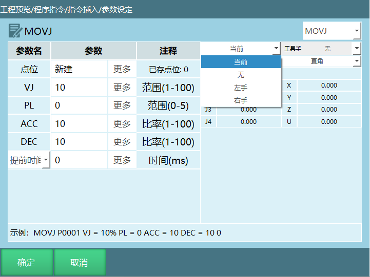

**如何修改位置变量形态？**

1.  全局GP点可以点击变量-全局位置，进入全局位置变量界面点击修改，在形态栏输入形态值，点击保存，形态参数修改成功。

2.  局部P点可以在程序指令界面点击在变量，进入局部位置变量界面点击修改，在形态栏输入形态值，点击保存，形态修改成功。

3.  程序指令界面选中需要修改的全局GP点、局部P点，点击修改，进入参数设定界面，输入形态值后点击确定，形态改成功。左右手参数的修改方法都是相同的。

#### 工具手

> 范围\[1,999\]。
>
> **如何修改位置变量的工具手编号？**

1.  全局GP点可以点击变量-全局位置，进入全局位置变量界面点击修改，在工具手栏输入形态值，点击保存，工具手参数修改成功。

2.  局部P点可以在程序指令界面点击在变量，进入局部位置变量界面点击修改，在工具手栏输入工具手号，点击保存，工具手修改成功。

3.  程序指令界面选中需要修改的全局GP点、局部P点，点击修改，进入参数设定界面，输入工具手后点击确定，工具手修改成功。

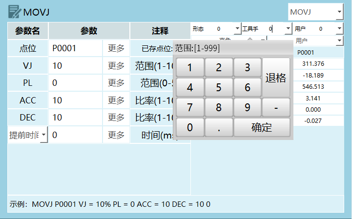

注意事项：当目标点位的坐标为直角，工具或者用户坐标时如果想要将目标点位绑定工具手，则选择对应的工具手，不绑定选择无；若运动时实际工具手和点位绑定工具手不同，则程序运行时出错。

例如：目标点位绑定工具手2，实际使用工具手1，运行指令时控制器报错（机器人1工具坐标使用错误，点位工具为1，实际使用工具2）。

#### 用户坐标

范围\[1,999\]。

如何修改目标点位的用户坐标号？

1.  全局GP点可以点击变量-全局位置，进入全局位置变量界面点击修改，在用户栏输入用户坐标号，点击保存，用户坐标号修改成功。

2.  局部P点可以在程序指令界面点击在变量，进入局部位置变量界面点击修改，用户栏输入用户坐标号，点击保存，用户坐标号修改成功。

3.  程序指令界面选中需要修改的全局GP点、局部P点，点击修改，进入参数设定界面，打开手动修改按钮选择用户后点击确定，用户坐标号修改成功。

注意事项：当目标点位的坐标用户坐标时如果想要将目标点位绑定用户坐标，则选择对应的用户编号，不绑定选择无；若运动时实际用户和点位绑定用户不同，则程序运行时出错。

例如：目标点位绑定用户1，实际使用用户2，运行指令时控制器报错（机器人用户坐标使用错误，点位用户为1，实际用户2）。

#### 角度/弧度

机器人在直角坐标、工具坐标、用户坐标下有姿态轴A、B、C，姿态轴的姿态值是可以手动修改的。

**如何修改角度/弧度？**

1.  点击设置-系统配置-维护模式，点击作业文件，点击修改，在姿态值列设置角度制和弧度制。

例如：修改姿态值为弧度制，我们可以在全局位置变量界面发现在直角坐标、工具坐标、用户坐标下A、B、C轴的单位变为弧度（rad）。

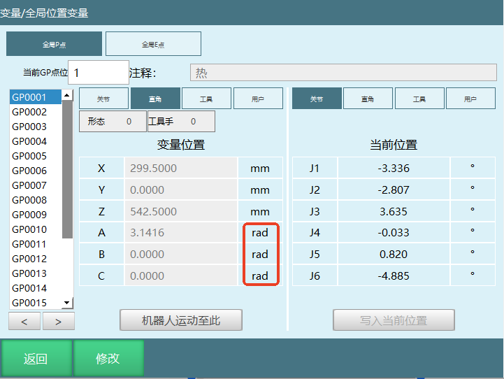
#### 局部P点点位信息说明

P0002点位数据分解如下：

|P0002 | 点位参数 | 参数说明 |
| --- | --- | --- |
| 1 | 坐标系 | 0：关节 1：直角 2：工具 3：用户 |
| 1 | 角度/弧度 | 0：角度（关节点）1：弧度（直角点、工具点、用户点） |
| 8 | 形态/左右手 | 六轴时为形态参数，四轴SCARA时为左右手参数，当前点位形态是8 |
| 0 | 工具 | 工具手编号 |
| 0 | 用户 | 用户坐标编号 |
| 0 | 预留 | 预留参数 |
| 0 | 预留 | 预留参数 |
| 812.7210 | 1轴 | 1轴点位坐标 |
| 295.7290 | 2轴 | 2轴点位坐标 |
| 1124.9070 | 3轴 | 3轴点位坐标 |
| 3.1410 | 4轴 | 4轴点位坐标 |
| 0 | 5轴 | 5轴点位坐标 |
| -0.3490 | 6轴 | 6轴点位坐标 |
| 0 | 7轴 | 7轴点位坐标 |

#### 局部E点点位信息说明 

E0001点位数据分解如下：

|E0001 | 点位参数 | 参数说明 |
| --- | --- | --- |
| 0 | 坐标系 | 0：关节 1：直角 2：工具 3：用户 |
| 0 | 角度/弧度 | 0：角度（关节点）1：弧度（直角点、工具点、用户点） |
| 8 | 形态/左右手 | 六轴时为形态参数，四轴SCARA时为左右手参数，当前点位形态是8 |
| 0 | 工具 | 工具手编号 |
| 0 | 用户 | 用户坐标编号 |
| 0 | 预留 | 预留参数 |
| 0 | 预留 | 预留参数 |
| -2.3060 | 1轴 | 1轴点位坐标 |
| 3.0150 | 2轴 | 2轴点位坐标 |
| 6.4860 | 3轴 | 3轴点位坐标 |
| 4.0130 | 4轴 | 4轴点位坐标 |
| -4.4430 | 5轴 | 5轴点位坐标 |
|   -13.0030 | 6轴 | 6轴点位坐标 |
| 0 | 7轴 | 7轴点位坐标 |
| 12.0 | O1轴 | O1轴点位坐标 |
| 58.0 | O2轴 | O2轴点位坐标 |
| 0 | O3轴 | O3轴点位坐标 |
| 0 | O4轴 | O4轴点位坐标 |
| 0 | O5轴 | O5轴点位坐标 |
| 0 | 预留 | 预留参数 |
| 0 | 预留 | 预留参数 |

### 引用变量

####  位置变量引用变量

使用介绍：给\[
\]里面的局部整型、全局整型变量赋值为某一个值时，局部、全局点位为该值所表示的点位。
| 格式  | 示例 |
| :---: | :---: |
| P\[INT/GINT\]   | P\[I001\]，当I001=10时，P\[I001\]相当于P0010    P\[GI001\]，当GI001=20时，P\[GI001\]相当于P0020  |
| GP\[INT/GINT\]  | GP\[I002\]，当I002=5时，GP\[I002\]相当于GP0005   GP\[GI002\]，当GI002=10时，GP\[GI002\]相当于GP0010  |
| E\[INT/GINT\]   | E\[I003\]，当I003=8时，E\[I003\]相当于E0008    E\[GI003\]，当GI003=12时，E\[GI003\]相当于E0012  |
| GE\[INT/GINT\]  | GE\[I004\]，当I004=15时，GE\[I004\]相当于GE0015   GE\[GI004\]，当GI004=25时，GE\[GI004\]相当于GE0025 |
---

#### 数值变量引用变量

使用介绍：给\[\]里面的局部整型、全局整型变量赋值为某一个值时，局部、全局变量为该值所表示的变量。

| 格式  | 示例 |
| :---: | :---: |
| I\[INT/GINT\]   | I\[I002\]，当I002=12时，I\[I002\]相当于I012    I\[GI002\]，当GI002=22时，I\[GI002\]相当于I022     |
| GI\[INT/GINT\]  | GI\[I003\]，当I003=3时，GI\[I003\]相当于GI003   GI\[GI003\]，当GI003=5时，GI\[GI003\]相当于GI005   |
| D\[INT/GINT\]   | D\[I004\]，当I004=5时，D\[I004\]相当于D005   D\[GI004\]，当GI004=7时，D\[GI004\]相当于D007      |
| GD\[INT/GINT\]  | GD\[I005\]，当I005=8时，GD\[I005\]相当于GD008   GD\[GI005\]，当GI005=12时，GD\[GI005\]相当于GD012 |
| B\[INT/GINT\]   | B\[I006\]，当I006=11时，B\[I006\]相当于B011   B\[GI006\]，当GI006=9时，B\[GI006\]相当于B009      |
| GB\[INT/GINT\]  | GB\[I007\]，当I007=14时，GB\[I007\]相当于GB014   GB\[GI007\]，当GI007=15时，GB\[GI007\]相当于GB015  |
| S\[INT/GINT\]   | S\[I008\]，当I008=23时，S\[I008\]相当于S023   S\[GI008\]，当GI008=17时，S\[GI008\]相当于S017     |
| GS\[INT/GINT\]  | GS\[I009\]，当I009=45时，GS\[I009\]相当于GS045   GS\[GI009\]，当GI009=21时，GS\[GI009\]相当于GS021  |
---

#### IO端口引用变量

| 格式  | 示例 |
| :---: | :---: |
| AIN | 根据当前所连接的IO板直接选择端口  |
| DIN | 根据当前所连接的IO板直接选择端口  |
| DOUT | 根据当前所连接的IO板直接选择端口  |
| AIN\[INT/GINT\]  | AIN\[I001\]，当I001=1时，AIN\[I001\]相当于AIN1-1端口   AIN\[GI001\]，当GI001=2时，AIN\[GI001\]相当于AIN1-2端口      |
| DIN\[INT/GINT\]  | DIN\[I010\]，当I010=5时，DIN\[I010\]相当于DIN1-5端口   DIN\[GI010\]，当GI010=6时，DIN\[GI010\]相当于DIN1-6端口      |
| DOUT\[INT/GINT\] | DOUT\[I015\]，当I015=10时，DOUT\[I015\]相当于DOUT1-10端口   DOUT\[GI016\]，当GI016=11时，DOUT\[GI016\]相当于DOUT1-11端口 |

注意事项：IO端口引用变量时定义的变量值不能超过当前所连接IO板的端口数。

### SET-赋值

格式：SET【变量名】I001【选择的目标变量】3【赋值的数值】。

功能：给定义的整型、浮点型、布尔型和字符串变量赋值。

参数：引用变量的详细介绍可以在引用变量章节查看。

| 参数 | 描述 |
| :---: | :---: |
| 变量 | 点击更多可以选择需要的变量类型(整型，浮点型，布尔型和字符串型) |
| 变量值 | 给上面的变量赋值，可以手填或者选择变量表示 |
---

示例：

1.  NOP

2.  SET I001=12

3.  SET D001=12.21

4.  SET GI012=100

5.  SET GI\[GI012\]=999

6.  END

示例说明：程序第1、2行是直接给选择的变量赋值，第4、5行是通过变量形式赋值,程序运行结束后I001=12,D001=12.21,GI100=999。

如果SET字符串类型时，字符串中有转义字符，如果想避免转义字符对字符串的影响，可在转义字符之前加\"\\\";字符串类中也有类似问题。

示例：

SET GS001=AS\\n：此处输出"\\n"被作为转义字符

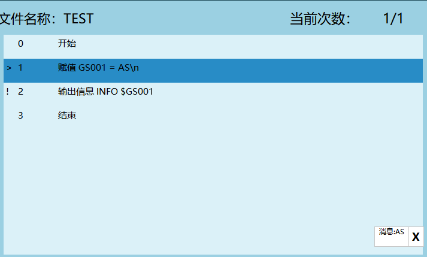

可修改为：SET GS001=AS\\\\n：此时可以正常打印

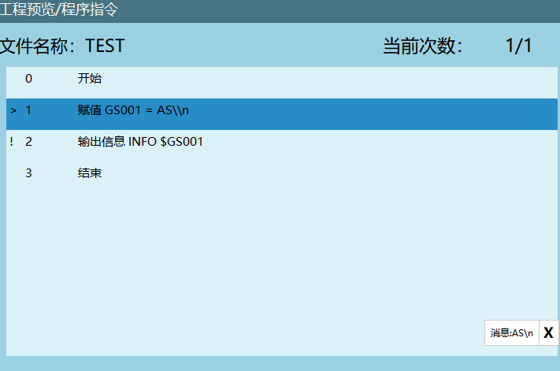

[转义字符对照表 - TabKey9 - 博客园
(cnblogs.com)](https://www.cnblogs.com/tabkey9/p/15930390.html)

### FORCESET-写入文件

格式：FORCESET【指令名】GI001【写入文件的变量名】。

功能：将缓存的数据存入硬盘。

在程序运行过程中，所有的计算、赋值操作均是对缓存中的数值进行更改的，并不会存入系统文件中。若要强制将内存中的全局数值变量写入文件中，则可以使用FORCESET指令。

| 参数 | 描述 |
| :---: | :---: |
| 变量名 | 点击更多选择要强制写入文件的变量名 |
---

示例：

1.  NOP

2.  GI001=10

3.  FORCESET GI001

4.  END

## 字符串类

### STRING-SPELL-字符串追加 

格式：STRING-SPELL【指令名】S001【目标变量】S002【变量值1】S003【变量值2】。

功能:目标变量的值等于变量值1+变量值2。

| 参数 | 描述 |
| :---: | :---: |
| 变量 | 选择的变量类型和变量名称：STRING、GSTRING |
| 变量值 | 变量值1 |
| 变量值 | 变量值2 |
---

示例：

1.  NOP

2.  SET S002=#@123#

3.  SET S003=#sdv#

4.  STRING_SPELL(S001=S002+S003)

5.  END

示例说明：执行第5行指令时S001变量的值会等于S002+S003，此时S001=@123sdv

### STRING-SLICE-字符串索引截取

格式：STRING-SLICE【指令名】S001【索引目标变量】（I001,I001）【起始索引位置，结束索引位置】S002【查询数据的存放变量】。

功能：截取一个字符串变量中的其中一部分字符串，并把截取到部分字符串存到指定的变量。

| 参数 | 描述 |
| :---: | :---: |
| 变量 | 索引的目标变量 |
| 起始索引 | 变量，手填，开头三种方式定位起始索引位置   1.  变量(INT，GINT):给变量赋值定位起始索引位置   2.  手填:直接手填值   3.  开头：默认的索引位置就是1   例如：目标变量S002=@QWEASD234,起始索引位置3，那就会从第3个字符W开始索引 |
| 结束索引 | 变量，手填，结尾三种方式定位结束索引位置   1.  变量(INT，GINT):给变量赋值定位起始索引位置   2.  手填:直接手填值   3.  结尾：默认的索引位置就是END,表示索引目标变量的最后一个字符   例如：目标变量S002=@QWEASD234,起始索引位置3，结束索引位置7，那就会从第3个字符W开始索引，从第七个字符D结束索引  |
| 数据存放变量   | 截取的数据存放的变量（STRING,GSTRING）  例如：目标变量S002=@QWEASD234,起始索引位置3，结束索引位置7，那就会从第3个字符W开始索引，从第七个字符D结束索引,将截取部分的字符WEAS存入到选择的变量 |
---

示例：

1.  NOP

2.  SET S010 = #!@INEXBOT123#

3.  SET I001 = 2

4.  SET I002 = 10

5.  STRING-SLICE S010(I001,I002)S011

6.  END

示例说明:索引的目标变量S010=!@INEXBOT123,索引起始位置I001=2,索引结束位置I002=10,截取部分存入变量S011，程序运行结束后S011=@INEXBOT。

### STRING-SPLIT-字符串分隔符拆分

格式：STRING-SPLIT【指令名】S001【拆分的变量名】，【分隔符】S002【查询到的数据存放首个变量】I001【使用数据存放数，"0"表示不使用】。

功能：将字符串变量中的其中一个字符拆分，并把拆分的字符依次存放到指定变量中。

| 参数 | 描述 |
| :---: | :---: |
| 变量 | 拆分的字符串变量名（STRING,GSTRING） |
| 分隔符 | 手填值和变量定义分隔符，通过分隔符可以把原有的一个字符串拆分成几个字符串   例如：GS010=@INEXBOT@TEST!123,分隔符为@,运行分隔符拆分指令，将原有的字符串拆分为两部分INEXBOT和TEST!23 |
| 数据存放的首个变量 | 分隔符拆分完成的字符存放的首位置   例如：GS010=@INEXBOT@TEST!123,分隔符为@,运行分隔符拆分指令，将原有的字符串拆分为两部分INEXBOT和TEST!23，这两部分字符串会根据选择的首位置依次存入，比如选择的首位置是GS005,那拆分后的字符串INEXBOT和TEST!23会依次存入变量GS005，GS006 |
| 数据存放数  | 记录拆分完成的字符串数量，可以选择不使用（选择不使用输入框置灰）和变量（INT,GINT）记录   例如：GS010=@INEXBOT@TEST!123,分隔符为@,运行分隔符拆分指令，将原有的字符串拆分为两部分INEXBOT和TEST!23，如果数据存放数选择变量GI001,指令执行完成GI001=2 |
---
注意事项：如果设置的分隔符在原有的字符变量中没有，那运行拆分指令后，拆分的字符还是和原来一样。

示例：

1.  NOP

2.  SET GS010 = #@INEXBOT@TEST!123#

3.  STRING_SPLIT GS010 #@# GS015 GI001

4.  END

示例说明：拆分的目标变量GS010=@INEXBOT@TEST!123,分隔符为@，执行拆分指令后GS015=INEXBOT,GS016=TEST!123,GI001=2。

### STRING_LOCATE-字符串定位查询

格式：STRING_LOCATE【指令名】GS001【定位查询的变量】#T#【定义的索引符】GI001【数据存放的首个变量】GI005【数据存放数】。

功能：查询字符串变量里面的一种字符所在的位置，并把位置和数量存到指定变量。

| 参数 | 描述 |
| :---: | :---: |
| 变量 | 定位查询的字符串变量（STRING,GSTRING） |
| 待索引变量 | 手填：直接手填要定位查询的字符    变量（STRING,GSTRING）:给变量赋值的形式定位查询的字符   例如：定位查询的变量GS001=@INEXBOT@TEST,待索引变量是"T"   执行定位查询指令，会将"T"在字符串变量里面的位置存入到选择的变量 |
| 数据存放的首个变量 | 将查询到的数据存入到选择的变量（INT,GINT）  例如：定位查询的变量GS001=@INEXBOT@TEST,待索引变量是"T"    执行定位查询指令，会将"T"在字符串变量里面的位置存入到选择的变量，比如选择的首个变量是GI001,那GI001记录的是定位到的第一个字符"T"所在的位置，GI002记录的是第二个字符"T"所在的位置，以此顺序依次读取 |
| 数据存放数 | 记录定位完成的字符数量，可以选择不使用（选择不使用输入框置灰）和变量（INT,GINT）记录   例如：定位查询的变量GS001=@INEXBOT@TEST,待索引变量是"T"   执行定位查询指令，会把"T"在字符串变量里面定位到的个数存入到选择的变量，比如选择的变量是GI015,定位查询指令执行结束后，会将定位到的个数存入GI015 |
---

注意事项:

1.  如果待索引变量在一个字符串里面是不连续的字符，在执行定位查询指令时，字符的位置和个数是无法读取出来的。

例如：定位查询的变量GS001=@INEXBOT@TEST,待索引变量是"I@T"这种参数设置就无法读取。

2.  如果待索引变量在一个字符串里面是连续的字符，在执行定位查询指令时，读取出来的字符位置是第一个索引变量的位置,数据存放个数为1。

例如：定位查询的变量GS001=@INEXBOT@TEST,待索引变量是"BOT"这种参数设置。

示例：

1.  NOP

2.  SET S001 = #T#

3.  SET GS010 = #@INEXBOT@TEST#

4.  STRING_LOCATE GS010 S001 GI011 GI015

5.  END

示例说明：待索引变量为S001,首先给字符串变量赋值S001=T，数据存放首个变量为GI011,数据存放数为GI015,程序运行结束后将查询到的数据记录到选择的变量。

### STRING_LENGTH-字符串长度

格式：STRING_LENGTH【指令名】S001【待计算长度的变量】I001【数据存放数变量】。

功能：计算一个字符串变量的长度，并把计算的长度存到变量：

| 参数 | 描述 |
| :---: | :---: |
| 变量 | 计算字符串长度的变量（STRING,GSTRING）  例如：S001=BIANLIANG,执行字符串长度指令可以知道S001这个变量有多少个字符 |
| 数据存放的变量 | 将计算出来的字符串长度存放到变量（INT,GINT）  例如：S001=BIANLIANG,可以把S001这个变量的字符长度存入到变量             |
---

示例：

1.  NOP

2.  SET S001=BIANLIANG

3.  STRING_LENGTH S001 I001

4.  END

示例说明：计算变量S001的长度，将计算出来的字符串长度存入到变量I001。

### STRING_TO-字符串转非字符串

格式:STRING_TO【指令名】S001【需要转译的字符串】I001【转译的目标变量】。

功能：字符串变量转换成非字符串变量。

| 参数 | 描述 |
| :---: | :---: |
| 字符串变量 | 需要转译的字符串（STRING,GSTRING）|
| 非字符串变量  | 转译的目标变量(整型，浮点型，布尔型)   例如：需要转译的变量S005=123ZIFU35,转译的目标变量为GI001，运行指令后字符串变量转换成非字符串变量，GI001=123 |
---
注意事项：

1.  字符串变量转换成非字符串变量时只会将字符串变量的数值部分转译到非字符串变量，在转译过程中会从字符串变量的第一个字符开始转译，直到检测到的字符是非数值的字符时转译结束，将检测到的数值部分的字符转译到非字符变量，如果检测到的第一个字符就是非数值的字符，那字符串无法转译成功。

例如：S005=123ZIFU35，在转译过程中只会将字符转译"123"成非字符串变量，因为3后面的字符是非数值字符，所以后面的字符部分都不转译。

例如：S005=ZI123FU35，在检测到第一个字符时就已经是非数值字符，所以无法从字符串转到非字符串。

示例：

1.  NOP

2.  SET S005 = #123ZIFU35#

3.  STRING_TO S001 D001

4.  END

示例说明：字符串变量S005 =
123ZIFU35，将字符串变量转非字符串变量，转译的目标变量为D001,程序运行结束后D001=123。

### TO_STRING-非字符串转字符串

格式：TO_STRING【指令名】I001【需要转译的变量】S001【转译的目标变量】。

功能：非字符串变量转换成字符串变量。

| 参数 | 描述 |
| :---: | :---: |
| 非字符串变量 | 需要转译的变量，手填字符或者给变量赋值形式定义字符(整型，浮点型，布尔型)
| 字符串变量 | 转译的目标变量（STRING,GSTRING）|
---

注意事项：

1.  如果你需要转译的变量是浮点型变量，并且只需要转译小数点后N位，在参数设定界面非字符串变量行输入的格式为：\$.ND001。

例如：转译变量D001=123.1122，转译小数点后三位，在参数设定界面非字符串变量行输入的格式为：\$.3D001,转译的目标变量为S001,程序运行结束后S001=123.112。

2.  同时将多个非字符串转译成一个字符串。

例如：同时将D001=12.23,D002=23.345,D003=34.5678非字符串转译成字符串S001，D001转译小数点后1位,D002转译小数点后2位,D003转译小数点后3位,在参数设定界面非字符串变量行输入的格式为：\$.1D001\$.2D002\$.3D003,程序运行结束后S001=12.223.3434.568。

示例：

1.  NOP

2.  SET GI001 = 123

3.  TO_STRING GI001 S001

4.  TO_STRING \# TEST# S002

5.  END

示例说明：程序运行结束后S001=123,S002=TEST。

## AI 检索专用问答对 (Q&A for Retrieval) 

 **Q: 如何使用字符串分隔符拆分指令？**

A: 使用STRING-SPLIT指令，设置拆分的变量名、分隔符、数据存放的首个变量和数据存放数。例如：STRING_SPLIT GS010 #@# GS015 GI001，将GS010按@分隔，结果存入GS015开始的变量，拆分数量存入GI001。

**Q: 如何计算字符串长度？**

A: 使用STRING_LENGTH指令，设置待计算长度的变量和数据存放数变量。例如：STRING_LENGTH S001 I001，计算S001的长度并将结果存入I001。

**Q: 如何将非字符串变量转换为字符串？**

A: 使用TO_STRING指令，设置需要转译的变量和转译的目标变量。例如：TO_STRING GI001 S001，将GI001的数值转换为字符串存入S001。

**Q: 如何使用字符串追加指令？**

A: 使用STRING-SPELL指令，设置目标变量和目标变量追加的值。例如：STRING_SPELL(S001+#!ASD234@#)，在原有变量S001的基础上追加字符!ASD234@。

**Q: 如何截取字符串的一部分？**

A: 使用STRING-SLICE指令，设置索引的目标变量、起始索引、结束索引和数据存放变量。例如：STRING-SLICE S010(I001,I002)S011，从S010中截取从I001到I002位置的字符串并存入S011。

## 版本历史

| 版本 | 日期 | 变更内容 | 作者 |
| :--- | :--- | :--- | :--- |
| 1.0.0 | 2026-06-22 | 初始版本 | MUZI165 |