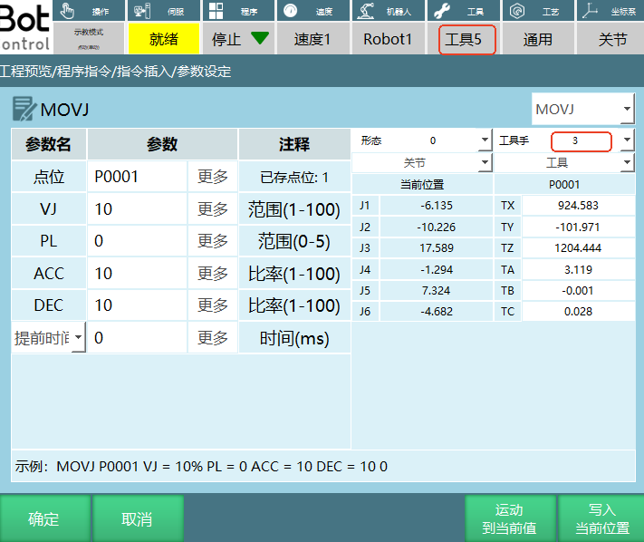
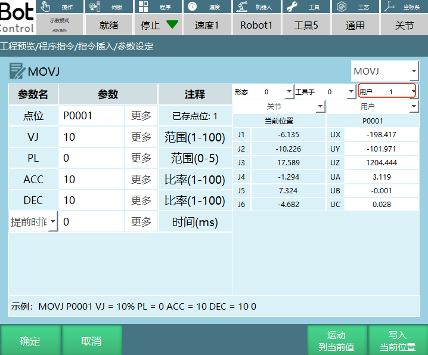

# 坐标系类+网络通讯类

## 坐标系类

"√"表示支持此条指令。

| 指令类型 | 前台 | 全局后台 | 局部后台 |
| :--- | :--- | :--- | :--- |
| 切换工具手 | √ | √ | √ |
| 切换用户坐标 | √ | √ | √ |
| 用户坐标转换 | √ | | |
| 切换外部轴 | √ | | |

## 网络通讯类

| 指令类型 | 前台 | 全局后台 | 局部后台 |
| :--- | :--- | :--- | :--- |
| 发送数据 | √ | √ | √ |
| 解析数据 | √ | √ | √ |
| 读取数据 | √ | √ | √ |
| 打开数据 | √ | √ | √ |
| 关闭数据 | √ | √ | √ |
| 输出信息 | √ | √ | √ |
| 获取信息连接状态 | √ | √ | √ |

---

## 坐标切换类

### SWITCHTOOL-切换工具手

格式：SWITCHTOOL【指令名】(1)【切换的工具手编号】。

功能：切换对应工具手编号的参数（工具手参数，负载参数）。

参数：

| 参数 | 说明 |
| :--- | :--- |
| 变量类型 | 手填、变量形式（INT、GINT）范围[0,999]，编号为0表示无工具手 |

注意事项：

1. 切换工具手后检查机器人点位工具和实际使用工具是否一致，否则导致程序运行出错

如图所示：设置的点位工具编号为3，切换工具指令选择的编号是5。

示例：

1. NOP
2. SET GI001 = 5
3. SWITCHTOOL (GI001)
4. END

示例说明：在执行指令时示教器界面状态栏的工具手编号会切换到指令中设置的工具手编号5。

### SWITCHUSER-切换用户坐标

格式：SWITCHUSER【指令名】(1)【切换的用户坐标编号】。

功能：切换对应用户编号的参数。

参数：

| 参数 | 说明 |
| :--- | :--- |
| 变量类型 | 手填、变量形式（INT、GINT）范围[1,999] |

注意事项：切换用户坐标后检查机器人点位用户和实际用户是否一致，否则会导致程序运行出错。

如图所示：设置的点位用户编号为1，切换用户指令选择的编号是9。

示例：

1. NOP
2. SET I010 = 2
3. SWITCHUSER (I010)
4. END

示例说明：在执行指令时示教器界面状态栏的用户编号会切换到指令中设置的用户编号2，但不会直接从其他坐标系切成用户坐标系。

### USERCOORD_TRANS-用户坐标转换

格式：USERCOORD_TRANS【指令名】1【用户坐标A的序号】2【用户坐标B的序号】3【用户坐标C的序号】。

功能:用户A与用户B叠加，计算出用户C。

例如：在传送带和相机结合使用的场景下，托盘是用户A,相机拍摄得出的工件坐标相对于托盘是用户B，最后计算出工件相对于机器人的用户C。

参数:

| 参数 | 说明 |
| :--- | :--- |
| 用户坐标C | 用户A和用户B叠加计算出来的用户坐标C，将计算出来的参数存入选择的用户序号 |
| 用户坐标A | 存入用户坐标A的序号 |
| 用户坐标B | 存入用户坐标B的序号 |

示例：

1. NOP
2. USERCOORD_TRANS (1)(2)(3)
3. END

示例说明：用户坐标1和用户坐标2计算出用户坐标3。

### SWITCHSYNC-切换外部轴

格式：SWITCHSYNC【指令名】1、2、3【外部轴组号1、外部轴组号2、外部轴组号3】。

功能：通过设置外部轴组号来切换外部轴类型。

参数：

| 参数 | 说明 |
| :--- | :--- |
| 外部轴组号 | 切换外部轴的组号，范围[0,3]。例如：设置的外部轴组1是旋转单轴，外部轴组2是旋转双轴，如果在切换外部轴参数设置界面外部轴组号是2，运行指令外部轴会切换到旋转双轴 |

示例：在机器人配置界面，设置的外部轴组1是旋转单轴，外部轴组2是旋转双轴，外部轴组3是直线单轴。

1. NOP
2. TIMER T=1
3. SWITCHSYNC 1
4. MOVLEXT E0003 V = 50 mm/s PL = 0 ACC = 1 DEC = 1 SYNC = 1 0
5. MOVLEXT E0004 V = 50 mm/s PL = 0 ACC = 1 DEC = 1 SYNC = 1 0
6. END

示例说明：程序在运行第3行时切换到外部轴组1（旋转单轴），然后机器人在旋转单轴上面走直线轨迹。

## 网络通讯类

### SENDMSG-发送数据

格式：SENDMSG【指令名】ID=1【工艺号序号】#DATA#【发送的数据】。

功能：向某个网络设备发送字符串信息或者变量值。

参数：

| 参数 | 说明 |
| :--- | :--- |
| ID | TCP通讯时连接的工艺号 |
| 发送字符 | 给连接的网络设备发送数据。可以发送字符串格式数据、发送变量值。若要发送变量需要在目标变量前面加$符号，例如：SENDMSG ID = 1 #$D001#，如果选择的目标变量D001本身就有值，在执行发送字符数据指令时网络端收到的是变量值，如果目标变量D001本身没有值，在执行发送字符数据指令时网络端收到的数值是0 |

示例：

1. NOP
2. OPENMSG ID= 1
3. SET D001 = 12.23
4. SENDMSG ID = 1 #$D001#
5. CLOSEMSG ID = 1
6. END

示例说明：TCP通讯成功后，发送数据D001的变量值。

### PARSEMSG-解析数据

格式：PARSEMSG【指令名】ID=1【工艺号序号】I001【数据存放的首变量】CLEARCACHE=0【是否清除缓存，"0"不清除，"1"清除】0【提取数据的数量"0"不记录，"1"记录】。

功能：该指令用来解析外部设备传来的一组数据，并将数据存入多个变量。

参数：

| 参数 | 说明 |
| :--- | :--- |
| ID | TCP通讯时连接的工艺号 |
| 数据存放的首个变量 | 将查询到的数据存放在变量，存放的变量类型：整型、浮点型、字符串型。例如：TCP接收到多位数值A、B、C，设置的第一位变量名为GI001，则将A存入GI001，B存入GI002，C存入GI003。 |
| 解析后清除缓存区 | 否：解析后不会清除缓存，在外部设备没有发送新的数据时解析所得到的数据一直为缓存中的值，外部设备重新发送数据后能解析到新的数据；是：解析后会清除缓存，在外部设备没有发送新的数据时解析得不到数据，外部设备重新发送数据后能解析到新的数据。例如：外部设备发送数据：@,12,23,34,！存入的首变量GI001,则GI001=12,GI002=23,GI003=34。解析后清除缓存区：否：例如我们通过赋值指令将GI001赋值为10，然后再运行解析数据，在外部设备没有发送新数据时，仍会解析缓存中的数据12并赋值给GI001，最后显示GI001=12；是：例如我们通过赋值指令将GI001赋值为10，然后再运行解析数据，在外部设备没有发送新数据时，缓存没有数据无法解析并给GI001赋值，最后显示GI001=10 |
| 数据存放数 | 记录发送数据的数量。变量：发送的数据数量存入到选择的变量，例如：TCP接收到3位数值，数据存放变量GI001,执行解析指令GI001=3；不使用：不记录发送的数据个数，选择不使用时，输入框置灰。 |

示例：

1. NOP
2. OPENMSG ID= 1
3. PARSEMSG ID = 1 I001 CLEARCACHE = 0 GI001
4. CLOSEMSG ID = 1
5. END

示例说明：网络通讯成功后，运行解析指令，外部设备发送的数据存入首变量I001，按照发送个数依次顺延，数据个数存入变量GI001。

### READCOMM-读取数据

格式：READCOMM【指令名】ID=1【工艺号序号】ETHERENT、MODBUS【通讯方式】P001【点位存放变量】I001【点位存放个数】。

功能：读取通过以太网或Modbus通讯发送点位，并将点位存入到变量。

参数：

| 参数 | 说明 |
| :--- | :--- |
| 工艺号 | TCP通讯时连接的工艺号 |
| 通讯方式 | 以太网通讯、Modbus通讯 |
| 点位存放首个变量 | 将发送的点位存入到选则的位置变量（P、GP） |
| 点位存放数 | 用变量（INT/GINT）记录发送的点位个数 |

注意事项：在选择不同的通讯方式发送点位时需要注意格式，否则点位数据无法写入到变量。

1. ETHERENT通讯：在发送点位时可以参考《inexbot读取指令ETHERENT点位通讯协议》。

2. Modbus通讯：点位的设置可以参考手册《网络通讯功能使用手册》通讯方式部分。

示例：

1. NOP
2. OPENMSG ID= 1
3. READCOMM ID = 1 ETHERENT TO GP001 IOO1
4. CLOSEMSG ID = 1
5. END

示例说明：根据《inexbot读取指令ETHERENT点位通讯协议》发送点位，网络通讯成功后，读取点位指令，会将发送的点位数据保存到变量GP0001,点位个数存到变量I001。

### OPENMSG-打开数据

格式：OPENMSG【指令名】ID = 1【工艺号序号】。

功能：打开网络通讯

参数：

| 参数 | 说明 |
| :--- | :--- |
| ID | TCP通讯时连接的工艺号，范围[1,9] |

示例：

1. NOP
2. OPENMSG ID= 1
3. SENDMSG ID = 1 #TEST#
4. CLOSEMSG ID = 1
5. END

示例说明：执行打开数据指令，控制器与外部设备通讯成功后就可以收发数据。

### CLOSEMSG-关闭数据

格式：CLOSEMSG【指令名】ID = 1【工艺号序号】。

功能：关闭网络通讯。

参数：

| 参数 | 说明 |
| :--- | :--- |
| ID | TCP通讯关闭时的工艺号，范围[1,9] |

示例：

1. NOP
2. OPENMSG ID= 1
3. SENDMSG ID = 1 #TEST#
4. CLOSEMSG ID = 1
5. END

示例说明：执行关闭数据指令，控制器与外部设备通讯断开。

### PRINTMSG-输出信息

格式：PRINTMSG【指令名】0，1，2【类型消息，警告，报错】#输入内容#【输出的字符】。

功能：通过打印提示条的方式输出定义的信息内容。

参数:

| 参数 | 说明 |
| :--- | :--- |
| 类型 | 消息：执行指令时示教器界面打印白条提示；警告：执行指令时示教器界面打印黄条的警告提示；错误：执行指令时示教器界面打印红条的错误提示，且伺服下电 |
| 输出字符 | 打印提示条时示教器界面显示的内容，若要打印变量，则在变量前加入$，例如$GD001,输入变量在执行指令时，提示条打印的是变量的值 |

示例：

1. NOP
2. PRINTMSG 0 #这是一个消息#
3. PRINTMSG 1 #这是一个警告#
4. PRINTMSG 2 #这是一个报错#
5. END

示例说明：执行指令，示教器界面分别打印白色消息提示，黄色警告提示，红色报错提示。

### MSG_CONN_ST-获取信息连接状态

格式：MSG_CONNECTION_STATUS【指令名】1【工艺号序号】GB001【当前连接状态"0"未连接，"1"已连接】。

功能：获取网络设置里某个工艺号的连接状态。

参数：

| 参数 | 说明 |
| :--- | :--- |
| 工艺号 | TCP通讯设置界面选择的工艺号 |
| 状态存入变量名 | 当前连接的工艺号的状态用变量（BOOL,GBOOL）表示 |

示例：

1. NOP
2. OPENMSG ID= 1
3. MSG_CONNECTION_ST I GB001
4. CLOSEMSG ID = 1
5. END

示例说明：执行打开数据指令，控制器与外部设备通讯成功的话GB001=1,如果通讯失败的话GB001=0。

---

## AI 检索专用问答对 (Q&A for Retrieval)

**Q：如何切换工具手？**

A：使用SWITCHTOOL指令，指定工具手编号。例如，SWITCHTOOL (GI001)表示切换到变量GI001指定的工具手编号。工具手编号范围为[0,999]，编号为0表示无工具手。

**Q：如何切换用户坐标？**

A：使用SWITCHUSER指令，指定用户坐标编号。例如，SWITCHUSER (I010)表示切换到变量I010指定的用户坐标编号。用户坐标编号范围为[1,999]。

**Q：如何进行用户坐标转换？**

A：使用USERCOORD_TRANS指令，指定用户坐标A、B、C的序号。例如，USERCOORD_TRANS (1)(2)(3)表示用户坐标1和用户坐标2计算出用户坐标3。

**Q：如何切换外部轴？**

A：使用SWITCHSYNC指令，指定外部轴组号。例如，SWITCHSYNC 1表示切换到外部轴组1。外部轴组号范围为[0,3]。

**Q：如何发送数据？**

A：使用SENDMSG指令，指定工艺号和发送的数据。可以发送字符串格式数据或变量值，发送变量需要在目标变量前面加$符号。例如，SENDMSG ID = 1 #$D001#表示发送变量D001的值。

**Q：如何解析数据？**

A：使用PARSEMSG指令，指定工艺号、数据存放的首变量、是否清除缓存和提取数据的数量。例如，PARSEMSG ID = 1 I001 CLEARCACHE = 0 GI001表示将外部设备发送的数据存入首变量I001，不清除缓存，数据个数存入变量GI001。

**Q：如何读取数据？**

A：使用READCOMM指令，指定工艺号、通讯方式、点位存放变量和点位存放个数。例如，READCOMM ID = 1 ETHERENT TO GP001 I001表示通过以太网通讯读取点位数据并存入GP001，点位个数存到变量I001。

**Q：如何打开和关闭网络通讯？**

A：使用OPENMSG指令打开网络通讯，使用CLOSEMSG指令关闭网络通讯。例如，OPENMSG ID= 1表示打开工艺号1的网络通讯，CLOSEMSG ID = 1表示关闭工艺号1的网络通讯。

---

## 版本历史

| 版本 | 日期 | 变更内容 | 作者 |
| :--- | :--- | :--- | :--- |
| 1.0.0 | 2026-06-23 | 初始版本 | tongmengyuan123 |
