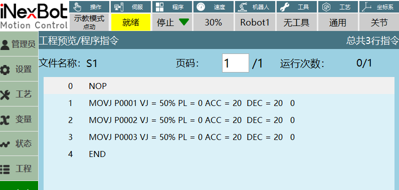
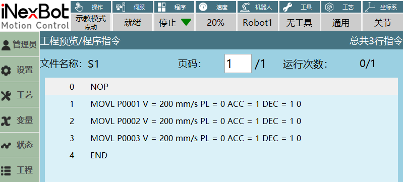
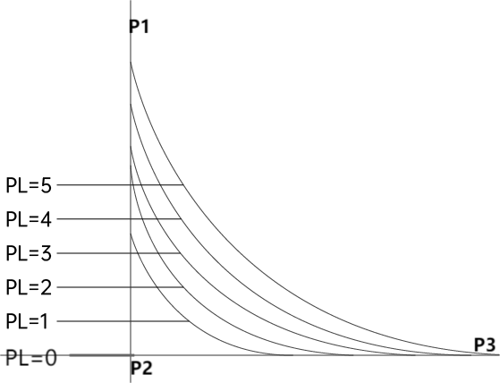
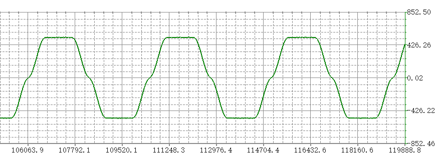
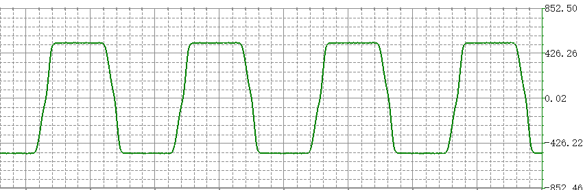
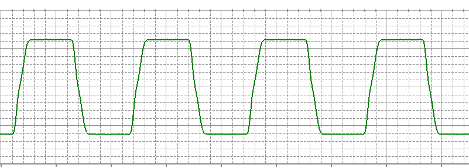
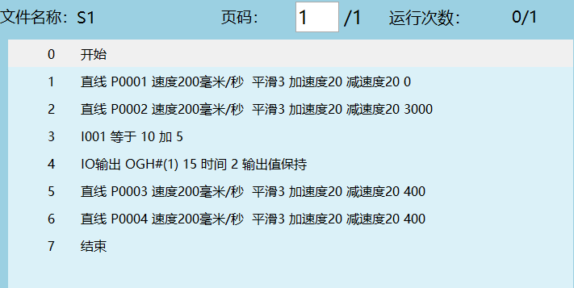
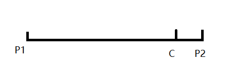

# 指令参数

本章节讲述指令参数的相关内容。

## 指令速度

### VJ

VJ是控制机器人各个关节的运动速度，范围:\[1,100\]。

1. 单步关节：最大轴速度=关节额定正速度\*指令速度\*全局速度；
2. 运行模式运行：最大轴速度=关节额定正速度\*指令速度\*全局速度；
3. 示例：执行上图movj指令时最大轴速度=235.17\*50%\*30%。
    （235.17表示机器人一轴的额定正速度，此处仅以单独运动机器人一轴时作为示例说明）

注意事项：单步关节最大速度限制为关节额定速度\*30%。

### V

V是机器人末端执行器在三维空间中的直线运动速度。

1. 在笛卡尔参数界面可以修改最大加速度，修改后的数值会影响直线速度范围，例如:修改最大加速度为1000，直线速度的范围会变为\[1,1000\]；
2. 单步直角：线速度=指令速度\*全局速度；
3. 运行模式：线速度=指令速度\*全局速度；
4. 注意事项：单步直角的最大线速度为300mm/s。

### EVJ

1. EVJ是外部轴速度，范围:\[1,100\]，单位：%；
2. 外部轴和指令速度都填参数值时，外部轴和机器人实际按设置的两个速度参数值中比较小的运行；
3. 当设置的外部轴速度比指令速度小时，机器人和外部轴一起运动时执行外部轴速度；
4. 当指令速度比外部轴速度小时，机器人和外部轴一起运动时执行设置的指令速度。

## PL平滑等级

该等级范围:\[0,5\]。

平滑等级指设定转角处机器人运动平滑程度。如果设定为0,如图机器人从P1-P3运行的过程中在转角处会出现短暂停顿现象，若设定了平滑则会以圆弧过渡，平滑等级越高，圆弧越大。

## ACC加速度比率、DEC减速度比率

比率范围:\[1,100\]。

注意：在修改机器人的指令速度时，加速度比率和减速度比率会以设置的指令速度以1:10的比例变化。

示例说明：

1. 插入movj指令，只运动关节一轴，然后在调整加速度比率和减速度比率参数获取机器人运行时的波形图（此处仅以单独运动机器人一轴时调整加速度比率和减速度比率作为介绍说明）；
2. 指令参数设置：设置不同的加减速度比率在程序运行时采集的波形图如下所示：

图1.全局速度50%，指令速度30%，加速度比率10%，减速度比率10%

图2.全局速度50%，指令速度30%，加速度比率50%，减速度比率20%

图3.全局速度50%，指令速度30%，加速度比率20%，减速度比率50%

## TIME 提前执行

功能:提前时间执行非运动类指令，单位ms

如下图所示，在第2条运动类指令设置了提前执行3秒，表示下一条加指令提前3秒执行。

说明：设置提前执行参数不会打断轨迹的平滑。

## DISTANCE 提前距离

功能：机器人运动到设置的提前距离执行下一条非运动指令,单位mm

说明：

支持**MOVL，MOVC， MOVCA，MOVARCH，CONVEYOR_ON指令**

**IMOV**、**SAMOV**中插入非关节坐标（即非关节插补）时，才支持

示例说明：

提前距离设置为10mm,假设整段轨迹是机器人P1运动到P2,整体轨迹时100mm,那么当机器人运动到90mm时(也就是C点)，便会依次执行下面的非运动类指令

## PROPORTION 提前进度

功能：机器人运动到设置的提前进度执行下一条非运动指令,单位%

说明：

支持**MOVL，MOVC， MOVCA，MOVARCH，CONVEYOR_ON指令**

**IMOV**、**SAMOV**中插入非关节坐标（即非关节插补）时，才支持

示例说明：

提前进度设置为10%,假设整段轨迹是机器人P1运动到P2,整体轨迹时100mm,那么提前进度10%，当机器人运动到【100-100\*10%】mm时(也就是C点)，便会依次执行下面的非运动类指令

## AI 检索专用问答对 (Q&A for Retrieval)  

**Q: 什么是VJ参数？**

A: VJ是控制机器人各个关节的运动速度，范围:[1,100]。

**Q: V参数表示什么？**

A: V是机器人末端执行器在三维空间中的直线运动速度。

**Q: EVJ参数的作用是什么？**

A: EVJ是外部轴速度参数，范围:[1,100]，单位：%。

**Q: PL平滑等级的范围是多少？**

A: PL平滑等级范围:[0,5]，用于设定转角处机器人运动平滑程度。

**Q: ACC和DEC参数的范围是多少？**

A: ACC加速度比率和DEC减速度比率的范围都是:[1,100]。

**Q: TIME参数的功能是什么？**

A: TIME参数用于提前时间执行非运动类指令，单位ms。

**Q: DISTANCE参数支持哪些指令？**

A: DISTANCE参数支持MOVL、MOVC、MOVCA、MOVARCH、CONVEYOR_ON指令，以及IMOV、SAMOV中插入非关节坐标的情况。

**Q: PROPORTION参数的单位是什么？**

A: PROPORTION参数的单位是%，表示提前进度百分比。

**Q: 当外部轴速度和指令速度同时设置时如何处理？**

A: 外部轴和机器人实际按设置的两个速度参数值中比较小的运行。

**Q: 平滑等级为0时机器人运动有什么特点？**

A: 平滑等级设为0时，机器人在转角处会出现短暂停顿现象。

## 版本历史

| 版本 | 日期 | 变更内容 | 作者 |
| :--- | :--- | :--- | :--- |
| 1.0.0 | 2026-06-24 | 初始版本 | qiuzegai |