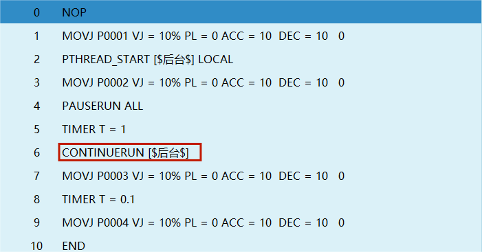
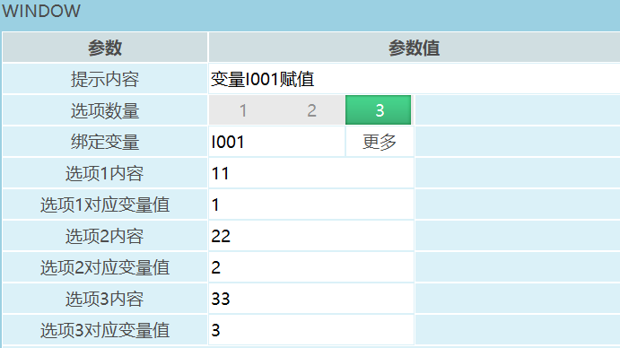
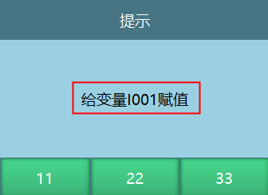
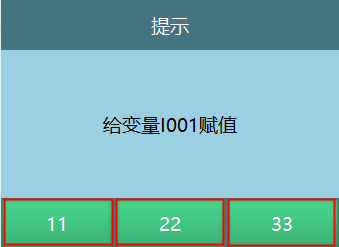
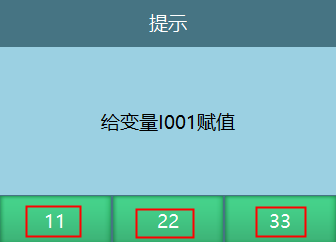

# 程序控制类

"√"表示支持此条指令。

| 指令类型 |   前台  |  全局后台  |  局部后台  |
| :--- | :---: | :----: | :----: |
| 开启线程 | **√** |  **√** |   |
| 退出线程 | **√** |  **√** |   |
| 暂停运行 | **√** |  **√** |  **√** |
| 继续运行 | **√** |  **√** |  **√** |
| 停止运行 | **√** |  **√** |  **√** |
| 重新运行 | **√** |  **√** |  **√** |
| 弹窗指令 | **√** |   |   |
| 线程状态 | **√** |  **√** |  **√** |

## 程序控制相关内容

如何建立后台任务？

点击设置-功能参数-后台任务，进入后台任务界面：

全局后台：

1. 点击【全局】,进入全局后台任务界面。
2. 点击【新建】,建立全局后台作业文件。
3. 点击【操作】,可以对当前选中的作业文件进行复制，删除，重命名和设置自启操作。
4. 点击【启动】,后台运行选中的自启程序。
5. 设置自启：在开机时执行自启程序，全局后台界面点击【启动】执行自启程序。
6. 说明：只有全局后台任务才可以设自启。

局部后台：

1. 点击【局部】,进入局部后台任务界面。
2. 点击【新建】,建立局部后台作业文件。
3. 点击【操作】,可以对当前选中的作业文件进行复制，删除，重命名操作。

### PTHREAD\_START-开启线程

格式：PTHREAD\_START【指令名】\[$测试$]【开启的后台作业文件】GLOBAL,LOCAL【全局后台，局部后台】。

功能：开启全局后台或者局部后台任务。

参数：

| 参数     | 说明                                                         |
| :------- | :----------------------------------------------------------- |
| 类型     | 全局后台，局部后台                                           |
| 后台任务 | 当选择全局后台类型时，可以选择全局后台建立的作业文件 当选择局部后台类型时，可以选择局部后台建立的作业文件 |

示例：

1. NOP
2. TIMER T=1
3. PTHREAD\_START\[TEST]GLOBAL
4. MOVL P0001 V=10mm/s PL=0 ACC=10 DEC=10 0
5. END

示例说明：在前台开启全局后台作业文件TEST。

### PTHREAD\_END-退出线程

格式：PTHREAD\_END【指令名】\[$测试$]【退出运行的作业文件名】GLOBAL,LOCAL【全局后台，局部后台】。

功能：关闭已经开启的后台任务。

参数：

| 参数   | 说明                   |
| :--- | :------------------- |
| 类型   | 全局后台，局部后台            |
| 后台任务 | 退出已经开启的局部或者全局后台的作业文件 |

注意事项：退出线程指令只可以退出在前台已经开启的作业文件。

例如：开启全局后台的作业任务是\[TEST],那在退出线程时选择全局后台的作业任务是\[TEST1]，在执行退出线程指令时全局后台的作业任务是\[TEST]无法退出运行。

示例：

1. NOP
2. TIMER T=1
3. PTHREAD\_START\[TEST]GLOBAL
4. MOVL P0001 V=10mm/s PL=0 ACC=10 DEC=10 0
5. PTHREAD\_END\[TEST]GLOBAL
6. END

示例说明：

程序运行到第1行时开启全局后台作业文件TEST，运行到第5行时退出全局后台作业文件TEST的运行。

### PAUSERUN-暂停运行

格式：PAUSERUN【指令名】ALL,MAIN【暂停运行的类型】。

功能：暂停主程序和局部后台程序运行。

| 参数 | 说明   |
| :- | :-------------- |
| 类型 | 全部：暂停开启的局部后台任务和主程序，开启的全局后台任务不会暂停 例如：全局后台任务开启，运行到暂停运行指令时，全局后台的任务依然正常运行，不会暂停 主程序：暂停运行的主程序，开启的后台任务不会暂停 局部后台：暂停开启的局部后台任务，运行的主程序不会暂停 |
| 程序 | 选择全部和主程序时，输入框置灰当类型为局部后台，选择需要暂停运行的后台程序                                                                                        |

示例：

1. NOP
2. TIMER T=1
3. PTHREAD\_START\[TEST]LOCAL
4. PTHREAD\_START\[TEST1]GLOBAL
5. MOVL P0001 V=10mm/s PL=0 ACC=10 DEC=10 0
6. PAUSERUN ALL
7. END

示例说明：程序运行到第3行，第4行时开启了局部和全局后台任务，运行到第6行暂停运行指令时，开启的局部后台任务和主程序暂停运行，全局后台任务正常运行。

### CONTINUERUN-继续运行

格式：CONTINUERUN【指令名】MAIN、LOCAL【暂停运行的程序类型】。

功能:继续运行已暂停的主程序或者局部后台程序。

参数：

| 参数 | 说明                                              |
| :- | :---------------------------------------------- |
| 类型 | 主程序：继续运行暂停的主程序，已经被暂停的后台程序不会继续运行局部后台：运行暂停的局部后台程序 |
| 程序 | 选择主程序时输入框置灰，选择局部后台时可以选择继续运行的后台程序                |

示例：

1. NOP
2. TIMER T=1
3. PTHREAD\_START\[TEST]LOCAL
4. MOVL P0001 V=10mm/s PL=0 ACC=10 DEC=10 0
5. PAUSERUN ALL
6. TIMER T=1
7. CONTINUERUN MAIN
8. MOVL P0002 V=10mm/s PL=0 ACC=10 DEC=10 0
9. END

示例说明：程序在运行时开启了局部后台程序，运行到第4行指令时，主程序和局部后台程序被暂停，运行到第7行指令时被暂停的主程序继续运行，局部后台程序依然暂停。

特别说明：如果继续运行指令选择的程序类型是局部后台，如果插入了暂停运行指令当程序运行到暂停运行指令时，此时伺服状态为暂停，然后点击示教器上的【启动】，执行继续运行指令，现在的执行逻辑是主程序和局部后台的程序都会继续运行。

### STOPRUN-停止运行

格式：STOPRUN【指令名】。

功能：停止正在运行的程序，程序运行到停止运行指令时伺服下电。

参数：略。

1. NOP
2. PTHREAD\_START\[TEST]LOCAL
3. MOVL P0001 V=10mm/s PL=0 ACC=10 DEC=10 0
4. PAUSERUN ALL
5. CONTINUERUN MAIN
6. STOPRUN
7. MOVL P0002 V=10mm/s PL=0 ACC=10 DEC=10 0
8. END

示例说明：程序运行到第6行指令时，伺服下电程序停止运行。

### RESTARTRUN-重新运行

格式：RESTARTRUN【指令名】。

功能：重新运行此条指令上面的程序。

参数：略。

示例：

1. NOP
2. PTHREAD\_START\[TEST]LOCAL
3. MOVL P0001 V=10mm/s PL=0 ACC=10 DEC=10 0
4. PAUSERUN ALL
5. RESTARTRUN
6. TIMER T=1
7. MOVL P0002 V=10mm/s PL=0 ACC=10 DEC=10 0
8. END

示例说明：程序每次运行到第5行指令时，会重新运行此条指令上面的程序。

### WINDOW-弹窗指令

格式：WINDOW【指令名】变量I001赋值【提示内容】1,2,3【选项数量】INT,GINT【绑定变量】11【选项1内容】1【选项1变量值】22【选项2内容】2【选项2变量值】33【选项3内容】3【选项3变量值】。

功能:运行指令时弹出所填写的提示内容窗口，按钮数量为选项数量，点击按钮会将变量值存入绑定的变量。

参数：

| 参数             | 说明                          |
| :--------------- | :------------------------------ |
|                 |                                                                                       |
| 提示内容         | 运行弹窗指令时，提示框显示的内容。例如：提示内容是"给变量I001赋值"，如图               |
| 选项数量         | 设置选项数量，执行弹窗指令时提示框就会对应显示对应数量的按钮。例如：选项数量是3，如图  |
| 绑定变量         | 支持 INT、GINT；执行弹窗指令时，会把选中选项对应的变量值存入该变量                                                            |
| 选项内容         | 根据选项数量填写对应内容，弹窗会展示这些选项。例如：设置3个选项，内容为11、22、33，如图  |
| 选项对应的变量值 | 点击弹窗选项，会把该选项绑定的值写入绑定变量。例如：选项内容为11，对应变量值为1，点击后变量会被赋值为1                         |

示例：

1. NOP
2. WINDOW\[$给变量I001赋值$] GI001 3 \[$11$]1 \[$22$] 2
   \[$33$] 3
3. END

示例说明：执行弹窗指令,点击按钮1 GI001=1，点击按钮2 GI001=2 点击按钮3
GI001=3。

### PTHREAD\_STATE-线程状态

格式：PTHREAD\_STATE【指令名】MAIN、LOCAL、GLOBAL【主程序、局部后台、全局后台】I/GI【变量类型】。

功能：查看当前所执行的线程程序的状态，停止等于1，暂停等于2，运行等于3。

参数：

| 参数      | 说明                                       |
| :------ | :--------------------------------------- |
| 类型      | 查看主程序，局部后台，全局后台的线程状态                     |
| 后台任务    | 主程序：类型选择主程序时，输入框置灰局部后台，全局后台：查看选择的后台任务的状态 |
| 存入的变量类型 | 将读取到的状态存入变量                              |

注意事项：

线程状态可以读取到程序当前的状态，当主程序停止，暂停时程序是无法运行到线程状态这条指令，所以前台无法读取主程序的停止，暂停状态。当程序正常启动时主程序的状态为运行状态，所以当需要读取主程序状态时可以在后台插入读取线程状态指令，然后在前台开启此线程。

示例：

1. NOP
2. PTHREAD\_START\[$TEST$]LOCAL
3. TIMER T=1
4. PTHREAD\_STATE\[$TEST$]LOCAL I002
5. PAUSERUN\[$TEST$]
6. TIMER T=1
7. PTHREAD\_STATE\[$TEST$]LOCAL I002
8. PTHREAD\_END\[$TEST$]LOCAL
9. TIMER T=1
10. PTHREAD\_STATE\[$TEST$]LOCAL I002
11. END

示例说明：第2行程序开启局部后台线程，程序在运行到第4行时获取线程状态存入的变量I002=3；运行到第5行指令时暂停开启的后台线程，程序在运行到第7行时获取线程状态存入的变量I002=2；运行到第8行指令时退出开启的后台线程，程序在运行到第10行时获取线程状态存入的变量I002=1。

## AI 检索专用问答对 (Q\&A for Retrieval)

**Q: 什么是PTHREAD\_START指令？**

A: PTHREAD\_START是开启线程指令，用于开启全局后台或者局部后台任务。

**Q: 什么是PTHREAD\_END指令？**

A: PTHREAD\_END是退出线程指令，用于关闭已经开启的后台任务。

**Q: 什么是PAUSERUN指令？**

A: PAUSERUN是暂停运行指令，用于暂停主程序和局部后台程序运行。

**Q: 什么是CONTINUERUN指令？**

A: CONTINUERUN是继续运行指令，用于继续运行已暂停的主程序或者局部后台程序。

**Q: 什么是STOPRUN指令？**

A: STOPRUN是停止运行指令，用于停止正在运行的程序，程序运行到该指令时伺服下电。

**Q: 什么是RESTARTRUN指令？**

A: RESTARTRUN是重新运行指令，用于重新运行此条指令上面的程序。

**Q: 什么是WINDOW指令？**

A: WINDOW是弹窗指令，运行时弹出提示内容窗口，点击按钮会将变量值存入绑定的变量。

**Q: 什么是PTHREAD\_STATE指令？**

A: PTHREAD\_STATE是线程状态指令，用于查看当前所执行的线程程序的状态，停止等于1，暂停等于2，运行等于3。

**Q: 如何建立后台任务？**

A: 点击设置-功能参数-后台任务，进入后台任务界面，点击【全局】或【局部】，然后点击【新建】建立后台作业文件。

**Q: 全局后台和局部后台有什么区别？**

A: 全局后台任务可以设置自启，在开机时自动执行；局部后台任务不能设置自启。全局后台任务在暂停运行指令执行时不会暂停，而局部后台任务会暂停。

**Q: 退出线程指令有什么限制？**

A: 退出线程指令只可以退出在前台已经开启的作业文件。

**Q: 线程状态的值代表什么？**

A: 线程状态中，停止等于1，暂停等于2，运行等于3。

## 版本历史

| 版本    | 日期         | 变更内容 | 作者    |
| :---- | :--------- | :--- | :---- |
| 1.0.0 | 2026-06-25 | 初始版本 | FDJAK |

