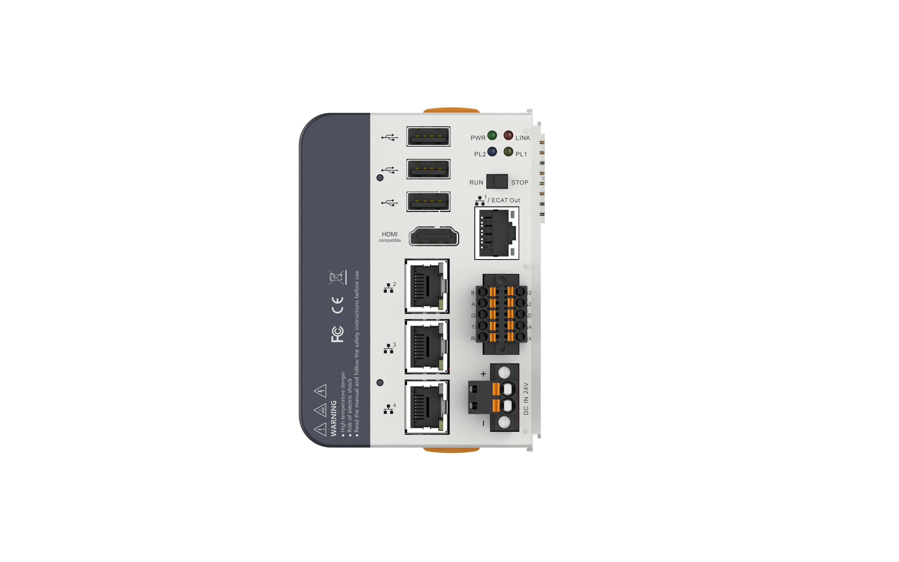
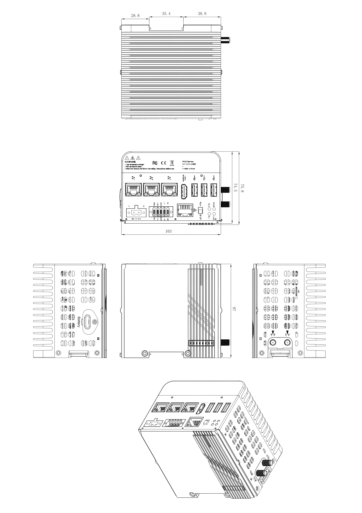

# 纳博特 C1103 工业机器人控制器

## 一、产品简介

C1103 是纳博特科技面向复杂工业场景打造的高性能嵌入式机器人控制器。在 103×97×74.5mm 的紧凑机身内，集成了 Intel J1900 四核处理器、独立 EtherCAT 实时总线及 E-BUS 模块化 IO 扩展架构，单台控制器最高支持 64 轴同步运动，可独立控制 4 台机器人并外接地轨、变位机等外部轴。

该控制器内置纳博特控制系统，出厂预置多种成熟工艺包，覆盖新能源制造、汽车零部件、3C 电子装配及智慧物流等核心工业场景。

**一句话定位：** C1103 = C1102 的升级替代品，同样的 X86 计算平台，但接口更多、体积更小、扩展更强、带 UPS 断电保护。

## 二、五大核心优势

### 2.1 E-BUS 模块化 IO 扩展

C1103 最具差异化的硬件特性是其 E-BUS 总线扩展能力。通过 E-BUS 接口，控制器可无缝扩展纳博特 AL 系列 IO 模块（13 种型号），涵盖数字量 I/O、模拟量 I/O、温度采集、编码器输入等多种类型。支持热插拔即插即用，模块化拼接节省柜内空间。用户可根据产线实际需求灵活配置 IO 组合，无需更换控制器硬件，大幅降低部署与备货成本。

### 2.2 内置 UPS · 断电保护

内置超级电容模组，满载状态下可提供 **≥5 秒** 后备供电。异常断电时系统有时间保存关键数据、执行安全停机流程，杜绝数据丢失与设备损坏。突发断电时自动保存当前工艺参数、程序状态及关键数据，恢复供电后支持断点续运行，杜绝工件报废与产线停摆风险。UPS 超级电容是 C1102 不具备的核心差异化功能。

### 2.3 4 网口 · 接口密度翻倍

3 个千兆以太网 + 1 个 EtherCAT OUT 专用端口（独立 RJ45 物理接口），网络连接能力是 C1102 的 2 倍。支持多网段隔离部署，无需额外交换机。EtherCAT 独立硬件端口不占用标准网口，Intel i210 保证实时性，支持双主站方案。

### 2.4 体积缩小 46%

尺寸仅 **103×97×74.5mm**（C1102: 230×120×50mm），体积约 0.74L vs 1.38L，可在狭小控制柜中灵活部署。DIN-Rail 标准导轨安装，拆装便捷。掌上型尺寸，在同等算力产品中属紧凑级。

### 2.5 接口可选配 · 灵活定制

内存（DDR3L 2/4/8GB）、M.2 存储（64G~1TB）、4G/5G 无线模组均可按需选配。M.2 扩展槽支持 WiFi/3G/4G/5G 模块，满足联网与远程运维需求。

## 三、产品技术特性详解

| 类别 | 参数 | 说明与优势 |
| :--- | :--- | :--- |
| 处理器 | Intel Celeron J1900, 2.0GHz, 4 核 4 线程, 2MB L2 Cache, TDP 10W | X86 架构，无风扇设计，低功耗高性能。与 C1102 同平台，软件/固件变更小 |
| 内存 | DDR3L 4GB（标配），SO-DIMM 插槽，支持最高 8GB | 标配 4GB，满足绝大多数运动控制应用。后期可扩展至 8GB 应对复杂任务 |
| 存储 | eMMC 64GB（板载）+ M.2 2242 SATA 扩展 | 板载 eMMC 抗震性优于 mSATA；M.2 槽位可加装 128G~1TB 存储或 4G/5G 模组（支持 SIM 卡） |
| 以太网 | LAN1: EtherCAT OUT（独立 RJ45）, LAN2: Intel i210-AT 千兆, LAN3/4: RTL8111H 千兆 | EtherCAT 独立硬件端口，不占用标准网口。Intel+i210 保证实时性，支持双主站方案 |
| 串口 | 2×RS485（COM1/COM2）, 2×RS232（COM3/COM4）, 最大 115.2kbit/s | 4 串口设计，相比 C1102（2 串口）接口翻倍。支持同时连接 HMI、变频器、扫码枪、传感器等 |
| E-BUS | E-BUS 高速扩展总线，可扩展 AL 系列 IO 模块（13 种型号） | 支持数字量 I/O、模拟量 I/O、温度采集、编码器输入。热插拔即插即用，模块化拼接节省柜内空间 |
| 显示 | HDMI, 1920×1080@60Hz | HDMI 数字接口，画质优于 C1102 的 VGA 模拟接口。直接连接主流工业显示器/触摸屏 |
| USB | 3×USB 2.0 | 满足键盘/鼠标/U 盘/加密狗等常规 USB 外设接入需求 |
| 电源 | DC 24V（-15%/+20%），过流/过压/防反接保护，内置 UPS 超级电容（满载 ≥5s） | 工业级电源保护全面；UPS 超级电容是 C1102 不具备的核心差异化功能 |
| 机械 | 103×97×74.5mm, 1.5kg, DIN-Rail IEC 60715 安装 | 掌上型尺寸，在同等算力产品中属紧凑级。标准导轨安装，适配主流控制柜 |
| 环境 | 工作: -20℃~60℃, 存储: -40℃~80℃, 95% 湿度, 3Grms 振动, 30G 冲击 | 宽温范围覆盖严寒与高温环境，媲美军规级可靠性指标。CE/FCC Class A 认证 |
| 操作系统 | Windows 7/10, Ubuntu, Debian | 主流操作系统全覆盖。与 C1102 软件生态完全兼容，迁移成本极低 |

## 四、硬件规格

### 4.1 处理与存储

| 参数 | 规格 |
| :--- | :--- |
| 处理器 | Intel Celeron J1900, 2.0GHz, 4 核 4 线程, 2MB L2 Cache |
| TDP | 10W |
| 内存 | 1 × SO-DIMM DDR3L-1600，最高支持 8GB |
| 存储 | eMMC 64GB |
| 扩展存储 | 1 × M.2（B Key, Type 2242），SATA 协议 |

### 4.2 通信接口

| 接口类型 | 数量 | 规格说明 |
| :--- | :--- | :--- |
| EtherCAT | 1 × RJ45 | EtherCAT OUT（LAN1），独立实时总线 |
| 千兆以太网 | 3 × RJ45 | LAN2: Intel i210-AT; LAN3/LAN4: RTL8111H |
| RS485 | 2 路 | COM1/COM2，最大波特率 115.2kbit/s |
| RS232 | 2 路 | COM3/COM4，最大波特率 115.2kbit/s |
| USB | 3 × USB 2.0 | 外设/存储/U 盘 |
| IO 扩展 | 1 × E-BUS | 串联 AL 系列 IO 模块 |
| 无线扩展 | 1 × M.2（B Key） | Type 3042/3052, 4G/5G 模块，带 SIM 卡槽 |

### 4.3 电源参数

| 参数 | 规格 |
| :--- | :--- |
| 输入电压 | DC 24V（-15%/+20% 宽压） |
| 保护机制 | 过流保护、过压保护、防反接保护 |
| 掉电保护 | 内置 UPS 超级电容，满载支持 5s |
| 最大功耗 | 45W |

### 4.4 机械与环境

| 参数 | 规格 |
| :--- | :--- |
| 外形尺寸 | 103mm(L) × 97mm(W) × 74.5mm(H) |
| 净重 | 1.5kg |
| 安装方式 | 标准 35mm DIN 导轨，IEC 60715 |
| 工作温度 | -20°C ~ 60°C（有风流，使用宽温 SSD） |
| 存储温度 | -40°C ~ 80°C |
| 相对湿度 | 95% @40°C（非凝结） |
| 抗振动 | 3Grms, 5~500Hz 随机振动，IEC60068-2-64 |
| 抗冲击 | 30G, 11ms 半正弦波，IEC60068-2-27 |
| EMC | CE/FCC Class A, IEC61000-6-2, IEC61000-6-4 |

## 五、产品外观

## 六、尺寸图

