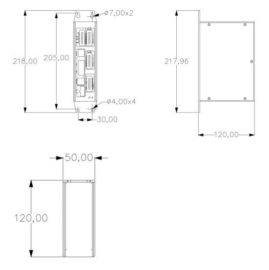

# 工业机器人控制器 C2200 系列

## 产品简介

纳博特 C2200 系列工业机器人控制器是一款高性能运动控制整机，采用成熟设计开发方案，具备丰富的接口与较强的抗干扰能力。

该控制器内部集成纳博特自研的运动控制算法，能够适配多品牌、多型号机器人，定制性强，可满足企业在生产上的各类需求。芯片采用车规级设计，运行稳定，运算功能强大，是工业应用的理想选择。

## 产品特点

- **自研运控算法**：内置纳博特自主研发的运动控制算法，适配多品牌、多型号机器人
- **车规级芯片**：采用全志 T507 芯片（四核主频 1.5GHz），运行稳定可靠
- **丰富接口**：36 路 I/O、8 路模拟量、EtherCAT、CANopen、USB、串口等多种接口
- **图形处理**：搭载 G31 GPU，支持高级图形处理能力
- **断电保护**：3 秒 UPS 断电保护，防止数据丢失
- **多轴同步**：支持最多 64 轴同步运动控制

## 产品优势

### 丰富接口

C2200 控制器提供多达 36 路数字 I/O 接口、8 路模拟接口（4 AI + 4 AO）、2 个 USB 2.0 接口、1 路 CAN 2.0 接口、1 路 RS485 串口与 1 路 RS232 串口，支持多种通讯协议，可满足不同设备的外部连接需求，可扩展性强。

此外，还支持 EtherCAT、CANopen 等高速总线接口，可实现伺服主从站的连接以及最多 64 轴同步运动控制。

丰富的接口种类和数量使 C2200 能够轻松应对各种复杂的工业自动化应用场景。

### 全新 IO 布局

C2200 相较于传统市场竞品进行了 IO 布局的优化调整，接线更加直观易懂，大幅降低了操作与接线难度。

### 强劲性能

- **主控芯片**：全志 T507，4 核主频 1.5GHz
- **GPU**：G31 图形处理芯片
- **内存**：2GB
- **存储**：8GB eMMC Flash
- **操作系统**：RT-Linux 实时操作系统

## 产品参数

| 项目 | 参数 |
| :--- | :--- |
| CPU | 全志 T507，4 核主频 1.5GHz |
| GPU | G31 |
| 内存 | 2GB |
| 板载存储 | eMMC Flash 8GB |
| 操作系统 | RT-Linux |
| 千兆网口 | 1 路（RTL8211） |
| 百兆网口 | 2 路（RTL8152、IP101GR） |
| USB 接口 | 2 路 USB 2.0 |
| 串口 | 1 路 RS232，1 路 RS485 |
| 数字输入（DI） | 18 路，带光隔 |
| 数字输出（DO） | 18 路，带光隔 |
| 模拟输入（AI） | 4 路（0-10V），精度 12bit |
| 模拟输出（AO） | 4 路（0-10V），精度 12bit |
| CAN | 1 路 CAN 2.0 |
| EtherCAT | 支持（高速总线） |
| CANopen | 支持（高速总线） |
| 电源 | DC 24V |
| 功率 | 4W（不含外部电路） |
| 断电保护 | 3s UPS 断电保护 |
| 工作温度 | -10 ~ 60℃ |
| 存储温度 | -40 ~ 85℃ |

## 产品尺寸

产品尺寸规格请参见下图：

---

## Q&A

**Q：C2200 控制器支持哪些运动控制指令？**

A：C2200 支持 MOVJ（点到点）、MOVL（直线）、MOVC（圆弧）、MOVCA（整圆）、MOVS（曲线插补）、IMOV（增量）、SAMOV（定点移动）、MOVARCH（门型运动）等多种运动控制指令，并支持运动指令与 IO、Modbus 等功能联动。

**Q：C2200 可以控制多少个轴？**

A：C2200 通过 EtherCAT 总线可实现最多 64 轴同步运动控制，支持多机器人协同作业。

**Q：C2200 支持哪些机器人类型？**

A：C2200 支持六轴串联多关节机器人、四轴 SCARA 机器人、并联机器人等多种机器人类型，并提供定制化适配方案。具体支持的机器人型号请参考技术资料中的"支持的机器人类型"文档。

**Q：C2200 的 IO 接口配置如何？**

A：C2200 标配 18 路数字输入（DI）+ 18 路数字输出（DO，带光隔），以及 4 路模拟输入（AI，0-10V）+ 4 路模拟输出（AO，0-10V），精度 12bit。

**Q：C2200 控制器有哪些网络通讯接口？**

A：C2200 配备 1 路千兆网口（RTL8211）和 2 路百兆网口（RTL8152、IP101GR），支持 TCP/IP、Modbus、EtherNet/IP、EtherCAT、CANopen 等多种工业通讯协议。

**Q：C2200 控制器支持哪些外部轴类型？**

A：C2200 支持旋转轴（O1-O5）、移动轴（L1-L3）等多种外部轴类型，并支持外部轴的点动、联动、速度控制及电子齿轮、随动等功能。具体配置方法请参考"外部轴使用手册"。
