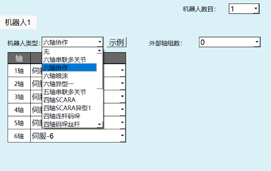
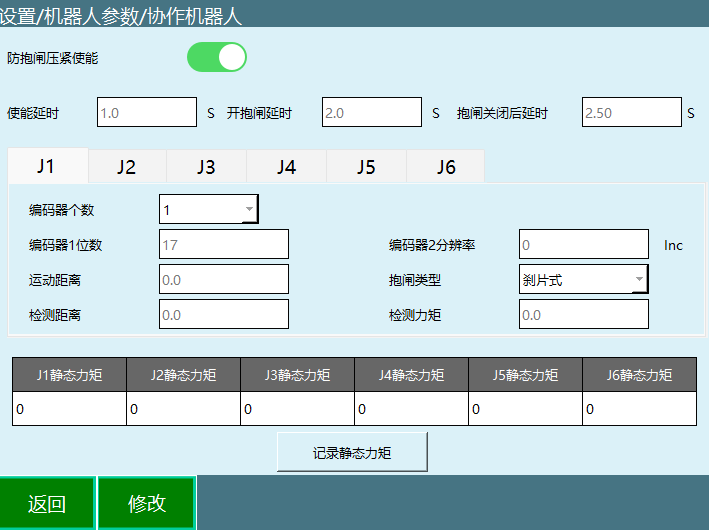
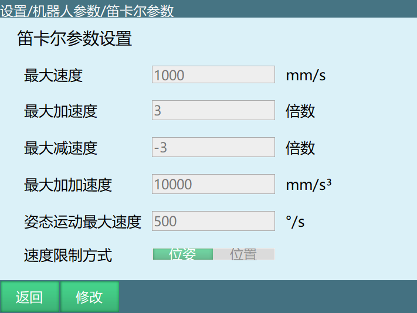
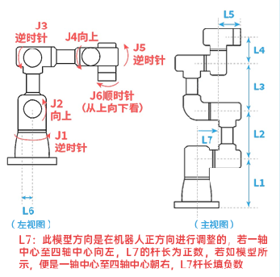
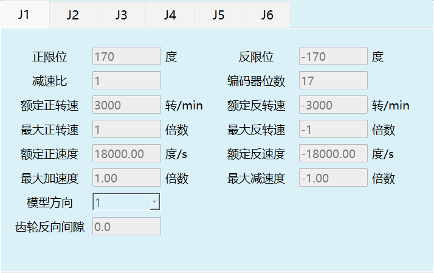
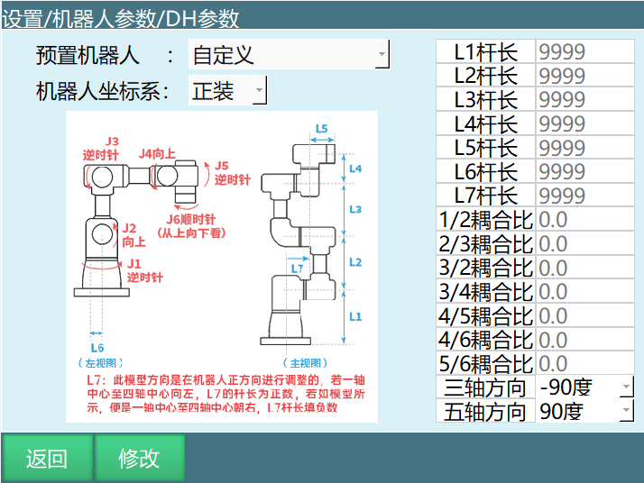

# 六轴协作机器人操作手册

## 免责声明

本版权与免责声明系为保护本手册及所述产品的正常生产与流通、规避意外风险，初衷是为广大使用者提供更加稳定的产品和服务。因此，请在正式接受本产品前仔细阅读本声明。

本手册所述产品及本手册内容未经许可不得引用、复制，因违法使用所造成的不良后果本公司不承担任何责任，并保留相关的法律权利以及追责权力。

本手册所述产品及本手册内容在后续可能会有更新，如果未来出现了更新，本公司将事先进行公告。若因非本公司控制范围内的因素或其它不可抗力而导致的产品无法使用，无法使用期间造成的一切不便与损失，本公司不负任何责任。

除本手册中有明确对于细节、工具与工艺的明确陈述外，本手册中的任何内容不应解释为本公司对财产损坏、工业成本增加、个人损失或具体适用性等做出的任何保证。

本公司对因使用本手册及其中所述工艺方法与使用细则相关而引起的意外或间接伤害概不负责。

本手册所述产品使用者因违反本声明的规定而触犯中华人民共和国法律的，一切后果本公司不承担任何责任。

凡以任何方式直接、间接使用本产品手册者，视为自愿接受本免责声明的约束。

本声明未涉及的问题参见国家有关法律法规，当本声明与国家法律法规冲突时，以国家法律法规为准。

若因本手册产生任何诉诸于诉讼程序的法律争议，将以本公司所在的法院为管辖法院，除非中国法律对此有强制性规定。

本手册之声明以及其修改权、更新权及最终解释权均属本公司所有。

纳博特南京科技有限公司

---

## 目录

1. 协作机器人的介绍
2. 设置从站配置
    - 2.1 预置参数
    - 2.2 设置DH参数
3. 六轴协作相关说明
    - 3.1 参数说明
    - 3.2 设置关节参数
        - 3.2.1 各参数意义
    - 3.3 零点标定
    - 3.4 设置笛卡尔参数
        - 3.4.1 各参数意义
4. 六轴协作机器人参数设置
    - 4.1 协作机器人参数详细用法

---

# 1 协作机器人的介绍

协作机器人，顾名思义强调的是"协作"这一概念，注重人与机器人的协作。基于此，易用性、安全性、智能性显得尤为重要。

协作机器人的初衷是实现人机协同工作，在不安装栅栏的情况下可以在一定范围内实现工作人机共融。因此，协作机器人的出现改变了生产关系，打破了人与机器之间的壁垒。

首先，从商业角度看，协作机器人是工业机器人市场上增长最快的一类，其性能优于六轴机器人和其他传统工业机器人，已成为市场追求的方向。此外，与传统工业机器人相比，协作机器人的竞争更加轻松。

此外，协作机器人是一种仿人机械手，其目的是取代人的手，我们可以看到，协作机器人在咖啡店、奶茶站等无人值守的零售领域，不仅可以实现取杯、取放物料、按压按钮等简单动作，还可以拉花，并达到高度的一致性。现有的协作机器人产品矩阵基于人类的设计逻辑，包括极限运动和动力学设计、模块化硬件结构设计、灵活可靠的适配软件、多语种组合等。

# 2 设置从站配置

点击设置/机器人参数/从站配置界面机器人类型选择六轴协作机器人。

## 2.1 预置参数

在DH参数界面中，我们提供了预置机器人功能。如果该下拉列表中包含您所使用的机器人型号，您可通过该功能快速、方便地设置好机器人的各项参数。

点击DH参数界面中，左上角【预置机器人】，可以选择已经适配好的机器人型号，选择后该机器人的DH参数、关节参数将自动填入。

选择了预置机器人后需要手动修改零点。

## 2.2 设置DH参数

点击设置/机器人参数/进入DH参数，填写机器人的杆长、耦合比、3轴、5轴方向等参数；该参数会影响机器人的直线运动及精度；

注：DH参数、关节参数、设置完成之后上电操作机器人确认模型方向是否正确。

# 3 六轴协作相关说明

## 3.1 参数说明

**预置机器人**

通过事先把机器人关节参数和DH参数导入到控制器里，可以省去重复填写参数的步骤。

**机器人坐标系**

如图所示，上图是正装，下图是倒装：

注：倒装不支持辨识以及碰撞检测！

**杆长**

控制系统需要对机器人进行精确建模，才能够计算出机器人末端当前所在坐标，以及机器人从 A 点走到 B 点时各个关节轴需要旋转的角度。对机器人进行建模就需要明确机器人各个部分的长度，这些长度就是杆长参数，也叫作 DH 参数。

杆长参数需按照DH页面中的模型图所示填写，若填写不准确会影响机器人运动精度。

**耦合比**

部分机器人本体在设计上会使电机跨越了很多个轴来驱动某个轴，这就造成了两个轴的耦合，比如我们操作 2 轴转动，3 轴也跟着转，这就是轴的耦合。为了抵消这种耦合作用，就需要耦合比。

耦合比的计算公式为 耦合比 =跟随轴旋转角度/主轴旋转角度。

例如我们操作 2 轴旋转了 10°，发现 3 轴跟随旋转了 15°，那么耦合比为15/10=1.5。

详细的耦合比的计算方式请参考《NRC调试手册》。

**3轴/5轴方向**

六轴协作中当的3轴、5轴方向对应着协作机器人的两种形态。

## 3.2 设置关节参数

设置步骤同《机器人参数调试》。

注：DH参数、关节参数设置完成前，请勿上电操作机器人！

### 3.2.1 各参数意义

**正限位**：机器人关节正方向最大范围。

**反限位**：机器人关节负方向最大范围（此数值须为负数）。

**减速比**：减速机的减速比。

**编码器位数**：编码器的位数。

**额定正转速**：电机正方向的额定转速。

**额定反转速**：电机反方向的额定转速（此数值须为负数）。

**最大正转速**：电机正方向的最大转速，其数值为额定正转速的倍数。如额定正转速3000转，最大正转速要6000转，则此处填写2倍。

**最大反转速**：电机反方向的最大转速，其数值为额定反转速的倍数。如额定反转速-4000转，最大反转速要-6000转，则此处填写-1.5倍(此数值须为负数)。

**额定正速度**：机器人关节的额定正方向速度，由额定正转速、编码器位数、减速比自动计算而来，无需填写。

**额定反速度**：机器人关节的额定负方向速度，由额定反转速、编码器位数、减速比自动计算而来，无需填写。（此数值须为负数）

**最大加速度**：机器人关节运动的最大的加速度，其数值为额定正速度的倍数。如额定正速度为300度/s，需要最大加速度为1500度/s²，则此处填写5倍。

**最大减速度**：机器人关节运动的最大的减速度，其数值为额定反速度的倍数。如额定反速度为300度/s，需要最大加速度为1200度/s²，则此处填写-4倍。建议最大加速度与最大减速度数值相同（此数值须为负数）。

**模型方向**：模型方向参照下方的关节正方向示意图设置，各轴点动"+"键应与关节正方向示意图方向相同，相同选1，相反选-1。

**关节实际方向**：默认选1。

**齿轮反向间隙**：每当关节往相反方向运动时，补偿填写值的角度，默认不填。

| 机器人类型 | 轴 | 正方向（俯视图或左视图） |
|---|---|---|
| 六轴协作 | J1 | 逆时针 |
| | J2 | 向上 |
| | J3 | 逆时针 |
| | J4 | 向上 |
| | J5 | 逆时针 |
| | J6 | 顺时针（从上往下看） |

关节正方向示意图：

注：关节正方向未设置完成前，请勿上电操作机器人。

## 3.3 零点标定

若机器人零点位置为非标准零点位置，用户可以将机器人按照机器人的对位孔对齐后，在机器人零点位置界面将当前机器人位置坐标设置为零点位置。

六轴协作零点位置示意图如下（大概就是这个模型的样子，分别为两种形态的零点模型）左边形态的模型方向是在机器人的左侧进行调整的；右边形态的模型方向是在机器人正方向进行调整的，若1轴中心至4轴中心向左，L7的杆长为正数，若如图所示，是1轴中心至4轴中心向右，L7杆长为负数：

确保机器人在该位置，点击将所有关节设为零点即可。

注：DH参数、关节参数、设置完成前，请勿上电操作机器人。

> **注释**
> 
> 

> - 没有进行原点位置校准，不能进行回零操作！
> - 使用多台机器人的系统，每台机器人都必须进行原点位置校准！
> - 当关节轴之间存在耦合关系时，例如常见的机器人第五轴和第六轴存在耦合关系，第五轴必须处于零点位置时，第六轴记录的零点数据才会有效，否则，第六轴记录的零点数据是无效的。所以必须在第五轴处于零位的状态下记录第六轴的零位数据。 如果不存在耦合关系，则各个轴可以单独标定零位，各自的零位不会影响到其它关节的零位。

## 3.4 设置笛卡尔参数

笛卡尔参数可直接使用默认值。

### 3.4.1 各参数意义

**最大速度**：机器人运行时的最大线速度（插入指令里需要填写V参数的都受笛卡尔参数限制）。

**最大加速度**：机器人运行时的最大加速度，此数值为最大速度的倍数。如最大速度为1000mm/s，需要最大加速度为3000mm/s²，则此处填写3倍。

**最大减速度**：机器人运行时的最大减速度，此数值为最大速度的倍数。如最大速度为1000mm/s，需要最大减速度为-3000mm/s²，则此处填写-3倍。建议最大加速度与最大减速度数值相同，且与关节参数中的最大加速度与最大减速度相同（此数值须为负数）。

**最大加加速度**：当机器人插补方式为加加速度插补时笛卡尔参数界面才会显示最大加加速度。

**姿态运动最大速度**：机器人姿态运动时的最大速度，指令速度超出会被降速。

**速度限制方式**

- **位姿**：机器人直线插补的运动同时受最大速度、姿态运动最大速度限制。
- **位置**：机器人直线插补的运动仅受最大速度限制。

# 4 六轴协作机器人参数设置

该界面为六轴协作机器人参数设置界面，其他类型机器人无需设置。

## 4.1 协作机器人参数详细用法

**使能延时**：按下使能键之后延迟多久给伺服下发使能命令。

**开抱闸延时**：下发使能命令后延迟多久给伺服下发开抱闸命令。

**抱闸关闭后延时**：抱闸关闭后延迟多久伺服会相应下一步操作。

**编码器个数**：单关节编码器的个数。

**编码器1位数**：同关节参数中的编码器位数。

**编码器2分辨率**：单关节中另一个编码器的inc值。

**运动距离**：开抱闸前关节的微动距离，一般为20。

**抱闸类型**：刹片式抱闸和插销式抱闸。

**检测距离**：开抱闸后用于检测抱闸是否打开的关节运动距离。

**检测力矩**：开抱闸后关节运行检测距离过程中力矩超过检测力矩则认为抱闸打开失败。

