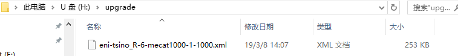
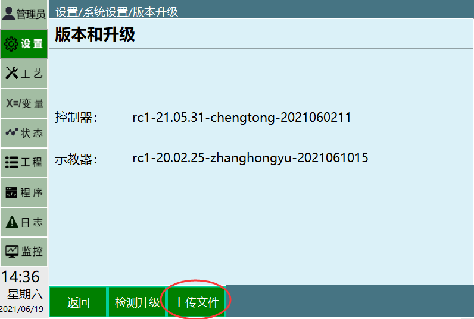

# 2207系统设置与文件导入/导出手册

---

## 📋 元数据
- **文档名称**: 2207系统设置与文件导入/导出手册
- **适用对象**: 系统管理员、设备维护人员、技术操作人员
- **核心内容**: 系统设置（版本升级、时间/IP配置等）、文件导入导出操作指南
- **关键标签**: #2207系统 #系统设置 #文件导入导出 #操作手册 #机器人日志
- **资源包含**: 47张操作步骤示意图（位于assets文件夹）
- **文档版本**: V1.0
- **更新日期**: 2026年3月

---

## 免责声明

本手册仅供参考，如有任何疑问，请联系技术支持团队。本手册内容如有变更，恕不另行通知。

---

## 目录

- [1. 系统设置](#1-系统设置)
  - [1.1 版本查看与升级](#11-版本查看与升级)
    - [1.1.1 检测升级](#111-检测升级)
    - [1.1.2 上传文件](#112-上传文件)
  - [1.2 时间设置](#12-时间设置)
  - [1.3 IP设置](#13-ip设置)
  - [1.4 导出程序](#14-导出程序)
  - [1.5 导入程序](#15-导入程序)
  - [1.6 导入控制器配置](#16-导入控制器配置)
  - [1.7 导出配置文件](#17-导出配置文件)
  - [1.8 恢复出厂设置](#18-恢复出厂设置)
  - [1.9 屏幕校准](#19-屏幕校准)
  - [1.10 切换主题](#110-切换主题)
  - [1.11 导出日志](#111-导出日志)
- [2. 机器人日志](#2-机器人日志)
  - [2.1 日志类型](#21-日志类型)
  - [2.2 日志导出操作](#22-日志导出操作)

---

## 1. 系统设置

> **摘要**: 本章节详细介绍2207系统的各项设置功能，包括软件版本管理、系统参数配置、程序导入导出、日志管理等核心操作。

### 1.1 版本查看与升级

> **摘要**: 提供控制器与示教器版本信息查询，支持通过U盘进行软件升级。

#### 1.1.1 检测升级

**功能说明**: 通过U盘升级软件版本，支持控制器和示教器分别升级。

**前置条件**:
- FAT32格式U盘（需备份数据）
- 升级文件（.zip格式，文件名无特殊字符）放置于U盘根目录

**操作步骤**:
1. 将U盘插入示教器USB接口
2. 导航至【设置】-【系统设置】-【版本和升级】
3. 点击【检测升级】按钮
4. 系统将自动检测U盘中的升级文件
5. 选择目标升级文件
6. 点击【确定】开始升级
7. 等待系统自动重启完成升级

**注意事项**:
- 升级过程中请勿断电或拔出U盘
- 升级时间约为3-5分钟，请耐心等待
- 升级前建议备份重要数据

**示意图**:


#### 1.1.2 上传文件

**功能说明**: 上传ENI文件等配置文件至控制器。

**操作步骤**:
1. U盘根目录创建"upgrade"文件夹
2. 放入目标文件（如eni-tsino_R-6-mecat1000-1-1000.xml）
3. 插入U盘后点击【上传文件】按钮
4. 选择需要上传的文件
5. 点击【打开】开始上传
6. 等待上传完成

**示意图**:


---

### 1.2 时间设置

> **摘要**: 配置系统日期与时间，确保日志记录与定时任务准确性。

**功能说明**: 修改系统日期和时间，支持手动设置和自动同步。

**操作路径**: 【设置】-【系统设置】-【时间设置】

**操作步骤**:
1. 点击【修改】按钮进入编辑模式
2. 选择年/月/日参数
3. 选择时/分参数
4. 点击【保存】完成设置
5. 系统提示"设置成功"后生效

**注意事项**:
- 时间设置将影响日志记录的时间戳
- 建议定期校准系统时间

**示意图**:


---

### 1.3 IP设置

> **摘要**: 配置控制器网络参数，支持静态IP与动态获取模式。

**功能说明**: 设置控制器的IP地址、子网掩码、网关等网络参数。

**关键参数**:
| 参数 | 说明 | 示例 |
|------|------|------|
| IP地址 | 控制器在网络中的唯一标识 | 192.168.1.100 |
| 子网掩码 | 划分网络的掩码 | 255.255.255.0 |
| 网关 | 网络出口地址 | 192.168.1.1 |

**操作步骤**:
1. 进入【设置】-【系统设置】-【IP设置】
2. 选择IP获取方式（静态/动态）
3. 如选择静态IP，输入IP地址、子网掩码、网关
4. 点击【保存】
5. 系统提示"IP设置成功，需重启生效"
6. 重启控制器使配置生效

**注意事项**:
- 修改IP后需重启控制器才能生效
- 确保新IP地址在同一网段内
- 避免与网络中其他设备IP冲突

**示意图**:


---

### 1.4 导出程序

> **摘要**: 将控制器中的程序文件备份至U盘，支持批量导出。

**功能说明**: 将控制器中存储的程序文件导出到U盘，便于备份和迁移。

**操作路径**: 【设置】-【系统设置】-【导出程序】

**文件格式**:
- .prg（程序文件）
- .var（变量文件）

**操作步骤**:
1. 插入FAT32格式U盘
2. 进入【设置】-【系统设置】-【导出程序】
3. 勾选需要导出的程序文件
4. 点击【导出】按钮
5. 选择导出路径（U盘根目录或指定文件夹）
6. 等待导出完成
7. 提示"导出成功"后拔出U盘

**示意图**:


---

### 1.5 导入程序

> **摘要**: 从U盘导入程序文件至控制器，支持覆盖与增量导入。

**功能说明**: 从U盘导入程序文件到控制器，可选择覆盖模式或增量导入。

**前置条件**: 
- U盘根目录需存在"program"文件夹
- 程序文件位于program文件夹内

**操作步骤**:
1. 将程序文件复制到U盘根目录的program文件夹
2. 插入U盘到示教器
3. 进入【设置】-【系统设置】-【导入程序】
4. 系统自动扫描U盘中的程序文件
5. 勾选需要导入的文件
6. 选择导入模式（覆盖/增量）
7. 点击【导入】按钮
8. 等待进度条完成
9. 提示"导入成功"

**导入模式说明**:
- **覆盖模式**: 导入的同名文件将覆盖控制器中的原有文件
- **增量导入**: 仅导入控制器中不存在的文件，不影响已有文件

**示意图**:


---

### 1.6 导入控制器配置

> **摘要**: 从备份文件恢复控制器配置，适用于设备更换或故障恢复。

**功能说明**: 从U盘导入控制器配置文件（.bak格式），快速恢复系统设置。

**操作步骤**:
1. 准备配置文件（.bak格式），放置于U盘根目录
2. 插入U盘到示教器
3. 进入【设置】-【系统设置】-【导入控制器配置】
4. 系统扫描U盘中的配置文件
5. 选择目标配置文件
6. 点击【导入】按钮
7. 系统提示"导入成功，将自动重启"
8. 等待系统重启完成
9. 配置恢复生效

**注意事项**:
- 导入配置后系统将自动重启
- 导入操作不可逆，请确认配置文件正确性
- 建议导入前备份当前配置

**示意图**:


---

### 1.7 导出配置文件

> **摘要**: 将当前控制器配置导出到U盘，便于备份和迁移。

**功能说明**: 导出当前控制器的所有配置信息，包括系统参数、用户设置等。

**操作步骤**:
1. 插入FAT32格式U盘
2. 进入【设置】-【系统设置】-【导出配置文件】
3. 系统显示当前配置信息摘要
4. 输入配置文件名称
5. 点击【导出】按钮
6. 选择保存路径
7. 等待导出完成
8. 提示"导出成功"

**导出内容**:
- 系统参数配置
- 用户界面设置
- 网络配置
- 安全设置
- 其他自定义配置

---

### 1.8 恢复出厂设置

> **摘要**: 将系统恢复至初始状态，清除所有用户数据。

**功能说明**: 将控制器恢复至出厂默认设置，清除所有用户数据和自定义配置。

**警告**: 
- ⚠️ 操作不可逆，需提前备份数据
- ⚠️ 将清除所有用户程序
- ⚠️ 将清除所有工艺参数
- ⚠️ 将清除所有配置设置

**操作路径**: 【设置】-【系统设置】-【恢复出厂设置】

**操作步骤**:
1. 进入【设置】-【系统设置】-【恢复出厂设置】
2. 系统显示警告信息
3. 点击【确定】继续
4. 输入管理员密码进行二次确认
5. 系统提示"恢复出厂设置即将开始"
6. 点击【确定】开始恢复
7. 等待系统自动恢复完成
8. 系统自动重启

**适用场景**:
- 设备出现严重故障无法修复
- 需要将设备移交其他用户
- 清除所有自定义数据

**示意图**:


---

### 1.9 屏幕校准

> **摘要**: 校准触摸屏精度，确保操作准确性。

**功能说明**: 校准示教器触摸屏的点击精度，提高操作准确性。

**操作步骤**:
1. 进入【设置】-【系统设置】-【屏幕校准】
2. 系统显示校准界面
3. 屏幕上出现十字校准点
4. 依次点击屏幕上出现的5个校准点（中心、四角）
5. 点击【保存】完成校准
6. 系统提示"屏幕校准成功"

**注意事项**:
- 校准过程中请点击校准点的精确中心位置
- 如校准不理想，可重复校准
- 建议定期校准以保证操作精度

**示意图**:


---

### 1.10 切换主题

> **摘要**: 切换操作界面主题，支持亮色/暗色模式。

**功能说明**: 更改操作界面的显示主题，适应不同光线环境。

**主题选项**:
| 主题名称 | 适用场景 | 特点 |
|---------|---------|------|
| 标准模式 | 常规使用 | 默认主题，适合室内光线 |
| 工业模式 | 强光环境 | 高对比度，适合户外或强光环境 |
| 夜间模式 | 弱光环境 | 低亮度，保护视力，适合夜间操作 |

**操作步骤**:
1. 进入【设置】-【系统设置】-【切换主题】
2. 系统显示可用主题列表
3. 选择目标主题
4. 点击【应用】
5. 系统立即切换到新主题

**示意图**:


---

### 1.11 导出日志

> **摘要**: 导出系统运行日志，用于故障诊断与维护分析。

**功能说明**: 将系统运行的各种日志导出到U盘，便于分析和故障排查。

**日志类型**:
- **操作日志**: 记录用户的所有操作行为
- **系统日志**: 记录系统的运行状态和事件
- **报警日志**: 记录系统故障和报警信息

**操作步骤**:
1. 插入FAT32格式U盘
2. 进入【设置】-【系统设置】-【导出日志】
3. 选择需要导出的日志类型（可多选）
4. 设置导出时间范围（可选）
5. 点击【导出】按钮
6. 选择保存路径
7. 等待导出完成
8. 提示"导出成功"

**日志文件格式**: .log（文本格式，可用记事本打开）

**示意图**:


---

## 2. 机器人日志

> **摘要**: 本章节详细介绍机器人系统的日志管理功能，包括日志类型、查看方式和导出操作。

### 2.1 日志类型

> **摘要**: 机器人系统记录多种类型的日志，满足不同的监控和分析需求。

**日志分类**:

| 日志类型 | 记录内容 | 保存周期 | 用途 |
|---------|---------|---------|------|
| 操作日志 | 用户操作记录、登录登出、程序调用等 | 30天 | 审计追踪、责任追溯 |
| 系统日志 | 系统启动停止、模块加载、硬件检测等 | 30天 | 系统运行监控 |
| 报警日志 | 故障报警、异常事件、错误代码等 | 90天 | 故障诊断、问题排查 |
| 运行日志 | 程序运行时间、周期计数、性能参数等 | 永久 | 生产统计、效率分析 |
| 通信日志 | 网络连接、数据传输、通信状态等 | 7天 | 网络故障排查 |

### 2.2 日志导出操作

> **摘要**: 详细介绍日志导出的完整操作流程和注意事项。

**操作步骤**:

1. **准备U盘**
   - 使用FAT32格式的U盘
   - 确保U盘有足够的存储空间
   - 建议使用专用U盘进行日志导出

2. **插入U盘**
   - 将U盘插入示教器的USB接口
   - 确保U盘被系统正确识别

3. **选择日志类型**
   - 进入【设置】-【日志管理】-【导出日志】
   - 勾选需要导出的日志类型
   - 可选择全部类型或部分类型

4. **设置时间范围**
   - 选择导出日志的时间范围
   - 可选：全部时间、最近7天、最近30天、自定义
   - 自定义时间需指定开始和结束日期

5. **执行导出**
   - 点击【导出】按钮
   - 等待导出进度条完成
   - 导出时间根据日志数据量而定

6. **确认导出**
   - 系统提示"导出成功"
   - 查看导出文件列表
   - 确认文件完整性

7. **拔出U盘**
   - 安全移除U盘
   - 避免在数据传输时拔出U盘

**导出文件说明**:
- 日志文件保存在U盘的logs目录下
- 文件命名格式：日志类型_YYYYMMDD.log
- 例如：操作日志_20260324.log
- 日志文件为文本格式，可用记事本打开查看

**注意事项**:
- 导出大量日志可能需要较长时间，请耐心等待
- 确保U盘有足够的存储空间
- 建议定期导出日志进行备份
- 导出前关闭不必要的后台任务
- 避免在系统运行繁忙时导出日志

---

## 附录

### A. 错误代码速查表

| 错误代码 | 错误描述 | 可能原因 | 解决方案 |
|---------|---------|---------|---------|
| E001 | U盘格式错误 | U盘不是FAT32格式 | 重新格式化为FAT32格式 |
| E002 | 升级文件损坏 | 升级包下载不完整或损坏 | 重新下载升级包 |
| E003 | 权限不足 | 当前账户没有操作权限 | 使用管理员账户登录 |
| E004 | 存储空间不足 | U盘或系统存储空间不够 | 清理U盘空间（至少保留100MB） |
| E005 | 文件未找到 | 指定的文件不存在 | 检查文件路径和文件名 |
| E006 | IP地址冲突 | 设置的IP已被其他设备使用 | 修改为未使用的IP地址 |
| E007 | 配置文件格式错误 | 配置文件损坏或格式不正确 | 使用正确的配置文件 |
| E008 | 导入失败 | 导入过程中出现错误 | 检查文件完整性，重新导入 |
| E009 | 校准失败 | 触摸屏校准过程中出现错误 | 重新执行校准操作 |
| E010 | 导出失败 | 导出过程中出现错误 | 检查U盘，重新导出 |

### B. U盘格式化指南

**步骤详解**:

1. **备份数据**
   - 将U盘中的重要数据复制到电脑
   - 确保数据完全备份后再进行格式化

2. **插入U盘**
   - 将U盘插入电脑USB接口
   - 确保U盘被正确识别

3. **打开格式化工具**
   - 在"我的电脑"中找到U盘
   - 右键点击U盘盘符
   - 选择【格式化】

4. **设置格式化参数**
   - 文件系统选择：FAT32
   - 分配单元大小：默认
   - 卷标：可自定义（建议留空）
   - 勾选"快速格式化"

5. **执行格式化**
   - 点击【开始】按钮
   - 系统提示"格式化将删除磁盘上的所有数据"
   - 点击【确定】继续

6. **等待完成**
   - 快速格式化通常只需几秒钟
   - 完成后提示"格式化完成"
   - 点击【关闭】

7. **验证格式化**
   - 查看U盘属性
   - 确认文件系统为FAT32
   - U盘已准备好使用

### C. 网络配置建议

**IP地址规划**:
- 控制器IP地址建议使用固定IP
- 避免使用动态IP以确保稳定性
- IP地址应与上位机在同一网段

**网络拓扑**:
```
[路由器/交换机]
    ├── [上位机] 192.168.1.10
    ├── [控制器] 192.168.1.100
    └── [示教器] 192.168.1.101
```

**网络测试**:
- 使用ping命令测试网络连通性
- 测试命令：ping 192.168.1.100
- 正常响应时间应小于10ms

### D. 维护保养建议

**日常维护**:
- 定期检查系统日志，及时发现潜在问题
- 定期备份重要程序和配置文件
- 保持示教器清洁，避免灰尘进入

**定期检查**:
- 每月检查系统时间准确性
- 每月备份程序文件
- 每季度检查网络连接状态
- 每半年进行系统健康检查

**故障预防**:
- 避免频繁重启系统
- 避免在恶劣环境下操作
- 及时清理U盘中的临时文件
- 定期更新系统软件

---

## AI检索专用问答对

**Q: 如何制作符合系统要求的FAT32格式U盘？**  
A: 1. 备份U盘数据；2. 右键点击U盘盘符选择【格式化】；3. 文件系统选择FAT32；4. 勾选"快速格式化"；5. 点击【开始】完成格式化。详见附录B的详细步骤。  
[示意图参考](assets/image_015.png)

**Q: 升级示教器软件时提示"无升级文件"如何处理？**  
A: 1. 检查U盘格式是否为FAT32；2. 确认升级文件（.zip）是否放置于U盘根目录；3. 文件名不能包含括号等特殊字符；4. 重新拔插U盘后重试。详见1.1.1节的注意事项。

**Q: 如何导出机器人运行日志？**  
A: 1. 插入U盘；2. 进入【设置】-【系统设置】-【导出日志】；3. 选择日志类型（操作/系统/报警）；4. 设置时间范围；5. 点击【导出】，日志文件保存至U盘/logs目录。详见2.2节的完整操作流程。

**Q: 恢复出厂设置会清除哪些数据？**  
A: 会清除所有用户程序、工艺参数、配置设置及操作日志，系统将恢复至初始状态。执行前务必通过【导出程序】和【导出配置文件】功能保存数据。详见1.8节的警告信息。

**Q: 修改IP地址后需要重启吗？**  
A: 是的，修改IP地址后需要重启控制器才能使配置生效。详见1.3节的注意事项。

**Q: 如何导入程序文件？**  
A: 1. 将程序文件复制到U盘根目录的program文件夹；2. 插入U盘；3. 进入【设置】-【系统设置】-【导入程序】；4. 选择导入模式（覆盖/增量）；5. 勾选需要导入的文件；6. 点击【导入】。详见1.5节的详细操作步骤。

**Q: 屏幕校准不准确怎么办？**  
A: 可以重复进行校准操作。校准时请精确点击屏幕上出现的十字校准点，避免点击偏差。如多次校准仍不准确，可能需要联系技术支持。详见1.9节的操作步骤。

**Q: 日志文件保存在哪里？**  
A: 导出的日志文件保存在U盘的logs目录下，文件命名格式为"日志类型_YYYYMMDD.log"。日志文件为文本格式，可用记事本打开查看。详见2.2节的导出文件说明。

**Q: 系统支持哪些主题？**  
A: 系统支持三种主题：标准模式（默认）、工业模式（高对比度，适合强光环境）、夜间模式（低亮度，适合夜间操作）。详见1.10节的主题选项表。

**Q: 如何备份控制器配置？**  
A: 进入【设置】-【系统设置】-【导出配置文件】，输入配置文件名称，点击【导出】即可备份当前控制器配置。详见1.7节的操作步骤。

**Q: U盘存储空间不足怎么办？**  
A: 1. 清理U盘中的不必要文件；2. 确保至少保留100MB的可用空间；3. 如仍不足，更换容量更大的U盘。详见附录A的错误代码E004说明。

**Q: 导入配置文件后系统会重启吗？**  
A: 是的，导入控制器配置文件后系统将自动重启以应用新配置。请确保保存好当前工作数据。详见1.6节的注意事项。

**Q: 如何查看系统版本信息？**  
A: 进入【设置】-【系统设置】-【版本和升级】，可以查看当前控制器和示教器的版本信息。详见1.1节的版本查看与升级功能。

**Q: 升级需要多长时间？**  
A: 升级时间约为3-5分钟，具体时间取决于升级包大小。升级过程中请勿断电或拔出U盘，耐心等待系统自动重启完成。详见1.1.1节的注意事项。

---

**文档结束**

*本手册共包含12个主要章节，涵盖了2207系统的全部设置功能和操作指南。如有任何疑问，请联系技术支持团队。*
