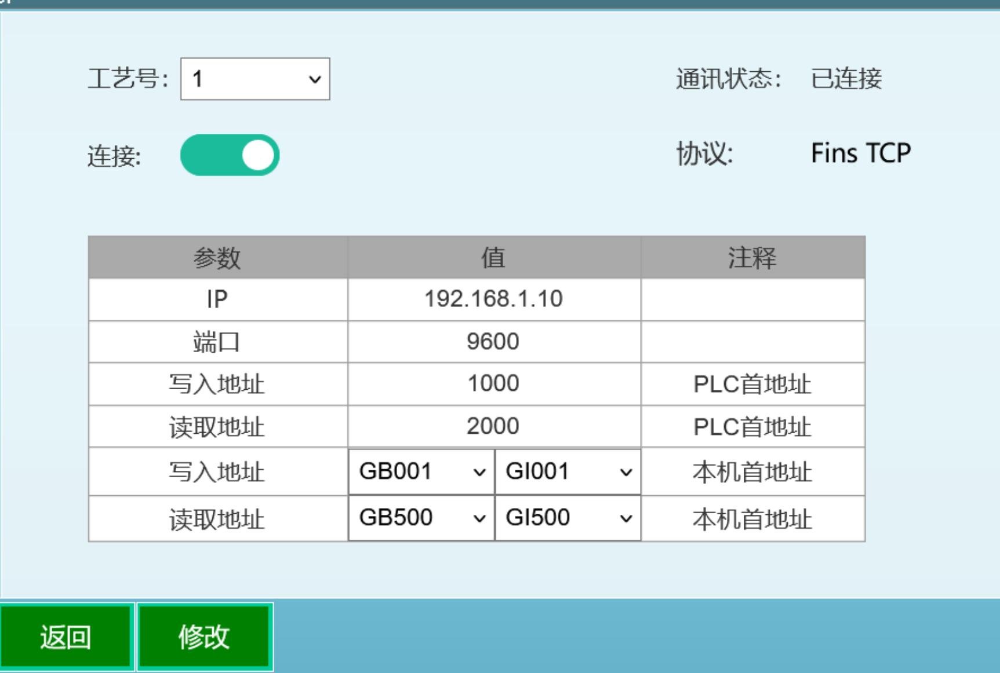
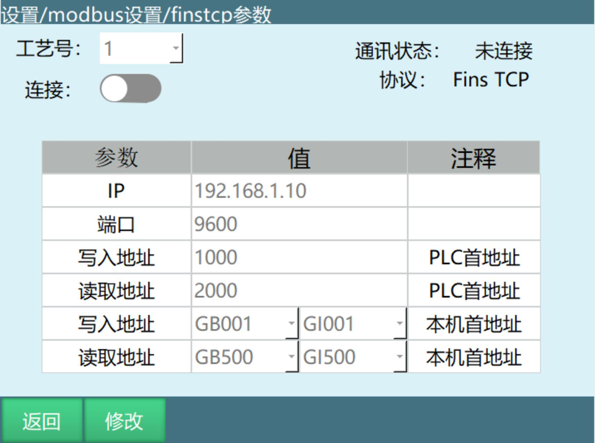

## 📋 元数据 (Metadata)

- **文档标题**: FINSTCP通讯协议配置与使用手册
- **所属公司**: 纳博特南京科技有限公司 (iNexBot Nanjing Technology Co., Ltd.)
- **核心主题**: FINSTCP指令与Fins TCP通讯协议应用指南
- **关键标签**: #FINSTCP #Fins_TCP #PLC通讯 #欧姆龙PLC #数据交互
- **适用场景**: 机器人与PLC通讯、欧姆龙PLC集成、数据读写操作、工业自动化控制


---

## 目录

- 1 FINSTCP指令概述
  - > 1.1 打开FINSTCP连接
  - > 1.2 断开FINSTCP连接
  - > 1.3 获取FINSTCP连接状态
- 2 FINSTCP参数配置
  - > 2.1 参数说明
  - > 2.2 参数设置示例
- 3 Fins TCP功能使用流程
  - > 3.1 硬件连接
  - > 3.2 参数设置
  - > 3.3 CX-Programmer操作
- 4 控制器地址映射详解
  - > 4.1 控制器写入地址（布尔型）
  - > 4.2 控制器写入地址（整数型）
  - > 4.3 控制器读取地址（布尔型）
  - > 4.4 控制器读取地址（整数型）

---

## 1 FINSTCP指令概述

FINSTCP指令用于在运行模式下管理FINSTCP通讯连接，实现控制器与PLC之间的Fins TCP协议通讯。



### > 1.1 打开FINSTCP连接

**指令功能**: 在运行模式下打开FINSTCP通讯连接

**参数说明**:

| 参数 | 说明 |
| :--- | :--- |
| 工艺号 | 绑定FINSTCP参数工艺号 |

**使用场景**:
- 程序启动时建立通讯连接
- 通讯断开后重新连接

### > 1.2 断开FINSTCP连接

**指令功能**: 在运行模式下断开FINSTCP通讯连接

**参数说明**:

| 参数 | 说明 |
| :--- | :--- |
| 工艺号 | 绑定FINSTCP参数工艺号 |

**使用场景**:
- 程序结束时关闭通讯连接
- 切换不同PLC时断开当前连接

### > 1.3 获取FINSTCP连接状态

**指令功能**: 将FINSTCP的连接状态存在BOOL/GBOOL变量中

**使用方法**:
- 通过获取变量的数值来判断FINSTCP的连接状态
- 每运行一次该指令就获取一次状态
- 常放在"打开FINSTCP连接"下面

**使用示例**:

```plaintext
// 示例代码
GET_FINSTCP_STATUS GB010  // 获取连接状态存入GB010
IF GB010 == 1 THEN
    // 连接成功，执行后续操作
    ...
ELSE
    // 连接失败，执行错误处理
    ...
ENDIF
```

---

## 2 FINSTCP参数配置

### > 2.1 参数说明

FINSTCP参数配置界面包含以下参数：

| 参数 | 值示例 | 注释 |
| :--- | :--- | :--- |
| 工艺号 | 1 | 一共有9个工艺号可选，此工艺号无实际意义 |
| 连接 | 参数/连接按钮 | FinsTCP设置完成后需打开连接按钮，此连接按钮也可以通过打开FINSTCP连接、断开FINSTCP连接指令进行打开和关闭 |
| 通讯状态 | 已连接/未连接 | 右侧通讯状态可查看连接状态 |
| 协议 | Fins TCP | 通讯协议类型 |
| IP | 192.168.1.10 | PLC设备IP地址 |
| 端口 | 9600 | PLC设备端口号 |
| 写入地址 | 1000 | PLC的写入地址（PLC首地址） |
| 读取地址 | 2000 | PLC的读取地址（PLC首地址） |
| 写入地址 | GB001、GI001 | 控制器的写入地址（本机首地址），由PLC读取来自控制器的数据，写入到PLC中，可在示教器中对该数值进行修改 |
| 读取地址 | GB500、GI500 | 控制器的读取地址（本机首地址），控制器读取PLC写入的数据，存入到控制器的全局布尔变量与全局整数型变量中，该数值不能通过示教器进行修改，可通过CX-Programmer软件写入 |

**重要注意事项**:

> PLC的写入地址与读取地址数值不能设置成一样的数值，同时控制器的写入地址与读取地址中的变量也不能选相同的变量。

### > 2.2 参数设置示例

**典型配置示例**:

| 参数 | 值 | 说明 |
| :--- | :--- | :--- |
| 工艺号 | 1 | 使用工艺号1 |
| IP | 192.168.1.10 | PLC的IP地址 |
| 端口 | 9600 | PLC的端口号 |
| 写入地址（PLC） | 1000 | CX-Programmer软件的PLC内存的1000 |
| 读取地址（PLC） | 2000 | CX-Programmer软件的PLC内存的2000 |
| 写入地址（控制器） | GB001、GI001 | 控制器的全局布尔和整型变量起始地址 |
| 读取地址（控制器） | GB500、GI500 | 控制器的全局布尔和整型变量起始地址 |

---

## 3 Fins TCP功能使用流程



### > 3.1 Fins TCP功能概述

**功能说明**: Fins TCP功能可使控制器与PLC之间进行数据的交互

**支持协议**: Fins TCP

**适用范围**: 此功能只适用于欧姆龙PLC

**使用流程**:

```
连接PLC、控制器和电脑 → 设置finstcp参数 → 打开CX-Programmer软件进行写入与读取操作
```

### > 3.2 硬件连接

**步骤**: 用网线将PLC、控制器、电脑连接起来

**软件准备**: 电脑上需要安装CX-Programmer软件

**连接拓扑**:

```
┌─────────────┐
│   电脑      │
│ (CX-Programmer软件)
└──────┬──────┘
       │
       │ 网线
       │
┌──────┴──────┐
│   控制器    │
│ (iNexBot)   │
└──────┬──────┘
       │
       │ 网线
       │
┌──────┴──────┐
│  欧姆龙PLC  │
└─────────────┘
```

### > 3.3 参数设置

**设置路径**: 【设置】→【modbus设置】→【finstcp参数】

**设置步骤**:

1. 进入示教器【设置】菜单

2. 选择【modbus设置】

3. 点击【finstcp参数】

4. 设置相关参数：
   - IP地址：写PLC的地址 `192.168.1.10`
   - 端口：写PLC的端口 `9600`
   - 写入地址：写CX-Programmer软件的PLC内存的 `1000`
   - 读取地址：写CX-Programmer软件的PLC内存的 `2000`
   - 写入地址（控制器）：写 `GB001` 和 `GI001`
   - 读取地址（控制器）：写 `GB500` 和 `GI500`

**FinSTCP参数详细说明**:

| 参数 | 说明 |
| :--- | :--- |
| 连接 | FinsTCP设置完成后需打开连接按钮，此连接按钮也可以通过打开FINSTCP连接、断开FINSTCP连接指令进行打开和关闭，右侧通讯状态可查看连接状态 |
| IP | PLC设备IP地址 |
| 端口 | PLC设备端口号 |
| 写入地址（PLC） | CX-Programmer软件的PLC内存的1000 |
| 读取地址（PLC） | CX-Programmer软件的PLC内存的2000 |
| 写入地址（控制器） | 从GB001开始依次写入来自CX-Programmer软件的子单位，前十六个布尔型变量是通过获取控制器的状态来填写的（具体可看附表）。从GI001开始依次写入来自CX-Programmer软件的单位，前六个整型变量是机器人当前直角坐标的数值，其余的数值就是控制器自身的数值（具体可看附表）。以上数值均是由CX-Programmer软件从控制器获取的数值，具体含义请看附表 |
| 读取地址（控制器） | 从GB500开始的变量的数值是由CX-Programmer软件写入的，前十六个变量写入数值来控制控制器（具体功能可看附表），从GI500开始的数值是由CX-Programmer软件写入的。以上数值只能通过CX-Programmer软件写入 |

**重要说明**:

> 一个单位 = 16个子单位，子单位均写入布尔变量中，单位均写入整型变量中。

### > 3.4 CX-Programmer操作

**操作步骤**:

1. **打开软件**: 打开CX-Programmer软件

2. **新建工程**:
   - 点击【文件】
   - 选择【新建】
   - 弹窗内的内容不做修改，点击【确定】

3. **打开内存界面**:
   - 双击【内存】
   - 打开内存界面

4. **打开表格界面**:
   - 双击【D】
   - 打开一个表格界面

5. **监视数据**:
   - 点击【监视】按钮
   - 表格界面就会出现数值
   - 首地址填写 `1000`
   - 点击【二进制】
   - 表格里面的数值就是子单位数值

6. **连接验证**:
   - 控制器与PLC连接起来后
   - 表格中9下面的数值会不断的在1和0之间转换

7. **查看单位数值**:
   - 点击【有符号十进制数】
   - 表格里面的数值就是单位数值

8. **写入操作**:
   - 当要从CX-Programmer软件写入时
   - 需要将新建界面的【只读】按钮关闭
   - 然后就可以从软件中写入数值

---

## 4 控制器地址映射详解

本章节详细说明控制器写入地址与读取地址中各项数值代表的意义。

### > 4.1 控制器写入地址中的全局布尔型变量

**变量范围**: 全局布尔型变量中前128个变量

**数据来源**: 这128个变量的数值，是PLC读取控制器获取的

#### 4.1.1 前16个状态变量

前16个变量的数值，是根据控制器的状态获取的。

| 变量序号 | 含义 | 值为1的条件 | 值为0的条件 |
| :--- | :--- | :--- | :--- |
| 第1个 | 保留 | - | - |
| 第2个 | 运行模式状态 | 控制器是运行模式 | 控制器不是运行模式 |
| 第3个 | 远程模式状态 | 控制器是远程模式 | 控制器不是远程模式 |
| 第4个 | 伺服就绪状态 | 控制器伺服就绪 | 控制器伺服未就绪 |
| 第5个 | 保留 | - | - |
| 第6个 | 急停状态 | 控制器急停 | 控制器未急停 |
| 第7个 | 保留 | - | - |
| 第8个 | 程序运行状态 | 控制器中程序运行时 | 控制器中程序未运行 |
| 第9个 | 程序暂停状态 | 控制器中程序暂停时 | 控制器中程序未暂停 |
| 第10个 | 通讯心跳状态 | 控制器与PLC通讯连接上后 | 控制器与PLC通讯断开时 |
| 第11个 | 通讯连接状态 | 控制器与PLC通讯状态连接时 | 控制器与PLC通讯状态未连接时 |
| 第12个 | 示教模式状态 | 控制器处于示教模式时 | 控制器不处于示教模式时 |
| 第13-16个 | 保留 | - | - |

**变量说明**:

- **第2个变量（运行模式）**: 控制器是运行模式时为1，否则为0
- **第3个变量（远程模式）**: 控制器是远程模式时为1，否则为0
- **第4个变量（伺服就绪）**: 控制器伺服就绪时为1，否则为0
- **第6个变量（急停状态）**: 控制器急停时为1，否则为0
- **第8个变量（程序运行）**: 控制器中程序运行时为1，否则为0
- **第9个变量（程序暂停）**: 控制器中程序暂停时为1，否则为0
- **第10个变量（通讯心跳）**: 控制器与PLC通讯连接上后，此数值为跳动状态在1与0之间不断跳动。（当这个数值处于不断跳动的状态时，说明控制器与PLC连接成功。）
- **第11个变量（通讯连接）**: 控制器与PLC通讯状态连接时为1，此数值不会发生变化
- **第12个变量（示教模式）**: 控制器处于示教模式时为1，否则为0

#### 4.1.2 第16-128个用户变量

**说明**: 全局布尔型变量中第16个到第128个变量的数值，这些变量的数值就是控制器自身的全局布尔型变量的数值，也是被PLC读取的数值

**可修改性**: 这些变量的数值可通过示教器直接进行修改和填写

### > 4.2 控制器写入地址中的全局整数型变量

#### 4.2.1 前6个坐标变量

**说明**: 控制器写入地址中全局整数型变量的前6个变量的数值，表示的是机器人坐标位置的数值

**坐标变量**:

| 变量序号 | 坐标含义 |
| :--- | :--- |
| 第1个 | X轴坐标 |
| 第2个 | Y轴坐标 |
| 第3个 | Z轴坐标 |
| 第4个 | Rx轴坐标 |
| 第5个 | Ry轴坐标 |
| 第6个 | Rz轴坐标 |

#### 4.2.2 第6-40个全局整型变量

**说明**: 从第6个变量到第40个变量，显示的数值是控制器全局整数型变量的数值

**可修改性**: 这些变量的数值可通过示教器进行修改和填写

### > 4.3 控制器读取地址中的全局布尔型变量

**变量范围**: 读取地址中全局布尔型变量的前128个变量

**数据来源**: 由PLC写入的数值

#### 4.3.1 控制信号变量

| 变量序号 | 功能说明 | 激活效果 |
| :--- | :--- | :--- |
| 第1个 | 保留 | - |
| 第2个 | 伺服就绪控制 | PLC写入数值为1时，控制器伺服就绪（若不将该数值改为0，则控制器会一直处于伺服就绪状态。）|
| 第3个 | 保留 | - |
| 第4个 | 程序启动控制 | PLC写入数值为1时，控制器主程序开始运行（控制器需要处于运行模式。）|
| 第5个 | 程序暂停控制 | PLC写入数值为1时，控制器主程序运行暂停（控制器需要处于运行模式。）|
| 第6个 | 保留 | - |
| 第7个 | 报警清除控制 | PLC写入数值为1时，控制器的报警小白条被清除，与清错按钮的效果一致 |
| 第8-128个 | 用户自定义 | 用户自定义功能 |

**变量说明**:

- **第2个变量（伺服就绪）**: PLC写入数值为1时，控制器伺服就绪（若不将该数值改为0，则控制器会一直处于伺服就绪状态。）
- **第4个变量（程序启动）**: PLC写入数值为1时，控制器主程序开始运行（控制器需要处于运行模式。）
- **第5个变量（程序暂停）**: PLC写入数值为1时，控制器主程序运行暂停（控制器需要处于运行模式。）
- **第7个变量（报警清除）**: PLC写入数值为1时，控制器的报警小白条被清除，与清错按钮的效果一致

### > 4.4 控制器读取地址中的全局整数型变量

**变量范围**: 读取地址绑定的整数型变量中，前81个变量

**数据来源**: PLC写入的数值

**可修改性**: 此数值需要通过PLC进行修改和填写

---

## 5. 重要注意事项

### 5.1 地址配置注意事项

| 注意事项 | 说明 |
| :--- | :--- |
| 地址唯一性 | PLC的写入地址与读取地址数值不能设置成一样的数值 |
| 变量唯一性 | 控制器的写入地址与读取地址中的变量也不能选相同的变量 |
| 地址范围 | 确保地址范围在有效范围内，避免地址冲突 |

### 5.2 通讯连接注意事项

| 注意事项 | 说明 |
| :--- | :--- |
| 协议支持 | 此功能只适用于欧姆龙PLC |
| 网络连接 | 确保PLC、控制器、电脑用网线正确连接 |
| IP地址配置 | 确保IP地址在同一网段内 |
| 端口配置 | 确保端口号正确，默认为9600 |

### 5.3 CX-Programmer操作注意事项

| 注意事项 | 说明 |
| :--- | :--- |
| 只读模式 | 写入操作前需要关闭只读按钮 |
| 监视模式 | 监视模式下可实时查看数据变化 |
| 心跳检测 | 通讯成功后，心跳变量会不断跳动 |
| 数据格式 | 二进制显示子单位数值，有符号十进制显示单位数值 |

### 5.4 变量操作注意事项

| 注意事项 | 说明 |
| :--- | :--- |
| 状态变量 | 前16个布尔变量为系统状态，只读 |
| 用户变量 | 第16-128个布尔变量可读写 |
| 坐标变量 | 前6个整型变量为机器人坐标 |
| 全局变量 | 可通过示教器修改的变量 |

---

## 6. 典型应用场景

### 6.1 PLC控制机器人启停

**场景描述**: 通过PLC控制机器人主程序的启动和暂停

**实现方法**:

1. 配置FINSTCP参数
2. 通过CX-Programmer软件向控制器读取地址的第4个变量写入1，启动机器人主程序
3. 通过CX-Programmer软件向控制器读取地址的第5个变量写入1，暂停机器人主程序

**控制流程**:

```
PLC写入GB504(第4个变量) = 1 → 机器人主程序开始运行
PLC写入GB505(第5个变量) = 1 → 机器人主程序运行暂停
```

### 6.2 机器人状态监控

**场景描述**: PLC实时监控机器人运行状态

**实现方法**:

1. 配置FINSTCP参数
2. 通过CX-Programmer软件读取控制器写入地址的前16个变量
3. 解析各变量的状态信息

**状态监控**:

| 机器人状态 | 对应变量 | 值为1的条件 |
| :--- | :--- | :--- |
| 运行模式 | GB002 | 控制器是运行模式 |
| 远程模式 | GB003 | 控制器是远程模式 |
| 伺服就绪 | GB004 | 控制器伺服就绪 |
| 急停状态 | GB006 | 控制器急停 |
| 程序运行 | GB008 | 控制器中程序运行 |
| 程序暂停 | GB009 | 控制器中程序暂停 |
| 通讯心跳 | GB010 | 控制器与PLC通讯连接 |
| 通讯连接 | GB011 | 控制器与PLC通讯状态连接 |
| 示教模式 | GB012 | 控制器处于示教模式 |

### 6.3 坐标数据交互

**场景描述**: PLC读取机器人当前坐标位置

**实现方法**:

1. 配置FINSTCP参数
2. 通过CX-Programmer软件读取控制器写入地址的前6个整型变量（GI001-GI006）
3. 解析坐标数值

**坐标变量**:

| 变量序号 | 变量名称 | 坐标含义 |
| :--- | :--- | :--- |
| 第1个 | GI001 | X轴坐标 |
| 第2个 | GI002 | Y轴坐标 |
| 第3个 | GI003 | Z轴坐标 |
| 第4个 | GI004 | Rx轴坐标 |
| 第5个 | GI005 | Ry轴坐标 |
| 第6个 | GI006 | Rz轴坐标 |

---

## 7. 故障排查

### 7.1 常见问题

| 故障现象 | 可能原因 | 解决方法 |
| :--- | :--- | :--- |
| 无法连接PLC | IP地址配置错误 | 检查IP地址是否在同一网段 |
| 无法连接PLC | 端口号配置错误 | 检查端口号是否为9600 |
| 无法连接PLC | 网线连接异常 | 检查网线连接是否正常 |
| 通讯状态显示未连接 | 未点击连接按钮 | 点击连接按钮或使用打开FINSTCP连接指令 |
| 心跳变量不跳动 | 通讯未建立 | 检查网络连接和配置参数 |
| 无法写入数据 | 只读模式未关闭 | 关闭CX-Programmer软件中的只读按钮 |
| 无法启动程序 | 控制器未处于运行模式 | 将控制器切换到运行模式 |
| 无法暂停程序 | 控制器未处于运行模式 | 将控制器切换到运行模式 |

### 7.2 连接状态判断

**正常连接状态**:

- 通讯状态显示"已连接"
- 第10个变量（GB010）数值在1和0之间不断跳动
- 第11个变量（GB011）数值为1

**异常连接状态**:

- 通讯状态显示"未连接"
- 第10个变量（GB010）数值不跳动
- 第11个变量（GB011）数值为0

### 7.3 心跳检测说明

**心跳变量**: 第10个变量（GB010）

**正常状态**: 控制器与PLC通讯连接上后，此数值为跳动状态在1与0之间不断跳动

**判断标准**: 当这个数值处于不断跳动的状态时，说明控制器与PLC连接成功

---

## 8. AI 检索专用问答对 (Q&A for Retrieval)

**Q: FINSTCP指令有哪些主要功能?**

A: FINSTCP指令包括三个主要功能：打开FINSTCP连接（在运行模式下打开通讯连接）、断开FINSTCP连接（在运行模式下断开通讯连接）、获取FINSTCP连接状态（将连接状态存入BOOL/GBOOL变量中）。[来源: FINSTCP通讯协议配置与使用手册][用户上传文件]

**Q: FINSTCP参数中的工艺号有什么作用?**

A: FINSTCP参数中的工艺号一共有9个可选，但此工艺号无实际意义，仅用于绑定FINSTCP参数工艺号。[来源: FINSTCP通讯协议配置与使用手册][用户上传文件]

**Q: 如何打开FINSTCP连接?**

A: 可以通过两种方式打开FINSTCP连接：1. 在FINSTCP参数设置界面点击"连接"按钮；2. 在程序中使用"打开FINSTCP连接"指令。[来源: FINSTCP通讯协议配置与使用手册][用户上传文件]

**Q: FINSTCP配置中PLC的写入地址和读取地址有什么要求?**

A: PLC的写入地址与读取地址数值不能设置成一样的数值，同时控制器的写入地址与读取地址中的变量也不能选相同的变量。[来源: FINSTCP通讯协议配置与使用手册][用户上传文件]

**Q: Fins TCP功能适用于哪些PLC?**

A: Fins TCP功能只适用于欧姆龙PLC。[来源: FINSTCP通讯协议配置与使用手册][用户上传文件]

**Q: Fins TCP功能的使用流程是什么?**

A: Fins TCP功能使用流程包括三个步骤：1. 用网线将PLC、控制器、电脑连接起来；2. 在"设置-modbus设置-finstcp参数"中设置相关参数；3. 打开CX-Programmer软件进行写入与读取操作。[来源: FINSTCP通讯协议配置与使用手册][用户上传文件]

**Q: 控制器写入地址中的全局布尔型变量前16个变量的作用是什么?**

A: 控制器写入地址中全局布尔型变量的前16个变量的数值，是根据控制器的状态获取的，包括运行模式、远程模式、伺服就绪、急停状态、程序运行、程序暂停、通讯心跳、通讯连接、示教模式等状态信息。[来源: FINSTCP通讯协议配置与使用手册][用户上传文件]

**Q: 如何通过PLC判断控制器是否处于运行模式?**

A: 当控制器是运行模式时，控制器写入地址中全局布尔型变量的第2个变量的数值为1，否则为0。[来源: FINSTCP通讯协议配置与使用手册][用户上传文件]

**Q: 如何判断控制器与PLC是否连接成功?**

A: 当控制器与PLC通讯连接上后，控制器写入地址中全局布尔型变量的第10个变量的数值为跳动状态在1与0之间不断跳动；第11个变量的数值为1。当第10个变量处于不断跳动的状态时，说明控制器与PLC连接成功。[来源: FINSTCP通讯协议配置与使用手册][用户上传文件]

**Q: 如何通过PLC启动控制器的主程序?**

A: 通过CX-Programmer软件向控制器读取地址中全局布尔型变量的第4个变量写入数值1，即可启动控制器的主程序（控制器需要处于运行模式）。[来源: FINSTCP通讯协议配置与使用手册][用户上传文件]

**Q: 如何通过PLC暂停控制器的主程序?**

A: 通过CX-Programmer软件向控制器读取地址中全局布尔型变量的第5个变量写入数值1，即可暂停控制器的主程序（控制器需要处于运行模式）。[来源: FINSTCP通讯协议配置与使用手册][用户上传文件]

**Q: 如何通过PLC清除控制器的报警?**

A: 通过CX-Programmer软件向控制器读取地址中全局布尔型变量的第7个变量写入数值1，即可清除控制器的报警小白条，与清错按钮的效果一致。[来源: FINSTCP通讯协议配置与使用手册][用户上传文件]

**Q: 控制器写入地址中全局整数型变量的前6个变量表示什么?**

A: 控制器写入地址中全局整数型变量的前6个变量的数值，表示的是机器人坐标位置的数值，包括X、Y、Z、Rx、Ry、Rz六个轴的坐标。[来源: FINSTCP通讯协议配置与使用手册][用户上传文件]

**Q: 控制器写入地址中全局布尔型变量第16个到第128个变量的作用是什么?**

A: 控制器写入地址中全局布尔型变量第16个到第128个变量的数值，就是控制器自身的全局布尔型变量的数值，也是被PLC读取的数值，这些变量的数值可通过示教器直接进行修改和填写。[来源: FINSTCP通讯协议配置与使用手册][用户上传文件]

**Q: 在CX-Programmer软件中如何查看子单位数值?**

A: 在CX-Programmer软件中，打开内存界面，双击D打开表格界面，点击监视按钮，填写首地址，点击"二进制"，表格里面的数值就是子单位数值。[来源: FINSTCP通讯协议配置与使用手册][用户上传文件]

**Q: 在CX-Programmer软件中如何查看单位数值?**

A: 在CX-Programmer软件中，点击"有符号十进制数"后，表格里面的数值就是单位数值。[来源: FINSTCP通讯协议配置与使用手册][用户上传文件]

**Q: 在CX-Programmer软件中如何写入数值?**

A: 当要从CX-Programmer软件写入时，需要将新建界面的"只读"按钮关闭，然后就可以从软件中写入数值。[来源: FINSTCP通讯协议配置与使用手册][用户上传文件]

**Q: 一个单位等于多少个子单位?**

A: 一个单位等于16个子单位，子单位均写入布尔变量中，单位均写入整型变量中。[来源: FINSTCP通讯协议配置与使用手册][用户上传文件]

**Q: 控制器读取地址中的全局布尔型变量的数据来源是什么?**

A: 读取地址中全局布尔型变量的前128个变量的数值，是由PLC写入的数值。[来源: FINSTCP通讯协议配置与使用手册][用户上传文件]

**Q: 控制器读取地址中的全局整数型变量的数据来源是什么?**

A: 读取地址绑定的整数型变量中，前81个变量的数值就是PLC写入的数值，此数值需要通过PLC进行修改和填写。[来源: FINSTCP通讯协议配置与使用手册][用户上传文件]

**Q: 如何判断控制器是否处于示教模式?**

A: 当控制器处于示教模式时，控制器写入地址中全局布尔型变量的第12个变量的数值为1，否则为0。[来源: FINSTCP通讯协议配置与使用手册][用户上传文件]

**Q: 如何判断控制器伺服是否就绪?**

A: 当控制器伺服就绪时，控制器写入地址中全局布尔型变量的第4个变量的数值为1，否则为0。[来源: FINSTCP通讯协议配置与使用手册][用户上传文件]

**Q: 如何通过PLC让控制器伺服就绪?**

A: PLC向控制器读取地址中全局布尔型变量的第2个变量写入数值1时，控制器伺服就绪（若不将该数值改为0，则控制器会一直处于伺服就绪状态）。[来源: FINSTCP通讯协议配置与使用手册][用户上传文件]

**Q: 控制器急停时哪个变量的值为1?**

A: 控制器急停时，控制器写入地址中全局布尔型变量的第6个变量的数值为1，否则为0。[来源: FINSTCP通讯协议配置与使用手册][用户上传文件]

**Q: 控制器中程序运行时哪个变量的值为1?**

A: 控制器中程序运行时，控制器写入地址中全局布尔型变量的第8个变量的数值为1，否则为0。[来源: FINSTCP通讯协议配置与使用手册][用户上传文件]

**Q: 控制器中程序暂停时哪个变量的值为1?**

A: 控制器中程序暂停时，控制器写入地址中全局布尔型变量的第9个变量的数值为1，否则为0。[来源: FINSTCP通讯协议配置与使用手册][用户上传文件]

**Q: 控制器写入地址中的全局整数型变量从第6个到第40个变量表示什么?**

A: 从第6个变量到第40个变量，显示的数值是控制器全局整数型变量的数值，这些变量的数值可通过示教器进行修改和填写。[来源: FINSTCP通讯协议配置与使用手册][用户上传文件]

**Q: FINSTCP连接按钮的替代方法是什么?**

A: FINSTCP连接按钮也可以通过"打开FINSTCP连接"、"断开FINSTCP连接"指令进行打开和关闭。[来源: FINSTCP通讯协议配置与使用手册][用户上传文件]

**Q: 获取FINSTCP连接状态指令的作用是什么?**

A: 获取FINSTCP连接状态指令将FINSTCP的连接状态存在BOOL/GBOOL变量中，通过获取变量的数值来判断FINSTCP的连接状态，每运行一次该指令就获取一次状态，常放在"打开FINSTCP连接"下面。[来源: FINSTCP通讯协议配置与使用手册][用户上传文件]

**Q: 在CX-Programmer软件中如何监视数据?**

A: 在CX-Programmer软件中，打开内存界面，双击D打开表格界面，然后点击监视按钮，表格界面就会出现数值，填写首地址后就可以查看数据。[来源: FINSTCP通讯协议配置与使用手册][用户上传文件]

**Q: 控制器写入地址中的数据是否可以被示教器修改?**

A: 控制器写入地址中的数据（GB001开始的布尔变量和GI001开始的整型变量）可以在示教器中对该数值进行修改。[来源: FINSTCP通讯协议配置与使用手册][用户上传文件]

**Q: 控制器读取地址中的数据是否可以被示教器修改?**

A: 控制器读取地址中的数据不能通过示教器进行修改，只能通过CX-Programmer软件写入。[来源: FINSTCP通讯协议配置与使用手册][用户上传文件]

**Q: 通讯连接成功后，控制器写入地址的第11个变量的值是多少?**

A: 控制器与PLC通讯状态连接时，控制器写入地址中全局布尔型变量的第11个变量的数值为1，此数值不会发生变化。[来源: FINSTCP通讯协议配置与使用手册][用户上传文件]

**Q: 如何在控制器中获取FINSTCP连接状态?**

A: 使用"获取FINSTCP连接状态"指令，将FINSTCP的连接状态存在BOOL/GBOOL变量中，通过获取变量的数值来判断FINSTCP的连接状态。[来源: FINSTCP通讯协议配置与使用手册][用户上传文件]
