标题: "IO、Modbus 与远程功能使用手册"

内容: "本手册覆盖机器人系统中 IO、Modbus 与远程功能的基础指令、配置方法与使用流程。"

描述: "针对 22.07 版本机器人系统，详细说明 IO 输入输出、IO 安全设置、远程模式控制以及 Modbus 通信的使用方法。"

标签:
- "IO"
- "Modbus"
- "远程功能"
- "机器人控制"

分类: "操作手册"

---

# 1 IO

## 1.1 输入输出指令

### 1.1.1 DIN-IO输入

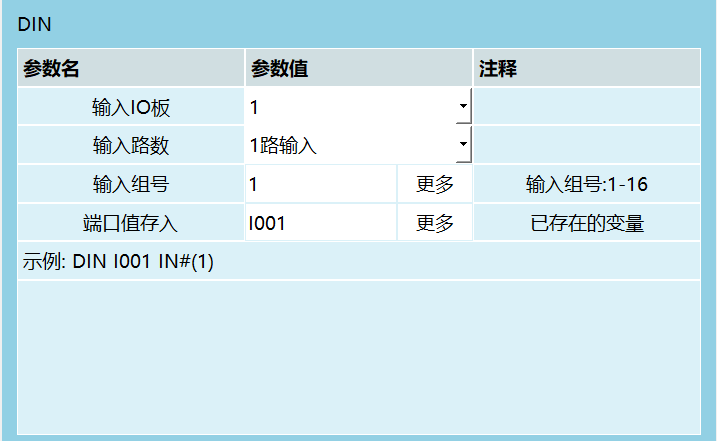

该指令用于将数字输入状态读入一个变量中，该变量可以为局部整型变量、全局整型变量（INT、GINT）或局部布尔变量、全局布尔变量（B、GB）。

**参数说明：**

| 参数名 | 参数值 | 注释 |
|--------|--------|------|
| 输入IO板 | 1路输入 | 1路输入 |
| 输入组号 | 更多 | 输入组号:1-16 |
| 端口值存入 | 1001 | 更多，已存在的变量，示例:DIN I001 IN#(1) |

**输入IO板：** 可以选择使用IO板1-4。

**输入路数：**
- `IN#` - 1路输入，此时1路为1组，第1-16组分别对应第1-16号端口
- `IGH#` - 4路输入，此时每4路为1组，即1-4路端口、5-8路端口、9-12路端口、13-16路端口分别为1-4组，此时组号可填写1-4。如想同时读取第5-8路端口的输入状态，则可填写组号为2
- `IG#` - 8路输入，此时每8路为1组，即1-8为1号组，9-16为2号组。如想同时读取9-16号端口的输入状态，则组号填2

若同时读入多路端口，则将端口状态转换为10进制保存入变量中。并且读取的组号可以从对应变量中获取。

**示例1：** 读取5-8路端口，同时有4路，其状态分别为如下，并且将其存在I001中。

| 1 | 2 | 3 | 4 |
|---|---|---|---|
| 0 | 1 | 1 | 0 |

则二进制值为0110，转换为10进制为6。

则在系统中保存的为 `DIN I001 IGH#(1) 6`。

**示例2：** 读取9-16路端口，同时有8路，其状态分别为如下，并且将其存在GI001中。

| 16 | 15 | 14 | 13 | 12 | 11 | 10 | 9 |
|----|----|----|----|----|----|----|----|
| 0 | 1 | 1 | 0 | 1 | 0 | 0 | 1 |

则二进制值为01101001，转换为10进制为105。

则在系统中保存的为 `DIN GI001 IG#(2) 105`。

**输入组号：** 可以设置同时读取1/4/8路输入状态，也可以通过绑定变量的变量值。

**端口值存入：** 将IO输入读取到的值存入到选择的变量中。

---

### 1.1.2 DOUT-IO输出

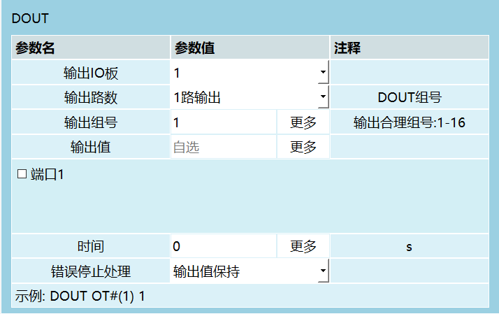

该指令用于通过数字IO板输出数字信号。

**参数说明：**

| 参数名 | 参数值 | 注释 |
|--------|--------|------|
| 输出IO板 | 1路输出 | 输出路数 |
| DOUT组号 | 1 | 输出组号 |
| 输出组号 | 更多 | 输出合理组号:1-16 |
| 输出值 | 自选 | 更多，端口1 |
| 时间 | 0 | 更多，S |
| 错误停止处理 | 输出值保持 | 示例:DOUT OT#(1)1) |

**输出IO板：** 选择需要输出的IO板，可选择1-4。

**输出路数：**
- `OT#` - 1路输出，此时1路为1组，第1-16组分别对应第1-16号端口
- `OGH#` - 4路输出，此时每4路为1组，即1-4路端口、5-8路端口、9-12路端口、13-16路端口分别为1-4组，此时组号可填写1-4。如想同时输出第5-8路端口，则可填写组号为2
- `OG#` - 8路输出，此时每8路为1组，即1-8为1号组，9-16为2号组。如想同时输出9-16号端口，则组号填2

**输出组号：** 可以设置同时输出1/4/8路IO，也可以通过绑定变量的变量值。

**输出值：** 可以选择自行选择或者通过变量输出，也可以通过绑定变量的变量值。

- 若选择自选，则勾选每一组IO中每一路端口的状态，勾选输出为1，不勾选输出为0
- 若选择通过变量输出，则在输出时将会把变量值从10进制转换为2进制，具体方法如DIN

**时间：** 指令执行后等待指定时间，然后取反输出。

**错误停止处理：** 在IO信号输出的过程中，产生了错误报警。IO信号会做出不同的处理方式。

- **选择输出值保持**：在程序运行的情况下，触发报警或其他意外情况下，端口输出会保持现状，并且计时时间暂停。待清除报警错误，程序开始正常运行时，IO输出计时继续暂停之前剩余的时间，计时时间结束时端口会取反
- **选择计时结束停止**：无论什么情况下，只要端口计时时间结束，都会将端口值取反，不受暂停、报错的影响

---

### 1.1.3 AIN-模拟输入

该指令用于将模拟量IO板的单一端口输入值读入到一个变量中。

**参数说明：**
- **模拟输入口**：选择需要读取的输入端口
- **变量名**：请选择需要读入到的变量的变量名，如GD001

---

### 1.1.4 AOUT-模拟输出

该指令用于设置模拟量IO板单一端口的输出值。输出值可以为浮点数。

**参数说明：**
- **模拟输出口**：选择需要设置值的输出端口
- **变量值来源**：请选择全局浮点型GDOUBLE或局部浮点型DOUBLE变量或手填值

---

### 1.1.5 PULSEOUT-脉冲输出

该指令用于控制支持PWM的IO板脉冲输出。

**参数说明：**
- **个数**：脉冲输出总个数
- **频率**：脉冲输出频率；例如默认值100，则1s输出100个

**支持该功能的IO板如下：**
- 华太IOPWM
- INEXBOT R1PWM

**使用方法：**

修改配置文件controller.json：

```json
"Io": {
    "pulse": {
        "exist": true,
        "type": "UA_PWM"
    }
}
```

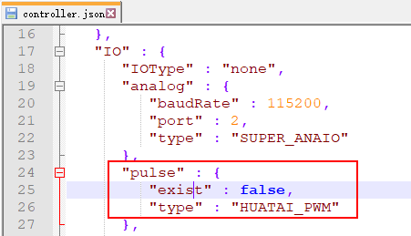

找到"IO"-"pulse"内的参数：
- **exist参数**，改为true/false
  - true：功能可用
  - false：功能关闭
- **type参数**，改为对应IO板
  - HUATAI_PWM：华太IO
  - INEXBOT_PWM：纳博特R1

---

### 1.1.6 READ_DOUT-读取输出

该指令用于将当前数字量IO板的输出状态读入到一个变量中。其使用方法同DIN，只是读取的为输出的状态。

---

# 2 IO状态提示设置

在状态提示设置界面中，可以设置开机提示、机器人运行状态、报错提示、使能、模式状态、紧急停止等功能所对应的I/O 端口与该端口对应的电平。

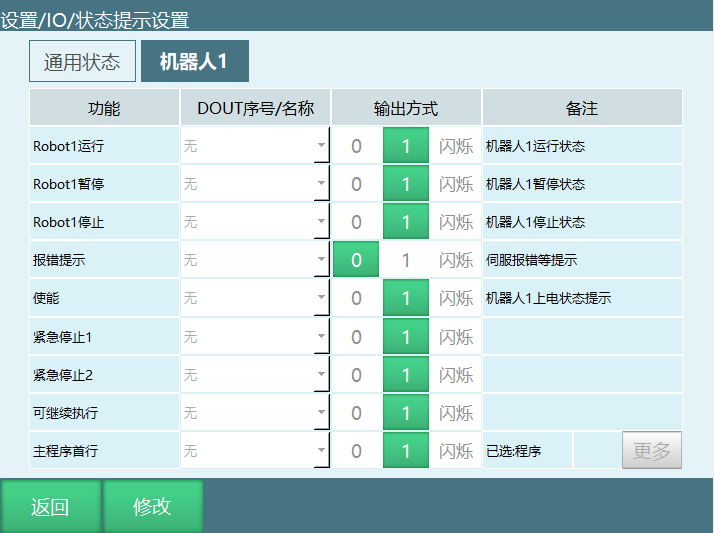

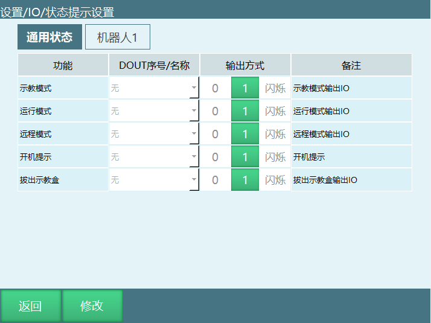

**功能说明：**

| 功能 | 说明 |
|------|------|
| Robot1运行 | 机器人1运行时对应端口输出高/低电平 |
| Robot1暂停 | 机器人1暂停时对应端口输出高/低电平 |
| Robot1停止 | 机器人1停止时对应端口输出高/低电平 |
| 报错提示 | 机器人伺服报错时对应端口输出高/低电平，可设置常亮或闪烁 |
| 使能 | 机器人上电时对应端口输出高/低电平 |
| 紧急停止1 | 紧急停止信号触发后对应端口输出高电平或低电平，可自行设置 |
| 紧急停止2 | 紧急停止信号触发后对应端口输出高电平或低电平，可自行设置 |
| 主程序首行 | 对应端口输出一个高电平参数为1的信号，程序光标跳至主程序首行 |
| 可继续执行 | 对应端口输出一个高电平参数为1的信号，可运行暂停的程序 |
| 开机提示 | 控制器开机输出状态，开机输出高电平 |
| 示教模式 | 示教模式时对应端口输出高/低电平 |
| 运行模式 | 运行模式时对应端口输出高/低电平 |
| 远程模式 | 远程模式时对应端口输出高/低电平 |
| 拔出示教盒 | 拔出示教盒后对应端口输出高电平或者低电平，可自行设置 |

---

# 3 IO安全设置

在安全设置界面中，可以设置紧急停止、安全光幕等功能所对应的I/O 端口与该端口对应的电平。

**注意：** IO紧急停止被解除后，需先点击清错按钮清错，然后才可进行其他操作。

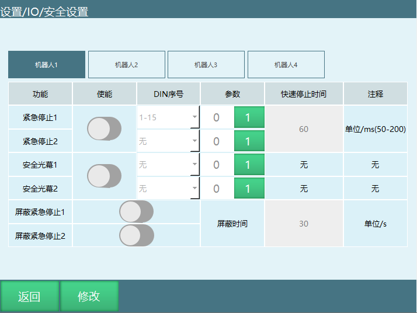

**功能说明：**

| 功能 | 说明 |
|------|------|
| 紧急停止 | 触发紧急停止信号后机器人下电并切至伺服停止 |
| 安全光幕 | 触发安全光幕机器人暂停，再次按下启动按钮可继续运行 |
| 屏蔽紧急停止 | 打开后屏蔽时间内，紧急停止信号被屏蔽 |

---

## 3.1 IO复位

当程序运行停止或报错时，IO复位功能能使IO的输出端口恢复到初始状态。IO复位分为IO复位、切模式停止、程序报错停止三种。

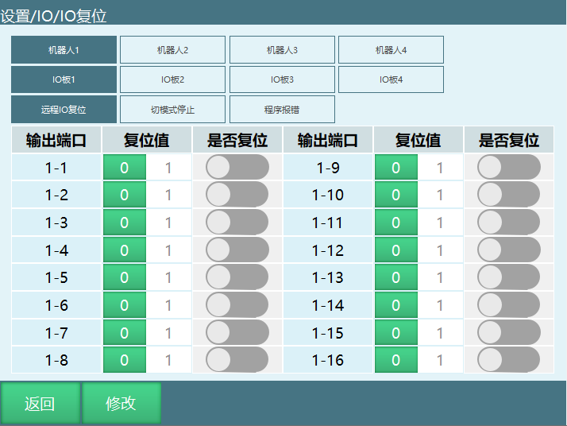

**复位类型说明：**

| 复位类型 | 说明 |
|----------|------|
| 远程IO复位 | 在远程模式时，给复位信号，机器人执行复位程序回到复位点时，会将该界面设置的IO端口复位到复位值。如果复位程序中途停止了，则不会进行IO复位 |
| 切模式停止 | 在运行程序时，切换模式到示教或远程模式导致程序停止，会将该界面设置的IO端口复位到复位值 |
| 程序报错停止 | 程序发生错误导致程序停止，会将该界面设置的IO端口复位到复位值。具体的错误类型：伺服报错、IO设置的报错、系统运行中的报错 |

**使用步骤：**
1. 进入IO复位界面
2. 选择机器人
3. 点击进入复位情景（IO复位、切模式停止、程序报错停止）
4. 选择IO板
5. 打开需要复位的IO端口对应的"是否复位"开关
6. 选择复位值（0/1），0为低电平，1为高电平

---

## 3.2 IO配置

系统会根据硬件连接顺序自动识别IO型号，无需设置；可用于查看IO板数目及型号。

进入【设置】-【IO】-【IO配置】。

此时输入框为灰色且不能输入数值。

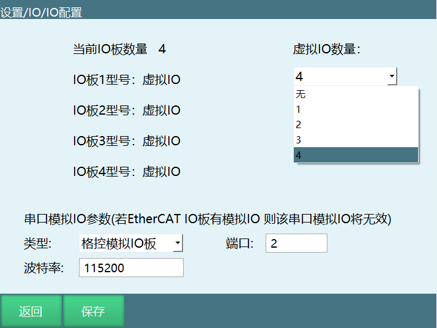

点击修改后，修改按钮变成保存，虚拟IO板数量下拉框选择需要的虚拟IO。

**注：** 虚拟IO仅供程序调试及程序演示使用，并没有任何IO信号接入。

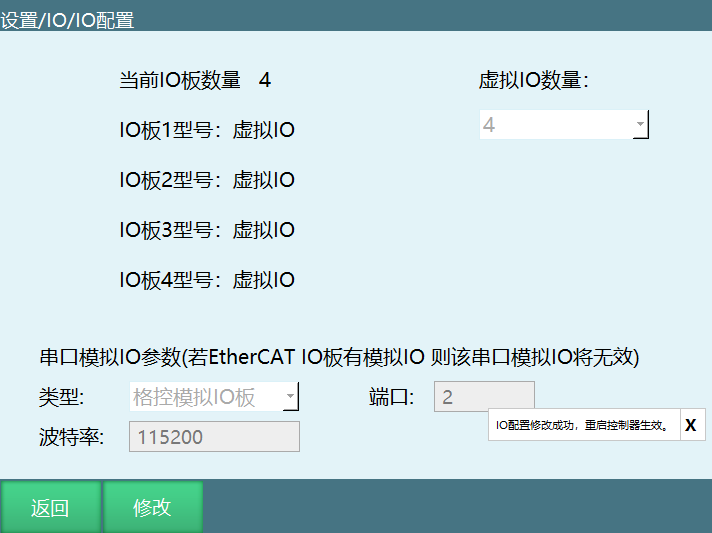

点击保存，重启生效，修改成功。

---

## 3.3 使能IO

如果使用使能硬接线示教盒，需在连接好线缆后，在此页面选择对应的DIN的端口并打开使能开关，上电使能功能则由IO板输入信号控制；非使能硬接线示教盒请勿设置。

打开此功能后，示教盒使能按钮失效，不可使用。

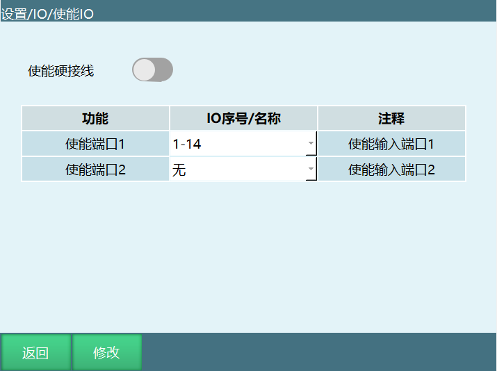

使能端口1为上电使能，使能端口2为下电使能。上电只需要打开使能端口1，在任何情况下，只要使能端口2打开，均会下电。

---

## 3.4 报警消息

此功能可以自定义IO输入输出端口报警内容，报警信息优先级高于其他类型IO报警信息。

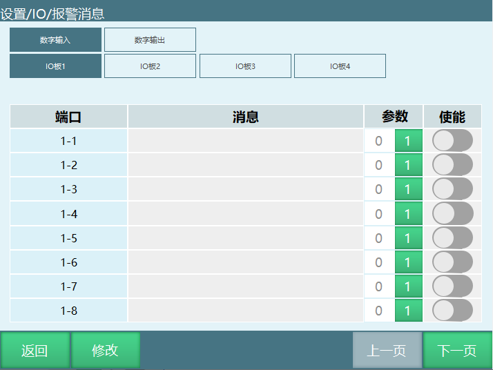

**使用示例：**

设置IO紧急停止信号端口为15用于接防碰撞IO, 1触发、0解除；则触发DIN1会报"机器人1IO紧急停止被触发"；此时在报警消息界面找到DIN1，消息栏输入"触发防碰撞"，则再次触发DIN15时报错"触发防碰撞"，不会在报"机器人1IO紧急停止被触发"。

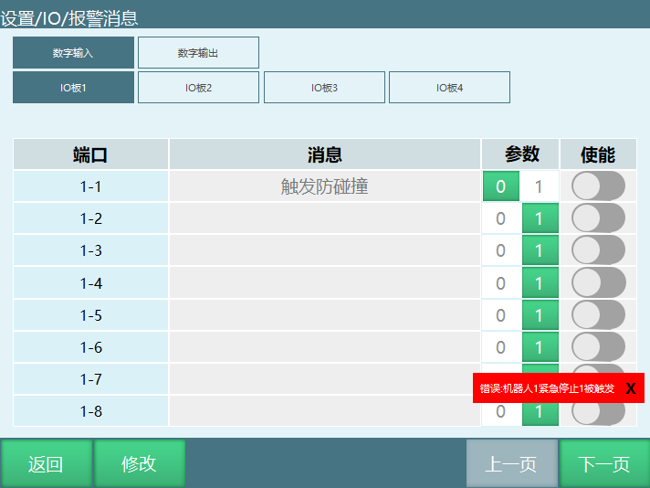

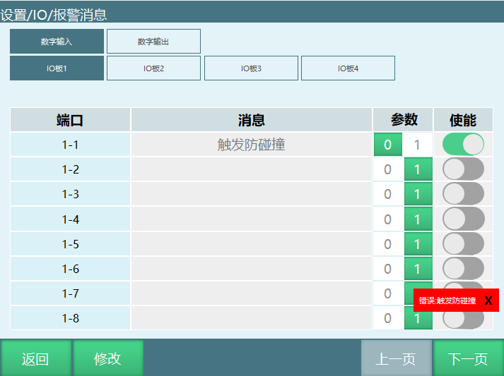

---

## 3.5 端口名称

端口名称最大支持输入5个汉字或者10个英文，设置成功后在使用IO端口相关下拉框选项时会自动显示该名称。

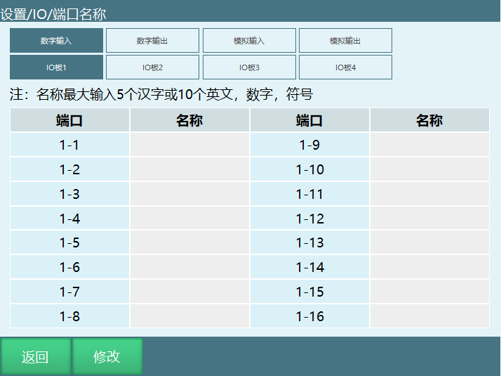

**使用示例：**

如设置DIN1-1 名称为"使能端口"，则在【状态】的【输入输出】中，会显示DIN1名称"使能端口"。


---

# 4 远程模式IO预约简要说明

## 信号说明表

### 数字IO输入

| 功能 | 支持模式 | 触发/输出方式 | 说明 |
|------|----------|---------------|------|
| 启动 | 远程模式 | 上升沿 | 参数为1时，信号0变1时有效 |
| 停止 | 远程模式 | 持续有效 | 参数为1时，信号持续有效 |
| 暂停 | 远程模式 | 持续有效 | 参数为1时，信号持续有效 |
| 清除报警 | 远程模式 | 上升沿 | 参数为1时，信号0变1时有效 |
| 预约即启动 | 远程模式 | 无 | 打开时，预约成功即上电 |
| IO远程程序1-10 | 远程模式 | 脉冲（周期0.6s） | 参数为1时，信号0-1-0时有效，程序预约成功至少需要触发0.6秒以上 |
| 紧急停止1 | 示教、运行、远程 | 高电平 | 1毫秒扫描一次，扫描到即触发 |
| 紧急停止2 | 示教、运行、远程 | 高电平 | - |
| 安全光幕1 | 运行（运行中）、远程（运行中） | 高电平 | - |
| 安全光幕2 | 运行（运行中）、远程（运行中） | 高电平 | - |
| 屏蔽紧急停止1 | 配合紧急停止使用 | - | 按钮打开即屏蔽紧急停止功能，设置时间到后重新检测紧急停止信号 |
| 屏蔽紧急停止2 | 配合紧急停止使用 | - | - |

### 数字IO输出

| 功能 | 支持模式 | 触发/输出方式 | 说明 |
|------|----------|---------------|------|
| 开机提示 | 无模式限制 | 常亮、闪烁，仅在开机输出 | 输出高电平 |
| Robot1运行 | 示教、运行、远程模式 | 常亮、闪烁 | 程序运行时输出高电平 |
| Robot1暂停 | 示教、运行、远程模式 | 常亮、闪烁 | 程序暂停时输出高电平 |
| Robot1停止 | 示教、运行、远程模式 | 常亮、闪烁 | 程序停止时输出高电平 |
| 报错提示 | 无模式限制 | 常亮、闪烁 | 常亮输出高电平，闪烁输出脉冲（周期1s,0.5s亮、0.5s灭） |
| 使能 | 无模式限制 | 常亮、闪烁 | 输出高电平 |
| IO远程程序1-10预约输出 | 远程模式 | 常亮、闪烁 | 未预约/已预约时不亮；预约中时闪烁，周期1.2s，0.6s亮、0.6s灭；运行中时常亮，输出高电平 |
| 紧急停止1 | 信号触发时 | 高电平、低电平、闪烁 | 参数为1时，输出高电平 |
| 紧急停止2 | 信号触发时 | - | - |
| 拔出示教盒 | 无模式限制 | 高电平、低电平、闪烁 | 点击拔出示教盒，输出1或0 |
| 可继续执行 | 信号触发时 | 高电平、低电平、闪烁 | 输出一个高电平参数为1的信号，可运行暂停的程序 |
| 主程序首行 | 示教、运行、远程模式 | 高电平、低电平、闪烁 | 输出一个高电平参数为1的信号，程序光标跳至主程序首行 |

**注：** 本说明均是以输出1为输出高电平为例。

---

## 4.1 远程模式状态说明

**状态分类：**

- **未预约**：进入远程模式后，没有预约过程序，或预约后又取消预约，显示未预约
- **预约中**：预约成功显示预约中
- **运行中**：程序正在运行显示运行中
- **已预约**：程序运行完成或程序被触发停止，显示已预约

**注意：** 远程模式不能修改速度，速度修改需提前在【设置-远程程序设置】中修改。

**预约程序：**
- 触发对应程序的IO口即成功预约程序，取消需再次触发该程序对应的IO口
- 启动直接触发对应触发的IO口即可
- 预约即启动，信号0-1（按下按钮）0.6秒以上时间后1-0（松开按钮），程序直接运行；预约即启动时启动信号可不设置
- 预约的程序运行后可再次预约

**故障排查：**
IO功能设置成功后请前往状态-IO功能状态查看是否设置成功或有无冲突功能。

**复位点设置：**
复位点功能支持关节、直线运动到安全点，或者使用复位程序指令自定义复位轨迹和位置。

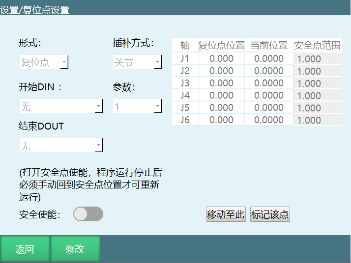

**参数说明：**

| 参数 | 说明 |
|------|------|
| 形式 | 复位点、复位程序 |
| 插补方式 | 关节、直线；关节插补时运动速度为全局速度的10%，直线插补时运动速度为100mm/s；复位程序时运行速度等于指令速度x状态栏速度 |
| 安全使能 | 打开后程序运行会判断机器人是否在复位点（安全点）位置，必须在复位点位置才能继续运行程序 |
| 开始DIN | 复位点触发信号 |
| 参数 | 复位点触发信号0有效或者1有效 |
| 结束DOUT | 回复位点后状态信号输出 |
| 安全点范围 | 每个轴的安全范围误差，范围内被判定为在复位点（安全点） |
| 标记该点 | 将当前机器人坐标设置为复位点，点击确认之后设置成功 |
| 移动至此 | 以关节插补方式运动到复位点 |

---

## 4.2 远程模式控制权说明

当控制系统中同时存在示教器、触摸屏与I/O 控制设备时，其控制权优先级为：**示教器 > 触摸屏 > I/O 控制设备**。

切换到远程模式后控制权切换到触摸屏。若无触摸屏则切换到I/O 控制。此时示教器界面仅显示Modbus 模块与I/O模块连接状态与I/O程序。

同时有触摸屏与I/O模块时，在触摸屏中设置I/O模块使能。

---

## 4.3 远程IO控制

### 4.3.1 远程I/O功能选择设置

在"远程程序设置-远程IO功能"中，可以设置远程IO控制启动、停止、暂停、急停、清除报警等功能所对应的I/O端口与该端口对应的电平，可以设置I/O模块远程控制所运行的程序。

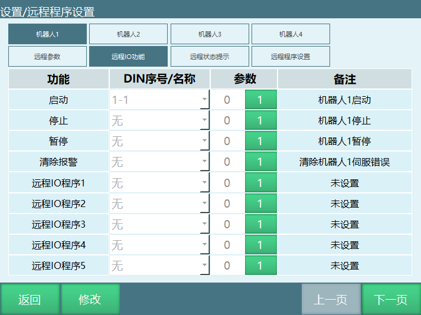

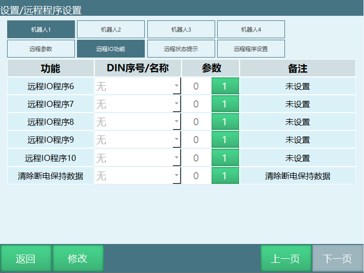

**功能说明：**
- 设置的I/O模块的程序只能选择在"远程程序设置"界面中已设定的程序
- 远程预约程序最多支持10个
- 预约即启动：打开后，第一个预约的程序预约成功后即立刻上电运行，此时可以预约其他程序

---

### 4.3.2 远程程序设置

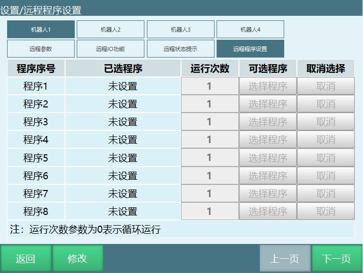

**功能说明：**
- 远程程序设置界面中可以设置触摸屏与I/O控制模块所使用的程序
- 如果有多个机器人，可以在机器人处选择要设置的机器人，并设置该机器人的各程序
- I/O控制模块所使用的程序需在I/O功能界面中设置
- 远程程序界面已选中的程序可点击取消按钮取消
- 运行次数填对应的数字即可，0代表循环运行

---

### 4.3.3 预约模式

在"设置/操作参数"中：

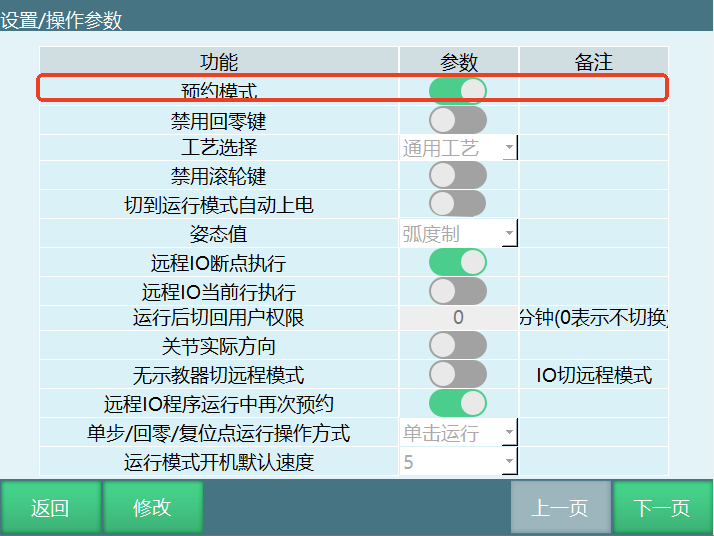

**功能说明：**
- **打开预约模式使能后**：触发远程IO程序信号，程序预约成功，触发启动信号，机器人运行
- **关闭预约模式使能后**：触发远程IO程序信号，机器人直接运行且此时再触发其他远程IO程序信号无效，机器人运行结束后可重新触发远程IO程序信号。无需设置启动信号

---

# 5 远程功能的使用

## 5.1 远程功能概述

设定10个远程程序和每个程序的运行次数，运行前将10个程序排好队列，运行时按照队列的顺序和运行次数运行，队列运行完成后停止等待再次排队。

**远程功能使用步骤：**
编写程序 → 设置远程程序 → 设置IO → 切换到远程模式 → 预约排序 → 运行

### 1. 编写程序

新建程序并插入指令，请确保程序可正常运行。

### 2. 设置远程程序

进入"设置-远程程序设置"界面，设置好程序1-程序10的程序名与运行次数，若想要单个程序无限循环运行，则设置该程序的运行次数为0。

**注意：**
- 这里的程序名指向"工程"界面中的程序，当修改程序内的指令后，远程程序会跟着自动修改，不需重新设置远程程序
- 若修改了程序的程序名，请在远程程序设置界面中重新设置该程序

### 3. 设置IO

在"IO-IO功能"界面中设置各个功能对应的IO端口与有效值，当有效值为1时高电平有效，有效值为0时低电平有效。

**注意：** 其中的程序1-程序10对应的IO端口功能不是选择该程序运行，而是在远程模式中给该程序排队。

### 4. 切换到远程模式

将模式选择钥匙旋转到远程模式位置或点击程序中的模式状态，选择远程模式。

**注意：**
- 当示教器没有连接控制器时，启动控制器自动进入远程模式
- 当控制器同时连接IO、Modbus设备、示教器时，三个设备的优先级为示教器>Modbus设备>IO设备。当切换到远程模式后，以Modbus设备有效，IO设备无效，此时关闭Modbus设备中的使能按钮，则IO有效

### 5. 预约排序

**示例：**

IO功能中的IO功能设置为：
- 运行 - 端口1 有效值1
- 停止 - 端口2 有效值1
- 暂停 - 端口3 有效值1
- 清除错误 - 端口4 有效值1
- 程序1 - 端口5 有效值1
- 程序2 - 端口6 有效值1
- 程序3 - 端口7 有效值1
- 程序4 - 端口8 有效值1
- 程序5 - 端口9 有效值1
- 程序6 - 端口10 有效值1
- 程序7 - 端口11 有效值1
- 程序8 - 端口12 有效值1
- 程序9 - 端口13 有效值1
- 程序10 - 端口14 有效值1

则排序方式为给6号端口一个高电平1秒钟后松开，则程序2排在第一个，给8号端口一个高电平1秒后松开，程序4排在第二个，以此类推。

**注意：**
- 若想要在队列中取消某一程序的排队，则再给对应的IO端口一个1秒的高电平，该程序就会在队列中取消
- 队列中只能有10个程序，同一个程序不能重复排队
- 当一个程序运行中，可以将该程序重新加入队列末尾

### 6. 运行

给有运行功能的端口一个高电平，机器人便开始按照队列中的顺序与运行次数开始运行。运行完成后伺服不下电，此时再将程序加入到队列中，机器人会立刻运行该程序。

当队列中没有程序就使其运行，则机器人上电不运动，此时将程序排入队列中，机器人立刻执行该程序。

### 查看运行情况

远程IO控制查看程序运行详细情况可点击远程模式界面内的"查看程序"按钮，modbus也可以通过此功能查看。

### 运行总数清零

清除当前运行程序的运行总次数，只可以清除运行总数，不能清除运行次数。

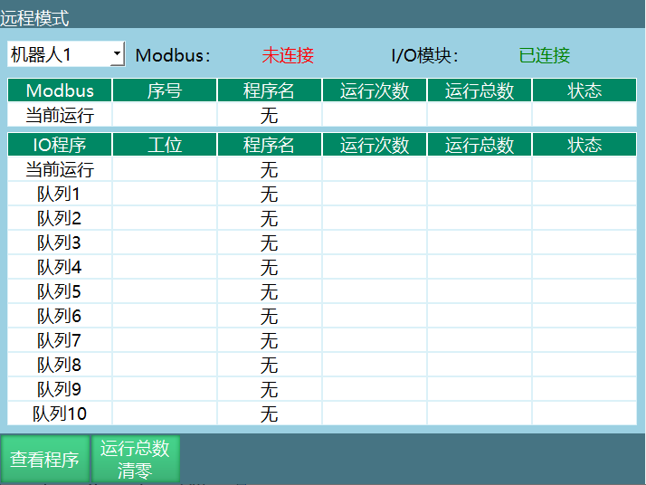

---

# 6 MODBUS

## 6.1 Modbus指令

### 打开Modbus连接

该指令用于在运行模式下打开Modbus通讯连接，工艺号绑定是Modbus主站工艺号。

### 断开Modbus连接

该指令用于在运行模式下断开Modbus通讯连接，工艺号绑定是Modbus主站工艺号。

### 获取Modbus连接状态

该指令将Modbus的连接状态存在bool变量中，通过获取变量的数值来判断Modbus的连接状态，每运行一次该指令就获取一次状态，常放在"打开Modbus连接"下面。

### Modbus读操作

该指令用于读取Modbus中对应位置的地址码，可以设置地址类型有3x、4x-bit、3x-bit、0x。

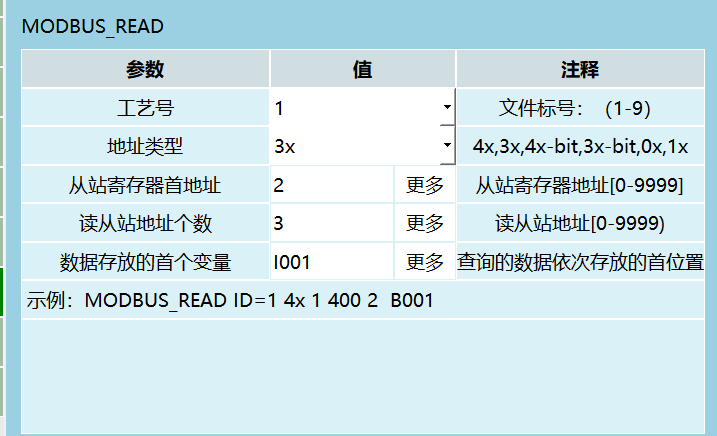

**参数说明：**

| 参数 | 值 | 注释 |
|------|-----|------|
| 工艺号 | 1 | 文件标号:(1-9) |
| 地址类型 | 3x | 4x,3x,4x-bit,3x-bit,0x,1x |
| 从站寄存器首地址 | - | 更多，从站寄存器地址[0-9999] |
| 读从站地址个数 | - | 更多，读从站地址[0-9999) |
| 数据存放的首个变量 | 1001 | 更多，查询的数据依次存放的首位置。示例:MODBUS_READ ID=1 4x1 4002 B001) |

**使用示例：**

地址码2中所存值为555，指令会从首个地址开始读取输入的读取地址个数，依次存入输入的变量中。即从地址2开始读读3个地址码分别存入I001，I002，I003中。

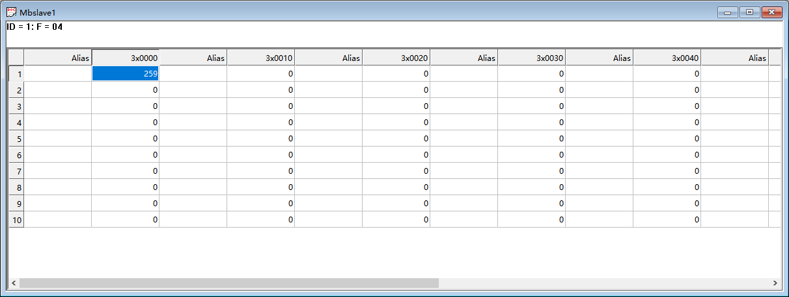

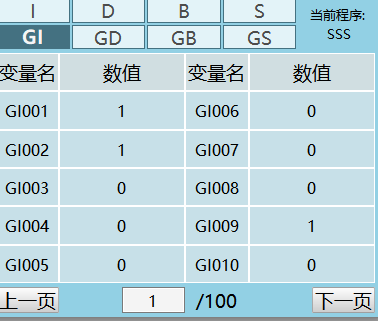

#### 4x地址类型

4x即读取指令里选择的modbus slave中4x地址码所存的值，同3x。

#### 3x-bit地址类型

3x-bit即读取所选地址中所存值得任一bit的状态。

**参数说明：**

| 参数 | 值 | 注释 |
|------|-----|------|
| 工艺号 | 1 | 文件标号:(1-9) |
| 地址类型 | 3x-bit | 4x,3x,4x-bit, 3x-bit, 0x, 1x |
| 从站寄存器首地址 | 1 | 更多，从站寄存器地址[0-9999] |
| 读从站地址个数 | 16 | 更多，读从站地址[0-9999) |
| 数据存放的首个变量 | GI001 | 更多，查询的数据依次存放的首位置。示例:MODBUS_READ ID=1 4x14002 B001) |

**使用示例：**

地址码1中所存值为259，转换成16位原码为0000 0001 0000 0011，则读指令将从指定的变量开始，按从后往前的顺序依次将原码的每个位存入变量中。

即将259转为二进制码后按从右往左的顺序将每个数存入GI001，GI002，GI003....中。

**注意：** 第16位（第16个变量）为符号位0表示正数1表示负数。

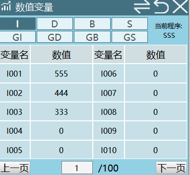

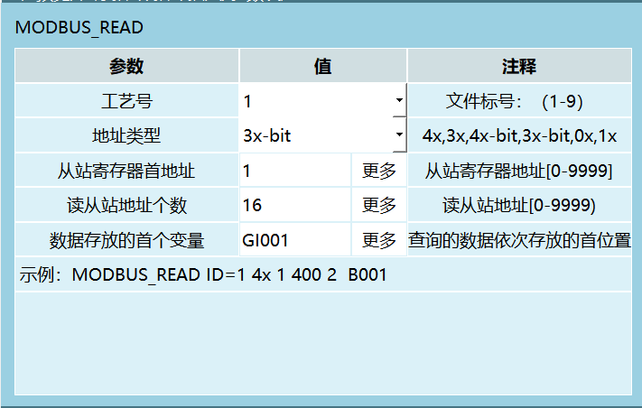


#### 4x-bit地址类型

4x-bit即读取所选地址中所存值得任一bit的状态，同3x-bit。

### Modbus写操作

该指令用于通过modbus将变量写入从站寄存器中对应位置的地址码中。可以设置地址类型有4x、4x-bit、0x，相比读取少了3x、3x-bit。

**参数说明：**

| 参数 | 注释 |
|------|------|
| 工艺号 | 文件标号:(1-9) |
| 地址类型 | 4x、4x-bit、0x |
| 数据存放的首个变量 | 更多，查询的数据依次存放的首位置 |
| 从站寄存器首地址 | 从站寄存器地址(0-9999] |
| 写从站地址个数 | 写从站地址个数[0-123] |
| 示例 | MODBUS WRITE ID=1 4x B001 2 400) |

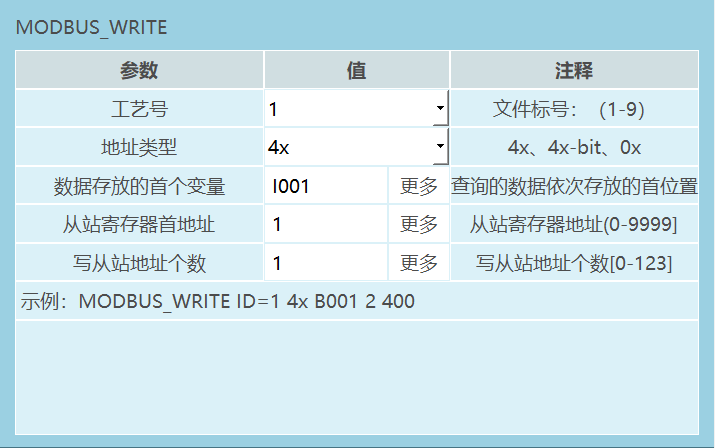

#### 4x地址类型

4x即将变量里的值写入地址码中。

**使用示例：**

I001=555，I002=444，指令将按顺序依次将写入从站地址个数的变量里的值写入输入的开始地址码中。

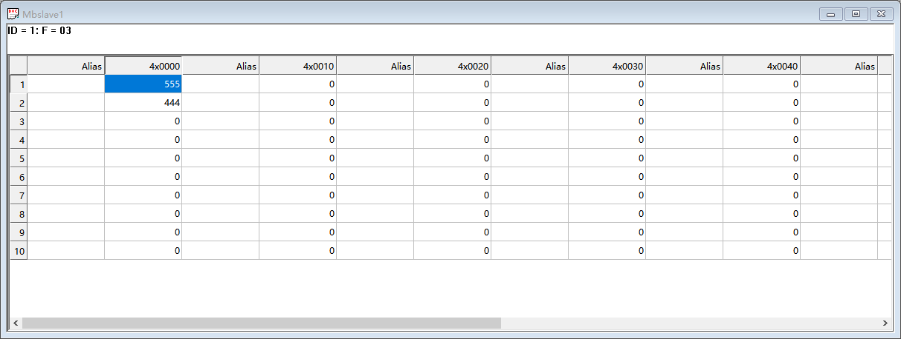

#### 4x-bit地址类型

4x-bit即将变量组成16位二进制码写入地址码中。

**使用示例：**

I001=1，I002=1，I003=0，I004=1，首个变量为I001，寄存器首个地址为1，写入从站地址个数为4。

（转为二进制原码为从右往左依次填入变量，例：1011为I004，I003，I002，I001组成）

即将4个变量内的值组成二进制码1011存入地址1内，modbus显示为十进制数为11。

**注意：** 第16位（第16个变量）为符号位0表示正数1表示负数，变量的值只判断0或1，有值为1，不赋值默认为0。

---

## 6.2 Modbus从站

作为从站的时候可以设置心跳检测，确认跟主站的通讯状态，以及通讯断开时，是否停机。协议可以选择 RTU和TCP，以及其对应的端口设置。

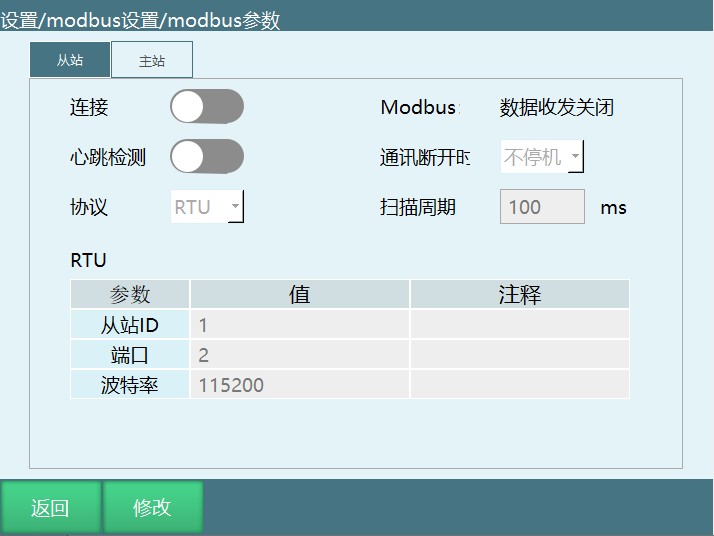

**参数说明：**

| 参数 | 说明 |
|------|------|
| 心跳检测 | 打开之后系统会判断跟modbus之间通讯的状态，关闭则不会监控与modbus之间的通讯连接，一般多用于RTU协议 |
| 通讯断开时 | 停机则在modbus通讯断开时，机器人下电。反之，不停机，在modbus通讯断开时，机器人不下电 |
| 协议 | RTU或者TCP |
| 扫描周期 | 指系统扫描modbus中范围内的数据的频率 |

---

## 6.3 Modbus主站

作为主站的时候只可以选择通讯方式，以及其对应的端口设置。

起始地址可以设置起始地址是从0开始还是1开始。

在主站协议设置为RTU时，需要设置检验位、数据位、停止位。

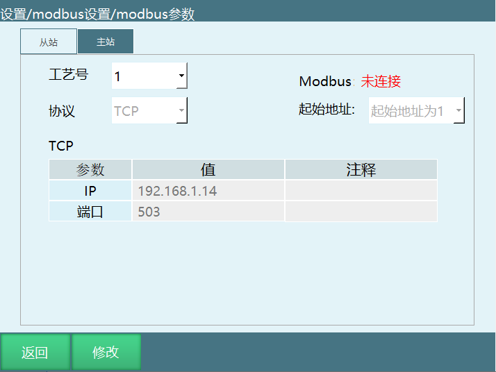

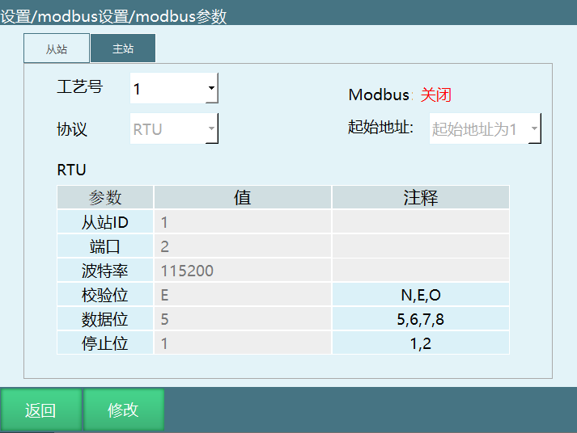

---

## 6.4 Modbus修改地址码

### 步骤说明

1. **插入u盘**，导出控制器配置

2. **找到配置文件**modbusAddr.json，在配置文件configFile+日期文件夹中

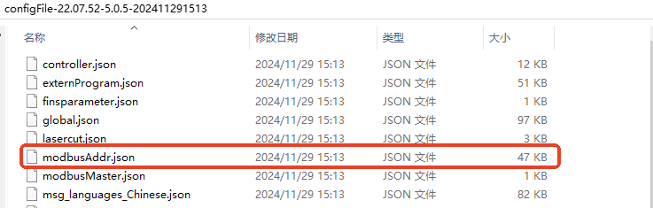

3. **使用Notepad++等文本编辑软件打开**

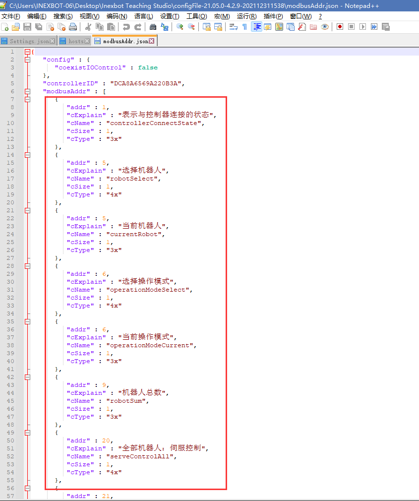

4. **打开后**可以看到一个{ }中包含一组地址码参数（系统会自动生成一份原始地址码）

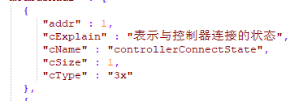

5. **修改地址**直接更改addr后的数字，数字为0时，该地址码功能无效


6. **修改完成后点击保存**

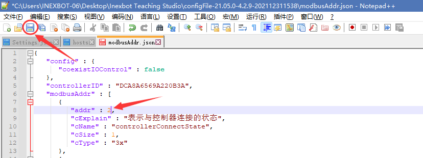

7. **然后把该参数重新导入控制器**，重启生效

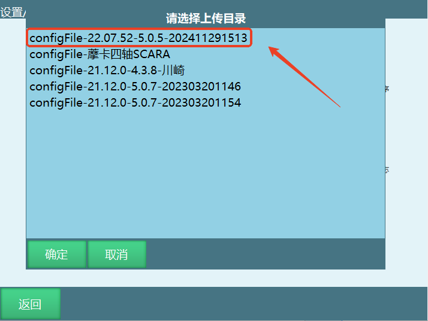

8. **修改参数后重启或者重新打开连接后生效**（导入配置文件会自动重启）


---

## 6.5 Modbus的使用

### 功能概述

Modbus功能可以替代部分示教盒功能，远程控制机器人运行、示教、查看状态等等。

Modbus支持modbusTCP、modbusRTU协议。

Modbus有示教、运行两种模式。地址码可详见《MODBUS地址码列表.xls》。

---

### 6.5.1 Modbus poll连接方式

1. **点开设置/modbus设置/modbus参数**，打开连接开关

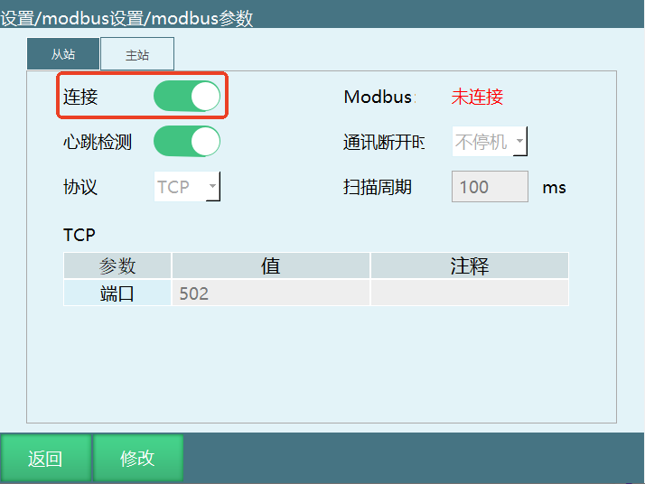

2. **在设置/modbus设置/modbus程序界面**，选择程序

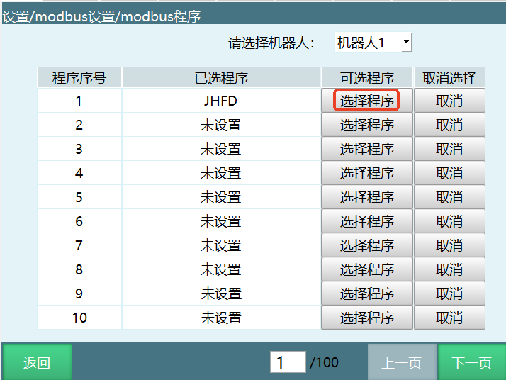

3. **打开ModbusPoll软件**

4. **打开软件后我们需要进行连接及设置** Connection——Concection Setup ，设置好需要的参数（图片填写参数仅为示例），点击ok按钮后，示教器页面显示已连接，如显示已连接和未连接闪烁画面，需要在Setup——Read/Write Definition将Scan Rate参数的1000ms改为100ms

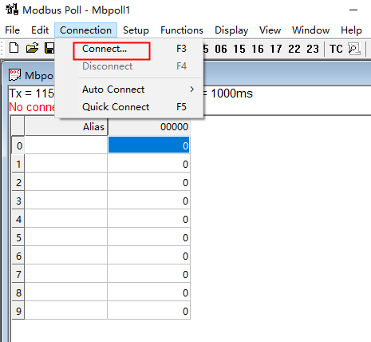

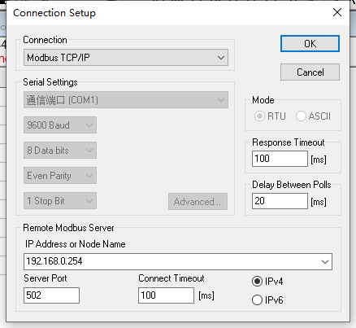

5. **设置Setup→Read/Write Definition参数**（图片填写参数仅作示例）：如遇填写地址码不生效可排查：将起始地址改为1，勾选PLC Addresses选项，点击OK

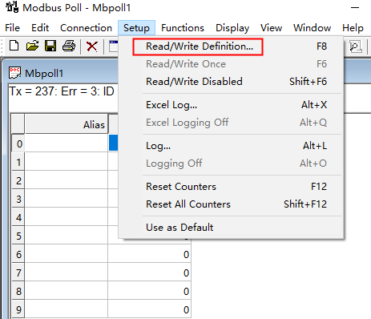

6. **双击寄存器数据**，填写相关地址码

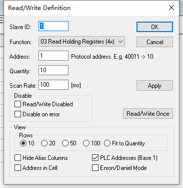

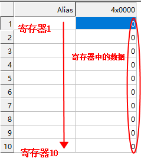

---

### 6.5.2 任何模式下Modbus可读取全局位置

1. **根据Modbus地址2004**选择所需读取的全局类型，0位GP点1位GE点

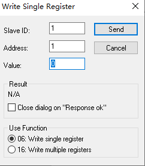

2. **根据Modbus地址2000**选择读取全局点位的编号，编号为1-999

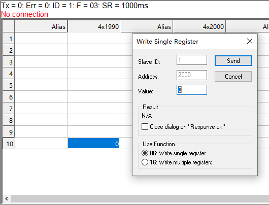

3. **将2017-2028和2031-2036的Format改为FloatCD AB**

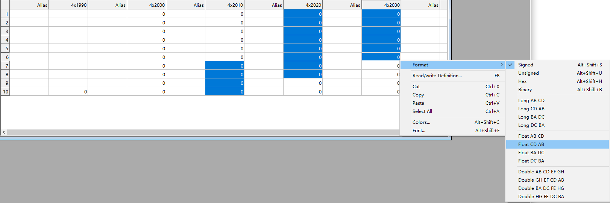

4. **Modbus地址码从2017开始包括2017**，每2个地址码代表机器人一个轴的值，即2017、2018表示1轴

5. **地址码2031-2036表示外部轴**，且仅支持3个外部轴

6. **Modbus连接成功**，通过地址码2000选择全局点编号，2004选择全局点类型后即可在2017查看全局点位

---

### 6.5.3 Modbus多主站连接

1. **将电脑与一个或多个触摸板通过交换机连接到控制器上**

2. **控制器作为从站**，Modbus poll和触摸板作为主站，Modbus poll可以多开作为多个主站，目前最多支持同时连接9个主站

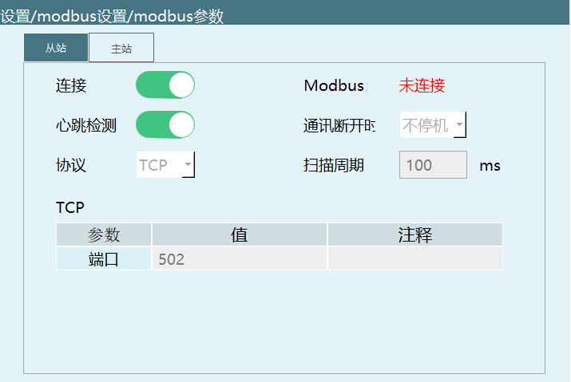

3. **Modbus poll点击connection**，选择connect，连接类型选TCP,IP地址与端口号与示教盒保持一致，扫描周期与示教盒一致

4. **Modbus Poll与触摸板可以同时控制机器人**

---

### 6.5.4 Modbus与IO优先级

1. **通过显示器进入示教器**在robot/config/目录下找到ModbusAddr.json

2. **通过vi编辑器打开ModbusAddr.json**

```json
{
  "coexistIOControl": false,
  "modbusPriorityHigh": false,
  ...
}
```

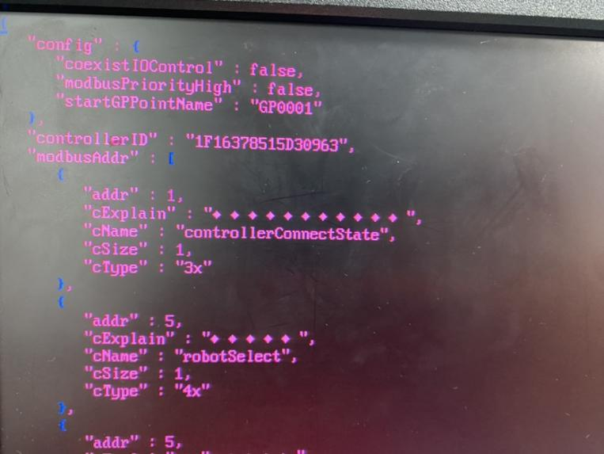

3. **coexistIOControl**：
   - `false` 表示Modbus与IO不共用，即当Modbus连接上时IO不能控制机器人
   - `true` 表示modbus与IO共用，即modbus和IO可以同时控制机器人

   **注意：** 当Modbus与IO共用时，此时调取作业文件调取的是【远程程序设置】中的作业文件，同时【操作参数中-预约模式】必须打开

4. **当coexistIOControl：false时**，modbusPriorityHigh无论false还是true都无影响，modbus默认优先级高且modbus连接上时IO不能控制

5. **当coexistIOControl：true时**：
   - `modbusPriorityHigh：false` 表示 modbus和IO共用且IO优先级高，即modbus和IO可以同时控制机器人且modbus按照IO的设置（示教盒上的设置）运行，例如断点与当前行运行
   - `modbusPriorityHigh：true` 表示 modbus和IO共用且modbus优先级高，即modbus和IO可以同时控制机器人，但modbus和IO各自按自己的设置运行，例如示教盒设置关闭断点执行，modbus地址码19输入0停止再输入3断点启动会断点运行，但IO控制就不能断点运行

---

### 6.5.5 Modbus触摸屏使用流程

本节使用威纶通触摸屏、ModbusTCP协议为例；触摸屏型号为MT6071iP。

**使用步骤：**
编写程序 → 设置Modbus程序 → 设置Modbus参数 → 切换到远程模式 → 触摸屏准备 → 选择程序 → 运行

#### (1) 编写程序

用示教器编写程序，要保证能正常运行。

#### (2) 设置Modbus程序

在"设置-Modbus设置-Modbus程序"中设置好程序，设置成功会已选程序列表会显示该程序名称，共可以设置1000个程序。

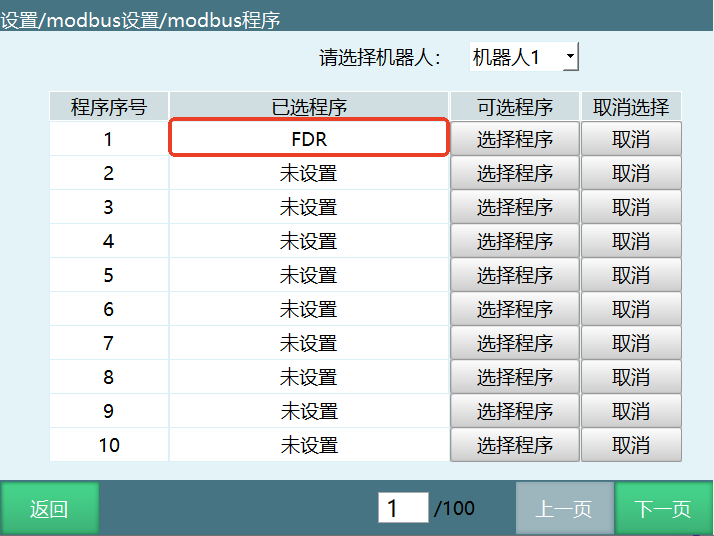

#### (3) 设置Modbus参数

在"设置-Modbus设置-Modbus参数"中设置协议为TCP，控制器作为主/从站设置为从站，IP不修改，端口设置为502，打开连接使能；重启控制器后生效。


#### (4) 切换到远程模式

将模式选择钥匙旋转到远程模式位置或点击程序中的模式状态，选择远程模式。

**注意：** 当控制器同时连接IO、Modbus设备、示教器时，三个设备的优先级为示教器>Modbus设备>IO设备。当切换到远程模式后，以Modbus设备有效，IO设备无效，此时关闭Modbus设备中的使能按钮，则IO有效。

#### (5) 触摸屏准备

将触摸屏RJ45网口、示教器网口、控制器"示教盒"网口连接到同一交换机上。

触摸屏连接控制器IP：192.168.1.13，端口：502。

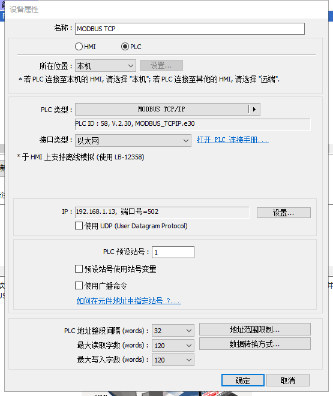

触摸屏程序编辑好后运行，示教盒远程界面modbus未连接变为modbus已连接。

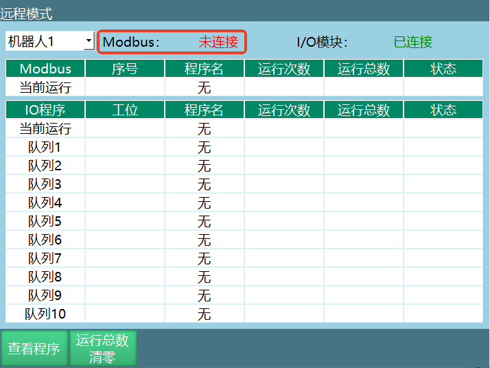

#### (6) 选择程序

使用触摸屏向4x类型地址码45写1，机器人1选中演示程序1。

使用触摸屏向4x类型地址码61写5，机器人1设置运行次数为5（不生效），使用触摸屏向4x类型地址码71写1，确认修改运行次数（运行次数5生效）。

#### (7) 运行

使用触摸屏向4x类型地址码29写1，切至伺服就绪。

使用触摸屏向4x类型地址码19写1，运行作业文件。

---

### 6.5.6 Modbus参数说明

#### 连接
Modbus设置完成需打开连接按钮，右侧可查看连接状态。

#### 心跳检测
打开后用于检测Modbus与控制器之间的收发频率，断开Modbus连接后心跳检测显示数据收发关闭。

#### 协议
分为TCP协议、RTU协议。

#### 主/从站
主站、从站。

#### TCP参数

| 参数 | 说明 |
|------|------|
| IP | Modbus设备IP地址，仅设置为主站时有效 |
| 端口 | Modbus设备端口 |

#### RTU参数

| 参数 | 说明 |
|------|------|
| 从站ID | 默认为1即可 |
| 端口 | 控制器串口号 |
| 波特率 | 填触摸屏对应的波特率 |

