## 前言

本手册主要介绍动力学的作用以及如何使用。

因为机器人的复杂非线性、时变不确定性、强耦合性(特别是在高速运动时)，要使机器人能以期望的速度和加速度运动，机器人各关节伺服电机必须有足够大的力和力矩来驱动机器人的连杆和关节。否则，连杆将因运动迟缓而影响机器人的定位和轨迹跟踪精度，为此必须建立基于动力学模型的前馈力矩控制。从而实时快速地计算前馈补偿力矩。

人机协作（HRC）指的是人和自动化机器共享工作空间并同时进行作业的工作。

---

## 1. 动力学参数

在使用力学功能之前，首先需要设置好动力学参数，使控制器建立机器人的动力学模型。

设置动力学参数需进入"设置/人机协作/动力学参数"。

### > 1.1 辨识
在进入辨识界面前，需要仔细阅读辨识的相关注意事项。机器人进行辨识时最好是范围和速度由小到大，如果有外界因素导致机器人无法到达100的轨迹范围，可以适当的调小关节参数中的正反限位。通过测试运行确定机器人周围没有障碍，能够以100的速度运行就可以开始辨识。辨识过程中最好不要操作示教器，人员需远离机器人。若需要暂停，可以通过点击示教盒上的停止、按下急停按钮来停止机器人。

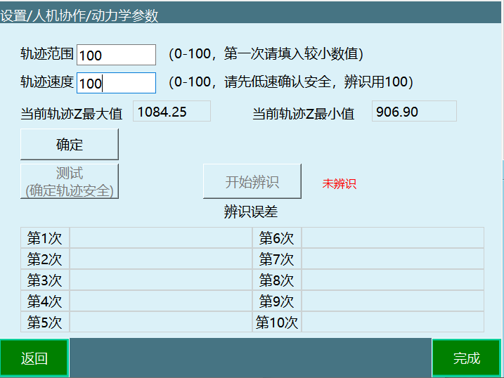

### > 1.2 参数说明

- **轨迹范围**: 根据轨迹范围计算出机器人最大最小运动范围。
- **轨迹速度**: 机器人在运行时的速度，与全局速度无关。
- **当前轨迹Z最大值/当前轨迹Z最小值**: 表示了当前轨迹Z的范围。
- **辨识误差**: 辨识后会出现六个参数分别代表六个轴的误差（值越小说明误差越小且不能为0）。

### > 1.3 使用前必读

| 警告 |
| :--- |
| 目前该辨识方法仅适用于六轴机器人空载情况下辨识机器人本体的动力学参数。  该辨识方法辨识所得的动力学参数与手填的动力学参数无关。  执行辨识前请确保机器人的运动范围内空旷，无障碍物。  辨识轨迹参数中，轨迹范围用于调节机器人的辨识轨迹的范围大小，100为辨识轨迹的100%，90为辨识轨迹的90%，以此类推。轨迹速度用于调节机器人执行辨识轨迹时的速度大小，速度为100时运行轨迹时间为10秒，速度为50时运行轨迹时间为20秒，速度为10时轨迹运行时间为100秒，以此类推。  辨识轨迹参数选取原则：在确保安全的情况下使得运动范围尽可能大，运动速度尽可能快。  辨识结果所得到的误差数值对应于碰撞检测功能中的灵敏度数值。  辨识前应先试用低速大范围轨迹参数，点击测试按钮确认机器人运行过程中不会碰到周围环境，若不满足该条件则减小轨迹范围参数，再次低速运行以确保不会碰到周围环境，确认不会碰到周围环境后再把轨迹速度设置为100，点击辨识按钮开始执行机器人参数辨识。  测试轨迹安全时，机器人会运行两段轨迹，机器人测试结束前请勿靠近机器人。  辨识轨迹时机器人会运行两段轨迹，运行10次，期间不可以靠近机器人，机器人可能随时会启动。  辨识工作共执行十次，包括运行轨迹，获得数据，分析数据，计算动力学参数等过程，并在每一次完成后把误差数值显示在界面上，整个过程会持续30分钟左右，期间请勿进行任何操作以免影响辨识工作。 |

### > 1.4 操作步骤

1. 调整机器人关机参数-关节限位，保证机器人的所有运动都在安全范围内，以下所有的轨迹都会在限位内移动。

2. 将机器人移动到零点位置。

3. 点击【设置-人机协作-动力学参数】，进入动力学参数界面。

4. 仔细阅读提示说明。

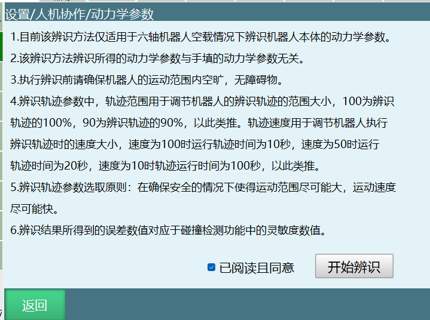

5. 完整的看完提示说明后，点击"已阅读且同意"，点击"开始辨识"。

6. 进入辨识操作界面后，轨迹范围填10，轨迹速度填10。

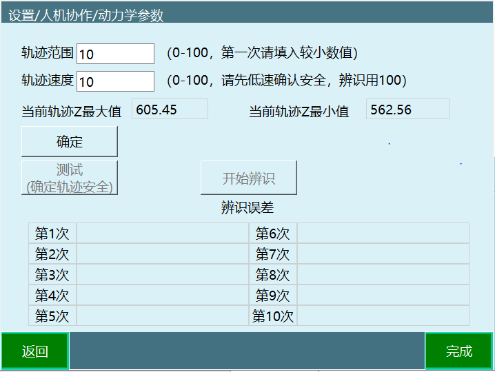

7. 点击"确定"，查看当前轨迹Z最大值、当前轨迹Z最小值，查看范围是否合理，确认轨迹可到达方可操作下一步。

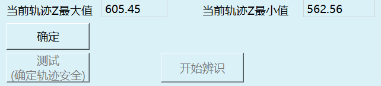

8. 点击"测试（确定轨迹安全）"。

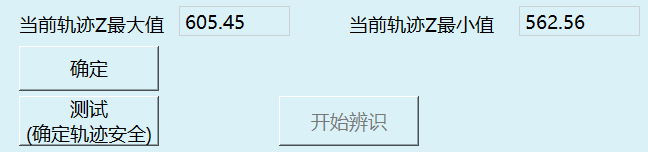

9. 弹出测试提示窗，点击"确认"。

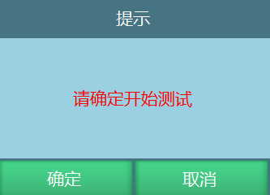

10. 若报错，请先按提示回零点。

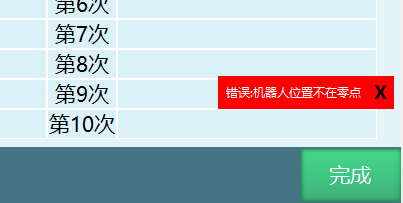

11. 若未报错，会弹窗提示"测试中···"。

机器人运动过程中可按示教器右上方"停止"、切换模式、"按下急停按钮"几种方式使机器人停止运动。

测试完成会提示"测试成功"。

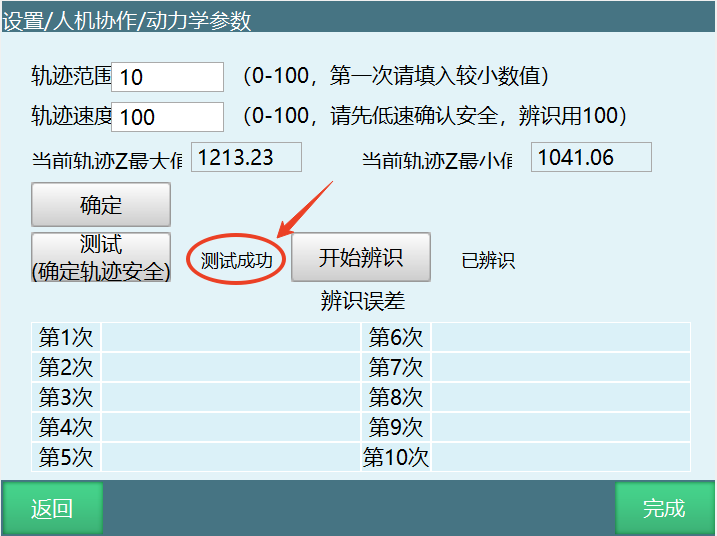

若轨迹范围较小，可调大轨迹范围，原则上轨迹范围越大，辨识的准确性越高。

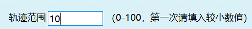

测试时轨迹速度可以慢，辨识时轨迹速度必须设置为100。

在保证安全的基础上使其轨迹范围达到最大，速度调整为100后即可开始辨识。

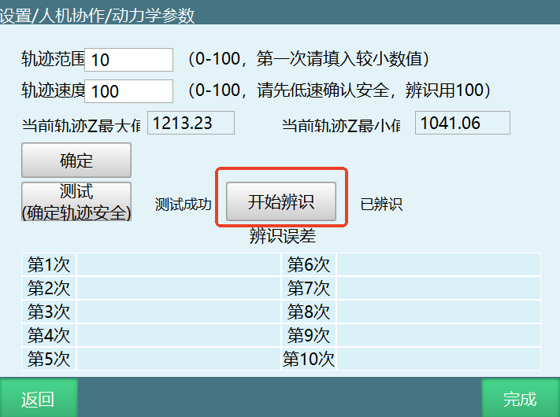

点击"开始辨识"（再次确认轨迹安全，人员远离机器人，点击确认）。

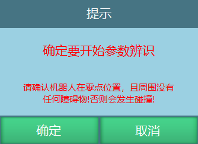

弹窗提示辨识中，在提示辨识结束之前请勿靠近机器人。机器人有可能随时运行下一段轨迹。

---

## 2. 力学功能

力学功能包括碰撞检测、力矩前馈，需要进入"设置/人机协作/力学功能"中进行设置。

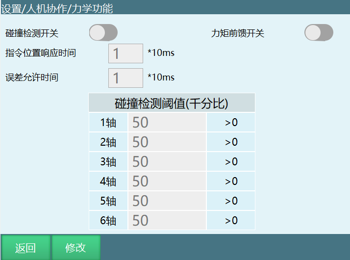

- **碰撞检测开关**: 开启后机器人会根据灵敏度对碰撞进行检测，通常需要找到机器人运行时不会判定发生碰撞的值，然后就可以正常使用。
- **指令位置响应时间**: 本体机器人在运行过程中已经碰触到了，但因为设置了这个时间，所以会因为设置的时间从而延时报错；时间到了，报错出现，机器人下电。
- **误差允许时间**: PID调节导致力矩波动，误触发了碰撞警告，该功能就是防止这种现象出现，在设置的时间内力矩回到正常范围，警报就不会出现。

### > 2.1 拖动示教

拖拽方式可选力矩、3D鼠标。

可设置IO信号切换拖拽模式或点动模式，切换还可使用示教器⚪形按键切换、监控窗口中的"示教方式"按钮。

通过触发外部触发信号可以切换进入拖拽模式（例如信号触发方式为0，必须从1切换为0才生效，以IO信号为主，IO触发后⚪按键不生效）。

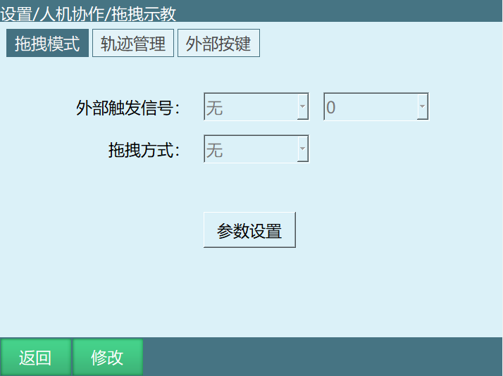

点击修改后选择拖拽方式为3D鼠标。

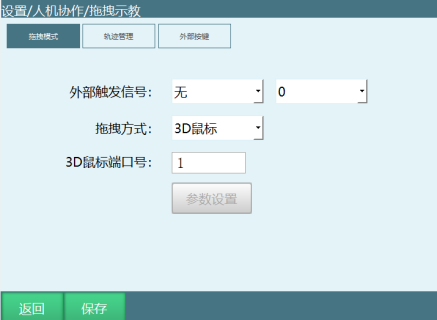

### > 2.2 3D鼠标

#### 2.2.1 配件说明

3D鼠标相关配件：

- TTL转RS232转接头
- 5V电源
- 3D鼠标本体
- 线缆收纳盒
- 3D鼠标固定板

**接线定义**:
- 电源：TX-RX
- 控制器：3D鼠标
- TTL-RS232转接头：COM1-RX-TX

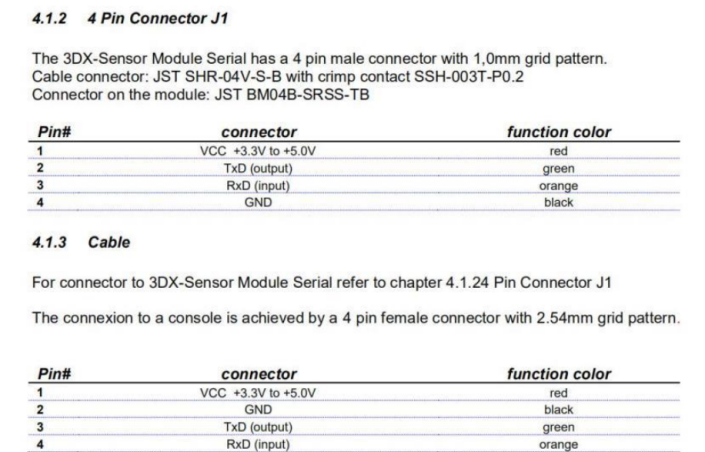

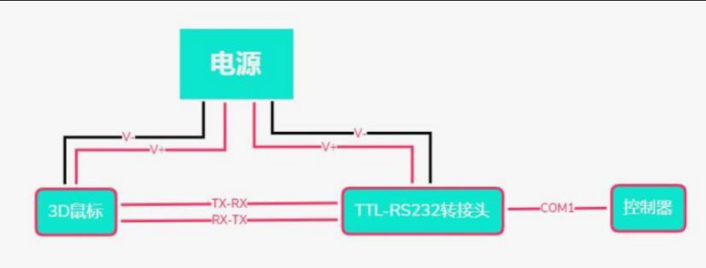

**接线图**: 同上。

**安装**:
3D鼠标的安装部件分为3D鼠标本体，3D鼠标置线盒和固定板。

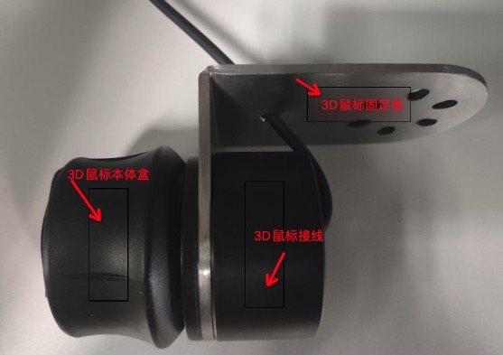

其中3D鼠标置线盒用于收纳部分3D鼠标连接线缆，固定板用于将3D鼠标安装在机器人末端。将3D鼠标的组件按上图所示拼接完成后即可安装于机器人末端。同时，3D鼠标也可以不安装在机器人末端使用，但此时拖动起来的方向感不如装于机器人末端直观。

**供电设备**: 外接5V电源。

**接线设置**: 鼠标转换线插入控制器的Com1串口且Com1串口需要支持RS232通讯即可。

### > 2.3 直接使用

**使用说明及注意事项**:

- **3D鼠标端口号**: 相当于控制器上COM端口，填入多少就选择几号COM口。

**若把3D鼠标安装在机器人本体上，使用前一定要确认机器人运行安全方可进行使用！！！！！**

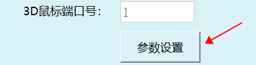

- **标记零点**: 标记3D鼠标零位置，未标记表示没有标记过零点，标记后即显示已标记。 
  用法：点击修改，然后点击标记零点即可完成标记，不需要移动鼠标。

- **标记正方向**: 分为标记X、Y、Z正方向，未标记表示没有标记过方向，标记后即显示已标记。若按下后通讯失败则显示通讯失败，该情况下方向沿用上次标记的方向。 
  用法：点击修改，然后点击标记方向按钮，然后按下鼠标对应方向，提示标记方向成功即完成该方向的标记。

- **姿态控制**: 选择鼠标旋转控制的姿态，可以选择控制姿态A，B，C。 
  用法：点击修改，点击对应姿态按钮即可完成选择。

- **3D鼠标灵敏度**: 用于控制3D鼠标控制对应方向和姿态的灵敏度。 
  用法：点击修改，输入数值，数值范围是0-300，数字越大灵敏度越高。

**首次使用按键顺序**:
1. 点击修改
2. 标记零点
3. 标记XYZ方向
4. 设置灵敏度数值
5. 保存

**3D鼠标控制机器人运动方法**:
1. 完成零点设置和方向标记
2. 通过示教器进行伺服使能
3. 按下3D鼠标对应方向即可控制机器人向该方向运动
4. 3D鼠标支持机器人在各坐标系下的运动，但方向对应只适用于直角坐标系，其他坐标系下为控制关节单独运动，与直角坐标系下的运动方式不同。

**力矩拖拽**: 请注意执行力矩拖拽前请先进行动力学辨识！

### > 2.4 参数说明

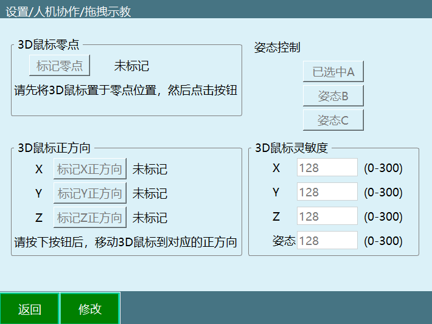

#### 2.4.1 参数设置界面

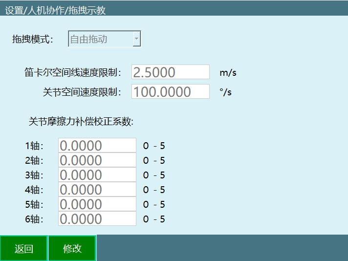

- **拖拽模式**: 可以选择自由拖动、位置拖动、姿态拖动三种模式。
- **笛卡尔空间线速度限制**: 暂时无效。
- **关节空间速度限制**: 拖动时的最大速度，超过限制后会下电停止。
- **关节摩擦力补偿校正系数**: 范围0-5，参数越靠近5关节越灵活；建议参数从0开始测试。

#### 2.4.2 拖拽模式切换

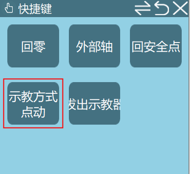

- 使用示教器-监控-快捷键-点动方式按钮进行切换。
- 使用示教器⚪形按键（最左侧、最下面的按钮）进行切换。
- 使用外部信号（DIN输入信号）进行切换。

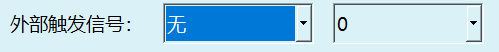

查看示教盒状态栏是否为拖拽模式。

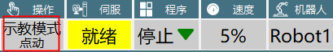

已进入拖拽模式后，上电即可拖拽机器人。

#### 2.4.3 拖动示教轨迹回放

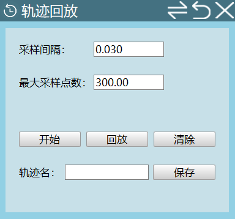

- **采样间隔**: 单位s，每隔一个采样间隔取一次点位。
- **最大采样点数**: 范围200~12000，记录的一段轨迹的最大点位个数。

**操作步骤**:
进入监控-轨迹回放界面。

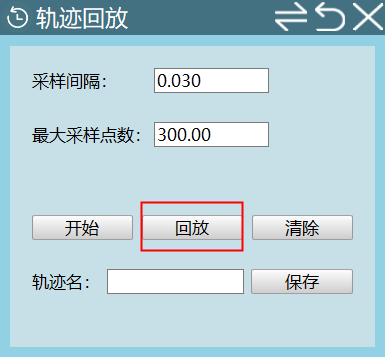

切至拖拽模式，设置采样间隔和最大采样点数。

1. 上电，点击监控弹窗内的开始按钮，开始拖动机器人
2. 点击停止或等待点位记录完成，界面显示轨迹已记录
3. 此时可以下电，切至点动模式，点击回放按钮，可回放刚拖动的轨迹
4. 输入轨迹名，点击保存刚记录的轨迹
5. 清除：清除已记录的轨迹

#### 2.4.4 轨迹管理

进入设置-人机协作-拖拽示教-轨迹管理界面。

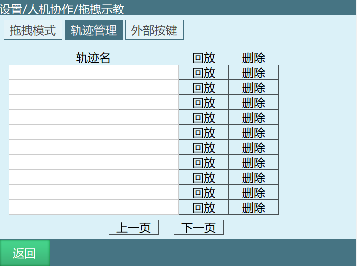

此处可对已保存的轨迹进行回放和删除。

#### 2.4.5 外部按键

在外部按键界面，可以通过设置的触发端口，参数以及方式来控制机器人的拖拽/点动模式，开始/结束轨迹采集，开始/停止轨迹回放，上/下使能等功能。

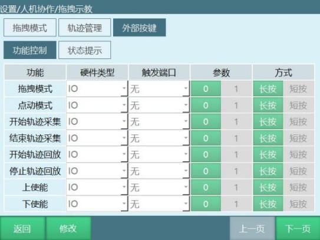

（注：同一类型可使用同一个触发端口，触发信号需为上升沿或下降沿才有效，长按需满足3-10的持续输入）

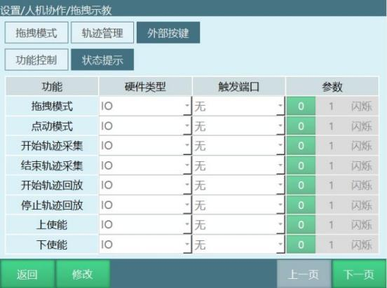

状态提示界面在满足对应功能时，IO会根据设置的触发端口以及参数类型做出对应的反应。

### > 2.5 拖拽示教指令

**DRAG_TRAJECTORY指令**

该指令用于调用轨迹回放记录，回放速率填写100%时，是指当前拖拽时的速度，500%时是指当前拖拽速度的五倍，以此类推。

注：该指令的运行速度为拖拽速度x回放速率，状态栏速度不影响该指令速度。

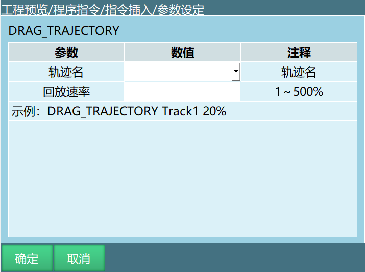

### > 2.6 自适应加减速度

自适应加减速使能开启后可以保护电机，防止电机运动时转矩过大（仅支持四轴Scara机器人）。

设置自适应加减速需进入"设置/人机协作/自适应加减速度"中进行设置。相关步骤如下：

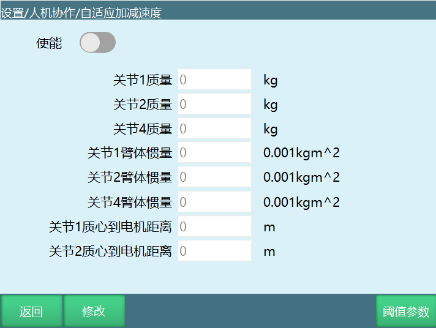

根据自己的需求填写相应的参数，打开使能开关后生效。

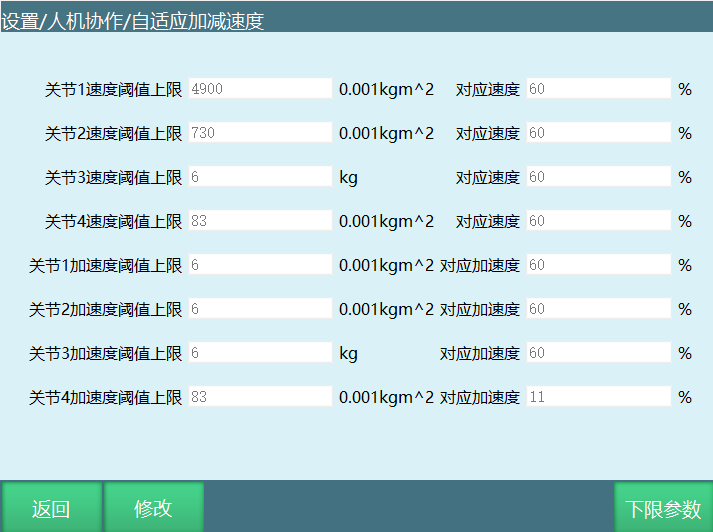

**阈值参数**: 填写速度和加速度上、下限的界面。

### > 2.7 负载拖拽示教流程

1. 根据动力学参数流程进行辨识
2. 辨识成功结束后安装负载
3. 然后在拖拽示教界面设置好参数，拖动方式可选力矩、3D鼠标

切换拖拽模式或点动模式可使用示教器⚪形按键切换、监控"示教方式"按钮以及外部触发IO信号。

| 注释 |
| :--- |
| 使用IO信号切换至拖拽模式后，⚪形按钮和"示教方式"按钮无效。 |

4. 最后再设置负载使能参数，（负载参数分别在工具手界面和负载使能界面设置）打开负载使能开关，保存之后将示教器从点动模式切换成拖拽模式，上电后即可进行拖拽。

**（1）负载使能界面设置如下**: 设置——人机协作——负载使能。

- **负载使能**: 是否启用负载功能，开启负载使能后，系统会根据所选负载编号下的负载参数计算机械臂运行时的带载转矩。

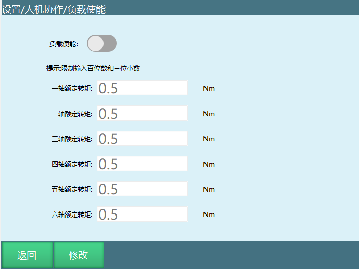
- **额定转矩**: 各个关节电机的额定转矩（可参考伺服参数里面的额定转矩）。

**（2）工具手界面设置如下**: 设置——工具手标定。

- **负载编号（即工具手编号）**: 工具手号就是负载编号。
- **负载质量**: 机器人末梢负载总质量。

- **负载惯量**: 负载的转动惯量。

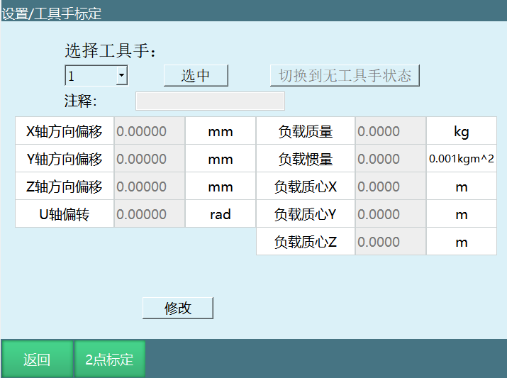

**以下XYZ均以末端坐标系作为参考**（末端坐标系坐标轴确认方法：在无工具手情况下，在工具坐标系下走TX，TY，TZ即可确认XYZ的方向）。

- **X**: 以法兰中心为起点，负载质心沿X方向的偏移（距离）。
- **Y**: 以法兰中心为起点，负载质心沿Y方向的偏移（距离）。
- **Z**: 以法兰中心为起点，负载质心沿Z方向的偏移（距离）。

**XYZ补充说明**: 建议安装负载后，在机器人的零点位置，调整六轴零点，使负载质心在机器人正前方，此时X为负载质心与六轴中心的水平距离，Z为负载质心与六轴中心的竖直距离，Y为0。

| 注释 |
| :--- |
| 以上具体参数可咨询厂商。 |

---

## 3. Q&A 

**Q: 什么是人机协作(HRC)?**

A: 人机协作(HRC)指的是人和自动化机器共享工作空间并同时进行作业的工作方式。

**Q: 动力学参数辨识适用于什么场景?**

A: 目前该辨识方法仅适用于六轴机器人空载情况下辨识机器人本体的动力学参数。

**Q: 动力学参数辨识前需要做什么准备?**

A: 需要调整机器人关机参数中的关节限位，保证机器人的所有运动都在安全范围内；将机器人移动到零点位置；确保机器人的运动范围内空旷，无障碍物。

**Q: 辨识轨迹参数中轨迹范围和轨迹速度是什么意思?**

A: 轨迹范围用于调节机器人的辨识轨迹的范围大小，100为辨识轨迹的100%，90为辨识轨迹的90%，以此类推；轨迹速度用于调节机器人执行辨识轨迹时的速度大小，速度为100时运行轨迹时间为10秒，速度为50时运行轨迹时间为20秒，速度为10时轨迹运行时间为100秒，以此类推。

**Q: 辨识轨迹参数的选取原则是什么?**

A: 在确保安全的情况下使得运动范围尽可能大，运动速度尽可能快。

**Q: 辨识结果得到的误差数值有什么作用?**

A: 辨识结果所得到的误差数值对应于碰撞检测功能中的灵敏度数值。

**Q: 辨识工作需要多长时间?**

A: 辨识工作共执行十次，包括运行轨迹，获得数据，分析数据，计算动力学参数等过程，整个过程会持续30分钟左右。

**Q: 测试轨迹安全时应该怎么做?**

A: 辨识前应先试用低速大范围轨迹参数，点击测试按钮确认机器人运行过程中不会碰到周围环境，若不满足该条件则减小轨迹范围参数，再次低速运行以确保不会碰到周围环境，确认不会碰到周围环境后再把轨迹速度设置为100，点击辨识按钮开始执行机器人参数辨识。测试轨迹安全时，机器人会运行两段轨迹，机器人测试结束前请勿靠近机器人。

**Q: 测试时和辨识时的轨迹速度有什么区别?**

A: 测试时轨迹速度可以慢，辨识时轨迹速度必须设置为100。

**Q: 碰撞检测开关的作用是什么?**

A: 开启后机器人会根据灵敏度对碰撞进行检测，通常需要找到机器人运行时不会判定发生碰撞的值，然后就可以正常使用。

**Q: 指令位置响应时间的作用是什么?**

A: 本体机器人在运行过程中已经碰触到了，但因为设置了这个时间，所以会因为设置的时间从而延时报错；时间到了，报错出现，机器人下电。

**Q: 误差允许时间的作用是什么?**

A: PID调节导致力矩波动，误触发了碰撞警告，该功能就是防止这种现象出现，在设置的时间内力矩回到正常范围，警报就不会出现。

**Q: 拖动示教支持哪些拖拽方式?**

A: 拖拽方式可选力矩、3D鼠标。

**Q: 如何切换拖拽模式或点动模式?**

A: 可设置IO信号切换拖拽模式或点动模式，切换还可使用示教器⚪形按键切换、监控窗口中的"示教方式"按钮。

**Q: 外部触发信号如何生效?**

A: 通过触发外部触发信号可以切换进入拖拽模式（例如信号触发方式为0，必须从1切换为0才生效，以IO信号为主，IO触发后⚪按键不生效）。

**Q: 3D鼠标有哪些配件?**

A: 3D鼠标相关配件包括：TTL转RS232转接头、5V电源、3D鼠标本体、线缆收纳盒、3D鼠标固定板。

**Q: 3D鼠标应该如何接线?**
A: 鼠标转换线插入控制器的Com1串口且Com1串口需要支持RS232通讯即可。

**Q: 3D鼠标首次使用的按键顺序是什么?**

A: 1.点击修改；2.标记零点；3.标记XYZ方向；4.设置灵敏度数值；5.保存。

**Q: 3D鼠标如何控制机器人运动?**

A: 1.完成零点设置和方向标记；2.通过示教器进行伺服使能；3.按下3D鼠标对应方向即可控制机器人向该方向运动；4.3D鼠标支持机器人在各坐标系下的运动，但方向对应只适用于直角坐标系，其他坐标系下为控制关节单独运动，与直角坐标系下的运动方式不同。

**Q: 什么是力矩拖拽?**

A: 力矩拖拽是拖动示教的一种方式，使用前请先进行动力学辨识。

**Q: 拖拽模式有哪几种?**

A: 拖拽模式可以选择自由拖动、位置拖动、姿态拖动三种模式。

**Q: 关节摩擦力补偿校正系数的范围是什么?**

A: 范围0-5，参数越靠近5关节越灵活；建议参数从0开始测试。

**Q: 使用IO信号切换至拖拽模式后，其他切换方式是否有效?**

A: 使用IO信号切换至拖拽模式后，⚪形按钮和"示教方式"按钮无效。

**Q: 轨迹回放的采样间隔是什么意思?**

A: 单位s，每隔一个采样间隔取一次点位。

**Q: 轨迹回放的最大采样点数范围是多少?**

A: 范围200~12000，记录的一段轨迹的最大点位个数。

**Q: 如何进行拖动示教轨迹回放?**

A: 进入监控-轨迹回放界面，切至拖拽模式，设置采样间隔和最大采样点数，然后上电点击监控弹窗内的开始按钮开始拖动机器人，点击停止或等待点位记录完成后，可以下电切至点动模式，点击回放按钮回放刚拖动的轨迹，也可以输入轨迹名点击保存刚记录的轨迹。

**Q: 外部按键可以控制哪些功能?**

A: 可以控制机器人的拖拽/点动模式，开始/结束轨迹采集，开始/停止轨迹回放，上/下使能等功能。

**Q: DRAG_TRAJECTORY指令的作用是什么?**

A: 该指令用于调用轨迹回放记录，回放速率填写100%时，是指当前拖拽时的速度，500%时是指当前拖拽速度的五倍，以此类推。该指令的运行速度为拖拽速度x回放速率，状态栏速度不影响该指令速度。

**Q: 自适应加减速度功能适用于什么机器人?**

A: 自适应加减速使能开启后可以保护电机，防止电机运动时转矩过大（仅支持四轴Scara机器人）。

**Q: 负载拖拽示教流程是什么?**

A: 1.根据动力学参数流程进行辨识；2.辨识成功结束后安装负载；3.然后在拖拽示教界面设置好参数，拖动方式可选力矩、3D鼠标；4.最后再设置负载使能参数，（负载参数分别在工具手界面和负载使能界面设置）打开负载使能开关，保存之后将示教器从点动模式切换成拖拽模式，上电后即可进行拖拽。

**Q: 负载使能参数中负载使能的作用是什么?**

A: 是否启用负载功能，开启负载使能后，系统会根据所选负载编号下的负载参数计算机械臂运行时的带载转矩。

**Q: 工具手标定界面中需要设置哪些负载参数?**

A: 负载编号（即工具手编号）、负载质量（机器人末梢负载总质量）、负载惯量（负载的转动惯量），以及负载质心相对于法兰中心在X、Y、Z方向的偏移距离。

**Q: 负载质心的XYZ参数是如何定义的?**

A: 以下XYZ均以末端坐标系作为参考。X：以法兰中心为起点，负载质心沿X方向的偏移（距离）；Y：以法兰中心为起点，负载质心沿Y方向的偏移（距离）；Z：以法兰中心为起点，负载质心沿Z方向的偏移（距离）。

**Q: 建议如何确定负载质心的XYZ参数?**

A: 建议安装负载后，在机器人的零点位置，调整六轴零点，使负载质心在机器人正前方，此时X为负载质心与六轴中心的水平距离，Z为负载质心与六轴中心的竖直距离，Y为0。

**Q: 如果不知道具体的负载参数应该怎么办?**

A: 以上具体参数可咨询厂商。
