- **文档类型**: 冲压工艺手册 (Technical Manual)
- **适用产品**: 2207冲压机器人系统
- **核心定位**: 冲压工艺机器人操作与参数设置完整指南
- **关键标签**: #冲压自动化 #机器人示教 #IO配置 #参数设置 #故障处理 #工艺编程
- **适用场景**: 操作员培训、技术参数配置、程序开发、故障排除、系统维护


## 1. 主界面概述 (Main Interface Overview)

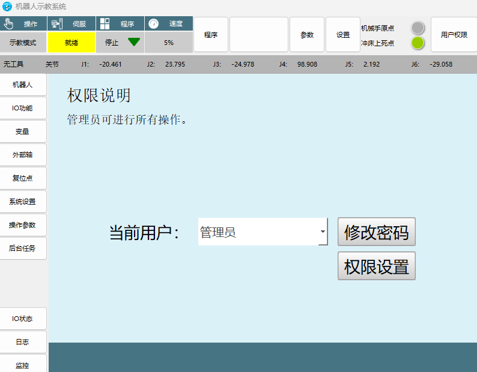

### 1.1 顶部菜单功能介绍
> **摘要**: 系统顶部菜单的主要功能和切换操作。

**核心功能菜单:**

| 菜单名称 | 主要功能 | 详细说明 |
| :--- | :--- | :--- |
| **参数** | 冲压工艺参数设置 | 主要用于冲压工艺的各项参数配置 |
| **设置** | 机器人基本参数设置 | 机器人的基本参数设置以及系统参数设置 |
| **用户权限** | 登录界面 | 切换使用者的操作权限，管理员可进行所有操作 |

**监控状态显示:**
- **机械手原点**: 监控机器人是否在零点位置
- **冲床上死点**: 监控所连接冲床是否处于上死点状态

### 1.2 左/左上侧菜单功能介绍
> **摘要**: 左侧菜单区域的各项功能模块说明。

**核心功能模块:**

| 功能模块 | 用途说明 | 操作注意 |
| :--- | :--- | :--- |
| **程序目录** | 选择运行程序 | 选择程序后空白框显示程序名称 |
| **IO状态** | 查看IO运行状态 | 查看IO设置中各项的当前运行状态 |
| **日志** | 系统日志查看 | 查看系统记录的各项日志、报错等 |
| **监控** | 系统监控控制台 | 监控机器人各项参数及功能快捷键 |
| **示教模式** | 运行模式切换 | 切换运行模式和示教模式 |
| **伺服就绪** | 伺服状态监控 | 停止显示"伺服停止"，运行中显示"伺服就绪" |
| **程序停止** | 程序运行状态监控 | 监控程序运行状态 |
| **速度-50%** | 全局速度调整 | 调整机器人点动速度、程序运行速度 |
| **后台任务** | 多线程任务处理 | 开启多线程任务，处理逻辑信号 |

**特别注意事项:**
- 日志功能：出现问题时日志会变红，请务必第一时间导出日志
- 速度调整：该速度为全局速度，影响点动和程序运行
- 后台任务：主要用于多线程任务和逻辑信号处理

---

## 2. 参数设置板块 (Parameter Settings)

### 2.1 通讯参数 (Communication Parameters)
> **摘要**: 机器人联机模式的设置和网络连接配置。
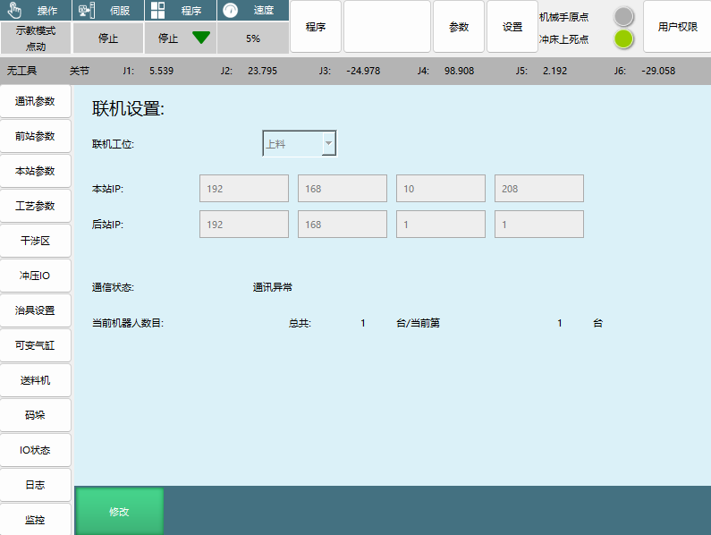

**联机模式类型:**

| 模式名称 | 适用位置 | 功能特点 | 注意事项 |
| :--- | :--- | :--- | :--- |
| **单机** | 独立运行 | 脱离上下站连线信号控制，独立运行 | 目前该功能尚未完善 |
| **上料** | 生产线起始站 | 不跟前站产生通讯，只跟后站交互信号 | 自动搜寻下一站，不满足条件会报连线异常 |
| **搬运** | 生产线中间站 | 前站为上料机或搬运机，后站为搬运机或下料机 | 前后站不满足设定会报连线异常 |
| **下料** | 生产线末端 | 前站为上料机或搬运机，具有自检测功能 | 连线最末端位置 |

**网络参数设置:**
- **本站IP**: 控制器IP，本站自动读取
- **后站IP**: 如有后站，输入后站控制器IP
- **通讯状态**: 实时刷新显示连接是否正常
- **当前机器人数目**: 显示总台数和当前台数

### 2.2 前站参数 (Front Station Parameters)
> **摘要**: 前站相关信号和冲床参数设置。
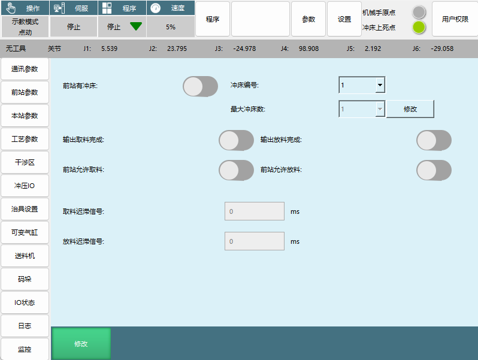

**信号交互参数:**

| 参数名称 | 信号类型 | 功能说明 |
| :--- | :--- | :--- |
| **输出取料完成** | 输入信号 | 接收本站输出取料完成信号 |
| **输出放料完成** | 输入信号 | 接收本站输出放料完成信号 |
| **前站允许取料** | 输出信号 | 输出本站允许取料信号 |
| **前站允许放料** | 输出信号 | 输出本站允许放料信号 |
| **取料迟滞信号** | 延迟设置 | 到达取料待机点后延迟取料时间(单位：ms) |
| **放料迟滞信号** | 延迟设置 | 到达放料待机点后延迟放料时间(单位：ms) |

**前站冲床设置:**
- **前站有冲床**: 在首台机之前有冲床时需要打开并设置参数
- **冲床编号**: 一个冲床编号对应一个冲床参数
- **最大冲床数**: 冲床个数设置

**冲床详细参数界面:**
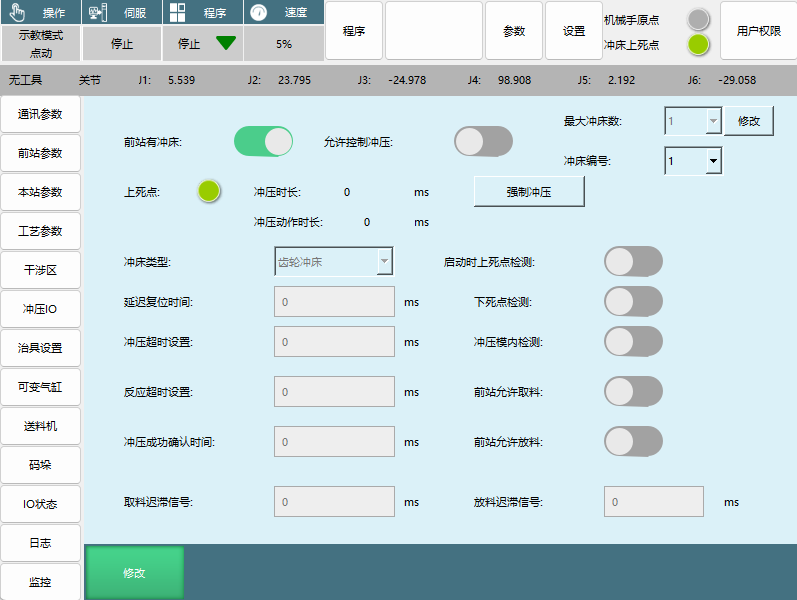

| 参数名称 | 功能说明 | 设置要点 |
| :--- | :--- | :--- |
| **允许控制冲压** | 开启后可通过IO信号控制前站冲床 | 必须开启才能进行下方参数设置 |
| **最大冲床数、冲床编号** | 前站有多个冲床时的参数设置 | 每个冲床独立编号设置 |
| **上死点** | 冲床在上死点时信号接到IO输入上死点就会点亮 | 无设置上死点IO时默认为冲床在上死点 |
| **冲压时长** | 开始给冲压使能到上死点消失再重新亮起的时间 | 时间单位：毫秒 |
| **冲压动作时长** | 冲床上死点信号消失到重新亮起的时间 | 时间单位：毫秒 |
| **强制冲压** | 点击强制冲压会弹出操作窗口 | 紧急情况下的强制操作 |
| **冲床类型** | 设置冲床类型 | 可选：齿轮、气动、油压、自定义 |
| **启动时上死点检测** | 启动时判断冲床是否在上死点 | 安全检测功能 |
| **下死点检测** | 打开冲床的下死点检测 | 安全监控功能 |
| **延迟复位时间** | 冲床延迟复位时间 | 时间单位：毫秒 |
| **冲压超时设置** | 发出冲压信号后冲床从上死点到下死点再回到上死点的时间 | 超时时间单位：毫秒 |
| **冲压模内检测** | 冲压前检测料片位置信号，防止冲坏模具 | 一般为光栅戒或者感应器 |
| **反应超时设置** | 发送冲压信号到上死点消失的时间 | 超时会报警并发送急停冲床信号 |
| **冲压成功确认时间** | 防止上死点信号闪烁导致误认为冲压成功 | 上死点复位时间大于该时间才记为一次冲压 |
| **前站允许取料/放料** | 开启后必须满足信号条件才能正常运行 | 安全联锁条件 |

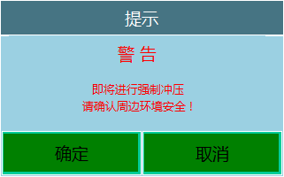

### 2.3 本站参数 (Local Station Parameters)
> **摘要**: 本站设备类型和信号延迟设置。

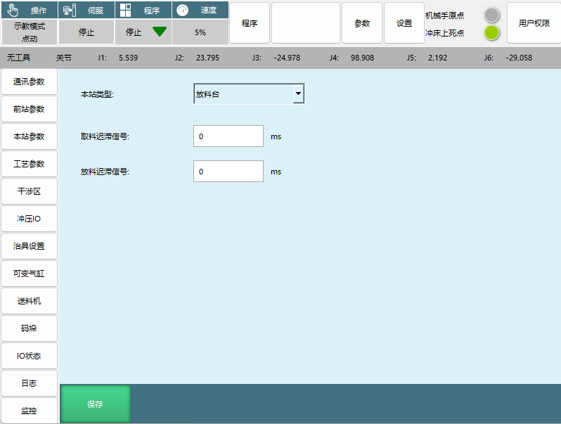

**本站类型选项:**

| 本站类型 | 适用位置 | 功能特点 |
| :--- | :--- | :--- |
| **放料台** | 末台机 | 只能用于末台机放料 |
| **冲床** | 首台机和中间机 | 连接冲床，进行冲压作业 |
| **翻转台** | 首台机和中间机 | 连接翻转台，实现工件翻转 |
| **空中接力** | 首台机和中间机 | 无翻转台情况下，用外部轴或变位机实现工件翻转 |

**信号延迟设置:**
- **取料迟滞信号**: 到达取料待机点后延迟取料时间(单位：ms)
- **放料迟滞信号**: 到达放料待机点后延迟放料时间(单位：ms)

### 2.4 工艺参数 (Process Parameters)
> **摘要**: 工艺程序参数管理和运动控制设置。

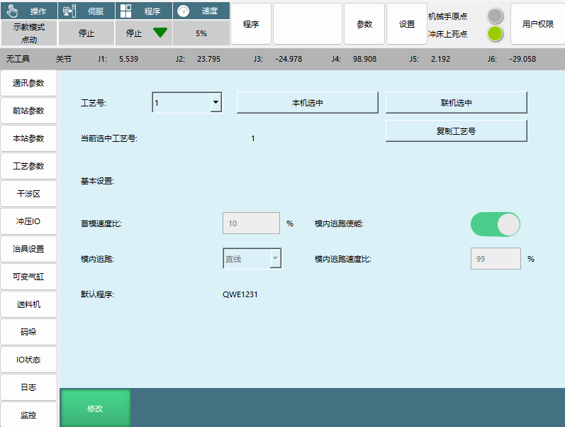


**工艺程序管理:**

| 参数名称 | 功能说明 | 使用场景 |
| :--- | :--- | :--- |
| **工艺号** | 保存不同用户的参数 | 多用户或多工艺场景 |
| **联机选中** | 将参数设置应用到其他站 | 批量参数设置 |
| **复制工艺号** | 将选中工艺号的参数复制到所需工艺号 | 参数快速复制 |
| **默认程序** | 当前选择程序，顶部方框中显示的程序 | 运行程序设置 |

**运动控制参数:**

| 参数名称 | 功能说明 | 设置范围 |
| :--- | :--- | :--- |
| **首模速度比** | 首模的全局速度的百分比速度 | 最大100% |
| **模内逃跑使能** | 模内逃跑功能开关 | 开启/关闭 |
| **模内逃跑** | 运动方式选择 | 关节或直角运动方式 |
| **模内逃跑速度比** | 模内逃跑时的速度 | 默认99%最大速度 |

**模内逃跑机制说明:**
模内逃跑分为两个阶段：
1. **第一阶段**: 机器人从取料/放料待机点前往取料/放料点，该阶段模内逃跑是沿从取料/放料待机点前往取料/放料点的轨迹反向运行回到取料/放料待机点
2. **第二阶段**: 从取料/放料点返回取/放料待机点，该阶段模内逃跑是以最短路径直接返回取/放待机点

### 2.5 干涉区 (Interference Zone)
> **摘要**: 机器人干涉区域的设置和标定。

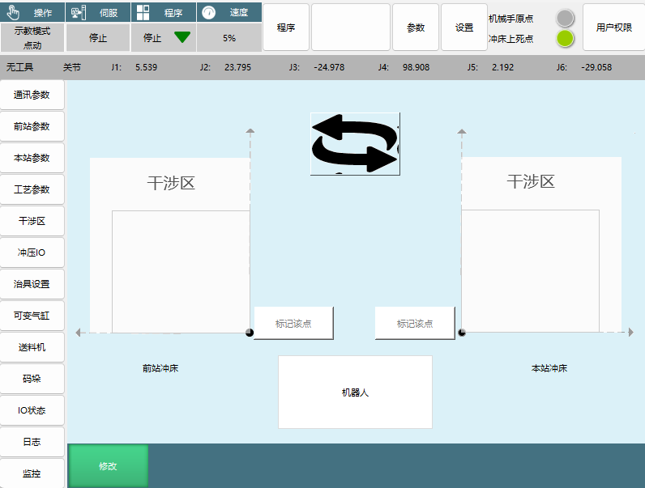

**干涉区设置要点:**
- **坐标系参照**: 机器人的原点的X、Y方向
- **标定方法**: 只需标记干涉区原点坐标即可完成标定
- **功能用途**: 用于切换前后站的位置，根据实际产线的方向自行调整

**干涉区选项:**
- 前站冲床
- 本站冲床  
- 机器人

### 2.6 冲压IO (Punch IO Configuration)
> **摘要**: 冲压相关输入输出IO信号的配置。

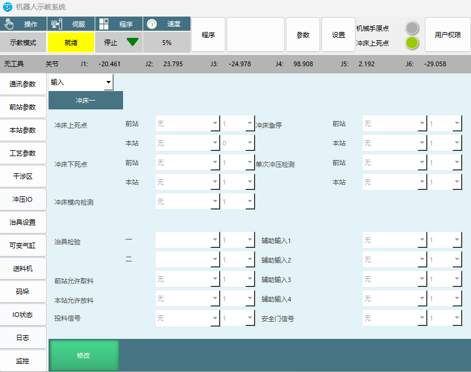

**输入信号配置:**

| 信号名称 | 功能说明 | 安全作用 |
| :--- | :--- | :--- |
| **冲床急停** | 冲床急停信号 | 紧急停止 |
| **冲床上死点** | 前站/本站冲床上死点信号 | 冲床位置检测 |
| **单次冲压检测** | 单次冲压动作检测 | 过程监控 |
| **冲床下死点** | 前站/本站冲床下死点信号 | 冲床位置检测 |
| **冲床模内检测** | 冲床模内传感器检测 | 模具保护 |
| **治具检验** | 治具状态检验信号 | 治具状态确认 |
| **前站允许取料** | 前站允许取料信号 | 工序协调 |
| **本站允许放料** | 本站允许放料信号 | 工序协调 |
| **投料信号** | 投料机投料信号 | 物料供应 |
| **安全门信号** | 安全门状态信号 | 安全保护 |

**输出信号配置:**

| 信号名称 | 功能说明 | 控制对象 |
| :--- | :--- | :--- |
| **冲压信号** | 冲压动作控制信号 | 冲床控制 |
| **急停冲床** | 冲床急停控制信号 | 冲床紧急停止 |
| **治具状态** | 治具状态输出信号 | 治具状态反馈 |
| **前站干涉区输出** | 前站干涉区状态输出 | 干涉区监控 |
| **本站干涉区输出** | 本站干涉区状态输出 | 干涉区监控 |
| **翻转台取料成功** | 翻转台取料成功信号 | 翻转台控制 |
| **翻转台放料成功** | 翻转台放料成功信号 | 翻转台控制 |
| **治具辅助选择一/二** | 治具辅助控制信号 | 治具辅助功能 |
| **请求投料** | 向投料机请求投料信号 | 投料机控制 |

**特别注意事项:**
- **安全门信号**: 安全门信号触发后，整条产线暂停
- **选项切换**: 顶部选项下拉可切换输入/输出配置界面

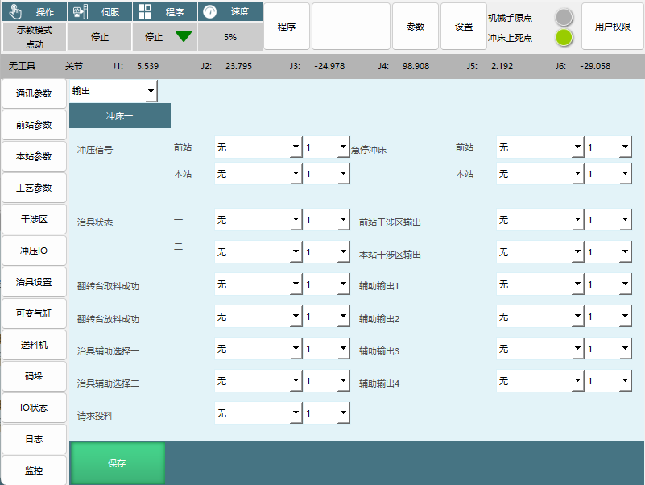

### 2.7 治具设置 (Fixture Settings)
> **摘要**: 治具动作参数和传感器配置。

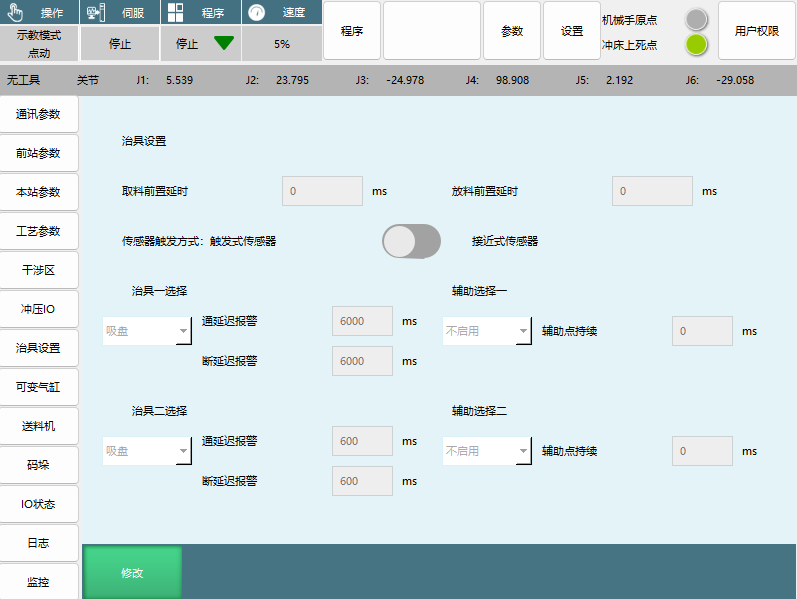

**时间延迟参数:**

| 参数名称 | 功能说明 | 设置单位 |
| :--- | :--- | :--- |
| **取料前置延时** | 机器人到达取料点时的延迟时间 | 毫秒 |
| **放料前置延时** | 机器人到达放料点时的延迟时间 | 毫秒 |

**传感器设置:**

| 传感器类型 | 触发特点 | 适用场景 |
| :--- | :--- | :--- |
| **触发式传感器** | 执行抓取动作之后才会有传感器信号 | 需要确认抓取动作完成的场景 |
| **接近式传感器** | 到达取料/放料点之后就会收到传感器信号 | 需要即时检测的场景 |

**报警时间设置:**

| 参数名称 | 功能说明 | 设置要点 |
| :--- | :--- | :--- |
| **治具一/二的通延迟报警** | 在取料/放料点进行传感器信号延迟检测，超过时间报警 | 时间设为0会在到达待机点判断是否满足条件 |
| **辅助选择一/二辅助点持续** | 启用后关闭对应治具信号后，会立刻输出该信号 | 一般用于电磁阀的消磁 |

**通断延迟报警机制说明:**
- **时间设为0**: 到达待机点进行判断，满足条件接着运行，不满足条件报警
- **时间设置过长**: 到达待机点前满足条件会直接继续运行，如到达待机点未满足条件并通断延迟报警时间未达到，会等待直到时间结束，中途满足条件可继续运行，时间结束后也没满足条件会直接报警

### 2.8 可变气缸 (Variable Cylinder)
> **摘要**: 冲压内置软PLC功能的气缸控制配置。

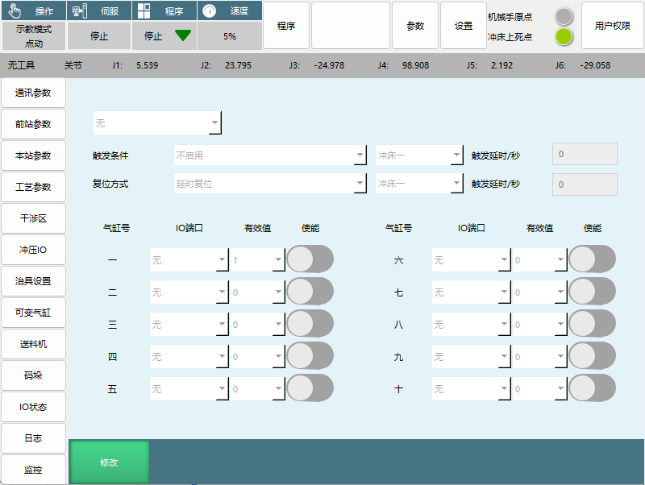

**功能定义:**
- 可变气缸定义为冲压内置的软PLC功能
- 在特定的条件下触发，打开某一IO端口
- 在特定的条件下关闭IO端口

**配置步骤:**
1. 在触发条件中选择触发信号的场景
2. 选择需要触发的冲床编号，设置时间
3. 选择复位方式，同样选择需要触发的冲床编号，设置时间
4. 在下方选择触发信号对应的端口，打开使能即可

**配置参数:**

| 参数名称 | 功能说明 | 设置内容 |
| :--- | :--- | :--- |
| **触发条件** | 气缸触发的条件设置 | 不启用、冲床等场景选择 |
| **触发延时/秒** | 触发延迟时间设置 | 时间单位：秒 |
| **复位方式** | 气缸复位方式选择 | 延时复位等方式 |
| **气缸号** | 气缸编号 | 1-10号气缸可选 |
| **使能** | 功能启用开关 | 启用/禁用 |
| **IO端口** | 触发信号对应的IO端口 | 端口编号设置 |
| **有效值** | IO端口的有效值设置 | 有效值配置 |

### 2.9 送料机 (Feeder Configuration)
> **摘要**: 投料机信号类型和参数设置。

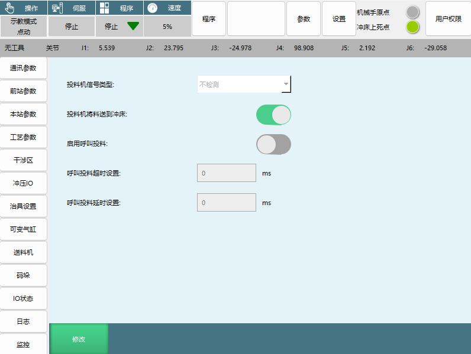

**信号类型配置:**

| 信号类型 | 工作特点 | 使用场景 |
| :--- | :--- | :--- |
| **上升沿** | 给出投料信号后机器人只取料一次，必须断开投料信号再给，机器人才能继续取料 | 需要精确控制取料次数 |
| **常通通常信号** | 只要有投料信号，机器人就过来取料 | 持续供料场景 |
| **不检测** | 不进行投料信号检测 | 特殊场景使用 |

**功能选项:**

| 选项名称 | 功能说明 | 应用场景 |
| :--- | :--- | :--- |
| **投料机将料送到冲床** | 投料机与冲床相连，直接给冲床送料 | 投料机直接供料场景 |
| **启用呼叫投料** | 机器人通过IO信号向送料机发送投料信号 | 自动控制投料 |
| **呼叫投料超时设置** | 设置呼叫投料信号超时报警检测时间 | 异常监控 |
| **呼叫投料延时设置** | 设置呼叫投料信号延时关闭时间 | 时序控制 |

---

## 3. 程序创建 (Program Creation)

### 3.1 新建程序 (New Program)
> **摘要**: 创建新的冲压机器人程序的方法和步骤。

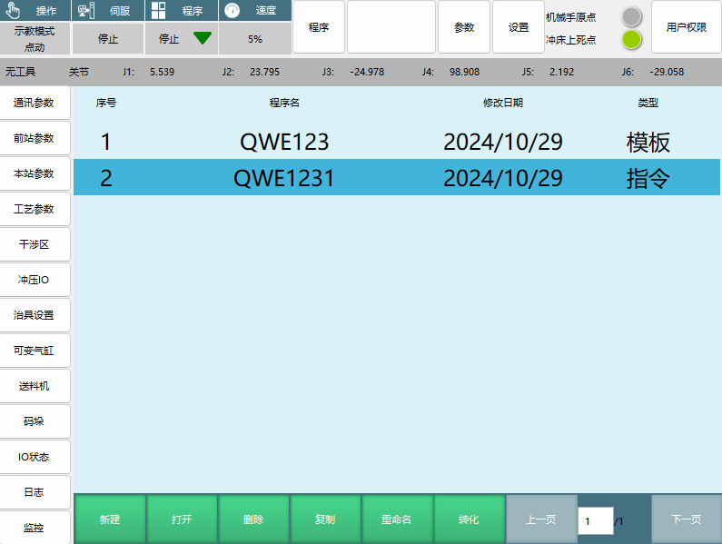

**创建步骤:**
1. 点击程序选择界面底部的"新建"按钮
2. 在弹出的界面中设置程序名称和参数
3. 点击"确定"完成程序创建

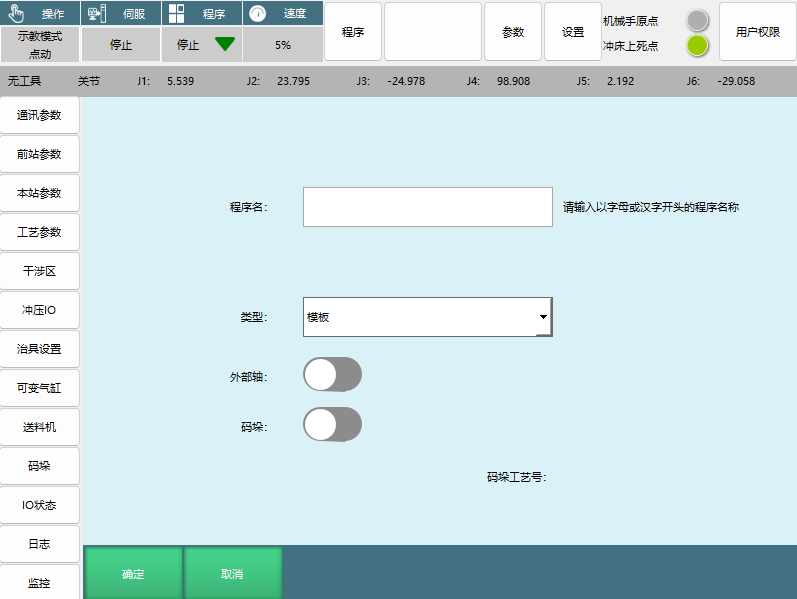

**新建程序参数设置:**

| 参数名称 | 功能说明 | 设置要求 |
| :--- | :--- | :--- |
| **程序名** | 程序名称设置 | 请输入以字母或汉字开头的程序名称 |
| **类型** | 程序类型选择 | 模板或指令 |
| **外部轴** | 外部轴功能开关 | 打开前确认机器人外部轴参数设置完毕 |
| **码垛** | 码垛功能开关 | 一般用于首台机卸跺和末台机码垛 |

**程序类型说明:**

| 程序类型 | 适用用户 | 编程特点 | 编程自由度 |
| :--- | :--- | :--- | :--- |
| **模板** | 初阶用户 | 按照要求标记点位即可 | 编程简单，自由度有限 |
| **指令** | 高阶用户 | 自定义编程 | 编程自由度大，可满足复杂场景需求 |

**外部轴功能说明:**
- 打开之后，程序中的所有点位在创建之后变为E点不是P点
- 打开之前请确认机器人外部轴参数设置完毕

**码垛程序创建:**
1. 输入程序名创建模板文件程序1
2. 类型选择：模板
3. 外部轴：不开
4. 码垛：打开
5. 点击确定

**码垛类型选项:**
- 前站卸垛
- 码垛工艺号：前站卸垛、本站码垛


**模板程序编辑:**

| 功能按钮 | 功能说明 | 使用方法 |
| :--- | :--- | :--- |
| **标记点位** | 标记机器人当前位置点位 | 上电移动机器人至对应点位，点击标记点位 |
| **轨迹1-10** | 两个点之间运动的插补方式 | 设置运动轨迹和插补方式 |
| **运动到点** | 关节插补方式运动到选择点 | 上电后机器人以关节插补方式运动到选择的点上 |
| **治具1、治具2动作** | 打开/关闭治具1或者治具2 | 设置治具动作 |
| **保存** | 保存程序设置 | 标记好所有点位，设置好所有轨迹后点击保存 |

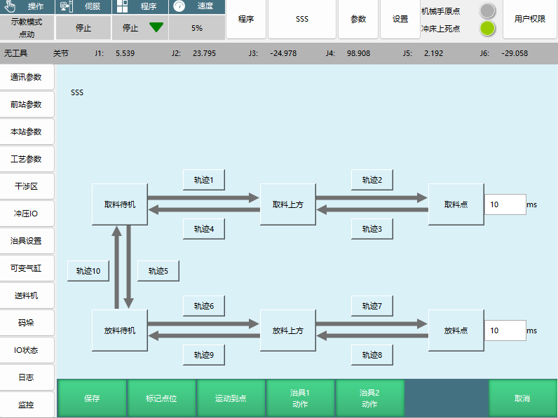

**点位显示说明:**
- 已标记和已设置的点位轨迹会置绿
- 已标记的点位会显示出点位坐标可切换

### 3.2 转化程序 (Program Conversion)
> **摘要**: 模板程序与指令程序的相互转换。


**转换规则:**
- 模板程序可以转化为指令程序
- 指令程序不可以转化为模板程序
- 转化操作不可逆

**转化步骤:**
1. 在程序选择界面选择需要转化的模板程序
2. 点击界面底部的"转化"按钮
3. 系统自动将模板程序转化为指令程序

**转化后的指令程序结构:**

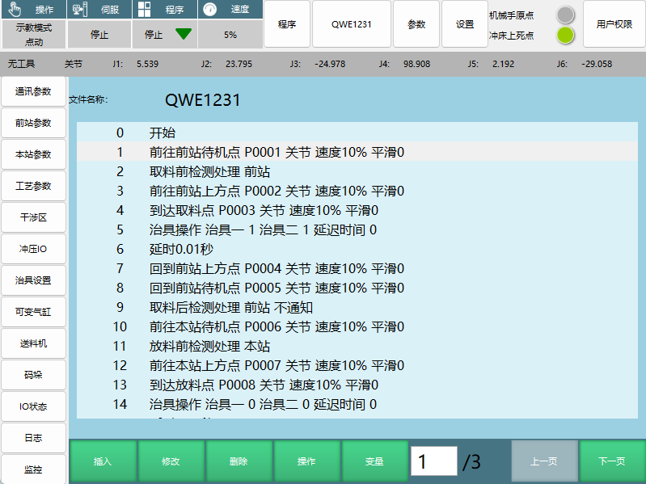

```
0 开始
1 前往前站待机点P0001 关节速度10% 平滑0
2 取料前检测处理前站
3 前往前站上方点P0002 关节速度10% 平滑0
4 到达取料点P0003 关节速度10% 平滑0
5 治具操作 治具一1 治具二1 延迟时间0
6 延时0.01秒
7 回到前站上方点P0004 关节速度10% 平滑0
8 回到前站待机点P0005 关节速度10% 平滑0
9 取料后检测处理前站 不通知
10 前往本站待机点P0006 关节速度10% 平滑0
11 放料前检测处理本站
12 前往本站上方点P0007 关节速度10% 平滑0
13 到达放料点P0008 关节速度10% 平滑0
14 治具操作 治具一0 治具二0 延迟时间0
```

**自定义编程必要指令:**
自定义编程必须包含以下四条指令，并且在每一个待机点后面都得对应后方的检测处理指令：

**待机点指令（必须包含）:**
- 前往前站待机点
- 回到前站待机点
- 前往本站待机点
- 回到本站待机点

**检测处理指令（必须对应）:**
- 取料前检测处理
- 取料后检测处理
- 放料前检测处理
- 放料后检测处理

**编程注意事项:**
- 待机点指令和检测处理指令必须成对出现
- 检测处理指令必须紧跟在对应的待机点指令后面
- 程序逻辑必须符合冲压工艺要求

---

## 4. 运行界面 (Running Interface)
> **摘要**: 程序运行界面的功能说明和操作注意事项。

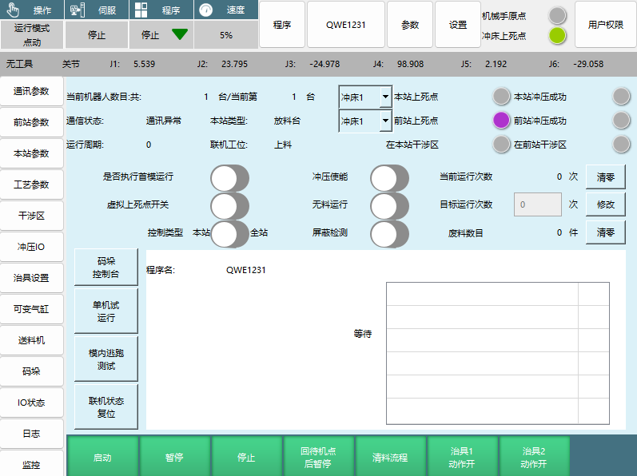

**运行状态监控参数:**

| 监控项目 | 显示内容 | 功能说明 |
| :--- | :--- | :--- |
| **当前机器人数目** | 共X台/当前第X台 | 显示联机机器人总数和当前编号 |
| **通讯状态** | 通讯正常/通讯异常 | 实时显示通讯连接状态 |
| **本站类型** | 放料台/冲床等 | 显示当前站设备类型 |
| **联机工位** | 上料/搬运/下料 | 显示当前联机工位 |
| **冲床1上死点** | 本站/前站上死点状态 | 显示冲床上死点状态 |
| **冲床1冲压成功** | 本站/前站冲压成功状态 | 显示冲压成功状态 |
| **运行周期** | 0次/清零 | 记录1个工件走完整条冲压产线的时间 |
| **当前运行次数** | X次 | 当前运行次数统计 |
| **目标运行次数** | X次 | 目标运行次数设置 |
| **废料数目** | X件 | 废料数量统计 |

**控制功能按钮:**

| 按钮名称 | 功能说明 | 使用条件 |
| :--- | :--- | :--- |
| **单机试运行** | 单机运行当前程序 | 需要在联机通讯的情况下 |
| **联机状态复位** | 将所有状态恢复成开始运行前的状态 | 必须在所有机器人停止的状态下才能复位 |
| **回待机点后暂停** | 全部运行到待机点暂停/本站运行到待机点暂停 | 联机状态/单机状态不同效果 |
| **清料流程** | 全部放完料停止/本站放完料停止 | 联机状态/单机状态不同效果 |
| **冲压使能** | 判定有没有设置冲压输出信号 | 没有则无法运行，并自动关闭虚拟上死点 |
| **无料运行** | 屏蔽治具开关 | 打开无料运行屏蔽检测自动打开且无法关闭 |
| **屏蔽检测** | 不进行治具检测 | 无料运行关闭时可单独打开关闭 |
| **是否执行首模运行** | 第一个工件按首模速度执行，之后按全局速度执行 | 首模速度与全局速度切换 |
| **虚拟上死点开关** | 在冲床关闭的情况下调试程序轨迹时使用 | 调试功能 |
| **码垛控制台** | 控制码垛参数的窗口界面 | 码垛参数调整 |
| **模内逃跑测试** | 测试模内逃跑的轨迹 | 测试功能 |
| **控制类型** | 当前示教盒的操作权限 | 本站或全站 |

**运行控制按钮:**

| 按钮名称 | 联机状态效果 | 单机状态效果 |
| :--- | :--- | :--- |
| **启动** | 全部启动 | 本站机器人启动 |
| **暂停** | 全部暂停 | 本站机器人暂停 |
| **停止** | 全部停止 | 本站机器人停止 |

**操作注意事项:**
- 所有按键除了启动、暂停、停止、回待机点后暂停、清料流程在运行状态下点击生效，其他按键均不生效
- 联机状态复位必须在所有机器人停止的状态下才能进行
- 冲压使能打开后如果没有设置冲压输出信号则无法运行
- 无料运行会自动打开屏蔽检测且无法关闭

---

## 5. 问题处理 (Troubleshooting)
> **摘要**: 常见问题的处理方法和操作流程。

### 5.1 取料失败 (Pick Failure)
> **摘要**: 取料失败时的处理方式和选择。

**取料失败处理选项:**

| 处理方式 | 功能说明 | 适用场景 |
| :--- | :--- | :--- |
| **重新取料** | 机器人重新去前站取料 | 一般的取料失败情况 |
| **放弃本料** | 机器人返回取料待机点，等待前站重新放料 | 料受损无法使用时 |
| **人工放料** | 需要人工从前站把料取出来，放到本站的冲床上 | 料掉落或卡在冲床上时 |

**人工放料操作流程:**

1. 选择"人工放料"选项后，会出现警告提示框
2. 警告内容："人工放料之后，是否已经执行冲压？"
3. 根据实际情况选择"是"或"否"

**人工放料选择逻辑:**

| 选择条件 | 系统响应 | 后续操作 |
| :--- | :--- | :--- |
| **工人自行手动冲压了该工件** | 选择"是" | 后台机会直接过来取料 |
| **工人没有手动冲压** | 选择"否" | 本站会输出冲压信号，执行冲压 |

**取料失败常见原因:**
- 抓取位置不准确
- 治具故障
- 传感器异常
- 工件位置偏移

### 5.2 放料失败 (Place Failure)
> **摘要**: 放料失败时的处理方式和选择。

**放料失败处理选项:**

| 处理方式 | 功能说明 | 适用场景 |
| :--- | :--- | :--- |
| **重新放料** | 机器人重新去本站放料 | 一般的放料失败情况 |
| **放弃本料** | 机器人返回取料待机点，重新去前站取料 | 料受损无法使用时 |
| **人工放料** | 需要人工把料放到本站的冲床上 | 料掉落时 |

**人工放料操作流程:**

1. 选择"人工放料"选项后，会出现警告提示框
2. 警告内容："人工放料之后，是否已经执行冲压？"
3. 根据实际情况选择"是"或"否"

**人工放料选择逻辑:**

| 选择条件 | 系统响应 | 后续操作 |
| :--- | :--- | :--- |
| **工人自行手动冲压了该工件** | 选择"是" | 后台机会直接过来取料 |
| **工人没有手动冲压** | 选择"否" | 本站会输出冲压信号，执行冲压 |

**放料失败常见原因:**
- 放料位置不准确
- 治具释放故障
- 冲床模具异常
- 工件卡滞

---

## Q&A 

**Q: 2207冲压工艺手册的主要适用产品是什么？**
A: 本手册适用于2207冲压机器人系统的操作、参数配置、程序开发和故障处理。

**Q: 联机模式有哪些类型？各有什么特点？**
A: 联机模式共有四种：单机模式（独立运行，目前功能尚未完善）、上料模式（生产线起始站）、搬运模式（生产线中间站）、下料模式（生产线末端）。

**Q: 前站有冲床时需要设置哪些参数？**
A: 需要设置最大冲床数、冲床编号、上死点、冲压时长、冲压动作时长、冲床类型、启动时上死点检测、下死点检测、延迟复位时间、冲压超时设置、冲压模内检测、反应超时设置、冲压成功确认时间等参数。

**Q: 模内逃跑机制分为哪两个阶段？**
A: 第一阶段：机器人从取料/放料待机点前往取料/放料点，该阶段模内逃跑是沿轨迹反向运行回到待机点；第二阶段：从取料/放料点返回待机点，该阶段模内逃跑是以最短路径直接返回待机点。

**Q: 安全门信号触发后会发生什么？**
A: 安全门信号触发后，整条产线会暂停，这是重要的安全保护功能。

**Q: 通断延迟报警时间设置为0和设置时间的区别是什么？**
A: 时间设为0会在到达待机点进行判断，满足条件接着运行，不满足条件报警；设置时间过长时，到达待机点前满足条件会直接继续运行，如到达待机点未满足条件会等待直到时间结束，中途满足条件可继续运行，时间结束后也没满足条件会直接报警。

**Q: 可变气缸的功能是什么？如何配置？**
A: 可变气缸定义为冲压内置的软PLC功能，在特定条件下触发打开某一IO端口，在特定条件下关闭。配置时需要选择触发条件、触发延时、复位方式、气缸号、IO端口和有效值，然后打开使能。

**Q: 新建程序时模板类型和指令类型有什么区别？**
A: 模板类型适用于初阶用户，只需按照要求标记点位即可；指令类型适用于高阶用户，编程自由度大，可以满足复杂场景需求。

**Q: 自定义编程必须包含哪四条指令？**
A: 必须包含：前往前站待机点、回到前站待机点、前往本站待机点、回到本站待机点。并且在每一个待机点后面都必须对应后方的检测处理指令。

**Q: 运行界面中哪些按键在运行状态下生效？**
A: 只有启动、暂停、停止、回待机点后暂停、清料流程在运行状态下点击生效，其他按键均不生效。

**Q: 取料失败有哪三种处理方式？各适用于什么场景？**
A: 重新取料（一般的取料失败情况）、放弃本料（料受损无法使用时）、人工放料（料掉落或卡在冲床上时）。

**Q: 人工放料后如何选择是否已经执行冲压？**
A: 如果工人自行手动冲压了该工件，选择"是"，后台机会直接过来取料；如果工人没有手动冲压，选择"否"，本站会输出冲压信号，执行冲压。

**Q: 本站类型有哪些选项？各有什么用途？**
A: 放料台（用于末台机放料）、冲床（用于首台机和中间机连接冲床）、翻转台（用于首台机和中间机连接翻转台）、空中接力（用于首台机和中间机用外部轴或变位机实现工件翻转）。

**Q: 冲压使能功能的作用是什么？**
A: 冲压使能打开后会判定有没有设置冲压输出信号，如果没有则无法运行，并且自动关闭虚拟上死点。

**Q: 首模运行和正常运行有什么区别？**
A: 打开"是否执行首模运行"后，所有机器人的运行的第一个工件都会按照首模速度执行，之后的所有工件会按照全局速度执行。

**Q: 模板程序可以转化为指令程序吗？反过来可以吗？**
A: 模板程序可以转化为指令程序，但指令程序不可以转化为模板程序，这个转化操作是不可逆的。

**Q: 外部轴功能打开后有什么影响？**
A: 外部轴功能打开后，程序中的所有点位在创建之后变为E点不是P点。打开之前必须确认机器人外部轴参数设置完毕。

**Q: 码垛功能一般用于什么场景？**
A: 码垛功能一般用于首台机卸跺和末台机码垛。

**Q: 联机状态复位有什么注意事项？**
A: 联机状态复位必须在所有机器人停止的状态下才能进行，复位后会将所有状态恢复成开始运行前的状态。

**Q: 无料运行和屏蔽检测有什么关系？**
A: 无料运行会屏蔽治具开关，打开无料运行后屏蔽检测自动打开且无法关闭。屏蔽检测在无料运行关闭时可单独打开关闭。

**Q: 虚拟上死点开关的作用是什么？**
A: 虚拟上死点开关用于在冲床关闭的情况下调试程序轨迹时使用，便于程序调试和测试。

**Q: 运行周期参数记录的是什么信息？**
A: 运行周期记录1个工件走完整条冲压产线的时间，用于监控和优化生产效率。

**Q: 投料机信号类型有哪几种？各有什么特点？**
A: 上升沿（给出投料信号后机器人只取料一次，必须断开投料信号再给）、常通通常信号（只要有投料信号，机器人就过来取料）、不检测（不进行投料信号检测）。

**Q: 治具一/二的通延迟报警时间如何设置？**
A: 时间设为0会在到达待机点判断是否满足条件，满足条件接着运行，不满足条件报警；设置时间过长时，到达待机点前满足条件会直接继续运行，未满足条件会等待直到时间结束。

---

## 6. 操作安全提示 (Operation Safety Notes)

### 7.1 关键安全检查项
- [ ] 确认联机模式设置正确
- [ ] 检查冲床参数设置完整
- [ ] 验证安全门信号正常工作
- [ ] 确认治具检测功能正常
- [ ] 检查干涉区设置合理
- [ ] 验证上死点/下死点检测正常
- [ ] 确认冲压模内检测功能启用
- [ ] 检查急停信号连接正常

### 7.2 启动前准备清单
- [ ] 机器人回原点完成
- [ ] 冲床处于上死点位置
- [ ] 治具状态正常
- [ ] 通讯连接正常
- [ ] 程序验证完成
- [ ] 安全门关闭
- [ ] 操作人员培训完成
- [ ] 应急预案准备就绪

### 7.3 运行中监控要点
- [ ] 实时监控机器人运动状态
- [ ] 关注冲压信号状态
- [ ] 检查治具工作状态
- [ ] 监控干涉区状态
- [ ] 注意废料数量统计
- [ ] 观察运行周期变化
- [ ] 保持通讯状态稳定
- [ ] 关注安全系统状态

### 7.4 异常处理流程
1. **立即停机** → 按下急停按钮或停止按钮
2. **故障诊断** → 检查报警信息和日志
3. **安全确认** → 确保设备和人员安全
4. **故障排除** → 根据问题类型选择处理方式
5. **系统复位** → 确认正常后进行系统复位
6. **重新启动** → 按正常启动流程重新开始

---

## 7. 技术支持建议 (Technical Support Suggestions)

### 8.1 培训要点
- 熟悉主界面各菜单功能
- 掌握参数设置方法和要点
- 理解联机模式的工作原理
- 学会程序创建和编辑
- 掌握运行界面的操作方法
- 了解常见问题的处理流程
- 熟悉安全操作规范
- 掌握应急处理程序

### 8.2 系统维护建议
- 定期检查通讯连接状态
- 定期校准传感器和治具
- 定期备份重要程序和参数
- 定期检查安全系统功能
- 定期清理和润滑运动部件
- 定期更新系统软件
- 定期进行系统性能测试
- 建立维护记录和档案

### 8.3 故障排查清单
1. 检查电源和电气连接
2. 检查通讯连接和信号
3. 检查传感器和治具状态
4. 检查程序和参数设置
5. 检查机械部件和运动状态
6. 检查冲床和安全系统
7. 检查干涉区和碰撞检测
8. 检查日志和报警信息

### 8.4 优化建议
- 合理设置首模速度和全局速度
- 优化运动轨迹减少空行程
- 合理设置迟滞时间提高效率
- 定期分析运行周期优化生产节拍
- 优化治具动作时序
- 合理设置干涉区确保安全
- 优化程序结构提高可维护性
- 建立标准化操作流程

---

## 8. 附录 (Appendix)

### 9.1 术语表
- **联机模式**: 机器人与其他设备联网协作的工作模式
- **上死点/下死点**: 冲床运动的两个极限位置
- **模内逃跑**: 机器人在模具内部的快速撤离动作
- **干涉区**: 机器人运动过程中可能发生碰撞的区域
- **治具**: 用于抓取和释放工件的装置
- **迟滞信号**: 信号发出后的延迟时间设置
- **IO信号**: 输入输出信号，用于设备间通讯
- **示教模式**: 手动操作机器人进行点位标记和程序编辑的模式
- **关节插补**: 机器人各关节协调运动的方式
- **外部轴**: 除机器人本体外的附加运动轴

### 9.2 常见错误代码
- **连线异常**: 前后站连接不满足设定要求
- **关节速度超限**: 三轴不在圆心正上方时尝试XYZ运动
- **冲压超时**: 冲床在规定时间内未完成冲压动作
- **通讯异常**: 网络连接或信号传输出现问题
- **治具检测失败**: 治具传感器信号异常
- **干涉区报警**: 机器人进入干涉区域
