title: 2207喷涂工艺手册

content: 纳博特2207喷涂机器人控制器的喷涂工艺设置与操作指南

description: 数字量设置、模拟量设置、时序配置、轨迹参数、手动操作界面及喷涂指令（SPRAY_ON/OFF/CHANGE/MOVE/POSE）的介绍

company:纳博特

---

# 1 数字量设置

打开控制器，进入"工艺"界面，选择**"喷涂工艺"-"数字量设置"**界面，此时不能修改，点击"修改"按钮后，方可修改，修改完需要点保存，如下图：

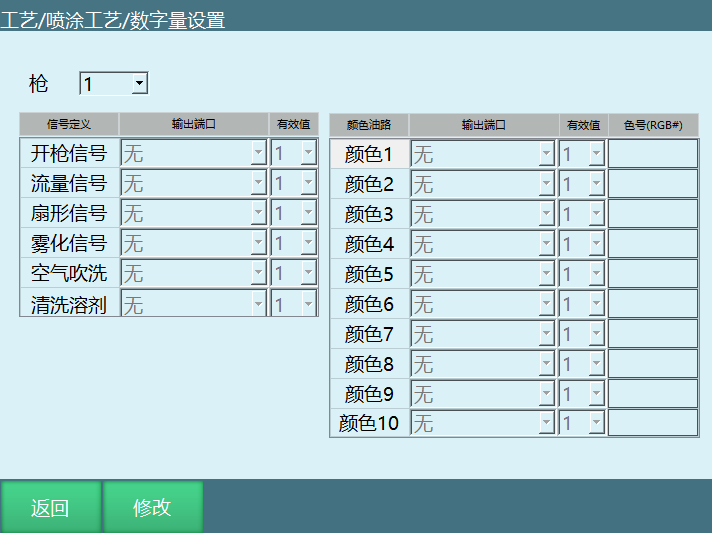

点击修改后，修改按钮变保存，选择框变白，此时可以选择枪号，并在各自的功能后面选择端口、有效值和色号。色号请用 16 位 RGB 格式，填入色号后相应的"颜色油路"框会变成相应的颜色。

# 2 模拟量设置

选择想修改的组号，点击"修改"按钮后，方可修改模拟量组号和填写备注。共可设置99 组时序及其相应的备注，每组时序包括**流量模拟量、扇形模拟量**和**雾化模拟量**，此处只供修改，调取相应组号需使用相应指令，修改完需要点保存，如下图所示：

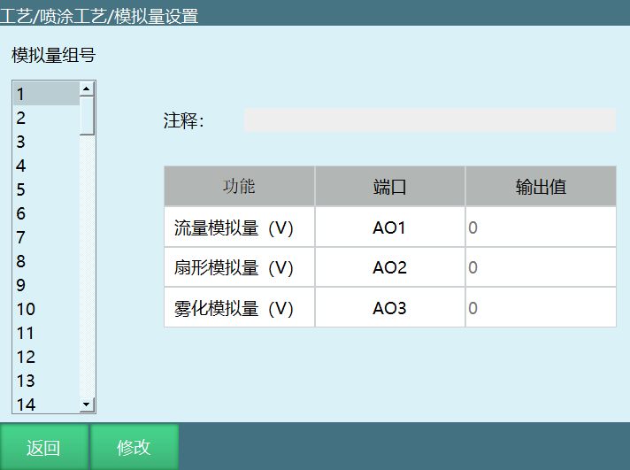

# 3 时序

选择想修改的组号，点击"修改"按钮后，方可修改时序组号。共可设置 99 组时序，每组时序包括**开枪时序**和**换料时序**，此处只供修改，调取相应组号需使用相应指令，修改完需要点保存，如图：

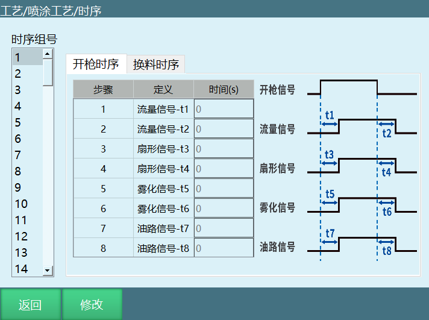

## 3.1 开枪时序

此为开枪时的时序，左侧的各个信号需要设置的时间对应右侧的时序图。流量、扇形、雾化信号对应数字量设置里所设端口，油路信号对应当前颜色在数字量设置里所设端口，如下图所示。

示例（仅作说明，请按照实际需求设置）：IO 设置开枪信号为 1-1、流量信号 1-2、扇形信号 1-3、雾化信号 1-4、颜色油路 1-5。喷涂时间为 10s（即开枪时间为 10s），t1=1、t2=1， t3=3、t4=3，t5=2、t6=2，t7=4、t8=4。

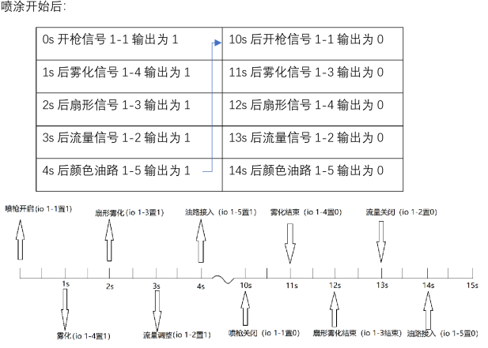

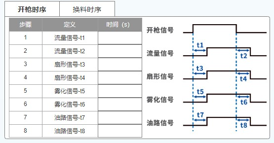

## 3.2 换料时序

此为换料时的时序，左侧的各个信号需要设置的时间对应右侧的时序图。空气吹洗、清洗溶剂、开枪信号对应数字量设置里所设端口。（如下图）

示例: （示例仅做说明，请按照实际需求设置）IO 板设置开枪信号为 1-1、流量信号 1-2、空气吹洗 1-3、清洗溶剂 1-4、颜色油路 1-5。开枪信号为 10s，t1=1、t2=3、t3=1、 t4=4、t5=1，t6=3、t7=4。

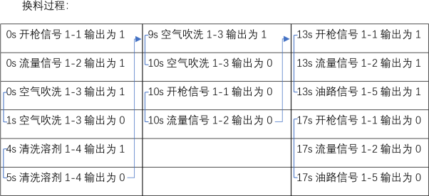

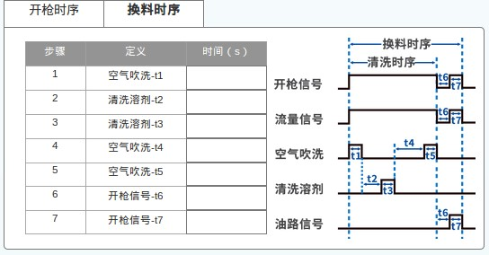

# 4 轨迹参数

共可设置 99 组轨迹组号，每组轨迹组号包括**轨迹类型、轨迹种类、喷涂层数、追加次数、标记点位**，点击"修改"按钮后，方可设置，修改完需要点保存。(如下图)

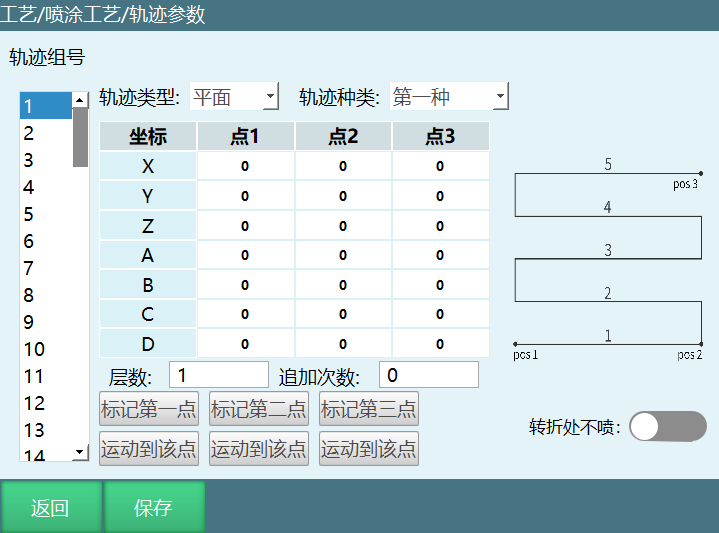

**轨迹类型**：分平面、立体和自定义三种，根据需要设置。

**轨迹种类**：平面有四种，立体有两种，根据需要设置。

**层数**：下图红框框住的数字就是层数，填入数字就会喷涂对应层数。

**追加次数**：每层增加喷涂的次数，例如追加 3 次则每层往返喷涂 3 次再进入下一层。

**标记点数**：标记的点数点数对应图上右侧的点，其中平面类型的第一种/第二种需要标记三个点，平面类型的第三种/第四种和立体类型的第一种/第二种需要标记四个点。

示例（示例仅做说明，请按照实际需求设置）：

设置层数为 1，追加 0 次，则喷枪从 A 点喷涂至 B 点；

设置层数为 1，追加 1 次，喷枪从 A 点喷涂至 B 点再喷涂回 A 点；

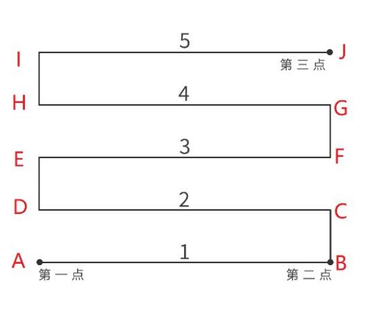

设置层数为 2，追加 1 次，喷枪按 A→B→A→D→C→D 点位运行；

设置层数为 3，追加 3 次，喷枪按 A→B→A→B→C→D→C→D→E→F→E→F 点位运行。

# 5 手动操作

手动操作界面可以选择使用的喷枪号与时序组号，在颜色切换处点击相应颜色可以更换当前颜色（按时序-换料换料时序进行相应的IO置位）。（如下图）

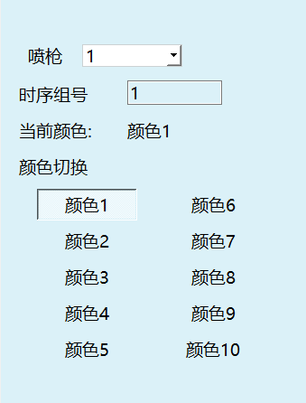

当"模拟量组号"输入框的值为 0 时，**修改模拟量**按钮才有效可点击并手动修改，当不为 0 时，喷漆、除尘、油量测试里的修改模拟量按钮无效置灰，下面三个值变为输入的模拟量组号里的值。喷漆、除尘、油量测试中的模拟量均使用喷漆里面的设置 3 个模拟量。如下图所示：

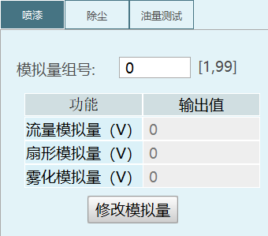

油量测试的**测试**按钮默认为 OFF 状态，设置测试时间后，按下会进行油量测试相应时间，此时当前颜色油路的IO口会变为有效值。（如下图）

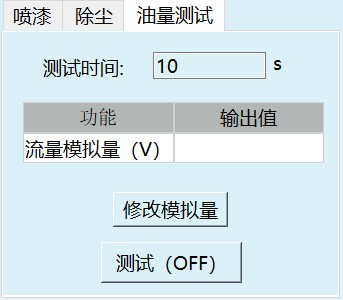

**除尘使能**和**喷漆使能**默认为 OFF 状态，按下会切换为 ON 状态（如下图） 。

按下除尘使能，数字量设置-空气吹洗对应 IO 口会变为有效值；按下喷漆使能，会按开枪时序进行相应的 IO 口置位；按下清洗，会按照清洗时序进行相应的IO输出 。

注：颜色切换、除尘使能、喷漆使能、清洗、油量测试为互锁关系，同一时间只能使用一种功能。如**喷漆使能**状态为 ON 时按下**清洗**，会立刻停止喷漆进行清洗。

# 6 喷涂指令

## 6.1 SPRAY_ON - 喷涂开始

标识喷涂开始的指令，运行本条指令后开始喷涂工艺。

**功能**：喷涂工艺开始。

**枪**：枪1-2。

**时序组号**：填写时序组合。

**模拟量组号**：填写模拟量组号。

**流量模拟量、扇形模拟量、雾化模拟量**：模拟量组号填0修改。

示例：SPRAY_ON G=1 T=1 AO=1

## 6.2 SPRAY_OFF -喷涂结束

表示喷涂结束的指令，运行本条指令后结束喷涂工艺。

**功能**：喷涂工艺结束。

**枪**：喷枪号1-2。

示例：SPRAY_OFF G=1

## 6.3 SPRAY_CHANGE -喷涂换色

更换喷枪颜色指令，运行后根据指令参数让相应喷枪更换对应的颜色。

**功能**：更换颜色。

**枪**：喷枪号1-2。

**时序组号**：时序组号 1-99 。

**颜色**：枪颜色号 1-10 。

示例：SPRAY_CHANGE G=1 T=2 COLOR=1

## 6.4 SPRAY_MOVE -喷涂轨迹

喷涂动作指令，根据设置的轨迹组号、速度、PL、加速度进行喷涂。

**功能**：按喷涂轨迹进行机器人移动。

**轨迹组号**：轨迹组号1-99。

**喷涂速度**：速度2-9999mm/s 。

**喷涂PL**：平滑0-5。

**喷涂加速度**：加速度 1-100% 。

**喷涂减速度**：减速度 1-100%。

示例：SPRAY_MOVE ID=1 V=10mm/s PL=0 ACC=1 DEC=1

## 6.5 SPRAY_POSE -喷涂起始位置

改变喷涂开始的姿态，如不用此指令则喷涂时按标定时第一个点的姿态开始喷涂。

**功能**：切换机器人姿态。

**轨迹组号**：轨迹组号 1-99 。

**点位状态**：绝对标记点/仅姿态。

**速度**：变姿速度。

**加速度**：变姿加速度。

**减速度**：变姿减速度。

**TIME**：提前执行时间。

示例：SPRAY_POSE ID=2 V=40mm/s ACC=4 DEC=4

## 6.6 指令示例

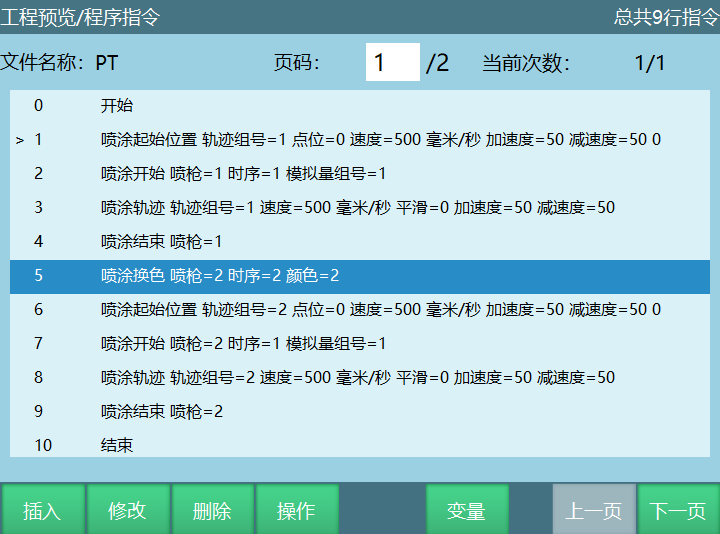

**说明：**

1. 移动到喷涂轨迹的起始点；

2. 开始调用喷涂工艺参数，打开喷枪；

3. 开始喷涂轨迹移动；

4. 喷涂结束关闭喷枪；

5. 切换喷枪/更换喷枪颜色。

6. 后面是开始新一轮的喷涂轨迹，和前面的流程相同。

---

# Q&A

**Q: 数字量设置中色号格式是什么？**

A: 色号请使用 16 位 RGB 格式，填入后相应的"颜色油路"框会自动变为对应颜色。

**Q: 模拟量和时序各可以设置多少组？**

A: 模拟量共可设置 99 组，时序也共可设置 99 组。

**Q: 颜色切换、除尘使能、喷漆使能、清洗、油量测试之间是什么关系？**

A: 它们之间为互锁关系，同一时间只能使用一种功能。例如喷漆使能状态为 ON 时按下清洗，会立刻停止喷漆进行清洗。

**Q: 如何修改数字量/模拟量/时序设置？**

A: 进入对应界面后，点击"修改"按钮才能进行修改，修改完成后需要点击"保存"按钮。

**Q: SPRAY_MOVE 指令中喷涂速度的范围是多少？**

A: 喷涂速度范围为 2-9999 mm/s。

**Q: 轨迹参数中平面类型和立体类型分别需要标记几个点？**

A: 平面类型的第一种/第二种需要标记三个点，平面类型的第三种/第四种和立体类型的第一种/第二种需要标记四个点。

**Q: 追加次数为 0 和为 1 时喷枪运行有什么区别？**

A: 追加 0 次时喷枪从 A 点喷涂至 B 点即完成一层；追加 1 次时喷枪从 A 点喷涂至 B 点再喷涂回 A 点，即往返一次。

**Q: 模拟量组号为 0 和不为 0 时手动操作有什么区别？**

A: 模拟量组号为 0 时，可以手动修改模拟量值；不为 0 时，喷漆、除尘、油量测试里的修改模拟量按钮无效置灰，三个模拟量值自动变为所输入组号中的值。
