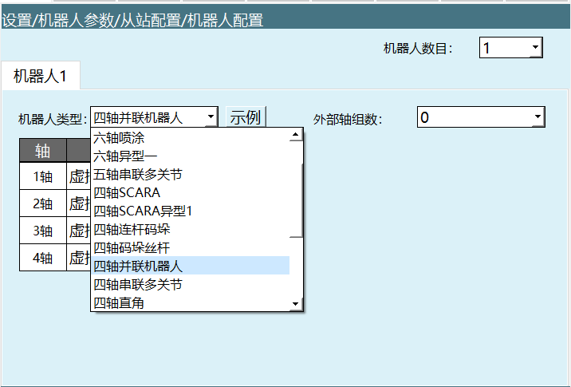
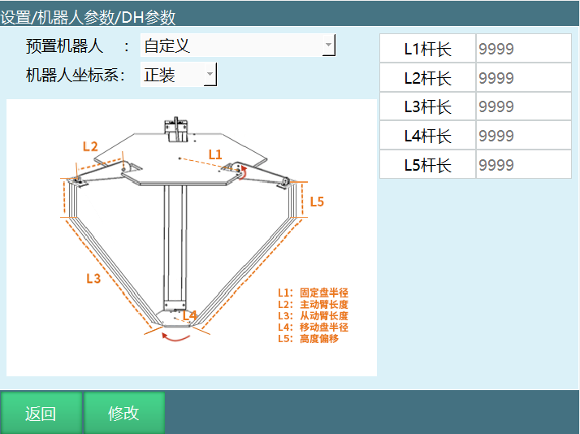
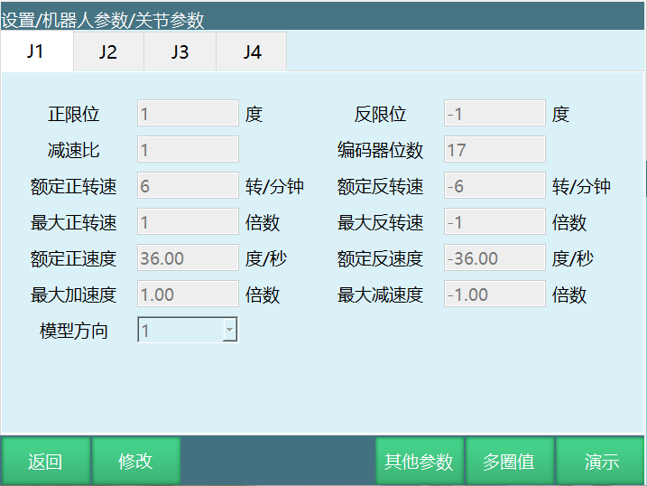
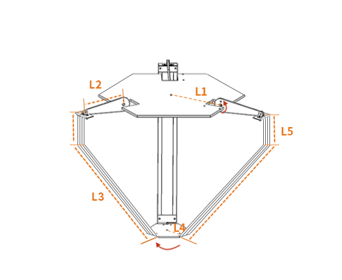
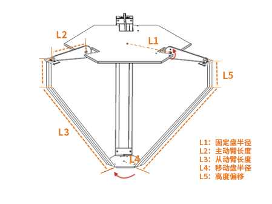
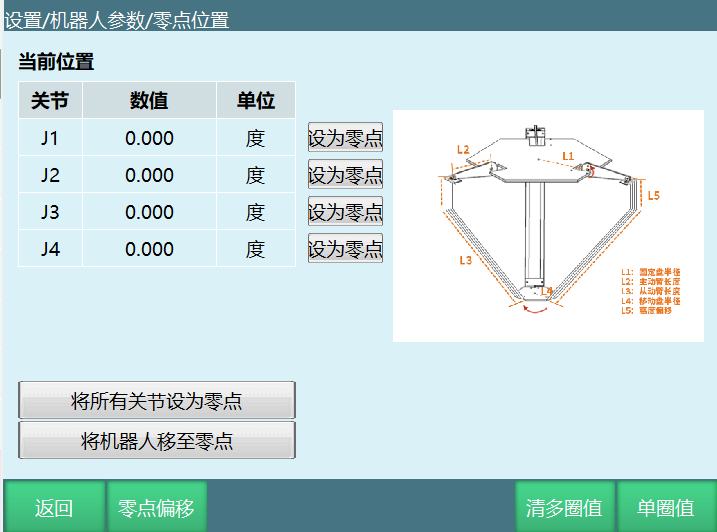
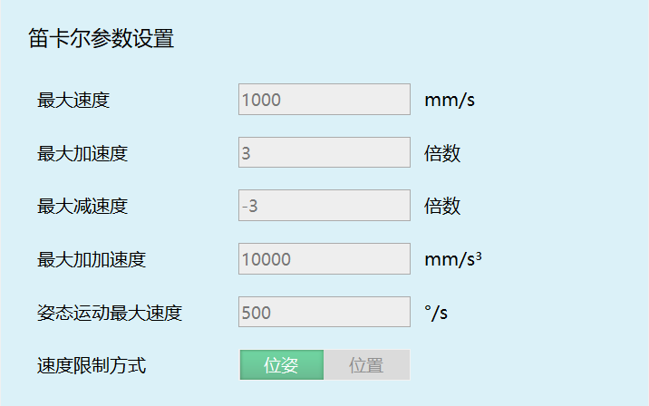

## 1. 并联机器人介绍

并联机器人,英文名为Parallel Mechanism,简称PM,可以定义为动平台和定平台通过至少两个独立的运动链相连接,机构具有两个或两个以上自由度,且以并联方式驱动的一种闭环机构。

### 1.1 定义

动平台和定平台通过至少两个独立的运动链相连接,机构具有两个或两个以上自由度,且以并联方式驱动的一种闭环机构。

### 1.2 特点

(1) **无累积误差,精度较高**;

(2) **驱动装置可置于定平台上或接近定平台的位置**,这样运动部分重量轻,速度高,动态响应好;

(3) **结构紧凑,刚度高,承载能力大**;

(4) **完全对称的并联机构具有较好的各向同性**;

(5) **工作空间较小**;

根据这些特点,并联机器人在需要高刚度、高精度或者大载荷而无须很大工作空间的领域内得到了广泛应用。

### 1.3 预置参数

**四轴并联机器人基本操作 - 从站配置**

如果需要选择四轴并联机器人,点击【设置-机器人参数-从站配置-机器人】,点击机器人类型选择"四轴并联机器人",点击保存。

**预置参数设置步骤**:

1. 选中四轴并联机器人后点击保存,需要导入机器人参数配置文件,但是在DH参数界面中,我们提供了预置机器人参数功能。如果该下拉列表中包含您所使用的机器人型号,您可以通过该功能快速、方便地设置好机器人的各项参数,不用再单独导入控制器配置参数。

2. 点击DH参数界面中,左上角【预置机器人】,可以选择已经适配好的机器人型号,选择后该机器人的DH参数、关节参数将自动填入。

3. 选择了预置机器人后需要手动标定零点。

**参数说明**:

- **预置机器人**: 通过事先把机器人关节参数和DH参数导入到控制器里,可以省去重复填写参数的步骤。

### 1.4 设置DH参数

**杆长参数填写**:

1. 填写机器人的杆长参数;该参数会影响机器人的直线运动及精度。

**重要提示**: DH参数、关节参数、零点未设置完成前,请勿上电操作机器人。

**DH参数说明**:

| 参数 | 说明 |
|------|------|
| L1杆长 | 固定盘半径 |
| L2杆长 | 主动臂长度 |
| L3杆长 | 从动臂长度 |
| L4杆长 | 移动盘半径 |
| L5杆长 | 高度偏移 |
| 机器人坐标系 | 正装/倒装 |

### 1.5 杆长

杆长参数需按照DH参数界面中的模型图所示填写,若没有给数值的情况下,我们只能通过尺子来测量机器人每个轴的长度,填写不准确会影响机器人运动精度。

**关节参数设置**:

**重要提示**: DH参数、关节参数没有设置前请勿上电点动机器人,防止机器人飞车,对操作人员造成危险。如果需要机器人回到零点位置,点击【机器人参数-零点位置】查看是否在零点位置,如果不在零点请先标定零点。

**各参数意义**:

| 参数 | 说明 |
|------|------|
| **正限位** | 机器人关节正方向最大范围。导入控制器配置后,关节参数界面的每个参数值会写入进去,限位的值可以修改。 |
| **反限位** | 机器人在反方向单轴旋转的最大位置。(此数值须为负数) |
| **减速比** | 减速机构中瞬时输入速度与输出速度的比值。 |
| **编码器位数** | 编码器的位数。一般是17位或者23位。 |
| **额定正转速** | 电机正方向的额定转速。 |
| **额定反转速** | 电机反方向的额定转速。(此数值须为负数) |
| **最大正转速** | 电机正方向的最大转速,其数值为额定正转速的倍数。如额定正转速3000转,最大正转速要6000转,则此处填写2倍。 |
| **最大反转速** | 电机反方向的最大转速,其数值为额定反转速的倍数。如额定反转速-4000转,最大反转速要-6000转,则此处填写-1.5倍。(此数值须为负数) |
| **额定正速度** | 机器人关节的额定正方向速度,由额定正转速、编码器位数、减速比自动计算而来,无需填写。 |
| **额定反速度** | 机器人关节的额定负方向速度,由额定反转速、编码器位数、减速比自动计算而来,无需填写。(此数值须为负数) |
| **最大加速度** | 机器人关节运动的最大的加速度,其数值为额定正(反)速度的倍数。如额定正速度为300度/s,需要最大加速度为1500度/s²,则此处填写5倍。 |
| **最大减速度** | 机器人关节运动的最大的减速度,其数值为额定正(反)速度的倍数。如额定正速度为300度/s,需要最大加速度为1200度/s²,则此处填写-4倍。建议最大加速度与最大减速度数值相同。(此数值须为负数) |
| **模型方向** | 模型方向参照下方的关节正方向示意图设置,各轴点动"+"键应与关节正方向示意图方向相同,相同选1,相反选-1。 |
| **齿轮反向间隙** | 每当关节往相反方向运动时,补偿填写值的角度,默认不填。 |

**关节正方向示意图**:

- 图示方向为机器人关节正方向
- 关节正方向未设置完成前,请勿上电操作机器人

### 1.6 零点标定

若机器人零点位置为非标准零点位置,用户可以将机器人按照机器人的对位孔对齐后,在机器人零点位置界面将当前机器人位置坐标设置为零点位置。

**并联机器人零点调试**:

可将【主动轴长度】的位置处与【机器人上盘】水平就是并联机器人的零点。

**零点标定步骤**:

1. 确保机器人在零点位置
2. 点击"将所有关节设为零点"即可

**零点标定界面说明**:

| 功能 | 说明 |
|------|------|
| 当前位置 | 显示当前各关节的坐标值 |
| 设为零点 | 将单个关节当前位置设为零点 |
| 将所有关节设为零点 | 将所有关节同时设为零点 |
| 将机器人移至零点 | 控制机器人移动到零点位置 |
| 零点偏移 | 设置零点偏移值 |
| 清多圈值 | 清除多圈编码器值 |
| 单圈值 | 显示单圈编码器值 |

**重要提示**:

| 注意事项 |
|----------|
| • 机器人没有进行零点位置校准,不能进行回零和其它点动机器人的操作。 |
| • 使用多台机器人的系统,每台机器人都必须进行原点位置校准。 |
| • 当关节轴之间存在耦合关系时,例如常见的机器人第五轴和第六轴存在耦合关系,第五轴必须处于零点位置时,第六轴记录的零点数据才会有效,否则,第六轴记录的零点数据是无效的。所以必须在第五轴处于零位的状态下记录第六轴的零位数据。如果不存在耦合关系,则各个轴可以单独标定零位,各自的零位不会影响到其它关节的零位。 |
| • 当所有用到的轴(本体轴和辅助扩展轴)都完成零位标定后,零位标定界面上的"全部"指示灯变为绿色,说明机器人已完成零位数据的标定,机器人可以进行笛卡尔空间下的运动。 |

**四轴并联机器人零点位置示意图**:

- L1: 固定盘半径
- L2: 主动臂长度
- L3: 从动臂长度
- L4: 移动盘半径
- L5: 高度偏移

### 1.7 设置笛卡尔参数

笛卡尔参数可直接使用默认值。

**各参数意义**:

| 参数 | 说明 |
|------|------|
| **最大速度** | 机器人运行时的最大线速度。 |
| **最大加速度** | 机器人运行时的最大加速度,此数值为最大速度的倍数。如最大速度为1000mm/s,需要最大加速度为3000mm/s²,则此处填写3倍。 |
| **最大减速度** | 机器人运行时的最大减速度,此数值为最大速度的倍数。如最大速度为1000mm/s,需要最大减速度为-3000mm/s²,则此处填写-3倍。建议最大加速度与最大减速度数值相同,且与关节参数中的最大加速度与最大减速度相同。(此数值须为负数) |
| **最大加加速度** | 此参数为保留参数,当前无效。 |
| **姿态运动最大速度** | 机器人运行时的最大速度,指令速度超出会被降速。 |
| **速度限制方式** | - **位姿**: 机器人直线插补的运动同时受最大速度、姿态运动最大速度限制。 - **位置**: 机器人直线插补的运动仅受最大速度限制。 |

## 2. 四轴并联机器人在工艺上的运用

并联机器人从它的优点就能看出它在一些工艺方面有着很大的优势,如:

- **码垛工艺**
- **传送带跟踪工艺**
- **视觉工艺**
- **寻位跟踪**

(可以通过手册对它进行工艺方面的测试)

---

## 常见问题解答

**Q1: 什么是四轴并联机器人?**
A: 四轴并联机器人是一种动平台和定平台通过至少两个独立的运动链相连接,具有两个或两个以上自由度,且以并联方式驱动的闭环机构。

**Q2: 并联机器人有哪些特点?**
A: 主要特点包括:无累积误差精度较高、驱动装置置于定平台运动部分重量轻速度高、结构紧凑刚度高承载能力大、完全对称的并联机构具有较好各向同性、工作空间相对较小。

**Q3: 如何快速设置四轴并联机器人参数?**
A: 在DH参数界面左上角点击【预置机器人】,选择已适配的机器人型号,DH参数和关节参数将自动填入。选择预置机器人后仍需手动标定零点。

**Q4: DH参数中的杆长参数如何填写?**
A: 按照DH参数界面中的模型图所示填写,包括L1(固定盘半径)、L2(主动臂长度)、L3(从动臂长度)、L4(移动盘半径)、L5(高度偏移)。若没有给数值,需通过测量获取,填写不准确会影响运动精度。

**Q5: 零点标定的正确位置是什么?**
A: 并联机器人的零点是将【主动轴长度】的位置处与【机器人上盘】水平的姿态。确保机器人在该位置后,点击"将所有关节设为零点"即可。

**Q6: 关节参数中最大转速如何计算?**
A: 最大转速是额定转速的倍数。如额定正转速3000转,最大正转速要6000转,则填写2倍;额定反转速-4000转,最大反转速要-6000转,则填写-1.5倍。

**Q7: 笛卡尔参数中的速度限制方式有什么区别?**
A: "位姿"模式是机器人直线插补的运动同时受最大速度和姿态运动最大速度限制;"位置"模式是机器人直线插补的运动仅受最大速度限制。

**Q8: 四轴并联机器人适合哪些工艺应用?**
A: 适合码垛工艺、传送带跟踪工艺、视觉工艺、寻位跟踪等需要高刚度、高精度或大载荷而无须很大工作空间的领域。

**Q9: 如何判断零点标定是否完成?**
A: 当所有用到的轴都完成零位标定后,零位标定界面上的"全部"指示灯变为绿色,说明机器人已完成零位数据的标定。

**Q10: 为什么DH参数和关节参数设置前不能上电?**
A: 如果DH参数、关节参数没有设置正确就上电点动机器人,可能会导致机器人飞车,对操作人员造成危险。必须先完成参数设置和零点标定才能安全操作。

