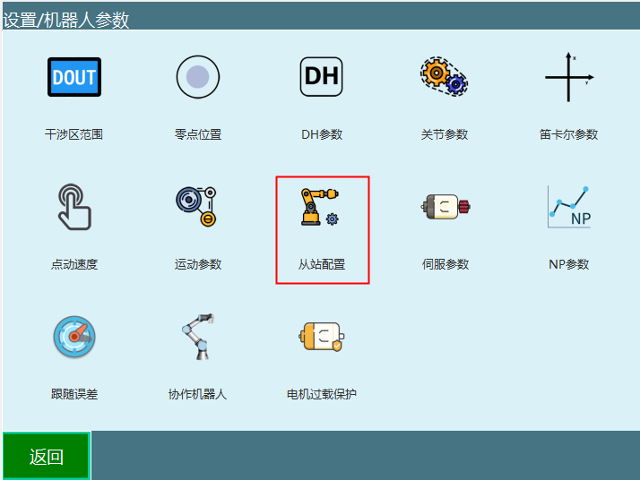
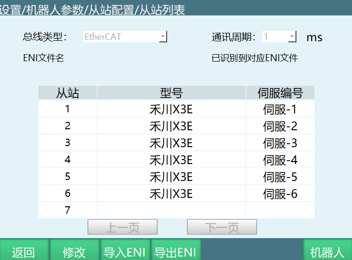
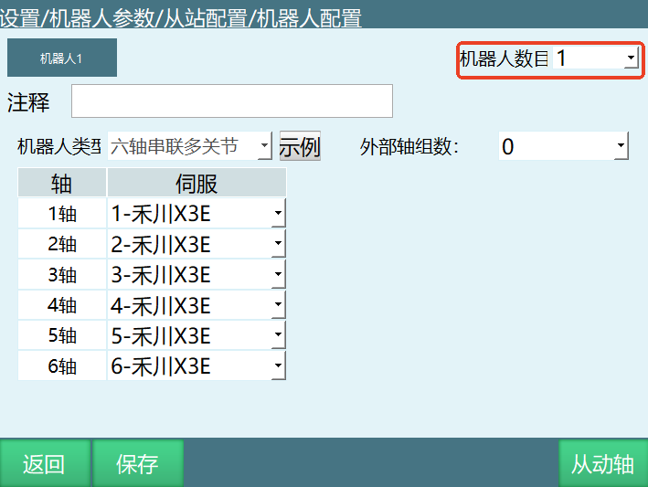
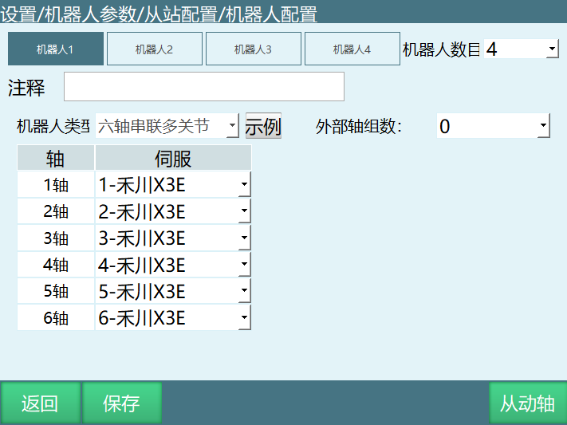
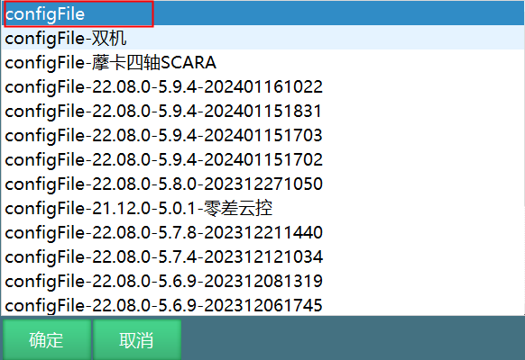
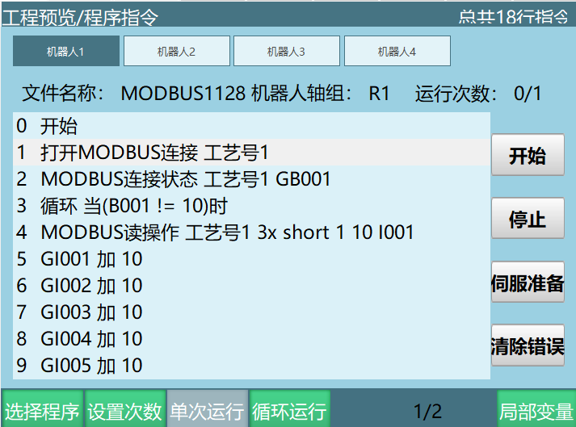
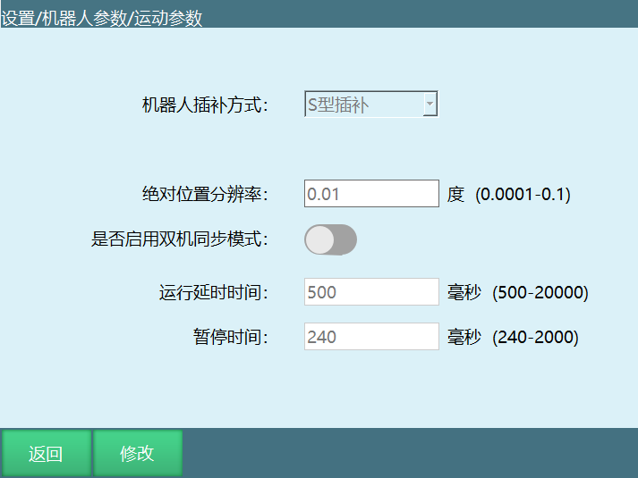
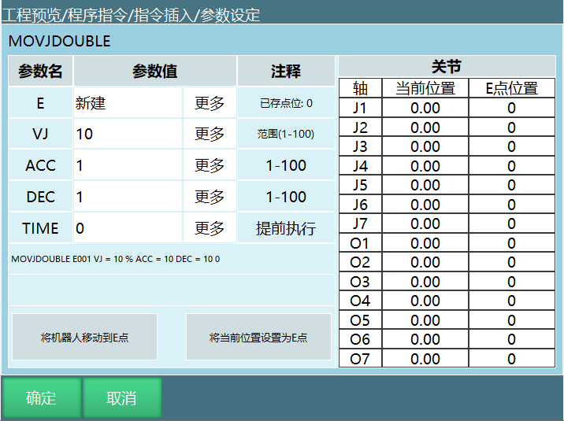
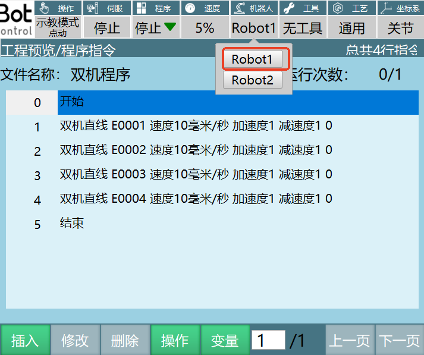
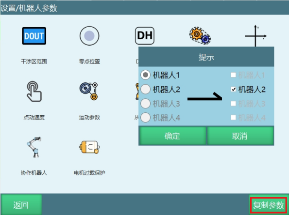

# 多机模式与双机协作手册


# 1 多机模式

多机模式指通过调试一个示教器控制多台机器人，本产品支持最多同时控制4个机器人，本章将介绍如何设置同时操控机器人的个数、切换机器人、双机协作、多机同时运行程序的方法与步骤。

## 1.1 从站连接

机器人顺序如下图所示：


**注意：** 从站间串联时必须用网线直接连接，不要用交换机（交换机连接时可能会出现机器人飞车）！

---

### 1.1.1 配置机器人

在设置界面下的机器人选择界面中来进行机器人个数及各机器人类型选择操作。

**具体步骤如下：**

1. 将权限切换为"管理员"；

2. 进入"设置/机器人参数/从站配置"；



3. 进入"设置/机器人参数/从站配置/从站列表"；



4. 点击"机器人"进入机器人配置界面，在"机器人数目"下拉框中可以选择要同时控制的机器人数目如下图所示，根据需要控制的机器人个数和机器人类型设置参数。



5. 设置好机器人数目后机器人配置界面出现如下图所示的界面，点击对应的机器人选择机器人类型和与其对应的伺服型号，机器人的顺序是由控制器与机器人串联的先后顺序决定的。



6. 所有机器人的型号与伺服型号设置好后点击保存。

7. 重启系统，重启后机器人配置设置成功。

---

### 1.1.2 导入机器人配置

根据机器人配置界面设置的机器人类型导入配置。

**例如：** 机器人1、机器人2为六轴串联多关节，机器人3、机器人4为四轴SCARA机器人。

**导入配置步骤：**

1. 新建一个文件夹（configFile文件夹）。

机器人1对应的六轴串联多关节配置文件Robot_A.json文件复制在此文件夹；机器人2对应的六轴串联多关节配置文件Robot_A.json文件复制在此文件夹，改名为Robot_B.json；机器人3对应的SCARA机器人配置文件Robot_A.json文件复制在此文件夹，改名为Robot_C.json；机器人4对应的SCARA机器人配置文件Robot_A.json文件复制在此文件夹，改名为Robot_D.json。

2. U盘插入示教器的USB口，点击设置-系统设置-导入控制器配置，选择配置文件夹，点击【确定】，操作图示如下。



3. 选中4个参数配置文件后点击【确定】，配置文件上传成功后重启控制器。


4. 重启后查看机器人关节参数，DH参数是否导入成功，导入成功后就可以操作机器人。

---

### 1.1.3 多机模式切换机器人

- 当模式选择钥匙在"示教模式"处，按下示教器左侧的【机器人】按键，机器人之间切换，分别进行示教。此时上方状态栏内的"机器人"一栏会显示当前操作机器人的序号。

- 各个机器人之间的作业文件不通用，切换机器人的同时作业文件也切换。

- 当切换机器人为不同类型时，各相关界面也会改变。当切换的机器人类型为四轴SCARA机器人时，"DH参数设置"、"用户坐标系设置"、"关节参数设置"、"机器人零点位置"、"伺服状态"、"IMOV指令插入"等界面将切换为当前机器人轴数的模式；

- 界面右侧的坐标系也会改变，当前机器人有多少个轴，该处显示多少个轴。

---

### 1.1.4 多机模式运行程序

当模式选择在"运行模式"处，按下【机器人】按键，可以在各个机器人之间切换，点击【robotall】可以进入多机模式，此时界面如下：



在此模式中只能进行开始、停止运行程序的操作。

- 点击界面上方操作区的【机器人1】按钮，【机器人2】按钮，【机器人3】按钮，【机器人4】按钮，用来切换各机器人显示界面。

- 点击界面右侧操作区的【开始】按钮，针对当前机器人进行选择程序的运行的操作。

- 点击界面右侧操作区的【停止】按钮，针对当前机器人运行过程中停止的操作。

- 点击界面右侧操作区的【伺服准备】按钮，针对当前机器人进入伺服准备状态。

- 点击界面右侧操作区的【清除错误】按钮，针对当前机器人清理出现的伺服错误。

- 点击界面底部操作区的【设置次数】按钮，设置当前机器人运行次数后停止的操作。

- 点击界面底部操作区的【循环运行】按钮，设置当前机器人运行次数为一直运行的操作。

- 点击界面底部操作区的【选择程序】按钮，设置当前机器人运行的程序。

- 示教器上的【START】、【STOP】物理按键针对所有机器人，按下后所有机器人开始运行或停止运行。

---

# 2 双机协作

双机协作时需要使用两台相同的六轴串联机器人，双机机器人参数配置可参照多机模式配置机器人。

若要启用双机协作，请在"设置-机器人参数-运动参数"中打开双机协作使能。




**重要提示：**

- 关闭双机协作按钮，需要重启控制器系统；打开不需要重启
- 机器人个数大于2，重启时将自动关闭双机协作功能
- 双机协作不可与多机模式同时使用！
- 双机模式和外部轴不可以同时使用！

打开双机协作使能后，Robot1主机器人，Robot2为从机器人。请通过示教器左侧的【机器人】按键来切换示教主从机器人，切换为从机器人后，示教器上方状态栏的当前操作机器人处会显示"Robot1/Robot2"，请勿使用【外部轴】按键切换到机器人2示教。

---

## 2.1 双机指令

控制两台机器人同时运动的指令为MOVJDOUBLE、MOVLDOUBLE、MOVCDOUBLE、MOVCADOUBLE，分别为两台机器人均用关节插补运动到位置点和用直线插补运动到位置点。



---

### 2.1.1 MOVJDOUBLE-双机点到点

**格式：** `MOVJDOUBLE【指令名】E/GE【变量】 VJ 【速度】 ACC【加速度比率】 DEC【减速度比率】 TIME 【提前执行时间，不设置则显示为0】`

**功能：** 两台机器通过关节插补从一个点运动到另一个点。

**参数说明：**

| 参数 | 说明 |
|------|------|
| E/GE | 记录机器人位置数据的变量。当值为"新建"时，插入该指令则新建一个E变量，并将机器人的当前位置记录到该E变量 |
| VJ | 关节插补的速度，范围:[1,100] |
| ACC | 加速度比率，范围[1,100] |
| DEC | 减速度比率，范围[1,100] |
| TIME | 提前执行时间，单位ms |

**示例：**

```
NOP
MOVJDOUBLE E0001 VJ = 10 % PL = 0 ACC= 10 DEC = 10 0
MOVJDOUBLE E0002 VJ = 15 % PL = 0 ACC= 10 DEC = 10 0
END
```

**示例说明：** 程序启动时两台机器人根据示教的点位通过关节插补方式从E0001运动到E0002。

---

### 2.1.2 MOVLDOUBLE-双机直线

**格式：** `MOVLDOUBLE【指令名】E/GE【变量】 V 【速度】 ACC【加速度比率】 DEC【减速度比率】 TIME 【提前执行时间，不设置则显示为0】`

**功能：** 控制两台机器人通过直线插补运行到目标点位，机器人末端运动的轨迹为直线。

**参数说明：**

| 参数 | 说明 |
|------|------|
| E/GE | 记录机器人位置数据的变量。当值为"新建"时，插入该指令则新建一个E变量，并将机器人的当前位置记录到该E变量 |
| V | 直线插补的速度，范围1-1000（默认笛卡尔参数最大速度为1000，范围根据实际填写的笛卡尔参数变化），单位为mm/s |
| ACC | 加速度比率，范围[1,100] |
| DEC | 减速度比率，范围[1,100] |
| TIME | 提前执行时间，单位ms |

**示例：**

NOP

MOVLDOUBLE E0001 V = 100 mm/s PL = 0 ACC= 10 DEC = 10 0

MOVLDOUBLE E0002 V = 50 mm/s PL = 0 ACC= 10 DEC = 10 0

MOVLDOUBLE E0003 V = 50 mm/s PL = 0 ACC= 10 DEC = 10 0

MOVLDOUBLE E0004 V = 50 mm/s PL = 0 ACC= 10 DEC = 10 0

END


**示例说明：** 程序启动时两台机器人根据示教的点位通过直线插补方式从E0001运动到E0004，机器人末端运动的轨迹为直线。

---

### 2.1.3 MOVCDOUBLE-双机圆弧

**格式：** `MOVCDOUBLE【指令名】E/GE【变量】 V 【速度】 ACC【加速度比率】 DEC【减速度比率】 TIME 【提前执行时间，不设置则显示为0】`

**功能：** 两个机器人在程序启动时走圆弧轨迹。

**参数说明：**

| 参数 | 说明 |
|------|------|
| E/GE | 记录机器人位置数据的变量。当值为"新建"时，插入该指令则新建一个E变量，并将机器人的当前位置记录到该E变量 |
| V | 直线插补的速度，范围1-1000（默认笛卡尔参数最大速度为1000，范围根据实际填写的笛卡尔参数变化），单位为mm/s |
| ACC | 加速度比率，范围[1,100] |
| DEC | 减速度比率，范围[1,100] |
| TIME | 提前执行时间，单位ms |

**示例：**

NOP

MOVLDOUBLE E0001 V = 10 % PL = 0 ACC= 10 DEC = 10 0

MOVLDOUBLE E0002 V = 10 % PL = 0 ACC= 10 DEC = 10 0  ; 圆弧起始点

MOVCDOUBLE E0003 V = 100 mm/s PL = 0 ACC= 10 DEC = 10 0  ; 圆弧过渡点

MOVCDOUBLE E0004 V = 100mm/s PL = 0 ACC= 10 DEC = 10 0  ; 圆弧终点

END


**示例说明：** 程序启动时两台机器人根据示教的点位通过直线插补方式从E0001运动到E0002，在E0002走完整个圆弧轨迹。

---

### 2.1.4 MOVCADOUBLE-双机整圆

**格式：** `MOVCADOUBLE【指令名】E/GE【变量】 V 【速度】 ACC【加速度比率】 DEC【减速度比率】 TIME 【提前执行时间，不设置则显示为0】`

**功能：** 机器人通过双机协作两个机器人同时走整圆轨迹。

**参数说明：**

| 参数 | 说明 |
|------|------|
| E/GE | 记录机器人位置数据的变量。当值为"新建"时，插入该指令则新建一个E变量，并将机器人的当前位置记录到该E变量 |
| V | 直线插补的速度，范围1-1000（默认笛卡尔参数最大速度为1000，范围根据实际填写的笛卡尔参数变化），单位为mm/s |
| ACC | 加速度比率，范围[1,100] |
| DEC | 减速度比率，范围[1,100] |
| TIME | 提前执行时间，单位ms |
| SPIN | 机器人末端旋转：<br/>**姿态不变**：整圆运行的姿态和的第一个点位示教的姿态(MOVJ,MOVL的标定姿态)相同，并以这个姿态走完整圆轨迹<br/>**六轴不转**：整圆的运行会按照每个点位示教的姿态进行运动，同时六轴是固定不动的<br/>**六轴旋转**：整圆的运行会按照每个点位示教的姿态进行运动 |

**示例：**


NOP

MOVLDOUBLE E0001 V = 10 % PL = 0 ACC= 10 DEC = 10 0

MOVLDOUBLE E0002 V = 10 % PL = 0 ACC= 10 DEC = 10 0  ; 整圆起始点

MOVCADOUBLE E0003 V = 25 mm/s PL = 0 ACC= 10 DEC = 10 0  ; 整圆过渡点

MOVCADOUBLE E0004 V = 25 mm/s PL = 0 ACC= 10 DEC = 10 0  ; 整圆终点

END


**示例说明：** 程序启动时两台机器人根据示教的点位通过直线插补方式从E0001运动到E0002，在E0002走完整个整圆轨迹。

---

## 2.2 双机模式运行程序

双机指令只支持在机器人1插入，如图所示点击Robot1，进入Robot1程序编辑界面，作业文件编程结束后，首先在示教模式下单步运行指令，确认程序没有问题后切换到运行模式运行程序。



**注意：** 双机模式无法进入多机模式运行程序！

---

# 3 复制参数

**功能：** 将当前机器人的参数复制给其他机器人，点击复制参数选择源机器人和目标机器人，点击提示框里【确定】复制参数成功。

**注意事项：**

1. 复制参数不包括：机器人零点位置、从站配置、NP参数、伺服参数、协作机器人参数。

2. 机器人数目大于1时才可以使用复制参数功能。

3. 复制参数不能选择当前机器人，例如机器人1的参数只能选择机器人2、机器人3、机器人4复制。



---

# Q&A

**Q: 多机模式最多支持同时控制多少台机器人？**

A: 本产品支持最多同时控制4个机器人。


**Q: 从站间串联时需要注意什么？**

A: 从站间串联时必须用网线直接连接，不要用交换机，交换机连接时可能会出现机器人飞车现象。


**Q: 双机协作需要什么样的机器人？**

A: 双机协作时需要使用两台相同的六轴串联机器人。


**Q: 如何启用双机协作功能？**

A: 请在"设置-机器人参数-运动参数"中打开双机协作使能按钮。注意关闭双机协作按钮需要重启控制器系统。


**Q: 双机协作和多机模式能否同时使用？**

A: 不能，双机协作不可与多机模式同时使用。


**Q: 双机模式和外部轴能否同时使用？**

A: 不能，双机模式和外部轴不可以同时使用。


**Q: 双机指令支持在哪个机器人上插入？**

A: 双机指令只支持在机器人1插入。


**Q: 复制参数包括哪些内容？**

A: 复制参数不包括：机器人零点位置、从站配置、NP参数、伺服参数、协作机器人参数。


**Q: 什么时候可以使用复制参数功能？**

A: 机器人数目大于1时才可以使用复制参数功能。


