- **文档标题**: 2207寻位跟踪手册
- **所属公司**: 纳博特南京科技有限公司 (iNexBot Nanjing Technology Co., Ltd.)
- **核心主题**: 激光寻位作业前用激光传感器扫描工件或者焊缝，获取实际位置，与示教路径对比，计算偏移并整体修正；电弧跟踪是依靠摆动焊接时左右弧长变化带来的电流差，判断焊枪是否偏离焊缝中心，实时自动纠偏，实现焊缝自动跟踪。
- **适用场景**: 适用于焊接、激光切割、打磨等工业场景

# 激光跟踪工艺

## 激光器设置

参数设置：进入“工艺/寻位跟踪工艺”设置参数，文件号对应指令中的文件号，激光器根据实际使用来选择。如图所示:

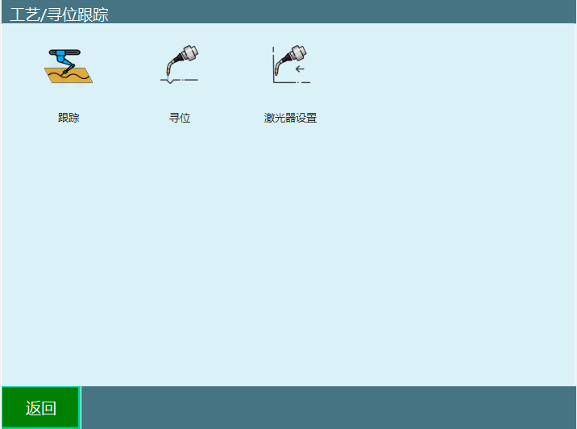

进入“激光器设置/激光器配置/”设置激光器与控制器的通讯。如下图：

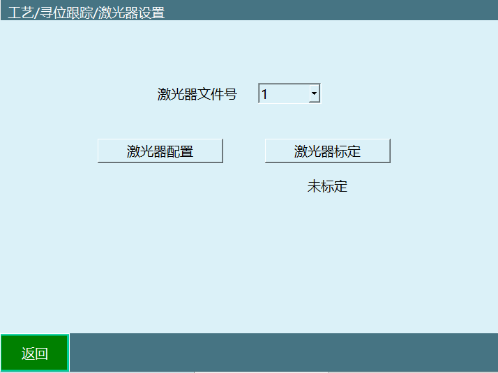

**参数介绍**（图示见下方）

**激光器厂家**:选择对应使用的激光器设备名称。

**设备号**：对应的上位机设备。

**通讯方式介绍**:通过modbus通讯或网络通讯。

**IP**:连接的上位机IP，需要保证控制器、上位机、示教盒在同一网段才能连接。

**端口号**:示教盒和上位机端口号需要一致。

**通讯状态**：在激光器打开时会显示已连接。

**读写超时时间**：激光器读写多少秒后还没有收到数据就会超时。

**读写周期**：上位机每多少毫秒进行一次读写数据。

**激光器返回值比例系数**：实际坐标值和激光器返回的坐标值的比例。

**响应超时**：与激光器通讯中，机器人查询命令与激光器响应命令之间的超时时间。

**焊缝样式任务号**：与上位机焊缝任务号对应（仅用于激光标定）

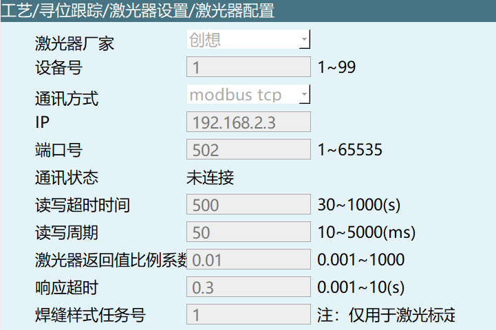

进入“激光器设置/激光器标定对激光器进行标定，根据图示标定出七个点，刚进入时右下角会弹出小白条提示激光器连接成功，如果提示初始化失败或连接失败就要检查激光器配置中的厂家、ip、端口号有没有设置对。

标定时要保证焊缝面与激光器平行，并且激光一定要垂直于焊缝，标定过程当中需要保持姿态不变，同时要确定标定的每一个点在对应厂家的调试软件中可以看到焊缝和激光器的交点且不抖动。标定完七点后可以运动至此进行检查，无误后点击计算，如果发现寻位过程中点位不准确就需要重新标定激光器或工具手。具体界面如下图所示：

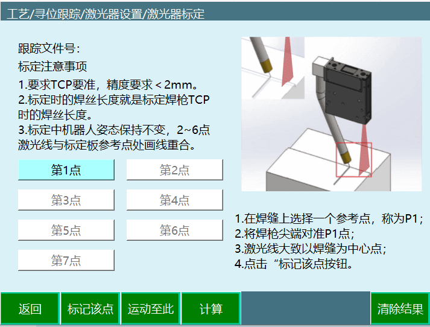

# 寻位工艺

进入“寻位/【线激光】寻位参数进行参数设置，如图所示：

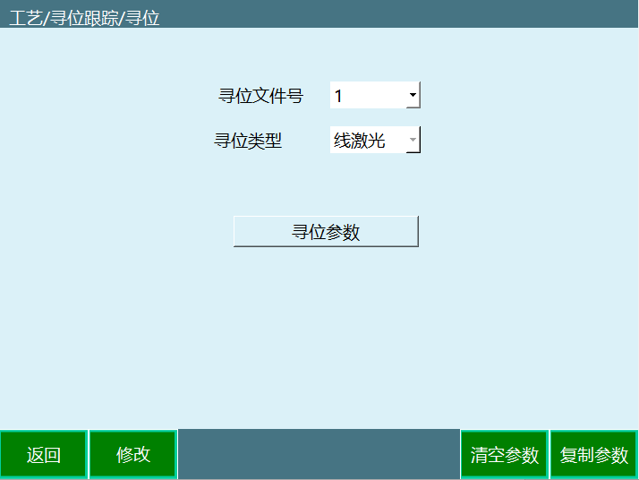

## 线激光寻位参数说明

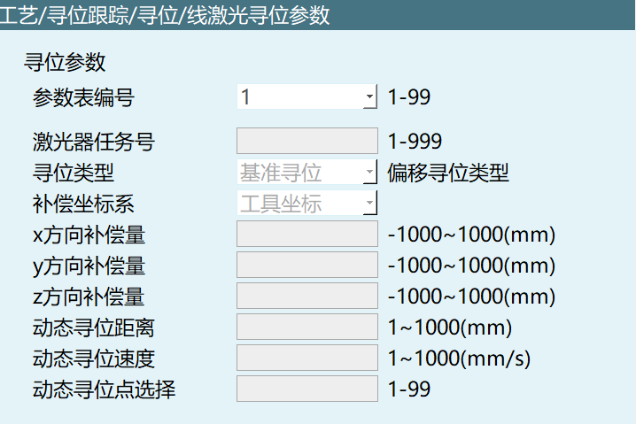

**参数表编号**：类似于其他工艺的工艺号，可以保存不同用户的参数，可以在指令中选择。

**激光器任务号**：对应之前的设备号。

**寻位类型**：

基准寻位在标定好寻位的点后机器人会根据寻位到的点转化为变量通过指令插入并走到该点位。

修正寻位在基准寻位的基础上根据工件或焊缝的需求，选择1-4点的方法进行基准寻位后，根据不同的点位数可以让焊缝在平面上进行左右平移、旋转后，机器人工具手依然可以找到并跟随该焊缝，通常用于同一批次大量相同工件的焊接上。

**补偿坐标系**：需要补偿时可选择的坐标系，工具坐标、直角坐标。

**X方向补偿量**：在激光器识别的焊缝位置工具坐标系下补偿一定长度。

**y方向补偿量**：在激光器识别的焊缝位置工具坐标系下补偿一定长度。

**z方向补偿量**：在激光器识别的焊缝位置工具坐标系下补偿一定长度。

**动态寻位距离**：机器人动态寻位的距离，需要目测多远能到达焊缝否则无法寻找到焊缝。

**动态寻位速度**：动态寻位时的速度。

**动态寻位点选择**：根据读写周期和动态寻位距离算出改距离内激光器会读取到多少点位，还有激光器刚接触到焊缝时会存在高度误差或其他方向的非焊缝间隙的干扰，就要过滤掉这些点位，动态寻位才能准确的找到焊缝。

## 激光寻位跟踪

### 单点寻位

单点寻位（二点、三点、四点寻位就是在寻位开始和结束之间插入对应个数的静态寻位指令，保证每个静态寻位之前都有一个运动点并且要使激光机在上位机上可以找到焊缝）单点寻位功能主要用于机器人和激光器标定之后，用于检测标定精度；实现方法是通过激光取点把数据给到机器人，然后机器人到点。如下图所示：
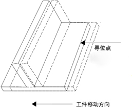

**指令内容介绍**：（指令界面见下方）

**寻位开始**：打开激光器。

**静态寻位**：将激光器找到的焊缝保存到一个变量中，方便以后进行计算或直接运动到点。

**寻位结束**：关闭激光器，文件号要和开始一样。

**直线**：运行到之前寻位的点位。

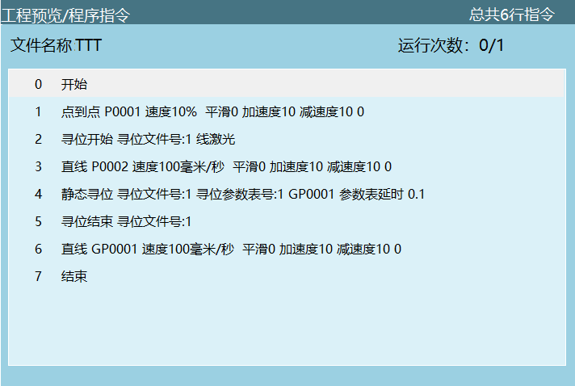

### 两点寻位

两点寻位功能主要用于间断焊，直焊缝这种应用场景，通过激光取两个点并把点位数据给到机器人，机器人走两点形成直线，在指令中需要两个静态寻位点。示意图如下所示：

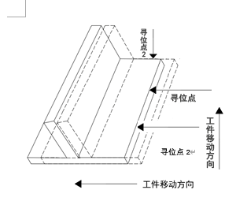

**指令内容介绍**：（指令界面见下方）

**寻位开始**：打开激光器。

**静态寻位**：将激光器找到的焊缝保存到一个变量中，方便以后进行计算或直接运动到点。

**寻位结束**：关闭激光器，文件号要和开始一样。

**直线**：运行到之前寻位的点位。

两点寻位变姿态功能:

两点寻位变姿态指的是寻位一个姿态，焊接一个姿态，主要用于寻位姿态在焊接时与工件有干涉，通过改变姿态来解决这种问题，指令与两点寻位相同，只有寻位时机器人姿态不同，或者通过自定义姿态运行。如下所示：

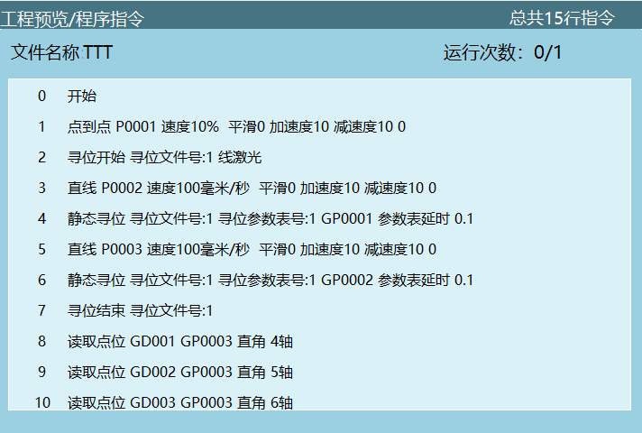

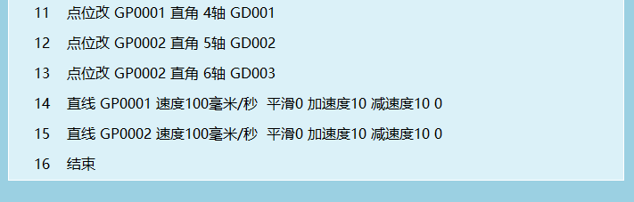

说明：机器人的姿态改变路径为：变量>全局位置变量>找到自己设置的全局位置变量参数GP003>调到自己想应用的姿态>点击写入当前位置，此处用到的全局位置与寻位点位不冲突，将GP0003的ABC姿态数值取出来赋值到运行的点位GP0001或GP0002中，如上图所示。

### 三点圆弧功能

指的是激光在圆弧上寻三个点，然后用圆弧指令三点构成一段圆弧，主要用于圆弧工件焊接场景。示意图如下：

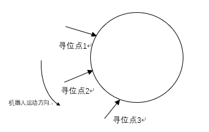

**指令内容介绍**：（指令界面见下方）

**寻位开始**：打开激光器。

**静态寻位**：将激光器找到的焊缝保存到一个变量中，方便以后进行计算或直接运动到点。

**寻位结束**：关闭激光器，文件号要和开始一样。

**圆弧**:将之前三点寻位保存的变量代入到圆弧指令中，使机器人按照寻位的点位走圆弧。如上图。

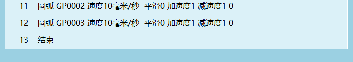

### 三点寻位算坐标系

三点寻位是在工件相交的两边取三个点，通过这三个点算出用户坐标系，此方法用于大部分焊接情况      如果算出的用户坐标系与原有的用户坐标系不同，那么原有的用户坐标系中的点位或焊缝就跟变成算出的用户坐标系的点位或焊缝，三点偏移支持一点、两点偏移的功能和旋转偏移。
下图是三点寻位的示意图：

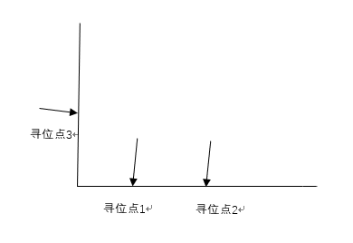

**指令内容介绍**（指令界面见下方）

**寻位开始**：打开激光器。

**静态寻位**：将激光器找到的焊缝保存到一个变量中，方便以后进行计算或直接运动到点。

**寻位结束**：关闭激光器，文件号要和开始一样。

**寻位计算**：选择3点计算用户坐标系，使用之前寻到的三个变量计算出用户坐标系1。

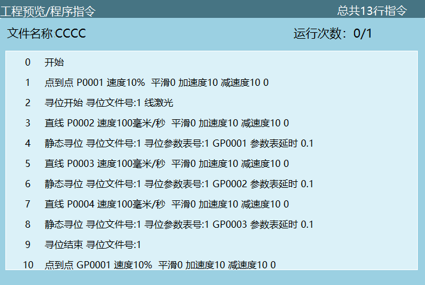

### 四点寻位算坐标系

四点寻位功能指的是在工件上取四个点，任意一条边取两个点，通过计算得出用户坐标，从而实现每次四点寻位都会得出一个新的用户坐标，但用户坐标内的轨迹不会改变。四点寻位时如果寻的每两个点不在工件同一平面内，那么就可以算出工件的整体大小，进而算出工件整体的用户坐标系。
下图为四点寻位示意图：

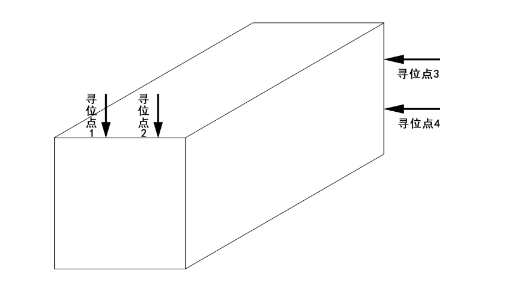

**指令内容介绍**：（指令界面见下方）

**寻位开始**：打开激光器。

**静态寻位**：将激光器找到的焊缝保存到一个变量中，方便以后进行计算或直接运动到点。

**寻位结束**：关闭激光器，文件号要和开始一样。

**寻位计算**：选择4点计算用户坐标系，使用之前寻到的四个变量计算出用户坐标系2。

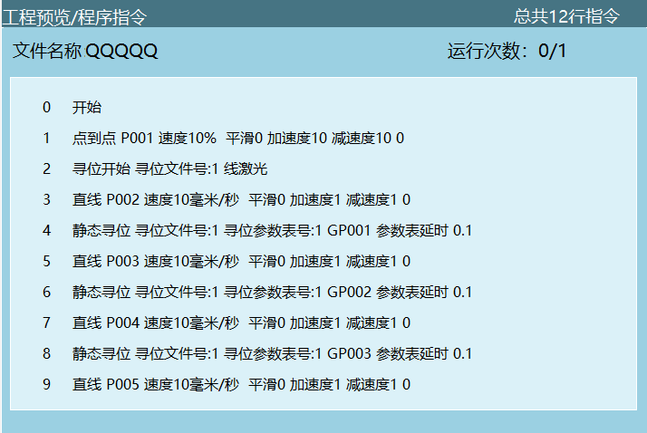

### 四点确定两条直线计算交点

四点确定两条直线计算交点是在工件相交的两边取四个点，一边的两个点确定一条直线，通过另外一边确定一条直线，计算两条直线的垂直数值记录在全局变量。
示意图如下所示：

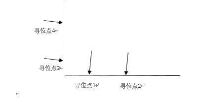

**指令内容介绍**：（指令界面见下方）

**寻位开始**：打开激光器

**静态寻位**：将激光器找到的焊缝保存到一个变量中，方便以后进行计算或直接运动到点

**寻位结束**：关闭激光器，文件号要和开始一样

**寻位计算**：选择4点确定两条直线计算交点，通过GP0001、GP0002、GP0003、GP0004点位数据计算出投影点GP0005

**直线**：运行到计算到的交点。

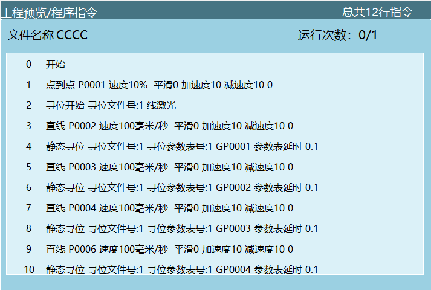

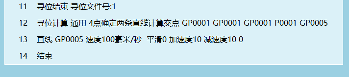

### 三点计算投影点

三点计算投影点是在工件相交的两边取三个点，一边的两个点确定一条直线，通过另外一边的一个点在直线上的投影点确定垂直，数值记录在全局变量。
示意图如下：

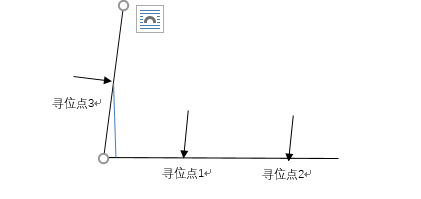

**指令内容介绍**：（指令界面见下方）

**寻位开始**：打开激光器。

**静态寻位**：将激光器找到的焊缝保存到一个变量中，方便以后进行计算或直接运动到点。

**寻位结束**：关闭激光器，文件号要和开始一样。

**寻位计算**：选择3点计算投影点，通过GP0001、GP0002、GP0003点位数据计算出投影点GP0004。

**直线**：运行到计算出的投影点 

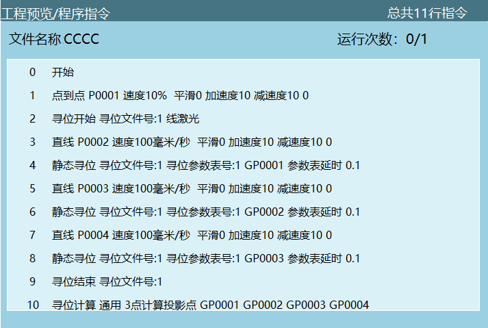

### 向量计算

**指令内容介绍**：

**寻位开始**：打开激光器。

**静态寻位**：将激光器找到的焊缝保存到一个变量中，方便以后进行计算或直接运动到点。

**寻位结束**：关闭激光器，文件号要和开始一样。

**寻位计算**：选择向量计算，通过GP0001向GP0002方向选取10mm计算出GP0003。

**直线**：运行到计算出的向量点。

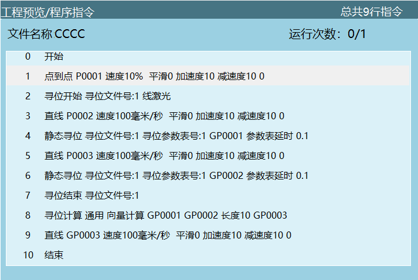

### 四点计算平面用户坐标系

**测试的目的与效果**：通过物件的影子倒映在平面上，计算出以影子为基础的一个新用户坐标。

**测试过程**：  
1.首先要在需要找一个固定的平面，标定一个最基本的用户坐标1，如图所示。

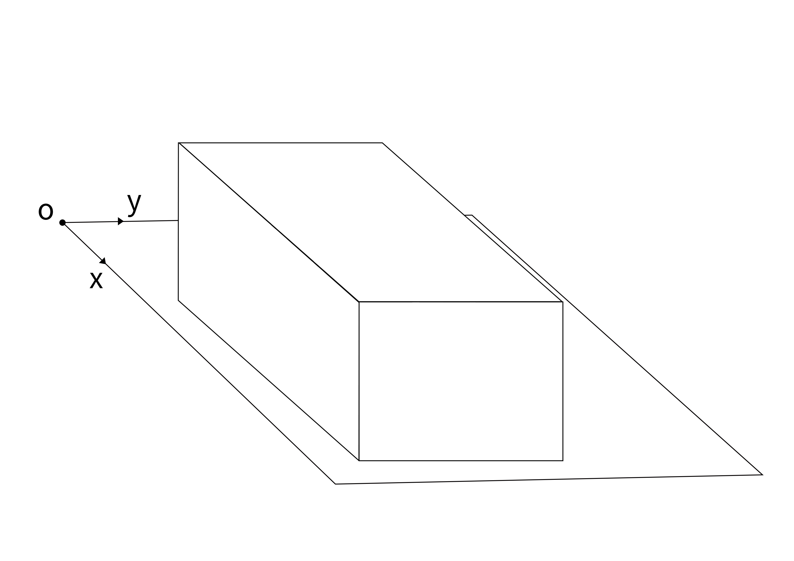

2.工件上找出两个相邻且相交的边，并在每个边上用激光标定两个点位，共标定四个点位a1、b1、c1、d1（用激光单点寻位标定每个点），如下图所示；四点标定结束后进行计算，得出用户坐标2；需在当前的工件上寻找一条焊缝L1进行标定（用直线）。

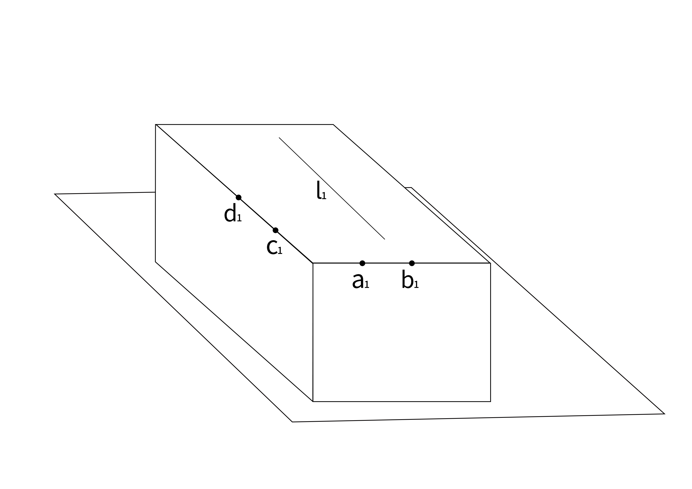

3.以上2点结束后，偏移或旋转工件，在前面标定过的四点位置上进行第二次标定a2,b2,c2,d2;计算出用户坐标3。

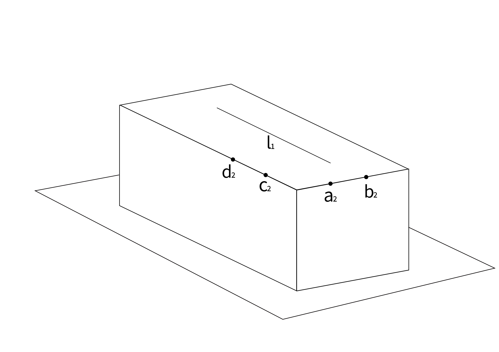

**说明**：以上操作必须是在用工具手的情况下运行的。

**测试的指令运用**：

以下图示是用户坐标2的插指令程序过程

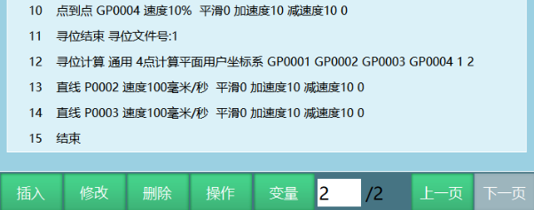

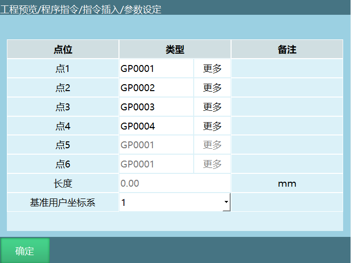

以下图示是用户坐标3的指令编写过程

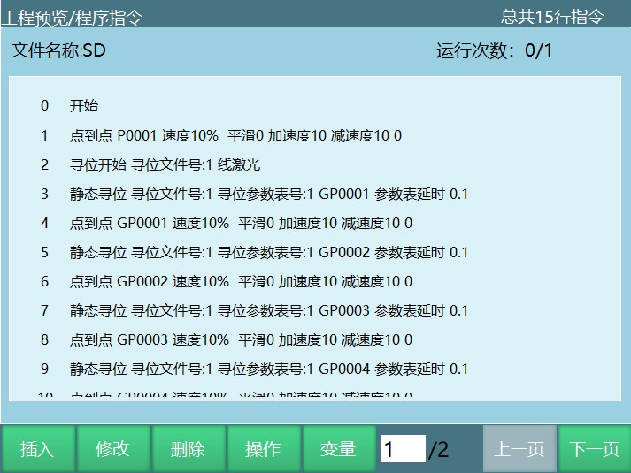

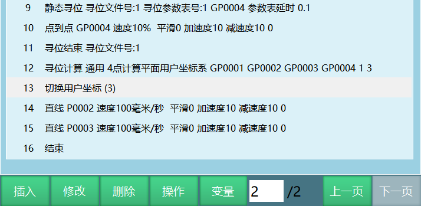

## 寻位偏移

说明：所有偏移都需要先基准寻位再修正寻位。

### 一维偏移
使用案例：在单点寻位后，工件只能往一个方向移动，寻位方向必须与偏移方向相同。

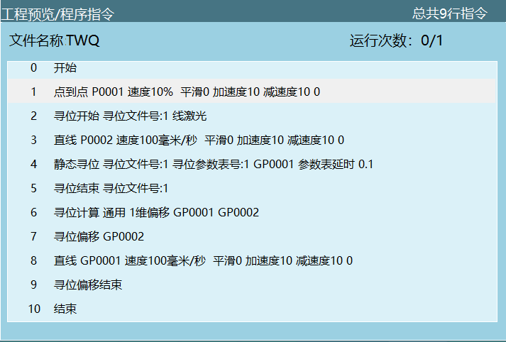

**指令内容介绍**：

**寻位开始**：打开激光器。

**静态寻位**：将激光器找到的焊缝保存到一个变量中，方便以后进行计算或直接运动到点。

**寻位结束**：关闭激光器，文件号要和开始一样。

**寻位计算**：根据寻位的点位和实际情况选择几维偏移，偏移G001，偏移量为G002。

**寻位偏移**：偏移是在大量工件焊接时使用偏移指令来补偿误差，单点至四点偏移有不同的用法，根据实际情况而定，使用计算出的GP0002偏移量算出GP0001偏移后的点位，GP0001可以换成需要的焊缝。

### 二维偏移

在进行二点寻位后，在工件不进行旋转的情况下，只发生XY方向的偏移。

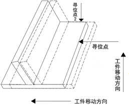

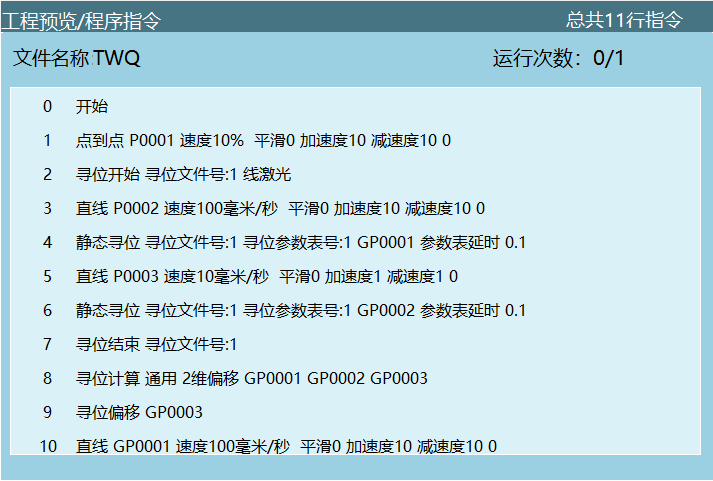

**指令内容介绍**：

**寻位开始**：打开激光器。

**静态寻位**：将激光器找到的焊缝保存到一个变量中，方便以后进行计算或直接运动到点。

**寻位结束**：关闭激光器，文件号要和开始一样。

**寻位计算**：根据寻位的点位和实际情况选择几维偏移，偏移GP0001，偏移量为GP0003。

**寻位偏移**：偏移是在大量工件焊接时使用偏移指令来补偿误差，单点至四点偏移有不同的用法，根据实际情况而定，使用计算出的GP0003偏移量算出GP0001偏移后的点位，GP0001可以换成需要的焊缝。

### 二维偏移+旋转

在进行三点寻位后，工件可以进行整体的旋转且XY方向都可以进行偏移，第一次进行基准寻位，第二次发生偏移时进行修正寻位。

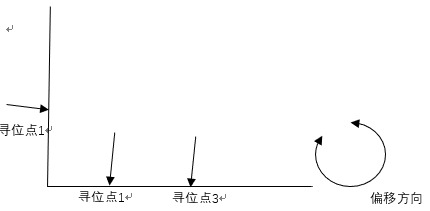

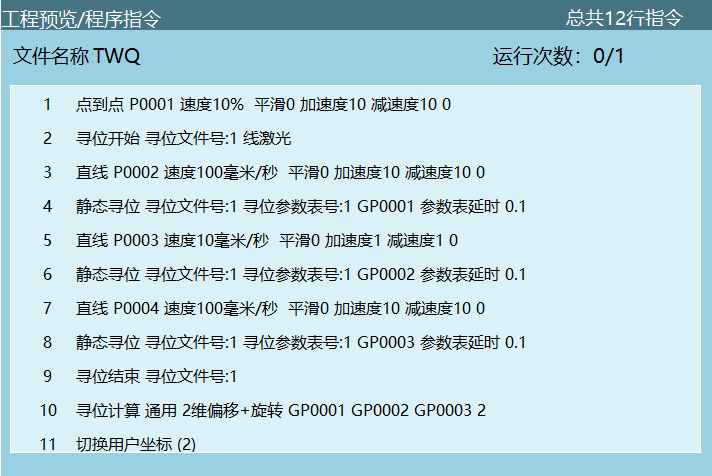

**指令内容介绍**：

**寻位开始**：打开激光器。

**静态寻位**：将激光器找到的焊缝保存到一个变量中，方便以后进行计算或直接运动到点。

**寻位结束**：关闭激光器，文件号要和开始一样。

**寻位计算**：选择2维偏移+旋转，偏移P0005，三点计算用户坐标。

切换用户坐标系2：切换到算出的用户坐标系。

**直线**：此时的P0005为提前示教好的用户点位，会根据每次计算出的用户坐标不同而进行偏移，P0005可以换成需要的焊缝。

### 三维偏移（保留基准用户坐标系）

在进行三点寻位或四点寻位后，工件可以进行整体的旋转且XY方向都可以进行偏移，需要用到两个作业文件。

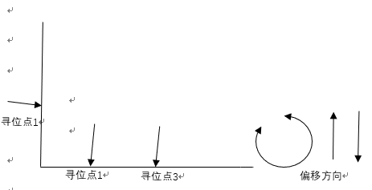

**指令内容介绍**：

**寻位开始**：打开激光器。

**静态寻位**：将激光器找到的焊缝保存到一个变量中，方便以后进行计算或直接运动到点。

**寻位结束**：关闭激光器，文件号要和开始一样。

**寻位计算**：选择3点计算用户坐标系，输出用户坐标系2。

程序修改方式：

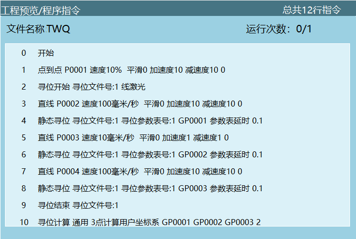

此时需要第二个作业文件，因为上一个作业文件是基础用户坐标系，下一个作业文件就是计算偏移后的用户坐标系，可以复制该文件然后再加上以下指令

在第二个作业文件中一定要计算出新的用户坐标系且切换成新的用户坐标系才可以根据用户坐标系之间的不同进行偏移，P0005必须是在第一次运行后算出的用户坐标系3下进行示教，必须为用户点，P0005可以换成需要的焊缝，之后无论工件怎么旋转，只要激光能够寻位到3点，就可以计算出偏移以后的P0005，最后运行完需要恢复到初始坐标系2，以防影响后面的用户点位。

## 电弧寻位

进入“工艺/寻位跟踪/寻位/【触碰】寻位参数”设置寻位参数，如图所示：

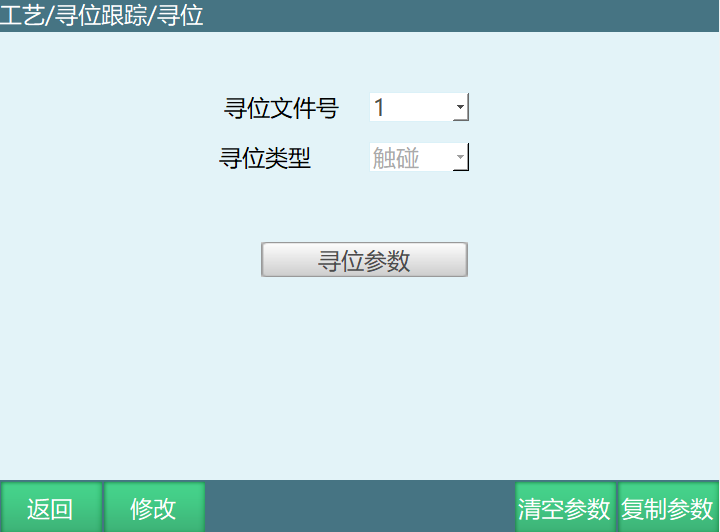

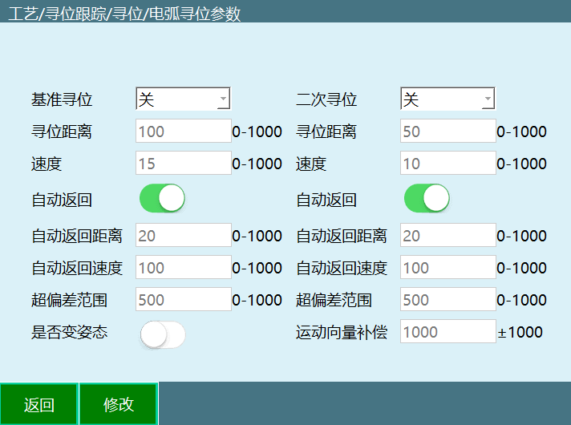

**参数介绍**：

**寻位文件号**：对应指令文件号。

**基准寻位**：进行第一次寻位。

**二次寻位**：在某些情况下基准寻位不是很准确或某些厂家基准寻位过快时使用二次寻位。

**寻位距离**：从指令寻位开始点运动的距离。

速度：寻位时的速度。

**自动返回**：在焊枪触碰到寻位点后返回。

**自动返回距离**：从触碰到工件开始往回走的距离。

**是否变姿态**：进行两点简易触碰寻位计算时打开。

**运动向量补偿**：进行两点简易触碰寻位计算时，反向补偿0~5mm，防止焊丝戳进焊缝中。

**电弧寻位点位介绍：** 

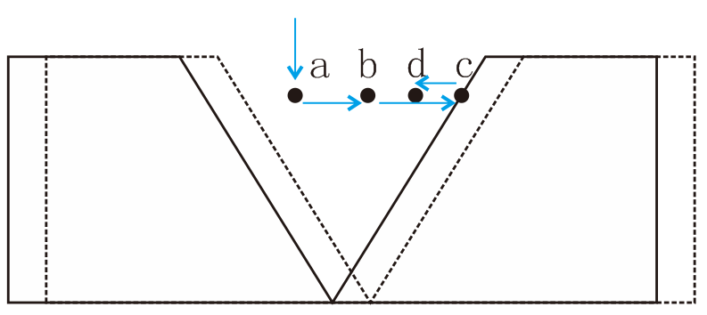

如图：a点动态寻位准备点；b点动态寻位开始点；机器人沿向量ab方向运动寻位，焊丝触碰工件立即停止表示寻到位置；寻位距离（b点为起始点）、速度在工艺参数中设置。
若要求寻位后自动返回，则机器人会自动从c返回d（返回距离，速度在参数中设置）。电弧寻位工艺参数中选择：基准寻位，配置其它参数；运行程序，程序会停止在寻位计算指令（正常），参数中关闭基准寻位开关。再次运行程序。

## 电弧寻位使用类型与示例

### 平面两点计算新用户坐标系

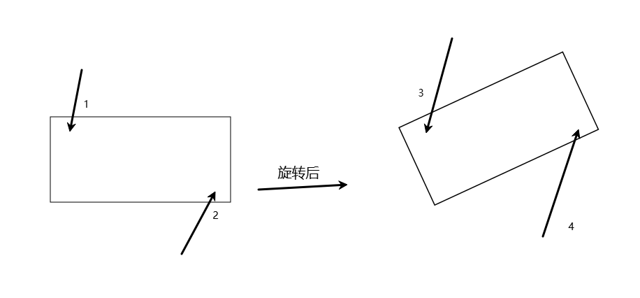

**操作过程**：

工件偏移前先进行用户标定

使用视觉拍照，工件偏移之前以两个点为基准点保存到变量里

偏移之后再次进行拍照一共4个点，以这4个点计算出新的用户坐标系

根据工件来选择点位如下图所示，具体点位以实际情况做调整 。

**指令如下所示**：

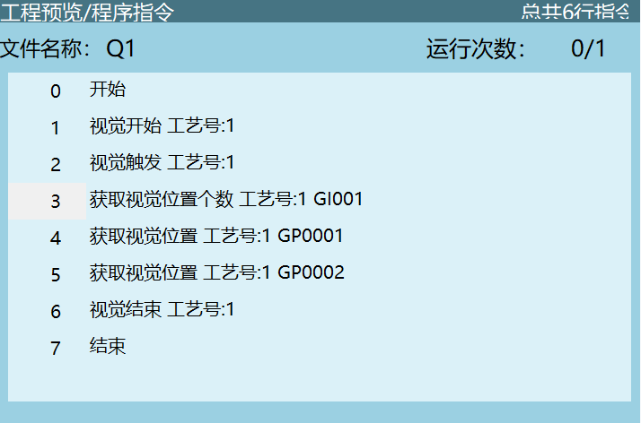

第一次先进记录基准点保存到全局位置变量

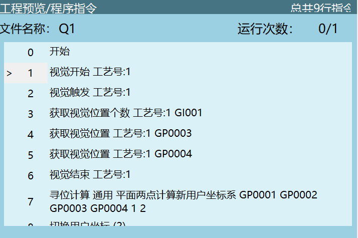

第二次工件偏移之后再次记录刚才两个点保存到不同的全局位置变量里，然后以保存的四个点计算出新的用户坐标系

 ###  2点简易触碰寻位

 操作过程：先以垂直于角焊缝一面的方向动态寻位触碰点G001，再以垂直于角焊缝另一面的方向动态寻位触碰点G002，然后用寻位计算指令通过GP001,GP002两点计算出焊缝点GP003,焊缝点的姿态与GP001一致。

 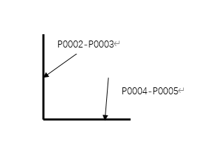

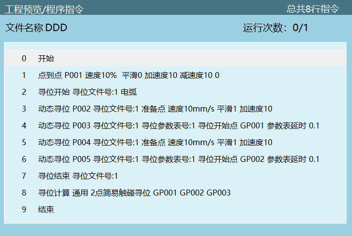

**指令参数介绍**:

**寻位开始**：打开电弧信号。

**动态寻位**：将电弧找到的点保存到一个变量中，方便以后进行计算或直接运动到点。

**寻位结束**：关闭电弧信号，文件号要和开始一样。

**寻位计算**：将GP001,GP002,寻到的点位保存到标量GP003最终计算出角焊缝焊缝点GP003。

 ### 3维偏移+旋转

操作过程：需要在一个平面上触碰寻位得出三点后在沿边根据实际需要的用户坐标系进行触碰寻点，一共六点如下图所示：

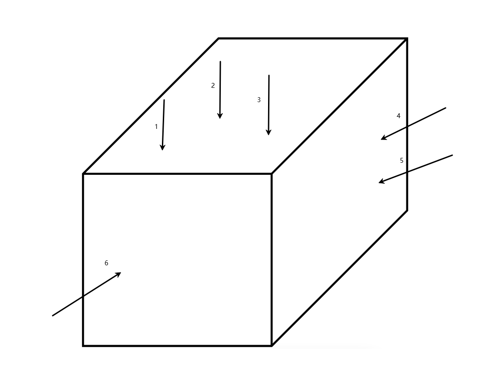

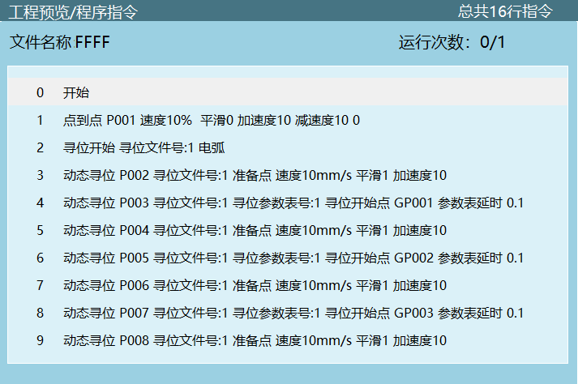

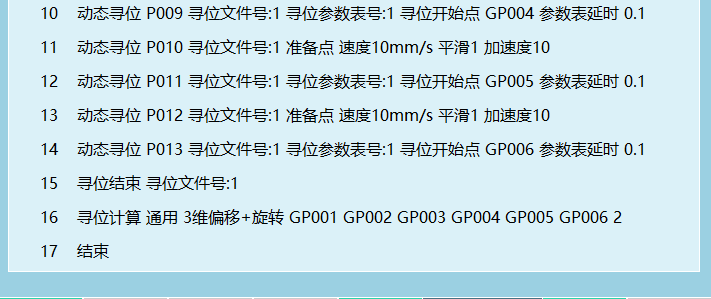

中间需要根据实际情况增加点到点或直线做为路径辅助点，将动态寻位寻到的六个点通过寻位计算3维偏移+旋转指令得出用户用户坐标系，如果需要偏移，后续方法四点寻位相同，再创建一个相同作业文件并示教出焊缝通过切换用户坐标系进行偏移。

# 激光跟踪工艺

参数设置：进入“工艺/寻位跟踪”设置参数，文件号对应指令中的文件号，激光器根据实际使用来选择。

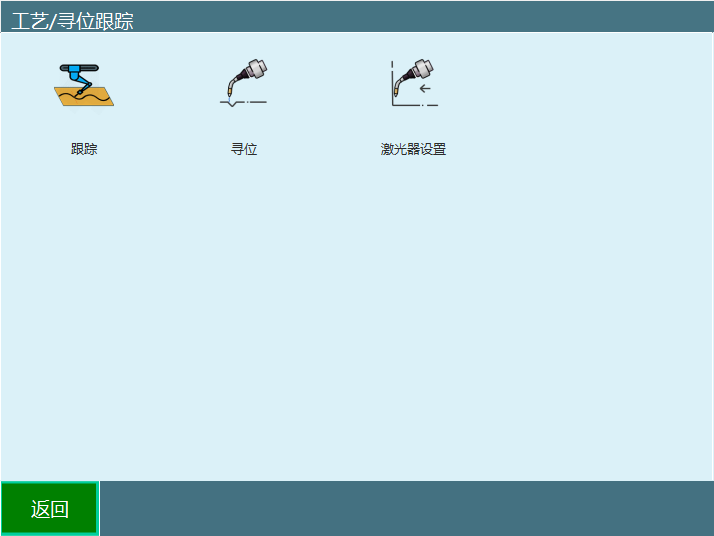

进入“寻位跟踪/激光器设置/激光器配置”设置激光器与控制器的通讯。 

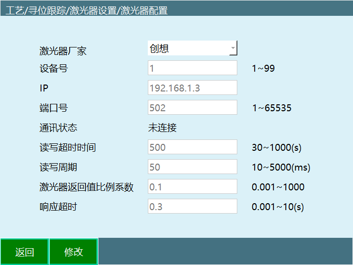

**激光器厂家**：根据激光器型号选择厂家。

**设备号**：对应的上位机设备。

**IP**：连接的上位机IP，需要保证控制器、上位机、示教盒在同一网段才能连接。

**端口号**：示教盒和上位机端口号需要一致。

**通讯状态**：在激光器打开时会显示已连接。

**读写超时时间**：激光器读写多少秒后还没有收到数据就会超时。

**读写周期**：上位机每多少毫秒进行一次读写数据。

**激光器返回值比例系数**：实际坐标值和激光器返回的坐标值的比例。

**响应超时**：与激光器通讯中，机器人查询命令与激光器响应命令之间的超时时间。

进入“寻位跟踪/激光器设置/激光器标定”对激光器进行标定。

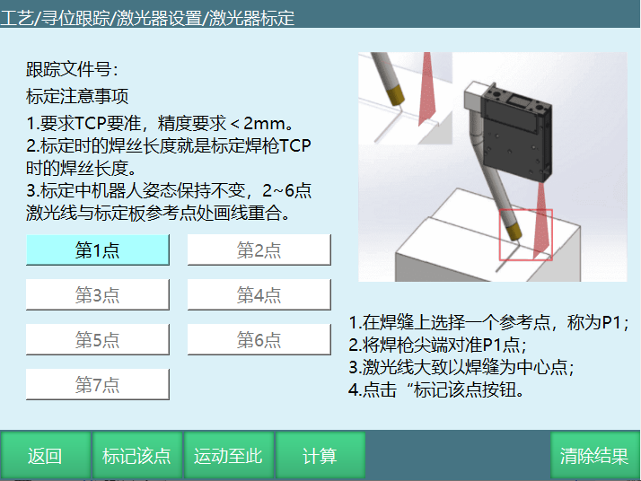

根据图示标定出七个点，标定时要保证焊缝面与激光器平行，并且激光一定要垂直于焊缝，标定过程当中需要保持姿态不变，同时要确定标定的每一个点在对应厂家的调试软件中可以看到焊缝和激光器的交点且不抖动。标定完七点后可以运动至此进行检查，无误后点击计算，如果发现寻位过程中点位不准确就需要重新标定激光器或工具手。

进入“寻位跟踪/跟踪/线激光跟踪参数”进行参数设置，如图：

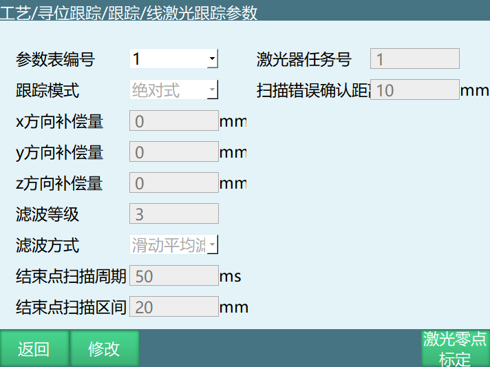

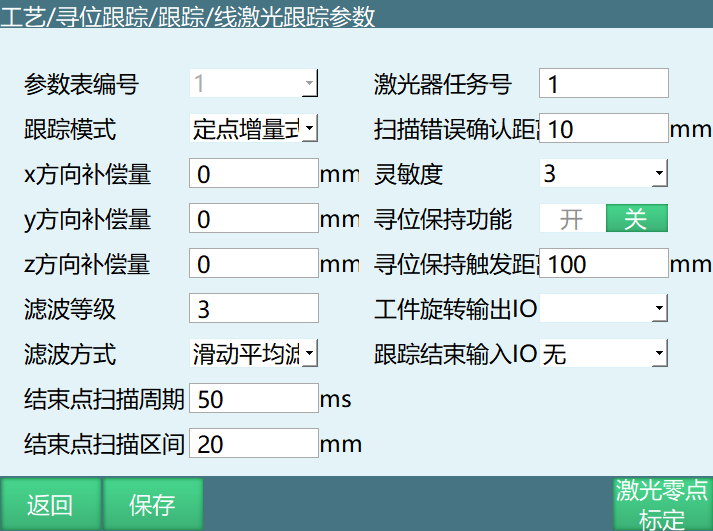

## 线激光参数介绍

**参数表编号**：类似于其他工艺的工艺号，可以保存不同用户的参数，可以在指令中选择。

**激光器任务号**：对应之前的设备号。

**跟踪模式**：分为三种类型

绝对式：就是精确跟踪精确跟踪在已知焊缝情况下，通过寻位起始点或直接运动到焊缝附近进行精确跟踪，精确跟踪可以确保在跟踪过程中焊缝发生偏移或工具手变更姿态只要激光器能识别到焊缝就可以准确的使工具手沿焊缝运动（暂时只支持直线运行）。

定点增量式：焊枪停在工件焊缝上方，外部控制工件旋转一周，完成环缝焊接。在这个过程中根据激光扫描数据实时纠偏。

行走增量式：焊枪按示教的焊接轨迹运动，完成焊接。在这个过程中把扫描偏差实时计算补偿到原运动轨迹上。

灵敏度：增量式跟踪时激光器灵敏度。

**X方向补偿量**：在激光器识别的焊缝位置工具坐标系下补偿一定长度。

**Y方向补偿量**：在激光器识别的焊缝位置工具坐标系下补偿一定长度。

**Z方向补偿量**：在激光器识别的焊缝位置工具坐标系下补偿一定长度。

**寻位保持功能**：在模糊跟踪时根据示教的焊缝补差到一定位置后一直在该位置进行跟踪。

**寻位保持触发距离**：在模糊跟踪时的补差距离，适用于短焊缝。

**滤波方式**：平滑传感器数据的滤波算法方式。

**滤波等级**：等级越低越平滑，越滞后。

**扫描错误确认距离**：跟踪过程中，传感器连续扫描失败同时机器人运动一定距离后，报错停止。

**结束点扫描周期**：扫描的周期，一般周期更小，小于30ms。

**结束点扫描区间**：设置示教结束点前后一段距离作为扫描区间。

**工件旋转输出IO**：焊接起弧成功后 ， 通知第三方工件旋转的信号 (只存在定点增量式中)。

**跟踪结束输入IO**：工件焊接完成，第三方通知跟踪系统结束跟踪信号(只存在定点增量式中)。

## 激光标定零点

### 参数介绍

**标定**：标定激光坐标零点；以激光线与焊缝的相对位置为纠偏的基准(标定时焊枪对准焊缝进行标定)。

**运行到标定点**：将机器人运行到标定的点。

**清除标定**：清除标定的结果。

激光零点标定界面如下图所示：

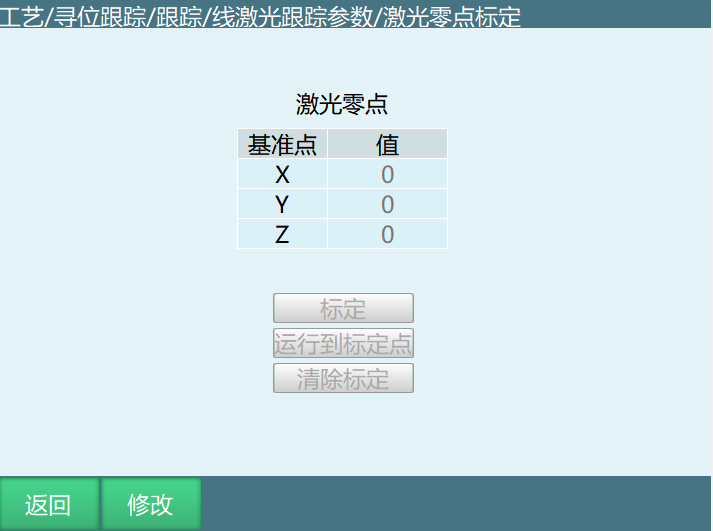

## 跟踪使用案例

### 绝对式跟踪

 通过示教一条直线确定焊缝方向，在通过激光器进行扫描实时跟踪，确保焊枪可以保持在已识别的焊缝上进行焊接作业，和寻位同理焊枪也可以在跟踪时进行变更姿态，如果需要变更姿态，只需要在示教的点位变更姿态即可。指令界面如下图所示：

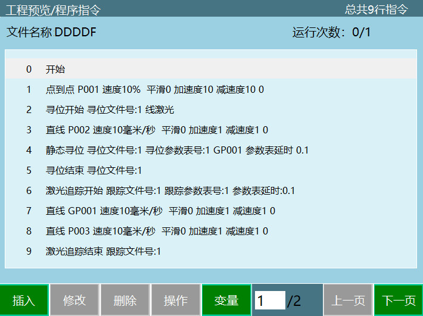
**指令内容介绍**：

**寻位开始**：打开激光器。

**静态寻位**：将激光器找到的焊缝保存到一个变量中，方便以后进行计算或直接运动到点。

**寻位结束**：关闭激光器，文件号要和开始一样。

**激光追踪开始**：打开激光器。

**直线**：运行到之前寻位的点位。

**直线**：GP001为起始点，P003为结束点，PL必须为5，如果出现明显加减速情况，请到激光器配置中修改读写周期至不停顿为止。
激光追踪结束：关闭激光器，文件号要和开始一样。

### 定点增量式

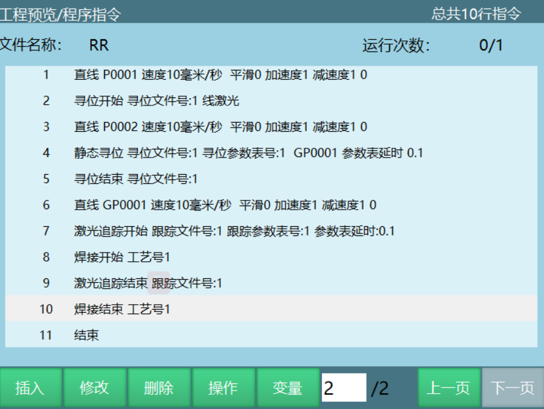

**指令内容介绍**：

**直线**：开始点。

**寻位开始**：打开激光器。

**直线**：需要寻位的点(激光线大致在焊缝起始点)。

**静态寻位**：将激光器找到的焊缝保存到一个变量中，方便以后进行计算或直接运动到点(GP001)。

**寻位结束**：关闭激光器，文件号要和开始一样。

**直线(GP001)**：运行到之前寻位的点位(焊缝起始点)。

**激光追踪开始**：激光传感器初始化，原地纠偏，并启动跟踪任务。

**焊接开始**：焊接开始，第三方给起弧信号。

**激光追踪结束**：关闭激光器，文件号要和开始一样。

**焊接结束**：焊接结束，第三方执行灭弧操作。

### 行走增量式

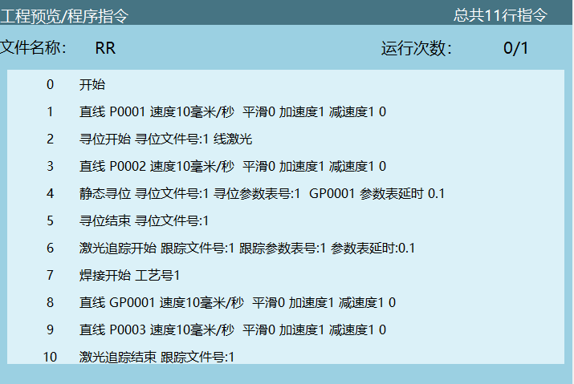

**指令内容介绍**：

**直线**：开始点。

**寻位开始**：打开激光器。

**直线**：需要寻位的点(激光线大致在焊缝起始点)。

**静态寻位**：将激光器找到的焊缝保存到一个变量中，方便以后进行计算或直接运动到点(GP001)。

**寻位结束**：关闭激光器，文件号要和开始一样。

**激光追踪开始**：激光传感器初始化，原地纠偏，并启动跟踪任务。

**焊接开始**：焊接开始，给起弧信号。

**直线(GP001)**：运行到之前寻位的点位(焊缝起始点)。

**直线**：GP001为起始点，P003为结束点，PL必须为5，如果出现明显加减速情况，请到激光器配置中修改读写周期至不停顿为止。
**激光追踪结束**：关闭激光器，文件号要和开始一样。

**焊接结束**：焊接结束，执行灭弧操作。

# 电弧跟踪

电弧跟踪主要适用于角焊缝以及V型坡口焊缝的摆焊轨迹纠偏，常用于机器人焊接工艺中的中厚板焊接，用以纠正大电流焊接过程中导致的工件形变和部分工件组对误差。

### 参数配置

进入“工艺/寻位跟踪/跟踪”界面，如下图所示，需要依次设置通讯参数、左右补偿参数和高低补偿参数。 

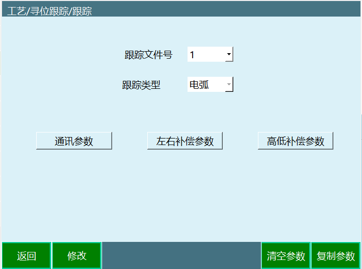

### 通讯参数

进入“通讯参数”界面，如下图所示，各参数意义如下：

**采样周期**：摆焊过程中采集电流电压信号的时间周期，建议周期 2ms~20ms。

**采样数据类型**：摆焊过程中，选择电压/电流中波动较大的那个，奥太与麦格米特建议选电流。

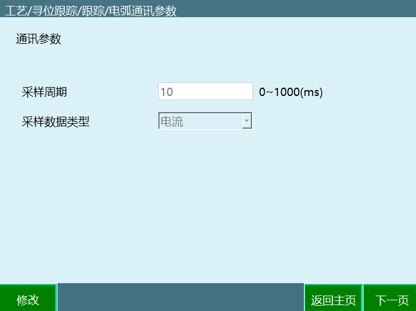

### 左右补偿参数

左右补偿是指摆动平面上摆弧轨迹的左右补偿。进入“左右补偿参数”界面，如下图所示，各参数意义如下：

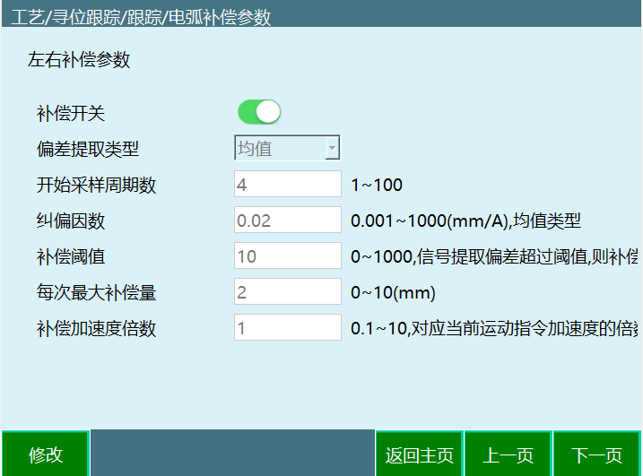

**补偿开关**：表示摆焊中是否进行左右纠偏。若只有高低偏差的V型坡口焊缝摆焊可以关闭。

**偏差提取类型**：目前仅支持均值算法。

**开始采样周期数**：摆焊开始几个周期电流信号无明显变化，无效，一般从第3~5个周期开始采样。

**纠偏因数**：每1A的电流偏差补偿长度，一般焊接电流大，偏差值大，则该值设小；反之设大该值。建议值：0.01~0.5。

**补偿阈值**：电流信号偏差超过阈值则补偿，否则不补偿。建议值为10，焊接电流大则调大，焊接电流小则设小。

**每次最大补偿量**：单个周期提取偏差补偿一次，每次补偿的最大长度，该最大补偿量为防止采样中有超大电流造成过度补偿。

**补偿加速度倍数**：左右补偿量的加速度，对标纠偏因数，纠偏因数大则设大，纠偏因数小则设小。建议值1。

### 高低补偿参数

高低补偿是指摆动平面法向方向上的补偿。进入“高低补偿参数”界面，如下图所示，各参数意义同左右补偿参数，一般工况左右补偿大，高低补偿小，所以补偿量相关参数可以适当调小。

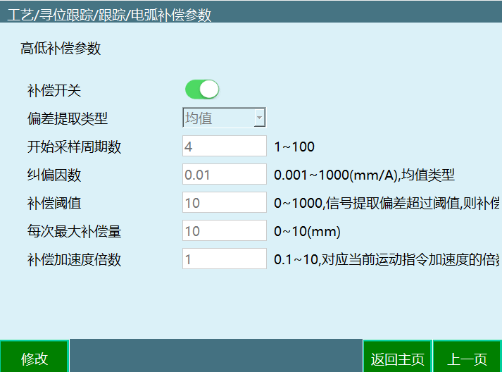

**补偿开关**：表示摆焊中是否进行左右纠偏。若只有高低偏差的V型坡口焊缝摆焊可以关闭。

**偏差提取类型**：目前仅支持均值算法。

**开始采样周期数**：摆焊开始几个周期电流信号无明显变化，无效，一般从第3~5个周期开始采样。

**纠偏因数**：每1A的电流偏差补偿长度，一般焊接电流大，偏差值大，则该值设小；反之设大该值。建议值：0.01~0.5。

**补偿阈值**：电流信号偏差超过阈值则补偿，否则不补偿。建议值为10，焊接电流大则调大，焊接电流小则设小。

**每次最大补偿量**：单个周期提取偏差补偿一次，每次补偿的最大长度，该最大补偿量为防止采样中有超大电流造成过度补偿。

**补偿加速度倍数**：左右补偿量的加速度，对标纠偏因数，纠偏因数大则设大，纠偏因数小则设小。建议值1。

## 跟踪使用案例

### 直线摆焊跟踪

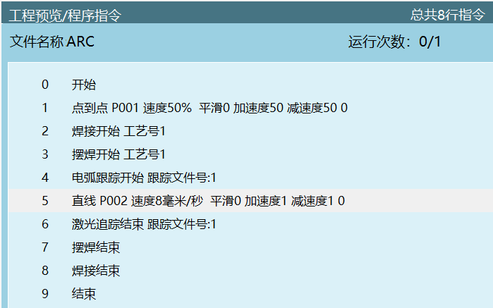

 ### 圆弧摆焊跟踪

 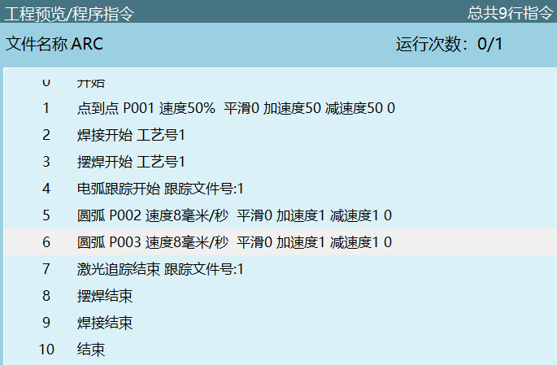

注：P001，p002，P003分别为圆弧上3个点。

 # 弧压跟踪

  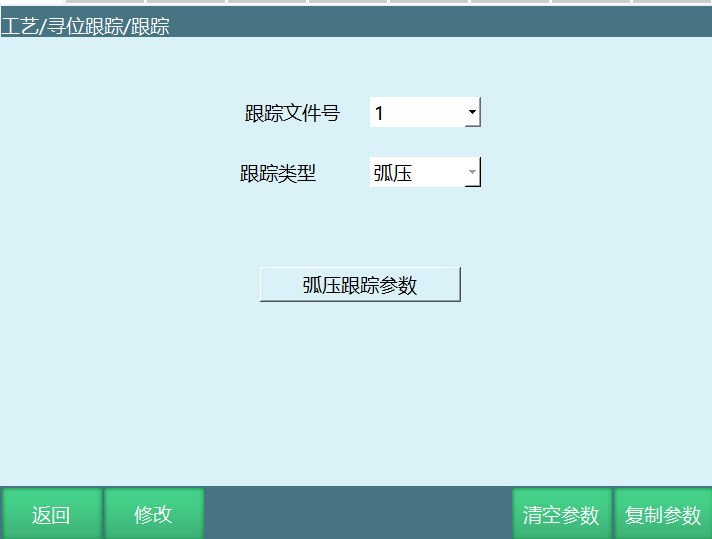

**清空参数**：清空当前跟踪文件号里面设置的参数值。

**复制参数**：将当前跟踪文件号里面设置的参数值复制到你想要工艺号里面。

## 弧压跟踪参数

###  弧压采集
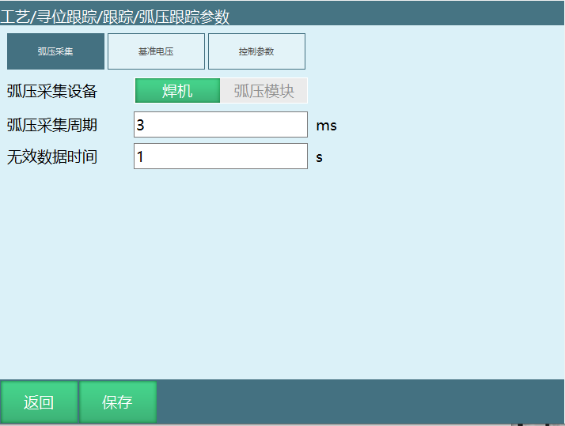

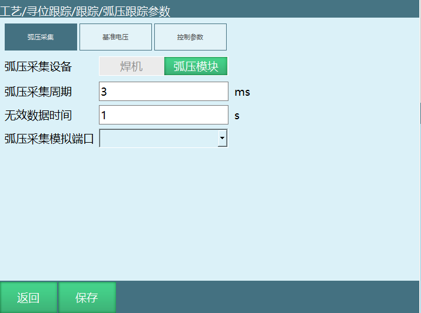

**弧压采集设备**：分为焊机和弧压模块两种设备。

**弧压采集周期**：指多长时间采集一次电压，单位是ms。

**无效数据时间**：焊接起弧有一段时间电压超大，不能采集参与计算。

**弧压采集模拟端口**：只有选择弧压模块时才有，需要接入的模拟量输入端口。

### 基准电压

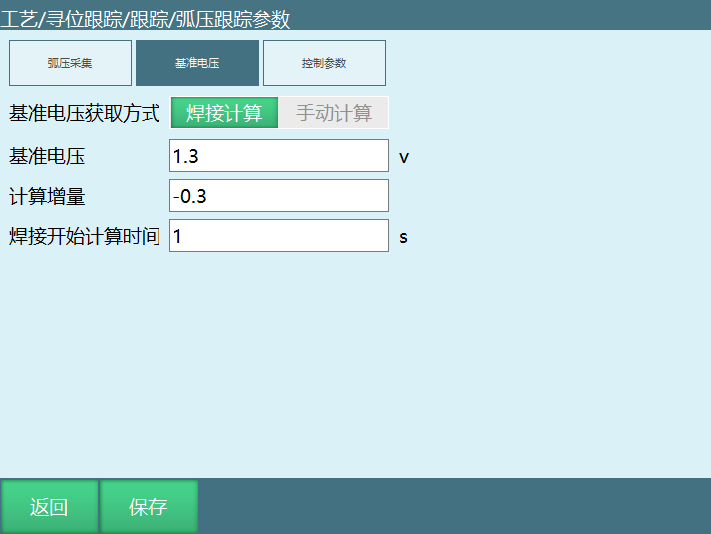

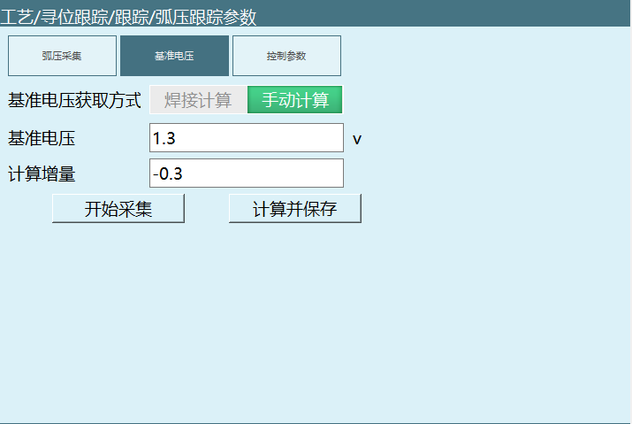

**基准电压获取方式**：分为焊接计算和手动计算，焊接计算时当设定好电压之后过了焊接开始计算时间之后就计算出基准电压了，手动计算则需要运行完整段轨迹。

**基准电压**：用户设置自己想要的电压， 焊机的电压超过或者少于这个设置的电压值时就需要纠偏。

**计算增量**：需要补偿的电压值，一般控制目标值比计算值小零点几V。

**焊接开始计算时间**：焊接开始之后计算基准电压所需要的时间，只有焊接计算才会有。

**开始采集**：手动计算时才会有，当选择手动计算时弧压弹窗界面才会显示，开始运行时点击开始采集，运行结束点击结束采集。

**计算并保持**：运行结束之后，点击计算并保存，基准电压就会保存控制器里并显示到界面上。

注：焊接计算出的基准电压不会显示到示教盒上，只能从日志里可以看。

### 控制参数

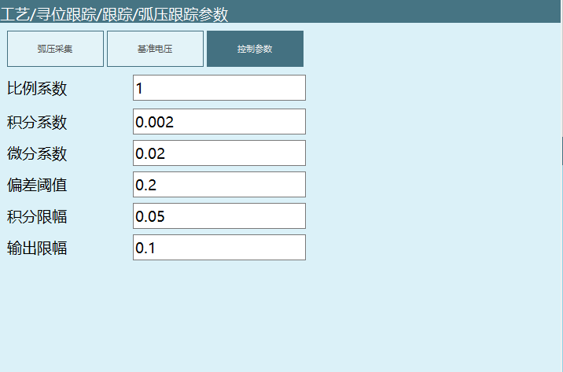

**比例系数**：是按比例反应系统的偏差,系统一旦出现了偏差,比例调节立即产生调节作用用以减少偏差.比例作用大,可以加快调节,减少误差,但是过大的比例,使系统的稳定性下降,甚至造成系统的不稳定。

**积分系数**：是使系统消除稳态误差,提高无差度.因为有误差,积分调节就进行,直至无差,积分调节停止,积分调节输出一常值.积分作用的强弱取决与积分时间常数Ti,Ti越小,积分作用就越强.反之Ti大则积分作用弱,加入积分调节可使系统稳定性下降,动态响应变慢.积分作用常与另两种调节规律结合,组成PI调节器或PID调节器。

**微分系数**：微分作用反映系统偏差信号的变化率,具有预见性,能预见偏差变化的趋势,因此能产生超前的控制作用,在偏差还没有形成之前,已被微分调节作用消除.因此,可以改善系统的动态性能.在微分时间选择合适情况下,可以减少超调,减少调节时间.微分作用对噪声干扰有放大作用,因此过强 的加微分调节,对系统抗干扰不利.此外,微分反应的是变化率,而当输入没有变化时,微分作用输出为零.微分作用不能单独使用,需要与另外两种调节规律相结合,组成PD或PID控制器。

**偏差阈值**：当被控量偏差大于该值时，会降低比例与积分比例，一般设置一个较大的偏差。

**积分限幅**：防止误差积分过大。

**输出限幅**：防止单次调节过大。

### 程序

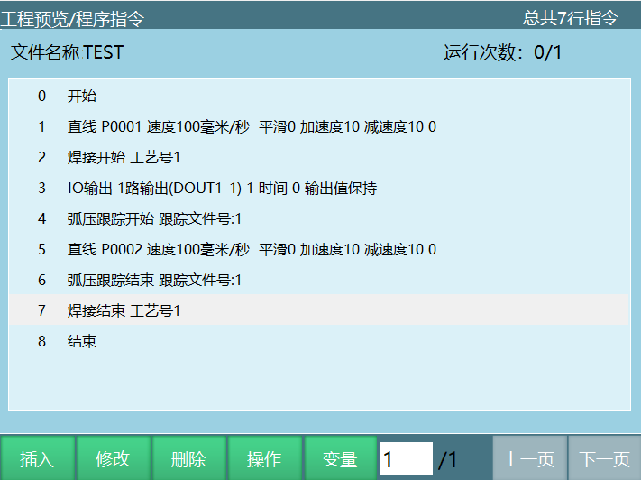

