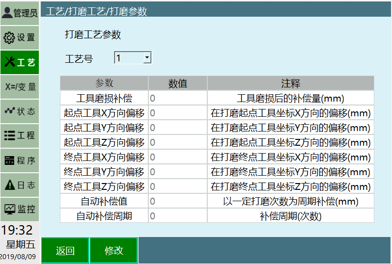
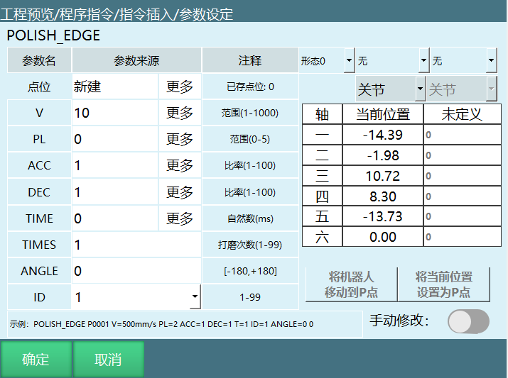
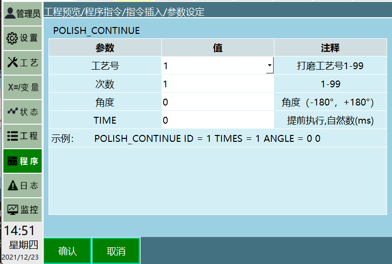
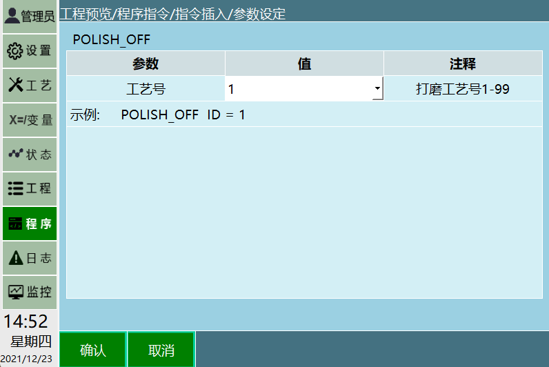
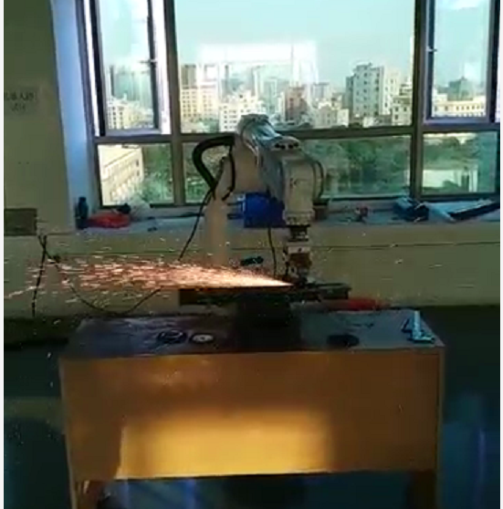
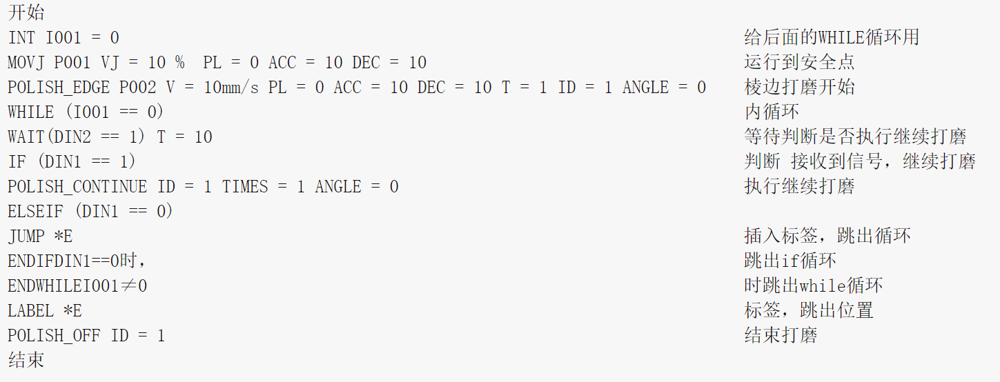
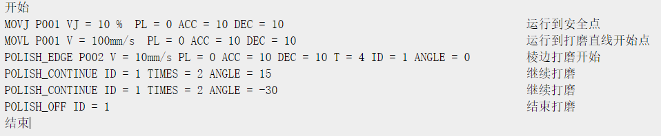
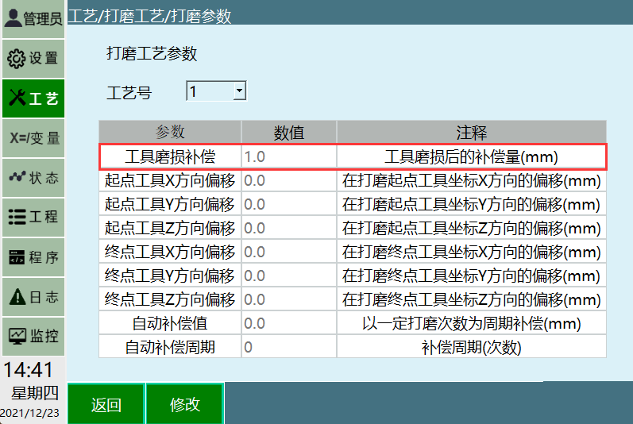
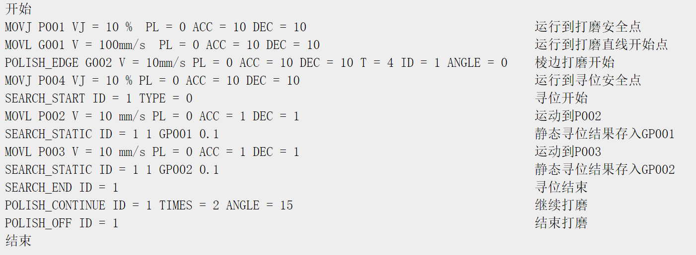

title: 2207打磨工艺手册

content: 纳博特2207打磨机器人控制器的打磨工艺设置、指令说明及使用情景指南

description: 详细介绍打磨参数配置（工具磨损补偿、起终点偏移、自动补偿）、打磨指令（POLISH_EDGE/CONTINUE/OFF）及多种实际使用情景的完整操作手册

company: 纳博特

---

# 1 引言

本章主要说明本控制系统的打磨工艺的相关情况。 纳博特首创棱边焊点打磨专用指令，无需复杂编程。

可实现自动更换砂轮进行多种打磨, 机器人自动在不同方向多次打磨。

- 焊接飞溅的打磨

- 表面磕碰划伤的打磨

- 焊缝余高的磨平

- 加工余高的磨平

- 长、大焊缝的打磨

- 棱角、毛刺的去除

配合变位机等外部轴设备，可打磨大型钣金件，保证打磨效果光滑平整。

配合离线编程可实现对复杂曲面工件的柔顺打磨。

配合线扫激光跟踪技术, 可以实现打磨自动化编程：

- 2点定位直线。

- 3点/4点定位用户坐标系。

# 2 打磨参数

打开示教器，进入"工艺"界面，选择"打磨工艺"进入"打磨参数"界面，若不点修改，只可修改工艺号，选中其中一个工艺号后点击"修改"按钮，方可修改。

**工艺号**：提供1-9个工艺号，每一个工艺号均保存该工艺号下面的全部参数。

**工具磨损补偿**：打磨工具磨损的值，填入后自动补偿掉此值。

**起点工具X/Y/Z方向偏移**：打磨开始前，在起点会自动进行偏移。

**终点工具X/Y/Z方向偏移**：打磨结束后，在终点会自动进行偏移。

**自动补偿周期/自动补偿值**：每经过设置的次数打磨后，全部参数会自动偏移一定距离。

# 3 打磨指令

## 3.1 POLISH_EDGE 棱边打磨指令

目前打磨工艺只支持直线方向的打磨，打磨工艺中的POLISH_EDGE相较于MOVL指令增加了ANGLE角度参数、TIMES打磨次数参数,以及ID工艺号参数。

**V:** 直线运动速度，范围1-1000（毫米/秒）。

**PL:** 平滑度，范围0-5。

**ACC:** 加速度调整比率，范围1-100。

**DEC:** 减速度调整比率，范围1-100。

**TIME:** 提前执行时刻，范围自然数0-999999ms。

**ANGLE**：角度参数，设置打磨时，工具手打磨的角度，范围-180°，+180°。

**TIMES**：打磨次数参数，需要打磨的次数，范围1-99。

**ID**：工艺号参数，选择打磨工艺中已经设定好打磨参数的工艺号，范围1-99。

## 3.2 POLISH_CONTINUE 打磨继续指令

继续打磨指令主要是方便操作人员查漏补缺，在打磨中，有些部位不一定可以在流程中打磨好，所以增加此功能用来弥补某些部位可能存在的误差。

**工艺号：**选择打磨工艺中已经设定好打磨参数的工艺号。

**次数：**打磨次数参数，需要打磨的次数，范围（1-99）。

**角度：**设置打磨时，工具手打磨的角度范围-180°，+180°。

**TIME:** 提前执行时刻，范围自然数0-999999ms。

## 3.3 POLISH_OFF 打磨结束指令

结束打磨指令，运行完成后结束打磨工艺。

注：整体流程需要配合棱边打磨一起使用，打磨工班前应做好安全防护和审单数据交接工作,备足磨片、钢丝轮、沙纸和原子灰等辅料,检查磨具运转是否正常。打磨工在打磨时必须正确使用磨具,确保使用安全。

# 4 使用情景

## 4.1 情景一

- 打磨一段直线：

- 打磨次数1，打磨角度0度（当前示教点的角度），开始打磨；

- 打磨后等待继续打磨信号。

模板如下：

## 4.2 情景二

- 打磨一段直线，示教位置打磨4遍，正方向偏15度打磨2遍，负方向偏15度打磨2遍。

模板如下：

## 4.3 情景三

打磨头磨损了1mm,需要调整参数。

设置步骤：

- 进入工艺/打磨工艺/打磨参数，选中对应的工艺号，点击修改；

- 工具磨损补偿填1，点击保存；

设置完成，运行程序即可。

## 4.4 情景四

- 打磨一段直线，示教位置打磨4遍，正方向偏15度，激光寻位打磨2遍。

模板如下：

---

# 问答（Q&A）

**Q: 打磨工艺支持哪些打磨场景？**

A: 支持焊接飞溅打磨、表面磕碰划伤打磨、焊缝余高磨平、加工余高磨平、长/大焊缝打磨、棱角毛刺去除等场景，配合变位机可打磨大型钣金件，配合离线编程可实现对复杂曲面工件的柔顺打磨。

**Q: 打磨参数中提供多少个工艺号？**

A: 提供 1-9 共 9 个工艺号，每个工艺号保存该工艺号下的全部参数。

**Q: 工具磨损后如何补偿？**

A: 进入工艺/打磨工艺/打磨参数，选中对应工艺号，点击修改，在"工具磨损补偿"中填入磨损值，点击保存即可，系统会自动补偿。

**Q: POLISH_EDGE 指令的打磨角度范围是多少？**

A: 角度参数 ANGLE 范围为 -180° 至 +180°。

**Q: POLISH_CONTINUE 指令的作用是什么？**

A: 继续打磨指令用于查漏补缺，弥补打磨流程中某些部位可能存在的误差。

**Q: 打磨工艺是否支持非直线方向的打磨？**

A: 目前打磨工艺只支持直线方向的打磨。

**Q: 自动补偿周期/自动补偿值的作用是什么？**

A: 每经过设置的次数打磨后，全部参数会自动偏移一定距离，用于应对工具逐步磨损的情况。
