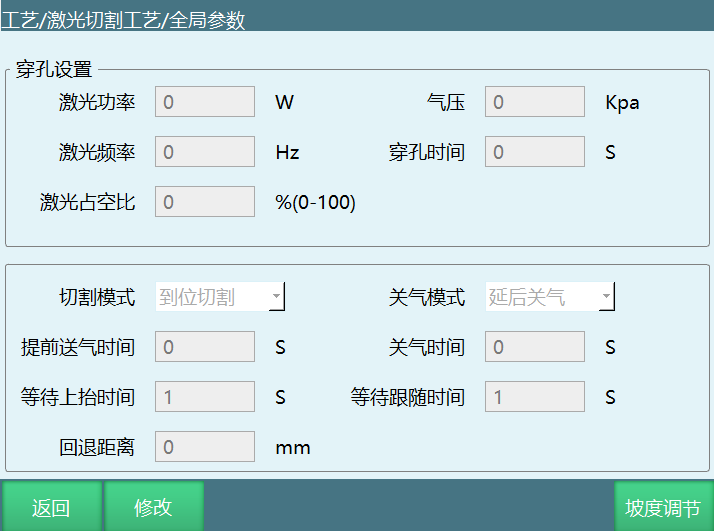
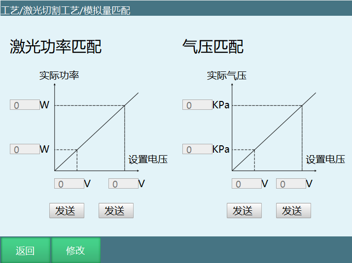
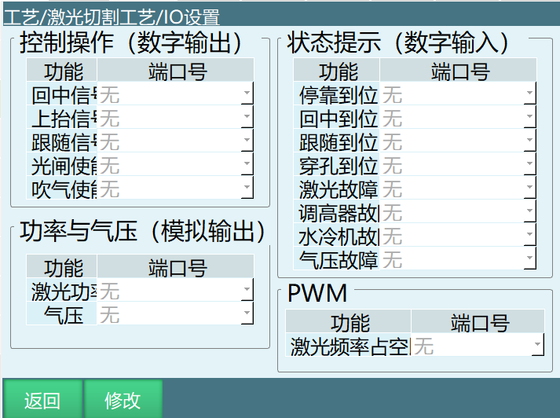
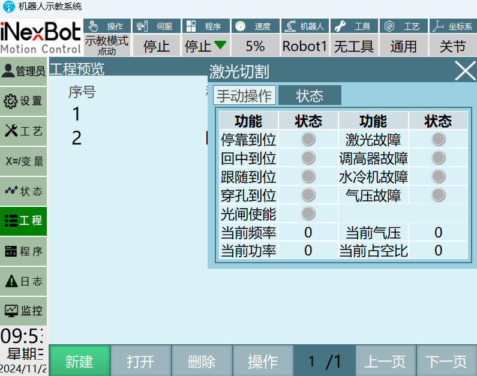
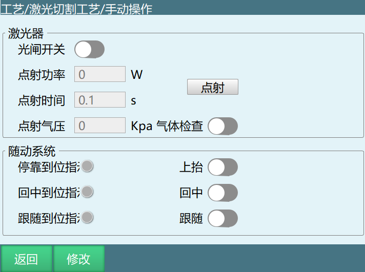
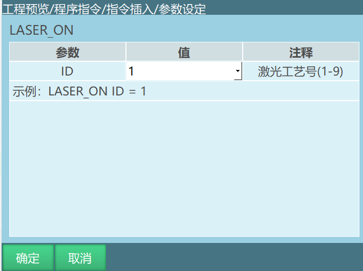
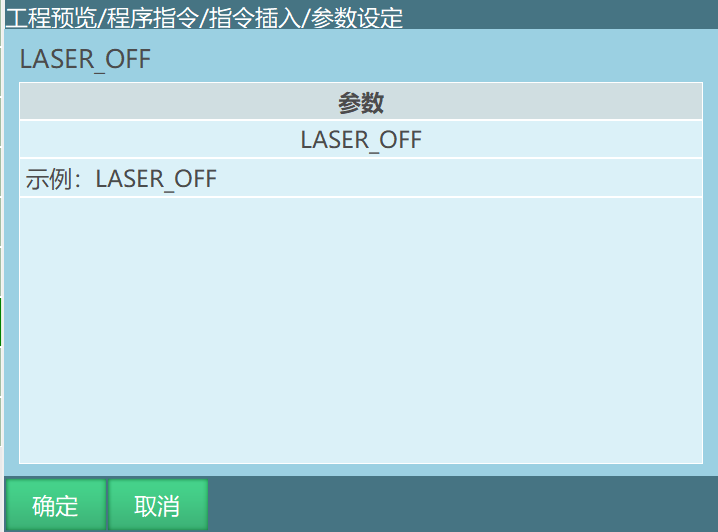
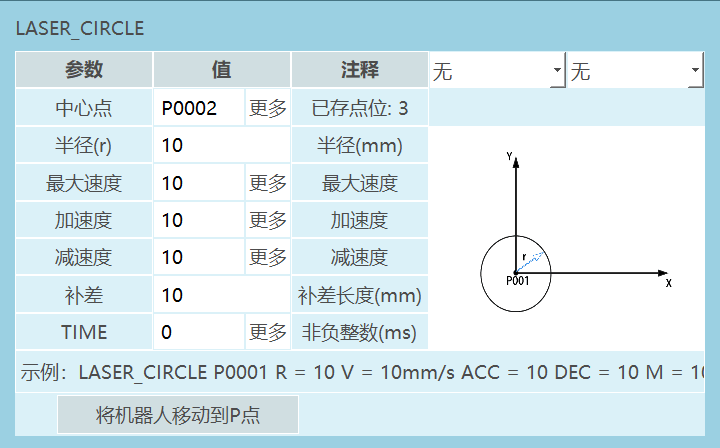

# 1 工艺介绍

激光切割过程分为穿孔与切割两部分，切割过程会先进行穿孔，在全局变量设置穿孔相关参数以及切割模式等参数，在切割变量中设置切割气压功率等参数，切割与穿孔在物理层面无差别，只是为了更好的实现切割效果进行的区分，穿孔是为了在切割材料的非边缘位置能够保证将材料穿透从而避免出现材料未被切割完全的情况出现，以及在后续的切割过程中能够降低激光效率从而实现节能的目标。

在切割过程中会不断进行吹气，其作用有两点，一是为了吹走切割过程中产生的残渣，保证切面光滑美观；二是提高切割效率，吹出气体氧气浓度会影响切割效率，在安全的范围内，浓度越高切割效率越高。

配合离线编程可实现复杂轨迹切割。

# 2 全局参数说明

打开示教器，进入"工艺"界面，选择"激光切割工艺"，进入"全局参数"界面。

**穿孔设置**：

- 激光功率：穿孔时激光器功率，单位为W。功率越大，穿孔效率越高，同时也会导致切面越粗糙。

- 气压：气压输出大小，气压控制清理切口背面残渣，保证切面光滑整洁。

- 激光频率：激光器每秒钟发出激光的次数。

- 穿孔时间：激光开始后进行穿孔的时长，时长要保证当前工件被穿透。

- 激光占空比：单位时间内激光工作的占比，如66%为一秒内激光工作0.66s。

**切割模式**：

- 到位切割：穿孔到位后再运行切割轨迹。

- 直接切割：不穿孔，直接运行切割轨迹。

**关气模式**：

- 延后关气：在激光切割结束后延迟一段时间关闭吹气。

- 提前关气：在激光切割结束之前提前一段时间关气。

**关气时间**：根据设置的关气模式，提前或延迟的关气时间。

**提前送气时间**：激光切割开始之前，提前多少时间开始送气。

**等待上抬时间**：激光切割完毕之后等待多久开始上抬。

**等待跟随时间**：发出跟随信号后，等待跟随到位信号的最大时间。

**回退距离**：激光切割中断后继续运行回退距离。

注：收到跟随到位信号后机器人立即开始按照切割轨迹运行，若超过该时间都没收到跟随到位信号，系统会发出激光切割跟随到位超时的报错。

# 3 切割参数

打开示教器，进入"工艺"界面，选择"激光切割工艺"，进入"切割参数"界面。

**工艺号**：保存多份参数可在指令中调用。

**气压**：切割时的气压。

**激光功率**：切割时激光器功率。

**激光频率**：激光器每秒钟发出激光的次数。

**激光占空比**：单位时间内激光工作的占比，如66%为一秒内激光工作0.66s。

# 4 模拟量匹配

进入"工艺"界面，选择"激光切割工艺"，进入"模拟量匹配"界面。

用法类似焊接电流电压匹配，系统会根据填写的设置电压值和实际功率值、实际气压值计算出比例系数。

# 5 IO设置

分为4个部分：控制操作、状态提示、功率与气压、PWM。

## 5.1 控制操作

**回中信号**：对应信号输出后激光器回中。

**上抬信号**：对应信号输出后激光器上抬。

**跟随信号**：对应信号输出后激光器开始跟随。

**光闸使能**：对应信号输出后打开光闸。

**吹气使能**：对应信号输出后开始吹气。

## 5.2 状态提示

**停靠到位**：调高器停止到位后对应端口会有输入信号。

**回中到位**：调高器回中到位后对应端口会有输入信号。

**跟随到位**：调高器跟随到位后对应端口会有输入信号。

**穿孔到位**：激光切割穿孔到位后对应端口会有输入信号。

**激光故障**：出现激光故障后对应端口有输入信号并报错停止。

**调高器故障**：出现调高器故障后对应端口有输入信号并报错停止。

**水冷机故障**：出现水冷机故障后对应端口有输入信号并报错停止。

**气压故障**：出现气压故障后对应端口有输入信号并报错停止。

**注：是否触发可点击系统上方的【工艺】-【切割】-【状态】查看。**

## 5.3 功率气压

**激光功率**：控制激光功率的模拟量端口，根据模拟量输出控制实际输出。

**气压**：控制气压的模拟量端口，根据模拟量输出控制实际输出。

## 5.4 PWM

**激光频率占空比**：根据R4PWMIO板可以在两个端口中切换设置，只有带PWMIO才可选择端口。

# 6 手动操作

进入"工艺"界面，选择"激光切割工艺"，进入"手动操作"界面。

## 6.1 激光器

**光闸开关**：类似于焊接使能，打开后才能出光。需手动打开光闸开关，否则不会自动打开。

**点射功率**：点射时激光器功率。

**点射时间**：单次点射时间。

**点射气压**：点射时的气压。

**点射按钮**：调试激光参数使用，设置好对应IO后点击可以出光方便调整。

**气体检查**：调试激光参数使用，设置好对应IO后可进行气压检查方便调整。

## 6.2 随动系统

上抬、回中、跟随三个按钮分别控制激光器，需要绑定好IO后使用，到位后左侧对应的状态指示灯会变绿。

# 7 指令说明

## 7.1 激光开始

**示例**：LASER_ON【指令名】ID=1【工艺号】。

功能：到达切割起始点后开始切割。

参数：ID，激光切割工艺号，范围\[1,9\]。

## 7.2 激光结束

功能：到达切割结束点后停止切割。

参数：无。

## 7.3 切割圆

**示例**：LASER_CIRCLE【指令名】 P/GP【中心点】 R【半径】 V【最大速度】 ACC【加速度比率】 DEC【减速度比率】 M【补差】TIME 【提前执行时间，不设置则显示为0】。

功能：设置切割圆的参数，运行到该条指令时运行切割圆轨迹。

参数见下表格：

  ------------------ ------------------------------------------------------------------------------------------------------
        中心点                                切割圆轨迹中心点。使用局部位置变量P或全局位置变量GP

       半径(r)                                           关节插补的速度，范围[1,3000]

       最大速度                                        切割圆时的指令速度，范围[1,999]

        加速度                                        切割圆时的加速度比率，范围[1,100]

        减速度                                        切割圆时的减速度比率，范围[1,100]

         补差                             在整圆走完后根据补差距离继续运行圆轨迹的距离，范围[0,500]

         TIME         提前执行时间，和运动控制类指令的提前执行时间一样，是该指令的下一条非运动类指令提前执行的时间。单位ms
  ------------------ ------------------------------------------------------------------------------------------------------

**示例：**

激光指令支持走直线、圆弧、整圆以及曲线，用法比较简单。只有一个切割圆较为特殊。

切割圆需要在上一点的基础上运行，上一条运动指令的点位为P0001，则切割圆的中心点也要设置为P0001才可以运行。

---

## Q&A

Q1: 激光切割包含哪两个阶段？

A: 穿孔和切割。穿孔确保在非边缘位置实现材料完全穿透，然后才开始切割轨迹。

Q2: 切割过程中吹气的作用是什么？

A: 两个作用：清除残渣以获得光滑表面，以及通过氧气浓度提升切割效率。

Q3: 有哪些切割模式？

A: 定位后切割（先穿孔）和直接切割（无需穿孔，直接运行轨迹）。

Q4: 气体控制模式包含哪些内容？

A: 延迟关气和提前关气两种模式，均可配置时间参数。

Q5: 监控哪些IO状态信号？

A: 对接、定心、跟随、穿孔信号，以及激光器、高度控制器、水冷机和气压的故障信号。

Q6: LASER_ON指令如何工作？

A: LASER_ON ID=n 使用工艺编号n（范围1-9）在当前位置开始切割。

Q7: LASER_CIRCLE指令接受哪些参数？

A: 中心点、半径、最大速度、加减速比例、补偿距离，以及可选的预执行时间。

Q8: 什么是跟随系统？

A: 高度控制器，用于保持激光头与工件表面之间距离恒定。

Q9: 模拟量匹配如何工作？

A: 基于设定电压和实际功率/压力读数计算缩放系数，实现精确的模拟量输出控制。

Q10: 包含哪些安全功能？

A: 手动快门使能，以及对激光器、高度控制器、水冷机和气压的故障监控。