title: "2207焊接工艺手册"

company: "纳博特南京科技有限公司"

source: "2207焊接工艺手册.docx"

content:welding

---
# 1 焊机设置

焊机设置需进入"工艺/焊接工艺/焊机设置"中修改。

步骤如下：

进入"工艺/焊接工艺/焊机设置"页面。

两种控制焊机方式：

**模拟控制**：全称模拟量焊机，是指通过IO模拟量来控制的焊机。

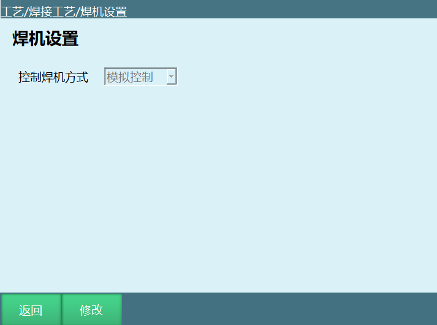

**数字控制**：根据工业现场实际需要设置。

点击修改选择控制焊机方式：

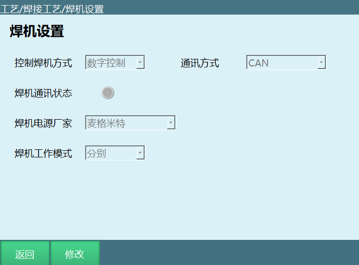

**数字焊机的四种通讯方式：**CAN、ModBus RTU、EtherCAT、ModBus TCP。

选择ModBus RTU时，需要填写从站ID、端口号、波特率；

选择ModBus TCP时，需要填写IP、端口号。

**焊接通讯状态：**灰色表示没有通讯成功，绿色为通讯成功。

**焊接电源厂家：**通用、麦格米特、深威智能、奥太、美佳尼克、瑞凌。

选择瑞凌时，需要在【材料/丝径/气体】选择填写参数。

**焊机工作模式：**一元化、分别。

点击保存，保存成功。

# 2 焊接 IO 设置

焊接 IO 设置需进入"工艺/焊接工艺/焊接 IO 设置"中修改。相关步骤如下：

进入"工艺/焊接工艺/焊接IO设置"页面。

点击修改后，修改按钮变成保存，可以在各自的功能后面选择对应的IO端口。

## **2.1 数字输入**

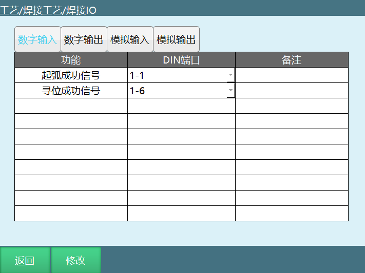

**起弧成功信号**：设置这个信号是用来检测是否成功起弧，在执行焊接开始指令时，需要给起弧信号，如果起弧信号超过设置的焊接检测时间，会报错（焊接起弧信号超时）。

**寻位成功信号**：在电弧寻位中需要设置寻位成功信号（需要的信号可以自己选择端口）。

**使用方法** ：

1.  电弧寻位中，找两根单芯线，其中一根线的一端接IO输出端1-5（寻位模式信号），另一端接铁板；

2.  另一根线接IO输入端1-6（寻位成功信号），另一端接工具手末端；

3.在电弧寻位中，打开输出口1-5，当工具手末端碰到铁板时，设置的1-6输入信号就有低电平变为高电平。

## **2.2 数字输出**

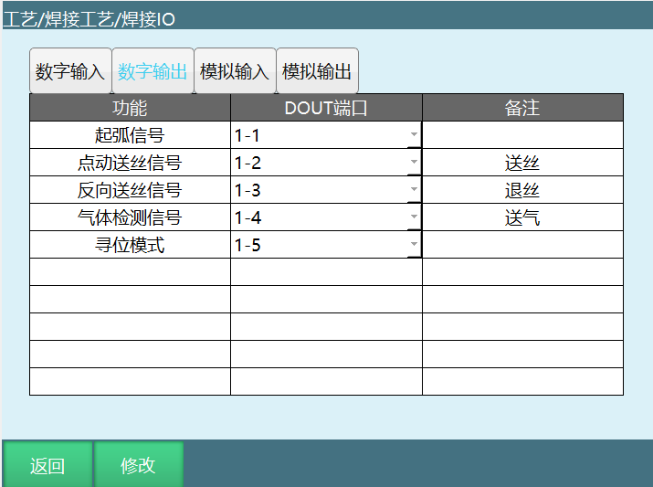

**起弧信号**：准备起弧时，系统会给焊机下发输出信号。

**点动送丝信号**：焊机送丝。打开对应的信号端口时，在焊接监控窗口上同步显示：手动操作-送丝开关打开。

**反向送丝信号**：焊机退丝时IO板给出对应的输出信号。

**气体检测信号**：送气泵送气时IO板给出对应的输出信号。

**寻位模式**：代表焊机进入寻位模式，机器人运动时，当焊丝触碰到工件时，焊机给寻位成功信号。

**使用方法**：

1 电弧寻位中，找两根单芯线，其中一根线的一端接IO输出端1-5（寻位模式信号），另一端接铁板；

2 另一根线接IO输入端1-6（寻位成功信号），另一端接工具手末端；

3 在电弧寻位中打开输出口1-5，当工具手末端碰到铁板时，设置的1-6输入信号端口由低电平变为高电平。

## **2.3 模拟输入**

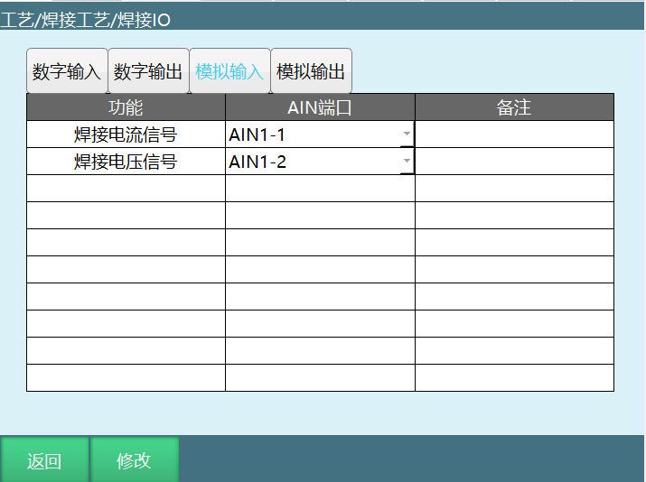

**焊接电流信号**：模拟焊机电流的输入信号。

**焊接电压信号**：模拟焊机电压的输入信号。

## **2.4 模拟输出**

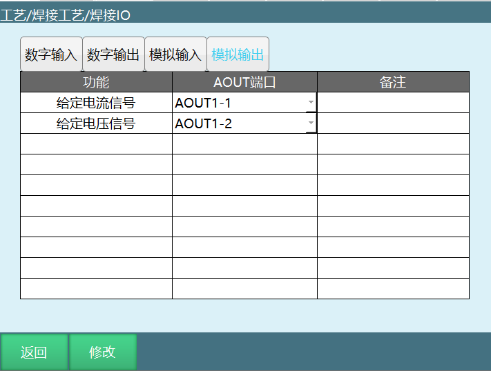

**给定电流信号**：给定电流的信号。

**给定电压信号**：给定电压的信号。

焊接时序图如下所示：

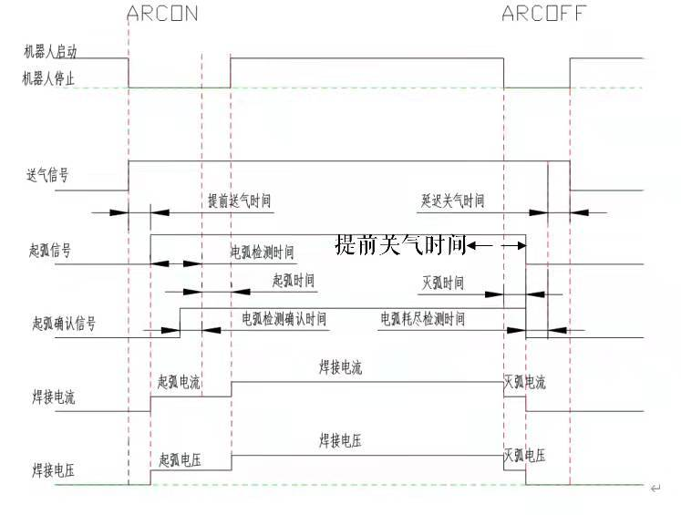

# 3 电流电压匹配

设置焊接电压电流需进入"工艺/焊接工艺/电流电压匹配"中修改。相关步骤如下：

1.  进入"工艺/焊接工艺/电流电压匹配"页面（注：选择数字焊机时，该页面隐藏）。

此时电流电压输入框不能输入数值。点击修改后，修改按钮变成保存，可以在各自的参数栏输入数值。

## **3.1 电流控制匹配界面参数设置步骤**

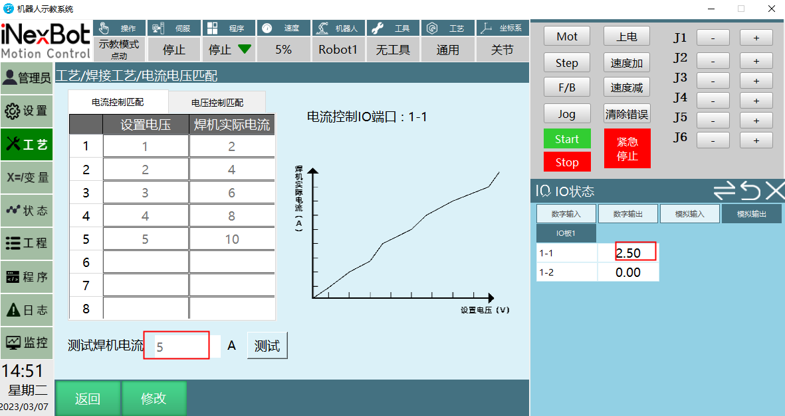

将控制器和焊机连上，打开示教器界面如上图所示。

**设置电压：**输入电压值。

**焊机实际电流：**焊机实际输出的电流，在焊机上面显示。

测试焊机电流：在设置电压栏和焊接实际电流栏填写好数值，在测试焊机电流框输入数值，点击测试，会计算出来一个值。

- 这个值是通过上图所示填写的电压和焊机实际电流值计算出来的一个比例系数，按照图上填写的数值计算出来的比例系数是2 。

- 此时测试焊机电流填写的是5A,点击测试后，选中的模拟输出端口通过比例系数计算出电流值2.5。

注：焊机电流AOUT端口的输出上限10，大于10时按照上限执行；小于0时按照下限执行。

## **3.2 电压控制匹配界面参数设置步骤**

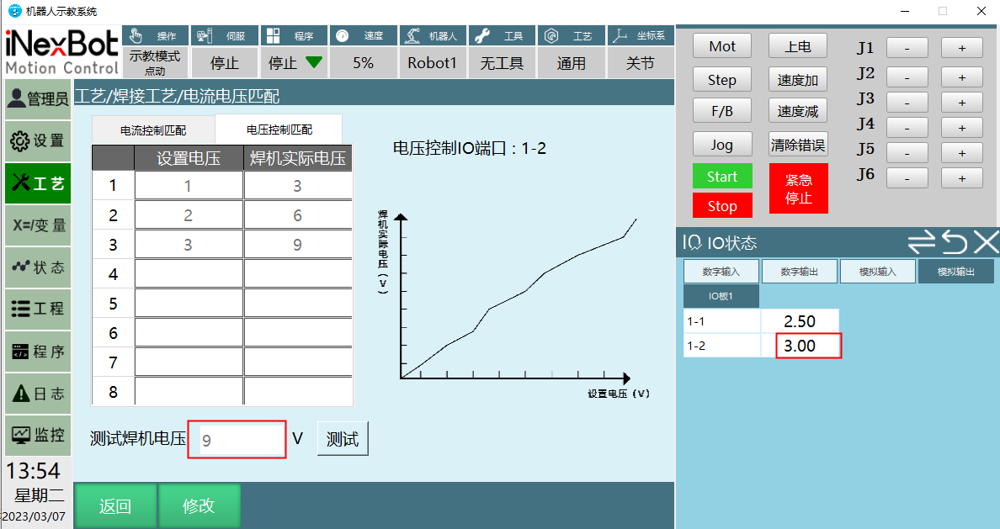

图示中的函数图为修改控制器发送给焊机的电压、电流与焊机实际的电压、电流比例关系。

将控制器和焊机连上，打开示教器界面如图所示。

**设置电压：**指IO监控里的模拟输出的值。

**焊机实际电压**：焊机实际输出的电压，在焊机上面显示。

**测试焊机电压**：在设置电压栏和焊接实际电压栏填写好数值，测试焊机电压框输入数值，点击测试，会计算出来一个值。

- 这个值是通过图上所填写的电压和焊机实际电流值计算出来一个比例系数，按照图上填写的值计算出来的比例系数是3；

- 此时测试焊机电压填写的是9V,点击测试后，选中的模拟输出端口通过比例系数计算出电压值是3。

注：焊机电压AOUT端口的输出上限10，大于10时按照上限执行；小于0时按照下限执行。

## **3.3 连接焊机时电流电压匹配操作步骤**

电流电压匹配做多段匹配：电流电压匹配分多段，可以是1～8任意几段。

操作步骤如下：

1.  选择电流控制匹配；

2.第1行设置电压填1，查看焊机上现在的电流值，把看到的电流值填到第一行焊机实际电流里；

3.第2行设置电压填3，查看焊机上现在的电流值，把看到的电流值填到第2行焊机实际电流里；

4.重复上述操作，直至把8行设置完（如只做1段匹配，设置1、2行即可）；

5.测试焊机电流填220，查看焊机电流是否为220。

点击保存，修改成功。该功能参数保存1份即可，无工艺号。

## **3.4 焊接参数设置**

设置焊接参数需进入"**工艺/焊接工艺/焊接参数设置**"中修改。相关步骤如下：

进入"工艺/焊接工艺/焊接参数设置"页面。

点击修改，修改按钮变成保存，此时工艺号可以选择，起弧参数、焊接参数、收弧参数值可以修改。

例如:若起弧电流=10、起弧电压=8，焊接电流=15、焊接电压=20，收弧电流=10、收弧电压=15。

- 打开起弧渐变使能，设置起弧渐变时间1秒，起弧渐变方式选择【时间渐变】。

- 打开收弧渐变使能，设置收弧渐变时间1秒，收弧渐变方式选择【时间渐变】。

- 执行效果：在1秒之内起弧电流达到10A、起弧电压8V，之后以设置的焊接电流15A，焊接电压20V进行焊接，焊接完成后在1秒之内电流电流电压值逐渐到收弧电流电压值。

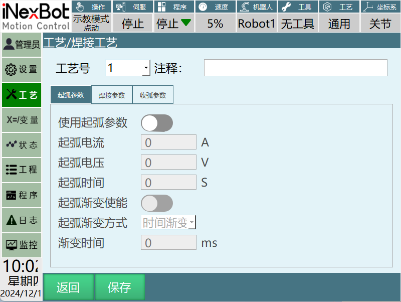

**工艺号：**焊丝有多种选择，碳钢焊丝、低合金结构钢焊丝、合金结构钢焊丝、不锈钢焊丝和有色金属焊丝，不同的焊丝需要的起弧电压、起弧电流、起弧时间、焊接电压、焊接电流、灭弧电压、灭弧电流、灭弧时间、都是不一样的，故可以设置 1-99个不同的焊接参数，后期只需要调用就可以。

**注释：**可以给此工艺号添加注释标明其作用。

**使用起弧参数**：打开开关后起弧参数生效。

**起弧电流：**从加热焊丝时施加的电流。

**起弧电压：**从加热焊丝时施加的电压。

**起弧时间：**给了起弧信号后设置的的起弧电流电压值维持的时间。

（例如起弧电流=20A，起弧电压=10V,起弧时间是1秒，表示到达起弧电流电压值后会维持一秒到达焊接电流电压值）

**起弧渐变使能：**控制从起弧电流电压渐变到焊接电流电压的时间或距离。

**起弧渐变方式：**时间渐变。

**渐变时间：**到达起弧电流电压所需要的时间。

（注：渐变时间设置了2秒，起弧电流50A,起弧电压15V，电流电压值会在两秒之内增加到50A，15V，而不是直接到达设定的电流电压值）

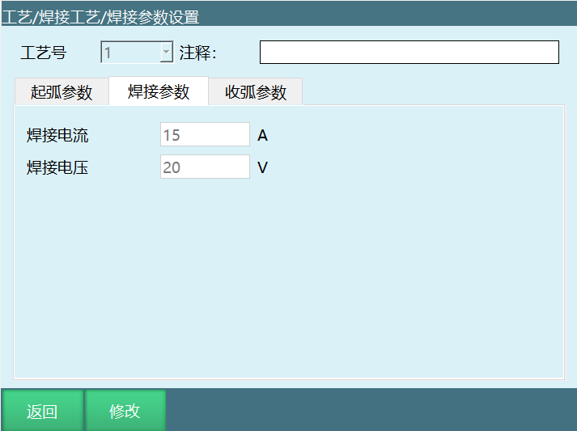

**焊接电流：**焊接时施加的电流。焊接时，流经焊接回路的电流，是送丝速度和熔化速度平衡的结果。

**焊接电压：**焊接电压即电弧电压，提供焊接能量和焊接质量。

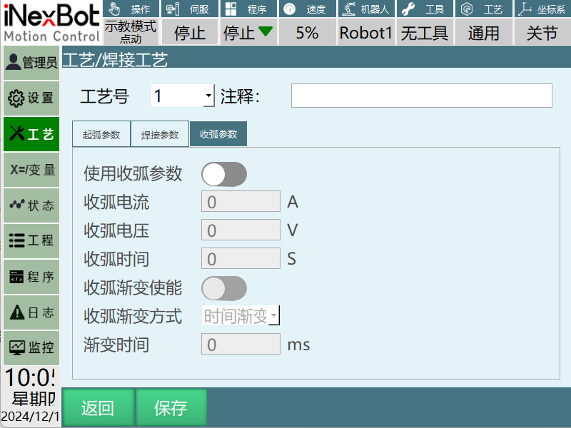

**使用收弧参数**：打开开关后收弧参数生效。

**收弧电流**：在焊接中需要灭弧时灭弧器给出的电流。

**收弧电压**：指保证避雷器能够在工频续流第一次过零值时灭弧的条件下，允许加在避雷器上的最高工频电压。灭弧电压应大于避雷器工作母线上可能出现的最高工频电压，否则避雷器可能因不能灭弧而爆炸。

**收弧时间**：焊接电流电压到收弧电流电压维持的时间。

例如：收弧时间是1秒，表示焊接电流电压到收弧电流电压后会维持1S的时间然后焊接结束。根据不同的灭弧介质灭弧的时间不同，一般为秒级。

**收弧渐变使能**：控制从焊接电流电压渐变到收弧电流电压的时间 。注：渐变使能打开之后下面的渐变参数才会起作用。

**收弧渐变方式**：时间渐变。

**渐变时间**：打开收弧渐变使能，设置渐变时间是2秒，从收弧开始到收弧结束的时间需要两秒。

收弧渐变时间是2秒，收弧电流35A，收弧电压10V,那么在2秒之内收弧电流电压会逐渐变为35A，10V,而不是直接从焊接电流电压变为收弧电流电压值。

## **3.5 焊接装备设置**

设置焊接装置需进入"**工艺/焊接工艺/焊接装备设置**"中修改。相关步骤如下：

进入"工艺/焊接工艺/焊接装备设置"页面。

点击"修改"，修改按钮变成保存，点击下面的选择框，选择自己所需要的功能。

# 4 基础功能

**电弧检测时间**：控制器发出起弧信号到系统收到焊机发出的起弧成功的时间！如果在这个时间内系统没收到起弧成功，系统会发出起弧失败的报错。

**电弧检测确认时间**：防止有灰尘等障碍物而发生扰乱信号，故延时一段时间以确保电弧有信号传输，在这段时间里持续检测到起弧成功信号则开始焊接。

（注：电弧检测时间要大于电弧检测确认时间）

**电弧耗尽检测时间**：焊接过程中，起弧信号中断后可以持续焊接的时间，超过设定时间未收到起弧信号会报错

**延迟关气时间**：焊接结束，灭弧信号发出后，焊丝尚未冷却，如果此时就停止送保护气体，氧化依然会发生，故气体需要延迟关闭，并且还有冷却焊枪的功能。

- 设置延迟关气1s，焊接完成后在【监控】-【IO状态-数字输出】界面可以看到设置的送气信号端口会延迟1S在关闭。

**提前关气时间**：收弧前执行结束送气的时间参数。

- 设置提前关气1s，焊接完成后在【监控】-【IO状态-数字输出】界面可以看到设置的送气信号端口会提前1S关闭。

**飞行起弧：**从安全点向焊接起始点移动过程中就已经开始提前送气。

**提前送气时间**：焊接时，为防止焊丝被空气氧化，可能需要提前送气吹掉焊枪周围的空气，减少焊接的焊缝出现气孔，让焊接的焊缝看起来更加平整光滑，

如上图所示，W1表示安全点，P001表示焊接开始点，P002表示焊接结束点，P001-P002表示焊接的距离。

## **4.1 打开飞行起弧** 

1.  []{#_Toc762 .anchor}当设置的送气时间小于安全点到焊接起始点的时间；

例如：设置提前送气时间4s,机器人从W1到焊接起始点P001需要10s。

执行效果：W1 移动到 P001 需要 10s，第6s 时，机器人开始送气，10s 时到达 P001 点，同时开始起弧。

2.  []{#_Toc8319 .anchor}当设置的送气时间大于于安全点到焊接起始点的时间；

例如：设置提前送气时间4s,机器人从W1到焊接起始点P001需要2s。

执行效果：W1 移动到 P001 需要2s，移动到 P001后机器人会在 P001 停留2s，4s 时才会起弧。

## **4.2 关闭飞行起弧**

没开启飞行起弧：从安全点移动到焊接起始点后，开始提前送气。

例如：关闭飞行起弧，提前送气时间4S。

执行效果：机器人从 W1 点（安全点）移动到焊接起始点 P001 后，开始送气，4s 时，机器人才会起弧。

## **4.3 再启动/再起弧**

**再启动使能：**再启动使能，发生断弧时给起弧信号时才有效。

**自动再启动：**检测到发生断弧后，伺服和程序都是在运行状态，在设置的电弧检测时间内，再次给起弧信号，程序继续运行。

**半自动再启动：**检测到发生断弧后，伺服在运行状态，程序在暂停状态，此时需要手动点击启动按键，在设置的电弧检测时间内，再次给起弧信号，程序继续运行。

停机：检测到发生断弧后，伺服在就绪状态，程序在停止状态，发生断弧后需要清错，然后手动点击启动按键。

**再启动距离：**再启动动作回退的距离，焊接过程中断点再次运行时可回退一段距离(防止空焊)。

**再启动速度：**再启动动作回退时的速度，当速度为0时不会回退。

**再起弧使能：**首先发信号让焊机起弧，若起弧失败在原地再次执行起弧动作，若起弧成功正常执行焊接-若设置的次数内还未起弧成功，则停机报错。

**再起弧次数：**当前焊机开始、焊接结束区间内执行再启弧的最多次数，超过将不再执行再启动.

- 设置的再起弧次数为2 次，发生断弧后，给起弧信号超过2次的均未起弧的话，会报错。

+:-----------------------------------:+:------------------------------------------------------------------------------------------------------------------------------------------------------------------------------------------------------------------:+
| 再启动功能（注：使用此功能需要打开基础功能中的焊接中断检测）                                                                                                                                                                                             |
+----------------------------------------------------------------------------------------------------------------------------------------------------------------------------------------------------------------------------------------------------------+
| 焊接轨迹直线P001-P002                                                                                                                                                                                                                                    |
|                                                                                                                                                                                                                                                          |
| 焊接开始点P001,焊接结束点P002，                                                                                                                                                                                                                          |
+-------------------------------------+--------------------------------------------------------------------------------------------------------------------------------------------------------------------------------------------------------------------+
| 自动再启动                          | 执行效果：                                                                                                                                                                                                         |
|                                     |                                                                                                                                                                                                                    |
| 再启动距离20mm                      | 焊接开始后机器人从P001向P002移动，发生断弧后，控制器警告（检测到焊接发生断弧），此时伺服和程序都是在运行状态，                                                                                                     |
|                                     |                                                                                                                                                                                                                    |
| 再启动速度15mm/s                    | 从P001向P002移动过程发生断弧，机器人会以你设置的再启动距离和                                                                                                                                                       |
|                                     |                                                                                                                                                                                                                    |
|                                     | 再启动速度参数在断弧的点位以15mm/S的速度移动20mm，到达回退距离后重新给起弧信号，机器人又执行焊接操作                                                                                                               |
+-------------------------------------+--------------------------------------------------------------------------------------------------------------------------------------------------------------------------------------------------------------------+
| 半自动再启动                        | 执行效果：                                                                                                                                                                                                         |
|                                     |                                                                                                                                                                                                                    |
| 再启动距离20mm                      | 焊接开始后机器人从P001向P002移动，发生断弧后，控制器警告（检测到焊接发生断弧），此时伺服运行状态，程序为暂停状态，并且会有一个发生断弧的弹窗提示                                                                   |
|                                     |                                                                                                                                                                                                                    |
| 再启动速度15mm/s                    | 从P001向P002移动过程发生断弧，点击弹窗提示框的确认按钮，然后再点击启动按键，机器人会以你设置的再启动距离和再启动速度参数在发生断弧的点位以15mm/S的速度移动20mm，到达回退距离后重新给起弧信号，机器人又执行焊接操作 |
+-------------------------------------+--------------------------------------------------------------------------------------------------------------------------------------------------------------------------------------------------------------------+
| 停机                                | 执行效果：                                                                                                                                                                                                         |
|                                     |                                                                                                                                                                                                                    |
| 再启动距离20mm                      | 焊接开始后机器人从P001向P002移动，发生断弧后，控制器报错（检测到焊接发生断弧），此时伺服就绪状态，程序为停止状态，并且会有发生断弧的弹窗提示。                                                                     |
|                                     |                                                                                                                                                                                                                    |
| 再启动速度15mm/s                    | 从P001向P002移动过程发生断弧，报错后先点击清错按键，然后点击弹窗提示框的确认按钮，然后再点击启动按键后会再次有一个弹窗提示（断点执行，首行运行）                                                                   |
|                                     |                                                                                                                                                                                                                    |
|                                     | 1.选择断点执行的效果：机器人会以你设置的再启动距离和再启动速度参数在发生断弧的点位以15mm/S的速度移动20mm，到达回退距离后重新给起弧信号，机器人又执行焊接操作                                                       |
|                                     |                                                                                                                                                                                                                    |
|                                     | 2.选择从首行运行的效果：机器人会从头开始执行焊接操作                                                                                                                                                               |
+-------------------------------------+--------------------------------------------------------------------------------------------------------------------------------------------------------------------------------------------------------------------+
| 再启动次数                          | 发生断弧时，能够给的起弧信号的次数                                                                                                                                                                                 |
|                                     |                                                                                                                                                                                                                    |
|                                     | 执行效果：设置再启动次数为3，发生断弧后起弧信号最多可以给三次，当第四次在给起弧信号时控制器会报错（检测到焊接发生断弧）                                                                                            |
+-------------------------------------+--------------------------------------------------------------------------------------------------------------------------------------------------------------------------------------------------------------------+

## **4.4 防碰撞**

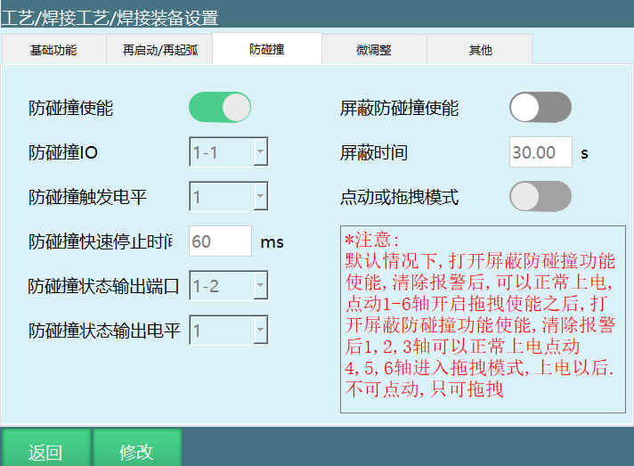

**防碰撞使能：**打开使能检测防碰撞信号。

**防碰撞IO：发生**碰撞时的IO输入信号。

**防碰撞触发电平：**1-高电平，0-低电平。

**防碰撞快速停止时间：**触发防碰撞到机器人停止所需的时间。

- 设置的防碰撞快速停止时间是60ms,那么在发生碰撞后机器人从工作到停止的时间是60ms。

**防碰撞状态输出端口：**触发防碰撞时指定的IO输出口输出信号。

- 防碰撞状态输出电平选择1，设置的IO输出端口设置的是1-2口，当发生碰撞时输出端口1-2口会从低电平0-高电平1；

- 防碰撞状态输出电平选择0，设置的IO输出端口设置的是1-2口，当发生碰撞时输出端口1-2口会从高电平1-低电平0。

**防碰撞状态输出电平：**1-高电平，0-低电平。

> **屏蔽防碰撞使能：**

- **当焊枪发生碰撞后，控制器报错（焊枪防碰撞被触发）。**

- **此时无法清错，需要打开屏蔽防碰撞使能，设置屏蔽时间，**屏蔽时间内不再检测防碰撞信号。

- 如果解除防碰撞信号，屏蔽防碰撞使能立即关闭。

**屏蔽时间：碰撞发生时，屏蔽的时间参数。**

- **打开屏蔽防碰撞使能，设置屏蔽时间10s,当发生碰撞时会屏蔽10s，方便把焊枪移动到安全的位置。**

- **到达屏蔽时间后控制器报错（屏蔽已结束，焊枪防碰撞被触发）。**

**点动或拖拽模式：**

- 发生碰撞后打开屏蔽防碰撞使能，设置屏蔽时间。

- 打开点动或拖拽模式使能，碰撞后可以拖拽4，5，6轴（此时4，5，6轴只可推拽，1，2，3轴可以点动）。

## **4.5 微调整**

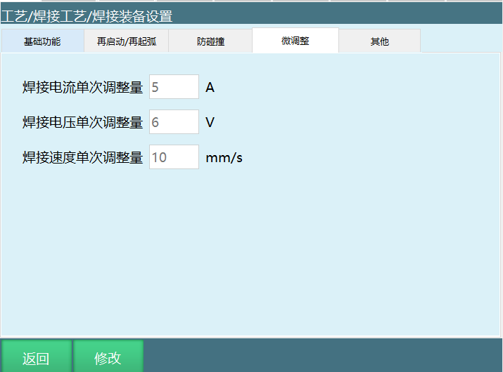

**焊接电流单次调整量：焊接的过程中焊接电流的单次调整幅度。**

例如：焊接电流单次调整量是5A,在焊接的过程中如果想要增加或者减小电流值可以点击工艺栏-【焊接工艺】-【微调整】。

点击给定值增加电流值会在焊接过程中增加5A,点击给定值减小电流值会在焊接过程中减小5A。

（注：增加或者减小的数值是根据设置的焊接电流单次调整量来调节的）

**焊接电压单次调整量：**焊接的过程中焊接电压的单次调整幅度。

例如：焊接电压单次调整量是6V,，再焊接的过程中如果想要增加或者减小电压值可以点击工艺栏-【焊接工艺】-【微调整】。

点击给定值增加电压值会在焊接过程中增加6V,点击给定值减小电流值会在焊接过程中减小6V。

（注：增加或者减小的数值是根据设置的焊接电压单次调整量来调节的）

焊接速度单次调整：焊接装备参数中可以设置微调整单次的加减幅度。

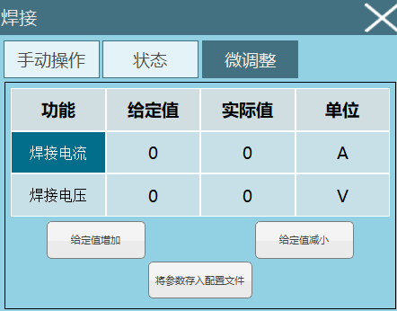

## **4.6 其他**

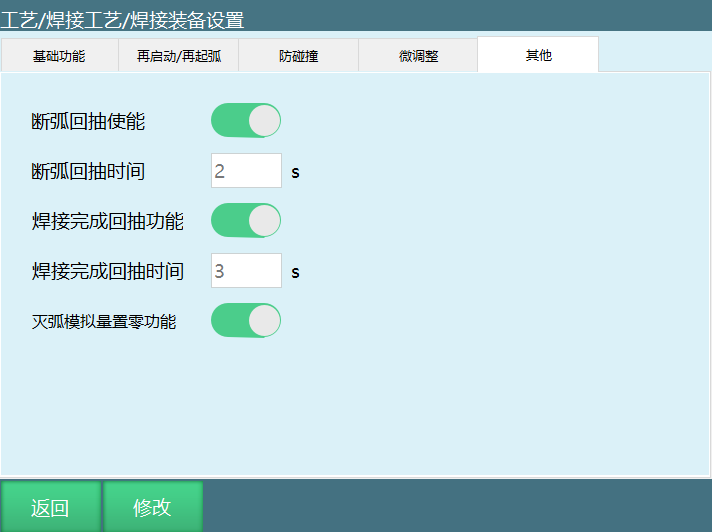

**焊接完成回抽功能**：在焊接结束时，焊枪会收到退丝信号，焊丝会回抽，防止去下个焊点时碰撞工件。

**焊接完成回抽时间：**完成焊接后，回抽焊丝的时间；

- 打开焊接完成回抽使能，设置完成回抽时间3秒，在焊接结束，从收到退丝信号到退丝结束的时间总共需要3秒。

**断弧回抽使能**：焊接电流超出了焊机的额定负载率焊机出现了短暂的保护，发生断弧，焊丝需要进行回抽防止与工件粘连。

**断弧回抽时间：**焊接断弧后，回抽焊丝的时间；

- 打开断弧回抽使能，设置断弧回抽时间2秒，为了防止焊丝与工件粘连，焊丝回抽时间需要2秒。

**灭弧模拟量置零功能**：焊接结束模拟量电压电流信号归零（模拟输出）。

# 5 摆焊参数

设置摆焊参数需进入"**工艺/焊接工艺/摆焊参数**"中修改。相关步骤如下：

1.进入"工艺/焊接工艺/摆焊参数"页面，摆焊文件有9个工艺号可供选择。选择需要修改的摆焊参数，点击底部的修改按钮，所有输入框变为可输入状态；

2.输入完成后点击保存按钮即可完成保存。

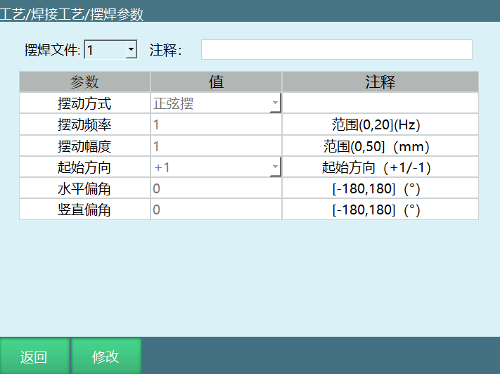

纳博特摆焊支持四种摆动方式：正弦摆、Z字摆、圆形摆、外部轴定点摆。

摆动频率、摆动幅度、起始方向、水平偏角、竖直偏角等等不同参数可调，可根据工业现场实际需要设置。

**摆动幅度**：幅度越大，机器人摆动越大。

**摆动频率**：频率越大，机器人摆动频率越快。

**起始方向**：+1，从某一点开始走且先向上走；-1，从某一点开始走且先向下走。

**水平偏角**：设置水平偏角30° 的摆焊轨迹。

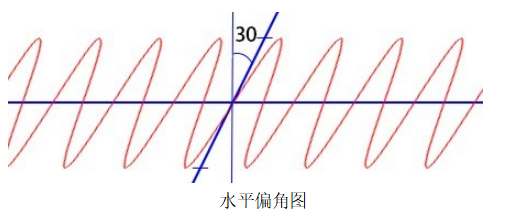

**竖直偏角**：设置竖直偏角30° 的摆焊轨迹。

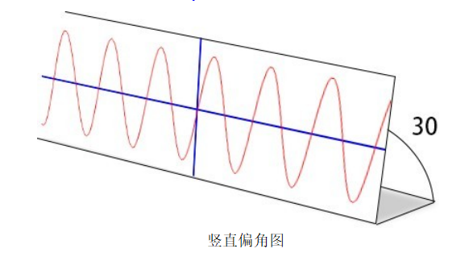

**移动**：机器人每摆动一次往前走设定的时间，然后进入下一次摆动。

**停留**：机器人每摆动一次停留设定的时间。

**起始方向**：+1，从某一点开始走且先向上走；-1，从某一点开始走且先向下走。

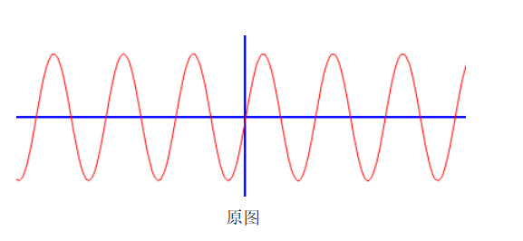

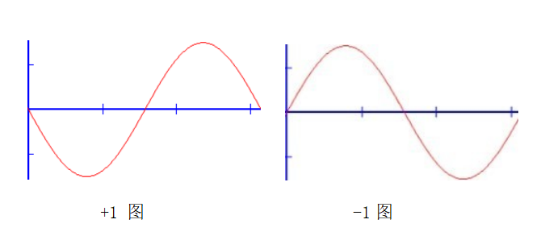

左停留时间/右停留时间：当摆焊方式选择Z字形摆，定点摆焊时会有左停留时间/右停留时间；在进行Z字形摆/定点摆焊时，到达一个目标点停留的时间。

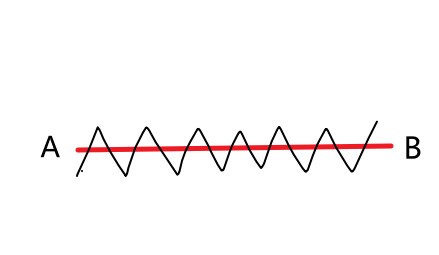

摆焊是焊接时，焊缝热源在焊件上进行有规律的横向摆动的焊接操作。摆焊效果图如下所示。

# 6 相贯线设置

相贯线设置需进入"工艺/焊接工艺/相贯线设置"中修改。

相关步骤如下：

1.  进入"工艺/焊接工艺/相贯线设置"页面，如下图所示：

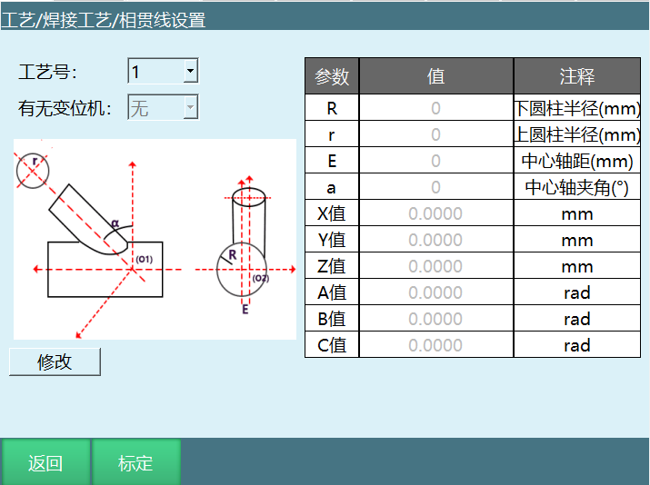

2.  使用前标定可以减小误差，点击标定进入标定界面，如果不知道如何标定在界面内有演示按钮，可以查看，如图所示：

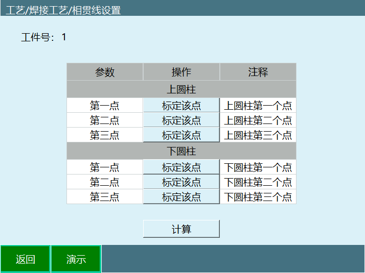

# 7 手动操作

设置手动操作需进入"**工艺/焊接工艺/手动操作"**中修改。相关步骤如下：

进入"工艺/焊接工艺/手动操作"页面。

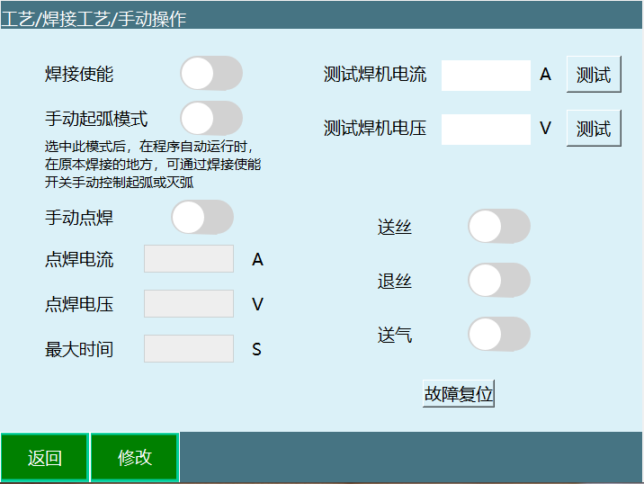

**焊接使能**：打开焊接使能，机器人才会执行焊接操作，否则只是在走轨迹。

- 焊接轨迹的程序编写完后可以首先再示教模式确认运行轨迹正确；

- 切换到运行模式打开焊接使能，机器人才会执行焊接功能。程序在运行模式时，按下"stop"，再按下"start"之后，程序重新开始之后，将不再执行焊接功能。

**手动起弧模式**：选中此模式，程序再自动运行的过程中，可以通过焊接使能开关手动控制起弧或者灭弧；

- 机器人从焊接起始点 P001 在向焊接终点P004移动过程中，打开焊接使能，机器人就会起弧，关闭焊接使能，机器人就会灭弧；

- 运行模式下，机器人运动过程中，在 P002 打开焊接使能，在 P003 关闭焊接使能，那么在 P002 移动到 P003 时，机器人保持起弧状态，在 P003 移动到到P004，机器人保持灭弧状态；

- 机器人从 W1（安全点）到焊接起始点 P001 移动过程中，打开焊接使能，机器人不会起弧；到达 P001 后，机器人才会起弧。

没开启手动起弧模式：机器人从焊接起始点 P001 在向焊接终点 P004 移动过程中，焊接使能键无效（即使打开焊接使能键，机器人也不会起弧）。

**手动点焊**：设置点焊电流，点焊电压，最大时间，点击保存；

**长按**手动点焊按钮（**按住有效，松开无效**），机器人进行焊接，松开按钮，机器人停止焊接。

**点焊电流：**点焊输出电流。

**点焊电压：**点焊输出电压。

**最大时间**：手动点焊按钮允许被按住的最大时间。

注：最大时间设置为 5s，按住手动点焊，机器人焊接 5s，超出 5s，即使按住手动点焊按钮，机器人也不会进行焊接。

**故障复位：**使用数字焊机时有效，可用于复位焊机故障。

**送丝**：焊接开始时需要送丝。

**退丝**：焊接结束后的退丝操作。

**送气**：送气打开。

为了焊接使用方便，现在状态栏添加了【工艺】/【焊接】。

注：需要在设置/操作参数-工艺选择选中【焊接工艺】，修改保存。状态栏显示【焊接】。点击其中的焊接，会弹出手动操作的焊接窗口。

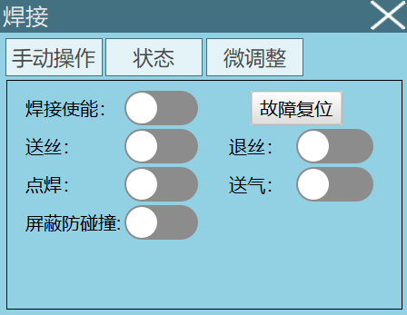

【**手动操作**】与工艺/焊接工艺/手动操作"页面的手动操作效果一样。此状态栏可以更加方便的看见焊接过程中的信号，电流电压值的变化等效果。

**屏蔽防碰撞**：触发防碰撞以后，打开屏蔽防碰撞开关，根据焊接装备设置-防碰撞的参数。打开后在屏蔽时间内解除碰撞，方便把焊枪移动到安全位置。

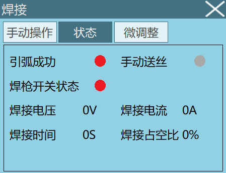

【**状态**】

**引弧成功/手动送丝/焊枪开关状态**：绿色为开启，红色关闭。

**焊接电流/电压**：输入的电流和电压 。

**焊接时间**：焊接开始到焊接结束之前的焊接时间。记录开机后的焊接时间。

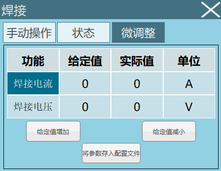

【**微调整**】

**将参数存入配置文件：**焊接期间保存参数，点击保存按钮，参数自动覆盖到指令或参数中。

- 指令使用自定义参数时，保存到指令中；

- 使用焊接工艺号参数时，保存到焊接参数中。

**给定值增加/给定值减小：**选中要调整的参数，点击给定值增加、给定值减小调整，立即生效。

- 例如：在焊接工艺-焊接装备设置-微调整界面，设置焊接电流单次调整量是5A,再焊接的过程中如果想要增加或者减小电流值可以点击【给定值增加】，【给定值减小】。

- 点击给定值增加电流值会在焊接过程中增加5A,点击给定值减小电流值会在焊接过程中减小5A。

（注：增加或者减小的数值是根据设置的焊接电流单次调整量来调节的）

- 例如：在焊接工艺-焊接装备设置-微调整界面，焊接电压单次调整量是6V,，再焊接的过程中如果想要增加或者减小电压值可以点击【给定值增加】，【给定值减小】。

- 点击给定值增加电压值会在焊接过程中增加6V，点击给定值减小电流值会在焊接过程中减小6V。

（注：增加或者减小的数值是根据设置的焊接电压单次调整量来调节的）

# 8 焊接指令说明

## 8.1 ARCON指令-焊接开始

该指令可执行起弧操作。选择好文件标号以后，参数默认是根据焊接工艺界面设定保存的参数来运行。打开使用临时工艺参数开关，以指令中参数为准。

ARCON：要使用的焊接参数工艺号。

## 8.2 ARCOFF指令-焊接结束

该指令可执行灭弧操作，选择好文件标号以后，参数默认是根据焊接工艺界面设定保存的参数来运行。打开使用临时工艺参数开关，以指令中参数为准。

ARCOFF：执行灭弧操作，选择与焊接开始对应的工艺号

## 8.3 ARCSET指令-焊接设置

该指令可以设置焊接时的电流电压。

## 8.4 WVON指令-摆焊开始

该指令执行时开始摆焊，执行该指令前请先运行焊接开始ARCON指令。

WVON：摆焊参数的工艺号。

## 8.5 WVOFF指令-摆焊结束

该指令执行时结束摆焊。

## 8.6 CIL指令-相贯线

相贯线指令方式与MOVC相似。

例：MOVJ P0001

CIL P0002

CIL P0003

**点位**：选择局部位置变量/全局位置变量/绑定变量。当值为"新建"时，插入该指令则新建一个P变量，并将机器人的当前位置记录到该P变量。

**V**：速度，单位mm/s。

**PL**：平滑等级。

**ACC**：加速度，单位百分比。

**DEC**：减速度，单位百分比。

**TIME**：提前执行时间，单位ms。

**ID**：相贯线工艺号。

## 8.7 FSWELDON指令-鱼鳞焊开始

执行该指令开始鱼鳞焊轨迹，执行该指令前请先运行焊接开始ARCON指令。

鱼鳞焊参数在指令中直接填写。

T：点焊时间，单位s；

L1：焊接距离，单位mm；

L2：走空距离，单位mm。

**2024/12/27 注明：由于版本变更问题，部分的版本未及时更新，可能该处指令仍为TIGWELDON，特此指出。**

## 8.8 FSWELDOFF指令-鱼鳞焊结束

执行该指令结束鱼鳞焊轨迹。

**2024/12/27 注明：由于版本变更问题，部分的版本未及时更新，可能该处指令仍为TIGWELDOFF，特此指出。**

## 8.9 FEEDWIRE指令-送丝

执行该指令可在参数时间内打开送丝信号。

T：送丝时间，单位s

## 8.10 ARCBUILTIN指令-焊机内置工艺

该指令目前可配合奥太焊机使用。

**内置工艺号：**焊机内置工艺号。

**参数A**：\$builtin_a调用。

**参数B**：\$builtin_b调用。

**参数C**：\$builtin_c调用。

**参数D**：\$builtin_d调用。

**参数E**：\$builtin_e调用。

## 8.11 WELDPATHSTART指令-初始焊道记录开始

WELDPATHSTART：和结束一起把初始焊道包起来、中间只支持直线、圆弧、整圆初始焊道记录结束 。

## 8.12 WELDPATHOFFSET指令-焊道偏移计算

原焊道：计算偏移后的焊道，运行时按计算的顺序执行，焊道0为保存初始焊道。

X轴偏移、Y轴偏移、Z轴偏移、A轴偏移、B轴偏移、C轴偏移：X,Y,Z,A,B,C各轴的偏移量。

计算结果存入：WELDPATH1～21为保存焊道偏移结果为焊道0保存初始焊道，其他界面不可修改；未记录和计算偏移，运行焊道偏移无效。

## 8.13 STARTOFFSETWELD指令-运行偏移焊道

运动焊道中的轨迹，速度等参数同初始焊道。 和焊道偏移计算一起用，每条焊道长度一样，在不同角度不同位置焊接

## 8.14 REFP指令-摆焊参考点 

参考点：参考点1-2.

注：红色轨迹表示通过确定摆焊方向进行摆焊的轨迹。

只选择参考点1/参考点2。

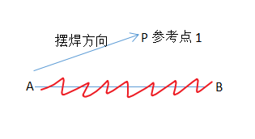

参考点1和参考点2都选则：

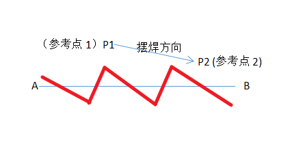

自动修正速度：是否打开自动修正，打开后会将焊道的起始点偏移至两参考点中间。

**绿色轨迹表示通过修正摆焊起始点后，摆焊的轨迹和方向。**

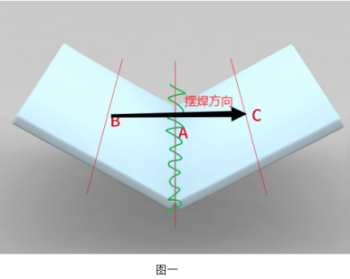

例如：如图所示，B为参考点1，C为参考点2，打开自动修正使能后焊道的起始点为两参考点距离的中心点。

参考点变量名：新建。

## 8.15 WELDPATHCOUNT指令-焊道数计算

计算结果存入变量类型：计算需要运行的焊道数和顺序INT/GINT。

选择使用焊道：1-21。

## 8.16 SPOTWELD指令-点焊

该指令执行时机器人开始执行点焊操作。

**焊接参数标号**：点焊时所使用的焊接参数工艺号。

**焊接时间**：点焊的时间。

点焊使用方法：

1.  设置焊接信号，电流电压匹配参数，焊接装备参数；

2.  在焊接工艺-手动操作界面设置点焊的电流，电压，时间参数。

 

3.  设置好所需要的参数后，在手动操作界面或者焊接工艺的状态界面点击点焊使能按钮会发现设置的起弧，送气信号端口会打开（因为未连焊机所以送丝，退丝信号端口没有反应）。

# 9 使用案例

## 9.1 正常起弧焊接

### 9.1.1 **参数设置**

- 进入"**工艺/焊机设置**"，设置焊机控制方式-模拟焊机

- 进入"工艺/焊接IO"，数字输入：起弧成功信号1-1，数字输出：起弧信号1-2，模拟输入焊接电流信号DIN1-1，焊接电压信号DIN1-2，模拟输出给定电流信号DOUT1-1，给定电压信号DOUT1-2。

- 进入"**工艺/电流电压匹配**",设置电流第一行焊接电流填【1】，实际焊接电流【10】；设置电压第一行焊接电压填【1】，实际焊接电压填【10】。

- 进入"**工艺/焊接工艺/焊接参数设置**"，设置起弧参数：起弧电流【8】A起弧电压【8】V起弧时间【2】S；焊接参数：焊接电流【10】A,焊接电压【10】V;收弧电流【7】A，收弧电压【7】V，收弧时间【2】S。

- 进入"**工艺/焊接装备设置**"-基础功能：电弧检测时间【2】S，电弧检测确认时间【1】S，电弧耗尽检测时间【1】S，飞行起弧打开。关气方式选延迟关气【2】S。

- 进入"**工艺/手动操作**"，打开焊接使能开关，打开手动起弧模式，设置手动点焊电流8A,点焊电压8V，最大时间2S。

**注：所有参数数值设置仅用作示例说明。**

### 9.1.2 **程序编写**

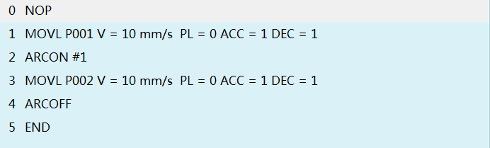

### 9.1.3 **指令含义**

1.  机器人移动到**焊接的起始点P001**；

2.  **ARCON#1**(包含 4s 的提前送气时间和 1s 的电弧检测时间) 开始起弧，执行**焊接参数标号 1**；

0\~4s，4s 的提前送气时间（0s 时，开始送气，检测到有气体，气体检测信号输出高电平，即 DOUT端口 1-4 灯亮；4s 之后，提供起弧信号，即 4s 时 DOUT端口 1-1 灯亮）4\~5s,1s 的电弧检测时间（若 1s 内检测到起弧成功信号为高电平，即 DIN端口 1-1 灯亮，程序继续运行，若检测不到，则会报"等待焊接起弧成功信号超时"错误）。

3.  机器人移动到焊接的终点 P002；

这个过程中，机器人开始焊接功能，起弧电压 100V，起弧电流 10A，起弧时间 10s， 焊接电压 200V，焊接电流 20A，

灭弧电压 300V，灭弧电流 30A，灭弧时间 30s。

（所有数值均对应"电流电压匹配"的实际电压，实际电流，不是设置电压和设置电流）

4.  **ARCOFF**（包含 3s 的电弧耗尽检测时间和 5s 的延迟关气时间）。

- 0\~3s,3s 的电弧耗尽检测时间（0s 时，起弧信号输出低电平，即 DOUT端口 1-1 灯灭； 若 3s 内检测到起弧成功信号为低电平，即 DIN端口 1-1 灯灭，程序继续运行，若检测不到，则会报"等待焊接灭弧成功信号超时"错误）。

- 3\~8s,5s 的延迟关气时间（8s 时，停止送气，气体检测信号输出低电平，即 DOUT端口1-4 灯灭）。

### 9.1.4 **程序插入方法**

1.  点击"工程"，点击"新建"，输入程序名称，点击"确定"；

2.  将机器人移动到焊接的起始点，点击"插入"，选择"运动控制类"，选择 MOVL，点击"确定"，修改速度数值，点击"确定"；

3.  点击"插入"，选择"焊接控制类"，选择 ARCON，点击"确定"，输入文件编号（文件编号对应焊接参数设置界面中的数值），点击"确定"；

4.  将机器人移动到焊接的终点，点击"插入"，选择"运动控制类"，选择 MOVL，点击"确定"，修改速度数值，点击"确定"；

5.  点击"插入"，选择"焊接控制类"，选择 ARCOFF，点击"确定"，点击"确定"。

**轨迹确认**：程序编写好之后，转动钥匙，将示教盒从示教模式切换到运行模式，点击"start"，确认机器人的运行轨迹是否正确，是否符合需要。

**焊接：**确认运行轨迹正确之后，要打开焊接使能 ，机器人才会执行焊接功能；

焊接使能打开方式：示教盒切换到示教模式，点击右上角的"焊接"按钮。

出现下图：

选中"焊接使能"，打开使能；

程序在运行模式时，按下"stop"，再按下"start"之后，程序重新开始之后，将不再执行焊接功能。

## 9.2 摆焊使用案例

### 9.2.1 **参数设置**

进入"**工艺/焊接工艺/摆焊参数**"，设置参数，如图：

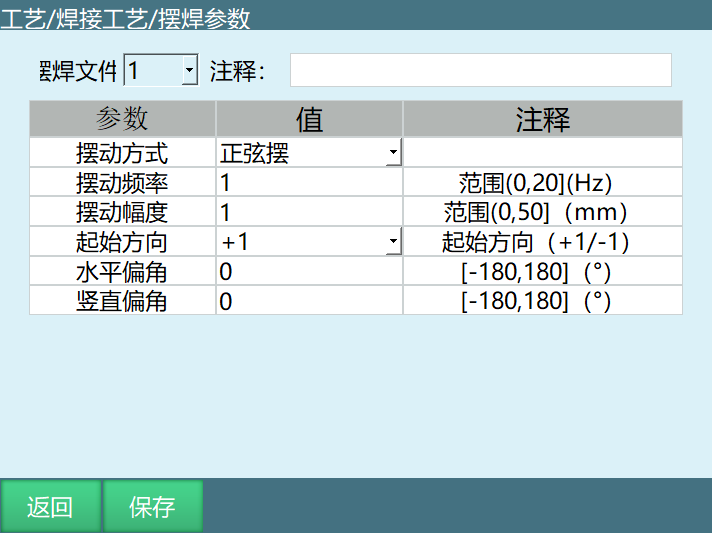

**注：此处参数数值设置仅用作示例说明。**

### 9.2.2 程序编写

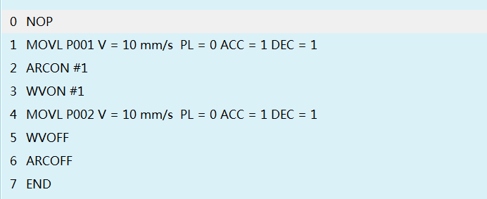

### 9.2.3 **操作含义**

1\~2，3\~4 及 6 的步骤含义，参照起弧焊接使用案例；

- 第3行 WVON#1；

摆焊开始，执行摆焊文件 1 中的参数；（若为 WVON#2，摆焊开始，执行摆焊文件 2 的参数）；

摆焊方式；正弦摆。

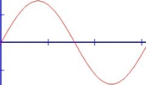

起始方向+1，从某一点开始走且先向上走；

起始方向-1，从某一点开始走且先向下走；

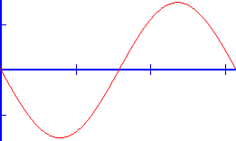

原图形：

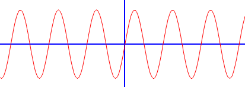

水平偏角：偏角 30 度：

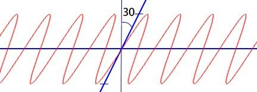

竖直偏角：偏角 30 度：

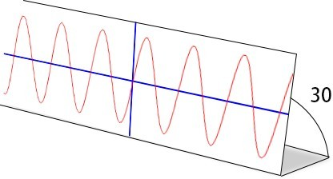

- 第5行 WVOFF 摆焊结束。

### 9.2.4 **操作步骤**

- **程序编写**：点击"工程"，点击"新建"，输入程序名称，点击"确定"；

- 将机器人移动到焊接的起始点，点击"插入"，选择"运动控制类"，选择 MOVL，点击"确定"，修改速度数值，点击"确定"；

- 点击"插入"，选择"焊接控制类"，选择 ARCON，点击"确定"，输入文件编号（文件编号对应**焊接参数设置**界面中的数值），点击"确定"；

- 点击"插入"，选择"焊接控制类"，选择 WVON，点击"确定"，输入文件编号，（文件编号对应**摆焊参数**界面中的数值）；

- 将机器人移动到**焊接的终点，**点击"插入"，选择"运动控制类"，选择 MOVL，点击"确定"，修改速度数值，点击"确定；

- 点击"插入"，选择"焊接控制类"，选择 WVOFF，点击"确定"，点击"确定"；

- 点击"插入"，选择"焊接控制类"，选择 ARCOFF，点击"确定"，点击"确定"。

**轨迹确认**：程序编写好之后，转动钥匙，将示教盒从示教模式切换到运行模式，点击"start"，确认机器人的运行轨迹是否正确。

**焊接：**确认运行轨迹正确之后，要打开**焊接使能，**机器人才会执行焊接功能；焊接**使能打开方式起弧焊接案例中有介绍。**

### 9.2.5 **定点摆焊的轨迹**

外部轴上标定两个点E1（外部轴旋转轴的起始点），E2（外部轴旋转轴的结束点）E1-E2确定了外部轴的转动方向，和实际焊接轨迹。

圆上红色线段表示在外部轴上摆焊的轨迹。

外部轴在转动的同时机器人进行定点摆焊，摆焊轨迹是下图红色曲线表示的部分。

若E1-E2机器人位移方向与外部轴同向则轨迹如图所示，若机器人位移方向垂直于外部轴方向则摆动方向会旋转90°。

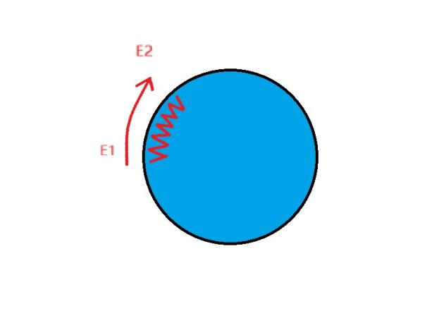

### 9.2.6 定点摆焊**指令编写**

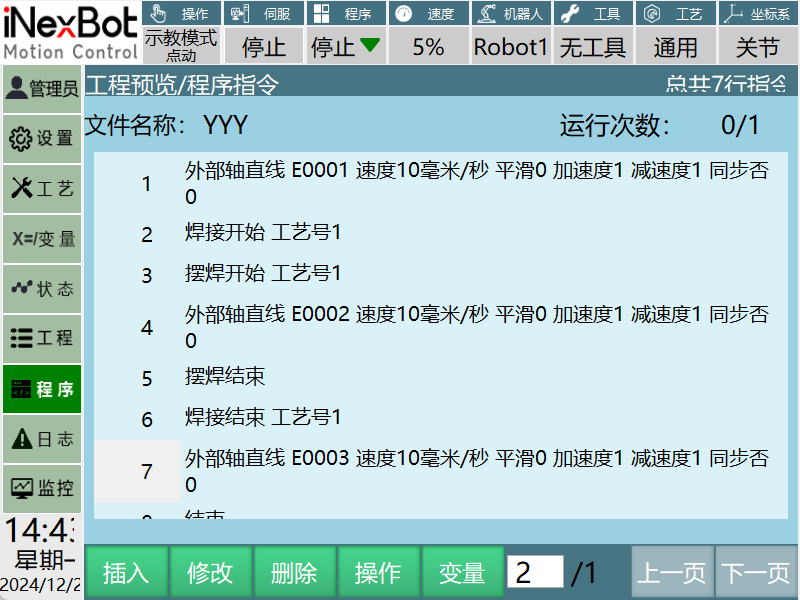

## 9.3 鱼鳞焊使用案例

### 9.3.1 程序编写

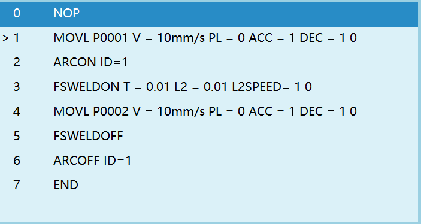

所有参数数值设置仅用作示例说明。

### 9.3.2 **操作含义**

注：1\~2，3\~4 及 6 的步骤含义，参照焊接使用案例。

第3行 FSWELDON 鱼鳞焊开始。

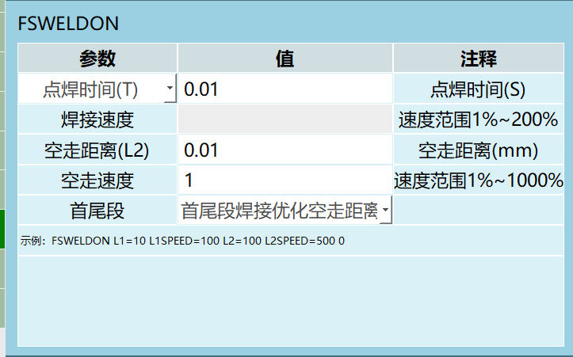

机器人起弧，机器人在 P001 点焊接 2s（即 T=2s），然后机器人灭弧，空走 3mm（即L2=3mm）的距离到 W1 点。

机器人在 W1 点起弧，在 W1 点焊接 2s，灭弧，空走 3mm 到 W2 点。

①起弧，②焊接 2s，③灭弧，④空走 3mm，**循环**前边的 4 个步骤，直至运行到焊接的终点（P002）。

第5行 FSWELDOFF 鱼鳞焊结束；

第3行 FSWELDON 鱼鳞焊开始；

机器人起弧，机器人从 P001 点开始，以焊接的状态运行 L1 的距离到 W1 点（P001 和 W1的距离为 3MM，即焊接距离），然后机器人灭弧，空走 3mm（即 L2=3mm）到 W2 点，机器人在 W2 点起弧，机器人从 W2 边运行边焊接到W3 点，然后机器人灭弧，空走 3mm到 W4 点，①起弧，②焊接 3MM，③灭弧，④空走 3mm，循环前边的 4 个步骤，直至运行到焊接的终点（P002）。

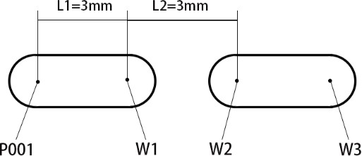

第5行 FSWELDOFF 鱼鳞焊结束。

### 9.3.3 **操作步骤**

- 点击"工程"，点击"新建"，输入程序名称，点击"确定"；

- 将机器人移动到**焊接的起始点；**

- 点击"插入"，选择"运动控制类"，选择 MOVL，点击"确定"，修改速度数值，点击"确定"；

- 点击"插入"，选择"焊接控制类"，选择 ARCON，点击"确定"，输入文件编号（文件编号对应**焊接参数设置**界面中的数值），点击"确定"；

- 点击"插入"，选择"焊接控制类"，选择 FSWELDON，点击"确定"，选择鱼鳞焊类型： 选择一：第一行参数选择 T //选择二：第一行参数选择 L1,输入相应的数值；

- 将机器人移动到**焊接的终点，**点击"插入"，选择"运动控制类"，选择 MOVL，点击"确定"，修改速度数值，点击"确定"；

- 点击"插入"，选择"焊接控制类"，选择 FSWELDOFF，点击"确定"，点击"确定" 点击"插入"，选择"焊接控制类"，选择 ARCOFF，点击"确定"，点击"确定"。

**轨迹确认**：程序编写好之后，转动钥匙，将示教盒从示教模式切换到运行模式，点击"start"，确认机器人的运行轨迹是否正确。

**焊接：**确认运行轨迹正确之后，要打开**焊接使能，**机器人才会执行焊接功能；**使能打开方式起弧焊接案例中有介绍。**

## 9.4 多层多道焊使用案例

### 9.4.1 **参数设置**

1.  进入"**工艺/焊机设置**"，设置焊机控制方式-模拟焊机；

2.  进入"**工艺/焊接IO**"，数字输入：起弧成功信号1-1，数字输出：起弧信号1-2，模拟输入DIN1-1，模拟输出NOUT1-1；

3.  进入"**工艺/电流电压匹配**",设置电流第一行焊接电流填【1】，实际焊接电流【10】；设置电压第一行焊接电压填【1】，实际焊接电压填【10】；

4.  进入"**工艺/焊接参数设置**"，设置起弧参数：起弧电流【8】A起弧电压【8】V起弧时间【2】S；焊接参数：焊接电流【10】A,焊接电压【10】V；收弧电流【7】A，收弧电压【7】V，收弧时间【2】S；

5.  进入"**工艺/焊接装备设置**"-基础功能：电弧检测时间【2】S，电弧检测确认时间【1】S，电弧耗尽检测时间【1】S，飞行起弧打开开关。关气方式-延迟关气填【2】S；

6.  进入"**工艺/手动操作**"，打开焊接使能开关，打开手动起弧模式开关，设置手动点焊电流8A,点焊电压8V，最大时间2S。

### 9.4.2 **操作步骤**

- 点击"工程"，点击"新建"，输入程序名称，点击"确定"；

- 将机器人移动到**焊接的起始点**，点击"插入"，选择"运动控制类"，选择 MOVL，点击"确定"，修改速度数值，点击"确定"；

- 点击"插入"，选择"焊接控制类"，选择 ARCON，点击"确定"，输入文件编号（文件编号对应**焊接参数设置**界面中的数值），点击"确定"；

- 点击"插入"，选择"焊接控制类"，选择 WVON，点击"确定"，输入文件编号（文件编号对应**摆焊参数**界面中的数值）；

- 将机器人移动到**焊接的终点，**点击"插入"，选择"运动控制类"，选择 MOVL，点击"确定"，修改速度数值，点击"确定"；

- 点击"插入"，选择"焊接控制类"，选择 WVOFF，点击"确定"，点击"确定"；

- 点击"插入"，选择"焊接控制类"，选择 ARCOFF，点击"确定"，点击"确定"；

**轨迹确认**：程序编写好之后，转动钥匙，将示教盒从示教模式切换到运行模式，点击"start"，确认机器人的运行轨迹是否正确。

**焊接：**确认运行轨迹正确之后，要打开**焊接使能，**机器人才会执行焊接功能（焊接使能打开方式起弧焊接案例中有介绍）。

### 9.4.3 使用示例（2层3道焊）

1.  点到点；

2.  焊接开始；

3.  初始焊道记录开始；

4.  直线；

5.  初始焊道记录结束；

6.  焊接结束；

7.  焊道偏移计算（2层1道）；

8.  焊道偏移计算（2层2道）；

9.  焊道数计算（选择要运行的焊道和要运行的焊道总数）；

10. 循环开始（使用焊道总数做判断）；

11. 回安全点；

12. 焊接开始；

13. 运行偏移焊道；

14. 焊接结束；

15. 循环结束。

注：二层3道焊：第一层是焊道1，第二层是第2、3条；     

三层4道焊：第一层是焊道1，第二层是第2、3条，第三层 是4、5、6条以此类推。

## 9.5 点焊使用案例

### 9.5.1 操作步骤

1.  进入"工艺/焊机设置"，设置焊机控制方式-模拟焊机；

2.  设置焊接信号。

| Input       | Output        |
|-------------|---------------|
| 数字输入        | 起弧成功信号1-1 |
| 数字输出        | 起弧信号1-1     |
|                 | 送丝信号1-2     |
|                 | 退丝信号1-3     |
|                 | 送气信号1-4     |
| 模拟输入        | AIN1-1          |
| 模拟输出        | AOUT1-1         |

3.  进入"工艺/电流电压匹配",设置电流第一行焊接电流填【1】，实际焊接电流【10】；设置电压第一行焊接电压填【1】，实际焊接电压填【10】；

4.  进入"工艺/手动操作"，打开焊接使能开关，设置手动点焊电流8A,点焊电压8V，最大时间2S 。

## 9.6 摆焊参考点使用案例

### 9.6.1 **参数设置**

1.  进入"工艺/焊机设置"，设置焊机控制方式-模拟焊机；

2.  进入"工艺/焊接IO"，数字输入：起弧成功信号1-1，数字输出：起弧信号1-2，模拟输入DIN1-1，模拟输出NOUT1-1；

3.  进入"工艺/电流电压匹配",设置电流第一行焊接电流填【1】，实际焊接电流【10】；设置电压第一行焊接电压填【1】，实际焊接电压填【10】；

4.  进入"工艺/焊接参数设置"，设置起弧参数：起弧电流【8】A起弧电压【8】V起弧时间【2】S；焊接参数：焊接电流【10】A,焊接电压【10】V；收弧电流【7】A，收弧电压【7】V，收弧时间【2】S；

5.  进入"工艺/焊接装备设置"-基础功能：电弧检测时间【2】S，电弧检测确认时间【1】S，电弧耗尽检测时间【1】S，飞行起弧打开开关。关气方式-延迟关气填【2】S；

6.  进入"工艺/手动操作"，打开焊接使能开关，打开手动起弧模式开关，设置手动点焊电流8A,点焊电压8V，最大时间2S；

7.  将当前位置设为摆焊参考点增加一条REFP指令MOVL轨迹加REFP标定的一点组成摆焊平面，确定摆焊方向；

8.  参考点方式：摆焊平面；

9.  摆焊平面：搭配摆焊开始指令使用，确定摆焊的坐标系。

注：直线摆焊时可用，在摆焊开始后，运动指令前插入参考点指令，可以确定摆焊平面。

使用示例：

1.  点到点p001

2.  焊接开始

3.  摆焊开始

4.  直线p002

5.  摆焊参考点P004

6.  直线p003

7.  摆焊结束

8.  焊接结束

9.  回安全点

---

## 问答 (Q&A)

**Q1: 2207焊接工艺手册中支持哪几种焊机控制方式？**

A: 支持模拟控制和数字控制两种方式。数字控制支持CAN、ModBus RTU、EtherCAT、ModBus TCP四种通讯方式。

**Q2: 如何设置焊接参数？**

A: 进入"工艺/焊接工艺/焊接参数设置"页面，点击修改后可设置起弧参数（起弧电流、电压、时间）、焊接参数（焊接电流、电压）、收弧参数（收弧电流、电压、时间），每个工艺号支持独立配置。

**Q3: 飞行起弧的作用是什么？**

A: 飞行起弧允许在机器人从安全点移动到焊接起始点的过程中提前送气，减少等待时间，提高焊接效率。

**Q4: 摆焊支持哪几种摆动方式？**

A: 支持正弦摆、Z字摆、圆形摆、外部轴定点摆四种摆动方式。

**Q5: 发生断弧后有哪些再启动模式？**

A: 三种模式：自动再启动（伺服和程序继续运行）、半自动再启动（伺服运行但程序暂停，需手动启动）、停机（伺服就绪程序停止，需清错后手动启动）。

**Q6: 鱼鳞焊指令是什么？**

A: FSWELDON开始鱼鳞焊，FSWELDOFF结束鱼鳞焊。参数包括点焊时间T、焊接距离L1、走空距离L2。

**Q7: 多层多道焊如何实现？**

A: 通过WELDPATHSTART记录初始焊道，再用WELDPATHOFFSET计算偏移焊道，最后用STARTOFFSETWELD运行偏移焊道，配合循环实现多层多道焊接。

**Q8: 防碰撞功能如何使用？**

A: 在焊接装备设置中开启防碰撞使能，设置防碰撞IO、触发电平、快速停止时间等参数。触发后可设置屏蔽时间来移动焊枪到安全位置。

**Q9: 手动点焊操作步骤是什么？**

A: 在手动操作界面设置点焊电流、点焊电压、最大时间并保存。长按手动点焊按钮即可进行点焊，松开即停止。

**Q10: 如何进行微调整？**

A: 在焊接装备设置中设置单次调整量，焊接过程中通过状态栏的微调整面板点击"给定值增加"或"给定值减小"来实时调整电流和电压。