# 1 **使用场景**

机器人码垛主要应用于食品、饮料、物流等产业，也是工业机器人应用的典型事例，配以不同抓手，可实现在不同行业各种形状的成品进行装箱和码垛。码垛的意义在于将成堆的物品通过一定的模式码成垛，使得物品能够容易的搬运、卸载以及存储。

传统的码垛都是由人工来完成，这种码垛存方式在很多情况下无法适应当今高科技发展，当生产线速度过高或者产品的质量过大，人力就难以满足要求，而且利用人力来进行码垛，所要求的人数多，所付的劳动成本很高，然而还不能提高生产效率。

为了提高搬运卸载的效率，提高码垛的质量，节约劳动成本，保证企业员工的人身安全，码垛机器人的应用将会越来越广泛。

# 2 **简易码垛/完整码垛**

进入工艺/码垛工艺/码垛参数，支持99个工艺号参数。可以选择简易码垛和完整码垛。

**清空参数**:清空的是你当前选中的工艺号，完整码垛/简易码垛的参数。

**复制参数**:当前选中的工艺号，完整码垛/简易码垛的参数可以复制到你想要复制的工艺号里面。

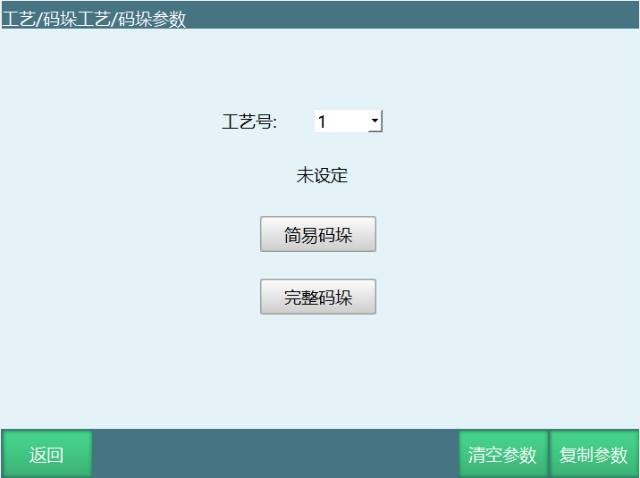

注：简易码垛工艺号最好不要和完整码垛的工艺号选择同样的工艺号，如果简易码垛的工艺号为1设置好参数后，将工艺号1换成完整码垛，就要重新设置完整码垛的参数，选择不同的工艺号可以节省时间，避免程序运行时出错。

## 2.1 完整码垛

### 2.1.1 **参数设置**

完整码垛按流程可以进行抓手设置、托盘设置、工件参数、重叠模式、位置设置、平面模式；

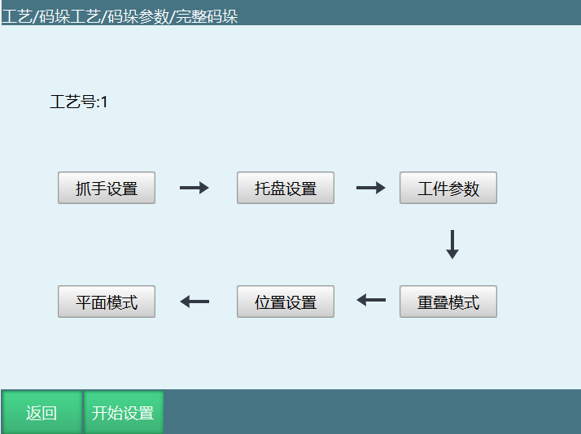

### 2.1.2 抓手设置

抓手设置就是设置码垛过程中用到的工具手。

两个吸盘分别取料（一个吸盘吸完后再切换到另一个吸盘取料），那么要设置成两个抓手。

两个吸盘同时取料，则设置成一个抓手。

如果两个吸盘分别放料（一个吸盘放完后切换到另一个吸盘放料），此时需要设置两个抓手

两个吸盘同时放料，则设置成一个抓手。

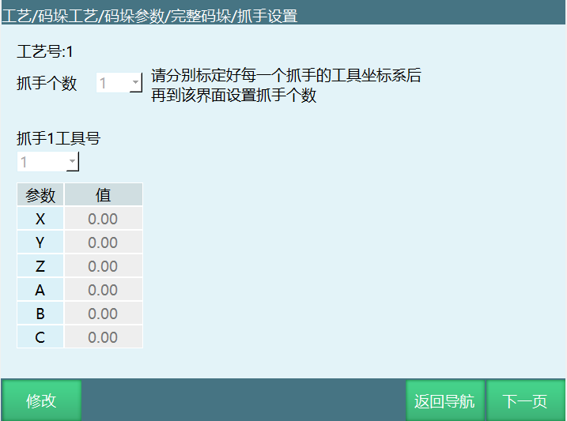

请提前到【设置-工具手标定】界面中标定抓手（工具手），再在此界面设置抓手；

**抓手个数**：抓手的个数，根据实际情况设置，最多可设置4个抓手。

**抓手X工具号**：设置抓手所对应的工具手号，工具手参数需提前标定。

**参数值：**工具手标定界面标定完成工具坐标后，在此界面选中标定好的工具手号后每个轴的参数值。

### 2.1.3 托盘设置

托盘的设置就是设置托盘用户坐标的工程，在本界面需标定好托盘的原点、托盘的Y方向和托盘的X方向。

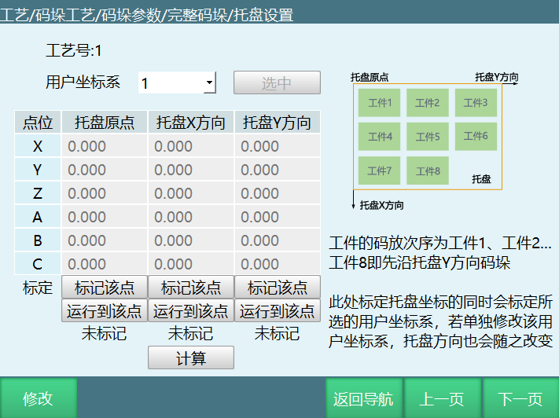

**用户坐标系**：托盘坐标，根据需要选择要标定的用户坐标，标定托盘坐标（用户坐标），若之后在用户坐标标定中更改坐标系位置，此处坐标系也会跟着改变。

注: 请使用抓手1所选的工具手进行标定，当不标定用户坐标（托盘坐标）时，用户坐标参数值为0时，同直角坐标系一致。

标记X方向与Y方向时一定要以机器人原X、Y方向为基础，否则标记出的托盘Z方向会向下，码垛时第二层会向下码。

### 2.1.4 工件参数

工件参数可以设置所码工件在用户坐标下的长宽高和间隙；

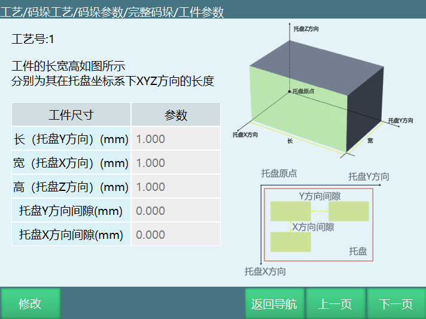

长宽高分别为其在托盘坐标系（用户坐标系）下的YXZ方向的长度。

**工件尺寸**：参数说明。

**长**：工件在托盘坐标系下Y方向的长度。

**宽**：工件在托盘坐标系下X方向的长度。

**高**：工件在托盘坐标系下Z方向的长度。

**托盘Y方向间隙**：在托盘坐标系下Y轴方向，两个工件之间缝隙距离的长度。

**托盘X方向间隙**：在托盘坐标系下X轴方向，两个工件之间缝隙距离的长度。

### 2.1.5 重叠模式

重叠模式可以设置码垛的垛层和图形模板选择、及其他相关参数；

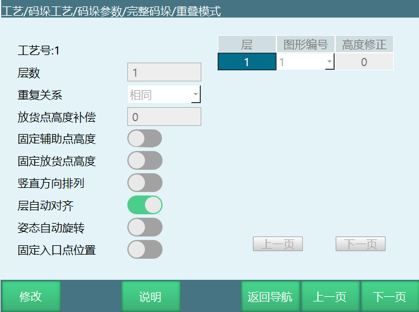

**层数**：码垛的总层数，根据实际需要填写。

**重复关系**：每层之间的重复关系。

**选择相同**：则每一层都使用相同的图形模板。

**选择交替**：则每两层的图形模板交替。

**选择自定义**：则需用户自己选择每一层使用的图形模板。

**相同**：每一层图形模板都相同，码垛为同一个图形模板，选择该选项时，右侧列表仅第一层可修改，修改后下面所有层均随之改变。下图是层数选择为6层，重复关系选择相同。

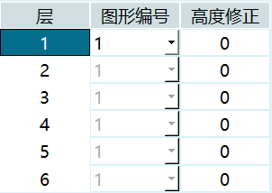

**交替**：两种图形模板交替使用，选择该项后，右侧列表仅前两层可修改，修改后下面所有层均重复该两层的图形编号。下图是层数选择为6层，重复关系选择交替。

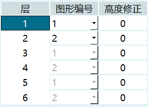

**自定义**：每层图形模板都可单独设置。下图是层数选择为6层，重复关系选择自定义。

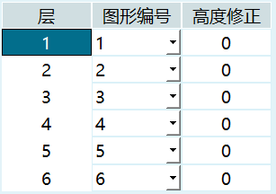

**重复**：重复关系使用自定义且层数较多时，若所有层均重复前N层的图形模板，则在填写好前N层的图形模板后，选中第N+1层，点击该按钮，以下各层自动重复。

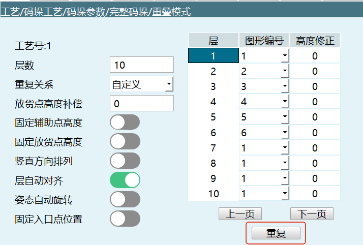

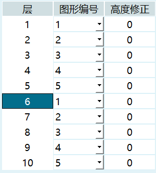

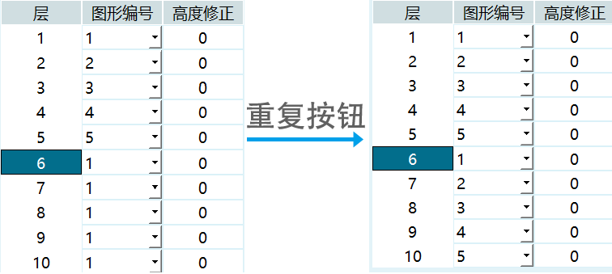

**固定辅助点高度**：如果码垛的层数为两层时，打开此按钮，第一层工件与第二层工件的辅助点是同一个点位，不会再运行第二层的工件时辅助点向Z+方向偏移。

例如：在一个四周封闭的盒子里需要码垛工件，如果码垛的工件比较多的话，每码一个工件设置的工件辅助点随着码垛工件个数的增加辅助点会越来越高，很可能会超过机器人关节参数的限位，为了防止出现这类错误，我们就可以打开固定辅助点高度按钮，设置好固定辅助点高度位置，这样的话随着码垛工件个数的增加，辅助点高度一直是同样的位置，就不会出现关节参数超限的情况，也能保证操作人员的安全。

**放货点高度补偿**：填入后，所有工件的放货点的高度将偏移，偏移的高度自己可以根据实际需要填写。数值为正则向Z+方向偏移，数值为负则向Z-方向偏移（卸垛时此参数无效）

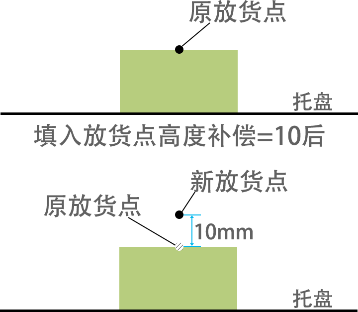

**固定放货点高度**：选中后，码每一层的时候放货点的高度都相同,高度为标记的工件点高度（仅在码垛时有效），如果码垛的层数大于一层时（以两层为例），打开此按钮，每一层每个工件的工件点都是同一高度，不会在码垛第二层时工件点的高度向Z+方向偏移。

**竖直方向排列**：选中竖直方向排列后，将先码完竖直方向的一列后再码下一个竖直列。

**层自动对齐**：选中层自动对齐则将每层模板自动对齐，将自动计算X轴，Y轴偏移量。

**姿态自动旋转**：选中后当码垛时工具手以一个固有姿态无法达到辅助点和放料点，但旋转一下工具手的姿态即可达到时，会自动旋转。该功能仅在辅助点和工件点都使用关节插补时有效。

**固定入口点位置**：取料后每码一个工件都会在同一个入口点，在进入入口点过程中会优化Z轴。

**位置设置：**位置设置可以设置码垛工件点、辅助点、入口点，请带抓手设置所选的工具手进行位置标记；

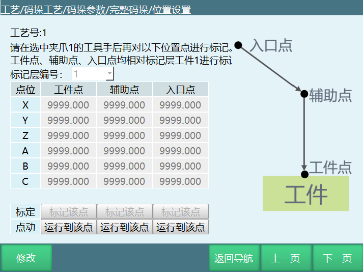

**标记层编号**：当前标定工件点位于第几层，省去清除垛堆过程，可以直接选择标记当前层。

**工件点**：该标记层第一个取料点或最后一个放料点。

**注：码垛参数设置界面的工件顺序都是按照码垛排序的，卸垛则顺序相反。**

**辅助点**：与工件点配合使用，使工件可以更安全的摆放到工件点，一般设置在工件点的上方，如果工件需要旋转角度，则会在到达辅助点之前旋转，该点会跟随工件的摆放位置而进行自动偏移。

**入口点**：托盘的入口点，为防止机器人与其他物体碰撞，尽量把机器人的安全位置设置为入口点，该点会跟随工件的摆放位置而在Z轴方向进行自动偏移。码垛入口点指令打开XYZ优化，运行到入口点时ABC轴坐标发生了变化。

**标记该点**：机器人先移动到位置，再点标记该点。

**运行到该点**：标记的值点击保存后才能移动到标记的点，不保存时，移动到的点为之前标记的点，若要移动到该点，需按下DEADMAN按键后点击该按钮。

**注：请带抓手设置所选的工具手进行位置标记。**

**平面模式**

平面模式设置码垛的图形模板；

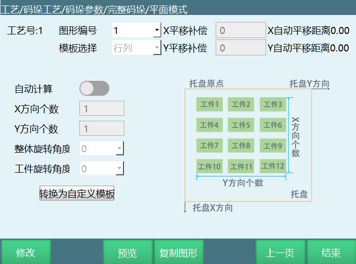

**图形编号**：图形模板的编号。

**模板选择**：分为4种固定图形模板和自定义图形模板，分别是行列、纵横交错、回字形、五花垛，自定义。

**X平移补偿**：整体图形模板相对于原码垛位置在托盘坐标系X轴上的偏移量。

**Y平移补偿**：整体图形模板相对于原码垛位置在托盘坐标系Y轴上的偏移量。

**自动计算**：根据托盘设置界面，标定出来的用户坐标系生成一个长方形托盘，根据工件大小自动计算X方向可以放多少个工件，Y方向可以放多少个工件。

**X方向个数**（行列模板、纵横交错模板）：工件在X方向上的个数（纵横交错的X方向上的个数为工件长边在X轴上的个数）。

**Y方向个数**（行列模板、纵横交错模板）：工件在Y方向上的个数（纵横交错的Y方向上的个数为工件长边在Y轴上的个数）。

**整体旋转角度**（行列模板、纵横交错模板、回字形模板）：整体绕第一个工件点顺时针旋转的角度。可以旋转0°，90°，180°，-90°。

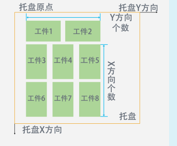

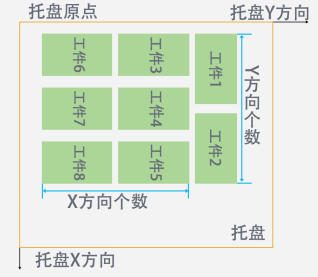

**（整体旋转角度0度） （整体旋转角度90度）**

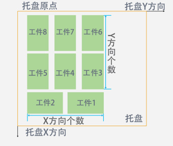

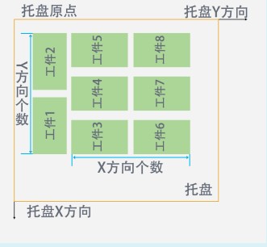

**（整体旋转角度180度） （整体旋转角度-90度）**

**工件旋转角度**（行列模板、纵横交错模板、回字形模板，五花垛模板）：图形模板所有工件都绕顺时针旋转的角度，可以旋转0°，90°，180°，-90°。

**预览**：预览设置的图形模板，可用于检查图形模板是否设置正确，此处模板选择纵横交错模板,X方向工件个数是2，Y方向个数是3。

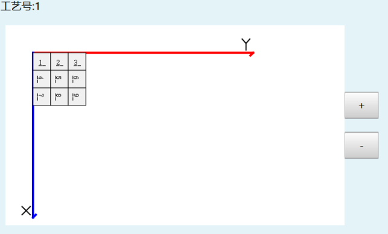

**模板选择**

**行列**：整层图形模板的工件方向一致，依次码放，下图所示为X方向工件个数是4，Y方向个数是3。

**纵横交错**：工件方向有横向的、竖向的，交错排列（该模板的X方向个数为工件长在X轴的个数，Y方向个数为工件长在Y轴的个数），下图所示为X方向工件个数是2，Y方向个数是2（X方向的工件3\~6较Y方向的工件1\~2顺时针旋转了90度）。

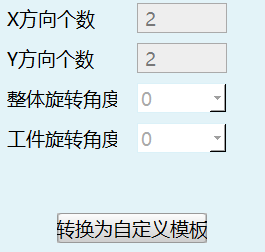

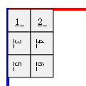

**回字形**：工件一层4个，成回字形排列（第二个工件较第一个工件顺时针旋转90度，第三个工件较第一个工件顺时针旋转180度，第四个工件较第一个工件逆时针旋转90度）。

**五花垛**：工件分成三块区域：A区、B区、C区；A区与C区的列数可以一起设置，B区单独设置列数（如图B区的工件4\~7较A区的工件1-3和C区的工件8-13顺时针旋转了90度）如图1所示A区和C区的工件以列数最多的B区为基准保持工件左右对齐。

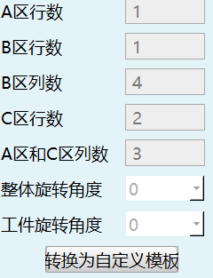

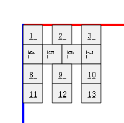

**整体旋转角度0°**

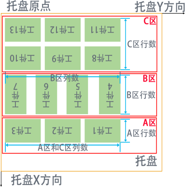 **整体旋转180°**

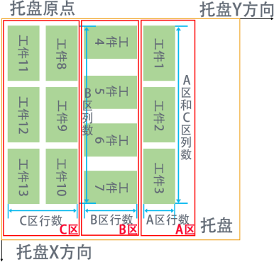

**整体旋转90°**

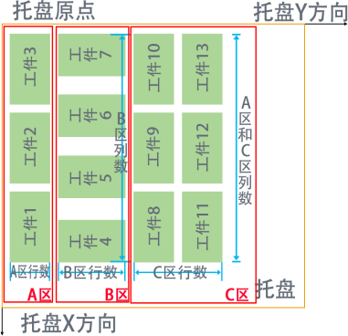

**整体旋转-90°**

**自定义**：自定义图形模板。

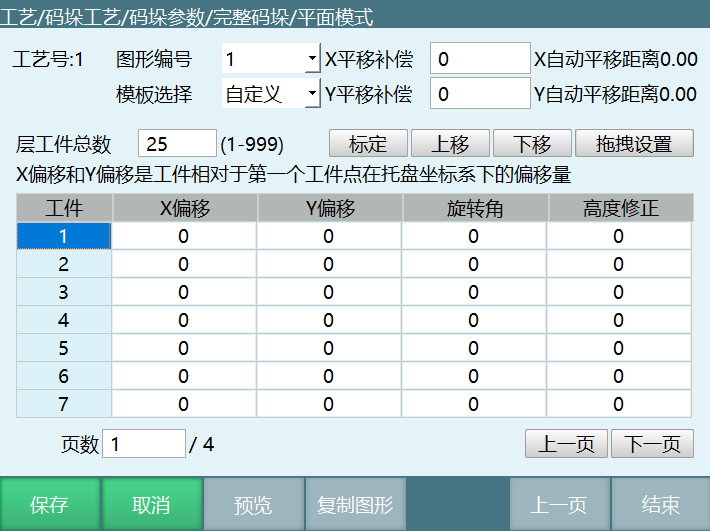

**层工件总数**:码垛工件总数，根据实际需要来设定。**注：**修改工件总数会清空所有工件参数。

**标定**:可以自己设置工件码垛时的点位，确定好点位后点击标定按钮。如果第一次设置的码垛时的工件点位想要修改的话，可以点击工件的编号，将机器人移动到自己想要的位置后点击标定，这样工件的点位就修改完成了。

**上移**:工件点位标定完成后想要将码垛工件2的位置设置为码垛工件1的位置，可以点击上移按钮，这样工件1的位置就发生了变化。这里以两个工件为例。

工件2上移后：

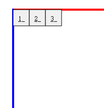

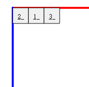

**下移**:工件点位标定完成后想要将码垛工件1的位置设置为码垛工件3的位置，可以点击下移按钮，这样工件3的位置就发生了变化。

工件1下移后：

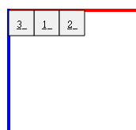

**X偏移**：工件点在X轴上的偏移量。

**Y偏移**：工件点在Y轴上的偏移量。

**旋转角**：工件相对于第一个工件点角度旋转的角度。

**高度修正**：填写后，工件点、辅助点、入口点在该工件码垛时高度将偏移，数值为正则向Z+方向偏移，数值为负则向Z-方向偏移，可对工件点、辅助点、入口点高度进行修正。

**拖拽设置**：码垛工件数设置完成后，点击拖拽设置按钮，如图所示可以将工件点拖拽到你想要的任何位置。自定义除了可以填写XY偏移，也可以对工件直接进行拖拽。

**注：进入拖拽设置前，要先在自定义里设置好层工件总数，点击保存后，在点击修改-拖拽设置；拖拽设置完成后，先点击拖拽设置内的保存按钮，返回进入自定义界面，再次点击保存。**

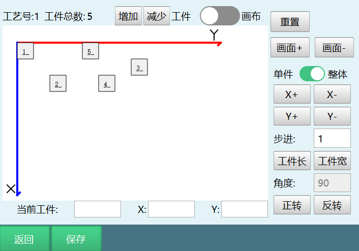

**增加**:增加工件的个数，根据自己需要来增加工件个数。

**减少**:减少工件的个数。

**工件/画布**：按钮关闭可以拖动工件，按钮打开可以拖动画布。

**重置**：重置画布位置。

**画面**+：画面放大。

**画面**-：画面缩小。

**单件/整体**：单件/整体工件在X或者Y方向的偏移，打开单件/整体按钮，可以对所有的工件进行X或者Y方向的偏移，关闭单件/整体按钮，可以对自己当前选中的工件进行X或者Y方向的偏移。

**X+/X-**：整体往X正或负方向偏移步进值。

**Y+/Y**-：整体往Y正或负方向偏移步进值。

**步进**：工件在X或者Y方向的偏移量。

**角度**：设置每次旋转的角度，打开单件/整体按钮，所有工件都会进行旋转，关闭单件/整体按钮，可以对自己当前选中的工件进行旋转。

**正转/反转**：工件以自身进行旋转设置角度值。

## 2.2 简易码垛

### 2.2.1 参数设置

简易码垛参数设置按流程可以进行抓手设置，位置设置；

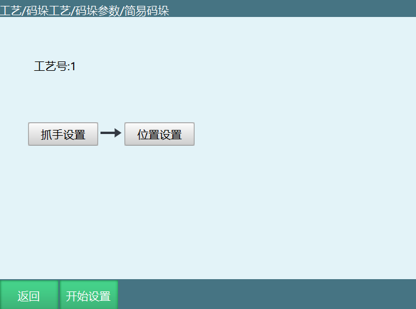

当前使用类型：简易码垛、完整码垛共用码垛号时，使用前需要设置正确的类型。

### 2.2.2 抓手设置

抓手设置可以选择码垛的抓手（工具手），请提前到【设置-工具手标定】界面中标定抓手（工具手），再在此界面设置抓手；

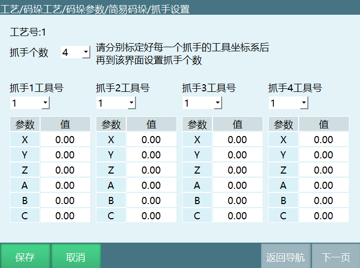

**抓手个数**：抓手的个数，根据实际情况设置。

**抓手X工具号**：设置抓手所对应的工具手号，工具手参数需提前标定。

**参数值**：参数值为工具手末端的偏移量，此处只可以选择，不可以标定。

### 2.2.3 位置设置

简易码垛仅提供行列模式垛型使用。且所有码垛的方向与位置点均为标记出来的，即使标记的不是矩形垛型也会按照标记方向的去码。

简易码垛仅需设置码垛抓手、标记6个位置点。抓手的设置与完整码垛相同。若码垛有多个抓手分别进行取料和码垛，请用第一个抓手标记位置点，其它抓手的动作将自动计算。

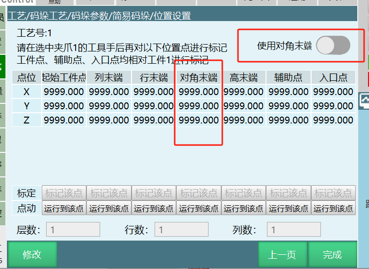

**起始工件点**：码垛时第一个工件的位置点。

**列末端**：码垛时列（用户坐标X轴）方向最后一个工件的位置点。

**行末端**：码垛时行（用户坐标Y轴）方向最后一个工件的位置点。

**对角末端**：行末端对角末端连线与列末端对角末端连线相交的位置点（如下图所示）。

**高末端**：码垛时最后一层第一个工件的位置点。

**辅助点**：码垛的辅助点，建议设置为起始工件点的上方。

**入口点**：码垛时的入口点，建议设置为托盘外一个安全点。

**层数**：码垛的总层数。

**行数**：码垛总行数。

**列数**：码垛总列数。

**注意：若不开启"打开对角末端"开关，则填入的对角末端参数无法调用。**

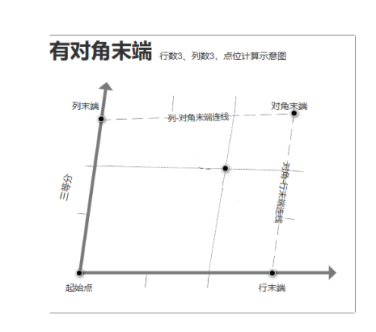

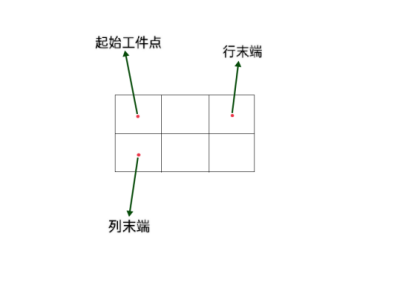

### 2.2.4 **生成文件**

使用生成文件可以生成标准的码垛、卸垛程序，需要提前设置好工艺号内的参数。

简易码垛生成文件功能，无IO禁止使用。

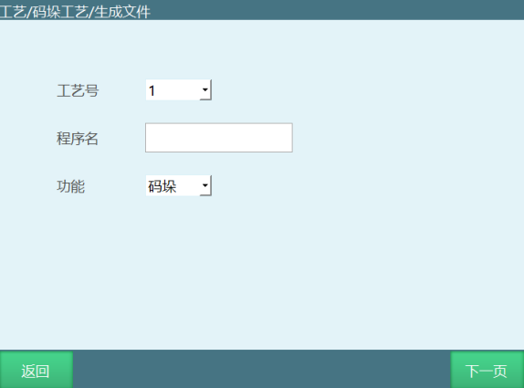

当前使用类型：简易码垛、完整码垛共用码垛号时，使用前需要设置正确的类型。

**工艺号**：工艺号选择后要确认码垛当前使用类型是否设置。

**程序名**：需要英文字母开头(纯中文也可以)。

**功能**：码垛、卸垛。

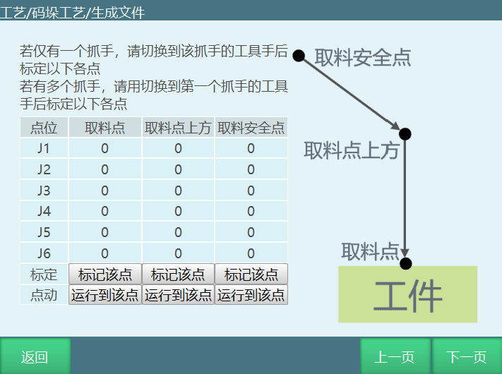

**标记该点**：示教到对应的点点击标定该点即可。

**运行到该点**：点击运行到该点，验证点位示教是否正确。

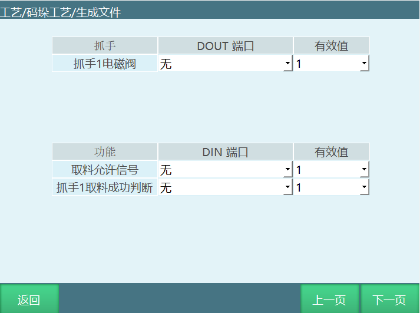

**抓手电磁阀**：抓手IO输出信号，抓手电磁阀DOUT端口必须设置，生成文件功能只支持1路输出，需要多路输出可在作业文件生成后返回工程修改输出信号指令。

**取料允许信号**：码垛取料前等待取料允许信号，根据自身情况选择。

**抓手取料成功信号**：判断抓手取料成功信号。

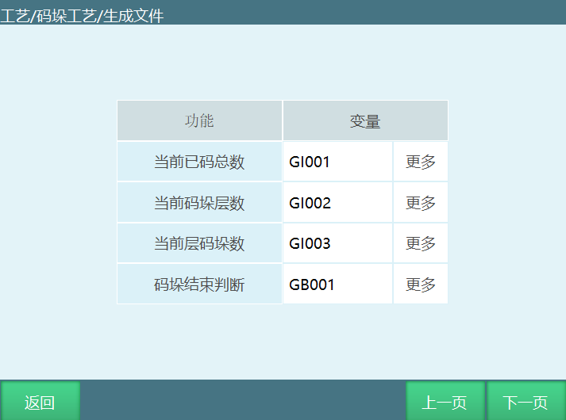

注:当前已码总数、当前码垛层数、当前层码垛数如果在生成作业不选择变量类型，在执行码垛程序时我们可以在工艺栏-码垛工艺界面查看。

**当前已码总数**：把当前已码总数变量的值缓存到设置的变量里。

**当前码垛层数**：把当前码垛层数变量的值缓存到设置的变量里。

**当前层码垛数**：把当前层码垛数变量的值缓存到设置的变量里。

**码垛结束判断**：码垛完成后，改变变量值跳出while循环 。

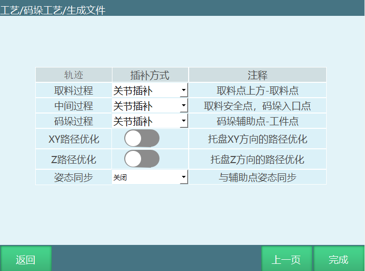

**取料过程**：取料点，可以改为关节插补或直线插补。

**中间过程**：码垛入口点，可以改为关节插补或直线插补。

**码垛过程**：码垛入口点，码垛辅助点，工件点，可以改为关节插补或直线插补。

**XY路径优化**：点击开启后，可以优化托盘的XY方向的路径。

**Z路优化**：点击开启后，可以优化托盘的Z方向的路径。

**姿态同步：**

- 关闭：姿态按照设定点位执行；

- 与辅助点姿态同步：以辅助点的姿态移动到入口；

- 自动计算姿态：根据入口点到辅助点，辅助点到工件点的距离之比，自动计算出入口点运行到辅助点工件点之间的轨迹姿态，运动过程中期间的C姿态是一直旋转的。例如入口点到辅助点与辅助点到工件点的距离比是2:8，从入口点到工件点的C姿态一共转了100°，那么1从工件点到辅助点时会转20°，剩下的80°会在辅助点到工件点之间转完。

### 2.2.5 位置调试

**工艺号**：当前参数的工艺号。

**层工件总数**：该层工件总数。

**上层**：切换到上一层。

**下层**：切换到下一层。

**工件/画布**：按钮关闭可以拖动工件，按钮打开可以拖动画布。

**重置**：重置画布位置。

**画面+**：画面放大。

**画面-**：画面缩小。

**整体偏移**：操作整体工件偏移。

**X偏移**：整体往X正或负方向偏移步进值。

**Y偏移**：整体往Y正或负方向偏移步进值。

**Z偏移**：整体往Z正或负方向偏移步进值。

**角度**：设置每次旋转的角度。

**各工件角度**：整体偏移角度。

**应用到相同层**：把当前层设置的参数应用到相同图形编号的层。

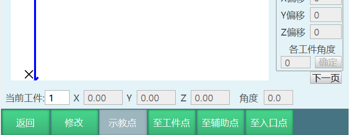

**当前工件**：1表示工件的编号。

X表示工件向X轴正或负偏移；

Y表示工件向Y轴正或负偏移；

Z表示工件向Z轴正或负偏移；

角度表示工件当前选择多少度。

**工件/画布功能演示**

按钮打开拖动整个画布，但是不影响工件坐标。

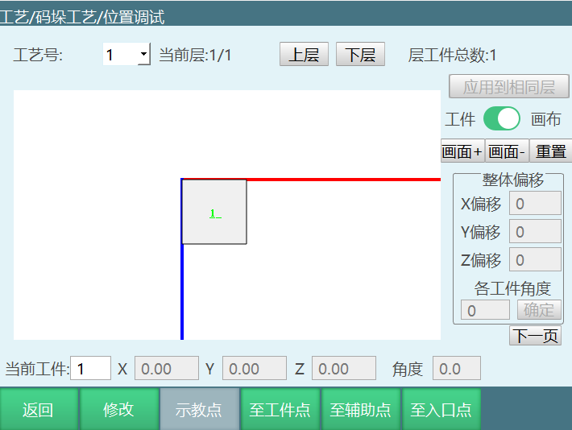

**重置功能演示**

点击重置按钮后，画布回到初始位置，但是画布大小不重置。

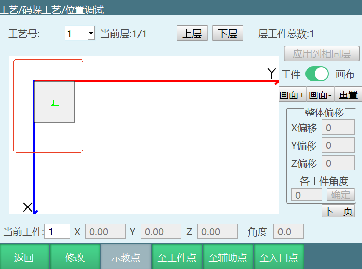

**画面+、画面-功能演示**

点击画面+，画布放大。

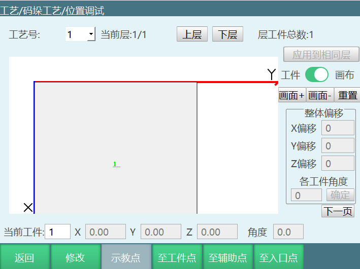

点击画面-，画布缩小。

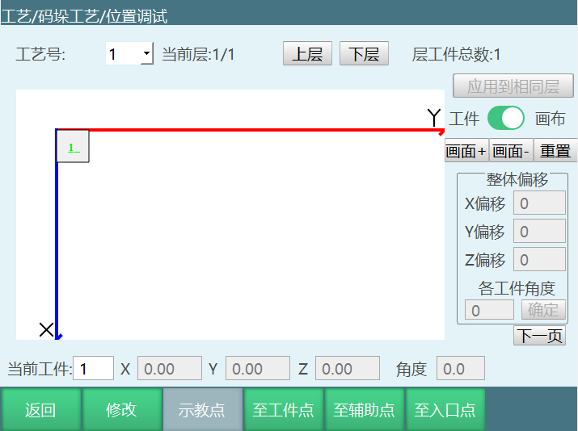

**单件/整体偏移功能演示**

填写坐标值，也是偏移X、Y，Z,角度（因为是平面，所以Z轴看不出效果）的值，例如填X:26,Y:10,Z:1，角度45；

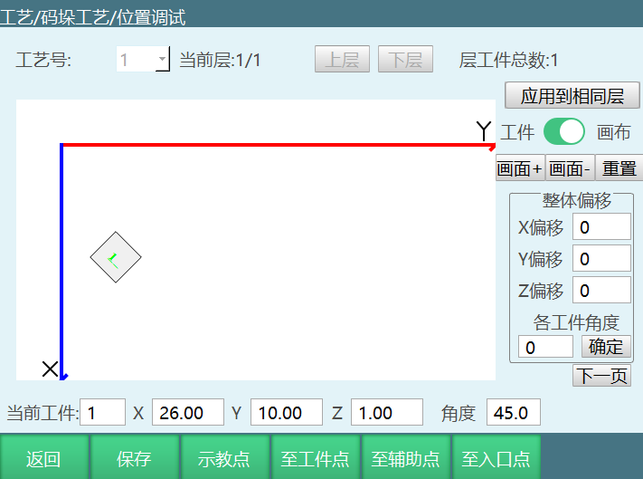

**形态修改功能演示**

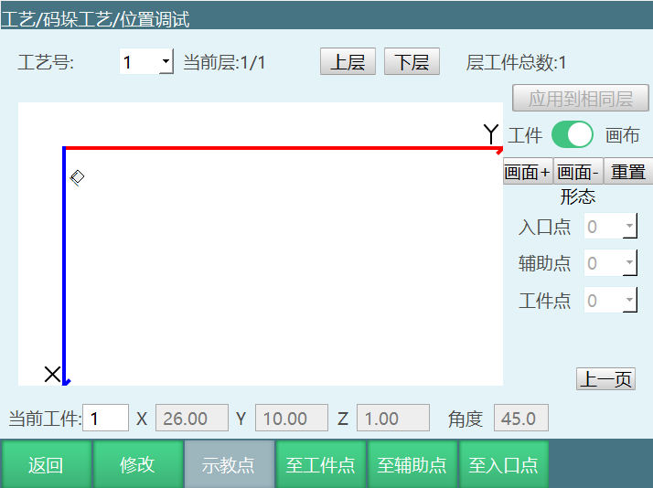

形态可以修改当前选中工件的入口点、辅助点、工件点形态值，当工件因形态原因位置不可达时，可在该页面修改形态值使程序运行时可以到达该位置。

**入口点**：修改当前选中工件的入口点形态值（0\~8）。

**辅助点**：修改当前选中工件的辅助点形态值（0\~8）。

**工件点**：修改当前选中工件的工件点形态值（0\~8）。

### 2.2.6 码垛状态

码垛状态可用来查看当前码垛状态，如果码垛需从中间开始，可通过设置需要码的层数和个数来实现。

码垛数会在控制器重启后清零，重新运行不清零。

码垛状态可在【状态栏-工艺-码垛】中查看，有两种方法；可以在操作参数中设置，工艺选择栏选择码垛工艺（操作参数中选择码垛会一直默认码垛工艺）；也可以直接在示教器上方导航栏工艺中选择码垛。

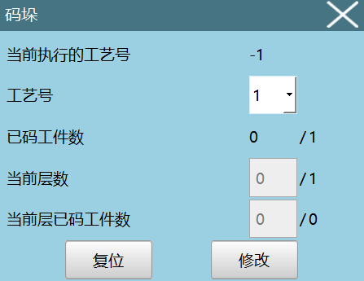

**工艺号**：码垛的工艺号。

**已码工件数**：已码工件数/总工件数。

**当前层数**：当前正在码的层数/总层数（如码垛需在中间开始，设置需要码的层数即可），这里以两层码垛为例，当机器人正在进行第一层工件码垛时，可以将当前层数设置为2，然后机器人会进行第二层工件的码垛，已码的工件数的显示也会发生变化。

**当前层已码工件数**：当前层已码工件数/当前层总工件数（如码垛需在中间开始，设置需要码的个数即可）例如现在正在进行第3个工件的码垛，如果想要从第7个工件开始码垛，然后就可以修改当前层已码工件数，按照自己需要的工件数开始码垛。

**复位**：清除已记录的码垛数据。

**修改**：机器人在码垛的过程中，点击修改可以修改当前层数和当前层已码的工件数。

# 3 **码垛指令**

## 3.1 PALON（开始码垛）

**功能**：码垛开始判断。

**工艺号**：工艺号1-99。

**类型**：码垛、卸垛。

**当前已码总数变量**：把当前已码总数变量的值缓存到设置的变量里。

注：可通过修改变量控制码第几层第几个工件。

**当前码垛层数变量**：把当前码垛层数变量的值缓存到设置的变量里。

注：可通过读取变量控制码第几层第几个工件。

**当前层垛数变量**：把当前层垛数变量的值缓存到设置的变量里。

注：可通过读取变量控制码第几层第几个工件。

示例：PALON ID=1 TYPE=0 \[变量名\]\[变量名\]\[变量名\] 。

**注：码垛开始PALON指令3个计数变量会直接写到配置中，不需要使用写入文件FORCESET指令。**

## 3.2 PALGRIPPER（切换抓手）

**功能**：选取抓手。

**工艺号**：工艺号1-99。

**抓手**：抓手1、抓手2、抓手3、抓手4。

示例：PALGRIPPER ID=1 GRIPPERS=1。

## 3.3 PALENTER (码垛入口点)

**功能**：码垛入口点。

**工艺号**：工艺号1-99。

**插补方式**：关节插补、直线插补、圆弧插补、门型插补。

**关节插补**：机器人将以关节插补的方式移动到该点。

**直线插**补：机器人将以直线插补的方式移动到该点。

**圆弧插补**：机器人将与另外两点（上一个点插MOVJ/MOVL,下一点MOVC）组成圆弧轨迹。

**门型插补**：机器人将以门型插补的方式移动到该点。

**VJ**：速度范围1-100（关节插补速度）V：速度范围1-1600（直线、圆弧、门型插补速度，该速度范围取决于笛卡尔速度）。

**PL**：平滑过渡范围0-5。

**ACC**：加速度范围0-100。

**DEC**：减速度范围0-100。

**XY优化**：优化XY轴运动路径。

**Z优化**：优化Z轴运动路径，需在码垛前插入一个固定点。

- 当入口点高度比固定点低时，入口点在高度上会和固定点、辅助点处于同一值线上（侧视同一直线，俯视不是同一直线，XY轴不变）。

- 当入口点高度位于固定点与辅助点之间时，入口点高度不变。

- 当入口点高度位于固定点、辅助点之上时，入口点高度将优化到与固定点水平的高度。

- 当入口点、辅助点高度都高于固定点时，入口点高度将优化到与辅助点水平高度。

**姿态**：

关闭：姿态按照设定点位执行。

辅助点姿态同步：以辅助点的姿态移动到入口点 。

自动计算姿态：在入口点前和后各有一个姿态，入口点姿态会在这两个姿态间计算出来。

**TIME**：提前执行时间，范围非负整数，单位ms，提前执行下一条指令。

示例：PALENTER ID=1 MOVJ VJ=10% PL=0 ACC=20 DEC=20 OFF OFF 0 0。

## 3.4 PALSHIFT（码垛辅助点）

**功能**：码垛辅助点。

**工艺号**：工艺号1-99。

**插补方式**：关节插补、直线插补、圆弧插补、门型插补。

**关节插补**：机器人将以关节插补的方式移动到该点。

**直线插补**：机器人将以直线插补的方式移动到该点。

**圆弧插补**：机器人将与另外两点（上一个点插MOVJ/MOVL,下一点MOVC）组成圆弧轨迹。

**门型插补**：机器人将以门型插补的方式移动到该点。

**VJ**：速度范围1-100（关节插补速度）V：速度范围1-1600（直线、圆弧、门型插补速度，该速度范围取决于笛卡尔速度）。

**PL**：平滑过渡范围0-5。

**ACC**：加速度范围0-100。

**DEC**：减速度范围0-100。

**TIME**：提前执行时间，范围非负整数，单位ms，提前执行下一条指令。

示例：PALSHIFT ID=2 MOVJ VJ=30% PL=2 ACC=20 DEC=20。

## 3.5 PALREAL（码垛工件点）

**功能**：码垛工件点。

**工艺号**：工艺号1-99。

**插补方式**：关节插补、直线插补、圆弧插补、门型插补。

**关节插补**：机器人将以关节插补的方式移动到该点。

**直线插补**：机器人将以直线插补的方式移动到该点。

**圆弧插补**：机器人将与另外两点（上一个点插MOVJ/MOVL,下一点MOVC）组成圆弧轨迹。

**门型插补**：机器人将以门型插补的方式移动到该点。

**VJ**：速度范围1-100（关节插补速度）V：速度范围1-1600（直线、圆弧、门型插补速度，该速度范围取决于笛卡尔速度）。

**PL**：平滑过渡范围0-5。

**ACC**：加速度范围1-100。

**DEC**：减速度范围1-100。

**TIME**：提前执行时间，范围非负整数，单位ms，提前执行下一条指令。

示例:PALREAL ID=2 MOVJ VJ=30% PL=2 ACC=20 DEC=20。

## 3.6 PALCLEAR（码垛复位）

**功能**：码垛复位，码垛状态清空。

**工艺号**：工艺号1-99。

示例：PALCLEAR ID=1。

## 3.7 PALOFF（码垛结束判断）

**功能**：码垛结束判断。

**工艺号**：工艺号1-99。

**结束判断变量**：判断码垛结束的条件。

示例：PALOFF ID=1\[变量名\]。

注：若某个工艺号总工件数为n，执行PALREAL指令前n-1次，变量值会被置为0，第n次执行PALREAL指令，变量值会被置为1。中途执行码垛复位，变量会被复位为0。

## 3.8 PAL_POS（获取工件点位）

**功能**：获取工件点位。

**工艺号**：码垛参数存放的工艺号。

**层号**：工件所在层。

**编号**：工件的编号。

**获取点位类型**：对应工件的点位类型（入口点、辅助点、工件点）。

示例：PAL_POS ID=1 1 1 P0001。

通过变量读取第几层第几个的工件点位。

## 3.9 PALSIMPLESET（简易码垛指令）

**功能**：简易码垛指令。

**工艺**：:码垛参数存放的工艺号。

**起始工件点**：码垛时第一个工件的位置点。

**列末端**：码垛时列方向最后一个工件的位置点。

**行末端**：码垛时行方向最后一个工件的位置点。

**高末端**：码垛时最后一层第一个工件的位置点。

**辅助点**：码垛的辅助点一般在起始工件点的上方。

**入口点**：码垛的入口点一般在托盘外一个安全点。

**行数**：码垛总行数。

**列数**：码垛总列数。

**层数**：码垛总层数。

示例：PALSIMPLESET ID =1 (P0001 P0002 P0003 P0004 P0005 P0006 1 1 1)

简易码垛指令填好所有参数后运行，参数会相应的填入码垛工艺/简易码垛里，局部点位需要在变量里去设置（这个指令与码垛工艺里的简易码垛位置设置是一样的）。

# 4 **使用情景**

## 4.1 情景1------取料点固定，放料点逐层码垛

### 4.1.1 设置参数

1.  点击右侧【菜单栏-工艺-码垛工艺-完整码垛】；

2.  根据实际情况选择工艺号，此处选择工艺号1；

3.  点击抓手设置；

4.  选择抓手，根据实际情况选择，此处选择抓手个数1，抓手工具号1（抓手工具号即工具手号，抓手需要先到【设置-工具手标定】界面设置），此处只可以选择，点击保存；

5.  点击下一页进入托盘设置（也可点击返回导航再进入托盘设置），根据实际托盘标定托盘坐标系（用户坐标系），点击保存。

**注：标定托盘时需要带工具手标定，标定的坐标系Z轴不能朝下。**

6.  点击下一页进入位置设置（也可点击返回导航再进入位置设置），根据实际情况标定工件点、辅助点、入口点，点击保存；

**注：标定时需要带工具手标定。**

7.  点击下一页进入工件参数设置（也可点击返回导航再进入工件参数设置），根据实际情况填写工件尺寸参数，此处设置为长"50"、宽"30"、高"15"，间隙为0，点击保存。

8.  点击下一页进入接近参数设置（也可点击返回导航再进入接近参数设置）

9.  根据实际情况设置，如果不需要可直接跳过

10. 点击下一页进入重叠模式设置（也可点击返回导航再进入重叠模式）

11. 层数根据实际情况填写，此处层数设置为"10"、重复关系设置为"相同"、第一层图形编号选择"1"、其他参数不填，点击保存

12. 点击下一页进入平面模式设置（也可点击返回导航再进入平面模式）

13. 选择图形编号"1"、模板选择"纵横交错"、X方向个数填"1"、Y方向个数填"3"、其他参数默认不填，点击保存，点击预览可查看设置的图形模板

**注：整体旋转是以第一个工件中心整体旋转180度。**

14. 点击结束完成参数设置。

### 4.1.2 编写程序

NOP 开始

BOOLEAN B001 = 0 插入变量

PALCLEAR ID = 1 清空前一次码垛数据

WHILE {(B001 == 0)} 循环语句

MOVJ P001 VJ = 30 %  PL = 0 ACC = 20 DEC = 20 0 取料入口点

WAIT {(DIN4 == 1)}  T = 10 NOW = 0 取料判断

MOVJ P003 VJ = 30 %  PL = 0 ACC = 20 DEC = 20 0 取料辅助点

MOVJ P002 VJ = 30 %  PL = 0 ACC = 20 DEC = 20 0 取料工件点

DOUT OT#(5) 1 T = 0 0 取料信号

TIMER T = 1 延时

MOVJ P003 VJ = 30 %  PL = 0 ACC = 20 DEC = 20 0 取料辅助点

PALON ID = 1 TYPE = 0 \[-\] \[-\] \[-\] MULTI = 0 码垛开始

PALGRIPPER ID = 1 GRIPPERS = 1 抓手选择

PALENTER ID = 1 MovJ VJ = 30 %  PL = 0 ACC = 20 DEC = 20 OFF OFF 0 0 放料入口点

PALSHIFT ID = 1 MovJ VJ = 30 %  PL = 0 ACC = 20 DEC = 20 0 放料辅助点

PALREAL ID = 1 MovJ VJ = 30 %  PL = 0 ACC = 20 DEC = 20 0 放料工件点

DOUT OT#(5) 0 T = 0 0 放料信号

TIMER T = 1 延时

PALSHIFT ID = 1 MovJ VJ = 30 %  PL = 0 ACC = 20 DEC = 20 0 放料辅助点

PALOFF ID = 1 B001 码垛结束

ENDWHILE 结束循环

END 结束

## 4.2 情景2------取料点固定，放货点高度补偿

### 4.2.1 参数设置

1.  打开【工艺-码垛工艺-完整码垛-重叠模式】，放货点高度补偿填"100"，点击保存。

2.  其他参数设置步骤请参考情景1步骤。

### 4.2.2 编写程序

**注：相关参数请根据实际情况填写。**

NOP 开始

BOOLEAN B001 = 0 插入变量

PALCLEAR ID = 1 清空前一次码垛数据

WHILE {(B001 == 0)} 循环语句

MOVJ P001 VJ = 30 %  PL = 0 ACC = 20 DEC = 20 0 取料入口点

WAIT {(DIN4 == 1)}  T = 10 NOW = 0 取料判断

MOVJ P003 VJ = 30 %  PL = 0 ACC = 20 DEC = 20 0 取料辅助点

MOVJ P002 VJ = 30 %  PL = 0 ACC = 20 DEC = 20 0 取料工件点

DOUT OT#(5) 1 T = 0 0 取料信号

TIMER T = 1 延时

MOVJ P003 VJ = 30 %  PL = 0 ACC = 20 DEC = 20 0 取料辅助点

PALON ID = 1 TYPE = 0 \[-\] \[-\] \[-\] MULTI = 0 码垛开始

PALGRIPPER ID = 1 GRIPPERS = 1 抓手选择

PALENTER ID = 1 MovJ VJ = 30 %  PL = 0 ACC = 20 DEC = 20 OFF OFF 0 0 放料入口点

PALSHIFT ID = 1 MovJ VJ = 30 %  PL = 0 ACC = 20 DEC = 20 0 放料辅助点

PALREAL ID = 1 MovJ VJ = 30 %  PL = 0 ACC = 20 DEC = 20 0 放料工件点

DOUT OT#(5) 0 T = 0 0 放料信号

TIMER T = 1 延时

PALSHIFT ID = 1 MovJ VJ = 30 %  PL = 0 ACC = 20 DEC = 20 0 放料辅助点

PALOFF ID = 1 B001 码垛结束

ENDWHILE 结束循环

END 结束

## 4.3 情景3------取料点固定，层高度修正

### 4.3.1 参数设置

1.  打开【工艺-码垛工艺-完整码垛-重叠模式】，每一层的高度修正都填"50"，点击保存。

### 4.3.2 编写程序

NOP 开始

BOOLEAN B001 = 0 插入变量

PALCLEAR ID = 1 清空前一次码垛数据

WHILE {(B001 == 0)} 循环语句

MOVJ P001 VJ = 30 %  PL = 0 ACC = 20 DEC = 20 0 取料入口点

WAIT {(DIN4 == 1)}  T = 10 NOW = 0 取料判断

MOVJ P003 VJ = 30 %  PL = 0 ACC = 20 DEC = 20 0 取料辅助点

MOVJ P002 VJ = 30 %  PL = 0 ACC = 20 DEC = 20 0 取料工件点

DOUT OT#(5) 1 T = 0 0 取料信号

TIMER T = 1 延时

MOVJ P003 VJ = 30 %  PL = 0 ACC = 20 DEC = 20 0 取料辅助点

PALON ID = 1 TYPE = 0 \[-\] \[-\] \[-\] MULTI = 0 码垛开始

PALGRIPPER ID = 1 GRIPPERS = 1 抓手选择

PALENTER ID = 1 MovJ VJ = 30 %  PL = 0 ACC = 20 DEC = 20 OFF OFF 0 0 放料入口点

PALSHIFT ID = 1 MovJ VJ = 30 %  PL = 0 ACC = 20 DEC = 20 0 放料辅助点

PALREAL ID = 1 MovJ VJ = 30 %  PL = 0 ACC = 20 DEC = 20 0 放料工件点

DOUT OT#(5) 0 T = 0 0 放料信号

TIMER T = 1 延时

PALSHIFT ID = 1 MovJ VJ = 30 %  PL = 0 ACC = 20 DEC = 20 0 放料辅助点

PALOFF ID = 1 B001 码垛结束

ENDWHILE 结束循环

END 结束

## 4.4 情景4---取料点固定，固定放货点高度，竖直方向排列

### 4.4.1 参数设置

1.  打开【工艺-码垛工艺-完整码垛-重叠模式】，勾选竖直方向排列，点击保存。

注：使用竖直方向排列，重复关系需要改为"相同"，点击"竖直方向排布"后的按钮，重复关系会自动变为"相同"。

### 4.4.2 编写程序

NOP 开始

BOOLEAN B001 = 0 插入变量

PALCLEAR ID = 1 清空前一次码垛数据

WHILE {(B001 == 0)} 循环语句

MOVJ P001 VJ = 30 %  PL = 0 ACC = 20 DEC = 20 0 取料入口点

WAIT {(DIN4 == 1)}  T = 10 NOW = 0 取料判断

MOVJ P003 VJ = 30 %  PL = 0 ACC = 20 DEC = 20 0 取料辅助点

MOVJ P002 VJ = 30 %  PL = 0 ACC = 20 DEC = 20 0 取料工件点

DOUT OT#(5) 1 T = 0 0 取料信号

TIMER T = 1 延时

MOVJ P003 VJ = 30 %  PL = 0 ACC = 20 DEC = 20 0 取料辅助点

PALON ID = 1 TYPE = 0 \[-\] \[-\] \[-\] MULTI = 0 码垛开始

PALGRIPPER ID = 1 GRIPPERS = 1 抓手选择

PALENTER ID = 1 MovJ VJ = 30 %  PL = 0 ACC = 20 DEC = 20 OFF OFF 0 0 放料入口点

PALSHIFT ID = 1 MovJ VJ = 30 %  PL = 0 ACC = 20 DEC = 20 0 放料辅助点

PALREAL ID = 1 MovJ VJ = 30 %  PL = 0 ACC = 20 DEC = 20 0 放料工件点

DOUT OT#(5) 0 T = 0 0 放料信号

TIMER T = 1 延时

PALSHIFT ID = 1 MovJ VJ = 30 %  PL = 0 ACC = 20 DEC = 20 0 放料辅助点

PALOFF ID = 1 B001 码垛结束

ENDWHILE 结束循环

END 结束

## 4.5 情景5------取料点固定，放料点整体旋转180度，XY平移补偿

### 4.5.1 参数设置

1.  打开【工艺-码垛工艺-完整码垛-重叠模式】；

2.  层数根据实际情况填写，此处层数设置为"10"、重复关系设置为"交替"、第一层图形编号选择"1"、第二层图形编号选择"2"、其他参数不填，点击保存；

3.  打开【工艺-码垛工艺-完整码垛-平面模式】；

4.  选择图形编号"2"、模板选择"纵横交错"、X方向个数填"1"、Y方向个数填"3"、整体旋转角度选"180"、X平移补偿"50"、Y平移补偿"100"，其他参数默认不填，点击保存，点击预览可查看设置的图形模板。

### 4.5.2 编写程序

NOP 开始

BOOLEAN B001 = 0 插入变量

PALCLEAR ID = 1 清空前一次码垛数据

WHILE {(B001 == 0)} 循环语句

MOVJ P001 VJ = 30 %  PL = 0 ACC = 20 DEC = 20 0 取料入口点

WAIT {(DIN4 == 1)}  T = 10 NOW = 0 取料判断

MOVJ P003 VJ = 30 %  PL = 0 ACC = 20 DEC = 20 0 取料辅助点

MOVJ P002 VJ = 30 %  PL = 0 ACC = 20 DEC = 20 0 取料工件点

DOUT OT#(5) 1 T = 0 0 取料信号

TIMER T = 1 延时

MOVJ P003 VJ = 30 %  PL = 0 ACC = 20 DEC = 20 0 取料辅助点

PALON ID = 1 TYPE = 0 \[-\] \[-\] \[-\] MULTI = 0 码垛开始

PALGRIPPER ID = 1 GRIPPERS = 1 抓手选择

PALENTER ID = 1 MovJ VJ = 30 %  PL = 0 ACC = 20 DEC = 20 OFF OFF 0 0 放料入口点

PALSHIFT ID = 1 MovJ VJ = 30 %  PL = 0 ACC = 20 DEC = 20 0 放料辅助点

PALREAL ID = 1 MovJ VJ = 30 %  PL = 0 ACC = 20 DEC = 20 0 放料工件点

DOUT OT#(5) 0 T = 0 0 放料信号

TIMER T = 1 延时

PALSHIFT ID = 1 MovJ VJ = 30 %  PL = 0 ACC = 20 DEC = 20 0 放料辅助点

PALOFF ID = 1 B001 码垛结束

ENDWHILE 结束循环

END 结束

## 4.6 情景6------取料点固定，放料点工件旋转90度

### 4.6.1 参数设置

1.  打开【工艺-码垛工艺-完整码垛-重叠模式】；

2.  层数根据实际情况填写，此处层数设置为"10"、重复关系设置为"相同"、第一层图形编号选择"3"、其他参数不填，点击保存。

3.  打开【工艺-码垛工艺-完整码垛-平面模式】；

4.  选择图形编号"3"、模板选择"行列"、X方向个数填"2"、Y方向个数填"3"、工件旋转角度选"90"，其他参数默认不填，点击保存，点击预览可查看设置的图形模板。

### 4.6.2 编写程序

NOP 开始

BOOLEAN B001 = 0 插入变量

PALCLEAR ID = 1 清空前一次码垛数据

WHILE {(B001 == 0)} 循环语句

MOVJ P001 VJ = 30 %  PL = 0 ACC = 20 DEC = 20 0 取料入口点

WAIT {(DIN4 == 1)}  T = 10 NOW = 0 取料判断

MOVJ P003 VJ = 30 %  PL = 0 ACC = 20 DEC = 20 0 取料辅助点

MOVJ P002 VJ = 30 %  PL = 0 ACC = 20 DEC = 20 0 取料工件点

DOUT OT#(5) 1 T = 0 0 取料信号

TIMER T = 1 延时

MOVJ P003 VJ = 30 %  PL = 0 ACC = 20 DEC = 20 0 取料辅助点

PALON ID = 1 TYPE = 0 \[-\] \[-\] \[-\] MULTI = 0 码垛开始

PALGRIPPER ID = 1 GRIPPERS = 1 抓手选择

PALENTER ID = 1 MovJ VJ = 30 %  PL = 0 ACC = 20 DEC = 20 OFF OFF 0 0 放料入口点

PALSHIFT ID = 1 MovJ VJ = 30 %  PL = 0 ACC = 20 DEC = 20 0 放料辅助点

PALREAL ID = 1 MovJ VJ = 30 %  PL = 0 ACC = 20 DEC = 20 0 放料工件点

DOUT OT#(5) 0 T = 0 0 放料信号

TIMER T = 1 延时

PALSHIFT ID = 1 MovJ VJ = 30 %  PL = 0 ACC = 20 DEC = 20 0 放料辅助点

PALOFF ID = 1 B001 码垛结束

ENDWHILE 结束循环

END 结束

## 4.7 情景7------取料点固定，固定辅助点高度

### 4.7.1 参数设置

1.  打开【工艺-码垛工艺-完整码垛-重叠模式】；

2.  层数根据实际情况填写，此处层数设置为"3"、重复关系设置为"相同"、第一层图形编号选择"1"、打开固定辅助点按钮，层自动对齐，姿态自动旋转，点击保存。

3.  打开【工艺-码垛工艺-完整码垛-平面模式】；

4.  选择图形编号"1"、模板选择"行列"、X方向个数填"3"、Y方向个数填"4"，其他参数默认不填，点击保存，点击预览可查看设置的图形模板。

### 4.7.2 编写程序

NOP 开始

BOOLEAN B001 = 0 插入变量

PALCLEAR ID = 1 清空前一次码垛数据

WHILE {(B001 == 0)} 循环语句

MOVJ P001 VJ = 30 %  PL = 0 ACC = 20 DEC = 20 0 取料入口点

WAIT {(DIN4 == 1)}  T = 10 NOW = 0 取料判断

MOVJ P003 VJ = 30 %  PL = 0 ACC = 20 DEC = 20 0 取料辅助点

MOVJ P002 VJ = 30 %  PL = 0 ACC = 20 DEC = 20 0 取料工件点

DOUT OT#(5) 1 T = 0 0 取料信号

TIMER T = 1 延时

MOVJ P003 VJ = 30 %  PL = 0 ACC = 20 DEC = 20 0 取料辅助点

PALON ID = 1 TYPE = 0 \[-\] \[-\] \[-\] MULTI = 0 码垛开始

PALGRIPPER ID = 1 GRIPPERS = 1 抓手选择

PALENTER ID = 1 MovJ VJ = 30 %  PL = 0 ACC = 20 DEC = 20 OFF OFF 0 0 放料入口点

PALSHIFT ID = 1 MovJ VJ = 30 %  PL = 0 ACC = 20 DEC = 20 0 放料辅助点

PALREAL ID = 1 MovJ VJ = 30 %  PL = 0 ACC = 20 DEC = 20 0 放料工件点

DOUT OT#(5) 0 T = 0 0 放料信号

TIMER T = 1 延时

PALSHIFT ID = 1 MovJ VJ = 30 %  PL = 0 ACC = 20 DEC = 20 0 放料辅助点

PALOFF ID = 1 B001 码垛结束

ENDWHILE 结束循环

END 结束

## 4.8 情景8------卸垛

### 4.8.1 参数设置

1.  点击右侧【菜单栏-工艺-码垛工艺-完整码垛】；

2.  根据实际情况选择工艺号，此处选择工艺号1；

3.  点击抓手设置；

4.  选择抓手，根据实际情况选择，此处选择抓手个数1，抓手工具号1（抓手工具号即工具手号，抓手需要先到【设置-工具手标定】界面设置），此处只可以选择不能标定，点击保存；

5.  点击下一页进入托盘设置（也可点击返回导航再进入托盘设置）；

6.  根据实际托盘标定托盘坐标系（用户坐标系），点击保存；

**注：标定托盘时需要带工具手标定，标定的坐标系Z轴不能朝下。**

7.  点击下一页进入位置设置（也可点击返回导航再进入位置设置）；

8.  根据实际情况标定工件点、辅助点、入口点，点击保存；

**注，标定时需要带工具手标定，卸垛工件点仍按照码垛标定，卸垛是将从最高层的最后一个工件开始码。**

9.  点击下一页进入工件参数设置（也可点击返回导航再进入工件参数设置）；

10. 根据实际情况填写工件尺寸参数，此处设置为长"50"、宽"30"、高"15"，间隙为0，点击保存；

11. 点击下一页进入接近参数设置（也可点击返回导航再进入接近参数设置）；

12. 根据实际情况设置，如果不需要可直接跳过；

13. 点击下一页进入重叠模式设置（也可点击返回导航再进入重叠模式）；

14. 层数根据实际情况填写，此处层数设置为"10"、重复关系设置为"相同"、第一层图形编号选择"1"、其他参数不填，点击保存；

15. 点击下一页进入平面模式设置（也可点击返回导航再进入平面模式）；

16. 选择图形编号"1"、模板选择"纵横交错"、X方向个数填"1"、Y方向个数填"3"、其他参数默认不填，点击保存，点击预览可查看设置的图形模板；

**注：整体旋转是以第一个工件中心整体旋转180度。**

17. 点击结束完成工艺号1参数设置。

### 4.8.2 编写程序

NOP 开始

BOOLEAN B001 = 0 插入变量

PALCLEAR ID = 1 清空前一次码垛数据

WHILE {(B001 == 0)} 循环指令

PALON ID = 1 TYPE = 1 \[-\] \[-\] \[-\] MULTI = 0 卸垛开始

PALGRIPPER ID = 1 GRIPPERS = 1 选择抓手

PALENTER ID = 1 MovJ VJ = 20 %  PL = 0 ACC = 20 DEC = 20 OFF OFF 0 0 取料入口点

WAIT {(DIN4 == 1)}  T = 10 NOW = 0 取料判断

PALSHIFT ID = 1 MovJ VJ = 20 %  PL = 0 ACC = 20 DEC = 20 0 取料辅助点

PALREAL ID = 1 MovJ VJ = 20 %  PL = 0 ACC = 20 DEC = 20 0 取料工件点

DOUT OT#(5) 1 T = 0 0 取料信号

TIMER T = 1 延时

PALSHIFT ID = 1 MovJ VJ = 20 %  PL = 0 ACC = 20 DEC = 20 0 取料辅助点

PALOFF ID = 1 B001 卸垛结束

MOVJ P001 VJ = 30 %  PL = 0 ACC = 20 DEC = 20 0 放料入口点

MOVJ P003 VJ = 30 %  PL = 0 ACC = 20 DEC = 20 0 放料辅助点

MOVJ P002 VJ = 30 %  PL = 0 ACC = 20 DEC = 20 0 放料工件点

DOUT OT#(5) 0 T = 0 0 放料信号

TIMER T = 1 延时

MOVJ P003 VJ = 30 %  PL = 0 ACC = 20 DEC = 20 0 放料辅助点

ENDWHILE 结束循环

END 结束

## 4.9 情景9------卸垛后码垛

### 4.9.1 参数设置

- **卸垛参数**

1.  点击右侧【菜单栏-工艺-码垛工艺-完整码垛】；

2.  根据实际情况选择工艺号，此处选择工艺号1；

3.  点击抓手设置；

4.  选择抓手，根据实际情况选择，此处选择抓手个数1，抓手工具号1（抓手工具号即工具手号，抓手需要先到【设置-工具手标定】界面设置），此处只可以选择，点击保存；

5.  点击下一页进入托盘设置（也可点击返回导航再进入托盘设置）；

6.  根据实际托盘标定托盘坐标系（用户坐标系），点击保存；

**注：标定托盘时需要带工具手标定，标定的坐标系Z轴不能朝下；**

7.  点击下一页进入位置设置（也可点击返回导航再进入位置设置）；

8.  根据实际情况标定工件点、辅助点、入口点，点击保存；

**注：标定时需要带工具手标定，卸垛工件点仍按照码垛标定，卸垛是将从最高层的最后一个工件开始码。**

9.  点击下一页进入工件参数设置（也可点击返回导航再进入工件参数设置）；

10. 根据实际情况填写工件尺寸参数，此处设置为长"50"、宽"30"、高"15"，间隙为0，点击保存；

11. 点击下一页进入接近参数设置（也可点击返回导航再进入接近参数设置）；

12. 根据实际情况设置，如果不需要可直接跳过；

13. 点击下一页进入重叠模式设置（也可点击返回导航再进入重叠模式）；

14. 层数根据实际情况填写，此处层数设置为"10"、重复关系设置为"相同"、第一层图形编号选择"1"、其他参数不填，点击保存；

15. 点击下一页进入平面模式设置（也可点击返回导航再进入平面模式）；

16. 选择图形编号"1"、模板选择"纵横交错"、X方向个数填"1"、Y方向个数填"3"、其他参数默认不填，点击保存，点击预览可查看设置的图形模板；

**注：整体旋转是以第一个工件中心整体旋转180度。**

17. 点击结束完成工艺号1参数设置。

- **码垛参数**

1.  点击完整码垛。

2.  选择工艺号2，按照工艺号1的步骤填写工艺号2的参数。

3.  注：卸垛参数与码垛参数一致。

### 4.9.2 编写程序

NOP 开始

BOOLEAN B001 = 0 插入变量

BOOLEAN B002 = 0 插入变量

PALCLEAR ID = 1 清空前一次卸垛数据

PALCLEAR ID = 2 清空前一次码垛数据

WHILE {(B001 == 0)} 循环指令

PALON ID = 1 TYPE = 1 \[-\] \[-\] \[-\] MULTI = 0 卸垛开始

PALGRIPPER ID = 1 GRIPPERS = 1 选择抓手

PALENTER ID = 1 MovJ VJ = 20 %  PL = 0 ACC = 20 DEC = 20 OFF OFF 0 0 取料入口点

WAIT {(DIN4 == 1)}  T = 10 NOW = 0 取料判断

PALSHIFT ID = 1 MovJ VJ = 20 %  PL = 0 ACC = 20 DEC = 20 0 取料辅助点

PALREAL ID = 1 MovJ VJ = 20 %  PL = 0 ACC = 20 DEC = 20 0 取料工件点

DOUT OT#(5) 1 T = 0 0 取料信号

TIMER T = 1 延时

PALSHIFT ID = 1 MovJ VJ = 20 %  PL = 0 ACC = 20 DEC = 20 0 取料辅助点

PALOFF ID = 1 卸垛结束

PALON ID = 2 TYPE = 0 \[-\] \[-\] \[-\] MULTI = 0 码垛开始

PALGRIPPER ID = 2 GRIPPERS = 1 选择抓手

PALENTER ID = 2 MovJ VJ = 30 %  PL = 0 ACC = 20 DEC = 20 OFF OFF 0 0 放料入口点

PALSHIFT ID = 2 MovJ VJ = 30 %  PL = 0 ACC = 20 DEC = 20 0 放料辅助点

PALREAL ID = 2 MovJ VJ = 30 %  PL = 0 ACC = 20 DEC = 20 0 放料工件点

DOUT OT#(5) 0 T = 0 0 放料信号

TIMER T = 1 延时

PALSHIFT ID = 2 MovJ VJ = 30 %  PL = 0 ACC = 20 DEC = 20 0 放料辅助点

PALOFF ID = 2 B001 码垛结束

ENDWHILE 结束循环

END 结束

## 4.10 情景10------码垛中断，继续码垛

### 4.10.1 参数设置

1.  码垛开始前工艺参数设置；

2.  中断后工艺参数设置；

3.  打开【状态-码垛状态】；

4.  工艺号选择工艺参数设置时选择的工艺号，这里选择之前设置的工艺号1；

5.  若之前设置已码到了第1层第5个；

6.  则当前层数填"1"、当前层已码工件数填"5"，点击保存。

### 4.10.2 编写程序

NOP 开始

BOOLEAN B001 = 0 插入变量

PALCLEAR ID = 1 清空前一次码垛数据

WHILE {(B001 == 0)} 循环语句

MOVJ P001 VJ = 30 %  PL = 0 ACC = 20 DEC = 20 0 取料入口点

MOVJ P003 VJ = 30 %  PL = 0 ACC = 20 DEC = 20 0 取料辅助点

WAIT {(DIN4 == 1)}  T = 10 NOW = 0 取料判断

MOVJ P002 VJ = 30 %  PL = 0 ACC = 20 DEC = 20 0 取料工件点

DOUT OT#(5) 1 T = 0 0 取料信号

TIMER T = 1 延时

MOVJ P003 VJ = 30 %  PL = 0 ACC = 20 DEC = 20 0 取料辅助点

PALON ID = 1 TYPE = 0 \[-\] \[-\] \[-\] MULTI = 0 码垛开始

PALGRIPPER ID = 1 GRIPPERS = 1 抓手选择

PALENTER ID = 1 MovJ VJ = 30 %  PL = 0 ACC = 20 DEC = 20 OFF OFF 0 0 放料入口点

PALSHIFT ID = 1 MovJ VJ = 30 %  PL = 0 ACC = 20 DEC = 20 0 放料辅助点

PALREAL ID = 1 MovJ VJ = 30 %  PL = 0 ACC = 20 DEC = 20 0 放料工件点

DOUT OT#(5) 0 T = 0 0 放料信号

TIMER T = 1 延时

PALSHIFT ID = 1 MovJ VJ = 30 %  PL = 0 ACC = 20 DEC = 20 0 放料辅助点

PALOFF ID = 1 B001 码垛结束

ENDWHILE 结束循环

END 结束

## 4.11 情景11------多抓手配合码垛

### 4.11.1 参数设置

1.  点击右侧【菜单栏-工艺-码垛工艺-完整码垛】；

2.  根据实际情况选择工艺号，此处选择工艺号1；

3.  点击抓手设置；

4.  选择抓手，根据实际情况选择，此处选择抓手个数"4"，抓手1工具号选"2"、抓手2工具号选"4"、抓手3工具号选"5"、抓手4工具号选"1"、（抓手工具号即工具手号，抓手需要先到【设置-工具手标定】界面设置），此处只可以选择，点击保存；

5.  点击下一页进入托盘设置（也可点击返回导航再进入托盘设置）；

6.  根据实际托盘标定托盘坐标系（用户坐标系），点击保存；

**注：标定托盘时需要带工具手标定（带其中任意一抓手标定即可），标定的坐标系Z轴不能朝下。**

7.  点击下一页进入位置设置（也可点击返回导航再进入位置设置）；

8.  根据实际情况标定工件点、辅助点、入口点，点击保存；

**注：标定时需要带工具手标定。**

9.  点击下一页进入工件参数设置（也可点击返回导航再进入工件参数设置）；

10. 根据实际情况填写工件尺寸参数，此处设置为长"50"、宽"30"、高"15"，间隙为0，点击保存；

11. 点击下一页进入接近参数设置（也可点击返回导航再进入接近参数设置）；

12. 根据实际情况设置，如果不需要可直接跳过；

13. 点击下一页进入重叠模式设置（也可点击返回导航再进入重叠模式）；

14. 层数根据实际情况填写，此处层数设置为"10"、重复关系设置为"相同"、第一层图形编号选择"1"、其他参数不填，点击保存；

15. 点击下一页进入平面模式设置（也可点击返回导航再进入平面模式）；

16. 选择图形编号"1"、模板选择"纵横交错"、X方向个数填"1"、Y方向个数填"3"、其他参数默认不填，点击保存，点击预览可查看设置的图形模板；

**注：整体旋转是以第一个工件中心整体旋转180度。**

17. 点击结束完成参数设置。

### 4.11.2 编写程序

NOP 开始

PALCLEAR ID = 1 码垛复位

WHILE {(GB001 == 0)} 循环语句

MOVJ P0001 VJ = 50 % PL = 0 ACC = 50 DEC = 50 0 取料安全点

MOVJ P0002 VJ = 50 % PL = 0 ACC = 50 DEC = 50 0 取料上方点

MOVJ P0003 VJ = 50 % PL = 0 ACC = 50 DEC = 50 0 取料点

DOUT OT#(1) 1 T = 0 0 取料信号

TIMER T = 1 延时1s

MOVJ P0002 VJ = 50 % PL = 0 ACC = 50 DEC = 50 0 取料上方点

PALON ID = 1 TYPE = 0 GI001 GI002 GI003 MULTI = 0 码垛开始

SWITCHTOOL (1) 切换工具坐标1

PALGRIPPER ID = 1 GRIPPERS = 1 切换抓手工具1

PALSHIFT ID = 1 MovJ VJ = 50 % PL = 0 ACC = 20 DEC = 20 0 码垛辅助点

PALREAL ID = 1 MovJ VJ = 50 % PL = 0 ACC = 20 DEC = 20 0 码垛工件点

DOUT OT#(1) 0 T = 0 0 放料信号

TIMER T = 1 延时1s

PALSHIFT ID = 1 MovJ VJ = 50 % PL = 0 ACC = 20 DEC = 20 0 码垛辅助点

PALOFF ID = 1 GB001 码垛结束判断

PALON ID = 1 TYPE = 0 GI001 GI002 GI003 MULTI = 0 码垛开始

SWITCHTOOL (2) 切换工具坐标2

PALGRIPPER ID = 1 GRIPPERS = 2 切换抓手工具2

PALSHIFT ID = 1 MovJ VJ = 50 % PL = 0 ACC = 20 DEC = 20 0 码垛辅助点

PALREAL ID = 1 MovJ VJ = 50 % PL = 0 ACC = 20 DEC = 20 0 码垛工件点

DOUT OT#(1) 0 T = 0 0 放料信号

TIMER T = 1 延时1s

PALSHIFT ID = 1 MovJ VJ = 50 % PL = 0 ACC = 20 DEC = 20 0 码垛辅助点

PALOFF ID = 1 GB001 码垛结束判断

ENDWHILE 结束循环

END 结束

## 4.12 情景12------一线两垛（两个垛堆工件数量相同）

### 4.12.1 参数设置

1.  点击【菜单栏-工艺-码垛工艺-码垛参数-完整码垛】；

2.  根据实际情况选择工艺号，此处第一个垛堆选择工艺号1；

3.  点击抓手设置，现场根据实际情况来选择，例如：抓手个数"1"，抓手1工具号"1"（抓手工具号即工具手号，抓手需要先到【设置-工具手标定】界面设置），修改完成后点击保存；

4.  点击下一页进入托盘设置（也可点击返回导航再进入托盘设置），根据实际托盘标定托盘坐标系（用户坐标系）。选中用户坐标系首先标定托盘的原点，托盘的x轴的正方向，托盘的y轴的正方向，标定完成后必须点击计算。没有标定的z轴正方向是系统已经按照标定的x，y轴正方向自动计算出来。全部标定完成后点击保存；

**注：标定托盘时需要带工具手标定（带其中任意一抓手标定即可），标定的坐标系Z轴不能朝下。**

5.  点击下一页进入位置设置（也可点击返回导航再进入位置设置），根据实际情况标定工件点，辅助点，入口点，点击保存；

6.  点击下一页进入工件参数，根据实际情况设置工件大小，此处设置为长"50"、宽"50"、高"50"，间隙为10，（托盘的y正方向为工件的长，托盘的x方向为工件的宽，托盘的z方向为工件的高，间隙是工件与工件之间空出来的地方），填写完成后点击保存；

7.  点击下一页进入接近参数设置（也可点击返回导航再进入接近参数设置），设置接近方式和托盘检测。根据实际情况选择是否打开，此处打开接近使能开关和托盘检测开关，托盘X方向长度'50'，托盘Y方向长度'50'，托盘Z方向长度'50'，托盘厚度'10'，托盘总数'3'；

**注：接近使能关闭程序不会生成码垛接近点指令（打开使能则相反），接近方式分两种分别为接近下降和下降接近。**

**接近下降；例如：按照上面所设置的接近参数，接近点的位置距离工件点的位置X方向相差50，Y方向相差50，Z方向相差50，用设定好的的接近方式从接近点移动到工件点。**

**下降接近：例如：按照上面所设置的接近参数，辅助点的位置离工件点的X方向相差50，Y方向相差50，用设定好的接近方式从辅助点移动到接近点（工件点上方50的距离），再从接近点垂直下降到工件点。**

**托盘检测；托盘总数设置范围为【1-5】，固定绑定的IO口为2-1\~2-5口，程序会自动检测IO是否打开或者关闭来判断托盘的数量，例如当托盘总数为'3'，托盘厚度为'10'mm。启动程序时会自动检测IO 2-1 ，2-2 ，2-3 是否打开，当托盘数量减少一个时候（2-1或2-2或2-3任意关闭一个），所有工件点的z轴方向都会减少10mm。**

8.  点击下一页进入重叠模式（也可点击返回导航再进入重叠模式），层数根据实际情况填写，此处层数设置为'2'，重复关系设置为'相同'，第一层图形编号选择"1"、其他参数不填，（层数为工件总层数，重复关系为每一层摆放的关系）点击保存；

9.  点击下一页进入平面模式（也可点击返回导航再进入平面模式），选择图形编号"1"、模板选择"行列"、X方向个数填"2"、Y方向个数填"1"、其他参数默认不填，点击保存，点击预览可查看设置的图形模板；

**注：整体旋转是以第一个工件中心整体旋转180度。**

10. 点击结束完成参数设置；

11. 按以上方法根据实际情况设置第二个垛堆，工艺号选择2（注意；工艺号2中的用户坐标系需要根据实际情况重新标定或者使用工艺号1中设置好的用户坐标系1）。

### 4.12.2 编写程序

NOP 开始

PALCLEAR ID = 1 码垛复位 工艺号1

PALCLEAR ID = 2 码垛复位 工艺号2

WHILE {(B001 == 0)} 循环语句

PALON ID = 1 TYPE = 0 \[-\] \[-\] \[-\] MULTI = 0 1号码垛开始

PALGRIPPER ID = 1 GRIPPERS = 1 抓手选择

MOVJ P001 VJ = 50 % PL = 5 ACC = 10 DEC = 10 0 取料安全点

MOVJ P002 VJ = 50 % PL = 5 ACC = 10 DEC = 10 0 取料上方点

MOVJ P003 VJ = 50 % PL = 5 ACC = 10 DEC = 10 0 取料点

DOUT OT#(1) 1 T = 0 0 取料信号

TIMER T = 1 延时1s

MOVJ P002 VJ = 50 % PL = 5 ACC = 10 DEC = 10 0 取料上方点

PALENTER ID = 1 MovJ VJ = 50 % PL = 5 ACC = 10 DEC = 10 OFF OFF 0 0 放料入口点

PALSHIFT ID = 1 MovJ VJ = 50 % PL = 5 ACC = 10 DEC = 10 0 放料辅助点

PALAPPRO ID = 1 MovJ VJ = 50 % PL = 0 ACC = 20 DEC = 20 0 放料接近点

PALREAL ID = 1 MovJ VJ = 50 % PL = 5 ACC = 10 DEC = 10 0 放料工件点

DOUT OT#(1) 0 T = 0 0 放料信号

TIMER T = 1 延时1s

PALAPPRO ID = 1 MovJ VJ = 50 % PL = 0 ACC = 20 DEC = 20 0 放料接近点

PALSHIFT ID = 1 MovJ VJ = 50 % PL = 5 ACC = 10 DEC = 10 0 放料辅助点

PALOFF ID = 1 1号码垛结束判断

PALON ID = 2 TYPE = 0 \[-\] \[-\] \[-\] MULTI = 0 2号码垛开始

PALGRIPPER ID = 2 GRIPPERS = 1 抓手选择

MOVJ P001 VJ = 50 % PL = 5 ACC = 10 DEC = 10 0 取料安全点

MOVJ P002 VJ = 50 % PL = 5 ACC = 10 DEC = 10 0 取料上方点

MOVJ P003 VJ = 50 % PL = 5 ACC = 10 DEC = 10 0 取料点

DOUT OT#(1) 1 T = 0 0 取料信号

TIMER T = 1 延时1s

MOVJ P002 VJ = 50 % PL = 5 ACC = 10 DEC = 10 0 取料上方点

PALENTER ID = 2 MovJ VJ = 50 % PL = 5 ACC = 10 DEC = 10 OFF OFF 0 0 放料入口点

PALSHIFT ID = 2 MovJ VJ = 50 % PL = 5 ACC = 10 DEC = 10 0 放料辅助点

PALAPPRO ID = 1 MovJ VJ = 50 % PL = 0 ACC = 20 DEC = 20 0 放料接近点

PALREAL ID = 2 MovJ VJ = 50 % PL = 5 ACC = 10 DEC = 10 0 放料工件点

DOUT OT#(1) 0 T = 0 0 放料信号

TIMER T = 1 延时1s

PALAPPRO ID = 1 MovJ VJ = 50 % PL = 0 ACC = 20 DEC = 20 0 放料接近点

PALSHIFT ID = 2 MovJ VJ = 50 % PL = 5 ACC = 10 DEC = 10 0 放料辅助点

PALOFF ID = 2 B001 码垛工艺号2和循环结束判断

ENDWHILE 结束循环

END 结束

## 4.13 情景13------一线两垛（两个垛堆工件数量不相同）

### 4.13.1 参数设置

1.  点击【菜单栏-工艺-码垛工艺-码垛参数-完整码垛】；

2.  根据实际情况选择工艺号，此处第一个垛堆选择工艺号1；

3.  点击抓手设置，现场根据实际情况来选择，例如：抓手个数"1"，抓手1工具号"1"（抓手工具号即工具手号，抓手需要先到【设置-工具手标定】界面设置），修改完成后点击保存；

4.  点击下一页进入托盘设置（也可点击返回导航再进入托盘设置），根据实际托盘标定托盘坐标系（用户坐标系）。选中用户坐标系首先标定托盘的原点，托盘的x轴的正方向，托盘的y轴的正方向，标定完成后必须点击计算。没有标定的z轴正方向是系统已经按照标定的x，y轴正方向自动计算出来。全部标定完成后点击保存；

**注：标定托盘时需要带工具手标定（带其中任意一抓手标定即可），标定的坐标系Z轴不能朝下。**

5.  点击下一页进入位置设置（也可点击返回导航再进入位置设置），根据实际情况标定工件点，辅助点，入口点，点击保存；

6.  点击下一页进入工件参数，根据实际情况设置工件大小，此处设置为长"50"、宽"50"、高"50"，间隙为10，（托盘的y正方向为工件的长，托盘的x方向为工件的宽，托盘的z方向为工件的高，间隙是工件与工件之间空出来的地方），填写完成后点击保存；

7.  点击下一页进入接近参数设置（也可点击返回导航再进入接近参数设置），设置接近方式和托盘检测。根据实际情况选择是否打开，此处打开接近使能开关和托盘检测开关，托盘X方向长度'50'，托盘Y方向长度'50'，托盘Z方向长度'50'，托盘厚度'10'，托盘总数'3'；

**注；接近使能关闭程序不会生成码垛接近点指令（打开使能则相反），接近方式分两种分别为接近下降和下降接近。**

**接近下降；例如：按照上面所设置的接近参数，接近点的位置距离工件点的位置X方向相差50，Y方向相差50，Z方向相差50，用设定好的的接近方式从接近点移动到工件点。**

**下降接近：例如：按照上面所设置的接近参数，辅助点的位置离工件点的X方向相差50，Y方向相差50，用设定好的接近方式从辅助点移动到接近点（工件点上方50的距离），再从接近点垂直下降到工件点。**

**托盘检测；托盘总数设置范围为【1-5】，固定绑定的IO口为2-1\~2-5口，程序会自动检测IO是否打开或者关闭来判断托盘的数量，例如当托盘总数为'3'，托盘厚度为'10'mm。启动程序时会自动检测IO 2-1 ，2-2 ，2-3 是否打开，当托盘数量减少一个时候（2-1或2-2或2-3任意关闭一个），所有工件点的z轴方向都会减少10mm。**

8.  点击下一页进入重叠模式（也可点击返回导航再进入重叠模式），层数根据实际情况填写，此处层数设置为'2'，重复关系设置为'相同'，第一层图形编号选择"1"、其他参数不填，（层数为工件总层数，重复关系为每一层摆放的关系）点击保存；

9.  点击下一页进入平面模式（也可点击返回导航再进入平面模式），选择图形编号"1"、模板选择"行列"、X方向个数填"2"、Y方向个数填"1"、其他参数默认不填，点击保存，点击预览可查看设置的图形模板；

**注：整体旋转是以第一个工件中心整体旋转180度。**

10. 点击结束完成参数设置；

11. 按以上方法根据实际情况设置第二个垛堆，工艺号选择2（注意；工艺号2中的用户坐标系需要根据实际情况重新标定或者使用工艺号1中设置好的用户坐标系1）。

### 4.13.2 编写程序

NOP 开始

PALCLEAR ID = 1 码垛复位 工艺号1

PALCLEAR ID = 2 码垛复位 工艺号2

WHILE {(B003 == 0)} 循环语句

IF {(B001 == 0)} 执行1号垛堆的 if判断语句

PALON ID = 1 TYPE = 0 \[-\] \[-\] \[-\] MULTI = 0 1号码垛开始

PALGRIPPER ID = 1 GRIPPERS = 1 抓手选择

MOVJ P001 VJ = 50 % PL = 0 ACC = 20 DEC = 20 0 取料安全点

MOVJ P002 VJ = 50 % PL = 0 ACC = 20 DEC = 20 0 取料上方点

MOVJ P003 VJ = 50 % PL = 0 ACC = 20 DEC = 20 0 取料点

DOUT OT#(1) 1 T = 0 0 取料信号

TIMER T = 1 延时1s

MOVJ P002 VJ = 50 % PL = 0 ACC = 20 DEC = 20 0 取料上方点

PALENTER ID = 1 MovJ VJ = 50 % PL = 0 ACC = 20 DEC = 20 OFF OFF 0 0 放料入口点

PALSHIFT ID = 1 MovJ VJ = 50 % PL = 0 ACC = 20 DEC = 20 0 放料辅助点

PALAPPRO ID = 1 MovJ VJ = 50 % PL = 0 ACC = 20 DEC = 20 0 放料接近点

PALREAL ID = 1 MovJ VJ = 50 % PL = 0 ACC = 20 DEC = 20 0 放料点

DOUT OT#(1) 0 T = 0 0 放料信号

TIMER T = 1 延时1s

PALAPPRO ID = 1 MovJ VJ = 50 % PL = 0 ACC = 20 DEC = 20 0 放料接近点

PALSHIFT ID = 1 MovJ VJ = 50 % PL = 0 ACC = 20 DEC = 20 0 放料辅助点

PALOFF ID = 1 B001 码垛结束判断 1号码垛

ENDIF 结束如果

IF {(B002 == 0)} 执行2号垛堆的if判断语句

PALON ID = 2 TYPE = 0 \[-\] \[-\] \[-\] MULTI = 0 2号码垛开始

PALGRIPPER ID = 2 GRIPPERS = 1 抓手选择

MOVJ P001 VJ = 50 % PL = 0 ACC = 20 DEC = 20 0 取料安全点

MOVJ P002 VJ = 50 % PL = 0 ACC = 20 DEC = 20 0 取料上方点

MOVJ P003 VJ = 50 % PL = 0 ACC = 20 DEC = 20 0 取料点

DOUT OT#(1) 1 T = 0 0 取料信号

TIMER T = 1 延时1s

MOVJ P002 VJ = 50 % PL = 0 ACC = 20 DEC = 20 0 取料上方点

PALENTER ID = 2 MovJ VJ = 50 % PL = 0 ACC = 20 DEC = 20 OFF OFF 0 0 放料入口点

PALSHIFT ID = 2 MovJ VJ = 50 % PL = 0 ACC = 20 DEC = 20 0 放料辅助点

PALAPPRO ID = 2 MovJ VJ = 50 % PL = 0 ACC = 20 DEC = 20 0 放料接近点

PALREAL ID = 2 MovJ VJ = 50 % PL = 0 ACC = 20 DEC = 20 0 放料点

DOUT OT#(1) 0 T = 0 0 放料信号

TIMER T = 1 延时1s

PALAPPRO ID = 2 MovJ VJ = 50 % PL = 0 ACC = 20 DEC = 20 0 放料接近点

PALSHIFT ID = 2 MovJ VJ = 50 % PL = 0 ACC = 20 DEC = 20 0 放料辅助点

PALOFF ID = 2 B002 2号垛堆结束判断

ENDIF 结束如果

IF {(B001 == 1)} AND {(B002 == 1)} 判断1号垛堆和2号垛堆是否都结束

SETBOOL B003 = 1 跳出循环的变量

ENDIF 结束如果

ENDWHILE 结束循环

END 结束

---

## Q&A

**Q1: 码垛机器人主要应用于哪些行业？**

A: 主要应用于食品、饮料、物流等产业，配以不同抓手可实现各种形状成品的装箱和码垛。

**Q2: 完整码垛和简易码垛有什么区别？**

A: 完整码垛支持抓手设置、托盘设置、工件参数、重叠模式、位置设置、平面模式等完整配置流程；简易码垛提供简化的参数设置和位置调试流程，适合简单码垛场景。

**Q3: 平面模式支持哪几种图形模板？**

A: 支持4种固定模板（行列、纵横交错、回字形、五花垛）和自定义图形模板。

**Q4: 抓手个数如何确定？**

A: 两个吸盘分别取料/放料则设置两个抓手，同时取料/放料则设置一个抓手。最多可设置4个抓手。

**Q5: 重叠模式中层数的重复关系有哪几种？**

A: 有相同（每层使用相同模板）、交替（两种模板交替使用）、自定义（每层单独设置）三种，自定义模式下还可使用"重复"按钮让后续层自动重复前N层。

**Q6: PALON和PALOFF指令分别用于什么？**

A: PALON用于开始码垛，PALOFF用于码垛结束判断。PALENTER为码垛入口点，PALSHIFT为码垛辅助点，PALREAL为码垛工件点，PALCLEAR为码垛复位。

**Q7: 固定辅助点高度的作用是什么？**

A: 当在封闭空间内码垛较多工件时，防止辅助点随工件数量增加而升高导致机器人关节超限，打开后辅助点高度保持不变。

**Q8: 卸垛和码垛有什么区别？**

A: 码垛是从取料点取料放到托盘上，卸垛则顺序相反。卸垛时放货点高度补偿参数无效。

**Q9: 一线两垛场景如何实现？**

A: 通过PALOFF判断当前垛堆是否码完，然后切换到下一个垛堆的工艺号继续码垛，支持两个垛堆工件数量相同或不同的场景。

**Q10: PALSIMPLESET指令的用途是什么？**

A: PALSIMPLESET是简易码垛指令，用于在简易码垛模式下设置码垛参数并执行码垛操作。