---

title: "2207系统设置与文件导入导出手册"

description: "本手册详细介绍2207版本纳博特机器人示教器的系统设置功能，包括系统参数配置、文件导入导出流程、备份恢复操作、日志管理与故障处理。"

author: "iNexBot"

date: "2026-04-16"

tags: ["系统设置", "文件导入导出", "备份恢复", "日志管理", "控制器配置"]

category: "操作手册"

version: "1.0.0"

language: "zh-CN"

---

# 1.系统设置

本章将主要介绍软件版本的查看与升级、系统日期、时间的设置、控制器IP的设置方法。

制作FAT32格式的U盘

在本系统中升级程序、导入导出参数与程序都需要一个FAT32格式的U盘。制作FAT32格式U盘的步骤如下：

1.  准备一台电脑、一个U盘，请注意，制作过程会将U盘内的内容全部清空且不可逆，请将U盘内容备份；

2.  将U盘插到电脑的USB接口；

3.  打开电脑上的"我的电脑"或者WIN10系统的"此电脑"界面。

4.  此时应该已有U盘的盘符，若没有出现，请重新拔插U盘，若还没有出现，请更换U盘；

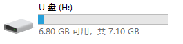

5.  鼠标右键点击盘符，在出现的菜单中点击"格式化"；

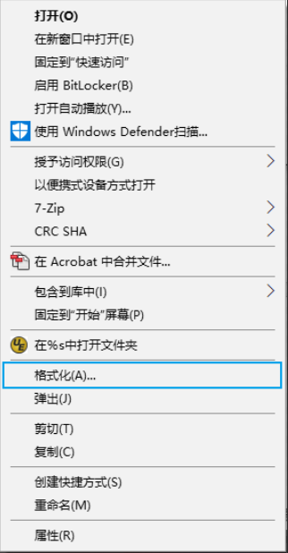

6.  在弹出的界面设置如下图；

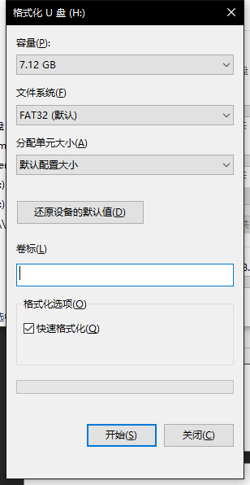

7.  点击开始按钮，在弹出的确认框中点击【确定】按钮；

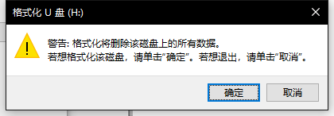

8.  当弹出"格式化完毕"窗口后则FAT32格式的U盘完毕。

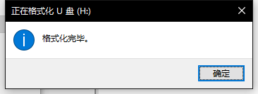

## 1.1 版本查看与升级

在设置-系统设置-版本升级查看界面中可以进行示教器、控制器软件版本的查看，并可以进行示教器软件的升级操作。

### 1.1.1 检测升级

示教器软件升级的操作步骤如下：

1.  将升级文件（.zip格式，不需解压缩，且文件名内不可以有括号等特殊字符）放入U盘的根目录下，（U盘必须为FAT32格式）将U盘插入示教器的USB接口。

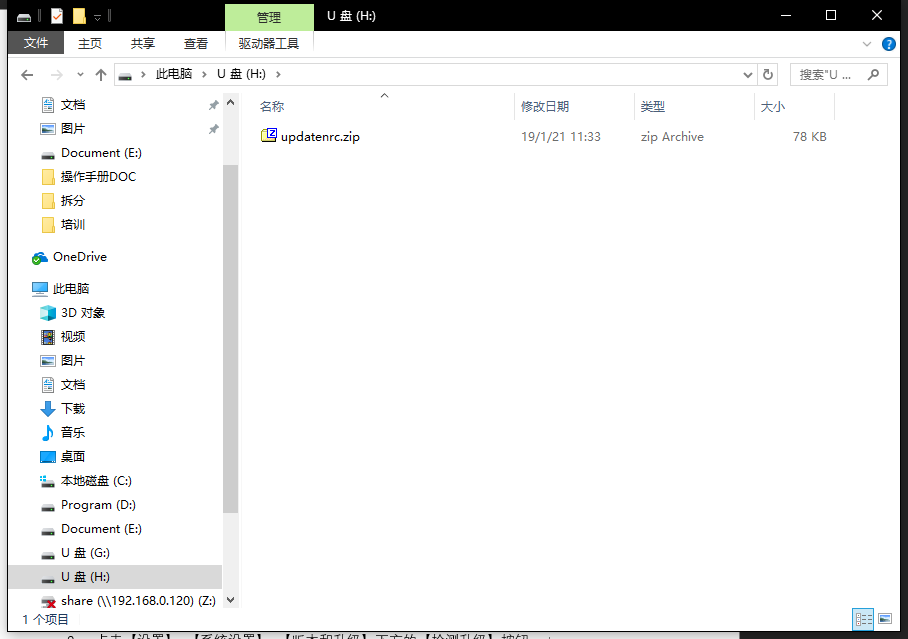

2.  点击【设置】-【系统设置】-【版本和升级】下方的【检测升级】按钮。

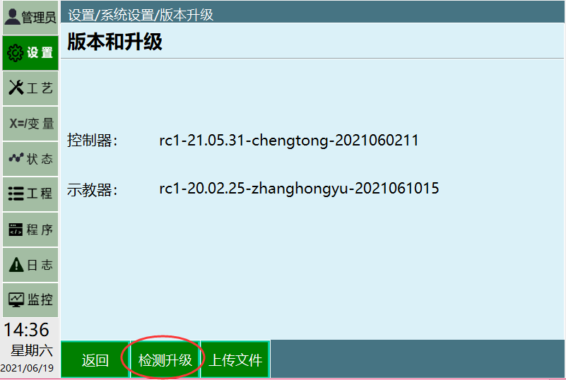

3.  在列表中选择自动检测出的升级文件。

4.  点击【确定】按钮。

5.  升级成功后示教器会自动重新启动，待重启后升级成功。

### 1.1.2 上传文件

若要上传ENI文件等文件到控制器中，请遵循以下步骤：

1.  准备一台电脑、一个U盘；

2.  在U盘中新建一个文件夹，名为upgrade；

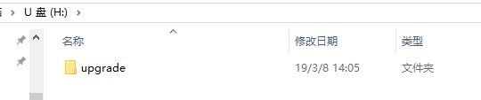

3.  将要上传的文件放入upgrade文件夹内；

4.  将U盘插入示教器的USB接口；

5.  打开设置-系统设置-版本升级界面；

6.  点击上传文件按钮；

7.  在弹出的已检测到的文件中选择要上传的文件，并点击确定按钮。

## 1.2 时间设置

在系统设置界面中可以进行系统日期、时间的设置。

具体步骤如下：

1.  打开设置-系统设置-时间设置界面。

2.  点击【修改】按钮。

3.  在日期设置与时间设置中选择年、月、日、小时、分钟。

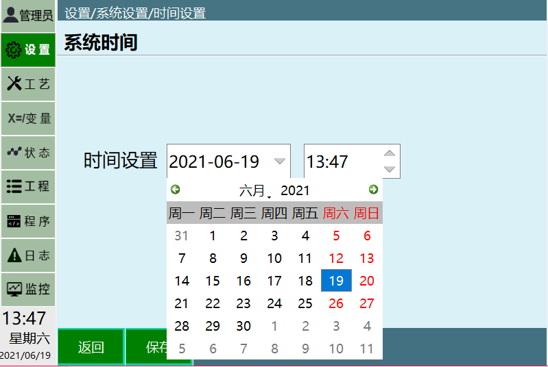

4.  点击【保存】按钮。

## 1.3 IP设置

- 在设置-系统设置-IP设置界面中可以修改控制器IP、示教器IP以及示教器所连接的IP。

- 在非必要情况下请不要修改IP，以免造成使用故障。

- [若修改控制器IP为非默认值（192.168.1.13），请自行记录好该控制器的IP。]{.underline}

- 示教器连接IP是在一个示教器同时连接多台控制器时进行切换使用。

- "重置网络配置"功能仅适用于T20。

修改[当前连接IP]{.underline}的具体步骤如下：

1.  点击【系统设置】-【ip设置】。

2.  点击"连接IP"对应的【修改】按钮；

3.  修改为需要的IP地址，即时生效。

4.  修改连接IP为步骤3中填写的IP

修[当前控制器的IP]{.underline}的具体步骤如下：

1.  点击【系统设置】-【ip设置】。

2.  点击"修改控制器IP"对应的【修改】按钮；

3.  修改为需要的IP地址，即时生效。

4.  修改连接IP为步骤3中填写的IP

修改[示教器本身IP]{.underline}的具体步骤如下：

1.  点击【系统设置】-【ip设置】。

2.  点击"示教器IP"对应的【修改】按钮；

3.  修改为需要的IP地址，重启示教器生效。

4.  修改连接IP为步骤3中填写的IP

## 1.4 导出程序

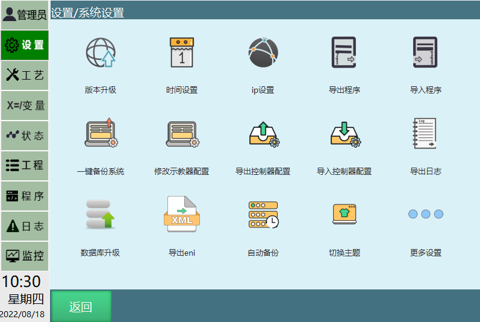

点击系统设置界面里的【导出程序】按钮可以将程序导出到U盘中。

具体步骤如下：

1.  将U盘（必须为FAT32格式）插入示教器的USB接口。

2.  点击【设置】-【系统设置】-【导出程序】

3.  导出的程序按日期与类型分开，导出到U盘根目录下的"robotJobxx-xx-xx-xx（当前日期时间）"目录下。

## 1.5 导入程序

点击系统设置界面下方的【导入程序】按钮可以将程序导入示教器中。

具体步骤如下：

1.  在U盘中新建名为"robotJobxxx（数字）"的文件夹，并在该文件夹内新建名为"R1"的文件夹；

2.  将后缀名为".JBR"的程序放在R1文件夹内；

3.  将U盘（必须为FAT32格式）插入示教器的USB接口；

4.  点击【设置】-【系统设置】-【导入程序】；

5.  系统弹出U盘中所有相关目录，选择需要导入的程序目录，此时会根据实际示教盒上配置的机器人数目显示出R1-R4，U盘中有对应机器人的作业文件就会显示在下方的白色对话框中，点击全选则选中所有机器人的作业文件，也可以自定义选择需要的文件，点击【确定】按钮导入作业文件。

## 1.6 一键备份系统

点击系统设置界面的【一键备份系统】按钮可以一次将作业文件、示教器程序、控制器程序、机器人配置等所有相关文件备份到U盘中。

具体步骤如下：

1.  将U盘插入示教器的USB接口。

2.  点击【设置】-【系统设置】-【一键备份系统】

修改示教器配置

点击系统设置界面的【修改示教器配置】按钮可以修改一些保存到示教器上的功能参数。

具体步骤如下：

点击修改按钮，修改参数，保存

导出控制器配置

点击系统设置界面下方的【导出配置参数】按钮可以将控制器配置参数导出到U盘中。

控制器配置参数保存的为机器人、IO、外部轴、工艺参数等配置参数。

具体步骤如下：

1.  将U盘插入示教器的USB接口。

2.  点击【设置】-【导出配置参数】按钮。

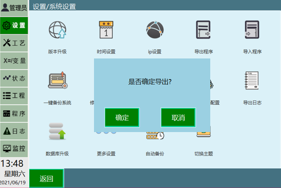

3.  点击【确定】按钮。

4.  等待导出。

## 1.7 导入控制器配置

点击系统设置界面下方的【导入配置参数】按钮可以将本机配置参数导入到示教器中。

具体步骤如下：

1.  将U盘插入示教器的USB接口。

2.  点击【设置】-【导入配置参数】按钮

3.  系统弹出U盘中所有相关目录，选择需要导入的程序目录，U盘中有对应机器人的配置文件就会显示在下方的白色对话框中，点击需要的机器人的配置文件后点击【确定】，进入详细配置参数选择，可以全选也可以选择需要的配置参数。点击【确定】按钮

4.  等待导入。

## 1.8 导出日志

日志的导出分为示教器日志和控制器日志；

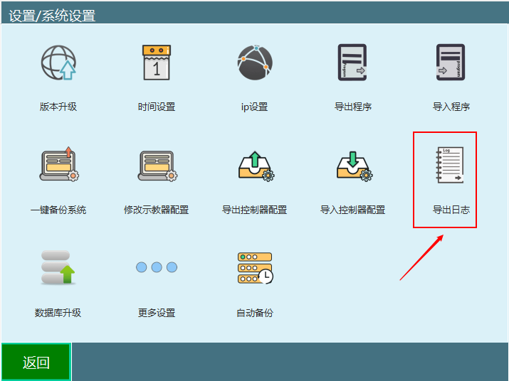5.680555555555555in" 4.258333333333334in"}

点击系统设置界面内的【导出日志】按钮/日志界面的【导出】按钮，可以将日志、崩溃日志，机器人参数配置、作业文件导入到U盘中。\*在我们查找机器人出错原因时，控制器日志是最常用的具体步骤如下：

将一个"FAT32"格式的U盘插入示教器的USB接口；

进入示教器的"设置-系统设置"界面/"日志"界面；

点击系统设置界面中【导出控制器日志】按钮/日志界面的【导出】按钮，可以选择导出5/30/100/500日志；

导出完成后U盘里面会有有四个文件夹，控制器的日志、以及程序在崩溃时生成的崩溃日志（dumplog）、配置、作业文件保存在U盘的"controllerLogs-当前日期时间"目录下；

控制器配置文件configFile-版本信息-当前日期时间；

作业文件robotJob-当前日期时间；

示教器的日志保存在"controllerLogs-当前日期时间"目录下teachbox.db文件。

程序发生崩溃时生成的崩溃日志（dumplog）会保存在"dumplog-当前时间"的文件

## 1.9 语言改变

本系统的指令和界面可以分别切换中文、英文、韩文语言。若要切换语言，请按照以下步骤进行：

1.  进入设置-系统设置-修改示教器配置；

2.  点击修改按钮；

3.  选择需要的指令语言或者界面语言；

4.  点击保存。保存后，指令语言立即生效，界面语言需重启才可生效。

中文语言指令

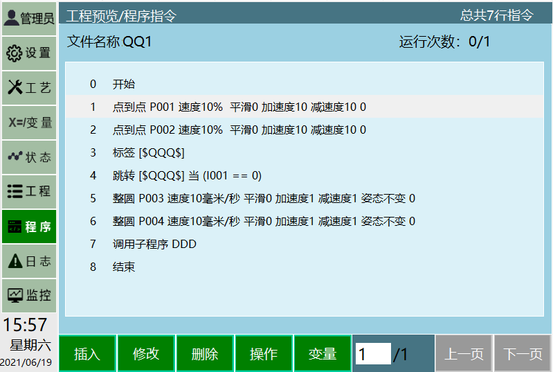

英文语言指令

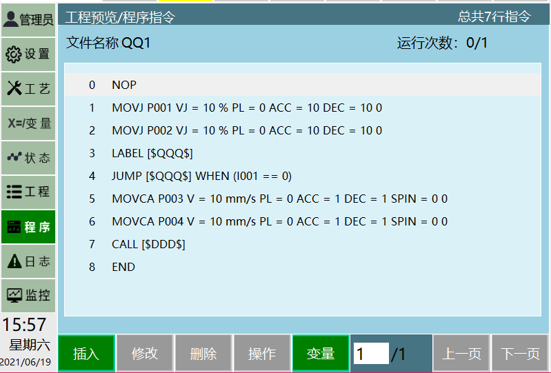

中文语言界面

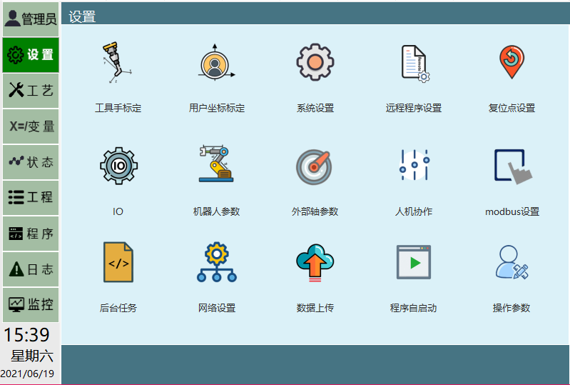

英文语言界面

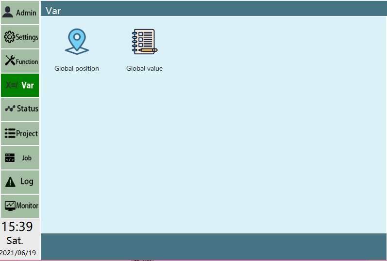

韩文语言界面

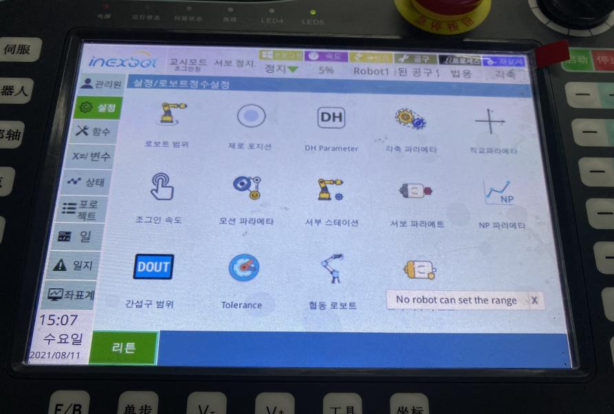

## **1.10 数据库升级**

用于升级config.db文件，该文件保存的为示教器配置，如ip、操作参数中的一些参数等。

## **1.11 导入导出ENI**

当机器人eni文件不存在时需要导入eni文件，【导入ENI】时需要确保u盘下有eni文件。

1.  在u盘中新建一个upgrade文件夹，把eni文件上传到upgrade文件夹中。

2.  将U盘插入示教器的USB接口。

3.  点击【设置】-【机器人参数】-【从站配置】按钮。

4.  点击【导入ENI】后选择u盘目录下需要导入的ENI文件直接进行导入工作。

5.  等待导入。

【导出ENI】用于导出当前系统使用的eni，准备更换新的eni、更换控制器时，可以通过此功能将正在使用的eni导出，做好备份工作。若要导入/导出eni，请按照以下步骤进行：

1.  将U盘插入示教器的USB接口。

2.  点击【设置】-【机器人参数】-【从站配置】按钮。

3.  点击【导出ENI】后直接进行导出工作。

4.  等待导出。

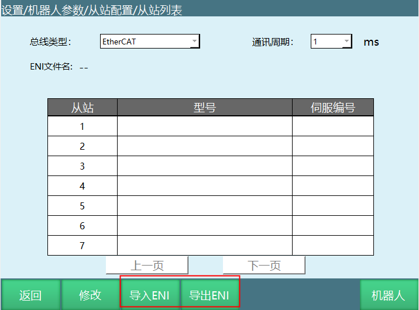

## **1.12 清空程序**

清空程序功能可以一次性将系统内所有的程序清除，用于在程序非常多且无用的情况。

清除步骤如下：

1.  进入设置-系统设置-更多设置界面；

2.  点击清空程序按钮；

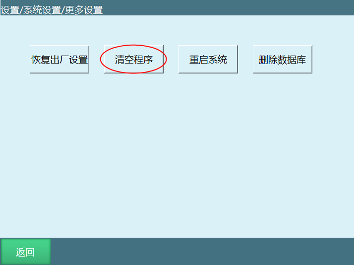

3.  在弹出的对话框中点击确定按钮。

## **1.13 恢复出厂设置**

恢复出厂设置会将所有机器人参数、程序等全部清空，请谨慎操作！请一定要在执行本操作之前备份所有参数以及程序文件！

步骤如下：

1.  进入设置-系统设置-更多设置界面；

2.  点击【恢复出厂设置】按钮；

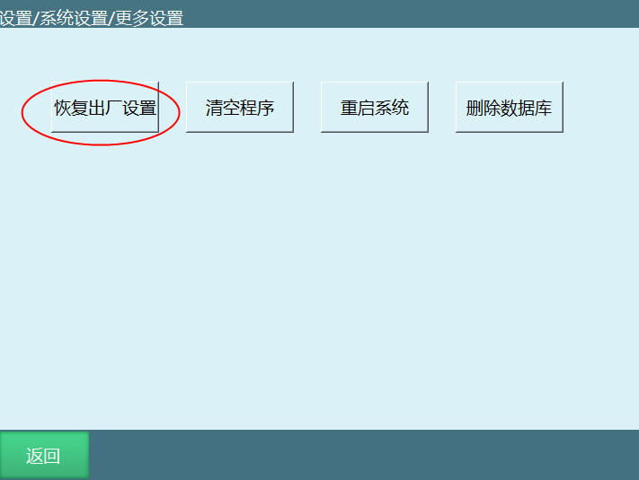

3.  在弹出的提示窗中有两种选择，可以清除系统配置文件和所有扩展文件。想要清除的配置文件可以自己选择

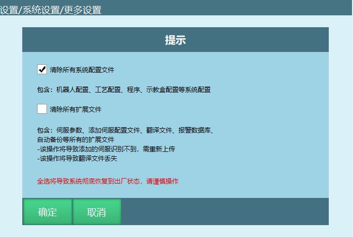

4.  点击确定按钮，选择的配置文件会被恢复出厂设置。

## **1.14 删除数据库**

功能：点击后会删除示教器的数据库，一般包含用户那边的信息，创建的用户和所有的密码会重置，连接控制器IP会重置，当前设置语音会重置，示教器的颜色主题会重置

步骤如下：

1.  进入设置-系统设置-更多设置界面；

2.  点击【删除数据库】按钮；

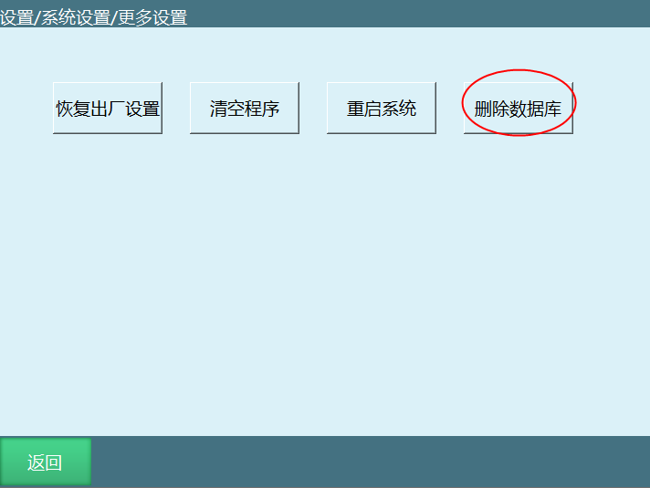

3.点击确定按钮，数据会被重置。

## 1.15 屏幕校准

屏幕校准功能适用于T30示教器。

步骤如下：

1.  在开机状态下，同时按下左侧【O】+中间【坐标】+右侧【STOP】实体按键，示教器弹出提示"校准文件已删除，重启示教器生效"，手动重启示教器后进入校准界面

2.  按示例用触笔分别点击1-5个点的十字中心即可完成标定。

## **1.16 自动备份**

控制器自动备份功能

**备份内容：**程序、参数、软件（nrc.out）

**备份个数：**最大10个，最新的顶替最老的

**备份命名：**按前提、版本、时间命名

例：2020年9月10日13点10分修改参数，备份名"参数-20.04-3.3.7-202009101310"

**触发备份的前提：**开机、修改参数、修改程序、升级

**备份频率：**

> 开机时确认版本、参数正常后备份一次；
>
> 修改参数后5分钟内没有再次修改参数备份一次；
>
> 修改程序（插指令、修改指令）后5分钟内没有再次修改备份一次；
>
> 升级前备份一次

恢复备份方式

1.  选中想要恢复的备份，选中后会显示光标。

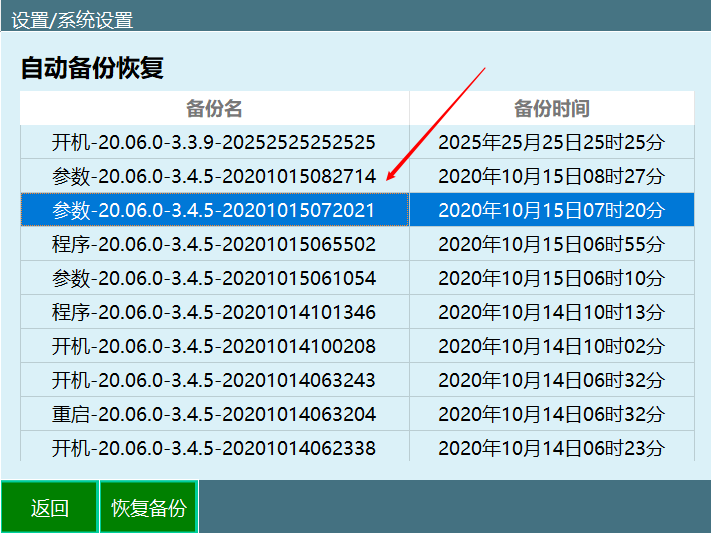

2.  点击"恢复备份"按钮

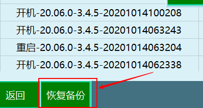

3.  弹框提示，点击确认

4.  恢复过程中，请勿断电

## **1.17 切换主题**

自定义不同区域的背景颜色，支持RGB。

设置后示教器需重启生效，修改点击确认会自动重启，PC版需手动重启示教器。

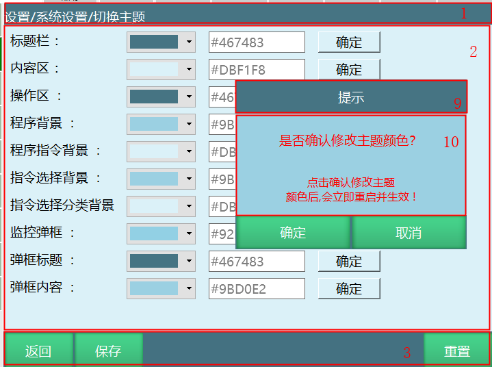

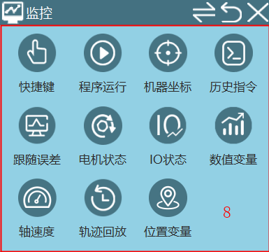

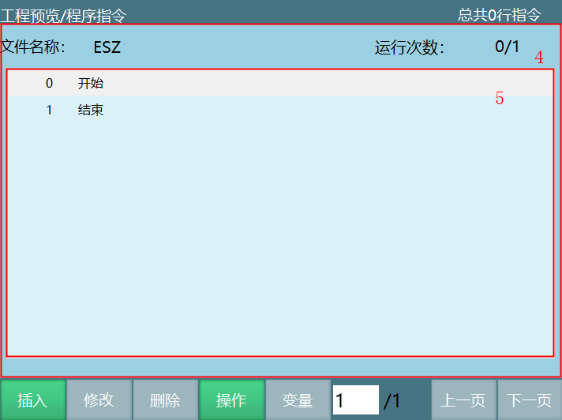

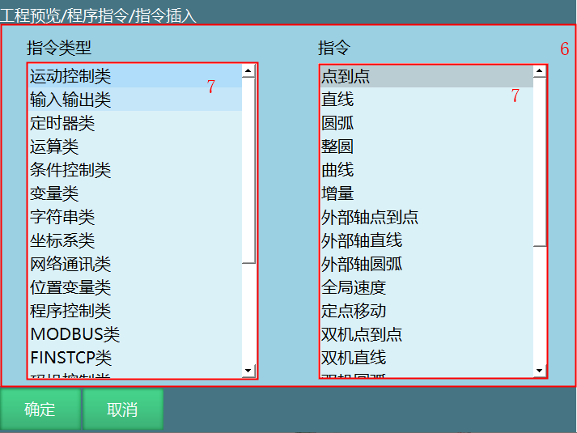

1.  标题区

2.  内容区

3.  操作区

4.  程序背景

5.  程序指令背景

6.  指令选择背景

7.  指令选择分类背景

8.  监控弹框

9.  弹框标题

10. 弹框内容

## **1.18 操作参数**

本章将主要介绍操作参数内各参数的用法及注意事项。

### **1.18.1 预约模式**

预约模式是利用数字IO来控制程序运行的。该机制为通过提前设定（预约）好在远程模式下，通过IO要启动的程序、运行次数并将其编号。切换到远程模式后通过IO信号对已设定程序进行排序，按下运行后程序将按照排序好的程序、运行次数进行运行。所有程序运行完毕后，运行停止。若需要再次运行则需要重新排序。

若需要令单个程序进行无限次循环运行，则在预约时将该程序的运行次数设置为0。

使能说明

预约模式打开，操作流程为：触发远程IO程序1信号→触发启动信号→机器人运行；此时若触发远程IO程序2信号，则远程IO程序2排到队列中，执行完远程IO程序1后执行远程IO程序2。

预约模式关闭，操作流程为：触发远程IO程序1信号→机器人运行；此时若触发远程IO程序2信号，无效；执行完远程IO程序1后方可运行远程IO程序2。

打开后远程模式 IO 控制为预约模式，关闭则为非预约模式

默认为打开

设置步骤

预约程序的步骤如下：

1.  进入设置-远程程序设置；

2.  设置好预约的5个程序以及运行次数；

3.  在设置-远程程序设置-机器人1-远程IO功能中设置好各IO输入端口的功能，其中程序1-程序5对应远程程序设置界面中的五个程序的排序功能；

4.  切换到远程模式；

5.  给程序序号对应的IO一个持续2秒的高电平（设置为高电平有效）再松开，该程序则进入队列；

6.  排序完成后若想要取消某程序的排序，则再给程序序号对应的IO一个持续2秒的高电平（设置为高电平有效）再松开；

7.  给程序启动对应的IO端口一个上升沿（设置为高电平有效），系统开始按照队列的程序运行次数运行；

8.  运行过程中也可以进行排序和取消队列。

[\*若打开预约即运行开关，则第一个预约的程序预约后即开始运行]{.underline}

[\*在设置-操作参数里关闭预约模式后，远程模式无预约队列，同一时间只能运行一个程序]{.underline}

### **1.18.2 禁用回零键**

打开则禁用回零按键

默认为关闭

### **1.18.3 工艺选择**

可以设置通用工艺、专用工艺、码垛工艺、焊接工艺、切割工艺

默认为通用工艺

### **1.18.4 禁用滚轮键**

打开则禁止使用滚轮键

默认为关闭

### **1.18.5 切到运行模式自动上电**

打开则切到运行模式自动上电

默认为关闭

### **1.18.6 姿态值**

弧度制、角度制

默认为弧度制

### **1.18.7 远程IO断点执行**

打开则使用断点执行，关闭则不使用

默认为打开

### **1.18.8 远程IO当前行执行**

打开则使用当前行执行，关闭则不使用

默认为关闭

### **1.18.9 运行后切回用户权限**

运行时在设置的时间切至操作员权限。

参数默认值为0，表示不切换。

### **1.18.10 关节实际方向**

打开后，机器人和外部轴关节参数设置界面显示关节实际方向参数。

默认为关闭状态。

### **1.18.11 无示教器切远程模式**

打开后，在未连接示教器的情况下，触发远程IO控制信号将自动切至远程模式

默认为打开状态。

### **1.18.12 远程IO程序运行中再次预约**

打开后，预约的程序运行中可以再次预约；

关闭后，预约的程序运行中不可以再次预约，只有程序"已预约"和"未预约"状态才可以预约

默认为打开状态。

### **1.18.13 单步/回零/复位点运行操作方式**

单机运行：按一下对应按键，机器人就会执行对应的功能

按下运行：一直按住对应按键，机器人才会执行对应的功能

### **1.18.14 运行模式开机默认速度**

打开之后，每次开机切换到运行模式，系统设置的起始速度

### **1.18.15 连接控制器时同步操作模式**

功能：在控制器与示教器初次连接时，同步操作模式

**跟随控制器**：当控制器与示教器连接正常的情况下，示教器会跟随控制器发送的模式

**跟随模式旋钮**：在控制器与示教器连接正常的情况下,通过旋钮切换操作模式

特殊情况：当程序处于运行状态中，示教器与控制器重新连接正常后，同样支持直接用旋钮切模式

注意：1.示教器与控制器重新连接正常后，会有**弹窗提示**：机器人正在运行中，确认同步请按确认键。待点击确认后，示教器会同步旋钮操作模式

2.弹窗未消失前：**除确认键+停止键+旋钮可用，其余均不可操作**

默认是跟随控制器

### **1.18.16 安全光幕示教模式无效**

功能：开启后示教模式屏蔽安全光幕限制，报警可以正常可用（默认关闭）

默认是没打开

### **1.18.17 运动模式禁用启动键功能**

功能：开启功能使能，则示教盒切换到运行模式下，不可以点击状态里的运行、物理按键启动、包括PC版的START按键（默认关闭）

注：PC版START按键也将禁用

默认关闭

### **1.18.18 NP参数**

功能：打开时显示【设置】-【机器人参数】-【NP参数】；关闭则隐藏

默认关闭

### **1.18.19显示电机坐标位置及标定按钮**

功能：打开时显示【设置】-【机器人参数】-【零点位置】-【标记无间隙方向】

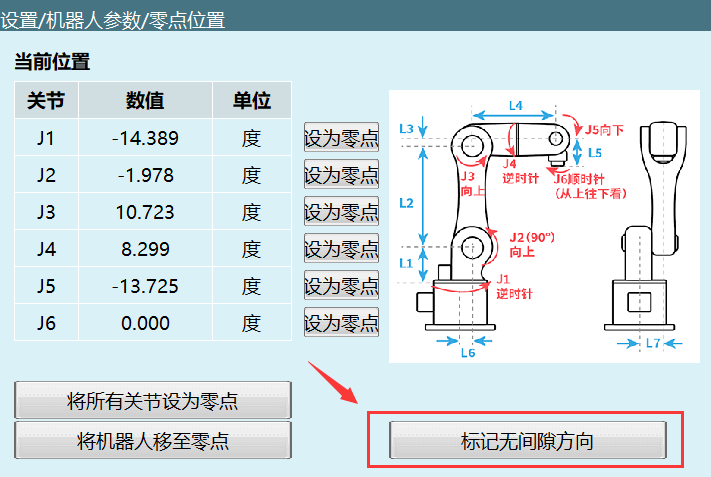

和【监控】-【机器坐标】-【电机位置】；关闭则隐藏

默认是关闭状态

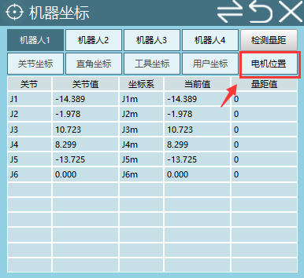

## 2 机器人日志

本系统日志分为示教器日志与控制器日志。其中示教器日志主要保存在示教器上操作所产生的日志。控制器日志保存机器人运行、参数修改等所有日志。

注：日志导出请参考系统设置-日志导出；

示教器日志查看

在日志界面可以查看操作、错误日志。

具体查看步骤如下：

1.  点击【日志】，打开日志查看界面，若无报错信息，直接进入到历史日志，默认查看错误类型的日志；

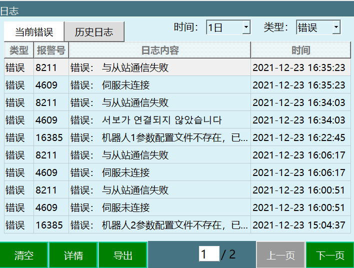

*[注：进入日志界面首先显示"错误"类型日志]{.underline}*

若当前有报错信息，点击【日志】会进入到当前错误界面

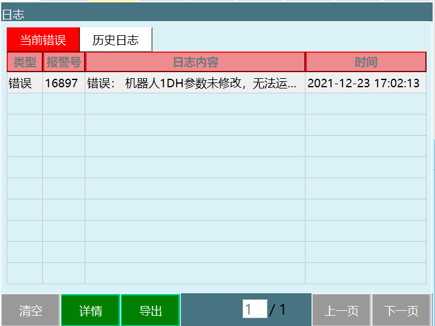

2.  点击上方的"类型"标签来切换查看日志的种类。

3.  选中某条日志后点击下方的【详情】按钮，可以查看日志详情；

历史日志详细界面：

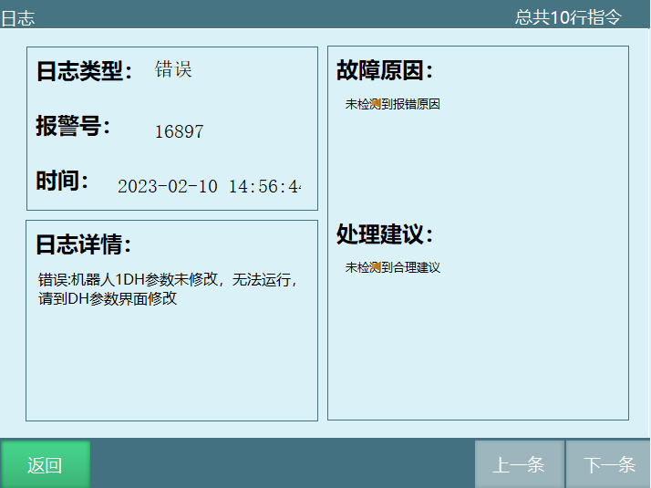

当前错误详细界面：

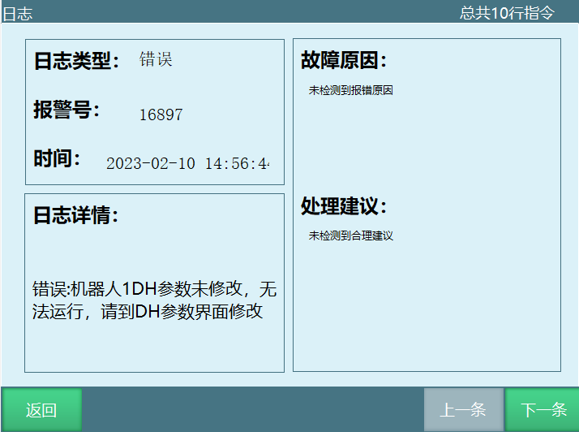

*[注：故障原因与处理建议需要上传对应的数据库]{.underline}*

清空日志：

点击清空按钮会有提示框提示清空后会重启示教器并且清空后无法恢复

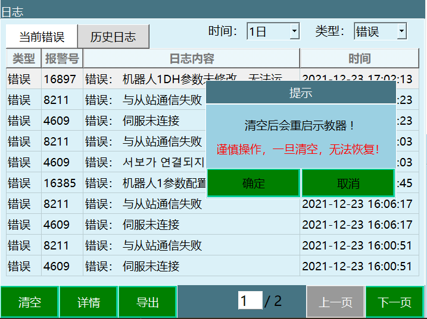

日志类型

日志类型包括全部、消息、操作、警告、错误。主要查看"操作日志"与"错误日志"

**操作日志**：此类型日志保存用户的基本操作，例如新建程序、重命名程序插入指令等。

**错误日志**：此类型日志保存所有系统报错、伺服报错信息，包含了错误代码、出错时间、错误类型、错误内容、解决方案等信息。

故障处理

编码器电池欠压报错

注：以下操作会丢失零点，机器人点位必须重新设置

操作步骤：

> 断开欠压机器人的控制器、控制柜、机器人等设备的电源，在确保安全的情况下，由专业人员更换机器人电池，更换后重新连接电源，启动控制器系统。
>
> 等待示教器、控制器正常开机后，依然有弹框报错
>
> 点击示教器上的的清错按钮，弹框出现确认按钮
>
> 点击确认按钮，进入零点标定界面
>
> 重新标定零点后，恢复正常
>
> 检查程序能用到的所有点位，确保点位位置正常，确保工艺中设置的点位正常
---

## Q&A

**Q: 如何制作FAT32格式的U盘？**

A: 将U盘插入电脑，在我的电脑中右键点击U盘盘符，选择"格式化"，将文件系统设置为FAT32，点击开始即可完成。注意格式化会清空U盘内所有数据。

**Q: 升级示教器软件的步骤是什么？**

A: 将.zip格式的升级文件放入FAT32格式U盘根目录（文件名不可包含特殊字符），插入示教器USB接口，进入设置-系统设置-版本和升级界面，点击检测升级，选择升级文件后点击确定，升级成功后示教器自动重启。

**Q: 如何导出程序？**

A: 将FAT32格式U盘插入示教器USB接口，点击设置-系统设置-导出程序，程序将按日期与类型导出到U盘根目录下的"robotJobxx-xx-xx-xx"目录中。

**Q: 如何导入程序？**

A: 在U盘根目录新建名为"robotJobxxx"的文件夹，内部再新建"R1"文件夹，将.JBR后缀的程序文件放入R1文件夹，将U盘插入示教器，进入设置-系统设置-导入程序，选择目录后确定导入。

**Q: 一键备份系统包含哪些内容？**

A: 一键备份会同时备份作业文件、示教器程序、控制器程序、机器人配置等所有相关文件到U盘中。

**Q: 如何导出控制器日志？**

A: 将FAT32格式U盘插入示教器，进入设置-系统设置界面或日志界面，点击导出控制器日志按钮，选择导出5/30/100/500条日志，导出完成后U盘会生成controllerLogs目录，包含控制器日志、崩溃日志、配置和作业文件。

**Q: 如何切换界面语言？**

A: 进入设置-系统设置-修改示教器配置，点击修改按钮，选择需要的指令语言或界面语言，保存后指令语言立即生效，界面语言需重启示教器生效。

**Q: 恢复出厂设置有什么风险？**

A: 恢复出厂设置会将所有机器人参数、程序等全部清空，操作前务必备份所有参数和程序文件。

**Q: 控制器自动备份的触发条件有哪些？**

A: 自动备份在以下情况触发：开机时确认版本参数正常后、修改参数后5分钟内无再次修改、修改程序后5分钟内无再次修改、升级前。最多保留10个备份，新备份会替代最旧的备份。

**Q: 预约模式和非预约模式的区别是什么？**

A: 预约模式打开时，可通过IO信号对多个程序进行排序入队，按顺序依次执行；关闭时，同一时间只能运行一个程序，需等待当前程序执行完毕后才能运行下一个。