- **文档标题**: 视觉工艺手册
- **公司名称**: 纳博特南京科技有限公司 (iNexBot Nanjing Technology Co., Ltd.)
- **核心主题**: 纳博特视觉工艺应用指南

- **关键标签**：纳博特2207系列机器人视觉工艺完整使用指南，涵盖视觉参数设置、视觉范围设置、位置调试、视觉标定及视觉指令等核心内容

# 1 工艺介绍

进行重复的运动对于工业机器人并不是一个困难，但如果面对的一个无序的环境，便利用视觉工艺就可以对环境进行识别、分析和判断。它具有：精准定位、方便部署、简单易用，参数配置方法灵活、指令丰富等优势，我们常将它与传送带工艺相结合，可以利用简单的编程，有效的降低跟踪失误率。

# 2 视觉工艺页面

点击工艺-视觉工艺，进入视觉工艺界面，如图所示：

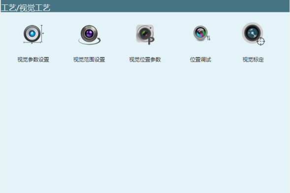

# 3 视觉参数设置

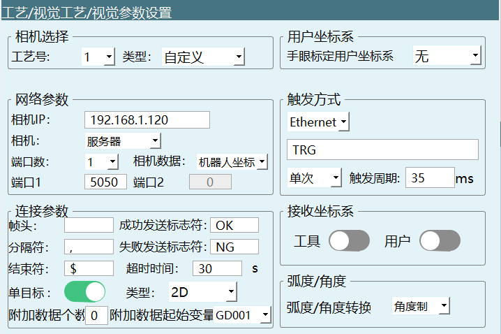

## 3.1 相机选择

**工艺号**：提供1-99个工艺号，每个工艺号均保存该工艺号下面的全部视觉参数和视觉位置参数。

**类型**：目前仅支持自定义类型，用户可根据自己需求对参数进行设置。

## 3.2 用户坐标系

本系统支持视觉点位对应到用户坐标系中，即相机发送的点位是视觉坐标系中的点位。在这里需要选择一个已和相机匹配好的用户坐标系。

若选择无，便默认是相机发送的为直角坐标系下的点位；用户也可以选择自己标定的用户坐标系（所选择的用户坐标系在设置-用户坐标标定页面进行标定）。

## 3.3 网络参数

**相机IP**：若使用相机作为视觉服务器，则在此处填入相机的IP，相机的IP地址与控制器的IP地址要前三位要（从左往右数）保持一致，最后一位不同即可，例如均使用同一网段：192.168.1.xxx。

**相机**：此处可以选择客户端和服务器，若相机选择为客户端，则控制器为服务器，需要相机主动连接。

**相机数据**：此处可选择机器人坐标和像素坐标，若选择机器人坐标，那相机发过来的数据就是机器人的坐标；若选择像素坐标，那相机发过来的数据就是相机坐标系下的的像素坐标。

**端口数**：若视觉服务器的数据收发使用同一个端口，则端口数为1；

> 若数据收发使用不同端口，则端口数为2；
>
> 端口1是接收数据；端口2是发送数据。（端口号不能设置成相同的）

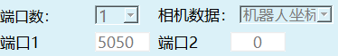

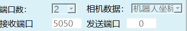

## 3.4 连接参数

帧头，分隔符，结束符中任意两个不能同时设置为相同字符。

除分隔符不可为空白，帧头，结束符可设为空白。

**帧头**：传递信号的开始。此处需和相机配置的参数相同。

**分隔符**：传递多个信号时用来分隔。此处需和相机配置的参数相同（此处不能设为空！）。

**结束符**：判断信号传递结束的符号。此处需和相机配置的参数相同。

**成功发送标志符**：相机拍完照并且成功识别，发送后会发送一个成功标志符。

**失败发送标志符**：相机拍完照并且识别失败，会发送一个失败标志符。

注意：以上的参数用户可以自定义。

例如：帧头设为：空白，分隔符设为：，结束符设为：$，同时打开仅识别一个目标使能数据格式为:,X,Y,Rz,$

**超时时间**：当超过该时间后，则判断为连接超时，停止连接。填写为0时为不限制。

**单目标**：打开该使能，相机每次仅识别一个目标点位。

**类型**：2D、2D+高度、3D；例如相机发送字符串（帧头"**!**"，分隔符"**,**"，帧尾"**$**"）。

> 2D：数据格式为:!,X,Y,Rz,$
>
> 2D+高度：数据格式为:!,X,Y,Rz,h,$
>
> 3D：数据格式为:!,X,Y,Z,A,B,C,$

**单目标使能**：关闭该使能，可以识别不止一个目标点位，示例N表示为识别的目标位置个数。

**类型**：2D、2D+高度、3D；例如相机发送字符串（帧头"**!**"，分隔符"**,**"，帧尾"**$**"）：其中N表示的是识别的目标位置个数。

> 2D：数据格式为:!,N,X,Y,Rz,X,Y,Rz,$

2D+高度：数据格式为:!,N,X,Y,Rz,h,X,Y,Rz,h,$

3D：数据格式为:!,N,X,Y,Z,A,B,C,X,Y,Z,A,B,C,$

**附加数据个数**：选择需要存放多少除点位外相机发送的数据最多十个（工具手编号，颜色，点位是否有效之类信息）。

示例： 自定义1代表黑色，相机发送过来附加数据1，解析到变量之后，相机拍到黑色的工件，然后我们可以通过条件判断定义变量值为1，机器人抓取黑色工件。

示例： （帧头"!"，分隔符","，帧尾"$"）

单目标格式：!,X,Y,Rz,data ...,$

多目标格式：!,N,X,Y,Rz,data ...,X,Y,Rz,data ...,$

**附加数据起始变量**：用户自定义的附加数据的值会存入选择的起始变量,根据附加数据个数顺延存入。

## 3.5 触发方式

**I/O**：通过I/O板，给相机一个触发信号，此处需要设置I/O的DIN（IO输入）信号端口。

**Ethernet**：一般默认为Ethernet 发送，当相机接收到此处的"TRG"（或用户自定义字符串）后，应回复给控制器坐标值。

**触发条件**

单次触发：当条件为单次触发时，则每次运行程序中的VISION\_TRG指令触发一次。

持续触发：当条件为持续触发时，则每次运行程序中的VISION\_TRG指令持续触发。

间隔时间：连续触发时的时间间隔。（触发周期）

## 3.6 接收坐标系

接受的点位信息为相机发送的带有特定工具手与特定的用户坐标系下的点位信息。

**工具**：打开该使能，相机发送的点位包含使用的工具手（用于多个工具手作业时）。

**用户**：打开该使能，相机发送的点位包含使用的用户坐标系（用于多个工作台时）。

注：打开工具与用户使能前，手眼标定用户坐标系不能为无（都关闭的情况下，需要设置为无），用户和工具使能可以同时打开/关闭。

## 3.7 角度/弧度设置

为视觉位置参数里的A/B/C轴选择单位类型，弧度的单位为rad、角度的单位为°（度）。

注：该角度/弧度的设置影响解析数据的内容与操作参数里的角度/弧度切换无关，操作参数中的角度/弧度设置只影响示教器关于角度/弧度的内容显示。

# 4 视觉范围设置

由"工艺"-"视觉工艺"-"视觉范围设置"进入视觉范围设置的界面。

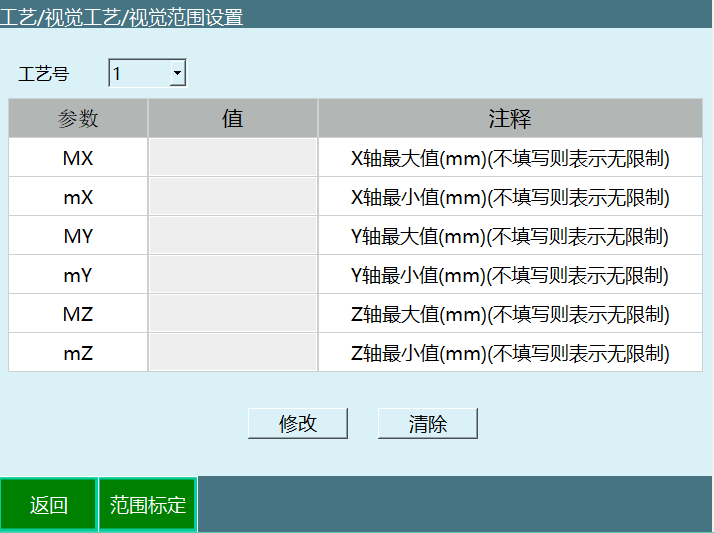

为了避免相机传递回来的地址参数超出了机器人所能达到的范围，规定了机器人所能达到的最大范围。若相机传递回来的参数超范围，会自动过滤该数据，该数据不生效。标定方法可以用手动示教的方法进行标定，也可以直接填写。

**工艺号**：提供1-99个工艺号，每一个工艺号均保存该工艺号下面的全部视觉范围参数。

**范围标定**：标定直角坐标系下XYZ三轴的最大值和最小值。

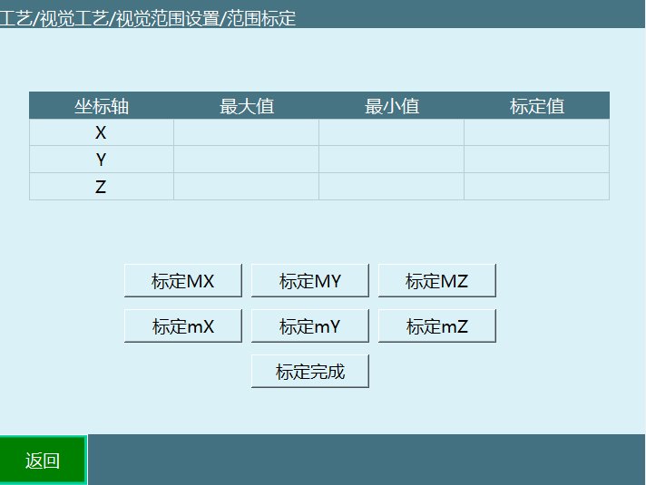

**标定Mx**：标定X轴最大值。

**标定mX**：标定X轴最小值。

**标定MY**：标定Y轴最大值。

**标定mY**：标定Y轴最小值。

**标定MZ**：标定Z轴最大值。

**标定mZ**：标定Z轴最小值。

**标定完成**：将所有标定的值，记录在最大值和最小值。

# 5 视觉位置参数

路径："工艺"-"视觉工艺"-"视觉位置参数"。

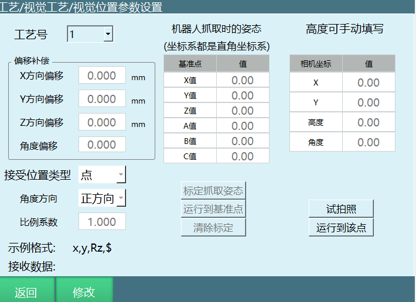

**工艺号**：提供1-99个工艺号，每一个工艺号均保存该工艺号下面的视觉位置参数设置。

**偏移补偿**：若每一次机器人抓取位置均与其实际位置有固定方向偏移，请在此处填写补偿量， 则自动补偿到正确位置。

**比例系数**：若相机发送的位置值是按照特定比例缩小后发送的，则需在此处填写比例系数。例如相机发送的值为（300,200,100），实际位置是（3,2,1），那么此处需填写0.01。计算公式：比例系数=实际位置值/相机发送位置值。

**角度方向**：相机发送点位与机器人旋转角度相同或相反。

**接收位置类型**：点/轨迹。

选择点时,相机拍照发送点位给控制器；

选择轨迹时相机识别轨迹后发来一串点位，通过外部点指令去运行轨迹。

当接收位置类型选择轨迹时，程序作业文件如下：

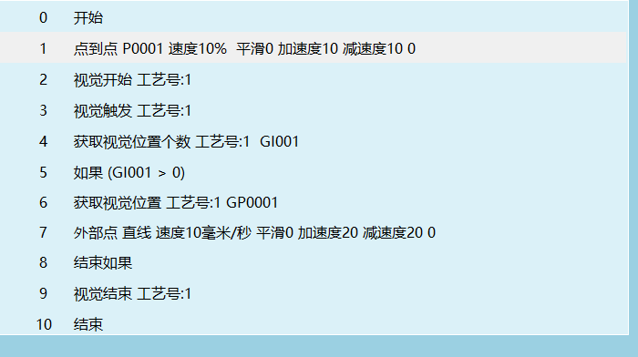

**标定抓取姿态**：此处需标记一下机器人在抓取物体时的末端姿态。标定好之后，每一次抓取均以该姿态进行抓取（**此处的XYZ值不影响抓取时的位置**）。如果拍摄目标有角度变化，此时最终的角度为=标定C值+相机发送的C值。

**运行到基准点**：运行到标定抓取姿态时标定的点位。

**清除标定**：清除标定抓取姿态的点位数据。

**相机坐标**：若相机不能发送抓取高度，则需在右侧表格填写抓取的高度Z。若相机能发送抓取高度，则此处的设置无效。在设置完毕之后，按住DEADMAN按键上电，点击【试拍照】按钮进行拍照试验，相机发送来的数据会在相机坐标和接收数据处显示。拍照后再按住DEADMAN按键上电，点击【运行到该点】按钮，将机器人移动到拍照位置，以验证是否准确。

**试拍照**：伺服上电，点击试拍照，打开网络连接，按照示例格式发送数据。

示例格式：根据视觉参数设置里面已经设置好的连接参数，进行核实排列。比如连接参数中帧头为W，分隔符为#，结束符为$，并且发送高度信息，则格式为W#x#y#angle#h#$。

接收数据：W#x#y#angle#h#$。

运行到该点：机器人运动到的是相机发送的位置。

# 6 位置调试

与传送带相结合使用，用于传送带的调试时使用，相机拍照后，会发送一个点位数据同时存在于【原始点位】和【偏移后点位】，但工件会被传送带运出一段距离，点击计算偏移，计算出的偏移的位置会覆盖在【偏移后点位】，点击运行至此，机器人便会直接去计算后偏移的位置。

由"工艺"-"视觉工艺"-"位置调试"进入，使用视觉加传送带跟踪工艺时用于调试传送带：

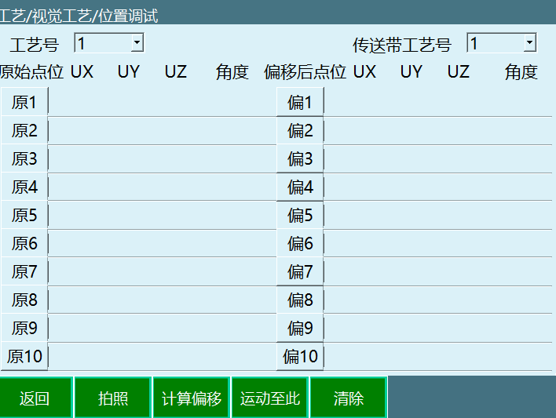

**工艺号**：视觉工艺的工艺号。

**传送带工艺号**：需要调试的传送带工艺号。

**拍照**：按住DEADMAN按键上电后点击【拍照】按钮进行拍照试验，相机发送来的位置数据会在【原始点位】和【偏移后点位】处显示。

**运行至此**：拍照后，按住DEADMAN按键上电选中点位并点击【运行至此】按钮，机器人会移动到相机发送的位置处。

**计算偏移**：拍照后打开传送带使工件被传送一段距离，点击计算偏移会重新在右侧【偏移后点位】显示出偏移后的工件点位。

**清除**：清除所有点位。

# 7 视觉标定

**视觉标定**：标定相机坐标系到机器人坐标系的转换关系，从而确定相机识别的目标在机器人坐标系中的位置坐标，最终实现机器人运动到目标位置。

**眼在手上：**用于相机在工具手上，相机镜面与标定模板平面应大致平行，且整个标定过程中相机距离标定模板的相对高度不变。通过标记机器人当前的点位信息，这些位置要满足至少3个不变姿态点位 和 3个变姿态点位。运行计算，机械臂带着相机走到当前机器人的点位，得到对应的像素数据。当全部像素数据取得后，计算得到相机数据与机器人点位的转换关系。后续发送的相机点位可通过该转换关系，转换成机器人实际运动点位。

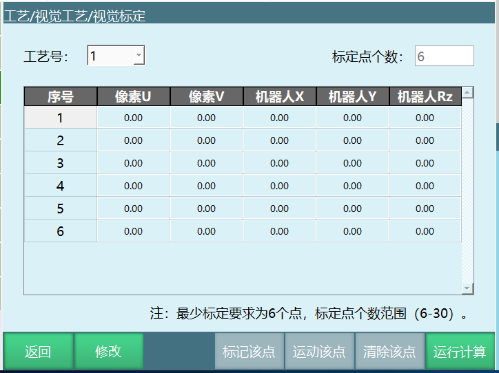

**工艺号**：视觉工艺的工艺号。

**标定点个数**：所需示教的点位个数，标定点个数范围（6-30）。

**点位**：最少需要标定6个点，最多为30个点，标定的点位最少要求三个位置不同，三个姿态不同。如（移动X轴,Y轴标记三个点，然后动C轴标定三个点）。

**标记该点**：记录当前机器人点位数据。

**运动该点**：按住DEADMAN按键上电后，选中序号并点击【运行至此】按钮，机器人会移动到该序号标记的点位处。

**清除该点**：清除所选序号的点位数据，不清除像素数据，像素数据会在运行计算后，数据会重新拍摄。

**运行计算**：点击运行计算，机器人会根据之前示教的点位数据自动运动到每一个点，且每运动到一个点均会触发拍照、记录当前的像素数据，运动采集数据完成后，自动进行标定计算，并弹出计算结果。

# 8 视觉指令

## 8.1 VISION\_RUN-视觉开始

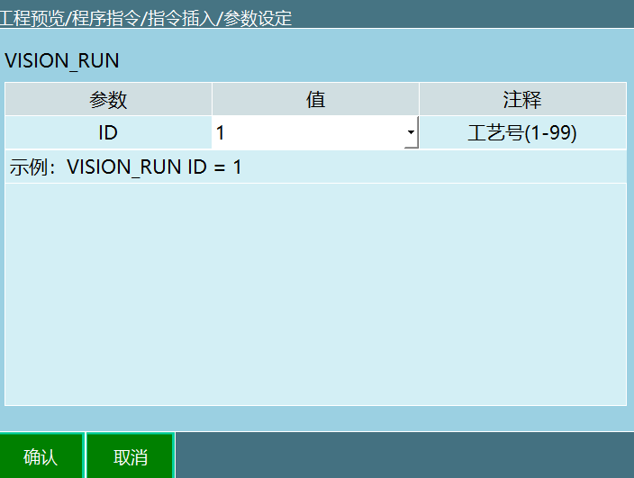

格式：VISION\_RUN【指令名】ID=1【工艺号】。

功能：执行视觉开始指令后控制器与相机连接。

| 参数 | 说明 |
|------|------|
| ID | 范围【1，99】，指令里面选择的工艺号需要和视觉工艺界面选择的工艺号一致。 |

## 8.2 VISION\_TRG-视觉触发

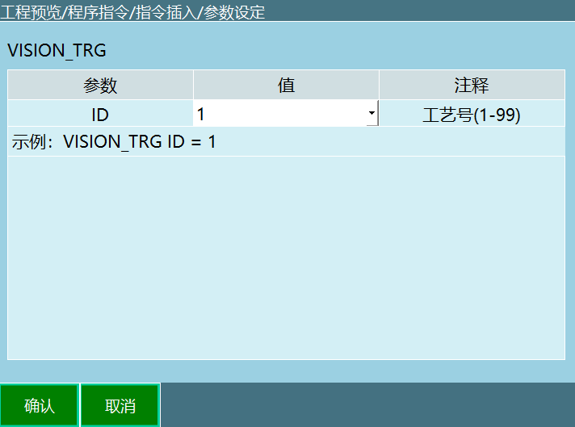

格式：VISION\_TRG【指令名】ID=1【工艺号】。

功能：执行视觉触发指令后等待视觉服务器的返回值（发送的位置数据），获取到位置数据后继续运行下一条指令。

参数：

| 参数 | 说明 |
|------|------|
| ID | 范围【1，99】，指令里面选择的工艺号需要和视觉工艺界面选择的工艺号一致。 |

说明：具体触发方式在视觉工艺-视觉参数设置界面内设置：

1.  选择IO触发，运行本指令则发出对应IO信号

2.  选择Ethernet方式，运行本指令则向相机发出自定义的字符串。

## 8.3 VISION\_POSNUM-获取视觉位置个数

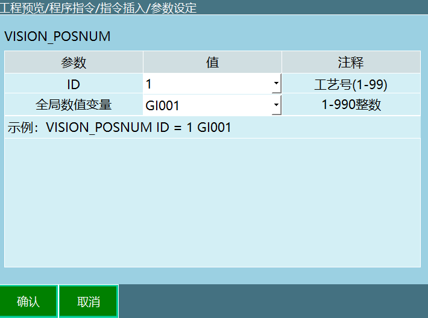

格式：VISION\_POSNUM【指令名】ID=1【工艺号】GI001【全局数值变量】。

功能：记录相机发送的点位个数，将点位个数存入到选择的变量。

参数：

| 参数 | 说明 |
|------|------|
| ID | 范围【1，99】，指令里面选择的工艺号须和视觉工艺界面选择的工艺号一致 |
| 全局数值变量 | 将相机发送的点位个数存入到选择的变量。例如：相机发送了三个点位数据，选择的变量为GI001,执行此条指令后GI001=3。说明：每执行一次获取点位执行，点位个数就会减一 |

示例：

1.  NOP

2.  VISION\_RUN ID = 1 视觉开始

3.  VISION\_TRG ID = 1 视觉触发

4.  VISION\_POSNUM ID = 1 GI001 获取视觉位置个数

5.  VISON\_END ID = 1 结束视觉

6.  END

示例说明：执行第2行指令与相机通讯成功，执行第3行指令视觉触发相机发送点位信息，执行第4行指令将视觉发送的点位个数存入到变量GI001，如果视觉发送了3个点位，则执行此条指令后GI001=3。

## 8.4 VISION\_POS-获取视觉位置

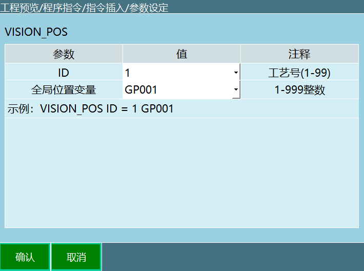

格式：VISION\_POS【指令名】ID=1【工艺号】GP001【全局数值变量】。

功能：执行此条指令可以将相机发送的点位信息存入到变量。

参数：

| 参数 | 说明 |
|------|------|
| ID | 范围【1，99】，指令里面选择的工艺号须和视觉工艺界面选择工艺号一致 |
| 全局位置变量 | 相机发送的点位信息逐次缓存于选择的全局位置变量。例如：全局位置变量为GP0001,相机发送两个点位，执行获取视觉位置指令会将点位信息存到变量GP0001。第一次运行该指令GP0001存的是第一个点位的信息，第二次运行该指令GP0001存的是第二个点位的信息 |

## 8.5 VISION\_CLEAR-清除视觉位置信息

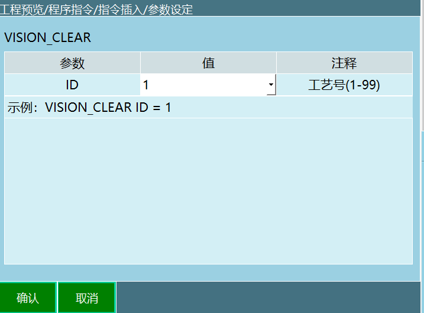

格式：VISION\_CLEAR【指令名】ID=1【工艺号】。

功能：清除当前工艺号里相机发送的点位信息。

参数：

| 参数 | 说明 |
|------|------|
| ID | 范围【1，99】，指令里面选择的工艺号须和视觉工艺界面选择的工艺号一致。 |

示例：

1.  NOP

2.  VISION\_RUN ID = 1 视觉开始

3.  VISION\_TRG ID = 1 视觉触发

4.  VISION\_POSNUM ID = 1 GI001 获取视觉位置个数

5.  VISON\_POS ID = 1 GP0001 获取视觉位置

6.  VISON\_CLEAR ID = 1 清除视觉位置信息

7.  VISON\_END ID = 1 结束视觉

8.  END

示例说明：执行第2行指令与相机通讯成功，执行第3行指令视觉触发相机发送点位信息，执行第4行指令将视觉发送的点位个数存到变量GI001，（假设视觉发送了3个点位，则变量GI001=3，每执行一次获取视觉位置指令，GI001变量存的点位个数减少1个)，执行第5行指令将视觉发送的点位数据存入到变量GP0001，（假设视觉发送了3个点位，第一次运行获取位置指令GP0001存的是第1个点位的信息，第二次运行获取位置指令GP0001存的是第2个点位的信息,第三次运行获取位置指令GP0001存的是第3个点位的信息），执行第六行指令会清除当前工艺号视觉发送的所有点位信息。

## 8.6 VISION\_END-视觉结束

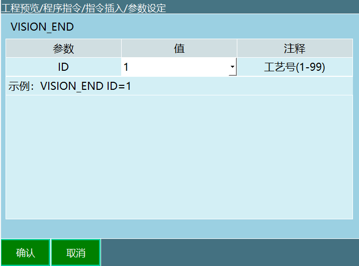

格式：VISION\_END【指令名】ID = 1【工艺号】。

功能：结束视觉工艺，控制器与相机断开连接。

参数：

| 参数 | 说明 |
|------|------|
| ID | 范围【1，99】，指令里面选择的工艺号需要和视觉工艺界面选择的工艺号一致。 |

# 9 视觉工艺示例说明

## 9.1 示例一：抓取应用

**相机对物料拍完照后，将数据发送给机器人，机器人去抓取。**

编程：

## 9.2 示例二：附加数据使用案例

执行指令会将定义的附加数据的值存入用户自己选择的变量，用户可以将工件的形状，颜色用数值表示（例如GD001=1表示红色，GD002=2表示绿色），然后通过条件判断对不同颜色的工件跟踪抓取。

编程：

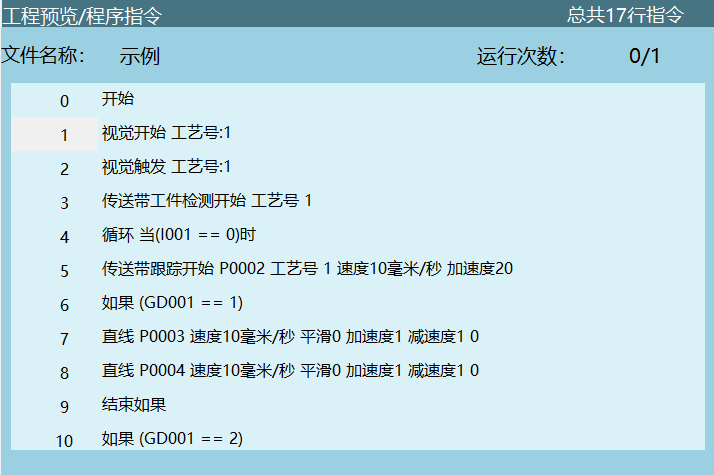

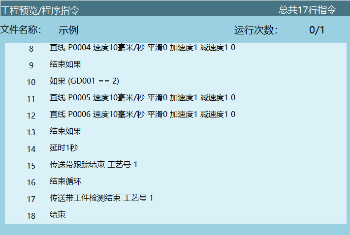

---

# 问答（Q&A）

## Q：视觉工艺支持哪些数据类型？

A：视觉工艺支持三种数据类型：2D（X,Y,Rz）、2D+高度（X,Y,Rz,h）和3D（X,Y,Z,A,B,C），用户可根据实际需求在连接参数中进行选择。

## Q：相机与控制器的IP地址有什么要求？

A：相机IP地址与控制器IP地址前三位须保持一致（同一网段），最后一位不同即可。例如：192.168.1.xxx。

## Q：如何选择触发方式？

A：支持I/O触发和Ethernet触发两种方式。I/O触发通过I/O板给相机发送触发信号；Ethernet触发则向相机发送自定义字符串（默认"TRG"），相机接收后回复坐标值。

## Q：视觉范围设置的作用是什么？

A：用于限定机器人可达到的最大范围，超出范围的相机数据会自动过滤不生效，防止机器人运动到不可达位置。

## Q：视觉标定需要多少个点位？

A：最少需要标定6个点，最多30个点。标定点要求至少3个位置不同、3个姿态不同。

## Q：VISION_POSNUM和VISION_POS指令有什么区别？

A：VISION\_POSNUM用于获取相机发送的点位总个数并存入数值变量；VISION\_POS用于逐次获取单个点位信息并存入位置变量。每执行一次VISION\_POS会获取下一个点位。
