## 1 安全使用须知

**警告**:

• 本手册涉及机器人参数、外部轴参数、系统设置等操作。
• 必须在认真阅读并充分理解手册说明的基础上再使用本系统。
• 没有在手册中说明的内容请视作"不可"、"禁止"。

**注意**:

• 手册中绘制的图解，仅为演示细节部分，在使用本系统前需安装完整设备。
• 因系统功能改进，手册会进行适当的修改，修改后的手册会更新手册版本号。

### > 1.1 安全提示等级

本说明书包括保证作业人员人身安全以及防止机床损坏的有关安全的注意事项，并根据它们在安全方面的重要程度，在正文中以"警告"和"注意"来叙述。相关补充说明以"注释"来描述。用户在使用之前，必须熟读这些"警告"、"注意"和"注释"中所叙述的事项。

**警告**:

• 用于在错误操作时，有可能会出现使用者死亡或者受重伤等危险的情况。

**注意**:

• 用于在错误操作时，有可能会出现人员轻伤或中度受伤、物品受损等危险的情况。

**注释**:

• 用于记述补充说明属警告或者注意以外的事项。

---

## 2 机器人与外部轴参数

**设置路径**: 设置 → 机器人参数


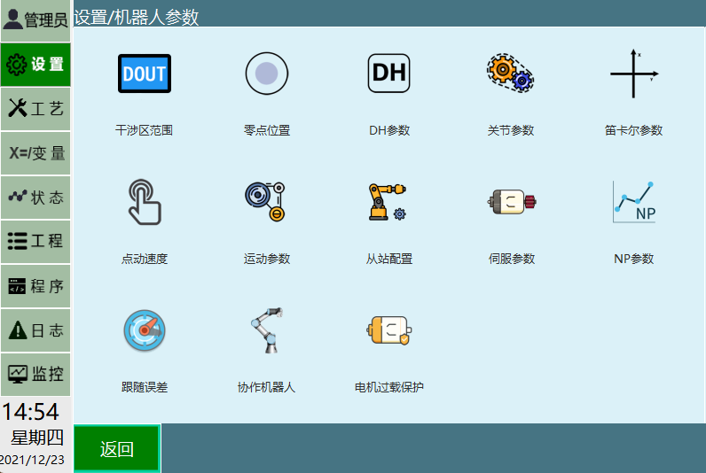

机器人参数界面包含以下功能模块：

- 从站配置
- DH参数
- 关节参数
- 零点位置
- 笛卡尔参数
- 干涉区范围
- 点动速度
- 运动参数
- 伺服参数
- 跟随误差
- 协作机器人


---

## > 2.1 机器人参数

在DH参数界面中，我们提供了预置机器人功能。如果该下拉列表中包含您所使用的机器人型号，您可通过该功能快速、方便地设置好机器人的各项参数。

**操作步骤**:

1. 点击DH参数界面中，左上角【预置机器人】，可以选择已经适配好的机器人型号，选择后该机器人的DH参数、关节参数将自动填入。


2. 选择了预置机器人后需要手动修改零点。

**注释**:

• 预置机器人配置方法可联系系统厂家获取。

---

### 2.1.1 从站配置

**警告**:

• 请勿在未配置该参数的情况下进行切伺服就绪、上电、运行等操作。

修改机器人设置需进入【设置】-【机器人参数】-【从站配置】中修改。

**相关步骤如下**:

1. 进入【设置】-【机器人参数】-【从站配置】界面

2. 此界面显示当前控制器连接的从站名称及数目；可以修改通讯周期与总线类型，总线类型分EtherCAT和CANopen，修改后重启生效。

**总线类型为EtherCAT时**:

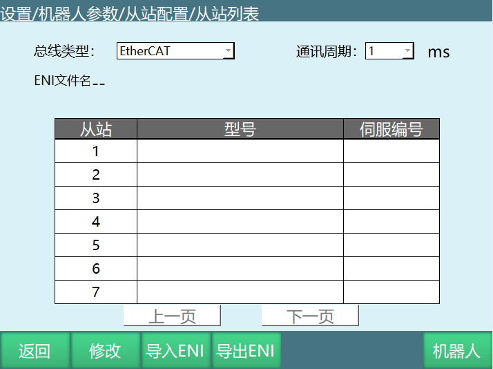

| 参数 | 说明 |
| :--- | :--- |
| 总线类型 | EtherCAT或CANopen |
| 通讯周期 | 可选择1ms、2ms、4ms、8ms |
| ENI文件名 | EtherCAT网络配置文件 |
| 从站列表 | 显示当前连接的伺服从站型号和编号 |
| 导入ENI/导出ENI | 导入或导出EtherCAT网络配置文件 |

**总线类型为CANopen时**:

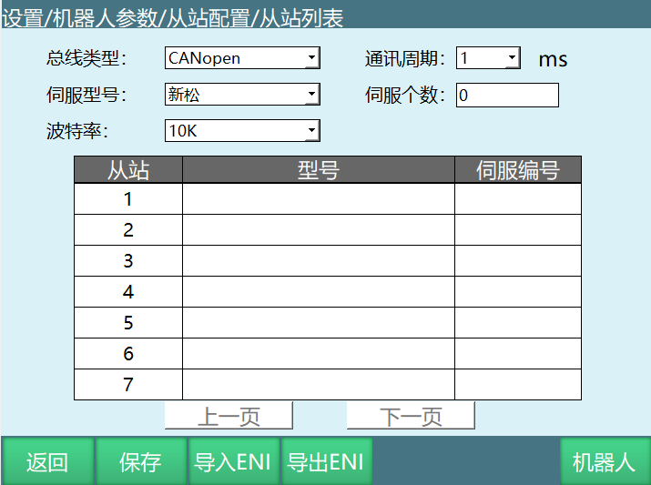

| 参数 | 说明 |
| :--- | :--- |
| 总线类型 | EtherCAT或CANopen |
| 通讯周期 | 可选值 |
| 伺服型号 | 如新松等 |
| 伺服个数 | 配置的伺服数量 |
| 波特率 | 如10K、100K、500K、1M |
| 从站列表 | 显示当前连接的伺服从站型号和编号 |

**机器人配置界面**:

点击【机器人】可进入【机器人配置】界面，此界面可以设置机器人数目、机器人类型、伺服、外部轴组数、外部轴类型。

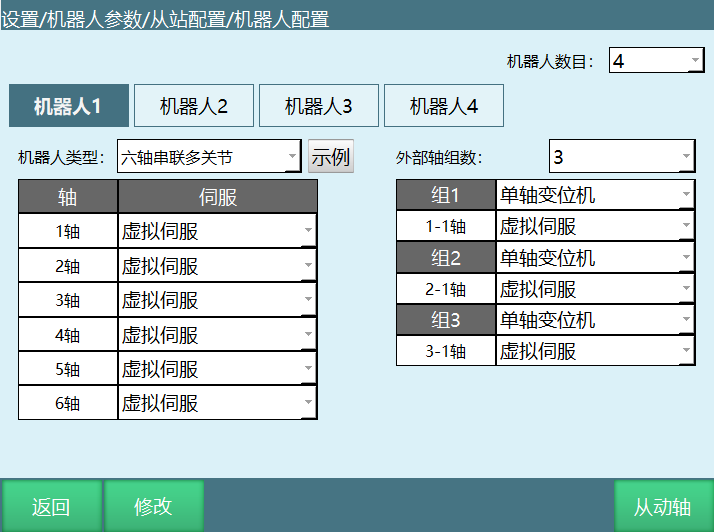

**参数说明**:

| 参数 | 说明 |
| :--- | :--- |
| 机器人数目 | 1台控制器最多支持4台机器人。修改后会有提示框提示重启生效 |
| 机器人类型 | 六轴串联-CBBBCA、六轴串联-CCBABC、六轴串联-CBBBAC、六轴串联-CBBBCA、六轴串联-CCBABC、五轴串联-CBBAB、四轴串联-CCZC、四轴串联-ZCCC、四轴串联-CBBC、四轴串联-CZXC、四轴串联-CBBB、四轴串联-XYZC、三轴串联-CCZ、三轴串联-XYZ、五轴串联-XYZAB、五轴串联-XYZAC、二轴串联-CC、四轴直角-XCCZ、六轴串联-XYZCAC、五轴混联机器人、四轴串联-XCZC、六轴串联-CBBCBA、三轴串联-CCA、Delta并联机器人等。修改机器人类型后参数会重置，谨慎更改机器人类型！ |
| 外部轴组数 | 外部轴类型支持地轨、单轴/双轴变位机，最多支持3组外部轴，总轴数最多为5，且只能存在一个地轨 |
| 伺服 | 伺服对应的序号、型号。由于增加添加伺服文件功能，用户可自行配置 |

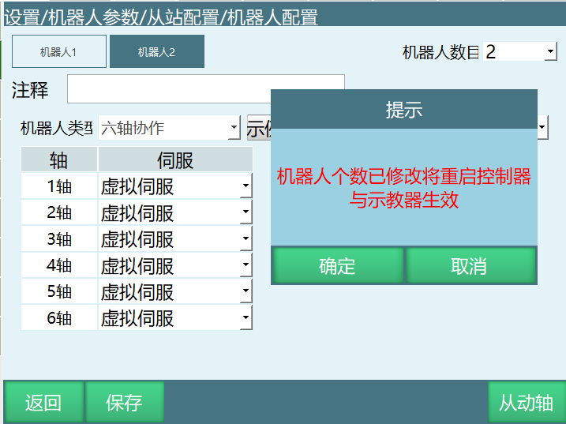

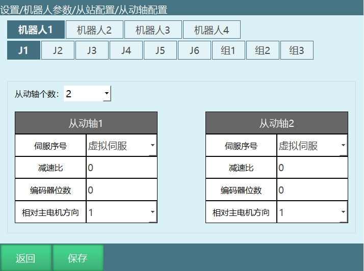


**现支持的IO类型**:

| IO板厂家 | IO型号 |
| :--- | :--- |
| 华太 | 华太 |
| | 华太PWM |
| 盟通 | 盟通 |
| | 盟通old |
| 成石 | 成石 |
| 台邦 | 台邦 |
| INEXBOT | R1 |
| | R1_PWM |
| | R2 |
| | R2A |
| | R2B |
| | R3 |
| | R4 |
| | R4P |
| | 高精度时钟 |
| 西岭 | 西岭EJ1861 |
| | 西岭EJ1862 |
| 摩通 | 摩通 |
| 雷赛 | 雷赛 |
| 研为 | 研为CATIOA |

**从动轴界面**:

此界面可以设置从动轴数目、伺服、减速比、编码器位数、相对于主电机方向。

**参数说明**:

| 参数 | 说明 |
| :--- | :--- |
| 从动轴数目 | 从动轴的数量 |
| 伺服序号 | 从动轴对应的伺服编号 |
| 减速比 | 从动轴的减速比 |
| 编码器位数 | 从动轴编码器的位数 |
| 相对于主电机方向 | 从动轴相对于主电机的旋转方向 |

---

### 2.1.2 关节参数设置

**警告**:

• 请勿在未配置该参数的情况下进行切伺服就绪、上电、运行等操作。

设置关节参数需进入【设置】-【机器人参数】-【关节参数】中修改。


**相关步骤如下**:

1. 进入【设置】-【机器人参数】-【关节参数】界面

2. 此时输入框为灰色且不能输入数值

3. 点击修改后，修改按钮变成保存，输入框变白，可以修改各参数


4. 点击保存，修改成功

**各参数意义**:

| 参数 | 说明 | 单位 |
| :--- | :--- | :--- |
| 正限位 | 机器人关节正方向最大范围 | 度 |
| 反限位 | 机器人关节负方向最大范围（此数值须为负数） | 度 |
| 减速比 | 减速机的减速比 | - |
| 编码器位数 | 编码器的位数 | - |
| 额定正转速 | 电机正方向的额定转速 | 转/分钟 |
| 额定反转速 | 电机反方向的额定转速（此数值须为负数） | 转/分钟 |
| 最大正转速 | 电机正方向的最大转速，其数值为额定正转速的倍数。如额定正转速3000转，最大正转速要6000转，则此处填写2倍 | 倍数 |
| 最大反转速 | 电机反方向的最大转速，其数值为额定反转速的倍数。如额定反转速-4000转，最大反转速要-6000转，则此处填写-1.5倍（此数值须为负数） | 倍数 |
| 额定正速度 | 机器人关节的额定正方向速度，由额定正转速、编码器位数、减速比自动计算而来（四轴SCARA的3轴、四轴SCARA异型一轴还要加上螺距），无需填写 | 度/秒 |
| 额定反速度 | 机器人关节的额定负方向速度，由额定反转速、编码器位数、减速比自动计算而来，无需填写（此数值须为负数） | 度/秒 |
| 最大加速度 | 机器人关节运动的最大的加速度，其数值为额定正速度的倍数。如额定正速度为300度/s，需要最大加速度为1500度/s²，则此处填写5倍 | 倍数 |
| 最大减速度 | 机器人关节运动的最大的减速度，其数值为额定反速度的倍数。如额定反速度为300度/s，需要最大减速度为1200度/s²，则此处填写-4倍。建议最大加速度与最大减速度数值相同（此数值须为负数） | 倍数 |
| 模型方向 | 模型方向可参照零点位置界面关节正方向示意图设置，各轴点动"+"键应与关节正方向示意图方向相同，相同选1，相反选-1 | - |
| 齿轮反向间隙 | 每当关节往相反方向运动时，以填写的角度值给予补偿。该参数在【设置】-【机器人参数】-【关节参数】-【其他参数】界面 | 度 |

**关节正方向示意图**:


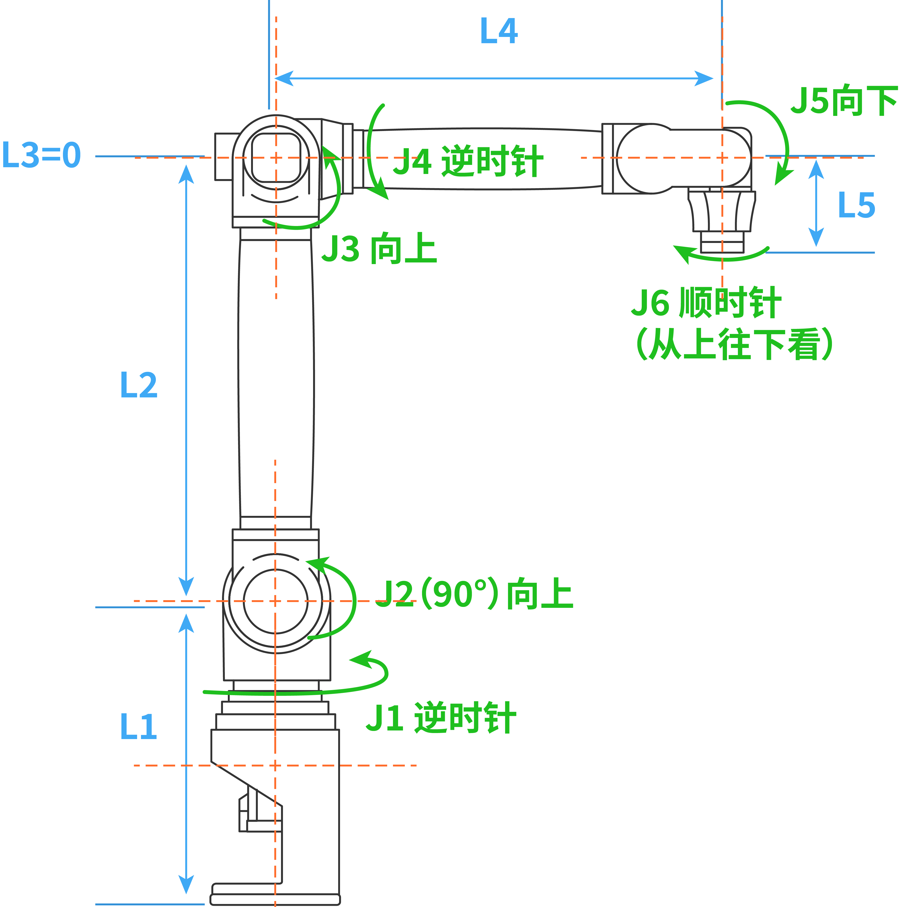

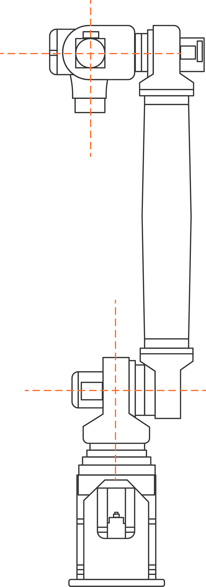

| 机器人类型 | 轴正方向 | 正方向（俯视图或左视图） |
| :--- | :--- | :--- |
| 六轴 | J1+ | 逆时针 |
| | J2+ | 向上 |
| | J3+ | 向上 |
| | J4+ | 逆时针 |
| | J5+ | 向下 |
| | J6+ | 顺时针 |
| 四轴SCARA | J1+ | 逆时针 |
| | J2+ | 逆时针 |
| | J3+ | 向上 |
| | J4+ | 顺时针 |
| 四轴码垛 | J1+ | 逆时针 |
| | J2+ | 向上 |
| | J3+ | 向上 |
| | J4+ | 逆时针 |
| 四轴关节 | J1+ | 逆时针 |
| | J2+ | 向上 |
| | J3+ | 向上 |
| | J4+ | 向上 |
| 5轴关节 | J1+ | 逆时针 |
| | J2+ | 向上 |
| | J3+ | 向上 |
| | J4+ | 逆时针 |
| | J5+ | 向下 |
| 二轴SCARA | J1+ | 逆时针 |
| | J2+ | 逆时针 |
| 三轴SCARA | J1+ | 逆时针 |
| | J2+ | 逆时针 |
| | J3+ | 向下 |
| 一轴 | J1+ | 逆时针 |
| 四轴SCARA异型 | J1+ | 向上 |
| | J2+ | 逆时针 |
| | J3+ | 逆时针 |
| | J4+ | 顺时针 |

---

#### 2.1.2.1 多圈值溢出计数

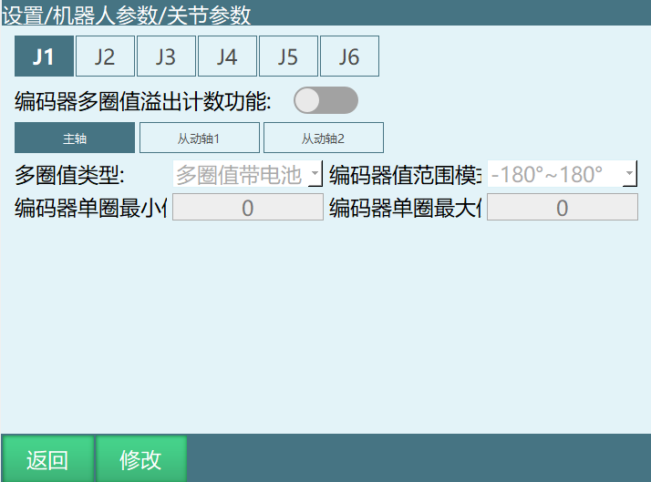

配置多圈值溢出计数需进入【设置】-【机器人参数】-【关节参数】界面，点击【多圈值】，修改编码器的范围。

**功能说明**: 该功能用来消除编码器最大/最小值之间跳变产生的影响。

**原理说明**: 例如编码器多圈值范围为[-2147483648,2147483647]，当前编码器多圈值位置为2147483647，则再往正方向转1个单位则为-2147483648，如系统不知道编码器多圈值范围则会认为机器人突然跳变，并不会知道实际只转了1个单位，此时则容易出现飞车现象。

**警告**:

• 必须填写该参数，不填写可能出现以下问题：
  ①点位出现较大跳变，例如突然从4度变为40度。
  ②飞车。
• 若配置从动轴，则从动轴的编码器最大/最小值也要填写。

**参数说明**:

| 参数 | 说明 |
| :--- | :--- |
| 编码器多圈值溢出计数功能 | 打开按钮该关节即使用该功能 |
| 多圈值类型 | 分为多圈值带电池、多圈值不带电池、单圈值 |
| 编码器值范围模式 | 0度~360度或-180度~180度 |
| 编码器单圈最小值 | 根据计算方法填写 |
| 编码器单圈最大值 | 根据计算方法填写 |

**多圈值类型说明**:

• **多圈值带电池**: 范围为 0 到 (2^32)-1（编码器值范围模式为0~360），或 -(2^(32-1)) 到 (2^(32-1))-1（编码器值范围模式为-180~180）。

• **单圈值**: 范围为 0 到 (2^X)-1（编码器值范围模式为0~360），-(2^(X-1)) 到 (2^(X-1))-1（编码器值范围模式为-180~180），X为编码器位数。

• **多圈值不带电池**: 虽然类型为多圈值不带电池的编码器在有机器人供电时，和多圈值带电池是一样的，但关机重启后，其多圈值会消失，只剩下单圈值，所以我们需要将其看作是单圈值类型，其编码器范围也设定为其单圈值范围。在有供电时，每次读取写入编码器时，记录其超出单圈值范围的圈数，并保存到文件中，留给断电重启后使用。在断电重启后，读取其记录的超出圈数，供恢复机器人实际位置用。

**编码器值范围模式**: 0度~360度或-180度~180度。

**编码器单圈最小值&编码器单圈最大值**: 根据上述计算方法，自行计算填写。如编码器类型为多圈值不带电池，编码器位数为17，编码器值范围模式为0~360，单圈最小值填0，单圈最大值填（2^17）-1=131071。

---

### 2.1.3 机器人零点位置

**警告**:

• 修改零点位置后，所有作业程序均不可用，请勿使用。
• 零点标定需从站配置、关节参数配置正确。

---

### 2.1.4 零点标定

若机器人零点位置为非标准零点位置，用户可以将机器人按照机器人的对位孔对齐后，在机器人零点位置界面将当前机器人位置坐标设置为零点位置。

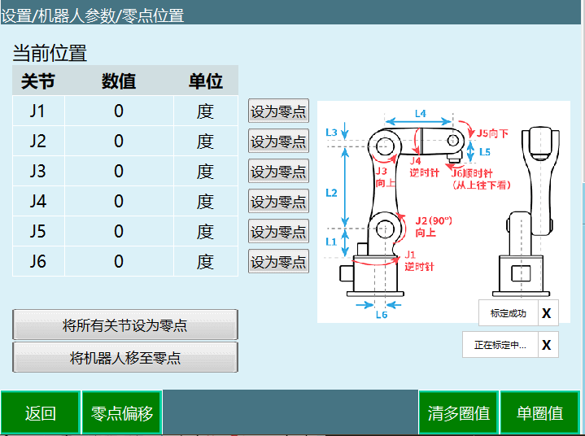

**具体操作步骤如下**:

1. 打开【设置】-【机器人参数】-【零点位置】界面

2. 设置"关节坐标模式" 下，机器人各个关节处于零位时的姿态如下图所示，其中下臂处于竖直状态，前臂处于水平状态，手腕部（第五关节）也处于水平状态。一般机器人在本体设计过程中已考虑了零位接口（例如凹槽、刻线、标尺等）

3. 点击想要设置零点的轴所对应的【设为零点】按钮，或者通过点击【将所有关节设为零点】按钮来一次性将所有关节坐标设置为零点

4. 在弹出的修改提示框，点击【确定】进行机器人零点设置

5. 该轴（所有轴）零点位置设置成功：
   • 伺服就绪状态下，按下DeadMan键后，再按【将机器人移至零点】，确保机器人安全
   • 速度值自动调整为5% 运行，可手动调节增加运动速度
   • 将当前位置设置为零点后，当前位置的轴坐标变为(0,0,0,0,0,0)
   • 可以将一个或多个轴当前位置坐标设置为零点坐标，此时未设置轴的零点坐标为原零点坐标

**警告**:

• 没有进行原点位置校准，不能进行示教和回放操作。
• 使用多台机器人的系统，每台机器人都必须进行原点位置校准。
• 当关节轴之间存在耦合关系时，例如常见的机器人第五轴和第六轴存在耦合关系，第五轴必须处于零点位置时，第六轴记录的零点数据才会有效，否则，第六轴记录的零点数据是无效的。所以必须在第五轴处于零位的状态下记录第六轴的零位数据。如果不存在耦合关系，则各个轴可以单独标定零位，各自的零位不会影响到其它关节的零位。

---

### 2.1.5 零点偏移

零点偏移可以在用户需要调整零点时使用，可以输入手填值，操作方式与零点标定类似。

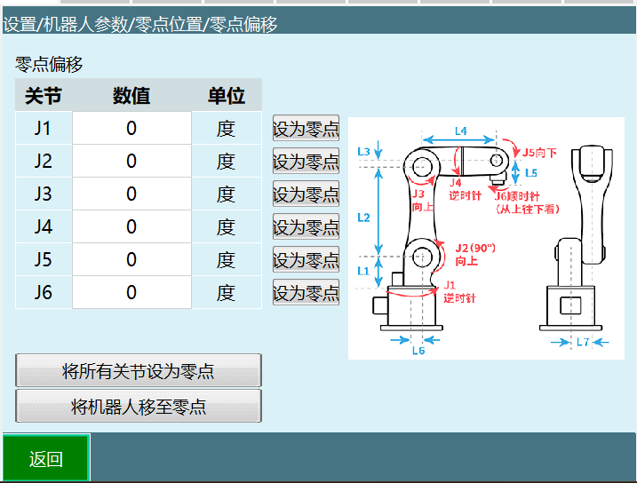

---

### 2.1.6 清多圈值

**警告**:

• 请务必谨慎操作，该操作会导致机器人编码器值被清零，导致原厂保存零点数据清零。
• 可能会导致以下问题：
  ⅰ. 机器人丢失精度；
  ⅱ. 机器人无法正常运行；
  ⅲ. 曾经建立的点位无法运动。

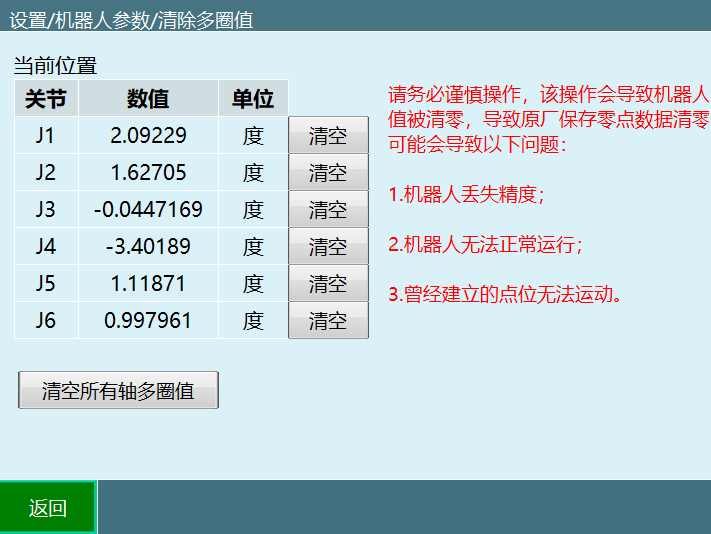


**操作说明**:

• **清空所有轴多圈值**: 一次清空该机器人所有轴多圈值（不包括外部轴）
• **每个关节后的清空**: 清空该轴的多圈值

---

### 2.1.7 单圈值

该功能可以修改每个轴对应的单圈值。

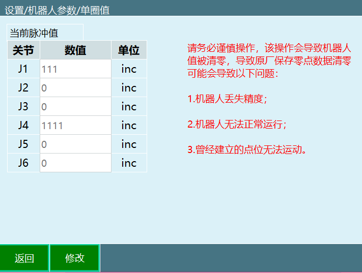

**警告**:

• 请务必谨慎操作，该操作会导致机器人编码器值被清零，导致原厂保存零点数据清零。
• 可能会导致以下问题：
  ⅰ. 机器人丢失精度；
  ⅱ. 机器人无法正常运行；
  ⅲ. 曾经建立的点位无法运动。

---

### 2.1.8 零点丢失找回方式

**前置条件**:

1. 机器人只是因为操作失误导致零点丢失，发生碰撞无法找回

2. 记录过未丢失零点前单圈值（没有清多圈值时，单圈值界面显示的数值为上次零点标定时的数据）

**操作步骤**:

1. 找到丢失零点前记录的单圈值备用
2. 将机器人示教到机械零点位置
3. 清机器人所有轴多圈值（此操作会清除多圈值、单圈值，请谨慎操作）
4. 标定机器人所有轴零点
5. 在单圈值界面输入步骤1准备好的单圈值数据
6. 操作机器人回零
7. 确认零点是否正确

---

### 2.1.9 DH参数

**警告**:

• 请勿在未配置该参数的情况下进行切伺服就绪、上电、运行等操作
• 配置DH参数前需先配置零点标定

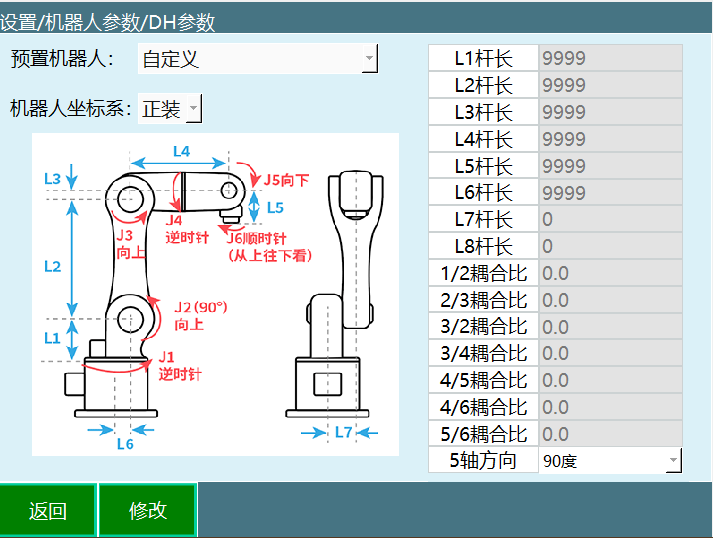

**相关步骤如下**:

1. 进入【设置】-【机器人参数】-【DH参数】界面

2. 点击底部的【修改】按钮

3. 根据您机器人实际填写

4. 点击想要修改的参数值（如L2），此时会出现软键盘，输入想替换的数字，并点击确认

5. 点击【保存】按钮，完成参数修改

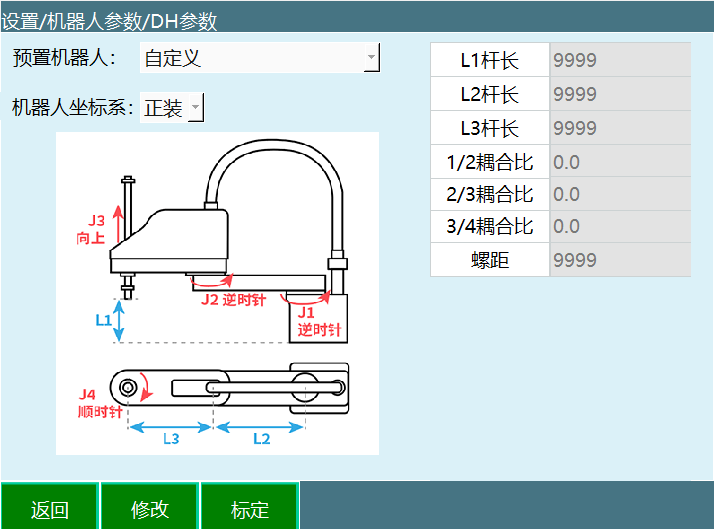

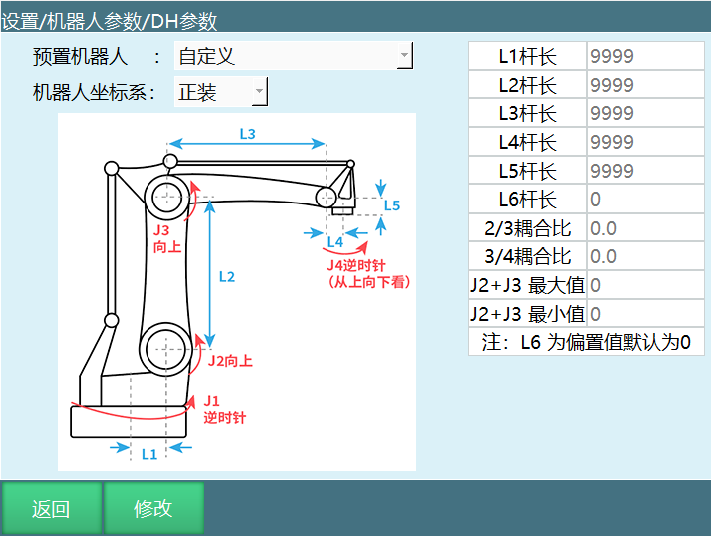

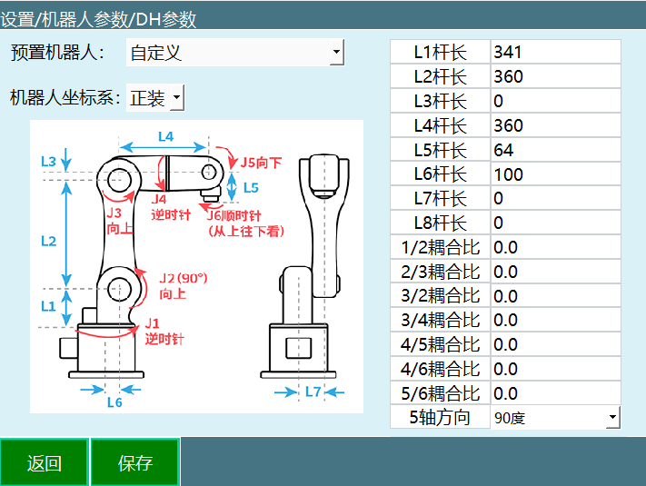

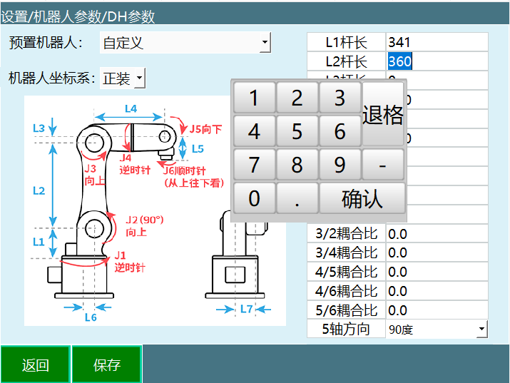


**各参数意义**:

| 参数 | 说明 | 单位 |
| :--- | :--- | :--- |
| 预置机器人 | 通过事先把机器人关节参数和DH参数导入到控制器里，可以省去重复填写参数的步骤。具体使用方法可以联系厂家 | - |
| 机器人坐标系 | 正装或倒装 | - |
| 杆长 | 机器人尺寸。L1-L6为各关节连杆长度，L7-L8为偏置值 | mm |
| 耦合比 | 部分机器人本体在设计上会使电机跨越了很多个轴来驱动某个轴，这就造成了两个轴的耦合 | - |
| 1/2耦合比 | 1轴转动时2轴跟随转动的角度比 | - |
| 2/3耦合比 | 2轴转动时3轴跟随转动的角度比 | - |
| 3/2耦合比 | 3轴转动时2轴跟随转动的角度比 | - |
| 3/4耦合比 | 3轴转动时4轴跟随转动的角度比 | - |
| 4/5耦合比 | 4轴转动时5轴跟随转动的角度比 | - |
| 4/6耦合比 | 4轴转动时6轴跟随转动的角度比 | - |
| 5/6耦合比 | 5轴转动时6轴跟随转动的角度比 | - |
| 5轴方向 | 零点标定时的5轴方向。90度表示垂直方向，0度表示水平方向 | 度 |
| 螺距 | 四轴SCARA中负责上下运动的连杆的螺距（对于四轴SCARA是3轴，对于四轴SCARA异型是1轴） | mm |
| J2+J3最小值/最大值 | 四轴码垛机器人的参数 | 度 |

**耦合比计算公式**:

```
跟随轴旋转角度
耦合比 = ───────────────
主轴旋转角度
```

**示例**: 例如我们操作 2 轴旋转了 10°，发现 3 轴跟随旋转了 15°，那么耦合比为：

```
15°
耦合比 = ──── = 1.5
10°
```

**5轴方向说明**:

• 3: 水平方向
• 1: 垂直方向

**J2+J3最小值/最大值说明**: 分别让四轴码垛机器人的2轴和3轴移动到J2max/J3max、J2min/J3max、J2max/J3min、J2min/J3min，记录下四种情况下J2+J3的值，去除四个值中最高和最低值，剩下的两个就是J2+J3最小值/最大值。

---

### 2.1.10 笛卡尔参数

设置笛卡尔参数需进入【设置】-【机器人参数】-【笛卡尔参数】中修改。

**相关步骤如下**:

1. 进入【设置】-【机器人参数】-【笛卡尔参数】界面

2. 此时输入框为灰色且不能输入数值

3. 点击修改后，修改按钮变成保存，输入框变白，可以在各自的参数后面输入数值

4. 点击保存，修改成功

**各参数意义**:

| 参数 | 说明 | 单位 |
| :--- | :--- | :--- |
| 最大速度 | 机器人运行时的最大线速度 | mm/s |
| 最大加速度 | 机器人运行时的最大加速度，此数值为最大速度的倍数。如最大速度为1000mm/s，需要最大加速度为3000mm/s²，则此处填写3倍 | 倍数 |
| 最大减速度 | 机器人运行时的最大减速度，此数值为最大速度的倍数。如最大速度为1000mm/s，需要最大减速度为-3000mm/s²，则此处填写-3倍。建议最大加速度与最大减速度数值相同，且与关节参数中的最大加速度与最大减速度相同（此数值须为负数） | 倍数 |
| 最大加加速度 | 当机器人插补方式为加加速度插补时笛卡尔参数界面才会显示最大加加速度 | °/s³ |
| 姿态运动最大速度 | 机器人姿态运动时的最大速度，指令速度超出会被降速 | °/s |
| 速度限制方式 | 位姿：机器人直线插补的运动同时受最大速度、姿态运动最大速度限制。位置：机器人直线插补的运动仅受最大速度限制 | - |

---

### 2.1.11 干涉区范围设置

机器人范围限制用来限制机器人的运动范围。其设置方式为两种："手动填写"和"标定"。

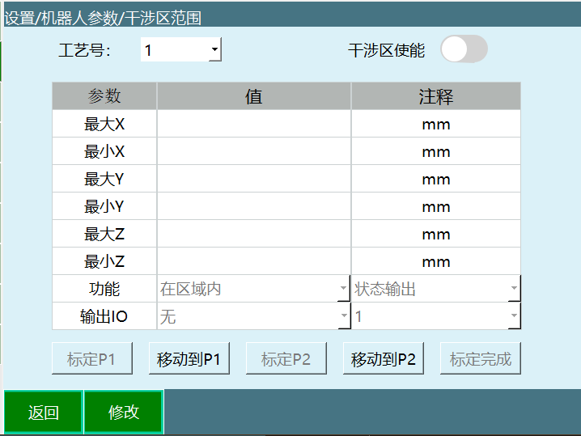

**参数说明**:

| 参数 | 说明 | 单位 |
| :--- | :--- | :--- |
| 最小X | 运动范围X轴最小值 | mm |
| 最大X | 运动范围X轴最大值 | mm |
| 最小Y | 运动范围Y轴最小值 | mm |
| 最大Y | 运动范围Y轴最大值 | mm |
| 最小Z | 运动范围Z轴最小值 | mm |
| 最大Z | 运动范围Z轴最大值 | mm |
| 工艺号 | 可以选择99个工艺号，可以多个同时使用 | - |
| 干涉区使能 | 打开这个开关后，该干涉区生效 | - |
| 功能 | 机器人在区域内/区域外时，禁止机器人运行/状态输出。区域内-状态输出：机器人位于干涉区内时触发状态输出。区域外-状态输出：机器人位于干涉区外时触发状态输出。区域内-禁止运动：机器人位于干涉区内时禁止机器人运行。区域外-禁止运动：机器人位于干涉区外时禁止机器人运行 | - |
| 输出IO | 功能选项为状态输出时有效，输出干涉区状态 | - |
| 标定P1与标定P2 | 标定范围的最大值最小值 | - |
| 移动到P1与移动到P2 | 将机器人移动到标定的位置 | - |
| 标定完成 | 自动计算最大值与最小值 | - |

**设置方法**:

• **手动填写**: 在点击修改按钮后方可设置机器人在X、Y、Z轴可以运动的最大与最小坐标值

• **标定**: 可以移动机器人，并点击界面上的【标定P1】与【标定P2】来确定最大最小值，标定完后点击【标定完成】

---

### 2.1.12 点动速度

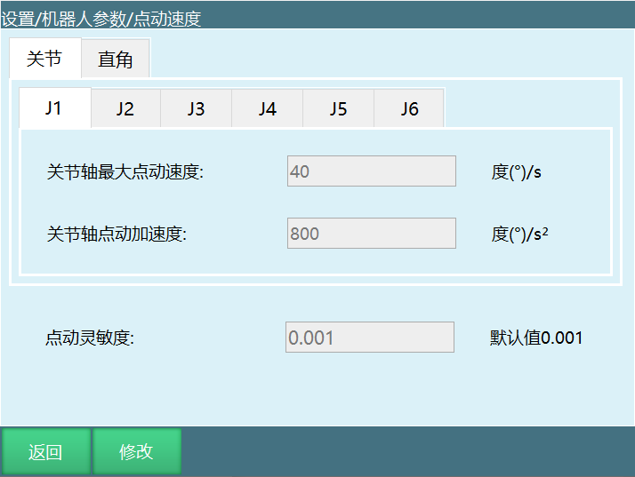

设置点动速度进入【设置】-【机器人参数】-【点动速度】中修改。

**相关步骤如下**:

1. 进入【设置】-【机器人参数】-【点动速度】界面

2. 此时输入框为灰色且不能输入数值

3. 点击修改后，修改按钮变成保存，输入框变白，可以在各自的参数后面输入数值

4. 点击保存，修改成功

**各参数意义**:

| 参数 | 说明 | 单位 |
| :--- | :--- | :--- |
| 关节轴最大点动速度 | 关节坐标下点动机器人时的最大速度=关节轴最大点动速度*全局速度 | 度()/s |
| 关节轴点动加速度 | 点动时的最大加速度 | 度(°)/s² |
| 直角坐标最大点动速度 | 直角坐标下点动机器人时的最大速度=直角最大点动速度*全局速度 | mm/s |
| 直角坐标点动加速度 | 点动时的最大加速度 | mm/s² |
| 点动灵敏度 | 上电后，机器人抖动范围大于点动灵敏度时点动操作无效。默认值0.001 | - |

---

### 2.1.13 运动参数

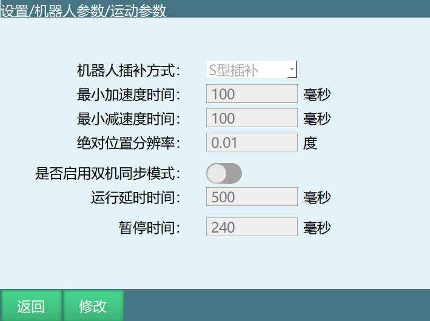

【运动参数】提供了三种机器人运动插补方式。

**注意**: 是否启用双机同步模式只在两个机器人都为六轴串联多关节机器人，且都不带外部轴时有效。

**操作步骤**:

1. 点击【修改】按钮

2. 选择机器人插补方式

3. 点击【保存】按钮

**各参数意义**:

| 参数 | 说明 | 单位 |
| :--- | :--- | :--- |
| 机器人插补方式 | S型插补、梯型插补、加加速度插补 | - |
| 远程模式速度 | 远程模式实际运行速度=远程模式速度*全局速度 | - |
| 最小加速度时间 | 机器人从静止状态加速至目标速度所需的最短时间，或者从一个较低的速度加速至较高的速度所需的时间 | 毫秒 |
| 最小减速度时间 | 机器人从最高速度减速至静止状态，或者从较高速度减速至较低速度所需的最短时间 | 毫秒 |
| 绝对位置分辨率 | 运行点位是2个点相差小于分辨率时，当成1个点执行 | 度 |
| 是否启用双机同步模式 | 双机模式开关，关闭时为多机模式，两台六轴串联多关节机器人相互独立；打开时为双机模式，可在机器人1程序中使用双机指令控制机器人2协同。关闭双机协作重启控制器生效。当从站配置2台六轴串联多关节机器人时，显示该功能 | - |
| 运行延时时间 | 程序启动时的运行延时 | 毫秒 |
| 暂停时间 | 运行程序过程中切模式停止、切模式暂停、远程停止、远程暂停时，从运行到停止所用的时间 | 毫秒 |


**插补方式说明**:

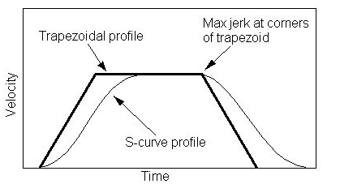

• **S型插补**: 在加速度增大和加速度之间有一段加速度恒定的过渡阶段，使速度变化更加平滑。

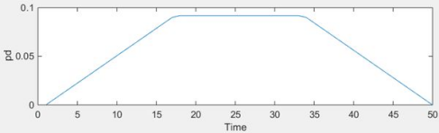

• **梯型插补**: 加速度直接从0增大到目标值，再从目标值减小到0，加速度变化曲线呈梯形。

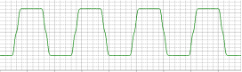

• **加加速度插补**: 直接从加速度增大到加速度减小，没有加速度恒定的过渡阶段，加速度变化更加剧烈。

---

### 2.1.14 伺服参数

**警告**:

• 请慎重修改，修改后人员请在安全区域进行测试

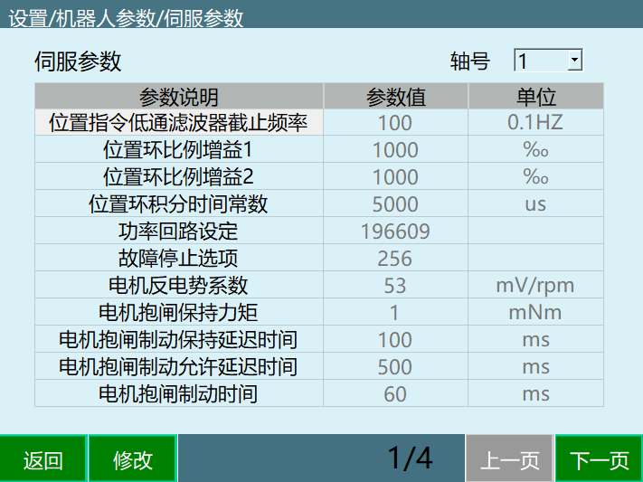

打开【设置】-【机器人参数】-【伺服参数】界面，在此可查看修改伺服的参数，目前仅支持德创、华成伺服读取修改。

**参数说明**:

| 参数 | 说明 | 单位 |
| :--- | :--- | :--- |
| 轴号 | 当前设置的伺服轴号 | - |
| 位置指令低通滤波器截止频率 | 位置指令低通滤波器的截止频率 | HZ |
| 位置环比例增益1 | 位置环的比例增益1 | % |
| 位置环比例增益2 | 位置环的比例增益2 | % |
| 位置环积分时间常数 | 位置环的积分时间常数 | us |
| 功率回路设定 | 功率回路设定值 | - |
| 故障停止选项 | 故障停止选项 | - |
| 电机反电势系数 | 电机的反电势系数 | mV/rpm |
| 电机抱闸保持力矩 | 电机抱闸的保持力矩 | mNm |
| 电机抱闸制动保持延迟时间 | 电机抱闸制动保持延迟时间 | ms |
| 电机抱闸制动允许延迟时间 | 电机抱闸制动允许延迟时间 | ms |
| 电机抱闸制动时间 | 电机抱闸制动时间 | ms |

---

### 2.1.15 跟随误差

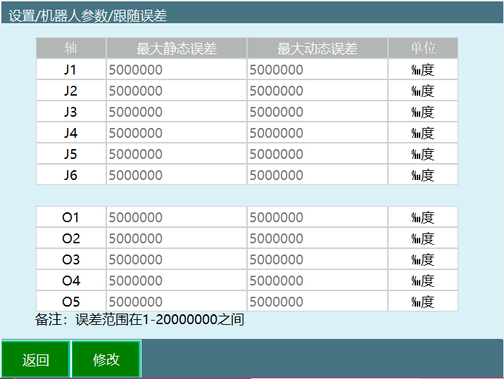

打开【设置】-【机器人参数】-【跟随误差】界面，可以设置最大静态误差、最大动态误差等，单位‱，范围1-20000000。

**参数说明**:

| 参数 | 说明 | 单位 |
| :--- | :--- | :--- |
| 轴 | 轴号 | - |
| 最大静态误差 | 静态跟随误差的最大值 | ‱ |
| 最大动态误差 | 动态跟随误差的最大值 | ‱ |

---

### 2.1.16 协作机器人

该界面为协作机器人参数设置界面，其他类型机器人无需设置。

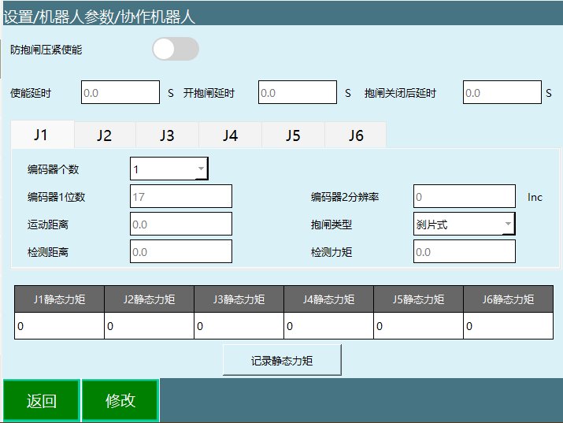

**参数说明**:

| 参数 | 说明 | 单位 |
| :--- | :--- | :--- |
| 使能延时 | 按下使能键之后延时多久给伺服下发使能命令 | ms |
| 开抱闸延时 | 下发使能命令后延时多久给伺服下发开抱闸命令 | ms |
| 抱闸关闭后延时 | 抱闸关闭后延时多久伺服会响应下一步操作 | ms |
| 编码器个数 | 单关节编码器的个数 | - |
| 编码器1位数 | 同关节参数中的编码器位数 | - |
| 编码器2分辨率 | 单关节中另一个编码器的inc值 | - |
| 运动距离 | 开抱闸前关节的微动距离，一般为20；该值为编码器值，单位inc | inc |
| 抱闸类型 | 刹片式抱闸和插销式抱闸；该值为编码器值，单位inc | - |
| 检测距离 | 开抱闸后用于检测抱闸是否打开的关节运动距离 | inc |
| 检测力矩 | 开抱闸后关节运行检测距离过程中力矩超过检测力矩则认为抱闸打开失败 | - |

---

## > 2.2 外部轴参数

### 2.2.1 关节参数

同机器人关节参数配置，请参照机器人关节参数进行配置。

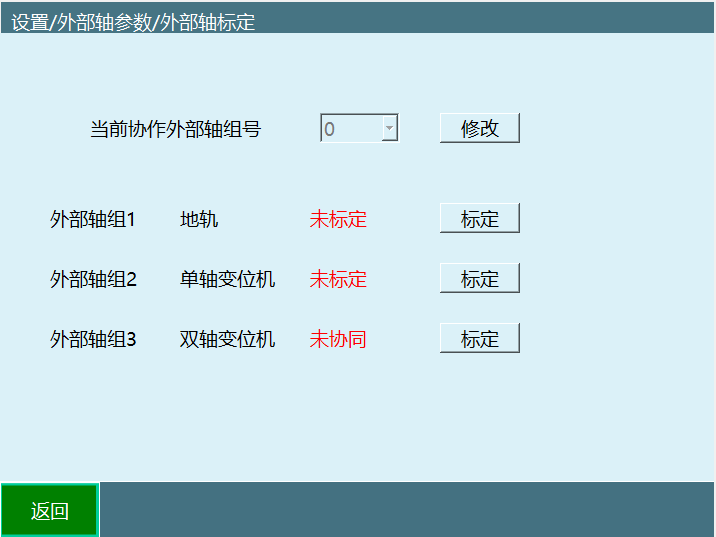

**警告**:

• 请勿在未配置该参数的情况下进行切伺服就绪、上电、运行等操作。

---

### 2.2.2 零点位置

同机器人零点位置配置，请参照零点位置进行配置。


**警告**:

• 请勿在未配置外部轴关节参数的情况下进行切伺服就绪、上电、运行等操作。

---

### 2.2.3 外部轴标定

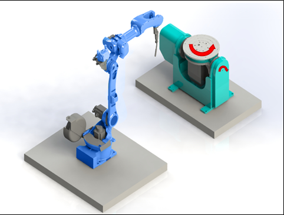

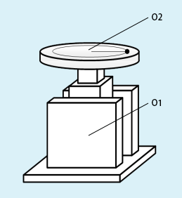

**注释**:

• 外部轴标定前需确定机器人工具手已标定。
• 点动验证外部轴参数准确。

【外部轴标定】界面包含所设外部轴组标定情况与当前协作外部轴组号。

**外部轴正方向**:

• O1（下面翻转轴）：正方向为面向机器人的反方向

• O2（上面旋转轴）：正方向为从上往下看逆时针

**外部轴标定方法**:

• **地轨标定**:

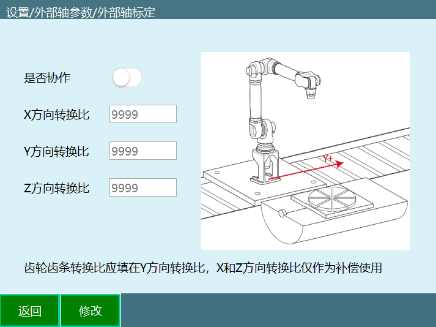

设置完地轨关节参数与齿轮齿条比后，打开协作开关即认为已标定。

| 参数 | 说明 |
| :--- | :--- |
| 是否协作 | 打开后地轨与机器人协作 |
| X方向转换比 | 误差值，地轨转动360°，X轴方向误差数填入此处。没有误差则填0 |
| Y方向转换比（齿轮齿条比） | 地轨转动360°，Y轴移动数值填入此处 |
| Z方向转换比 | 误差值，地轨转动360°，Z轴方向误差数填入此处。没有误差则填0 |

**注释**:

• 地轨正方向与机器人Y+方向平行。
• Y方向转换比计算方法：螺距先填入360，测量轴运动360°时实际运动的距离（毫米），将此距离填入螺距。
• XYZ方向转换比为9999时无法上电。

• **双轴变位机标定**:

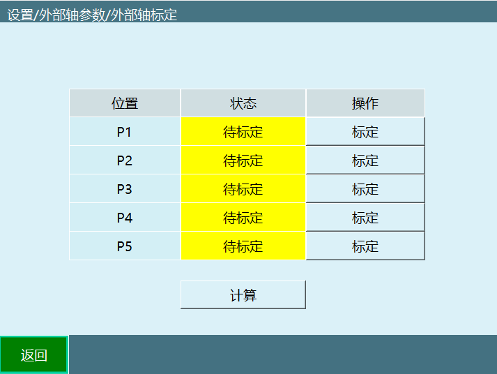

双轴变位机需要标定P1-P5共5个点。

**标定步骤**:

（1）外部轴回零点，并在转盘上找一点作为基准点A。

（2）P1：将外部轴2轴+方向转动100度左右，此时基准点A如图P1，将机器人末梢移动到P1，标定P1。

（3）P2：将外部轴2轴-方向转动50度左右，此时基准点A如图P2，将机器人末梢移动到P2，标定P2。

（4）P3：外部轴回零，此时基准点A如图P3，将机器人末梢移动到P3，标定P3。

（5）P4：将外部轴1轴正方向转动25度左右，此时基准点A如图P4，将机器人末梢移动到P4，标定P4。

（6）P5：再次将外部轴1轴正方向转动25度左右，此时基准点A如图P5，将机器人末梢移动到P5，标定P5。

（7）点击计算。

• **单轴翻转变位机标定**:


**标定步骤**:

（1）外部轴回零点，并在平台上找一点作为基准点A。

（2）将外部轴正方向转动50度，此时A为P1，将机器人末梢移动到P1点，标定P1。

（3）将外部轴反方向转动25度，此时A为P2，将机器人末梢移动到P2点，标定P2。

（4）将外部轴回零，此时A为P3，将机器人末梢移动到P3点，标定P3。

• **单轴旋转变位机标定**:

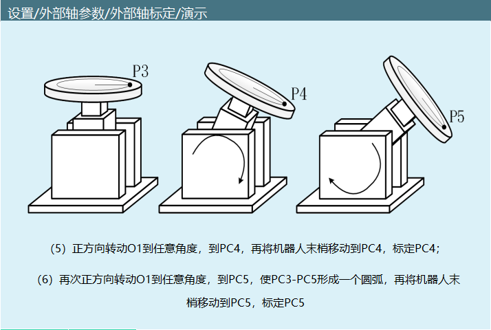

**标定步骤**:

（1）外部轴回零点，并在平台上找一点作为基准点A。

（2）将外部轴正方向转动100度，此时A为P1，将机器人末梢移动到P1点，标定P1。

（3）将外部轴反方向转动50度，此时A为P2，将机器人末梢移动到P2点，标定P2。

（4）将外部轴回零，此时A为P3，将机器人末梢移动到P3点，标定P3。

**外部轴指令注意事项**:

• 存在多组变位机时，机器人只能同时与一组变位机进行协作，通过坐标系类-切换外部轴来切换当前协作的外部轴轴组。

• MOVJEXT(外部轴点到点)：在外部轴上选两点，机器人对准点插入E001、E002（E点坐标包含机器人和外部轴的位置数据）。

• MOVLEXT(外部轴直线)：在外部轴上选两点，机器人对准点插入E001、E002（E点坐标包含机器人和外部轴的位置数据）；插入时SYNC同步选择是，未标定外部轴或未选择协作组号时不能开启同步运行。

• MOVCEXT(外部轴圆弧)：在外部轴上选三点，第一个点插入MOVJEXT或者MOVLEXT; 机器人对准点插入E001、E002、E003（E点坐标包含机器人和外部轴的位置数据）；插入时SYNC同步选择是，未标定外部轴或未选择协作组号时不能开启同步运行。

• 点动速度：同机器人点动速度配置，请参照机器人点动速度进行配置。

---

## 3 新机器人配置步骤

当您拿到一套新的控制系统后，请首先配置好机器人个数、机器人类型、机器人伺服类型、外部轴类型、外部轴伺服类型与IO的型号，否则开机后将出现"无法连接伺服"的报错信息，并且伺服无法使用。

机器人个数、机器人类型、机器人伺服类型、外部轴类型、外部轴伺服类型与IO的型号请严格按照您的实际接线来进行配置。若确认已经严格按照实际接线，但还是出现"无法连接伺服"的报错信息，请联系我司技术支持人员，提供您所使用的伺服型号和IO型号。

当伺服类型与IO型号没有配置正确时，系统启动后需要等待一段时间才能使得控制器与示教器连接，所以此时开机后若示教器上方显示"连接断开"，此为正常现象。

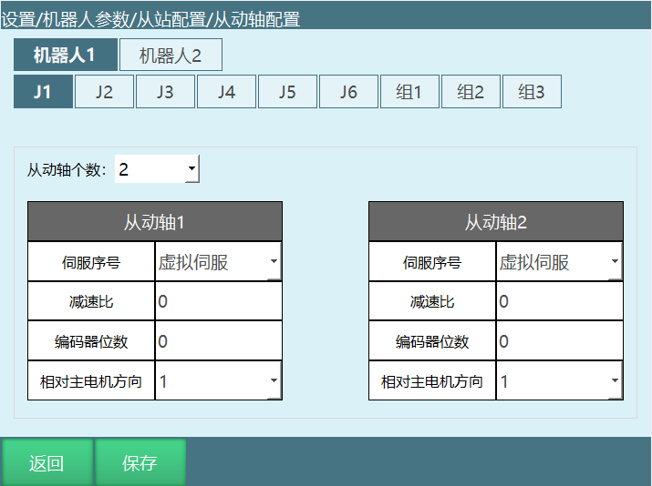

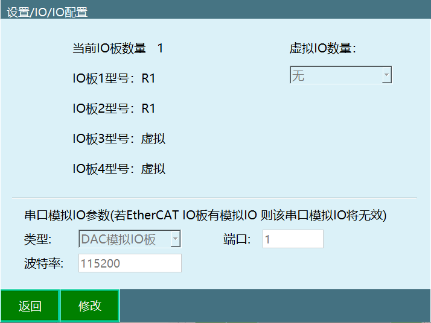

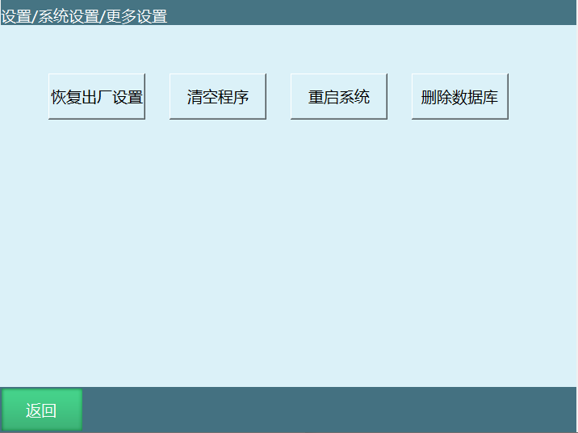

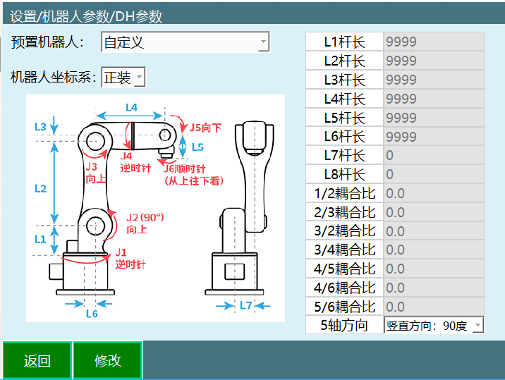

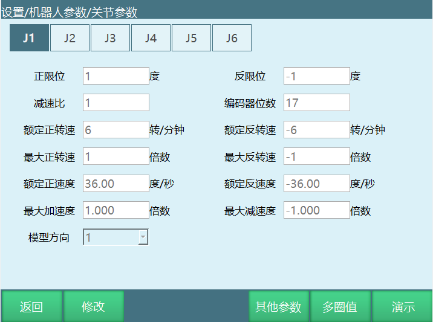


**以下为完整的参数配置步骤**:

1. **切换权限**: 切换权限到"管理员"，默认密码为123456

2. **从站配置**: 在"设置-机器人参数-从站配置"中进行机器人个数、机器人通讯周期、机器人类型、伺服型号的配置（机器人型号请务必选择正确，否则会导致机器人无法正常运动！）

   • 伺服列表显示当前控制器开机后读到的伺服个数型号，该界面可设置通讯周期

   • 机器人伺服配置可以配置机器人个数、机器人类型、外部轴数目、伺服选择

   • 从动轴设置，可设置从动轴个数、从动轴伺服、减速比、编码器位数、相对于主电机方向

3. **IO配置**: 在"设置-IO-IO配置"中进行串口模拟IO类型、虚拟IO数量的配置，普通EtherCAT IO无需设置

   • 注：使用华太IO时，ENI文件稍有不同

4. **重新启动系统**: 机器人配置修改后重启生效

5. **预置机器人**: 在DH参数界面中，我们提供了预置机器人功能。如果该下拉列表中包含您所使用的机器人型号，您可以通过该功能快速、方便地设置好机器人的各项参数

6. **机器人坐标系**: 机器人坐标系根据实际装配选择（倒装：直角坐标、工具坐标、用户坐标与正装操作习惯一致）

7. **选择预置机器人**: 点击DH参数界面中，左上角【预置机器人】，可以选择已经适配好的机器人型号，选择后该机器人的DH参数、关节参数将自动填入

8. **手动修改零点**: 选择了预置机器人后需要手动修改零点

9. **手动填写参数**: 若该选项中没有您的机器人，请按照以下步骤手动填写各参数

10. **填写关节参数**: 在"设置-机器人参数-关节参数"中填写各项参数，其中各关节限位设置为（-3000，3000）

    • 注：请单独点动机器人每一个轴，查看机器人每一个轴的正方向是否正确！

11. **设置零点位置**: 在"设置-机器人参数-零点位置"中设置机器人零点，机器人的零点位置若5轴垂直向下，请在DH参数界面中最后一行五轴方向选择"90度"，若为水平则DH参数界面中五轴方向选择"0度"

12. **设置关节限位**: 在"设置-机器人参数-关节参数"中将各轴关节限位根据实际作业环境进行设置

13. **填写实际参数**: 在"设置-机器人参数-关节参数"中按照机器人的实际参数进行填写，其中的加速度和减速度可以设置为最大正速度与最大反速度的4-6倍

14. **检查其他参数**: 检查笛卡尔参数、点动速度、运动参数几个界面的参数是否正确


---

## 4. Q&A

**Q: 调试手册中安全提示分为哪几个等级?**

A: 调试手册中的安全提示分为三个等级：警告、注意和注释。警告用于在错误操作时可能出现使用者死亡或者受重伤等危险的情况；注意用于在错误操作时可能出现人员轻伤或中度受伤、物品受损等危险的情况；注释用于记述补充说明属警告或者注意以外的事项。

**Q: 什么情况下必须从站配置、关节参数配置正确后才能进行零点标定?**

A: 零点标定必须从站配置、关节参数配置正确后才能进行，否则零点标定无效。

**Q: 预置机器人功能有什么作用?**

A: 在DH参数界面中提供了预置机器人功能，如果该下拉列表中包含您所使用的机器人型号，您可通过该功能快速、方便地设置好机器人的各项参数，该机器人的DH参数、关节参数将自动填入。

**Q: 从站配置中总线类型有哪两种?**

A: 从站配置中总线类型分为EtherCAT和CANopen两种，修改后重启生效。

**Q: 从站配置中机器人通讯周期有哪几个选项?**

A: 机器人通讯周期分为1ms、2ms、4ms、8ms。

**Q: 一台控制器最多支持几台机器人?**

A: 1台控制器最多支持4台机器人。

**Q: 外部轴最多支持几组?总轴数最多为多少?**

A: 外部轴类型支持地轨、单轴/双轴变位机，最多支持3组外部轴，总轴数最多为5，且只能存在一个地轨。

**Q: 修改机器人数目后是否需要重启?**

A: 机器人数目修改后会有提示框提示重启生效，其他参数修改立即生效。

**Q: 修改机器人类型后会发生什么?**

A: 修改机器人类型后参数会重置，谨慎更改机器人类型！

**Q: 什么是从动轴?**

A: 从动轴是某些机器人本体设计中，电机跨越多个轴来驱动某个轴时，跟随主电机运动的轴。在从动轴界面可以设置从动轴数目、伺服、减速比、编码器位数、相对于主电机方向。

**Q: 现系统支持的IO板厂家有哪些?**

A: 现支持的IO板厂家包括华太、盟通、成石、台邦、INEXBOT、西岭、摩通、雷赛、研为等。

**Q: 关节参数中正限位和反限位有什么要求?**

A: 正限位是机器人关节正方向最大范围，反限位是机器人关节负方向最大范围（此数值须为负数）。

**Q: 关节参数中减速比是指什么?**

A: 减速比是指减速机的减速比。

**Q: 关节参数中额定正转速和额定反转速的单位是什么?**

A: 额定正转速和额定反转速的单位是转/分钟。

**Q: 关节参数中最大正转速和最大反转速如何计算?**

A: 最大正转速是电机正方向的最大转速，其数值为额定正转速的倍数。如额定正转速3000转，最大正转速要6000转，则此处填写2倍。最大反转速是电机反方向的最大转速，其数值为额定反转速的倍数。如额定反转速-4000转，最大反转速要-6000转，则此处填写-1.5倍（此数值须为负数）。

**Q: 关节参数中最大加速度和最大减速度如何计算?**

A: 最大加速度是机器人关节运动的最大的加速度，其数值为额定正速度的倍数。如额定正速度为300度/s，需要最大加速度为1500度/s²，则此处填写5倍。最大减速度是机器人关节运动的最大的减速度，其数值为额定反速度的倍数。如额定反速度为300度/s，需要最大减速度为1200度/s²，则此处填写-4倍。建议最大加速度与最大减速度数值相同（此数值须为负数）。

**Q: 关节参数中模型方向如何设置?**

A: 模型方向可参照零点位置界面关节正方向示意图设置，各轴点动"+"键应与关节正方向示意图方向相同，相同选1，相反选-1。

**Q: 什么是多圈值溢出计数功能?**

A: 多圈值溢出计数功能用来消除编码器最大/最小值之间跳变产生的影响。例如编码器多圈值范围为[-2147483648,2147483647]，当前编码器多圈值位置为2147483647，则再往正方向转1个单位则为-2147483648，如系统不知道编码器多圈值范围则会认为机器人突然跳变，并不会知道实际只转了1个单位，此时则容易出现飞车现象。

**Q: 不填写多圈值参数可能会出现什么问题?**

A: 不填写多圈值参数可能会出现以下问题：①点位出现较大跳变，例如突然从4度变为40度。②飞车。

**Q: 多圈值类型有哪几种?**

A: 多圈值类型分为多圈值带电池、多圈值不带电池、单圈值三种。

**Q: 多圈值带电池的编码器范围是多少?**

A: 多圈值带电池的编码器范围为 0 到 (2^32)-1（编码器值范围模式为0~360），或 -(2^(32-1)) 到 (2^(32-1))-1（编码器值范围模式为-180~180）。

**Q: 单圈值的编码器范围是多少?**

A: 单圈值的编码器范围为 0 到 (2^X)-1（编码器值范围模式为0~360），-(2^(X-1)) 到 (2^(X-1))-1（编码器值范围模式为-180~180），X为编码器位数。

**Q: 多圈值不带电池与多圈值带电池有什么区别?**

A: 虽然类型为多圈值不带电池的编码器在有机器人供电时，和多圈值带电池是一样的，但关机重启后，其多圈值会消失，只剩下单圈值，所以我们需要将其看作是单圈值类型，其编码器范围也设定为其单圈值范围。在有供电时，每次读取写入编码器时，记录其超出单圈值范围的圈数，并保存到文件中，留给断电重启后使用。在断电重启后，读取其记录的超出圈数，供恢复机器人实际位置用。

**Q: 修改零点位置后有什么影响?**

A: 修改零点位置后，所有作业程序均不可用，请勿使用。

**Q: 零点标定需要什么前置条件?**

A: 零点标定需从站配置、关节参数配置正确。

**Q: 没有进行原点位置校准会导致什么问题?**

A: 没有进行原点位置校准，不能进行示教和回放操作。

**Q: 使用多台机器人的系统有什么要求?**

A: 使用多台机器人的系统，每台机器人都必须进行原点位置校准。

**Q: 当关节轴之间存在耦合关系时零点标定有什么要求?**

A: 当关节轴之间存在耦合关系时，例如常见的机器人第五轴和第六轴存在耦合关系，第五轴必须处于零点位置时，第六轴记录的零点数据才会有效，否则，第六轴记录的零点数据是无效的。所以必须在第五轴处于零位的状态下记录第六轴的零位数据。如果不存在耦合关系，则各个轴可以单独标定零位，各自的零位不会影响到其它关节的零位。

**Q: 清多圈值操作会导致什么后果?**

A: 请务必谨慎操作，清多圈值操作会导致机器人编码器值被清零，导致原厂保存零点数据清零。可能会导致以下问题：ⅰ. 机器人丢失精度；ⅱ. 机器人无法正常运行；ⅲ. 曾经建立的点位无法运动。

**Q: 零点丢失找回需要什么前置条件?**

A: 零点丢失找回需要两个前置条件：1.机器人只是因为操作失误导致零点丢失，发生碰撞无法找回。2.记录过未丢失零点前单圈值（没有清多圈值时，单圈值界面显示的数值为上次零点标定时的数据）。

**Q: 零点丢失找回的步骤是什么?**

A: 零点丢失找回的步骤是：1.找到丢失零点前记录的单圈值备用；2.将机器人示教到机械零点位置；3.清机器人所有轴多圈值（此操作会清除多圈值、单圈值，请谨慎操作）；4.标定机器人所有轴零点；5.在单圈值界面输入步骤1准备好的单圈值数据；6.操作机器人回零；7.确认零点是否正确。

**Q: 配置DH参数前需要先配置什么?**

A: 配置DH参数前需先配置零点标定。

**Q: 什么是耦合比?**

A: 耦合比是指部分机器人本体在设计上会使电机跨越了很多个轴来驱动某个轴，这就造成了两个轴的耦合。为了抵消这种耦合作用，就需要耦合比。耦合比计算公式为：跟随轴旋转角度/主轴旋转角度。

**Q: 耦合比计算示例是什么?**

A: 例如我们操作 2 轴旋转了 10°，发现 3 轴跟随旋转了 15°，那么耦合比为：15°/10° = 1.5。

**Q: DH参数中5轴方向有两个值，分别代表什么?**

A: 5轴方向表示零点标定时的5轴方向。3表示垂直方向，1表示水平方向。

**Q: 什么是螺距参数?**

A: 螺距是四轴SCARA中负责上下运动的连杆的螺距（对于四轴SCARA是3轴，对于四轴SCARA异型是1轴）。

**Q: J2+J3最小值/最大值是什么参数?**

A: J2+J3最小值/最大值是四轴码垛机器人的参数。分别让四轴码垛机器人的2轴和3轴移动到J2max/J3max、J2min/J3max、J2max/J3min、J2min/J3min，记录下四种情况下J2+J3的值，去除四个值中最高和最低值，剩下的两个就是J2+J3最小值/最大值。

**Q: 笛卡尔参数中最大速度的单位是什么?**

A: 笛卡尔参数中最大速度的单位是mm/s。

**Q: 笛卡尔参数中最大加速度和最大减速度如何计算?**

A: 最大加速度是机器人运行时的最大加速度，此数值为最大速度的倍数。如最大速度为1000mm/s，需要最大加速度为3000mm/s²，则此处填写3倍。最大减速度是机器人运行时的最大减速度，此数值为最大速度的倍数。如最大速度为1000mm/s，需要最大减速度为-3000mm/s²，则此处填写-3倍。建议最大加速度与最大减速度数值相同（此数值须为负数）。

**Q: 笛卡尔参数中速度限制方式有哪两种?**

A: 速度限制方式有位姿和位置两种。位姿：机器人直线插补的运动同时受最大速度、姿态运动最大速度限制。位置：机器人直线插补的运动仅受最大速度限制。

**Q: 干涉区范围设置有哪两种方式?**

A: 干涉区范围设置有两种方式："手动填写"和"标定"。

**Q: 干涉区功能有哪几种选项?**

A: 干涉区功能有四种选项：区域内-状态输出、区域外-状态输出、区域内-禁止运动、区域外-禁止运动。

**Q: 点动速度中关节轴最大点动速度如何计算?**

A: 关节坐标下点动机器人时的最大速度=关节轴最大点动速度*全局速度。

**Q: 点动速度中直角坐标最大点动速度如何计算?**

A: 直角坐标下点动机器人时的最大速度=直角最大点动速度*全局速度。

**Q: 点动灵敏度的作用是什么?**

A: 点动灵敏度是指上电后，机器人抖动范围大于点动灵敏度时点动操作无效。默认值0.001。

**Q: 运动参数中有哪几种插补方式?**

A: 运动参数提供了三种机器人运动插补方式：S型插补、梯型插补、加加速度插补。

**Q: S型插补、梯型插补、加加速度插补有什么区别?**

A: S型插补是在加速度增大和加速度之间有一段加速度恒定的过渡阶段；梯型插补加速度直接从0增大到目标值，再从目标值减小到0，加速度变化曲线呈梯形；加加速度插补直接从加速度增大到加速度减小，没有加速度恒定的过渡阶段，加速度变化更加剧烈。

**Q: 最小加速度时间和最小减速度时间是什么意思?**

A: 最小加速度时间指的是机器人从静止状态加速至目标速度所需的最短时间，或者从一个较低的速度加速至较高的速度所需的时间。最小减速度时间则指的是机器人从最高速度减速至静止状态，或者从较高速度减速至较低速度所需的最短时间。

**Q: 绝对位置分辨率是什么意思?**

A: 绝对位置分辨率是指运行点位是2个点相差小于分辨率时，当成1个点执行。

**Q: 是否启用双机同步模式在什么情况下有效?**

A: 是否启用双机同步模式只在两个机器人都为六轴串联多关节机器人，且都不带外部轴时有效。关闭双机协作重启控制器生效。当从站配置2台六轴串联多关节机器人时，显示该功能。

**Q: 运行延时时间和暂停时间是什么意思?**

A: 运行延时时间是指程序启动时的运行延时。暂停时间是指运行程序过程中切模式停止、切模式暂停、远程停止、远程暂停时，从运行到停止所用的时间。

**Q: 目前伺服参数支持哪些伺服品牌?**

A: 目前伺服参数仅支持德创、华成伺服读取修改。

**Q: 跟随误差的单位是什么?范围是多少?**

A: 跟随误差的单位是‱，范围1-20000000。

**Q: 协作机器人参数设置界面适用于什么类型的机器人?**

A: 协作机器人参数设置界面为协作机器人参数设置界面，其他类型机器人无需设置。

**Q: 外部轴标定需要什么前置条件?**

A: 外部轴标定需要两个前置条件：外部轴标定前需确定机器人工具手已标定；点动验证外部轴参数准确。

**Q: 地轨标定需要设置哪些参数?**

A: 地轨标定需要设置是否协作、X方向转换比（误差值）、Y方向转换比（齿轮齿条比）、Z方向转换比（误差值）。

**Q: 地轨正方向与机器人哪个轴平行?**

A: 地轨正方向与机器人Y+方向平行。

**Q: 地轨Y方向转换比如何计算?**

A: Y方向转换比计算方法：螺距先填入360，测量轴运动360°时实际运动的距离（毫米），将此距离填入螺距。

**Q: 双轴变位机标定需要标定几个点?**

A: 双轴变位机标定需要标定P1-P5共5个点。

**Q: 外部轴指令中MOVJEXT、MOVLEXT、MOVCEXT分别是什么?**

A: MOVJEXT(外部轴点到点)：在外部轴上选两点，机器人对准点插入E001、E002（E点坐标包含机器人和外部轴的位置数据）。MOVLEXT(外部轴直线)：在外部轴上选两点，机器人对准点插入E001、E002；插入时SYNC同步选择是，未标定外部轴或未选择协作组号时不能开启同步运行。MOVCEXT(外部轴圆弧)：在外部轴上选三点，第一个点插入MOVJEXT或者MOVLEXT; 机器人对准点插入E001、E002、E003；插入时SYNC同步选择是，未标定外部轴或未选择协作组号时不能开启同步运行。

**Q: 配置新机器人系统首先需要配置什么?**

A: 当您拿到一套新的控制系统后，请首先配置好机器人个数、机器人类型、机器人伺服类型、外部轴类型、外部轴伺服类型与IO的型号，否则开机后将出现"无法连接伺服"的报错信息，并且伺服无法使用。

**Q: 如果配置正确但还是出现"无法连接伺服"的报错信息应该怎么办?**

A: 若确认已经严格按照实际接线，但还是出现"无法连接伺服"的报错信息，请联系我司技术支持人员，提供您所使用的伺服型号和IO型号。

**Q: 当伺服类型与IO型号没有配置正确时示教器显示什么?**

A: 当伺服类型与IO型号没有配置正确时，系统启动后需要等待一段时间才能使得控制器与示教器连接，所以此时开机后若示教器上方显示"连接断开"，此为正常现象。

**Q: 机器人配置修改后需要重启系统吗?**

A: 是的，机器人配置修改后需要重启系统。

**Q: 机器人坐标系根据什么选择?**

A: 机器人坐标系根据实际装配选择（倒装：直角坐标、工具坐标、用户坐标与正装操作习惯一致）。

**Q: 选择了预置机器人后需要做什么?**

A: 选择了预置机器人后需要手动修改零点。

**Q: 关节参数中各关节限位初始设置应该设为多少?**

A: 在"设置-机器人参数-关节参数"中填写各项参数，其中各关节限位设置为（-3000，3000）。

**Q: 填写关节参数时需要注意什么?**

A: 请单独点动机器人每一个轴，查看机器人每一个轴的正方向是否正确！

**Q: 机器人零点位置若5轴垂直向下，DH参数界面中五轴方向选择什么?**

A: 机器人的零点位置若5轴垂直向下，请在DH参数界面中最后一行五轴方向选择"90度"。

**Q: 机器人零点位置若5轴水平，DH参数界面中五轴方向选择什么?**

A: 机器人的零点位置若5轴水平，请在DH参数界面中最后一行五轴方向选择"0度"。

**Q: 关节参数中的加速度和减速度建议设置为最大正速度与最大反速度的几倍?**

A: 在"设置-机器人参数-关节参数"中按照机器人的实际参数进行填写，其中的加速度和减速度可以设置为最大正速度与最大反速度的4-6倍。

**Q: 配置完参数后还需要检查哪些界面?**

A: 配置完参数后还需要检查笛卡尔参数、点动速度、运动参数几个界面的参数是否正确。
