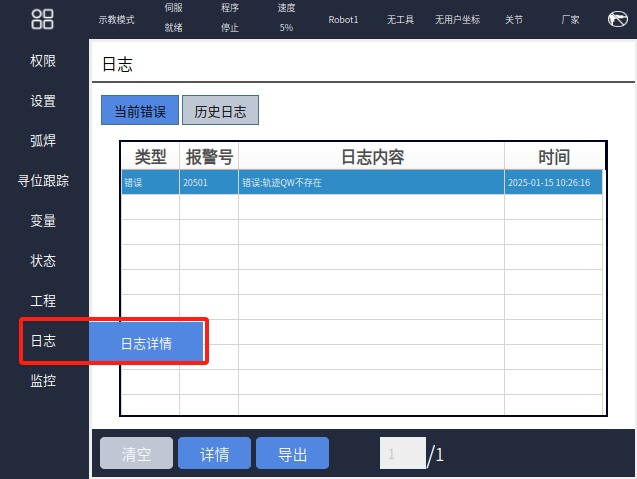
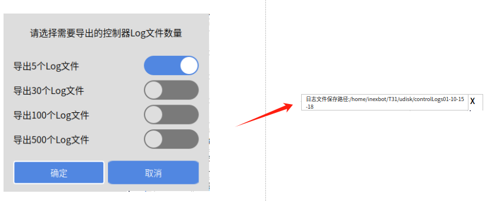

# 日志

主要用于查看各类信息详情以及导出日志，如下图所示：

{width="6.635416666666667in"
height="4.989583333333333in"}

【当前错误】：当前运行程序报错产生的

【历史日志】：保存产生的日志信息，最多500页

【时间】：作为删选使用，有"1日、3日、7日"，三种形态可选

{width="0.7708333333333334in"
height="0.8333333333333334in"}

【类型】：日志的类型，共有"全部、操作、消息、警告、错误"等五类可选

{width="0.78125in"
height="1.3125in"}

【清空】：点击之后会弹出提示框，当再次【确定】之后会清空所有日志信息

{width="3.4895833333333335in"
height="2.6770833333333335in"}

【详情】：选中一条日志，点击【详情】按钮，会显示该条日志的详细状态

{width="9.229166666666666in"
height="3.6145833333333335in"}

【导出】：用于导出日志（U盘已插好），弹出弹窗导出多少个日志，选择后点击【确定】，即可导入到U盘，并会弹出白色提示框，显示导出的日志的名称

{width="8.854166666666666in"
height="3.5625in"}

页码输入框：当有多页日志时，可以跳转到具体的日志页面
