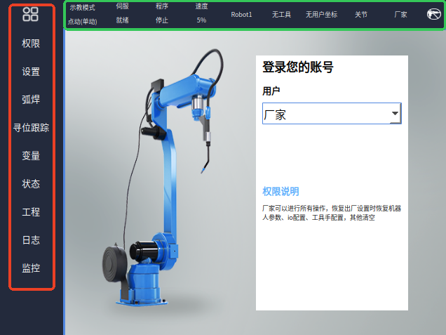
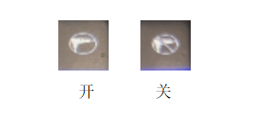

# 界面基础说明：

红色方框内可用手动方式点动，进行触屏操作，绿色方框内不可进行触屏操作

红色方框内:

1、红色方框第一个图标的功能是用于全屏展示，点击后如下图所示，再次点击可切换回非全屏

红色方框内其他功能请看其他说明文档

绿色方框内：

1、"示教模式"：示教器模式的一种，共有"示教模式、运行模式、远程模式"三种，可以通过旋钮切换

2、"伺服
停止"：机器人状态的一种，同有"停止、就绪、运行"三种模式，通过"伺服准备"按键可切换"就绪、停止"两种状态，通过上电使能按键可以进行"就绪、运行"状态的切换

3、"程序 停止\"：机器人运行时，会显示"运行"状态，非运行状态显示"停止"

4、"速度"：有两种显示方式，分别是"点动、定点距离"，速度的增、减可通过"高、低"两个按键调节（共有低速、低中速、中速、中高速、高速五个等级，每个等级的速度都可以自己调节，最低1%，最高100%)，'点动、定点距离'的显示方式如下图所示：

5、"Robot1\"：表示当前机器人，如果设置了多个机器人，可以通过"机器人切换"按键进行切换

6、"工具7"：表示当前在用工具手7，可用"工具坐标+右边转换"切换不同工具手，一共能切换10种，从工具手1至工具手9以及无工具手

7、"用户1"：表示当前是用户1在登陆使用

8、"关节"：表示当前坐标系是"关节坐标系"，共有"关节、直角、工具、用户"等四种坐标系，可通过"工具坐标"按键来切换不同的坐标系

9、"厂家"：表示当前用户在用厂家的身份进行操作，可以通过用户登陆不同身份来切换，共有"操作员、技术员、管理员、厂家"等四种身份

10、绿色方框从左至右最后一个图标代表焊接使能的开关，有两种不同的样式，如下图所示：

