# 晶圆工艺

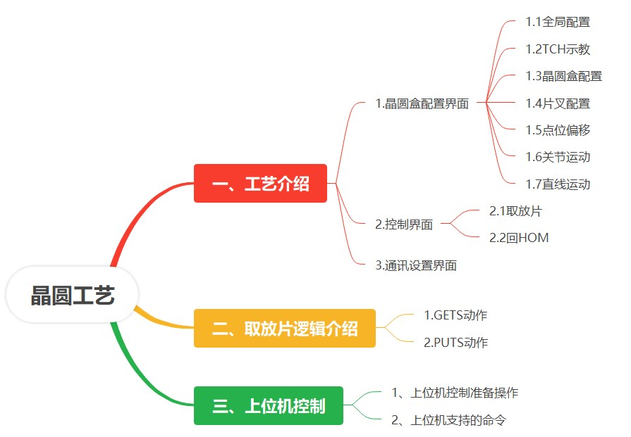 

## 一、工艺介绍

晶圆工艺的主要用于实现晶圆机器人在一些半导体处理设备中搬运传输晶圆片，其内容主要包含晶圆盒参数配置、操控动作机械手以及上位机控制通信设置三个模块。

在晶圆工艺下有三个界面，分别是晶圆盒配置界面、控制界面和通讯设置界面。如图所示：

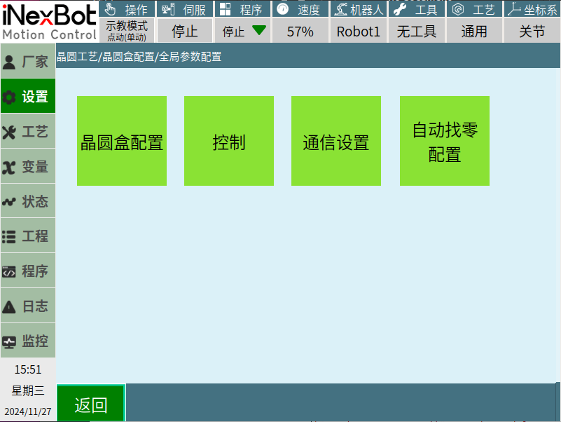 

1.  **晶圆盒配置**： 该模块主要配置晶圆盒（FOUP, Front Opening Unified
    Pod）的数量、类型、尺寸、容量以及位置相关的各种参数。此外，在晶圆盒中进行取放片操作的相关参数（比如运动轨迹、速度及信号检测）也在该模块中配置。

2.  **控制**： 控制模块主要用于操作动作机械手，手动调试晶圆工艺逻辑。

3.  **通讯设置**：该模块主要配置上位机控制机械手相关的通讯参数。

下面分别介绍三个界面及其相应功能：

### 1. **晶圆盒配置界面**

### 1.1全局配置界面

配置晶圆盒、片叉总数及片叉型号，设置HOM位置坐标。

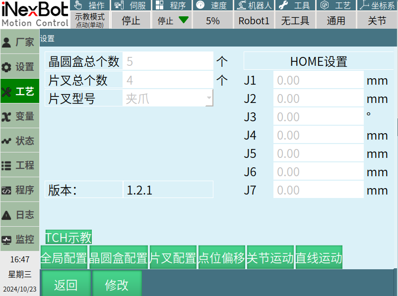 

**晶圆盒总个数**

- 范围：\[1, 99\]。现场默认数量：25个。

- 修改时的影响：当修改晶圆盒总数时，晶圆盒配置界面中的"当前工号"下拉框选项会相应增加或减少。新增加的晶圆盒将以box_xx 的形式命名。

**片叉总个数**

- 范围：\[1, 4\]。现场默认数量：一般为4个。

- 修改时的影响：当修改片叉总数时，片叉配置界面中的"当前片叉"下拉框选项也会相应增加或减少，且控制界面中可选的片叉数量也会变化。

**片叉型号**

- 选项：可以选择"夹爪"或"吸附"两种类型。

**HOM设置**

- 描述：HOM点是机器人的安全起始位置。

- 关节坐标范围：J1, J2, J4, J5, J6, J7 的范围为 \[-20000, 20000\] mm；J3
  的范围为 \[-500, 5000\] 度。

- 用途：机器人完成一个任务后，通常会回到HOM点准备下一个任务。

注：本文档中home、HOME等效于HOM

**1.2 TCH示教界面**

标记晶圆盒位置坐标。

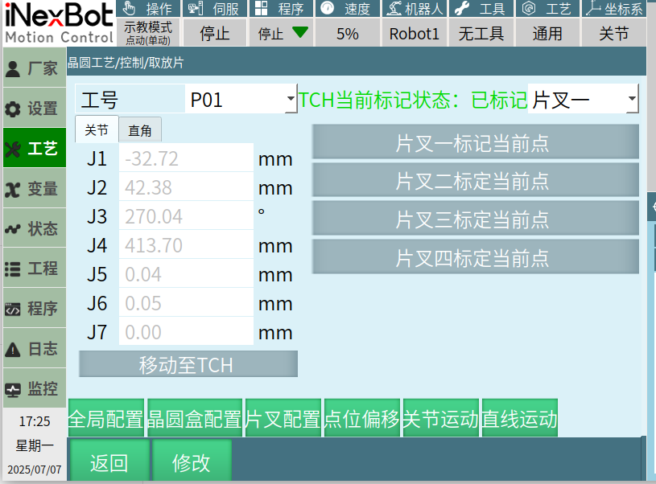 

**工号**

- 下拉框选项：可选择的晶圆盒个数与晶圆盒总数一致，名称也保持一致。

- 每个工号均保存该工号下的相对应TCH坐标参数。

**TCH当前标记状态**

- 状态：分为"未标记"和"已标记"两种。

- 操作：通过点击"修改"按钮，再点击"保存"或"标记当前点"按钮，可以将状态从"未标记"变为"已标记"。

**关节坐标**

- 范围：与HOM设置关节坐标范围相同。J1，J2， J4，J5， J6， J7 的范围为
  \[-20000, 20000\] mm；J3 的范围为 \[-20000, 20000\] °。

- 操作：可以手动填写或通过"标记当前点"按钮获取当前位置，

**直角坐标**

- 范围：X，Y， Z， H 的范围为 \[-20000, 20000\] mm；U 的范围为 \[-3.14,
  3.14\]rad。

- 操作：同样可以手动填写或通过"标记当前点"按钮获取当前位置。

**标记当前点**

- 操作：在某一工号下点击片叉1标记当前点，会将机器人的当前的机器坐标值写入入当前工号的片叉1并标记。

**移动至TCH**

- 操作：在伺服就绪状态下，上电后点击"移动至TCH"按钮，机器人会移动到之前标记的TCH点。

**1.3 晶圆盒配置界面**

> 配置晶圆盒类型、容量、互锁检测IO参数。

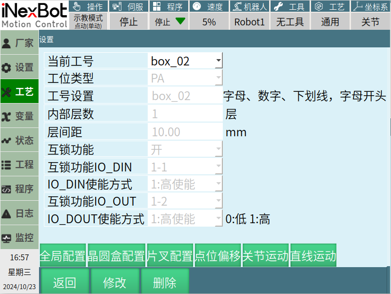 

1.  当前工号：可选择的工号数量与全局配置中设置的晶圆盒总个数一致，名称与设置的工号保持一致，默认的名称为box_xx 。

用户可以通过界面下方的删除按钮来移除不需要的工位。然而，在进行删除操作时，必须至少保留一个工位。当尝试删除最后一个工位时，系统将会报错，以防止无工位可用的情况发生。

2.  工号类型：可选PA（Process
    Application，处理应用）和Cassette（晶圆盒）两种类型。

3.  工号设置：在这里可以修改工号名称，工号名称必须以字母开头，工号名称只允许字母、数字、下划线这三种类型，默认以box_xx 的形式命名。且修改时应注意工位名称不可重复，修改后保存，当前工号名称随之改变。

4.  内部层数：范围是\[1，99\]层，初始状态默认为1层。

5.  层间距：范围是\[1,1000\]mm，初始状态默认为10mm。

6.  互锁功能：可以选择开启或关闭。当选择开启时，系统通过读取特定的输入/输出（IO）信号来判断工作台是否处于互锁状态。如果检测到互锁信号（即锁定状态），系统会触发报警并阻塞等待，直到互锁解除。当互锁信号消失（即未锁定状态），系统会输出互锁解除的信号，允许机器人继续执行任务。

7.  互锁功能IO_DIN：选择用于判断工作台是否处于互锁状态的输入（IO）信号。可选择IO输入信号从1-1到1-16，也可以选择无。

8.  IO_DIN使能方式：IO_DIN使能方式有两种，分别是1：高使能和0：低使能，例如选择1：高使能，则该DIN信号为1（高电平）的时候工作台互锁。

9.  互锁功能IO_OUT：可以选择来判断工作台是否处于互锁状态输出（IO）信号，可选择IO输入信号从1-1到1-16，也可以选择无。

10. IO_OUT使能方式：IO_OUT使能方式有两种，分别是1：高使能和0：低使能，例如选择1：高使能，则该DOUT信号为1（高电平）的时候工作台互锁。

**注意事项**：

- 确保工号名称唯一，便于识别和管理不同的晶圆盒。

- 设置合适的层数和层间距以适应不同类型的晶圆盒。

- 建议开启互锁功能可以增强系统的安全性，防止在不适当的情况下进行操作。

- 选择适当的IO信号和使能方式以确保互锁功能的正常工作。

**1.4 片叉配置界面**

> 配置多片叉上各种传感器参数。

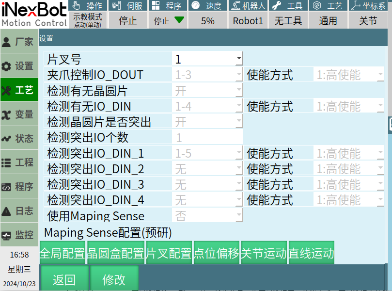 

1.  片叉号：与全局配置中设置的片叉总个数一致，默认名称为1，2，3，4。

2.  夹爪控制IO_DOUT：可以选择从1-1到1-16的IO输出信号，也可以选择无。使能方式：可以选择高使能（1）或低使能（0）。选择IO输出信号时，当夹爪检测到晶圆片存在时，系统将输出在此处选择的IO_DOUT信号。例如，如果选择了1-5作为IO_DOUT信号，那么每当夹爪中有晶圆片存在时，系统就会输出1-5信号，外部系统可以通过检测这个信号来了解夹爪的状态。

3.  检测有无晶圆片：可选择开启或者关闭，选择开启时，系统会检测夹爪中是否有晶圆片存在。

4.  检测有无IO_DIN：选择用于检测晶圆片是否存在（即晶圆是否位于夹爪中）的输入信号。可以选择从1-1到1-16的IO输入信号，也可以选择无。使能方式：可以选择高使能（1）或低使能（0）。

5.  检测晶圆片是否突出：可选择开启或者关闭，当开启时系统会检测晶圆片是否突出。

6.  检测突出IO个数：选择用于检测晶圆片是否突出（即晶圆是否正确放置于夹爪内）的输入信号个数。

7.  检测突出IO_DIN_1：第一个用于检测晶圆片是否突出的IO输入信号。可以选择从1-1到1-16的IO输入信号，也可以选择无。使能方式：可以选择高使能（1）或低使能（0）。

8.  检测突出IO_DIN_2：第二个用于检测晶圆片是否突出的IO输入信号。可以选择从1-1到1-16的IO输入信号，也可以选择无。使能方式：可以选择高使能（1）或低使能（0）。

9.  检测突出IO_DIN_3：第三个用于检测晶圆片是否突出的IO输入信号。可以选择从1-1到1-16的IO输入信号，也可以选择无。使能方式：可以选择高使能（1）或低使能（0）。

10. 检测突出IO_DIN_4：第四个用于检测晶圆片是否突出的IO输入信号。可以选择从1-1到1-16的IO输入信号，也可以选择无。使能方式：可以选择高使能（1）或低使能（0）。

11. 使用Maping
    Sense[（预研：该功能暂未实现）]{.mark}：可以选择是否开启，用于启用或禁用映射感应功能。当启用时，系统会根据预设的映射规则来判断晶圆的位置和状态，以便更精确地控制夹爪的动作，从而提高取放晶圆的精度和安全性。

**1.5 点位偏移界面**

> 配置从该晶圆盒中取放片的轨迹点偏移参数。

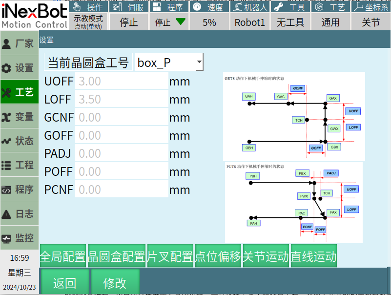 

- 当前晶圆盒工号：指当前正在操作的晶圆盒的编号或标识。用户可以通过界面上的下拉框来选择不同的晶圆盒工号。这个下拉框中列出了所有可用的晶圆盒编号，用户可以根据需要从中选择。一旦选择了某个晶圆盒工号，界面上显示的相关参数就会更新为所选晶圆盒的参数，所有的操作和设置都将针对当前选定的晶圆盒进行。

1.  UOFF (Upper
    Offset)：范围：\[0，15\]mm。从示教位置到到上路径的Z轴方向距离。

作用：上部偏移量，用于调整晶圆盒顶部相对于机器人的位置偏差。

2.  LOFF(Lower
    Offset)：范围：\[0，15\]mm。从示教位置到到下路径的Z轴方向距离。

作用：下部偏移量，用于调整晶圆盒底部相对于机器人的位置偏差。

3.  GCNF(Global Configuration
    Offset)：范围：\[0，15\]mm。从示教位置上升路径的工具坐标Y轴方向距离。

作用：全局配置偏移量，用于调整晶圆盒整体相对于机器人的位置偏差。

4.  GOFF(Global
    Offset)：范围：\[0，15\]mm。从示教位置到晶圆握持位置的工具坐标Y轴方向距离。

作用：全局偏移量，用于调整晶圆盒整体相对于机器人的位置偏差。

5.  PADJ (Position
    Adjustment)：范围：\[0，15\]mm。从示教位置到晶圆置持位置的工具坐标Y轴方向距离。

作用：位置调整，用于微调晶圆盒相对于机器人的位置。

6.  POFF(Position
    Offset)：范围：\[0，15\]mm。从晶圆放置位置到下路径下端位置的Y轴方向距离

作用：位置偏移量，用于调整晶圆盒相对于机器人的位置偏差。

7.  PCNF(Position
    Configuration)：范围：\[0，15\]mm。从晶圆放置位置到握持位置的工具坐标Y轴方向距离。

作用：位置配置，用于配置晶圆盒相对于机器人的位置参数。

这些偏移量以毫米（mm）为单位，初始值默认为3mm，它们可以正向或负向调整晶圆盒的位置，以确保机器人能够准确地取放晶圆。

且这些配置项参数可以手动调整，以确保晶圆盒的位置与机器人的取放动作相匹配。

GETS动作下各Location位置的机械手状态如下图所示：

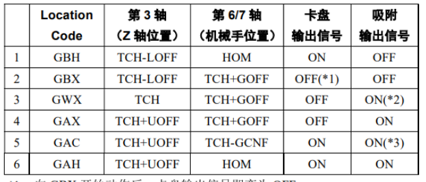 

GETS动作的参数如下图所示：

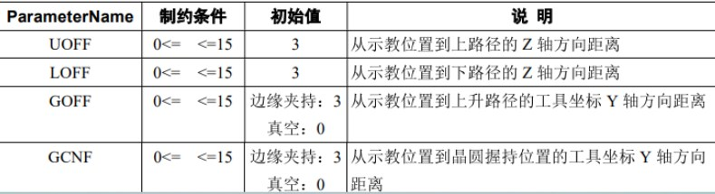 

PUTS动作下各Location位置的机械手状态如下图所示：

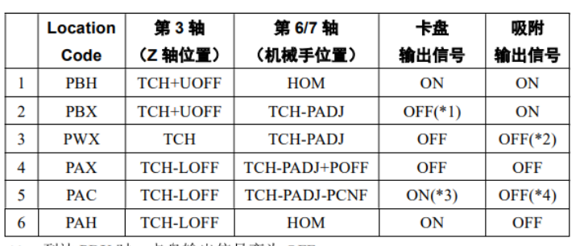 

PUTS动作的参数如下图所示：

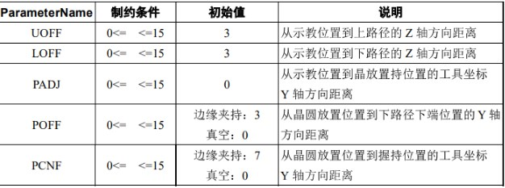 

**1.6 关节运动界面**

> 配置各种工况下每个关节的最大速度。

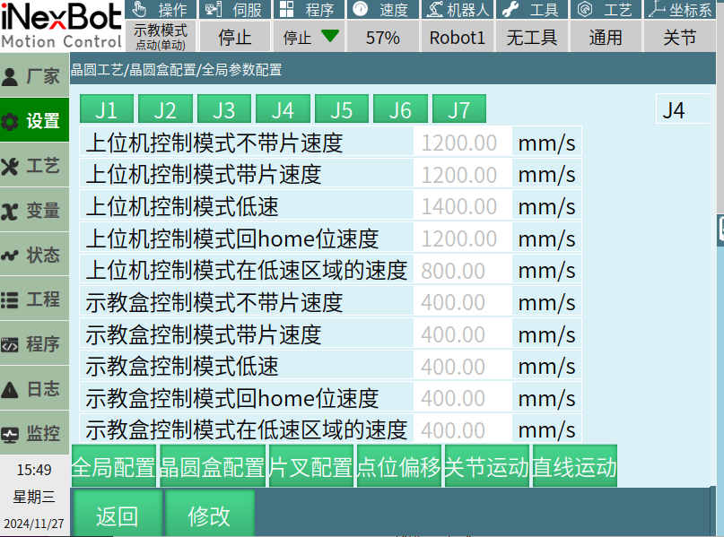 

在此界面J1-J7的7个按钮可以选择J1-J7不同关节，可以在此修改/保存各个关节的速度参数。包括：

上位机控制模式下的不带片速度、带片速度、低速、回HOM位速度和在低速区域的速度。

示教盒控制模式下的低速、带片速度、回HOM位速度和在低速区域的速度。

其中，关节J1，J2，J4，J5，J6，J7的速度范围是(0，1000\]mm/s，关节J3速度范围是（0，1000\]°/s。

**参数解释：**

- 【不带片速度】：机器人在不携带晶圆时的运动速度，适用于从工位运动到工位的过程。

- 【带片速度】：机器人携带晶圆时的运动速度，适用于从工位运动到工位的过程。

- 【低速】：拾取到晶圆后走到夹持位置的速度。

- 【回home位速度】：机器人各轴返回HOM位置时的运动速度。

- 【在低速区域的速度】：机器人取放片过程中生态或者下降的速度。

**1.7 直线运动界面（直线运动暂只有点动速度和寸动速度生效）**

> 配置直线运动中，各种工况下的最大末端线速度。

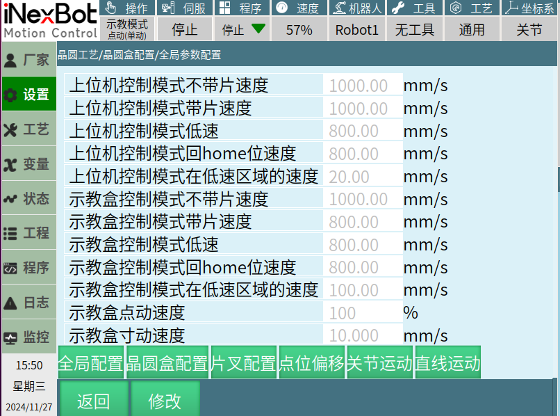 

在此界面可以修改/保存系统的直线运动的速度，包括：

上位机控制模式下的不带片速度、带片速度、低速、回HOM位速度和在低速区域的速度。

示教盒控制模式下的不带片速度、带片速度、低速、回HOM位速度、在低速区域的速度以及示教盒点动速度、寸动速度。

除示教盒点动速度范围是\[1,100\]%，示教盒寸动速
度范围为\[0.001，10\]mm/s，其余速度范围都是\[1，5000\]mm/s。

**参数解释：**

- 【不带片速度】：机器人在不携带晶圆时的运动速度，该速度主要适用于取放片时片叉伸出或缩回过程。

- 【带片速度】：机器人携带晶圆时的运动速度，该速度主要适用于取放片时片叉伸出或缩回过程。

- 【低速】：拾取到晶圆后走到夹持位置的速度。

- 【回home位速度】：机器人返回HOM位置时的运动速度，由于回HOM点使用关节运动，所以直线运动的回HOM位速度不生效。

- 【低速区域的速度】：当机器人在取放片过程中上抬或下降的速度。

- 【示教盒点动速度】：使用示教盒进行点动操作时的全局速度，限制示教盒点动最大全局速度百分比。

- 【示教盒寸动速度】：机器人进行寸动（微动）操作时的速度，限制示教盒寸动最大速度。

### 2.控制界面

**2.1 取放片界面**

> 操作机械手去选中的晶圆盒中取片/放片。

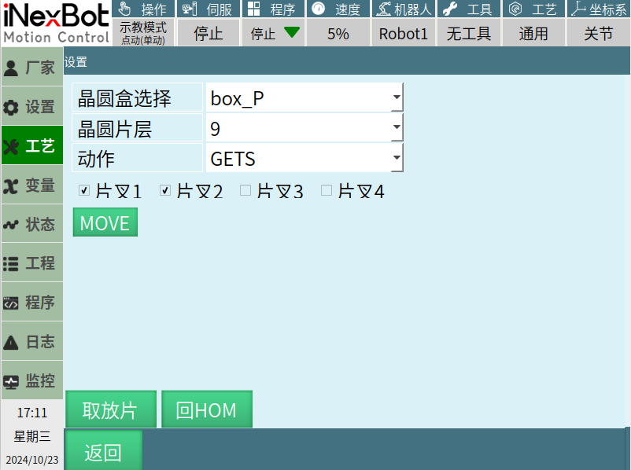 

**晶圆盒选择**

- 可选择的晶圆盒个数与晶圆盒配置界面的总个数保持一致，可以选择任一存在的晶圆盒工号，每个工号均保存该工号下的相对应TCH坐标参数和点位偏移参数。

**晶圆片层**

- 范围：每个工号下可选择的晶圆片层的值的范围与晶圆盒配置界面设置的内部层数保持一致。

- 示例：如果晶圆盒配置界面将工号box_03的内部层数设置为20，那么当晶圆盒片层界面的晶圆盒选择为box_03时，其晶圆片层可以选择1-20的任意一个数值。

**动作**

- 选项：有三种选项，分别是取片GETS、放片PUTS和移动MOVP。

1.取片GETS：从晶圆盒中取出一片晶圆。

2.放片PUTS：将一片晶圆放入晶圆盒。

3.MOVP：移动晶圆而不进行取放动作，这种动作通常用于晶圆在不同位置之间的简单移动。

例如从一个处理位置移动到另一个位置，而不需要实际取放晶圆。

当前动作为MOVP时，会有一个目标位选项可供选择，目标点位下拉框点位名称和动作匹配，包括：

> GETS：GBH。

> PUTS：PBH。

**片叉选择**

- 数量：可选择的片叉数量与晶圆盒配置界面的片叉总个数保持一致。

- 示例：如果晶圆盒配置界面设置了3个片叉，那么可以选择片叉1、片叉2或片叉3，片叉4不可被勾选。

**MOVE按钮**

- 操作：在伺服就绪的状态下，上电后点击MOVE按钮，机器会根据所选择的动作进行运动。

****使用流程****

1.  选择晶圆盒：在晶圆盒选择中选择一个晶圆盒工号。

2.  选择晶圆片层：根据所选晶圆盒的内部层数范围选择晶圆片层。

3.  选择动作：选择取片GETS、放片PUTS或MOVP动作。

4.  选择片叉：选择一个或几个片叉来进行取放动作。

5.  点击MOVE按钮：在伺服就绪的状态下上电，然后点击MOVE按钮，机器将根据所选动作执行相应的操作。

**2.2 回HOM界面**

操作机械手回HOM位置。

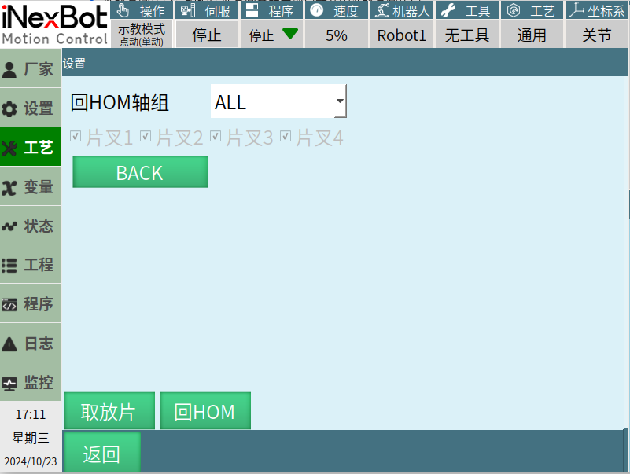 

**回HOM轴组**

- 选项：有ALL和片叉两种选项。

1.ALL：当选择ALL时，所有关节和片叉都默认被勾选，即整个机器人回到HOM位置。

2.片叉：选择片叉时，可以勾选的片叉数量与晶圆盒配置界面中设置的片叉总个数保持一致，即可以选择特定的片叉回到HOM位置。

**BACK按钮**

- 操作：在伺服就绪的状态下上电，之后点击BACK按钮，机器会执行对应的动作。

- 说明：BACK按钮的功能取决于当前选择的回HOM组选项。例如，如果选择了ALL，那么点击BACK按钮后，所有关节和片叉都会回到HOM位置；如果选择了片叉，那么只有被勾选的片叉才会回到HOM位置。

**使用流程**

1.  选择回HOM组：

选择ALL或片叉。如果选择片叉，可以根据需要勾选具体的片叉。

2.  点击BACK按钮：

在伺服就绪的状态下上电。点击BACK按钮，机器将执行相应的动作，即回到HOM位置。

### 3.通讯设置界面

配置上位机控制机械手相关的通讯参数。

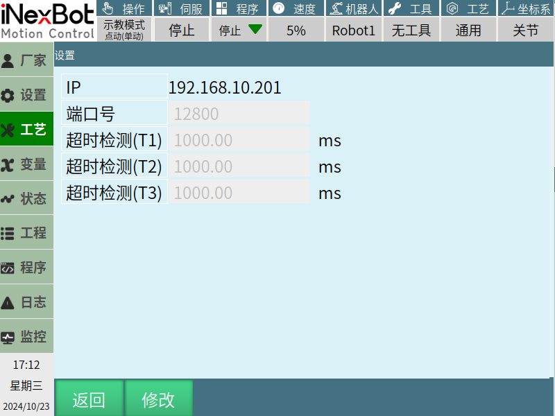 

**IP**

- 描述：此IP地址为当前控制器的对应IP地址。

- 操作：标识当前控制器在网络中的位置，通常情况下，控制器的IP地址是固定的，不可随意更改。

**端口号**

- 描述：用于定义控制器与外部系统或设备通信时使用的端口号，范围是\[1，65535\]。

- 操作：可以根据实际通讯需求进行修改调整。

**超时检测(T1)、(T2)、(T3)**

- 描述：这些参数用于定义在不同通信阶段的超时检测时间，范围是\[1，1000000\]，单位是ms。当控制器在特定时间内未收到响应时，将触发超时事件。

- 操作：可以根据实际通信需求调整这些时间值，以适应不同的网络环境或通信协议。

****使用场景****

- 端口号：通常用于与上位机或其他设备建立通信连接，例如通过TCP/IP协议进行数据交换。

- 超时检测：这些超时时间可以用来确保通信的稳定性和可靠性。例如，T1可以用于定义接收数据包的时间限制，T2可以用于定义发送指令后的响应时间，T3可以用于定义整个通信周期的最长等待时间。

****注意事项****

- 安全性：确保使用的端口号不会与其他服务冲突，并且遵循网络安全最佳实践。

- 兼容性：确保端口号和超时设置与外部系统或设备兼容。

- 性能：合理设置超时时间可以提高通信效率，避免不必要的等待。

### 4.自动找零配置界面

机器人零点是机器人坐标系的基准点，是机器人在运动过程中需要定位和记录的一个重要位置。机器人在使用过程中，由于环境因素（如温度、湿度、气压等）或外界干扰，可能会出现误差或偏移。通过调零操作，可以不需要更改已存入的工位TCH点坐标，只需要保证零点位IO传感器位置固定（核心原理是零点与设置的工位TCH点在空间上的偏移总是保持一致）就可以确保机器人点位的准确。

**4.1自动找零功能界面和逻辑介绍**

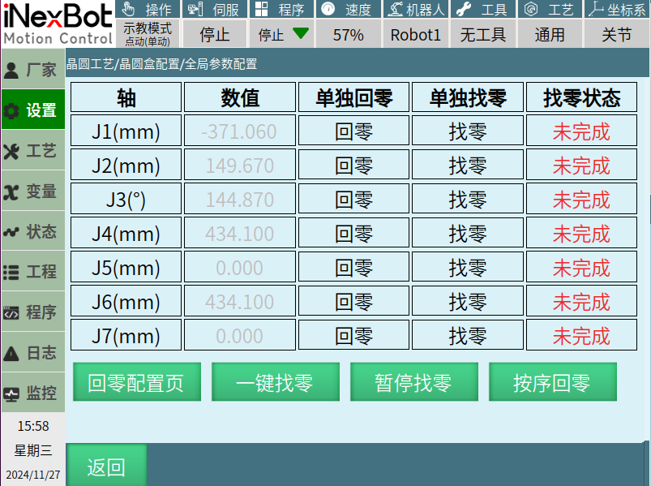 

【数值】：表示该轴当前的关节坐标，如果点了【找零】或者【一键找零】，该数值短时间内变为"0"（此时的"0"不代表任何意义），找零成功后会将当前点位标记为"0.000"。

【单独回零】：若想将某个轴回零点，需要先给机器人上电再点"回零"。

【单独找零】：若想某个轴单独找零，无需上电，只需要将伺服就绪，点击找零。

【找零状态】：如果该轴未找零或者找零失败，会显示未完成，找零成功会显示"找零完成"。

**找零逻辑：**

找零逻辑总结起来是两次回退，两次找零。

1：点击找零：该轴伺服模式会由CSP（周期同步位置模式）模式变为PV（轮廓速度模式）模式；

2：【第一次回退】：该轴向找零方向的反方向移动一段【回退距离】，【回退距离】见4.2；

3：【第一次找零】：第一次回退完成后立马会向找零方向移动，直至触碰到该轴找零IO信号；

4：【第二次回退】：第一次找零触碰IO信号后立马折返向找零方向反方向进行第二次回退，距离同样为【回退距离】；

5：【第二次找零】：第二次回退完成后再次折返向找零方向移动，直至触碰到IO信号将当前编码器位置标记为零点，该轴伺服模式会由PV模式回到CSP模式；

6：机器人立刻停止运动；

注意：找零功能需要伺服状态在"就绪"状态。

**4.2回零配置页**

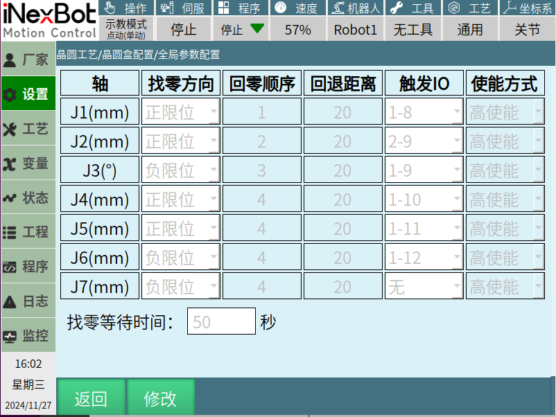 

【找零方向】：传感器放置在该轴的哪个方向，假设传感器方向是朝向该轴正方向，则找零方向填正限位，反之亦然。机器人各轴的正方向见设置-机器人参数-DH参数。

【回零顺序】：一键找零和按序回零时用。可以参考上图的顺序设置，机器人会按照所填顺序（可以理解为优先级）依次执行找零。若想让J4-J7同时开始找零则可以将这4个轴优先级设置为相同。

【回退距离】：某个轴执行找零时需执行一段回退距离（单位为mm或°），该回退方向是找零方向的反方向。

【触发IO】：该轴IO传感器接在IO的端口号。

【使能方式】：该轴IO传感器是高使能状态触发还是低使能状态触发。假如说将机器人J1向找零方向移动，触发传感器信号的瞬间该IO由0-1（低电平变为高电平），则说明使能方式是高使能，反之亦然。

【找零等待时间】：整个找零过程限制在该时间内，避免一次找零操作没有停止的状态。

注：为了避免机器人本体移动的时候片叉保持在HOM位，建议J1，J2，J3的优先级需要高于J4-J7。

**4.3一键找零、暂停找零和按序回零**

【一键找零】：和单轴找零同样的内核逻辑，但是一键找零使得一次性将7个轴放进找零队列，按照找零（回零）优先级依次找零，节省找零时间，提高找零效率。

【暂停找零】：在找零的过程中（找零或一键找零）如果发生紧急情况需要机器人立刻停止可以点击【暂停找零】，机器人会立刻结束找零任务，停止运动。

【按序回零】：需要给伺服上电才能回零，按需序回零可以按照各轴的优先级依次回到零点。

**4.4找零功能的注意点**

1：在找零任务开启后请将手放在急停按钮上，如果遇到紧急情况请按下急停按钮确保安全。

2：找零的预置速度是：第一次找零15mm/s，第二次找零5mm/s，回退速度10mm/s。如果速度太慢导致找零超时，请调整【找零等待时间】。

3：安全速度限制：找零速度不能超过伺服脉冲的70%，超出则按照70%来运动**。**

4：找零成功后，请用零点偏移功能在J3填写-305，点击J3的【设为零点】。这是由于3轴传感器的位置与模型图位置有-305°偏移，具体情况具体分析，确保3轴的片叉朝向与模型图一致（朝向X轴正方向）。

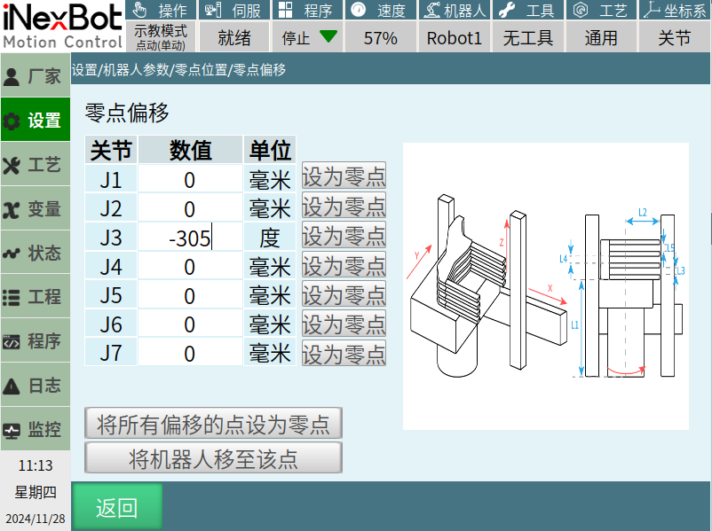 

## 二、取放片逻辑介绍

### 1.**GETS动作**

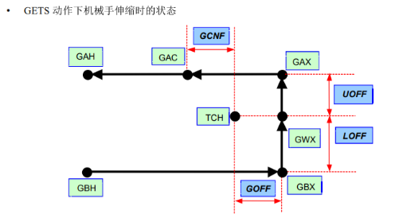 

**TCH**：示教位置。

**GBH**：晶圆拾取动作前的待机位置。

**GBX**：晶圆拾取动作前的伸出位置。

**GWX**：晶圆拾取高度的伸出位置。

**GAX**：晶圆拾取动作后的伸出位置。

**GAC**：晶圆握持位置。

**GAH**：晶圆拾取动作后的待机位置。

**取片逻辑：**

本节速度参考1.6、1.7

1.  **回到TCH点和HOM点**：

进行GETS操作后，J1、J2、J3以关节运动【不带片速度】回到工位的TCH点。J4、J5、J6、J7以关节运动【回home位速度】回到HOM点。

**目的**：确保机器人回到一个已知的安全位置开始取片操作。

2.  **移动到GBH点**：

以关节运动【不带片速度】移动到GBH点。

**目的**：准备进入取片流程。

3.  **判断片叉工具手上有片的IO**：

检测片叉工具手上是否有晶圆片。如果检测到有片，则报错停止。

**目的**：确保在取片之前工具手上没有晶圆片。

4.  **判断工作台互锁的IO**：

检测工作台是否处于互锁状态。如果锁定，则报错停止。如果没有锁定，则允许移动到GBX点。

**目的**：确保取片操作可以在安全的条件下进行。

5.  **移动到GBX点**：

先输出工作台互锁信号。

> 以直线运动【不带片速度】移动到GBX点（该点位仅伸出片叉）。

**目的**：将片叉伸展到适当的位置准备取片。

6.  **移动到GWX点**：

以直线运动【低速区域的速度】移动到GWX点（此处取片）。

**目的**：去GWX点取片。

7.  **检测片突IO**：

检测片突的时机为：片叉都在HOM位才检测片突，否则不检测。

**目的**：确保工位间移动的时候晶圆片正确地放置在片叉上。

8.  **移动到GAX点**：

以直线运动【低速区域的速度】移动到GAX点。

**目的**：将晶圆片携带上抬出卡槽。

9.  **移动到GAC-GAH点**：

以直线运动【带片速度】移动到GAC-GAH点。

**目的**：取出晶圆片。

10. **到达GAH点后的检查**：

到达GAH点后，检查工具手上是否还有晶圆片。如果没有片，则报错，取片失败。

**目的**：确认取片操作成功完成。

11. 解除该工作台的互锁输出：

**目的**：取片操作结束，该工作台允许其他机器进入。

### 2.**PUTS动作**

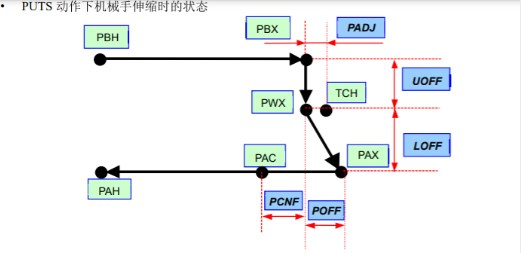 

**PBH**：晶圆放置动作前的待机位置。

**PBX**：晶圆放置动作前的伸出位置。

**PWX**：晶圆放置高度的伸出位置。

**PAX**：晶圆放置动作后的伸出位置。

**PAC**：晶圆握持位置。

**PAH**：晶圆放置动作后的待机位置**。**

**放片逻辑：**

本节速度参考1.6、1.7。

1.  **回到TCH点和HOM点**：

进行PUTS操作后，J1、J2、J3以关节运动【带片速度】回到工位的TCH点。J4、J5、J6、J7以关节运动【回home位速度】回到HOM点。

**目的**：确保机器人回到一个已知的安全位置开始放片操作。

2.  **移动到PBH点**：

以关节运动【带片速度】移动到PBH点。

**目的**：准备进入放片流程。

3.  **判断片叉工具手上有片的IO**：

检测片叉工具手上是否有晶圆片。如果检测到无片，则报错停止。

**目的**：确保在放片之前工具手上确实有晶圆片。

4.  **判断工作台互锁的IO**：

检测工作台是否处于互锁状态。如果锁定，则报错停止。如果没有锁定，则允许移动到PBX点。

**目的**：确保放片操作可以在安全的条件下进行。

5.  **检测片突IO**：

检测片突的时机为：片叉都在HOM位才检测片突，否则不检测。

**目的**：确保工位间移动的时候晶圆片正确地放置在片叉上。

6.  **移动到PBX点**：

以直线运动【低速区域的速度】移动到PBX点（只伸出片叉）。

**目的**：将片叉伸展到适当的位置准备放片。

7.  **移动到PWX点**：

以直线运动【低速区域的速度】移动到PWX点（此处放片）。

**目的**：在PWX点进行放片操作。

8.  **移动到PAX点**：

以直线运动【低速区域】的速度移动到PAX点。

**目的**：将晶圆片移动到下一个位置。

9.  **移动到PAC-PAH点**：

以直线运动【不带片速度】移动到PAC-PAH点。

**目的**：确保晶圆片已经安全放置，并移动到最终位置。

10. **到达PAH点后的检查**：

到达PAH点后，检查工具手上是否还有晶圆片。如果有片，则报错，放片失败。

**目的**：确认放片操作成功完成。

11. **解除该工作台的互锁输出**：

**目的**：放片操作结束，该工作台允许其他机器进入。

## 三、上位机控制

### 1.上位机控制的准备操作

**第一步：晶圆盒配置**

在示教器上的晶圆盒配置界面设置有关晶圆的参数。

1.  **晶圆盒参数**：设置晶圆盒的类型、尺寸等基本信息。

2.  **片叉参数**：配置片叉的位置、尺寸以及其他与晶圆抓取相关的参数。

3.  **点位偏移参数**：设置晶圆盒内不同位置的偏移量，确保机器人能够准确地定位到每个晶圆。

4.  **TCH点**：定义接触晶圆时的参考点，确保晶圆在处理过程中的稳定性。

5.  **HOM点**：设定机器人的初始位置或安全位置，用于启动或复位时返回。

6.  **关节运动和直线运动速度**：设置机器人各关节的移动速度以及直线运动的速度，保证操作既快速又平稳。

**第二步：示教器通讯设置**

在示教器的通讯设置界面设置通讯i相关参数。

1.  **控制器IP地址**：确认示教器上显示的是正确的控制器IP地址。

2.  **端口号**：设置端口号为12800（如果无法更改，则确保上位机软件与此端口匹配）。

3.  **超时检测时间**：根据实际通信需求设置超时时间，确保数据传输的可靠性。

**第三步：上位机软件设置**

1.  **安装软件**：确保已经安装了适用于控制晶圆处理机器人的上位机软件。

2.  **通信参数**：

    - **IP地址**：填写控制器的IP地址。

    - **端口号**：填写12800或其他与上位机相匹配的端口号。

    - **其他参数**：如果有必要，设置其他通信参数。

3.  **连接测试**：尝试与控制器建立连接，确保通信正常。

4.  **命令配置**：根据实际需要编写或调用相应的控制命令，比如移动到指定位置、读取状态等。

**第四步：通讯调试**

1.  **切换模式**：将示教器切换至"运行模式"。

2.  **上位机命令发送**：在上位机软件中输入相关命令进行通讯调试，可以编写一个简单的脚本来自动发送循环命令。

3.  **监控反馈**：观察控制器的响应情况，检查是否按预期工作。

### 2.上位机支持的命令

**2.1命令顺序**

**1.命令：一次信息**

- '\<'标志着信息流开始

- '\>'标志着信息流结束

- '，'标志着分隔符代码

- CRLF（回车＋换行）标志命令信息结束

**2.Ack：二次信息（检查命令语法后发送）**

- 机器人收到来自主机的命令后发送Ack，确认信息包含与命令相同的MesID。

- 如果机器人忙于执行上一个命令，将返回Busy错误。

- 如果校验和不正确，返回校验和错误。

- 如果命令语法不正确，返回非法命令或无效参数错误。

- 如果在命令中检测到意外的"LF"，则返回非法格式错误。

**注：Ack Code 命令一揽表**

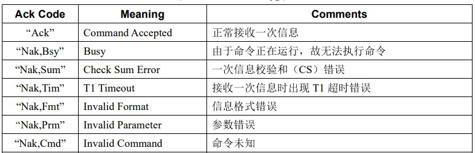 

**3.Response：完成信息（命令执行完成后发送）**

- 在命令结束后立即返回。

- 完成信息的MesID与运行命令的MesID相同：

- 如果命令成功执行，则在完成信息中返回\<MeslD,Success\>或\<MeslD,Success,ResultData\>

- 如果命令执行失败，则在完成信息中返回\<MeslD,Error,Error#,DeviceCode,ErrorMessage\>

**2.2命令语法**

**2.2.1 术语一览表**

| 参数名称     | 参数数据 | 说明 |
|--------------|----------|------|
| RobotCode    | R1       | 机器人1 |
| RobotCode    | R2       | 机器人2 |
| HandCode     | H1       | 工具手1 |
| HandCode     | H2       | 工具手2 |
| HandCode     | H3       | H1-F：采用16进制方式确定工具手（如 H3=0011 → 工具手1+工具手2） |
| JointCode    | J1       | 第一轴 |
| JointCode    | J2       | 第二轴 |
| JointCode    | ...      | ... |
| JointCode    | J7       | 第七轴 |
| ModeCode     | REAL     | 动作时确认晶圆有无（通常动作） |
| ModeCode     | SIMU     | 动作时不确定晶圆有无（测试动作） |
| SenseCode    | 0        | 无晶圆 |
| SenseCode    | 1        | 有晶圆 |
| SenseCode    | U        | 晶圆有无未知 |
| SenseCode    | E        | 错误状态 |
| Solt#        | 1        | Solt 1 |
| Solt#        | 2        | Solts 2 |
| Solt#        | N        | Solt N（N最大=50） |
| Station Code | P1       | 工号1 |
| Station Code | P2       | 工号2 |
| Station Code | Pn       | 工号N |
| StatusCode   | Rdy      | Ready（伺服开启）状态 |
| StatusCode   | Bsy      | Busy（机器人动作中）状态 |
| StatusCode   | Off      | 伺服断开状态 |
| StatusCode   | Err      | 错误状况 |
| StatusCode   | Tch      | 示教模式 |
| LocationCode | GBH...GAH| 拾取动作时的各动作位置 |
| LocationCode | PBH...PAH| 放置动作时的各动作位置 |
| ErrorCount   | 1~10     | 错误履历编号 |

**2.2.2命令格式(部分)**

**CSTA** ：报告复合状态

- 功能：报告当前的复合状态。

- 语法："CSTA, DeviceCode"

DeviceCode："R1"=机器人1;"

- Ack "Ack"

- Response "Success,CombinedAlignerResponse\"(机器人)

"Success,R1, StatusCode, H1, ChuckCode, SenseCode, H2.ChuckCode,
SenseCode"(如果机械手2不存在，则在"H2"之后没有数据。)

**GETS**：拾取晶圆

- 功能：从指定工位的指定插槽拾取晶圆。

- 语法："GETS, RobotCode, HandCode, StationCode, Slot#"Command

RobotCode："R1"= 机器人 1,"R2"=机器人 2

HandCode："H1"= 机械手1,"H2"= 机械手2

StationCode："P1"-"P25"= 工位1至 25

- Ack "Ack"

- Response

"Success"(正常结束)

"Success, CombinedRobotResponse"(CSTARESPONSE 为ON 时)

"Error"(错误)

**PUTS**：放置晶圆

- 功能：把晶圆放置到指定工位的指定插槽

- 语法："PUTS, RobotCode, HandCode, StationCode, Slot#"

<!-- -->

- Ack "Ack"

- Response

"Success"(正常结束)

"Success, CombinedRobotResponse"(CSTARESPONSE 为ON 时)

"Error(错误)

**HOMH**：将机械手轴和关节轴移动到原点位置

- 功能：将机械手轴和关节轴移动到原点位置。Z轴不移到的原点位置。

- 语法："HOMH, RobotCode"

<!-- -->

- Ack "Ack"

- Response

"Success'(正常结束)

"Success, CombinedRobotResponse"(CSTARESPONSE 为ON 时)

"Error"(错误)

**HOMA**：将所有轴移动到原点位置

- 功能：将所有轴移动到原点位置。

机器人：将机械手轴和关节轴移动到原点位置后，将轴移动到指定原点位置。

校准器：将旋转轴移动到 0\[degree\]位置。

- 语法："HOMA, DeviceCode"

DeviceCode ："R1"=机器人1，"R2"= 机器人 2"A1"= 校准器1

- Ack ："Ack"（确认）

- Response："Success"(正常结束)

"Success,CombinedRobotResponse" or

"Success, CombinedAlignerReponse"(CSTARESPONSE 为ON 时)

"Error,(错误)

**SENS**：报告品圆的有无

- 功能：报告指定装置上有无晶圆。

- 语法："SENS. RobotCode, HandCode"，"SENS,AlignerCode"(校准器时)

- Ack "Ack"

- Response："Success, SenseCode"

SenseCode："0"= 无晶圆，"1"= 有晶圆，"U"=
晶圆有无未知，"E"=错误状态(传感器异常等错误状态)

**STAT**：报告指定设备的状态功能：报告指定设备的状态。

- 语法："STAT, DeviceCode"

- Ack "Ack"

- Response： "Success, StatusCode"

StatusCode："Rdy"= Ready 状态"Bsy"=Busy(机器人动作中)状态，"Of'=
伺服断开状态，"Er"= 错误发生中，"Tch"=正在使用示教器进行操作

**SERV**：开启伺服

- 功能：开启指定设备的伺服。

- 语法："SERV, DeviceCode"

- Ack "Ack"

- Response ："Success'(正常结束)，"Error"(错误)

**STOP**：断开伺服功能：当指定设备正在动作时减速停止，并断开伺服。

- 语法："STOP, DeviceCode"

- Ack "Ack"

- Response"Success\*

**SSPD**：设定机器人的动作速度功能：设定机器人的动作速度。

- 语法："SSPD, DeviceCode, SpeedData"

SpeedData 单位：%、范围：1.00至100.00

- Ack "Ack"

- Response"Success"

**RSPD**：报告机器人的动作速度设定值功能：报告机器人的动作速度设定值。

- 语法："RSPD, DeviceCode'

- Ack "Ack"

- Response "Success, SpeedData"

SpeedData单位：%、范围：1.00至100.00

**TCHP**：示教位置

- 功能：在指定工位的插槽上进行位置示教。

将当前位置注册为指定工位和插槽的示教位置。

示教位置保存在控制器的存储器中。

- 语法："TCHP.RobotCode, HandCode, StationCode, Slot#'

- Ack "Ack"

- Response "Success"(正常结束)，"Error"(错误)

**SMOD**：设定模式

- 功能：设定晶圆有无确认模式。

- 语法："SMOD, ModeCode"

ModeCode："Rea!"= 执行晶圆有无确认。"Simu"=
不执行晶圆有无确认。"Simu"用于确认机器人的动作。

- Ack "Ack"

- Response："Success"(正常结束)，"Error"错误)

**RMOD：**报告模式设定功能：报告当前设定的品圆有无确认模式的状态。

- 语法："RMOD"

- Ack："Ack"

- Response"Success, ModeCode"

**MOVP**：移动到指定位置

- 功能：移动到指定位置。

- 语法："MOVP, RobotCode, HandCode, StationCode, Slot#, LocationCode"

<!-- -->

- Ack "Ack"

- Response "Success;\"(正常结束),
  "Success,CombinedRobotResponse"(CSTARESPONSE 为ON 时), "Error"(错误)

**MOVA**：移动到绝对位置

- 功能：将某个轴移动到绝对位置。

- 语法："MOVA, RobotCode, JointCode, JointData"

<!-- -->

- Ack "Ack"

- Response "Success;\"(正常结束),
  "Success,CombinedRobotResponse"(CSTARESPONSE 为ON 时), "Error"(错误)

**HOLD**：握持晶圆或打开吸附

- 功能：握持晶圆或打开吸附。

- 语法："HOLD, RobotCode, HandCode"

<!-- -->

- Ack "Ack"

- Response "Success\"(正常结束)

**RELS**：放开晶圆或关闭吸附

- 功能：放开晶圆或打开吸附。

- 语法："RELS, RobotCode, HandCode"

<!-- -->

- Ack "Ack"

- Response "Success\"(正常结束)

**RPOS**：报告当前坐标位置

- 功能：报告当前关节坐标位置。

- 语法："RPOS, RobotCode"

<!-- -->

- Ack "Ack"

- Response "Success,J1Data, J2Data, J3Data, J4Data, J5Data, J6Data,
  J7Data\"(正常结束)

**RMOD**：报告模式设定

- 功能：报告检查所有片叉的晶圆有无的使能状态是否打开。

- 语法："RMOD"

<!-- -->

- Ack "Ack"

- Response "Success, MoveCode\"(正常结束)

**RXYZ**：报告当前坐标位置

- 功能：报告当前直角坐标位置。

- 语法："RXYZ, RobotCode"

<!-- -->

- Ack "Ack"

- Response "Success,XData, YData, ZData, J4Data, J5Data, J6Data,
  J7Data\"(正常结束)

**STCH**：设置示教位置

- 功能：设置指定工位指定工具手的示教位置（关节）。

- 语法："STCH, RobotCode, HandCode, StationCode, J1Data, J2Data, J3Data,
  J4Data, J5Data, J6Data, J7Data "

<!-- -->

- Ack "Ack"

- Response "Success\"(正常结束) / \"Error"（错误）

**RTCH**：报告示教位置

- 功能：报告指定工位指定工具手的示教位置（关节）。

- 语法："RTCH, RobotCode, HandCode, StationCode"

<!-- -->

- Ack "Ack"

- Response "Success,J1Data, J2Data, J3Data, J4Data, J5Data, J6Data,
  J7Data\"(正常结束)

**CTCH**：清除示教位置

- 功能：清除指定工位指定工具手的示教位置。

- 语法："CTCH, RobotCode, HandCode, StationCode"

<!-- -->

- Ack "Ack"

- Response "Success\"(正常结束) / \"Error\"(错误)

**STXY**：设置示教位置

- 功能：设置指定工位指定工具手的示教位置。

- 语法："STXY, RobotCode, HandCode, StationCode, XData, YData, ZData,
  UData, HData"

<!-- -->

- Ack "Ack"

- Response "Success\"(正常结束)

**RTXY**：报告示教位置

- 功能：报告指定工位指定工具手的示教位置。

- 语法："RTXY, RobotCode, HandCode, StationCode"

<!-- -->

- Ack "Ack"

- Response "Success,XData, YData, ZData, UData, HData\"(正常结束)

**RNST**：报告最近工位

- 功能：报告指定工位指定工具手的示教位置。

- 语法："RNST, RobotCode, HandCode, StationCode"

<!-- -->

- Ack "Ack"

- Response "Success, StationCode, Slot#, ExtendCode\"(正常结束)

**CERR**：清除错误

- 功能：清除所有的错误

- 语法："CERR, RobotCode" 

- Ack    "Ack"

- Response
    "Success\"(正常结束)， "Error,\..."(清错后仍然有错，需要进一步检查)

### 3.支持的命令一览表

**3.1 运动类命令**

| 命令 | 含义 | 指令类型 | 特殊说明 |
|------|------|----------|----------|
| PUTS,R1,H2,P5,1 | 放片 | 运动 | R1：机器人1； H1-F：采用16进制方式确定工具手（如 H3=0011 → 工具手1+工具手2）； P5：晶圆盒工号名称； 1：内部层数 |
| GETS,R1,H1,P5,21 | 取片 | 运动 | 同上 |
| HOMA,R1 | 全回HOM位 | 运动 | 先回片叉J4567，再回本体J123；回HOM位后释放互锁信号、清除所有报错 |
| HOMH,R1 | 回HOM位除2轴（Z） | 运动 | 同上 |
| MOVP,R1,H1,P3,11,GBH | 移动到某点 | 运动 | 支持GBH、PBH；到达起始点后，取放片命令无需回HOM点，可直接继续执行 |
| MOVA,R1,J1,100 | 移动某个轴到 | 运动 | - |
| HOLD,R1,HD | 输出指定片叉夹持使能 | 运动 | - |
| RELS,R1,H4 | 输出指定片叉夹持不使能 | 运动 | - |

**3.2非运动类命令**

| 命令 | 含义 | 指令类型 | 特殊说明 |
|------|------|----------|----------|
| STAT,R1 | 报告设备状态 | 非运动 | - |
| SERV,R1 | 开启伺服 | 非运动 | - |
| CSTA,R1 | 查询状态 | 非运动 | 仅支持 R1 |
| SSPD,R1,50 | 设置速度 | 非运动 | 速度范围 1–100；运动过程中不可调速 |
| RSPD,R1 | 获取速度 | 非运动 | - |
| TCHP,R1,H1,P5,1 | 标记示教点 | 非运动 | 层数会补偿到高度；设置后需切换示教器查看 TCH 点 |
| RPOS,R1 | 查询当前关节位置 | 非运动 | - |
| SMOD,REAL | 设置模式 | 非运动 | 设置片叉晶圆检测开关；设置后需在示教器或配置文件中确认 |
| RMOD | 读取设置模式 | 非运动 | 全开返回 REAL，否则返回 SIMU |
| RXYZ,R1,H5 | 报告当前位置 XYZUH | 非运动 | - |
| RTXY,R1,P5 | 报告工位 TCH 点 XYZUH | 非运动 | - |
| STXY,R1,H1,P5,0,0,0,0,0 | 设置工位 TCH 点 XYZUH | 非运动 | 运动中返回 Error，不允许修改；需在示教器或配置文件中确认同步更新 |
| RTCH,R1,H1,P5 | 报告工位 TCH 点 J1–7 | 非运动 | - |
| STCH,R1,H1,P5,0,0,0,0,0,0,0 | 设置工位 TCH 点 J1–7 | 非运动 | 运动中返回 Error，不允许修改；需同步更新直角坐标 |
| CTCH,R1,H1,P5 | 清除工位 TCH 点 | 非运动 | - |
| RNST,R1,H1 | 报告最近工位 | 非运动 | - |
| SENS,R1,H1 | 查询片叉有无片状态 | 非运动 | - |
| STOP,R1 | 停止运动 | 非运动 | - |

## 附录一、系统操作与运行

### 1.T30示教器按键说明

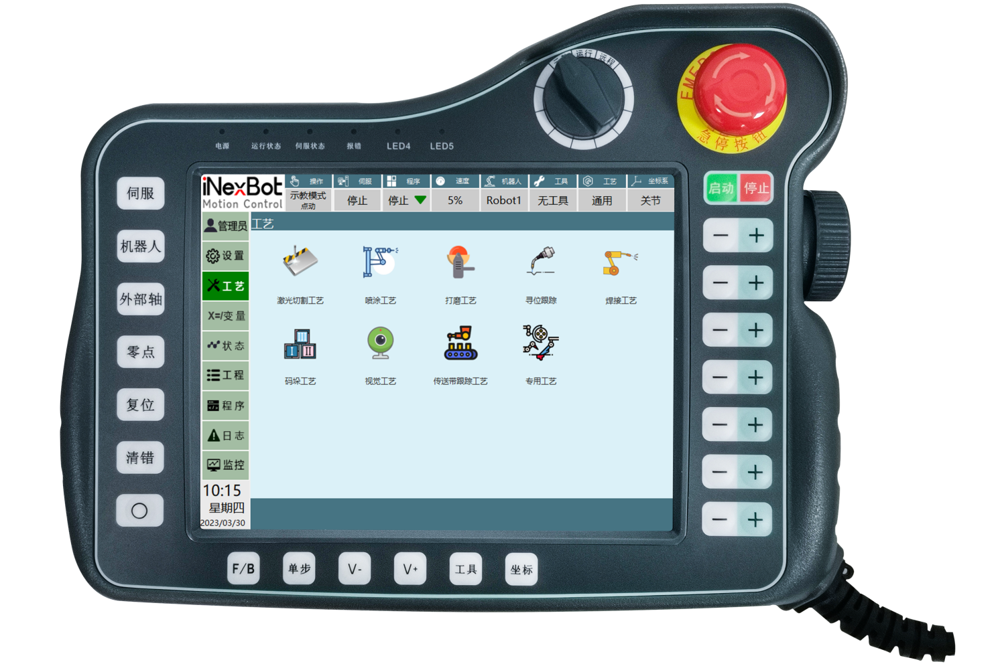 

| 图片 | 功能说明 |
|------|----------|
|   | 点击【伺服】，切换伺服状态（停止、就绪） |
|   | - |
| 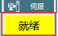  | - |
|   | 点击【机器人】，切换当前机器人（仅多机模式可用） |
|   | 点击【外部轴】，在连接外部轴时切换外部轴和机器人（仅在有外部轴时可用） 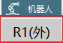  外部轴：选择外部轴可以点动当前连接的外部轴 机器人：选择机器人可以对当前机器人进行点动   |
|   | 点击【零点】，机器人回到零点位置 |
|   | 点击【复位】，机器人运行到记录的复位点位置 |
|   | 点击【清错】，机器人在出现错误提示时可清除错误提示 |
|   | 点击【⭕】，机器人进入拖拽模式，可拖拽机器人到目标点位 注意：机器人只有在辨识成功后才能拖拽 |
|   | 点击【F/B】，在单步运行程序时选择正序或倒序 正序运行：指令由上向下运行   倒序运行：指令由下向上运行   |
|   | 点击【单步】，在示教模式下运行程序 点击一次运行第一行，完成后点击继续运行下一行，依次执行直到作业文件结束 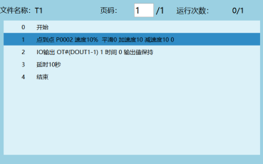  |
|   | 【V-】减小全局速度，每点击一次减小 5%   |

| {width="0.54375in"              | 【V+】增加全局速度，每点击一次全局速度增加5%                                                                                                                                   |
| height="0.5346872265966754in"}                                              |                                                                                                                                                                                |
|                                                                             |                                                                       |
| 图片 | 功能说明 |
|------|----------|
|   | 【工具】切换工具手 |
| 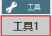  | - |
|   | 【坐标】切换坐标、点击坐标按钮可以依次切换关节坐标、直角坐标、工具坐标和用户坐标 |
|   | - |
|   | 【切换操作模式】旋钮在左边表示示教模式、中间表示运行模式、右边表示远程模式 |
|   | 【紧急停止按钮】程序运行时出现碰撞或飞车等情况按下急停按钮，机器人会停止运动 |
| {width="7.298993875765529e-2in" | 【启动】在运行模式下用来启动程序，点击【启动】程序开始运行                                                                                                                     |
| height="6.89359142607174e-2in"}                                             |                                                                                                                                                                                |
| 图片 | 功能说明 |
|------|----------|
|   | 【停止】在运行模式下用来暂停程序，点击【停止】正在运行的程序会暂停运行 |
|   | 【-】示教时对应轴负方向运行 |
|   | 【+】示教时对应轴正方向运行 |
|   | 程序界面旋转切换上一行、下一行 |
| 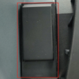  | 示教器握把后面的按钮，按到中间控制机器人（伺服）上电、按到底控制机器人（伺服）下电、松开按键控制机器人（伺服）下电 |

### 2.监控界面参数说明

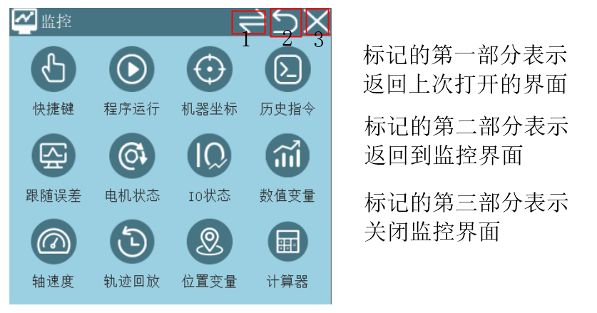 

【快捷键】

 

1.  【回零】按下上电使能，点击回零机器人会运行到零点位置。

零点位置说明：每个坐标系都有所有轴都为 0
的点，这叫做坐标系原点，对于关节坐标系来说，这个点叫做零点位置（机器人的第
1-7 轴的关节坐标均为 0 的位置）。

2.  【外部轴】可以用来切换当前机器人和外部轴。

3.  【回安全点】按下上电使能，点击回安全点机器人运行到设置的安全点位。

设置-复位点设置界面的点位就是设置的安全点。

4.  【示教方式点动（单动）】可以切换机器人点动模式和拖拽模式。

 

拖拽说明：辨识成功后选择拖拽方式后就可以切换到拖拽模式。

5.  【拔出示教器】拔出示教器后控制器与示教器连接断开。

6.  【关机/重启】点击后会出现以下提示窗口，用户可选择关机、重启、取消。选择关机则关闭控制器和示教器，选择重启则重启控制器和示教器，选择取消则关闭提示窗口。

 

7.  外部轴单动/联动：在监控中可以切换外部轴单动/联动模式，前提是需要标定好需要联动的外部轴。

联动：点动外部轴时，机器人可跟随相对运行，点动机器人时外部轴不动。

单动：点动机器人时外部轴保持不动；点动外部轴时机器人保持不动。

【机器坐标】

1.  监控机器人在运动时的关节坐标、直角坐标、工具坐标、用户坐标下的点位。

2.  检测量距：检测机器人从一个点运动到另一个点的距离。

【IO状态】

机器人在执行作业文件时如果设置了信号参数，可以在此界面监控数字信号和模拟信号。

如下图所示：

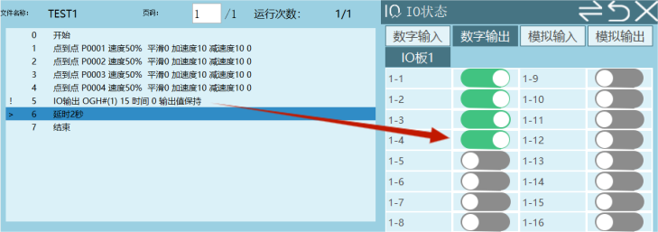 

【轴速度】

机器人在移动时根据设置的指令速度和全局速度参数，在监控-轴速度界面可以监控机器人运行时的当前速度和最大速度，如图：

 

 

### 3.状态栏介绍

 

### 4.操作模式

  ---------------- ------------------------------------------------------
      操作模式       示教器旋钮切换模式（示教模式、运行模式、远程模式）

  ---------------- ------------------------------------------------------

### 5.伺服状态

| 伺服状态 | 功能说明 |
|----------|----------|
| -        | 1. 停止、就绪：点击左侧伺服功能按键，可以切换伺服为停止或者就绪状态 |
| -        | 2. 运行： 示教模式下，按下"使能键"，伺服状态切换为"运行"状态 运行模式下，按下"启动"按钮，伺服状态切换为"运行"状态 |
| -        | 1. 警报：按下控制柜/示教器上的"急停按钮"，伺服状态切换为"警报"状态 |

### 6.速度状态

| 速度状态 | 内容 |
|----------|------|
| 速度状态 | 1. 点动  速度范围：[1%,100%]  按下示教器底部的【V+】，【V-】速度每次增加或者减小5%  点击下图所示的【+】，【-】速度每次增加或者减小1%  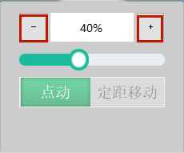 |
|          | 1. 定距移动：设定好速度和距离后点动机器人，机器人会运行设定的角度或距离后停止  注意：点动过程中停止，重新点动会重新运行设定距离，而不是运行之前剩余距离  定距移动中关节坐标下默认值为0.1°，直节坐标下默认值为0.1mm  点动切换到定距移动时，速度改为默认10%  例如：点动速度为50%，切换到定距移动，速度会改为10%  点动/定距移动仅示教模式下可切换，其他模式下置灰 |

### **7.系统运行**

【示教模式】

作用：1.点动机器人将其移动到想要去到的点位，例如Teaching点位的时候需要点动各轴移动到TCH点；

> 2.TCH标定完之后，可以降低速度执行GETS、PUTS、回HOM等指令，确认标定的TCH点是否能达到预期的轨迹，取放片轨迹是否安全，如果该轨迹安全，那么上位机执行这个工位取放片的轨迹也会是预期的、安全的。

操作：1：将操作模式旋钮旋至"示教"。

 

> 2：首先检查伺服【就绪状态】，需要切换伺服状态为"就绪"。

 

> 3：确认速度，建议先用5%速度，低速确认安全，慢慢调整合适速度。
>
> 4：按下上电按钮。

 

> 5：点按示教器右侧J1+-，J2+-\...\...（J1-J7对应着
> 1轴到7轴），以人站在机器人升降轴那一侧面对机器人，各轴对应关系如下：

  ---------- ---------- -------- -------- ---------- ---------- ---------- ----------
     轴号        J1        J2       J3        J4         J5         J6         J7

   代表的轴    行走轴    升降轴   旋转轴    片叉1      片叉2      片叉3      片叉4

    正方向      左手       上     逆时针   向前伸出   向前伸出   向前伸出   向前伸出
  ---------- ---------- -------- -------- ---------- ---------- ---------- ----------

【运行模式】

作用：切换模式使上位机控制器机器人。

点位示教好后，切换运行模式后，上位机方可向机器人发送指令。

## 附录二、Teaching步骤

### 1.设置工位数量

在全局配置界面设置【晶圆盒总个数】。

### 2.设置某个工位的配置信息

在【晶圆盒配置】界面，当前工号下拉框选中某个工位，可以设置该工位的工位名，内部层数、层间距和IO配置信息等，设置好之后点击保存。

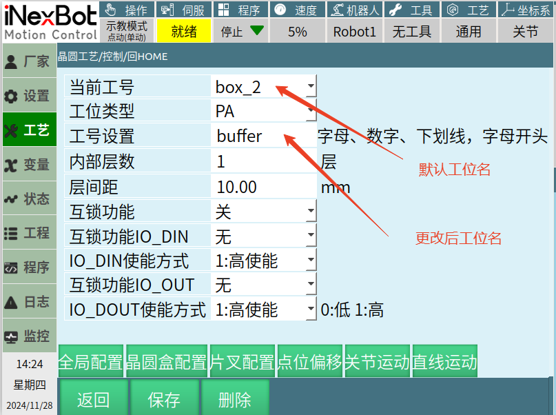 

### 3.进入TCH标定界面

进入TCH标定界面，选择刚才设置的这个工位。

初始时TCH当前标记状态是"未标记"。

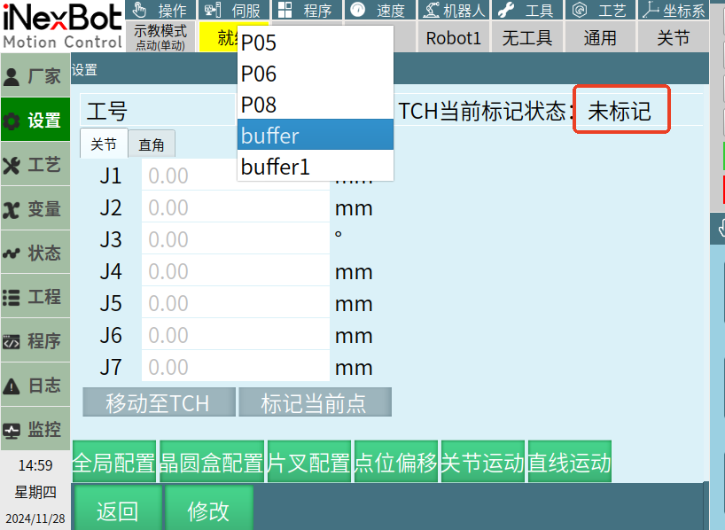 

4.示教模式下点动机器人各轴（操作步骤见附录一的第7节），注意请使用低速确认安全，如果需要微调时请使用寸动速度。

点动轴的顺序：

> 首先点动J1，J2，J3让机器人本体接近该晶圆盒；
>
> 点动J4（片叉1）稍微伸出，方便对准晶圆盒第一层，在此之中请将2轴（Z轴升降轴）高度调整到合适位置，一般是比晶圆盒第一层略低4mm左右，确保片叉能够安全伸出；
>
> 一边点动J4一边观察J1，J2的位置是否合理；
>
> 使用寸动速度微调点位直到片叉卡槽能恰好卡住晶圆的位置；
>
> 点动J2+，使晶圆片下表面恰好贴上片叉上表面；
>
> 点击修改\--【标记当前点】
>
> 使用5%点动速度，进入控制\-\--取放片界面使用第一层，片叉1进行多次取放片确认该TCH位置准确。
>
> 使用5%点动速度，进入控制\-\--取放片界面使用任意层，任意片叉进行多次取放片确认该TCH位置准确。

5.TCH位置理想位置如下：

如图，黄线是片叉，虚线是晶圆盒第一层，可以看到J4（片叉1）下表面应该刚好接触晶圆片下表面。

 

## 附录三、点到点运动安全避障

机器人在进行任何一个点到点运动的时候，都会优先将片叉收回HOM点，再移动机器人本体（J1、J2、J3）。例如回HOM点、回零点、移动到TCH点、MOVP。

## 附录四、上位机紧急停止安全避障

机器人在执行取放片任务时，如果发生紧急情况需要暂停或停止，使用HOMA或者HOMH命令能将片叉收回到安全位置，但是如果机器停止在取放片的升降位置，直接使片叉回HOM，由于高度不够可能会将晶圆片撞坏，为此我们有如下避障方案：

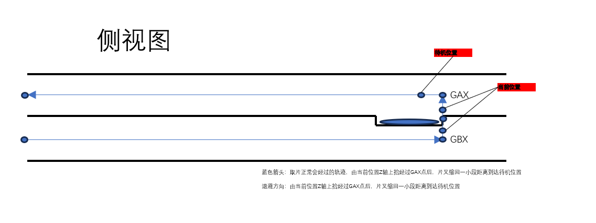 

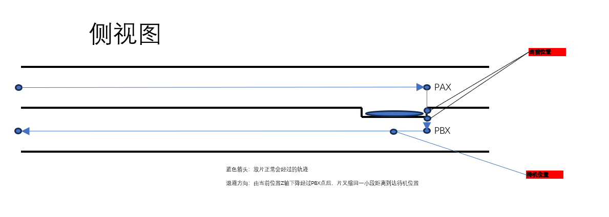 

## 附录五、取放片层高避障

如图，若某个工位最高层为5层，那么使用1、2片叉去第四层时能正常取放片，但是使用1、2片叉同时去第五层就会超过最大层高，系统会自动计算并报错停止。

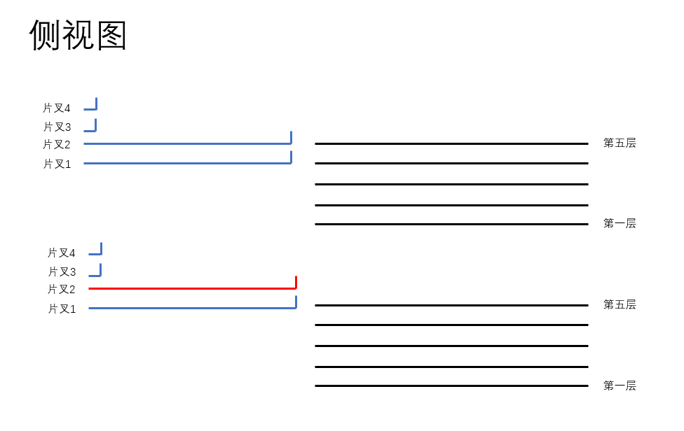 

## 附录六、上位机错误码一览表

| errorCode | Message | NoteText | Trigger Condition | Use |
|----------|--------|----------|-------------------|-----|
| 1001 | Stop Robot run failed, push quick stop button! | 停止机器人运动失败，拍下急停 | - | √ |
| 1002 | Turn TEACH/RUN/REMOTE switch on the operation panel to RUN. | 需要切换到运行模式 | 非运行模式发送命令时 | √ |
| 2001 | The Last act command is running, please waiting. | 等待上条运动命令运行结束 | 第一条运动命令执行时，再发一条 | √ |
| 2002 | This command's checked sum is error, please check it. | 命令校验和错误 | - | √ |
| 2003 | This command's parameter is error, please check it. | 命令参数错误 | - | √ |
| 2004 | This command is not exist, please check it. | 命令不存在 | - | √ |
| 2005 | This command's format is error, please check it. | 命令格式错误 | - | √ |
| 2006 | Teachbox has uncleaned error, please check teachbox. | 示教器有错误未清除 | 运行模式有错误没清除 | √ |
| 2007 | Go HOM operation exist error, but cleaned already. Please check it. | 回HOM操作清错后仍然有错 | 理论清一次即可 | √ |
| 3001 | At absence check, unexpected wafer is detected. Check Hand_1 and sensor. | 片叉1不应该有晶圆片 | 取片：手上应无片 放片：手上应有片 | √ |
| 3002 | At absence check, expected wafer is not detected. Check Hand_1 and sensor. | 片叉1应该有晶圆片 | 同上 | √ |
| 3003 | At absence check, unexpected wafer is detected. Check Hand_2 and sensor. | 片叉2不应该有晶圆片 | 同上 | √ |
| 3004 | At absence check, expected wafer is not detected. Check Hand_2 and sensor. | 片叉2应该有晶圆片 | 同上 | √ |
| 3005 | At absence check, unexpected wafer is detected. Check Hand_3 and sensor. | 片叉3不应该有晶圆片 | 同上 | √ |
| 3006 | At absence check, expected wafer is not detected. Check Hand_3 and sensor. | 片叉3应该有晶圆片 | 同上 | √ |
| 3007 | At absence check, unexpected wafer is detected. Check Hand_4 and sensor. | 片叉4不应该有晶圆片 | 同上 | √ |
| 3008 | At absence check, expected wafer is not detected. Check Hand_4 and sensor. | 片叉4应该有晶圆片 | 同上 | √ |
| 3009 | Destination Location Code [%s] set by [MOVP] command is not permitted from current location. | MOVP目标点位不可达 | 根据MOVP命令触发 | × |
| 3010 | The destination position is out of range by [MOVA] command. | MOVA目标点超限 | MOVA轴超限 | √ |
| 3011 | The destination position is out of range by [MOVR] command. | MOVR目标点超限 | MOVR轴超限 | × |
| 3012 | Station's TCH position is not taught. Teach the position. | 工位TCH点未示教 | 未示教 | √ |
| 3013 | Robot is running act command, do not modify correlation parameter. | 机器人运动中不能改参数 | 运动中修改参数 | √ |
| 3014 | Station interlock abnormal status. Check station interlock. | 工位互锁异常 | 取片时上锁 | √ |
| 3015 | Teach position Error. Current or specified position is out of AREA. | TCH点超限 | - | × |
| 3016 | The wafer.json not exist or create failed. | 配置文件不存在或创建失败 | 写参数时触发 | √ |
| 3017 | Some position calculate forward solution failed. Check it. | 正解失败 | 点位转换失败 | √ |
| 3018 | Some position calculate inverse solution failed. Check it. | 逆解失败 | 点位转换失败 | √ |
| 3019 | The original position beyond axis limit. Please check TeachBox. | 起始点超限 | 运动前检测 | √ |
| 4001 | Moving to HOM position unexpected stop by [GETS] command. | 取片HOM异常停止 | 急停/超限 | √ |
| 4002 | Moving to Ready position unexpected stop by [GETS] command. | 取片Ready异常停止 | 急停/超限 | √ |
| 4003 | Moving to other position unexpected stop by [GETS] command. | 取片流程异常停止 | 急停/超限 | √ |
| 4004 | Moving to HOM position unexpected stop by [PUTS] command. | 放片HOM异常停止 | 急停/超限 | √ |
| 4005 | Moving to Ready position unexpected stop by [PUTS] command. | 放片Ready异常停止 | 急停/超限 | √ |
| 4006 | Moving to other position unexpected stop by [PUTS] command. | 放片流程异常停止 | 急停/超限 | √ |
| 4007 | Moving to position unexpected stop by [MOVP] command. | MOVP未到位 | 急停/超限 | √ |
| 4008 | Moving to position unexpected stop by [MOVA] command. | MOVA未到位 | 急停/超限 | √ |
| 4009 | Moving to position unexpected stop by [HOMA] command. | HOMA未到位 | 急停/超限 | √ |
| 4010 | Moving to position unexpected stop by [HOMH] command. | HOMH未到位 | 急停/超限 | √ |
| 4011 | Teach position Error. Current or specified position is out of AREA. | 示教点超限 | 示教命令触发 | √ |
| 4012 | Serial id beyond max records by [QERR] command. | QERR序列号超限 | - | √ |
| 4013 | Pause running command failed. Please check it. | 暂停失败 | 内部错误 | √ |
| 4014 | Restart running command failed. Please check it. | 重启失败 | 内部错误 | √ |
| 4015 | Exist error after clearing command. Please check teach box. | 清错后仍有错误 | CERR触发 | √ |
| 7100 | GBX position is not created because of calculation error. | GBX计算错误 | - | × |
| 7101 | GBX position is not created because of limit error. | GBX超限 | - | × |
| 7102 | GAC position is not created because of calculation error. | GAC计算错误 | - | × |
| 7103 | GAC position is not created because of limit error. | GAC超限 | - | × |
| 7104 | PBX position is not created because of calculation error. | PBX计算错误 | - | × |
| 7105 | PBX position is not created because of limit error. | PBX超限 | - | × |
| 7106 | PAX position is not created because of calculation error. | PAX计算错误 | - | × |
| 7107 | PAX position is not created because of limit error. | PAX超限 | - | × |
| 7108 | PAC position is not created because of calculation error. | PAC计算错误 | - | × |
| 7109 | PAC position is not created because of limit error. | PAC超限 | - | × |

## 附录七、工艺配置文件参数一览表

| 模块 | 参数名称 | 含义 |
|------|----------|------|
| TCP通讯参数 | chars_time_out | 超时检测 |
| TCP通讯参数 | Tcp_Comm_Params.port | - |
| TCP通讯参数 | Tcp_Comm_Params.protocol_time_out | 无效参数 |
| TCP通讯参数 | Tcp_Comm_Params.response_time_out | 无效参数 |
| 控制器ID | controllerID | 控制器ID |
| IO片突误差 | epsilon | 片突检测阈值（±0.3mm） |
| 正夹/反夹 | grip_type | 0：正夹，1：反夹 |
| 工具手配置 | hand_config.check_is_exist_wafer_enable | 检测有无晶圆片使能 |
| 工具手配置 | hand_config.check_wafer_exist_din | 晶圆检测输入IO（如1→1-1，17→2-1） |
| 工具手配置 | hand_config.check_wafer_exist_din_2 | - |
| 工具手配置 | hand_config.check_wafer_exist_din_trigger_type | 0低有效，1高有效 |
| 工具手配置 | hand_config.check_wafer_exist_din_trigger_type_2 | - |
| 工具手配置 | hand_config.check_wafer_protrusion_din | 片突检测DIN |
| 工具手配置 | hand_config.check_wafer_protrusion_din_type | 0低有效，1高有效 |
| 工具手配置 | hand_config.check_wafer_protrusion_enable | 片突检测使能 |
| 工具手配置 | hand_config.hand_control_dout | 夹爪输出IO |
| 工具手配置 | hand_config.hand_control_dout_trigger_type | 0低闭合，1高闭合 |
| 工具手配置 | hand_config.mapping_sensor_config | mapping_sensor配置 |
| 工具手配置 | hand_config.using_mapping_sensor | 是否使用mapping |
| 工具手总数 | hand_sum | 工具手数量 |
| 工具手类型 | hand_type | 0夹爪，1吸附 |
| HOM点坐标 | home_position | HOM关节坐标 |
| 当前片叉号 | inquireHand | 0无，1~4对应片叉 |
| 关节速度参数 | joint_speed_params.go_home_speed_for_host | 上位机回零速度 |
| 关节速度参数 | joint_speed_params.go_home_speed_for_teach | 示教器回零速度 |
| 关节速度参数 | joint_speed_params.low_speed_for_host | 上位机低速 |
| 关节速度参数 | joint_speed_params.low_speed_for_teach | 示教器低速 |
| 关节速度参数 | joint_speed_params.speed_for_host_with_wafer | 带片速度 |
| 关节速度参数 | joint_speed_params.speed_for_host_without_wafer | 不带片速度 |
| 关节速度参数 | joint_speed_params.speed_for_teach_with_wafer | 示教带片 |
| 关节速度参数 | joint_speed_params.speed_for_teach_without_wafer | 示教不带片 |
| 关节速度参数 | joint_speed_params.speed_in_low_area_for_teach | 示教低速区 |
| 关节速度参数 | joint_speed_params.speed_of_low_area_for_host | 上位机低速区 |
| 直线速度参数 | line_speed_params.go_home_speed_for_host | 上位机回零 |
| 直线速度参数 | line_speed_params.go_home_speed_for_teach | 示教回零 |
| 直线速度参数 | line_speed_params.inch_speed_for_teach | 寸动速度 |
| 直线速度参数 | line_speed_params.jog_speed_for_teach | 全局速度上限 |
| 直线速度参数 | line_speed_params.low_speed_for_host | 上位机低速 |
| 直线速度参数 | line_speed_params.low_speed_for_teach | 示教低速 |
| 直线速度参数 | line_speed_params.speed_for_host_with_wafer | 带片 |
| 直线速度参数 | line_speed_params.speed_for_host_without_wafer | 不带片 |
| 直线速度参数 | line_speed_params.speed_for_teach_with_wafer | 示教带片 |
| 直线速度参数 | line_speed_params.speed_for_teach_without_wafer | 示教不带片 |
| 直线速度参数 | line_speed_params.speed_in_low_area_for_teach | 示教低速区 |
| 直线速度参数 | line_speed_params.speed_of_low_area_for_host | 上位机低速区 |
| 找零速度 | pv_speed.first_search_speed | 第一次找零 |
| 找零速度 | pv_speed.return_speed | 回退速度 |
| 找零速度 | pv_speed.second_search_speed | 第二次找零 |
| 找零速度 | pv_speed.wait_time_s | 超时（≤50s） |
| 找零参数 | search_zero_params.go_zero_order | 找零顺序 |
| 找零参数 | search_zero_params.io_trigger_type | 0低，1高 |
| 找零参数 | search_zero_params.return_distance | 回退距离 |
| 找零参数 | search_zero_params.search_direction | 0负方向，1正方向 |
| 找零参数 | search_zero_params.trigger_din | IO编号 |
| 工位配置 | station_config.Mcs_position | 直角坐标 |
| 工位配置 | station_config.Tch_is_calibration | 是否标定 |
| 工位配置 | station_config.joint_position | 关节坐标 |
| 工位配置 | station_config.inner_layers | 层数 |
| 工位配置 | station_config.interlock_din | 互锁DIN |
| 工位配置 | station_config.interlock_din_type | 0低，1高 |
| 工位配置 | station_config.interlock_dout | 互锁DOUT |
| 工位配置 | station_config.interlock_dout_type | 0低，1高 |
| 工位配置 | station_config.interlock_enable | 互锁使能 |
| 工位配置 | station_config.inverse_grip_gets_offset_group | 反夹取片偏移 |
| 工位配置 | station_config.inverse_grip_puts_offset_group | 反夹放片偏移 |
| 工位配置 | station_config.layers_pinch | 层高 |
| 工位配置 | station_config.offset_group | 正夹偏移 |
| 工位配置 | station_config.station_type | 工位类型 |
| 工位总数 | station_sum | 工位数量 |
| 配置版本 | version | 配置版本号 |

## 晶圆工艺 Q&A

### Q1：晶圆工艺系统主要包含哪些模块？
**A：**
主要包含三大模块：
- 晶圆盒配置（参数与工位定义）
- 控制模块（机械手操作与调试）
- 通讯设置（上位机通信参数）

---

### Q2：HOM点的作用是什么？为什么重要？
**A：**
HOM点是机器人安全起始位置：
- 所有任务通常从HOM开始或结束
- 用于保证运动起点一致性
- 异常恢复的重要基准点  
👉 本质：系统状态归一化点

---

### Q3：TCH点和HOM点有什么区别？
**A：**
- HOM点：全局安全点（初始化/复位）
- TCH点：每个工位的示教位置（作业参考点）  

👉 理解：HOM = 起点，TCH = 工位定位点

---

### Q4：GETS取片前必须满足哪些条件？
**A：**
- 片叉上不能有片  
- 工位未互锁  
- 片突检测正常（条件满足时）  
- 已处于TCH/HOM安全状态  

👉 不满足将直接报错停止

---

### Q5：PUTS放片前必须满足哪些条件？
**A：**
- 片叉上必须有片  
- 工位未互锁  
- 片突检测正常  

👉 与GETS形成对称逻辑

---

### Q6：互锁（Interlock）的作用是什么？
**A：**
- 判断工位是否允许操作  
- 锁定 → 禁止运动  
- 解锁 → 允许执行  

👉 本质：设备安全保护机制

---

### Q7：GETS/PUTS流程中的关键路径点有哪些？
**A：**

**GETS（取片）：**
TCH → GBH → GBX → GWX → GAX → GAC → GAH  

**PUTS（放片）：**
TCH → PBH → PBX → PWX → PAX → PAC → PAH  

👉 规律：
- H：待机点  
- X：伸出点  
- W：工作点  
- A：动作后点  

---

### Q8：为什么要做自动找零？核心原理是什么？
**A：**
原因：
- 运行中存在误差漂移  

原理：
- 零点传感器固定  
- TCH点相对零点偏移恒定  
- 通过找零恢复坐标  

👉 本质：坐标系重标定

---

### Q9：自动找零的核心流程是什么？
**A：**
标准流程：
1. 第一次回退  
2. 第一次找零  
3. 第二次回退  
4. 第二次找零  

👉 即：两次回退 + 两次确认，提高精度

---

### Q10：上位机控制机器人前需要做哪些准备？
**A：**
1. 配置晶圆盒、TCH、速度等参数  
2. 设置通讯参数（IP / 端口 / 超时）  
3. 上位机软件配置一致  
4. 通讯调试验证  

👉 常见问题：通信失败 / Busy / 校验错误