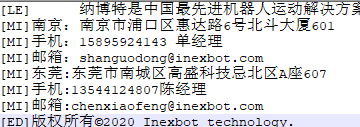

## 📋 元数据 (Metadata)

- **文档标题**: 示教器换图
- **所属公司**: 纳博特南京科技有限公司 (iNexBot Nanjing Technology Co., Ltd.)
- **核心主题**: 示教器内所有图片换图指南
- **关键标签**: #T30 #示教器 #图片 
- **适用场景**: 机器人现场应用、示教器图片更换

---

## 免责声明

本版权与免责声明系为保护本手册及所述产品的正常生产与流通、规避意外风险，初衷是为广大使用者提供更加稳定的产品和服务。因此，请在正式接受本产品前仔细阅读本声明。

本手册所述产品及本手册内容未经许可不得引用、复制，因违法使用所造成的不良后果本公司不承担任何责任，并保留相关的法律权利以及追责权力。

本手册所述产品及本手册内容在后续可能会有更新，如果未来出现了更新，本公司将事先进行公告。若因非本公司控制范围内的因素或其它不可抗力而导致的产品无法使用，无法使用期间造成的一切不便与损失，本公司不负任何责任。

除本手册中有明确对于细节、工具与工艺的明确陈述外，本手册中的任何内容不应解释为本公司对财产损坏、工业成本增加、个人损失或具体适用性等做出的任何保证。

本公司对因使用本手册及其中所述工艺方法与使用细则相关而引起的意外或间接伤害概不负责。

本手册所述产品使用者因违反本声明的规定而触犯中华人民共和国法律的，一切后果本公司不承担任何责任。

凡以任何方式直接、间接使用本产品手册者，视为自愿接受本免责声明的约束。

本声明未涉及的问题参见国家有关法律法规，当本声明与国家法律法规冲突时，以国家法律法规为准。

若因本手册产生任何诉诸于诉讼程序的法律争议，将以本公司所在的法院为管辖法院，除非中国法律对此有强制性规定。

本手册之声明以及其修改权、更新权及最终解释权均属本公司所有。

**纳博特南京科技有限公司**

---

## 目录

- 1 注意事项
- 2 更换 LOGO 步骤
- 3 T20更换开机图片步骤
- 4 更换程序启动图片步骤
  - > 4.1 T20、T30更换程序启动图片
  - > 4.2 PC版更换程序启动图片
 - 5 更换文字说明
 - 6 更换二维码
 - 7 更换左侧图标
  - > 7.1 用户按钮图片名称
  - > 7.2 设置按钮图片名称
  - > 7.3 工艺按钮图片名称
  - > 7.4 变量按钮图片名称
  - > 7.5 状态按钮图片名称
  - > 7.6 工程按钮图片名称
  - > 7.7 程序按钮图片名称
  - > 7.8 日志按钮图片名称
  - > 7.9 监控按钮图片名称
 - 8 更换内容区图标、按钮及示例图片
  - > 8.1 内容区图标、按钮
  - > 8.2 示例图片
 - 9 简便方法
 - 10 AI 检索专用问答对 (Q&A for Retrieval)
---
## 1 注意事项

1. T20示教盒仅支持更换开机图片。

2. 图片必须为png格式，除T20更换开机图片的格式为bmp。

3. Info文本编码格式必须为UTF-8。

4. 更换左侧图标：该功能仅支持22.07版本及以上版本。

5. PC版不需要升级，复制到程序安装目录下的change/img文件夹下。

6. T30、T20操作：若要一次性将所有内容更换，可以将以上所提到的所有文件压缩在一个.zip 压缩包内，升级该文件即可。

7. 图片命名时注意英文大小写。

特殊说明：图片另存为时，当保存类型为PNG格式时，图片名不可以带后缀，如图：

当打开显示文件扩展名时，图片显示：

当关闭显示文件扩展名时，图片显示：

若出现打开显示图片扩展名时，图片显示Logo.png.png,则表示图片名为：Logo.png，重命名将.png删除即可。

---

## 2 更换 LOGO（左上角图标）

1. 准备一个 logo 图片文件，要求：145\*60 像素，png 格式，命名为 Logo.png（注意英文大小写）；

2. 将图片文件压缩为一个.zip 格式压缩包如 logo.zip；

3. **T30、T20操作：** 将.zip 压缩包放在 U 盘根目录下，插在示教器上，升级该文件；

    **PC版操作：** 复制到程序安装目录下的change/img文件夹下。

---

## 3  T20更换开机图片（通电及走进度条的两张图）：

1. 准备两张图片，htq_logo.bmp、htq_logo_sys.bmp，分辨率均为 800*600，建议使用 24 位色；

2. 将两张图片压缩为一个.zip 压缩包，如 open.zip；

3. 将.zip 压缩包放在 U 盘根目录下，插在示教器上，升级该文件；

4. 重启的同时，按住示教器左边一排从上往下数第二个按钮和 START、STOP 这三个按钮， 带示教器上出现四行字，其中第四行为红色字"please manual restart your system"字样， 断电重启示教器。

---

## 4 更换程序启动图片步骤

### 4.1 T20、T30更换程序启动图片步骤：

1. 准备两张图片，分辨率均为 800\*600，png 格式，分别命名为 StartImage.png、 SoftwareUpdatingBackground.png（注意英文大小写），其中后者为升级程序时的背景图片；

2. 将两个文件压缩为一个.zip 压缩包，如 background.zip；

3. **T30、T20操作：** 将.zip 压缩包放在 U 盘根目录下，插在示教器上，升级该文件。

（注：StartImage.png 为走完进度条后的一张图， SoftwareUpdatingBackground.png为升级程序时的背景图）

### 4.2 PC版更换程序启动图片步骤：

1. 准备两张图片，分辨率均为 800\*600，png 格式，分别命名为 windowsStartImage.png、 SoftUpdatingBackgroundWindows.png（注意大小写），其中后者为升级程序时的背景图片；

2. 将两个文件压缩为一个.zip 压缩包，如 background.zip；

3. **PC版操作：** 复制到程序安装目录下的change/img文件夹下。

（注：windowsStartImage.png为走完进度条后的一张图， SoftUpdatingBackgroundWindows.png为升级程序时的背景图）

---

## 5 更换文字说明

文字说明为点击示教器内的 logo 后出现的"关于"界面中的公司介绍文字，更换方法如下：

1. 准备一个 txt 文档，内容为 9 行，每一行代表"关于"界面中的每一行文字，确保为 UTF-8 编码格式（否则乱码），命名为 Info.txt；

2. 将 Info.txt 压缩为一个.zip 压缩包，如 Info.zip；

3. **T30、T20操作：** 将.zip 压缩包放在 U 盘根目录下，插在示教器上，升级该文件。

   **PC版操作：** 复制到程序安装目录下的change/img文件夹下。

[LE]：表示文字左对齐。

[MI]：表示文字居中对齐。

[ED]：表示二维码下一行的文字。

---

## 6 更换二维码

二维码为文字说明旁边的二维码图片，更换方法如下：

1. 准备一个 145*145 像素，格式为 png 的图片文件，文件名为 QR.png（注意英文大小写）；

2. 将文件压缩成 QR.zip 文件；

3.  **T30、T20操作：** 将 QR.zip 文件放在 U 盘根目录下，插在示教器上，升级该文件。

    **PC版操作：** 复制到程序安装目录下的change/img文件夹下。

---

## 7 更换左侧图标

**特别说明：该功能仅支持22.07版本及以上版本**

准备所需更新的图片，分辨率均为92*53，png 格式，图片命名分别如下：

### 7.1 用户按钮图片名称

| 权限 | 语言 | 未按下用户按钮图片命名 | 按下用户按钮图片命名 |
| :---: | :---: | :---: | :---: |
| 管理员 | 中文 | ManagerPageIcon.png | ManagerPageIconOnPressed.png |
|管理员| 英文 | enManagerPageIcon.png | enManagerPageIconOnPressed.png |
| 管理员 | 韩文 | krManagerPageIcon.png | krManagerPageIconOnPressed.png |
| 技术员 | 中文 | TechnologyPageIcon.png | TechnologyPageIconOnPressed.png |
| 技术员 | 英文 | enTechnologyPageIcon.png | enTechnologyPageIconOnPressed.png |
| 技术员 | 韩文 | krTechnologyPageIcon.png | krTechnologyPageIconOnPressed.png |
| 操作员 | 中文 | OperatorPageIcon.png | OperatorPageIconOnPressed.png |
| 操作员 | 英文 | enOperatorPageIcon.png | enOperatorPageIconOnPressed.png |
| 操作员 | 韩文 | krOperatorPageIcon.png | krOperatorPageIconOnPressed.png |
| 自定义用户 | 不区分语言 | CustomPageIcon.png | CustomPageIconOnPressed.png |

### 7.2 设置按钮图片名称

|  | 语言 | 未按下设置按钮图片命名 | 按下设置按钮图片命名 |
| :---: | :---: | :---: | :---: |
| 设置 | 中文 | SettingPageIcon.png | SettingPageIconOnPressed.png |
| 设置 | 英文 | enSettingPageIcon.png | enSettingPageIconOnPressed.png |
| 设置 | 韩文 | krSettingPageIcon.png | krSettingPageIconOnPressed.png |

### 7.3 工艺按钮图片名称

|  | 语言 | 未按下工艺按钮图片命名 | 按下工艺按钮图片命名 |
| :---: | :---: | :---: | :---: |
| 工艺 | 中文 | TechnologyPageIcon.png | TechnologyPageIconOnPressed.png |
| 工艺 | 英文 | enTechnologyPageIcon.png | enTechnologyPageIconOnPressed.png |
| 工艺 | 韩文 | krTechnologyPageIcon.png | krTechnologyPageIconOnPressed.png |

### 7.4 变量按钮图片名称

|  | 语言 | 未按下变量按钮图片命名 | 按下变量按钮图片命名 |
| :---: | :---: | :---: | :---: |
| 变量 | 中文 | VariablePageIcon.png | VariablePageIconOnPressed.png |
| 变量 | 英文| enVariablePageIcon.png | enVariablePageIconOnPressed.png |
| 变量 | 韩文 | krVariablePageIcon.png | krVariablePageIconOnPressed.png |

### 7.5 状态按钮图片名称

|  | 语言 | 未按下状态按钮图片命名 | 按下状态按钮图片命名 |
| :---: | :---: | :---: | :---: |
| 状态 | 中文 | StatePageIcon.png | StatePageIconOnPressed.png |
| 状态 | 英文 | enStatePageIcon.png | enVariablePageIconOnPressed.png |
| 状态 | 韩文 | krStatePageIcon.png | krStatePageIconOnPressed.png |

### 7.6 工程按钮图片名称

|  | 语言    | 未按下工程按钮图片命名 | 按下工程按钮图片命名 |
| :---: | :---: | :---: | :---: |
| 工程 | 中文 | ProListPageIcon.png | ProListPageIconOnPressed.png |
| 工程 | 英文 | enProListPageIcon.png | enProListPageIconOnPressed.png |
| 工程 | 韩文 | krProListPageIcon.png | krProListPageIconOnPressed.png |

### 7.7 程序按钮图片名称

|  | 语言 | 未按下程序按钮图片命名 | 按下程序按钮图片命名 |
| :---: | :---: | :---: | :---: |
| 程序 | 中文 | ProgramPageIcon.png | ProgramPageIconOnPressed.png |
| 程序 | 英文 | enProgramPageIcon.png | enProgramPageIconOnPressed.png |
| 程序 | 韩文 | krProgramPageIcon.png | krProgramPageIconOnPressed.png |

### 7.8 日志按钮图片名称

|  | 语言 | 未按下日志按钮图片命名 | 按下日志按钮图片命名 |
| :---: | :---: | :---: | :---: |
| 日志 | 中文 | RecordPageIcon.png | RecordPageIconOnPressed.png |
| 日志 | 英文 | enRecordPageIcon.png | enRecordPageIconOnPressed.png |
| 日志 | 韩文 | krRecordPageIcon.png | krRecordPageIconOnPressed.png |

### 7.9 监控按钮图片名称

|  | 语言 | 未按下监控按钮图片命名 | 按下监控按钮图片命名 |
| :---: | :---: | :---: | :---: |
| 监控 | 中文 | RealPageIcon.png | RealPageIconOnPressed.png |
| 监控 | 英文 | enRealPageIcon.png | enRealPageIconOnPressed.png |
| 监控 | 韩文 | krRealPageIcon.png | krRealPageIconOnPressed.png |

---

## 8 更换内容区图标、按钮及示例图片

准备所需更新的图片，png 格式，命名为\*\*\*.png，每个图标的命名都是不一样的，例如干涉区为interfereRange.png（注意英文大小写），部分命名含英、韩语，在开头或结尾添加了en/kr

### 8.1 内容区图标、按钮

| 图标名称 | 命名 | 分辨率 |
| :---: | :---: | :---: | 
| 工具手标定 | ToolHandCalibra.png | 128\*128 |
| 用户坐标标定 | UserCoordinates.png | 128\*128 |
| 系统设置 | SysSetting.png | 128\*128 |
| 远程程序设置 | SelfStartProgramSetting.png   enSelfStartProgramSetting.png   krSelfStartProgramSetting.png | 200\*200 |
| 复位点设置 | ResetPointSetting.png | 128\*128 |
| IO | PeripheralFunctions.png | 128\*128 |
| 机器人参数 | RobotParam.png | 128\*128 |
| 外部轴参数 | ExternalAxisParam.png | 128\*128 |
| 人机协作 | BtnMechanicalParameters.png | 128\*128 |
| Modbus设置 | ModbusProgramSetting.png | 128\*128 |
| 后台任务 | Backgroundtasks.png | 128\*128 |
| TCP通讯设置 | BtnNetSet.png | 128\*128 |
| 数据上传 | DAupload.png | 128\*128 |
| 程序自启动 | ProgramSelfStart.png | 256\*256 |
| 操作参数 | OperatePara.png | 128\*128 |
| 版本升级 | VersionUpgrade.png | 128\*128 |
| 时间设置 | timesetting.png | 128\*128 |
| IP设置 | networksetting.png | 128\*128 |
| 导出程序 | Exportjobfile.png   enExportjobfile.png   krExportjobfile.png | 200\*200 |
| 导入程序 | importjobfile.png   enimportjobfile.png   krimportjobfile.png | 200\*200 |
| 一键备份系统 | Exportnativefile.png | 200\*200 |
| 修改示教器配置 | Modifynativefile.png | 128\*128 |
| 导出控制器配置 | BtnExportControlPara.png | 128\*128 |
| 导入控制器配置 | BtnImportControlPara.png | 128\*128 |
| 导出日志 | BtnExportControlLog.png   BtnExportTBoxLog.png   enBtnExportControlLog.png   enBtnExportTBoxLog.png | 128\*128 |
| 数据库升级 | DatabaseUpgrade.png | 128\*128 |
| 自动备份 | Backup.png | 128\*128 |
| 更多设置 | moreSet.png | 128\*128 |
| IO配置 | IOSetting.png | 200\*200 |
| 端口名称 | IOrename.png | 128\*128 |
| IO复位 | IOResetting.png | 128\*128 |
| 使能IO | BtnEnableIOSetting.png | 128\*128 |
| 报警消息 | IOAlarm.png | 128\*128 |
| 状态提示设置 | StatusPromptSettings.png | 128\*128 |
| 安全设置 | IOSavetySet.png | 128\*128 |
| 干涉区范围 | interfereRange.png | 128\*128 |
| 零点位置 | ZeroPosion.png | 128\*128 |
| DH参数 | DHParam.png | 128\*128 |
| 关节参数 | JointParam.png | 128\*128 |
| 笛卡尔参数 | DecareParam.png | 128\*128 |
| 点动速度 | InchSpeed.png | 128\*128 |
| 运动参数 | InterpolationModeSetting.png | 128\*128 |
| 从站配置 | RobotSetting.png | 200\*200 |
| 伺服参数 | Servoparameter.png | 128\*128 |
| 跟随误差 | BtnFolloError.png | 128\*128 |
| 协作机器人 | CooperSetting.png | 128\*128 |
| 电机过载保护 | overlordProtect.png | 128\*128 |
| 动力学参数 | BtnKineticParameters.png | 128\*128 |
| 力学功能 | BtnCollisionDetection.png | 128\*128 |
| 拖拽示教 | BtnDragTeach.png | 128\*128 |
| 自适应加减速度 | auto_modify_vel.png | 128\*128 |
| 负载使能 | payloadbutton.png | 128\*128 |
| Modbus参数 | modbusSetting.png | 128\*128 |
| Modbus程序 | modbusProgram.png | 128\*128 |
| Finstcp参数| finsSetting.png | 245\*192 |
| 激光切割工艺 | LaserSetting.png | 128\*128 |
| 喷涂工艺 | Spray.png | 128\*128 |
| 打磨工艺 | BtnPolish.png | 128\*128 |
| 寻位跟踪 | BtnArcTrack.png | 128\*128 |
| 焊接工艺 | WeldSetting.png | 534\*534 |
| 码垛工艺 | pallet.png | 128\*128 |
| 视觉工艺 | VisualSetting.png | 128\*128 |
| 传送带工艺 | TrackConveyor.png | 128\*128 |
| 专用工艺 | BtnBWBTech.png | 128\*128 |
| 全局参数 | BtnLaserBore.png| 128\*128 |
| 切割参数 | BtnLaserCut.png| 128\*128 |
| 模拟量匹配 | Analog.png | 128\*128 |
| IO设置 | LaserSet.png | 200\*200 |
| 手动操作 | hand_operation.png | 200\*200 |
| 数字量设置 | SprayDigitalIO.png | 128\*128 |
| 模拟量设置 | SprayAnalog.png | 128\*128 |
| 时序 | SpraySequence.png | 128\*128 |
| 轨迹参数 | SprayTrack.png | 128\*128 |
| 手动操作 | SprayHandOperat.png | 128\*128 |
| 打磨参数 | BtnPolishPara.png | 128\*128 |
| 跟踪 | BtnTrackSetting.png | 128\*128 |
| 寻位 | BthArcTrack.png | 128\*128 |
| 激光器设置 | BtnArcSearch.png | 128\*128 |
| 焊机设置 | WeldMachine.png | 534\*535 |
| 焊接IO | WeldIOSetting.png | 534\*534 |
| 电流电压匹配 | CurrentVoltageMatching.png | 534\*534 |
| 焊接参数 | WeldParamPosition.png | 534\*534 |
| 焊接装备 | WeldingEquipmentSetting.png | 534\*534|
| 摆焊参数 | WeldParameters.png | 535\*534 |
| 相贯线 | WeldIntersectingline.png | 534\*534 |
| 手动操作 | ManualOperation.png | 534\*534 |
| 码垛参数 | Palleteasy.png | 128\*128 |
| 生成文件 | Palletcreatefile.png | 128\*128 |
| 位置调试 | Palletmultiple.png | 128\*128 |
| 视觉参数设置 | VisualParamSetting.png | 128\*128 |
| 视觉范围设置 | VisualRangeSetting.png | 128\*128 |
| 视觉位置参数 | vision_pos.png | 128\*128 |
| 位置调试 | pos_debug.png | 128\*128 |
| 视觉标定 | visualCarbin.png| 101\*100 |
| 参数设置 | BtnTrackConPara.png | 128\*128 |
| 全局位置 | GlobalPosition.png | 128\*128 |
| 全局数值 | SysLog.png | 128\*128 |
| 输入输出 | IOState.png | 128\*128 |
| IO功能状态 | btnAllIOState.png | 128\*128 |
| 系统状态 | systemState.png | 128\*128 |
| 激光状态 | laser_state.png | 128\*128 |
| NP参数 | NPara.png | 128\*128 |
| 零点位置 | ExternalAxisZeroPosition.png | 128\*128 |
| 外部轴标定 | ExternalAxisCalibtation.png | 128\*128 |
| 关节参数 | btnOutterJointParamSetting.png | 128\*128 |
| 点动速度 | InchSpeed.png | 128\*128 |

### 8.2 示例图片

| 图片名 | 命名 | 分辨率 |
| :---: | :---: | :---: |
| 用户标定 | UserCO.png | 240\*210 |
| 坡度调节 脉冲 | pulseadjuest.png    enpulseadjuest.png   krpulseadjuest.png | 535\*246 |
| 坡度调节 功率 | laserpoweradjuest.png   enlaserpoweradjuest.png   krlaserpoweradjuest.png| 566\*257 |
| 激光功率匹配 | IUMatch.png | 512\*512 |
| 气压匹配 | iuPicture.png | 210\*210 |
| 开枪时序 | GunSequence.png   enChangeSequence.png | 870\*778 |
| 换料时序 | ChangeSequence.png   krChangeSequence.png | 818\*820 |
| 轨迹参数 平面1 | Flat1.png | 1000\*1000 |
|  平面2 | Flat2.png | 1000\*1000 |
|  平面3 | Flat3.png | 1000\*1000 |
|  平面4 | Flat4.png | 1000\*1000 |
|  立体1 | Space1.png | 1000\*1000|
|  立体2 | Space2.png | 1000\*1000 |
| 自定义2 | sprayTwoStagePlan.png    ensprayTwoStagePlan.png | 589\*201 |
| 自定义3 | sprayThreeStagePlan.png   ensprayThreeStagePlan.png | 590\*202 |
| 点位设定 直线第一段 | sprayFirstLine.png   ensprayFirstLine.png | 229\*48 |
| 直线第二段 | spraySecondLine.png   enspraySecondLine.png | 202\*41 |
| 直线第三段 | sprayThirdLine.png | 213\*42 |
| 圆弧第一段 | sprayFirstArc.png   ensprayFirstArc.png | 212\*52 |
| 圆弧第二段 | spraySecondArc.png   enspraySecondArc.png | 194\*65 |
| 圆弧第三段 | sprayThirdArc.png | 189\*60 |
| 终点 | sprayEnd   ensprayEnd | 44\*44 |
| 激光器标定第1点 | laserPoint1.png | 516\*442 |
| 激光器标定第2点 | laserPoint2.png | 515\*443 |
| 激光器标定第3点 | laserPoint3.png | 516\*440 |
| 激光器标定第4点 | laserPoint4.png | 516\*443 |
| 激光器标定第5点 | laserPoint5.png | 515\*439 |
| 激光器标定第6点 | laserPoint6.png | 515\*442 |
| 激光器标定第7点 | laserPoint7.png | 513\*439 |
| 电流控制匹配 | weldCurrentDiagram.png   enweldCurrentDiagram.png | 1417\*1042 |
| 电压控制匹配 | weldVoltageDiagram.png   enweldVoltageDiagram.png | 1417\*1042 |
| 相贯线设置 | intersection.png   enintersectionPointPlace.png | 435\*286 |
| 相贯线标定 | intersectionPointPlace.png   krintersectionPointPlace.png   enintersectionPointPlace.png | 582\*301 |
| 变位机设置图示 | WeldGunSet.png | 330\*282 |
| 焊接装备设置 再起弧 | weldequipdetail.png | 1968\*852 |
| 托盘设置 | Settray.png   enSettray.png    krSettray.png | 250\*200 |
| 工件参数 | Workpiecepara.png   enWorkpiecepara.png   krWorkpiecepara.png | 415\*313 |
| 工件参数 | Workpiecepara-space.png   enWorkpiecepara-space.png   krWorkpiecepara-space.png |  538\*401 |
| 码垛 重叠模式-说明 交替 | ExplainAlternate.png   enExplainAlternate.png | 241\*241 |
| 自定义 | ExplainCustom.png   enExplainCustom.png | 240\*241 |
| 相同 | ExplainIdentical.png   enExplainIdentical.png | 240\*240 |
| 放货点高度补偿 | ExplainAltimetricCompensation.png   enExplainAltimetricCompensation.png | 720\*627 |
| 固定放货点高度、竖直方向排布 | ExplainVerticalDirection.png   enExplainVerticalDirection.png | 914\*548 |
| 层自动对齐 | ExplainAutomaticAlignment.png   enExplainAutomaticAlignment.png | 1671\*817 |
| 自动旋转姿态 | ExplainAutorotation.png   enExplainAutorotation.png | 1599\*573 |
| 重复 | Explainrepeat.png   enExplainrepeat.png | 756\*301 |
| 固定辅助点高度、固定入口点位置 | Setgetposition.png   enSetgetposition.png | 409\*603 |
| 位置设置 | Setposition.png   enSetposition.png | 409\*603 |
| 下降接近 | Dropclose   enDropclose   krDropclose | 309\*392 |
| 接近下降 | Closedrop   enClosedrop   krClosedrop | 309\*392 |
| 接近说明 | Approachdirection   enApproachdirection | 543\*527 |
| 平面模式 行列 整体旋转角度0°90°180°-90° | RanksModel0.png enRanksModel0.png RanksModel90.png enRanksModel90.png RanksModel180.png enRanksModel180.png RanksModel-90.png enRanksModel-90.png | 824\*757 826\*758 826\*758 826\*758 |
| 纵横交错 整体旋转角度0°90°180°-90° | crisscross0.png   encrisscross0.png   Crisscross90.png   encrisscross90.png    Crisscross180.png   encrisscross180.png   Crisscross-90.png   encrisscross-90.png | 826\*758 826\*758 826\*758 826\*758 |
| 回字型 整体旋转角度0°90°180°-90° | HuiType0.png   enHuiType0.png   HuiType90.png   enHuiType90.png   HuiType180.png   enHuiType180.png    HuiType-90.png   enHuiType-90.png | 826\*758   826\*758   826\*758   826\*758 |
| 五花垛 整体旋转角度0°90°180°-90° | FiveFlowerStack0.png   enFiveFlowerStack0.png   krFiveFlowerStack0.png   FiveFlowerStack90.png   enFiveFlowerStack90.png   krFiveFlowerStack90.png   FiveFlowerStack-90.png   enFiveFlowerStack-90.png   krFiveFlowerStack-90.png   FiveFlowerStack180.png   enFiveFlowerStack180.png   krFiveFlowerStack180.png | 826\*758   826\*758   826\*758   826\*758 |
| 生成文件 | Setputposition.png   enSetputposition.png | 409\*603 |
| 传送带标定 | Conveyor1.png   enConveyor1.png   krConveyor1.png | 700\*500 |
| 传感器标定 | Conveyor2.png   enConveyor2.png   krConveyor2.png | 700\*500 |
| 跟踪范围设置 | Track.png   TrackEnlishVersion.png | 685\*685 |
| 五轴串联多关节 | fiveAxisRobotCN.png   fiveAxisRobotEN.png | 360\*360 |
| 四轴并联机器人 | delta_CN.png   delta_EN.png | 449\*336 |
| 四轴直角 | forurAxisAngleCN.png   forurAxisAngleEN.png | 430\*360 |
| 四轴SCARA异型1 | fourAxisAbnormityRobotCN.png   fourAxisAbnormityRobotEN.png | 360\*360 |
| 四轴码垛丝杆 | fourAxisPallet1RobotCN.png   fourAxisPallet1RobotEN.png | 400\*360 |
| 四轴极坐标异型 | fourAxisPolarAbnormityCN.png   fourAxisPolarAbnormityEN.png | 382\*304 |
| 四轴串联多关节 | fourAxisRobotCN.png   fourAxisRobotEN.png | 360\*360 |
| 四轴SCARA | fourAxisScaraRobotCN.png   fourAxisScaraRobotEN.png | 360\*360 |
| 四轴连杆码垛 | fourAxisStackRobotCN.png   fourAxisStackRobotEN.png | 360\*360 |
| 龙门焊接模型 | gantry_weld_robot_CN.png   gantry_weld_robot_EN.png | 430\*360 |
| 三轴直角异型 | threeAxisAbnormityRobotCN.png   threeAxisAbnormityRobotEN.png | 360\*360 |
| 三轴直角 | threeAxisAngleRobotCN.png   threeAxisAngleRobotEN.png | 450\*360 |
| 三轴SCARA | threeAxisScaraRobotCN.png | 360\*360 |
| 二轴SCARA | twoAxisScaraRobotCN.png   twoAxisScaraRobotEN.png | 360\*360 |
| 单轴 | oneAxisRobotCN.png   oneAxisRobotEN.png | 360\*360 |
| 酒槽机型 | wine_chamfer_CN.png | 360\*360 |
| 外部轴标定图示 | SyncGroundRail.png | 470\*446 |
| 门型指令轨迹图示 | movearch.png | 360\*360 |
| 切割圆指令示例图 | laser_circle.png | 800\*600 |

---

## 9. 简便方法

**T30、T20操作：** 若要一次性将所有内容更换，可以将以上所提到的所有文件压缩在一个.zip 压缩包内，升级 该文件即可。

**PC版操作：** 复制到程序安装目录下的change/img文件夹下。

**注意事项：直接压缩请勿单独拉出文件压缩！**

## 10. AI 检索专用问答对 (Q&A for Retrieval)

**Q: 更换图片时应使用什么格式?**

A: PNG格式，除T20示教器更换开机图片的格式为BMP。

**Q: 如何查看示教器是什么型号?**

A:示教器背面写有产品型号，如T30、T30-NBT等。

**Q: 如何查看示教器版本?**

A: 在"设置"-"系统设置"-"版本升级"中，写有示教器：rtl-xx.xx.xx-yyyyMMddHH，其中xx.xx.xx就是版本号。

**Q: 更换公司介绍后显示为乱码怎么办?**

A: 公司介绍需使用txt文档，命名为Info.txt，必须使用UTF-8编码格式。

**Q: 更换图片必须使用.zip压缩包吗?**

A: 使用T20、T30示教器进行更换时，需将要更换的内容压缩在一个.zip压缩包内。使用PC版进行更换时，只需将需要更换的文件，复制到程序安装目录下的change/img文件夹下即可。

**Q: 更换图片时需要注意什么?**

A: 图片命名时需要注意英文大小写；二维码压缩包需命名为QR.zip；保存为PNG格式时，图片名不可以带后缀；

**Q: 使用T20、T30示教器换图如何进行升级?**

A: 压缩包放入U盘中，将U盘插入示教器，在"设置"-"系统设置"-"版本升级"中点击"检测升级"。