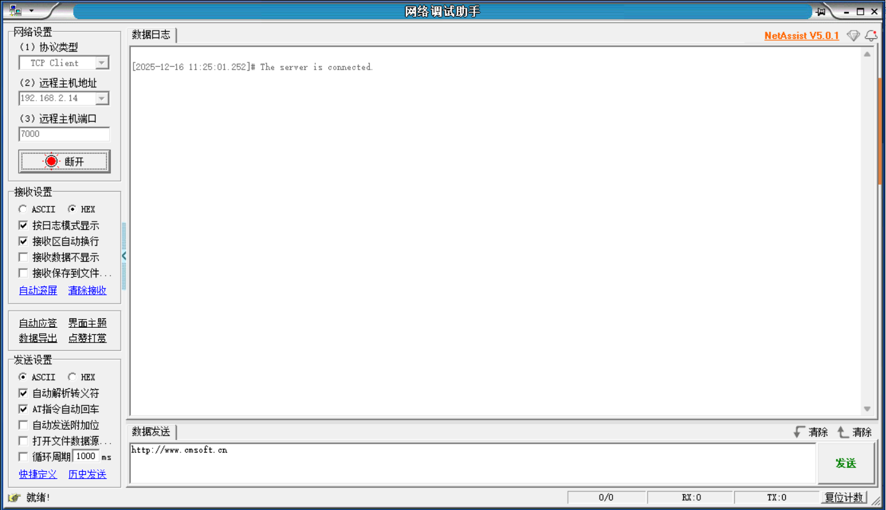
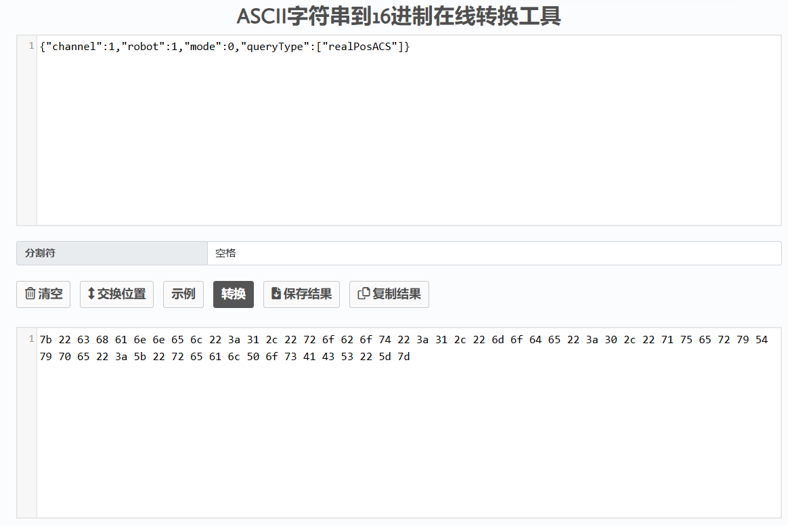
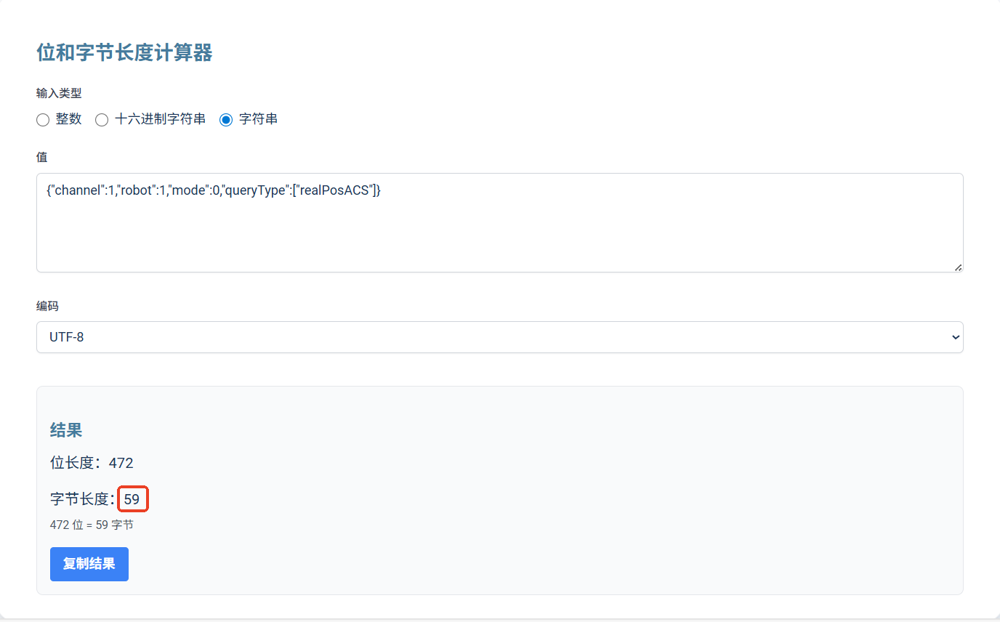
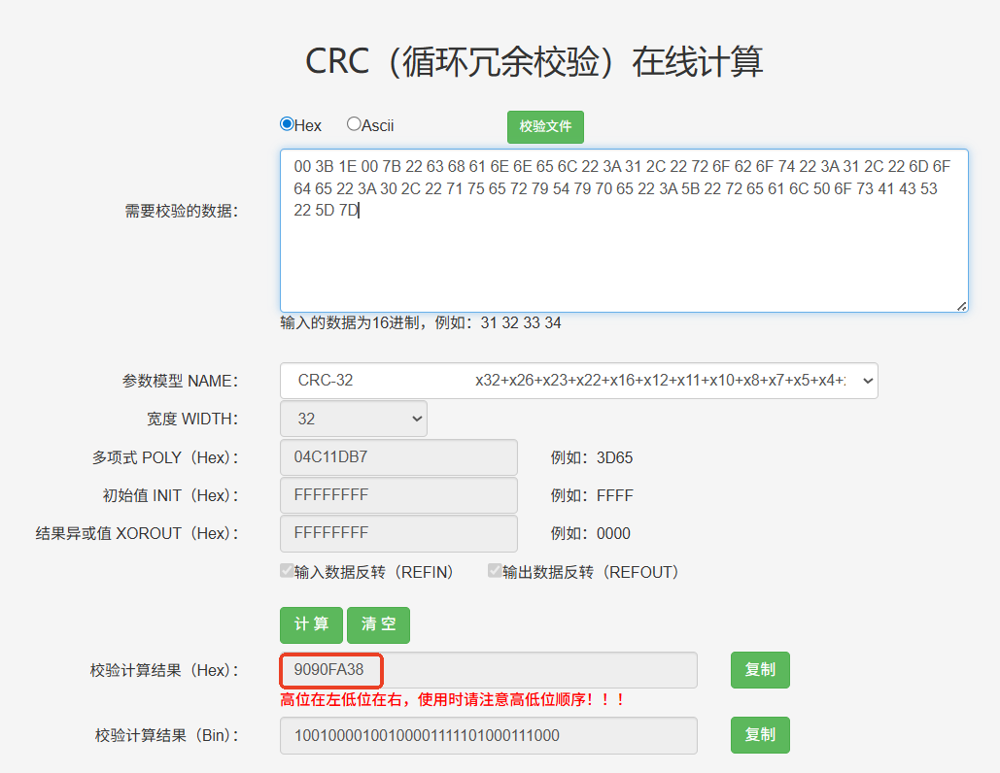
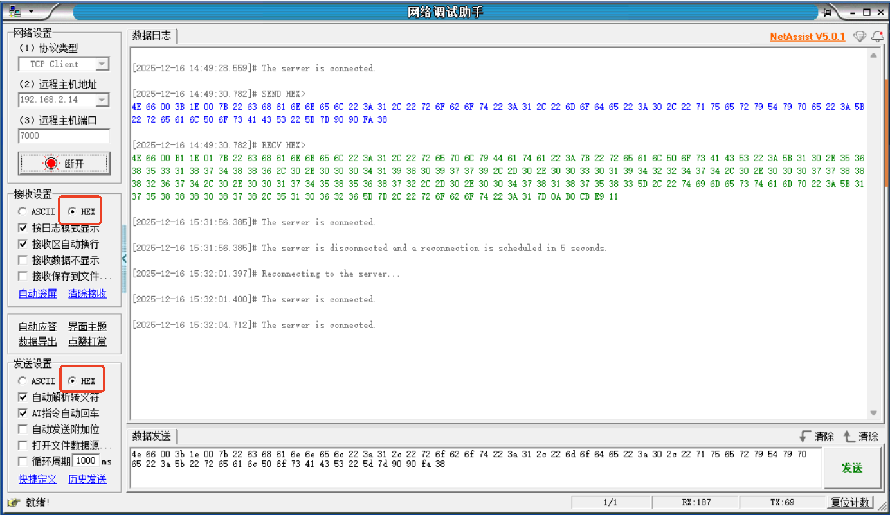
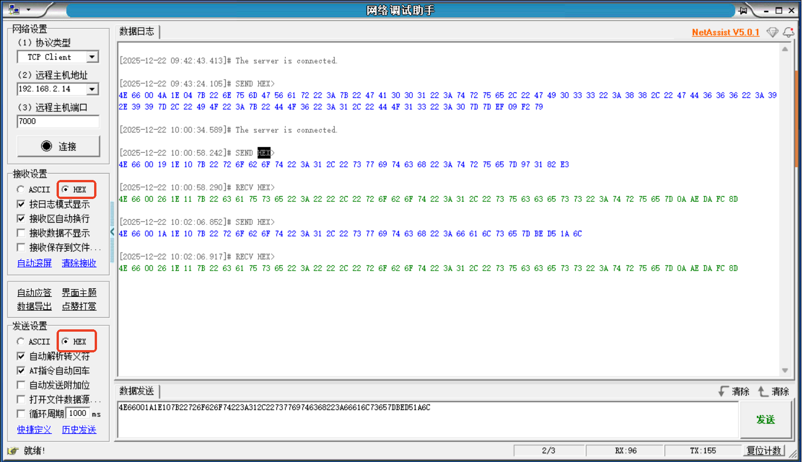

# 7000端口使用手册

## 文档概述

## 文档目的

本文档详细介绍了7000端口的使用方法，包括端口协议、网络调试助手连接、操作流程和常见问题解答，帮助用户快速上手并正确使用7000端口进行机器人控制和数据交互。

## 文档结构

本文档包含以下内容：
- 文档概述：介绍文档的目的和结构
- 核心内容：详细说明7000端口的使用方法和操作流程
- 相关资源：提供相关工具和参考文档
- 常见问题：解答用户在使用过程中可能遇到的问题
- 版本历史：记录文档的更新历史

## 术语定义

| 术语 | 解释 |
| :--- | :--- |
| 7000端口 | 机器人控制器用于接收和发送数据的网络端口 |
| CRC | 循环冗余校验，用于验证数据的完整性 |
| HEX | 十六进制，一种数据表示方式 |
| ASCII | 美国信息交换标准代码，用于表示文本字符 |

---

## 核心内容

## 端口协议

| 文档名称 | 大小 | 日期 |
| :--- | :--- | :--- |
| [7000端口协议.pdf](https://ones.inexbot.com/wiki/?/team/RnqpQ1Yp/space/XLUijCza/page/Sh9YhzKz) | 712.51 KB | 2025-12-16 16:14 |

所用的工具推荐

[ASCII字符串到16进制在线转换工具 -
Coding.Tools](https://coding.tools/cn/ascii-to-hex)

[位和字节长度计算器 - 免费数据大小工具 \|
Whiz.tools](https://whiz.tools/zh/conversion/bit-byte-length-calculator)

[CRC（循环冗余校验）在线计算_ip33.com](https://www.ip33.com/crc.html)

[JSON格式校验器-JSON在线工具](https://www.json-online.com/check/)

## 网络调试助手连接

- 输入控制器IP

- 端口：7000

### 操作流程

1.  从7000端口协议中找出需要发送对应的协议，比如：查询机器人关节坐标

{\"channel\":1,\"robot\":1,\"mode\":0,\"queryType\":\[\"realPosACS\"\]}

2.  **转16进制：**[ASCII字符串到16进制在线转换工具 -
    Coding.Tools](https://coding.tools/cn/ascii-to-hex)

3.  计算字符串字节长度[位和字节长度计算器 - 免费数据大小工具 \|
    Whiz.tools](https://whiz.tools/zh/conversion/bit-byte-length-calculator)

计算出来的字节长度为59，对应的16进制为，3b

4.  计算数据CRC

**固定帧头：**4E 66

**字节长度：**00 3b

**命令字：**0x1E00

**数据：**7b 22 63 68 61 6e 6e 65 6c 22 3a 31 2c 22 72 6f 62 6f 74 22 3a
31 2c 22 6d 6f 64 65 22 3a 30 2c 22 71 75 65 72 79 54 79 70 65 22 3a 5b
22 72 65 61 6c 50 6f 73 41 43 53 22 5d 7d

**CRC：**90 90 fa 38

**综上最终数据为：**

4e 66 00 3b 1e 00 7b 22 63 68 61 6e 6e 65 6c 22 3a 31 2c 22 72 6f 62 6f
74 22 3a 31 2c 22 6d 6f 64 65 22 3a 30 2c 22 71 75 65 72 79 54 79 70 65
22 3a 5b 22 72 65 61 6c 50 6f 73 41 43 53 22 5d 7d 90 90 fa 38

5.  数据回复：

{\"channel\":1,\"replyData\":{\"realPosACS\":\[10.568531874886,0.000419609779,-0.003019422474,0.000778882674,0.001745856872,-0.00478187583\],\"timestamp\":\[1758880991,917968\]},\"robot\":1}

查询的当前坐标\"realPosACS\":\[10.568531874886,0.000419609779,-0.003019422474,0.000778882674,0.001745856872,-0.00478187583\]，代表了当前机器人1的六个轴的关节坐标

4E 66 00 B1 1E 01 7B 22 63 68 61 6E 6E 65 6C 22 3A 31 2C 22 72 65 70 6C
79 44 61 74 61 22 3A 7B 22 72 65 61 6C 50 6F 73 41 43 53 22 3A 5B 31 30
2E 35 36 38 35 33 31 38 37 34 38 38 36 2C 30 2E 30 30 30 34 31 39 36 30
39 37 37 39 2C 2D 30 2E 30 30 33 30 31 39 34 32 32 34 37 34 2C 30 2E 30
30 30 37 37 38 38 38 32 36 37 34 2C 30 2E 30 30 31 37 34 35 38 35 36 38
37 32 2C 2D 30 2E 30 30 34 37 38 31 38 37 35 38 33 5D 2C 22 74 69 6D 65
73 74 61 6D 70 22 3A 5B 31 37 35 38 38 38 30 38 37 38 2C 35 31 30 36 32
36 5D 7D 2C 22 72 6F 62 6F 74 22 3A 31 7D 0A B0 CB E9 11

## 示例

### 查询轴速度

数据发送

{\"channel\":1,\"robot\":1,\"mode\":0,\"queryType\":\[\"axisVel\"\]}

4e 66 00 38 1e 00 7b 22 63 68 61 6e 6e 65 6c 22 3a 31 2c 22 72 6f 62 6f
74 22 3a 31 2c 22 6d 6f 64 65 22 3a 30 2c 22 71 75 65 72 79 54 79 70 65
22 3a 5b 22 61 78 69 73 56 65 6c 22 5d 7d 3f 5a c3 d4

数据回复

{\"channel\":1,\"replyData\":{\"axisVel\":\[7.986133761819,0.000472061001,0.005733510091,-0.003679549185,-0.001316107488,0.106442472321\],\"timestamp\":\[1758891008,795601\]},\"robot\":1}

4E 66 00 AF 1E 01 7B 22 63 68 61 6E 6E 65 6C 22 3A 31 2C 22 72 65 70 6C
79 44 61 74 61 22 3A 7B 22 61 78 69 73 56 65 6C 22 3A 5B 2D 30 2E 30 30
31 32 38 39 31 38 30 34 37 31 2C 30 2E 30 30 30 32 38 38 34 38 31 37 32
33 2C 2D 30 2E 30 30 33 31 38 39 30 35 32 39 35 2C 30 2E 30 30 31 30 32
30 36 30 34 38 38 33 2C 2D 30 2E 30 30 31 32 30 38 36 37 30 31 34 32 2C
2D 30 2E 30 30 33 32 37 36 39 33 32 33 32 34 5D 2C 22 74 69 6D 65 73 74
61 6D 70 22 3A 5B 31 37 35 38 38 39 30 36 37 32 2C 34 32 30 38 36 37 5D
7D 2C 22 72 6F 62 6F 74 22 3A 31 7D 0A 5D 7C B9 48

### 查询变量GI

数据发送

{\"channel\":1,\"robot\":1,\"mode\":0,\"queryType\":\[\"numGVar\"\],\"typeCfg\":{\"numGVar\":\[\"GI001\"\]}}

4E 66 00 58 1E 00 7B 22 63 68 61 6E 6E 65 6C 22 3A 31 2C 22 72 6F 62 6F
74 22 3A 31 2C 22 6D 6F 64 65 22 3A 30 2C 22 71 75 65 72 79 54 79 70 65
22 3A 5B 22 6E 75 6D 47 56 61 72 22 5D 2C 22 74 79 70 65 43 66 67 22 3A
7B 22 6E 75 6D 47 56 61 72 22 3A 5B 22 47 49 30 30 33 22 5D 7D 7D BF DF
25 B0

数据回复

{\"channel\":1,\"replyData\":{\"numGVar\":{\"GI001\":8},\"timestamp\":\[1759035307,716747\]},\"robot\":1}

4E 66 00 5F 1E 01 7B 22 63 68 61 6E 6E 65 6C 22 3A 31 2C 22 72 65 70 6C
79 44 61 74 61 22 3A 7B 22 6E 75 6D 47 56 61 72 22 3A 7B 22 47 49 30 30
33 22 3A 39 39 38 38 7D 2C 22 74 69 6D 65 73 74 61 6D 70 22 3A 5B 31 37
35 39 30 33 36 32 30 31 2C 34 39 35 32 39 34 5D 7D 2C 22 72 6F 62 6F 74
22 3A 31 7D 0A 37 7F 0E 2B

### 查询IO

数据发送

{\"channel\":1,\"robot\":1,\"mode\":0,\"queryType\":\[\"IO\"\],\"typeCfg\":{\"IO\":\[\"DO1\",\"DO5\",\"DO19\",\"DI1\",\"DI5\",\"DI19\"\]}}

4E 66 00 6C 1E 00 7B 22 63 68 61 6E 6E 65 6C 22 3A 31 2C 22 72 6F 62 6F
74 22 3A 31 2C 22 6D 6F 64 65 22 3A 30 2C 22 71 75 65 72 79 54 79 70 65
22 3A 5B 22 49 4F 22 5D 2C 22 74 79 70 65 43 66 67 22 3A 7B 22 49 4F 22
3A 5B 22 44 4F 31 22 2C 22 44 4F 35 22 2C 22 44 4F 31 39 22 2C 22 44 49
31 22 2C 22 44 49 35 22 2C 22 44 49 31 39 22 5D 7D 7D D3 81 29 EA

数据回复

{\"channel\":1,\"replyData\":{\"IO\":{\"DI1\":1.0,\"DI19\":-1.0,\"DI5\":0.0,\"DO1\":0.0,\"DO19\":-1.0,\"DO5\":1.0},\"timestamp\":\[1759036974,479771\]},\"robot\":1}

4E 66 00 8D 1E 01 7B 22 63 68 61 6E 6E 65 6C 22 3A 31 2C 22 72 65 70 6C
79 44 61 74 61 22 3A 7B 22 49 4F 22 3A 7B 22 44 49 31 22 3A 31 2E 30 2C
22 44 49 31 39 22 3A 2D 31 2E 30 2C 22 44 49 35 22 3A 30 2E 30 2C 22 44
4F 31 22 3A 30 2E 30 2C 22 44 4F 31 39 22 3A 2D 31 2E 30 2C 22 44 4F 35
22 3A 31 2E 30 7D 2C 22 74 69 6D 65 73 74 61 6D 70 22 3A 5B 31 37 35 39
30 33 37 31 39 33 2C 35 33 36 33 30 34 5D 7D 2C 22 72 6F 62 6F 74 22 3A
31 7D 0A 1F 13 C1 4A

### 查询运行参数（在运动时可查询）

数据发送

{\"channel\":1,\"robot\":1,\"mode\":0,\"queryType\":\[\"detailedMotionPos\"\],\"typeCfg\":{\"detailedMotionPos\":{\"num\":10,\"optional\":\[\"ACS\",\"MCS\",\"time\"\]}}}

4E 66 00 8D 1E 00 7B 22 63 68 61 6E 6E 65 6C 22 3A 31 2C 22 72 6F 62 6F
74 22 3A 31 2C 22 6D 6F 64 65 22 3A 30 2C 22 71 75 65 72 79 54 79 70 65
22 3A 5B 22 64 65 74 61 69 6C 65 64 4D 6F 74 69 6F 6E 50 6F 73 22 5D 2C
22 74 79 70 65 43 66 67 22 3A 7B 22 64 65 74 61 69 6C 65 64 4D 6F 74 69
6F 6E 50 6F 73 22 3A 7B 22 6E 75 6D 22 3A 31 30 2C 22 6F 70 74 69 6F 6E
61 6C 22 3A 5B 22 41 43 53 22 2C 22 4D 43 53 22 2C 22 74 69 6D 65 22 5D
7D 7D 7D CD 70 08 39

数据回复

{\"channel\":1,\"replyData\":{\"detailedMotionPos\":{\"data\":\[{\"ACS\":\[-3.737246137402,0.0,-0.0,0.0,-0.0,0.0\],\"MCS\":\[863.715856927365,-56.417844557178,922.9601,3.14159265359,0.0,0.065227250055\],\"time\":\[1759052356,264138361\]},{\"ACS\":\[-3.745019920319,0.0,-0.0,0.0,-0.0,0.0\],\"MCS\":\[863.708194311146,-56.535031370193,922.9601,3.14159265359,0.0,0.065362928162\],\"time\":\[1759052356,265137446\]},{\"ACS\":\[-3.752793703237,0.0,-0.0,0.0,-0.0,0.0\],\"MCS\":\[863.700515795314,-56.652217142481,922.9601,3.14159265359,0.0,0.06549860627\],\"time\":\[1759052356,266137262\]},{\"ACS\":\[-3.760567486154,0.0,-0.0,0.0,-0.0,0.0\],\"MCS\":\[863.692821380008,-56.769401871883,922.9601,3.14159265359,0.0,0.065634284377\],\"time\":\[1759052356,267138339\]},{\"ACS\":\[-3.768341269071,0.0,-0.0,0.0,-0.0,0.0\],\"MCS\":\[863.685111065371,-56.886585556243,922.9601,3.14159265359,0.0,0.065769962484\],\"time\":\[1759052356,268136751\]},{\"ACS\":\[-3.776115051988,0.0,-0.0,0.0,-0.0,0.0\],\"MCS\":\[863.677384851544,-57.003768193403,922.9601,3.14159265359,0.0,0.065905640591\],\"time\":\[1759052356,269137036\]},{\"ACS\":\[-3.783888834905,0.0,-0.0,0.0,-0.0,0.0\],\"MCS\":\[863.669642738671,-57.120949781207,922.9601,-3.14159265359,0.0,0.066041318699\],\"time\":\[1759052356,270136564\]},{\"ACS\":\[-3.791662617822,0.0,-0.0,0.0,-0.0,0.0\],\"MCS\":\[863.661884726892,-57.238130317497,922.9601,3.14159265359,0.0,0.066176996806\],\"time\":\[1759052356,271137149\]},{\"ACS\":\[-3.799436400739,0.0,-0.0,0.0,-0.0,0.0\],\"MCS\":\[863.654110816351,-57.355309800116,922.9601,3.14159265359,0.0,0.066312674913\],\"time\":\[1759052356,272137121\]},{\"ACS\":\[-3.807210183656,0.0,-0.0,0.0,-0.0,0.0\],\"MCS\":\[863.646321007192,-57.472488226908,922.9601,3.14159265359,0.0,0.06644835302\],\"time\":\[1759052356,273137922\]}\],\"num\":10},\"timestamp\":\[1759052356,804742\]},\"robot\":1}

4E 66 06 C9 1E 01 7B 22 63 68 61 6E 6E 65 6C 22 3A 31 2C 22 72 65 70 6C
79 44 61 74 61 22 3A 7B 22 64 65 74 61 69 6C 65 64 4D 6F 74 69 6F 6E 50
6F 73 22 3A 7B 22 64 61 74 61 22 3A 5B 7B 22 41 43 53 22 3A 5B 2D 31 32
2E 32 35 37 33 31 32 32 31 34 35 35 37 2C 30 2E 30 2C 2D 30 2E 30 2C 30
2E 30 2C 2D 30 2E 30 2C 30 2E 30 5D 2C 22 4D 43 53 22 3A 5B 38 34 35 2E
38 32 35 32 39 31 32 36 37 30 30 34 2C 2D 31 38 33 2E 37 35 39 37 31 30
38 38 37 31 37 33 2C 39 32 32 2E 39 36 30 31 2C 33 2E 31 34 31 35 39 32
36 35 33 35 39 2C 30 2E 30 2C 30 2E 32 31 33 39 33 30 34 35 35 35 38 39
5D 2C 22 74 69 6D 65 22 3A 5B 31 37 35 39 30 35 34 30 39 32 2C 35 35 39
33 33 31 35 39 5D 7D 2C 7B 22 41 43 53 22 3A 5B 2D 31 32 2E 32 36 35 30
38 35 39 39 37 34 37 35 2C 30 2E 30 2C 2D 30 2E 30 2C 30 2E 30 2C 2D 30
2E 30 2C 30 2E 30 5D 2C 22 4D 43 53 22 3A 5B 38 34 35 2E 38 30 30 33 35
31 33 31 32 31 31 33 2C 2D 31 38 33 2E 38 37 34 34 36 39 31 37 30 30 32
2C 39 32 32 2E 39 36 30 31 2C 33 2E 31 34 31 35 39 32 36 35 33 35 39 2C
30 2E 30 2C 30 2E 32 31 34 30 36 36 31 33 33 36 39 36 5D 2C 22 74 69 6D
65 22 3A 5B 31 37 35 39 30 35 34 30 39 32 2C 35 36 39 33 34 31 36 33 5D
7D 2C 7B 22 41 43 53 22 3A 5B 2D 31 32 2E 32 37 32 38 35 39 37 38 30 33
39 32 2C 30 2E 30 2C 2D 30 2E 30 2C 30 2E 30 2C 2D 30 2E 30 2C 30 2E 30
5D 2C 22 4D 43 53 22 3A 5B 38 34 35 2E 37 37 35 33 39 35 37 38 37 32 36
34 2C 2D 31 38 33 2E 39 38 39 32 32 34 30 36 38 30 30 35 2C 39 32 32 2E
39 36 30 31 2C 33 2E 31 34 31 35 39 32 36 35 33 35 39 2C 30 2E 30 2C 30
2E 32 31 34 32 30 31 38 31 31 38 30 33 5D 2C 22 74 69 6D 65 22 3A 5B 31
37 35 39 30 35 34 30 39 32 2C 35 37 39 33 32 38 37 36 5D 7D 2C 7B 22 41
43 53 22 3A 5B 2D 31 32 2E 32 38 30 36 33 33 35 36 33 33 30 39 2C 30 2E
30 2C 2D 30 2E 30 2C 30 2E 30 2C 2D 30 2E 30 2C 30 2E 30 5D 2C 22 4D 43
53 22 3A 5B 38 34 35 2E 37 35 30 34 32 34 36 39 32 39 31 38 2C 2D 31 38
34 2E 31 30 33 39 37 35 35 37 39 30 31 35 2C 39 32 32 2E 39 36 30 31 2C
33 2E 31 34 31 35 39 32 36 35 33 35 39 2C 30 2E 30 2C 30 2E 32 31 34 33
33 37 34 38 39 39 31 31 5D 2C 22 74 69 6D 65 22 3A 5B 31 37 35 39 30 35
34 30 39 32 2C 35 38 39 33 33 32 34 34 5D 7D 2C 7B 22 41 43 53 22 3A 5B
2D 31 32 2E 32 38 38 34 30 37 33 34 36 32 32 36 2C 30 2E 30 2C 2D 30 2E
30 2C 30 2E 30 2C 2D 30 2E 30 2C 30 2E 30 5D 2C 22 4D 43 53 22 3A 5B 38
34 35 2E 37 32 35 34 33 38 30 32 39 35 33 34 2C 2D 31 38 34 2E 32 31 38
37 32 33 37 30 30 39 33 39 2C 39 32 32 2E 39 36 30 31 2C 33 2E 31 34 31
35 39 32 36 35 33 35 39 2C 30 2E 30 2C 30 2E 32 31 34 34 37 33 31 36 38
30 31 38 5D 2C 22 74 69 6D 65 22 3A 5B 31 37 35 39 30 35 34 30 39 32 2C
35 39 39 33 32 35 38 31 5D 7D 2C 7B 22 41 43 53 22 3A 5B 2D 31 32 2E 32
39 36 31 38 31 31 32 39 31 34 33 2C 30 2E 30 2C 2D 30 2E 30 2C 30 2E 30
2C 2D 30 2E 30 2C 30 2E 30 5D 2C 22 4D 43 53 22 3A 5B 38 34 35 2E 37 30
30 34 33 35 37 39 37 35 37 32 2C 2D 31 38 34 2E 33 33 33 34 36 38 34 33
31 36 36 32 2C 39 32 32 2E 39 36 30 31 2C 33 2E 31 34 31 35 39 32 36 35
33 35 39 2C 30 2E 30 2C 30 2E 32 31 34 36 30 38 38 34 36 31 32 35 5D 2C
22 74 69 6D 65 22 3A 5B 31 37 35 39 30 35 34 30 39 32 2C 36 30 39 33 33
38 34 39 5D 7D 2C 7B 22 41 43 53 22 3A 5B 2D 31 32 2E 33 30 33 39 35 34
39 31 32 30 36 2C 30 2E 30 2C 2D 30 2E 30 2C 30 2E 30 2C 2D 30 2E 30 2C
30 2E 30 5D 2C 22 4D 43 53 22 3A 5B 38 34 35 2E 36 37 35 34 31 37 39 39
37 34 39 32 2C 2D 31 38 34 2E 34 34 38 32 30 39 37 36 39 30 37 35 2C 39
32 32 2E 39 36 30 31 2C 33 2E 31 34 31 35 39 32 36 35 33 35 39 2C 30 2E
30 2C 30 2E 32 31 34 37 34 34 35 32 34 32 33 32 5D 2C 22 74 69 6D 65 22
3A 5B 31 37 35 39 30 35 34 30 39 32 2C 36 31 39 33 33 30 30 36 5D 7D 2C
7B 22 41 43 53 22 3A 5B 2D 31 32 2E 33 31 31 37 32 38 36 39 34 39 37 37
2C 30 2E 30 2C 2D 30 2E 30 2C 30 2E 30 2C 2D 30 2E 30 2C 30 2E 30 5D 2C
22 4D 43 53 22 3A 5B 38 34 35 2E 36 35 30 33 38 34 36 32 39 37 35 36 2C
2D 31 38 34 2E 35 36 32 39 34 37 37 31 31 30 36 33 2C 39 32 32 2E 39 36
30 31 2C 33 2E 31 34 31 35 39 32 36 35 33 35 39 2C 30 2E 30 2C 30 2E 32
31 34 38 38 30 32 30 32 33 34 5D 2C 22 74 69 6D 65 22 3A 5B 31 37 35 39
30 35 34 30 39 32 2C 36 32 39 33 32 36 35 34 5D 7D 2C 7B 22 41 43 53 22
3A 5B 2D 31 32 2E 33 31 39 35 30 32 34 37 37 38 39 34 2C 30 2E 30 2C 2D
30 2E 30 2C 30 2E 30 2C 2D 30 2E 30 2C 30 2E 30 5D 2C 22 4D 43 53 22 3A
5B 38 34 35 2E 36 32 35 33 33 35 36 39 34 38 32 32 2C 2D 31 38 34 2E 36
37 37 36 38 32 32 35 35 35 31 35 2C 39 32 32 2E 39 36 30 31 2C 2D 33 2E
31 34 31 35 39 32 36 35 33 35 39 2C 30 2E 30 2C 30 2E 32 31 35 30 31 35
38 38 30 34 34 37 5D 2C 22 74 69 6D 65 22 3A 5B 31 37 35 39 30 35 34 30
39 32 2C 36 33 39 33 33 36 38 33 5D 7D 2C 7B 22 41 43 53 22 3A 5B 2D 31
32 2E 33 32 37 32 37 36 32 36 30 38 31 31 2C 30 2E 30 2C 2D 30 2E 30 2C
30 2E 30 2C 2D 30 2E 30 2C 30 2E 30 5D 2C 22 4D 43 53 22 3A 5B 38 34 35
2E 36 30 30 32 37 31 31 39 33 31 35 34 2C 2D 31 38 34 2E 37 39 32 34 31
33 34 30 30 33 32 2C 39 32 32 2E 39 36 30 31 2C 33 2E 31 34 31 35 39 32
36 35 33 35 39 2C 30 2E 30 2C 30 2E 32 31 35 31 35 31 35 35 38 35 35 34
5D 2C 22 74 69 6D 65 22 3A 5B 31 37 35 39 30 35 34 30 39 32 2C 36 34 39
33 34 38 31 39 5D 7D 5D 2C 22 6E 75 6D 22 3A 31 30 7D 2C 22 74 69 6D 65
73 74 61 6D 70 22 3A 5B 31 37 35 39 30 35 34 30 39 32 2C 33 30 38 39 38
35 5D 7D 2C 22 72 6F 62 6F 74 22 3A 31 7D 0A C5 81 F1 9F

### 发送独立点位（关节点）

数据发送

{\"robot\":1,\"targetMode\":0,\"cfg\":{\"coord\":\"ACS\",\"extMove\":0,\"sync\":0,\"speed\":50,\"acc\":50},\"targetPos\":\[10,0,0,0,0,0\]}

4E 66 00 74 1E 02 7B 22 72 6F 62 6F 74 22 3A 31 2C 22 74 61 72 67 65 74
4D 6F 64 65 22 3A 30 2C 22 63 66 67 22 3A 7B 22 63 6F 6F 72 64 22 3A 22
41 43 53 22 2C 22 65 78 74 4D 6F 76 65 22 3A 30 2C 22 73 79 6E 63 22 3A
30 2C 22 73 70 65 65 64 22 3A 35 30 2C 22 61 63 63 22 3A 35 30 7D 2C 22
74 61 72 67 65 74 50 6F 73 22 3A 5B 31 30 2C 30 2C 30 2C 30 2C 30 2C 30
5D 7D B9 D9 C7 09

数据回复

{\"cause\":\"\",\"robot\":1,\"size\":1,\"success\":true}

4E 66 00 2F 1E 03 7B 22 63 61 75 73 65 22 3A 22 22 2C 22 72 6F 62 6F 74
22 3A 31 2C 22 73 69 7A 65 22 3A 31 2C 22 73 75 63 63 65 73 73 22 3A 74
72 75 65 7D 0A 5F F6 80 3

### 发送连续点位（关节）

数据发送

{\"robot\":1,\"targetMode\":1,\"sendMode\":0,\"cfg\":{\"coord\":\"ACS\",\"extMove\":0,\"sync\":0,\"speed\":50,\"acc\":50},\"targetVec\":\[{\"pos\":\[1,2,3,4,5,6\],\"timeStamp\":1000},{\"pos\":\[11,12,13,14,15,16\],\"timeStamp\":2000},{\"pos\":\[21,22,23,24,25,26\],\"timeStamp\":4000}\]}

4E 66 00 F5 1E 02 7B 22 72 6F 62 6F 74 22 3A 31 2C 22 74 61 72 67 65 74
4D 6F 64 65 22 3A 31 2C 22 73 65 6E 64 4D 6F 64 65 22 3A 30 2C 22 63 66
67 22 3A 7B 22 63 6F 6F 72 64 22 3A 22 41 43 53 22 2C 22 65 78 74 4D 6F
76 65 22 3A 30 2C 22 73 79 6E 63 22 3A 30 2C 22 73 70 65 65 64 22 3A 35
30 2C 22 61 63 63 22 3A 35 30 7D 2C 22 74 61 72 67 65 74 56 65 63 22 3A
5B 7B 22 70 6F 73 22 3A 5B 31 2C 32 2C 33 2C 34 2C 35 2C 36 5D 2C 22 74
69 6D 65 53 74 61 6D 70 22 3A 31 30 30 30 7D 2C 7B 22 70 6F 73 22 3A 5B
31 31 2C 31 32 2C 31 33 2C 31 34 2C 31 35 2C 31 36 5D 2C 22 74 69 6D 65
53 74 61 6D 70 22 3A 32 30 30 30 7D 2C 7B 22 70 6F 73 22 3A 5B 32 31 2C
32 32 2C 32 33 2C 32 34 2C 32 35 2C 32 36 5D 2C 22 74 69 6D 65 53 74 61
6D 70 22 3A 34 30 30 30 7D 5D 7D B4 53 24 15

数据回复

{\"cause\":\"\",\"robot\":1,\"size\":1,\"success\":true}

4E 66 00 2F 1E 03 7B 22 63 61 75 73 65 22 3A 22 22 2C 22 72 6F 62 6F 74
22 3A 31 2C 22 73 69 7A 65 22 3A 32 2C 22 73 75 63 63 65 73 73 22 3A 74
72 75 65 7D 0A B5 70 5D 55

### 变量/IO控制

数据发送

{\"numGVar\":{\"GA001\":true,\"GI033\":88,\"GD666\":9.99},\"IO\":{\"DO6\":1,\"DO13\":0}}

4E 66 00 4A 1E 04 7B 22 6E 75 6D 47 56 61 72 22 3A 7B 22 47 41 30 30 31
22 3A 74 72 75 65 2C 22 47 49 30 33 33 22 3A 38 38 2C 22 47 44 36 36 36
22 3A 39 2E 39 39 7D 2C 22 49 4F 22 3A 7B 22 44 4F 36 22 3A 31 2C 22 44
4F 31 33 22 3A 30 7D 7D EF 09 F2 79

### 伺服控制

数据发送

{\"robot\":1,\"switch\":true}

4E 66 00 19 1E 10 7B 22 72 6F 62 6F 74 22 3A 31 2C 22 73 77 69 74 63 68
22 3A 74 72 75 65 7D 97 31 82 E3

数据回复

{\"cause\":\"\",\"robot\":1,\"success\":true}

4E 66 00 26 1E 11 7B 22 63 61 75 73 65 22 3A 22 22 2C 22 72 6F 62 6F 74
22 3A 31 2C 22 73 75 63 63 65 73 73 22 3A 74 72 75 65 7D 0A AE DA FC 8D

## 常见问题

## 格式问题

**问题**：发送数据后没有收到回复，如何排查格式问题？

**解答**：
- 排查固定帧头是否为4E 66
- 检查字节长度是否准确并且已转换为16进制，可用工具排查
- 检查所属功能命令字是否准确，具体查看端口协议
- 检查数据内容为ASCII码时符号和数据是否为英文，可用JSON校验工具排查
- 检查数据CRC是否准确，可用工具排查

## 网络调试助手问题

**问题**：使用网络调试助手发送数据后没有收到回复，如何解决？

**解答**：
- 确保发送和接收均为HEX格式
- 检查网络连接是否正常
- 确认控制器IP地址和端口号（7000）是否正确
- 查看网络调试助手的格式设置是否准确

---

## 相关资源

## 参考文档

- [7000端口协议.pdf](https://ones.inexbot.com/wiki/?/team/RnqpQ1Yp/space/XLUijCza/page/Sh9YhzKz)

## 相关工具

- [ASCII字符串到16进制在线转换工具 - Coding.Tools](https://coding.tools/cn/ascii-to-hex)
- [位和字节长度计算器 - 免费数据大小工具 | Whiz.tools](https://whiz.tools/zh/conversion/bit-byte-length-calculator)
- [CRC（循环冗余校验）在线计算_ip33.com](https://www.ip33.com/crc.html)
- [JSON格式校验器-JSON在线工具](https://www.json-online.com/check/)

---

## 版本历史

| 版本 | 日期 | 变更内容 | 作者 |
| :--- | :--- | :--- | :--- |
| 1.0.0 | 2026-04-13 | 初始版本 | iNexBot |
