# DXF 功能使用手册

## 操作流程

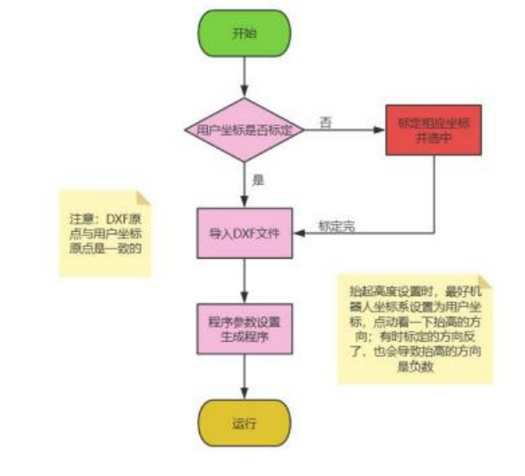

1. DXF功能建立在用户坐标下，用户坐标的原点与DXF文件中图形的原点对应。
2. 工件与DXF文件须1：1还原，工件原点位置须与DXF文件中的图形原点对应。
3. DXF文件需使用CAD软件绘制，导出文件时使用 **.dxf格式**（建议使用QCAD制图软件）。
4. DXF功能支持读取直线、圆弧、多段线、样条曲线、整圆图元，其它图元暂不支持。
5. DXF文件中请把不需要的图形删除，尽可能的简单，图形尽量是一条完整连续的轨迹。若有其他杂乱图形或者图形分段绘制可能会对机器人运行轨迹造成影响。

**注意：**DXF文件中图形的原点及XY轴为CAD软件中的原点及XY轴。

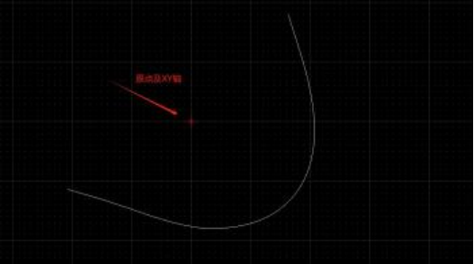

## DXF功能

### 图形界面

操作步骤路径：【工艺-DXF】

点击进入DXF

| 功能 | 描述 |
| --- | --- |
| 返回 | 返回【工艺】界面。 |
| 示教起始点 | 使用外部TCP时，进行标记工件起始点，用于校准工件位置。 |
| 示教结束点 | 使用外部TCP时，进行标记工件结束点，用于校准工件位置。 |
| 拖动 | 打开开关可以拖动画布位置。 |
| 离散点 | 打开DXF文件（样条曲线）前需要先填写离散点，离散点越高，生成的作业文件点位越多（除样条曲线外，其他支持的图元无需修改离散点，使用默认离散点即可，离散点值对其无效）。 |
| 打开 | 需要插入U盘，默认打开目录为控制器目录，DXF文件放在U盘根目录下即可。 |
| 速度规划 | 用于规划图中轨迹的速度。 |
|  | 用于放大画布大小。 |
|  | 用于缩小画布大小。 |
|  | 用于重置画布位置。 |

## 打开 DXF 文件

**旧版本**

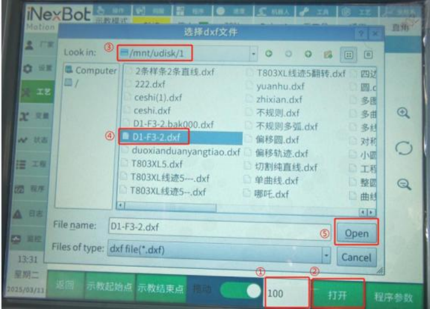

步 骤 ：示教器插入U盘，① 填写需要的【 离散点 】→ ② 点击【 打开 】→ ③
选择U盘文件夹→ ④ 选中相应的DXF文件→ ⑤ 点击【 Open】 ，就可打开 文件 。

注 意 ：

1. 打开DXF文件后，如果更改离散点，更改后请重新加载DXF文件，才能起效果
   。
2. 离散点仅对样条曲线生效，其他支持的图元生成的文件点位与绘图时存在的点位有关
   。
3. 目前支持离散点数值最高为5000，填写数值需要适量，不宜在样条曲线轨迹过多的dxf中填入过多的离散点，样条曲线个数和离散点的乘积需小于9999，轨迹过短的离散点过大会导致程序运行失败，和机器人绝对位置精度大小有关
   。
4. 打开DXF文件时，点击open直至要选择的DXF文件，过程中请注意！请勿拖动任何文件夹！！！

**新版本**

步 骤 ： 示教器插入U盘 ， ① 填写需要的【 离散点 】 → ② 点击【 打开 】→ ③
选相应的DXF文件→ ④ 点击【 确定 】 ， 就可打开文件 。

打开之后预览如下

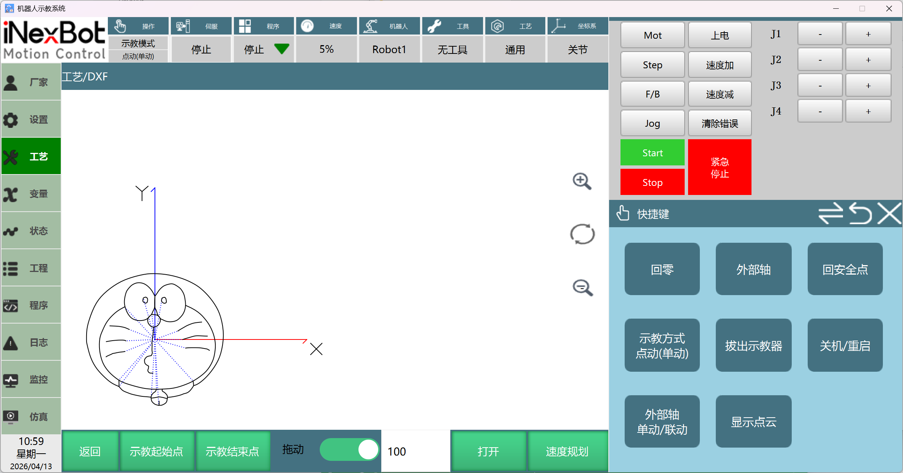

图形当中用虚线连接原点的点代表DXF文件中每段轨迹的起点，X代表X轴正方向，Y代表Y轴正方向。

### 速度规划参数界面

操作步骤：【工艺】-【DXF】-【速度规划】

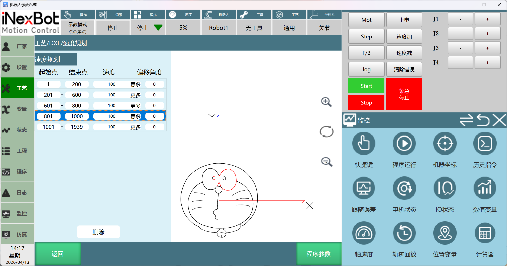

| 功能             | 描述                               |
| -------------- | -------------------------------- |
| 起始点            | 某部分轨迹的起始点                        |
| 结束点            | 某部分轨迹的结束点                        |
| 速度             | 此段轨迹的笛卡尔速度                       |
| 偏移角度（仅外部TCP可用） | 此段轨迹的相对于外部TCP相切的运动方向的偏移角度，（逐渐偏移） |
| 删除             | 将此段点位轨迹删除，合并到上一段轨迹中              |

注意：

1. 默认是从轨迹整第一个点到最后一个点，修改结束点参数可设置部分轨迹段，其余点位自动分成新轨迹段，选中该部分，图中会将对应点位显示成红色轨迹。
2. 此部分点位已经包含抬升点位。

### 程序参数界面

操作步骤：【工艺】-【DXF】-【速度规划】-【程序参数】

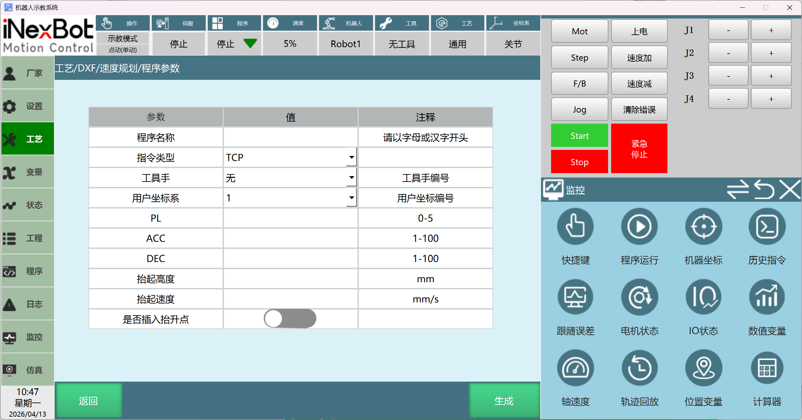

| 功能      | 描述 |
| ------- | ---------------------------------------------------------|
| 程序名称    | 以字母或汉字开头的作业文件名。 |
| 指令类型    | 可选择TCP或外部TCP。  |
| 工具手     | 用于选择使用的工具坐标。（当用户在机器人末端加载工具时，工具的中心点往往与机器人法兰盘不在同一中心点。此时需要进行工具坐标标定。可以查看纳博特官方关于机器人的标定方法，此文不重点介绍。如果用户不进行工具标定，实际走出的轨迹会与导入的图形轨迹有大的偏差。工具中心与法兰盘中心越远，偏差越大。） |
| 用户坐标系   | 用于选择所使用的用户坐标编号。若使用工具手要先标定工具坐标，然后再带着工具手标定用户坐标。         |
| PL      | 机器人运动指令的平滑等级，增加平滑等级可使运动指令之间运动更平滑，但也会在指令与指令的连接点处产生平滑误差（范围0-5）。    |
| ACC     | 生成的运动指令加速度（范围1-100）。 |
| DEC     | 生成的运动指令减速度（范围1-100）。 |
| 抬起高度    | 运行每段轨迹前和结束每段轨迹后的抬起高度（若用户坐标系标定后Z轴为正方向为负，即Z轴向下，会导致抬起高度的方向为负数）。 |
| 抬起速度    | 运行抬起指令时的运行速度。 |
| 是否插入抬升点 | 可选择是否插入抬升点。若打开开关，则会在运行每段轨迹前和结束每段轨迹后插入抬升点。若关闭开关，即使填写了"抬起高度"和"抬起速度"也不会生成抬升点指令。 |
| 返回      | 返回到DXF界面。 |
| 生成      | 参数填写后，生成相应的作业文件。 |

### 运行程序

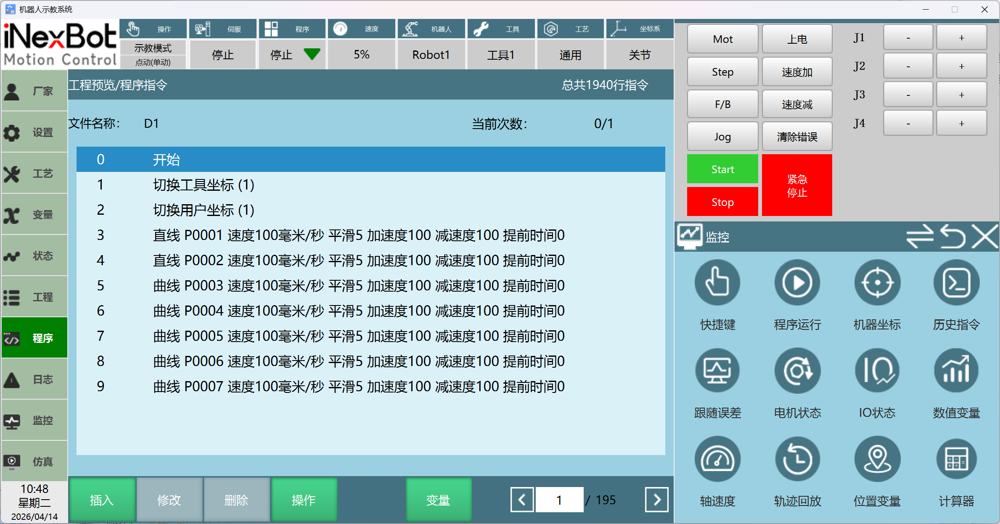

程序生成后，将自动跳转到生成的作业文件中，也可以在【工程】中选择被生成的程序，再打开；示教器打到运行模式，按下【启动】按键。

**注意：**

如果想要循环运行此程序，可在程序第一行或最后一行添加一个关节坐标下的点到点指令作为安全点，安全点设置好后需要运行看一下轨迹是否正确，若安全点设置不合理会导致关节超限，运行轨迹异常。

## 使用示例

### 示例一、生成外部TCP

**以四轴scara机器人为例：**

1. 首先，将DXF文件放入U盘内，将U盘插入示教器（最好使用FAT32类型U盘）。

1. 点击示教器【**工艺】-【DXF】。**

1. 先在【离散点】处输入需要的数值（仅对样条曲线生效，数值越大，生成的作业文件中的点位就会越多，数值填入需合理，过多会导致轨迹运行不流畅）。

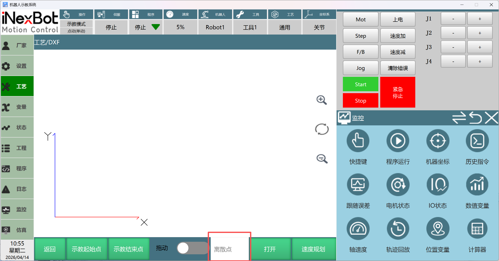

1. ①点击【打开】按钮，②在弹窗内选择mnt文件夹再进入udisk文件夹，此文件夹为U盘内的文件，找到DXF文件打开，如下图所示。

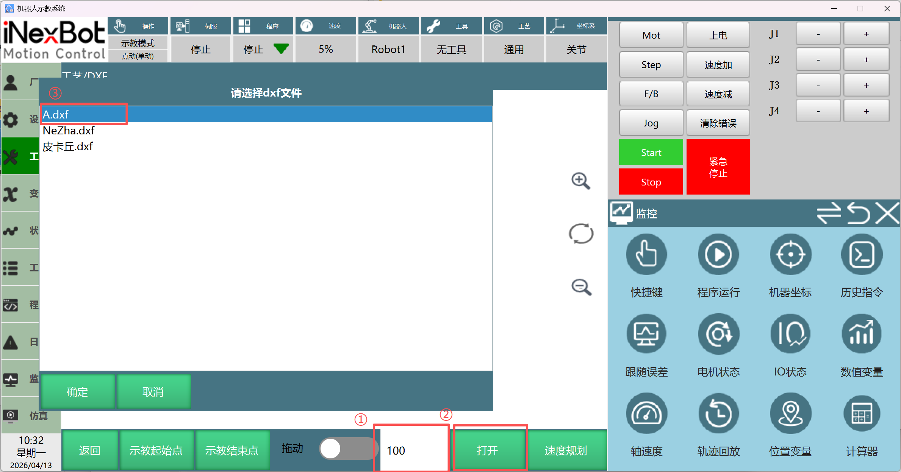

1. 标定工具手，确定法兰中心。

第一步，点击【设置】-【工具手标定】

第二步，在**无工具手**状态下点击【工具标定】。

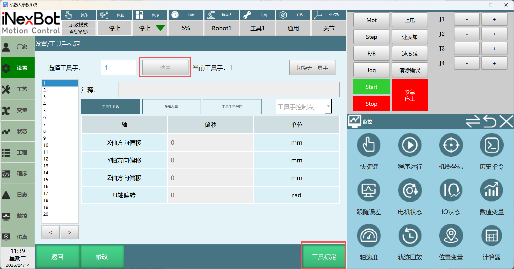

第三步，四轴scara机器人标定工具手使用2点法。

第四步，TC1为空间内任意一点，工具手与外部工具手尖对尖点击**标定**。

第五步，TC2为TC1的基础上点动直角坐标系下的U轴至180°（需在【操作参数】中修改**姿态值**为角度值才可看到度数）后，移动XYZ轴使工具手与外部工具手尖对尖点击**标定**。

第六步，两点标定后点击**计算**。

第七步，选中标定好的工具手。

1. 标定用户坐标系。

若使用工具手，在标定用户坐标时，需选中工具手，带着工具手进行标定用户坐标（标定的用户坐标须在同一水平面上，即Z值须一致）。

标定用户坐标系时，需注意标定方向。建议标定后，将机器人坐标系设置为用户坐标，点动UZ看一下抬高的方向；有时标定的方向反了，会导致抬高的方向是负数。

第一步，点击【设置】-【用户坐标标定】

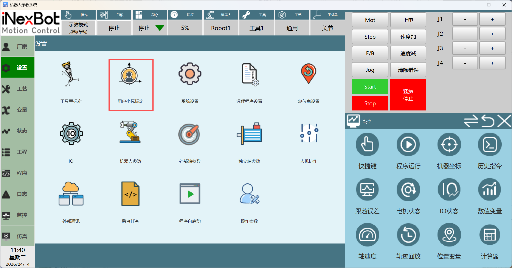

第二步，选中需要标定的用户坐标编号。

第三步，点击【用户标定】

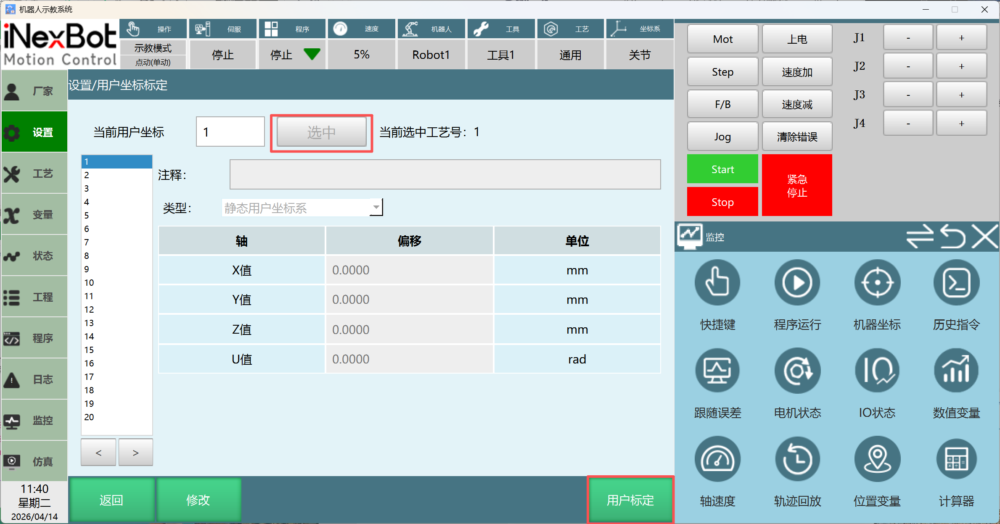

第四步，标定用户坐标原点和XY轴方向（标定的用户坐标须在同一水平面上，即Z值须一致，若点击标记后Z轴不一致，可以点击**修改**，手动填写相同的Z值）。

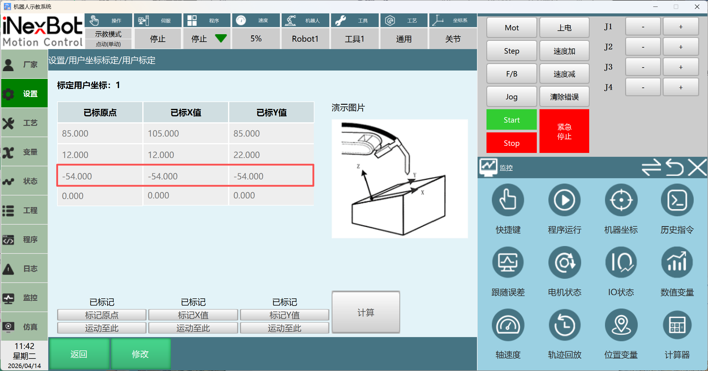

第五步，点击**计算**。

1. 放置工件，工件可任意摆放。放置后，在生成作业文件前需要示教起始点与结束点。

| 功能 | 描述 |
| --- | --- |
| 示教起始点 | 工件的开始点，运行机器人将轨迹开始点与外部工具手的尖端对齐（若使用工具手则选择所使用的工具手号，若未使用则选择"无工具手"即可），对齐后点击"**示教起始点**"。 |
| 示教结束点 | 工件的结束点，运行机器人将轨迹结束点与外部工具手的尖端对齐（若使用工具手则选择所使用的工具手号，若未使用则选择"无工具手"即可），对齐后点击"**示教结束点**"。 |

1. 点击**程序参数**，输入程序名称，选择指令类型为**外部TCP**，选择工具手编号为标定的工具手，选择用户坐标系为标定的用户坐标系。填写正确的需要使用的速度、平滑度、加速度、减速度、抬起高度、抬起速度（若使用抬起高度需要打开"是否插入抬升点"开关）。

1. 点击**生成**，生成的作业文件存放在**工程**中，打开作业文件运行。

**生成的作业文件点位与用户坐标系标定时的手系一致**，即使用左手标定用户坐标时，作业文件中的点位手系为左手；使用右手标定用户坐标时，作业文件中的点位手系为右手。

循环运行作业文件时，需手动在程序第一行或最后一行插入关节坐标下的点到点指令，回到安全位置（安全点设置好后需要运行看一下轨迹是否正确，若安全点设置不合理会导致关节超限，运行轨迹异常）。

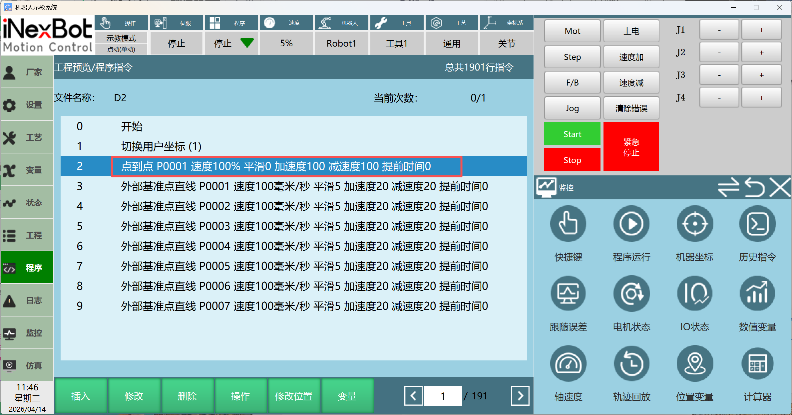

### 示例二、生成TCP

**以四轴scara机器人为例：**

1. 首先，将DXF文件放入U盘内，将U盘插入示教器（最好使用FAT32类型U盘）。

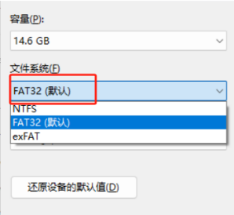

1. 点击示教器【工艺】-【DXF】。

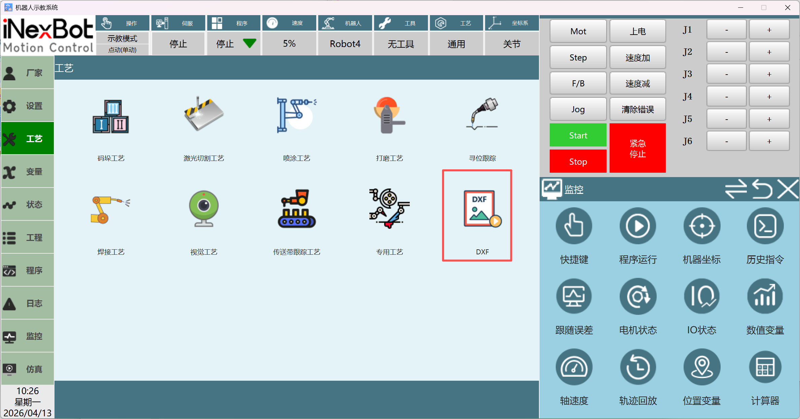

1. 先在【离散点】处输入需要的数值（仅对样条曲线生效，数值越大，生成的作业文件中的点位就会越多，数值填入需合理，过多会导致轨迹运行不流畅）。

1. ①点击【打开】按钮，②在弹窗内选择mnt文件夹再进入udisk文件夹，此文件夹为U盘内的文件，找到DXF文件打开，如下图所示。

1. 标定工具手，确定法兰中心。

第一步，点击【设置】-【工具手标定】

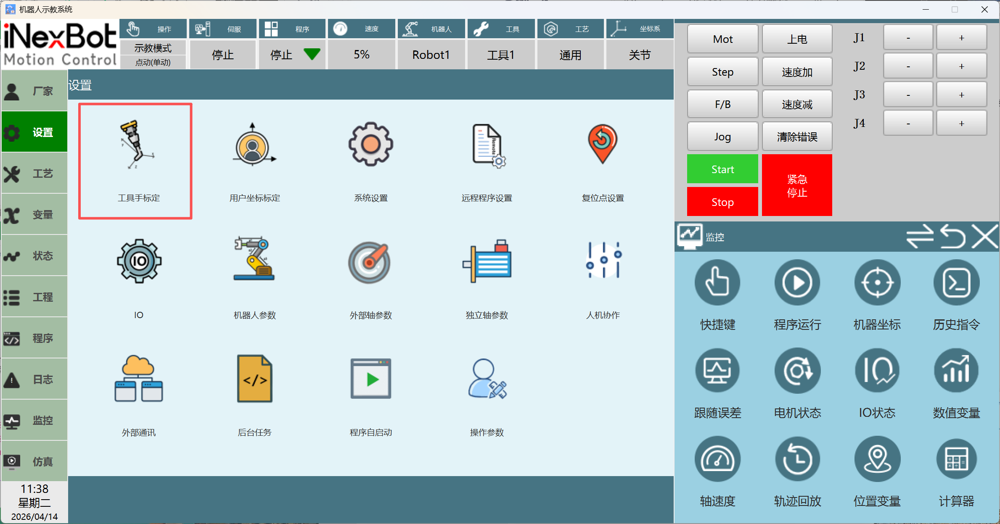

第二步，在**无工具手**状态下点击【工具标定】。

第三步，四轴scara机器人标定工具手使用2点法。

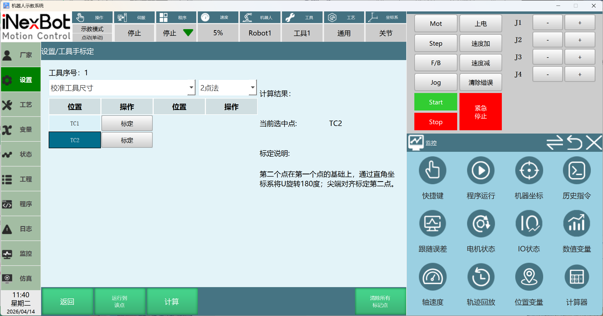

第四步，TC1为空间内任意一点，工具手与外部工具手尖对尖点击**标定**。

第五步，TC2为TC1的基础上点动直角坐标系下的U轴至180°（需在【操作参数】中修改**姿态值**为角度值才可看到度数）后，移动XYZ轴使工具手与外部工具手尖对尖点击**标定**。

第六步，两点标定后点击**计算**。

第七步，选中标定好的工具手。

1. 标定用户坐标系。

若使用工具手，在标定用户坐标时，需选中工具手，带着工具手进行标定用户坐标（标定的用户坐标须在同一水平面上，即Z值须一致）。

标定用户坐标系时，需注意标定方向。建议标定后，将机器人坐标系设置为用户坐标，点动UZ看一下抬高的方向；有时标定的方向反了，会导致抬高的方向是负数。

第一步，点击【设置】-【用户坐标标定】

第二步，选中需要标定的用户坐标编号。

第三步，点击【用户标定】

第四步，标定用户坐标原点和XY轴方向（标定的用户坐标须在同一水平面上，即Z值须一致，若点击标记后Z轴不一致，可以点击**修改**，手动填写相同的Z值）。

第五步，点击**计算**。

1. 点击**程序参数**，输入程序名称，选择指令类型为**TCP**，选择工具手编号为标定的工具手，选择用户坐标系为标定的用户坐标系。填写正确的需要使用的速度、平滑度、加速度、减速度、抬起高度、抬起速度（若使用抬起高度需要打开"是否插入抬升点"开关）。

1. 点击**生成**，生成的作业文件存放在**工程**中，打开作业文件运行。

**生成的作业文件点位与用户坐标系标定时的手系一致**，即使用左手标定用户坐标时，作业文件中的点位手系为左手；使用右手标定用户坐标时，作业文件中的点位手系为右手。

循环运行作业文件时，需手动在程序第一行或最后一行插入关节坐标下的点到点指令，回到安全位置（安全点设置好后需要运行看一下轨迹是否正确，若安全点设置不合理会导致关节超限，运行轨迹异常）。

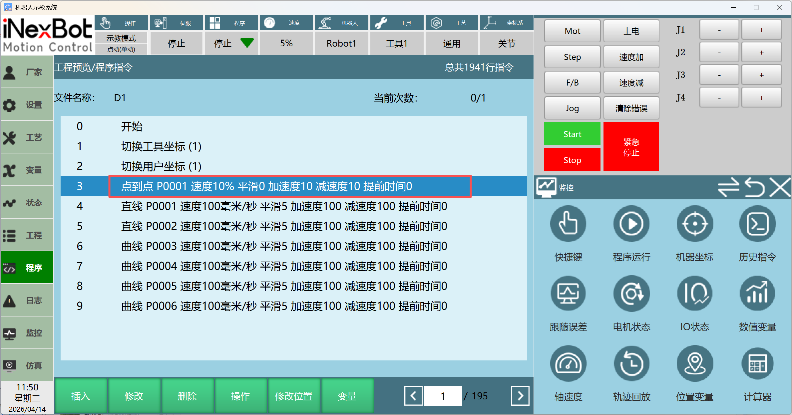

**注：**

生成TCP作业文件，运行时法兰中心（工具手中心）沿DXF轨迹进行运动；生成外部TCP文件，运行时工件（DXF轨迹）中的每一个点都经过用户坐标原点。

使用**外部TCP**生成整圆轨迹时，轨迹的结束点是起始点相对于圆心进行中心对称的位置，如下图。

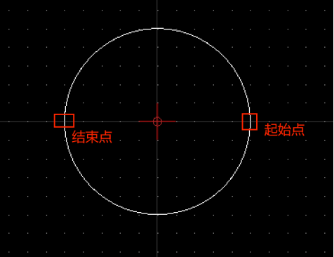

使用**外部TCP**生成整圆或圆弧轨迹时，由于移动距离小，姿态变化大，运行速度会过快，需要手动修改指令速度。生成圆弧轨迹时，若出现动态限位超限报错，可手动在【变量】中将用户坐标修改为关节坐标，如下图。

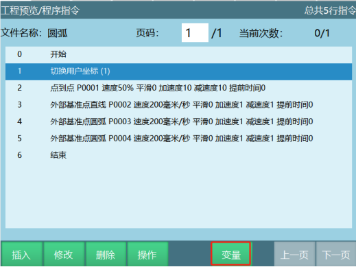

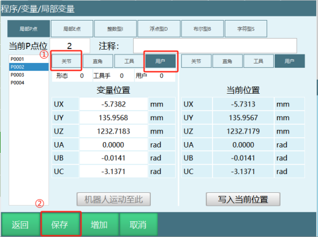

若CAD绘制的DXF图形中有直角，建议在直角两边插入距离较近的点，如下图。

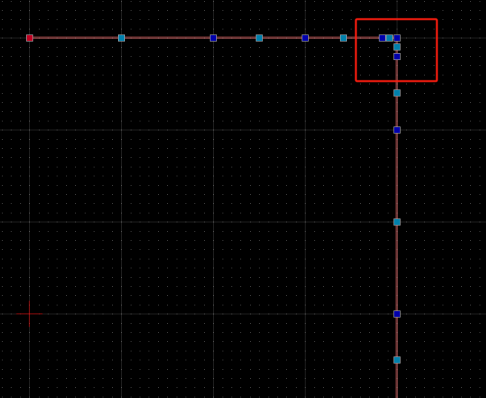

## CAD使用注意事项

1. 使用CAD制图后，必须使用dxf格式保存。
2. 使用CAD制图时，可以使用直线、圆弧、多线段、样条曲线、整圆等图元，但一个文件尽量使用同一个图元绘制**一段**完整的轨迹。
3. 若分段绘制会对机器人运行轨迹造成影响（分段绘制，机器人按照DXF文件中图形的描画顺序运行每一段）。

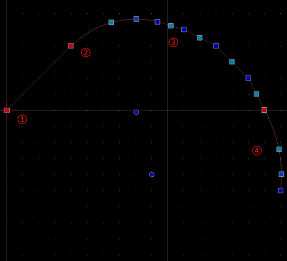

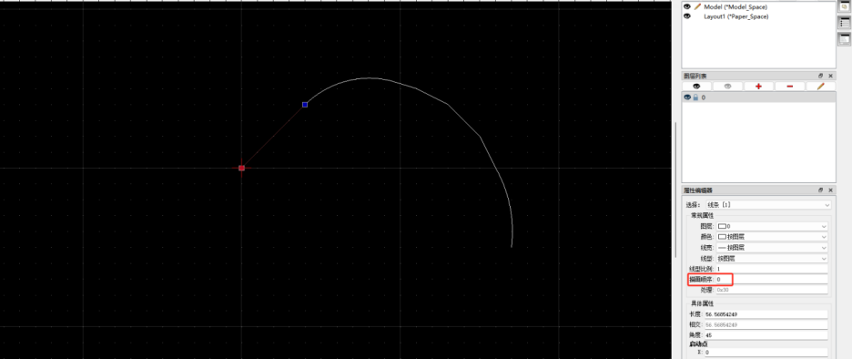

如上图所示，若生成作业文件时填写了抬升高度，机器人将先抬升-运行直线①-再次抬升-运行圆弧②-再次抬升-运行多段线③-再次抬升-运行圆弧④。

1. 若使用多个图元绘制，机器人运行时在两个图元相接处会不连贯，生成作业文件时，如果填写抬升高度，每段轨迹都会产生抬升；若不填写抬升高度，轨迹相接处也会产生卡顿，建议填写平滑值使其运行流畅。
2.  
   1. 若需要使用多个图元绘制一个图形，每段轨迹的开始点与结束点的方向需一致，即后一段轨迹的开头需与前一段轨迹的结尾相连。
3.  
   1. 在QCAD中，使用圆弧或者圆图元绘制时，圆弧和圆的轨迹运行都为逆时针。若使用多个图元绘制，需注意每段轨迹的起始点，上一段轨迹的终点应与下一段轨迹的起点为同一个点，圆弧的起点为该段圆弧轨迹逆时针的开始点。

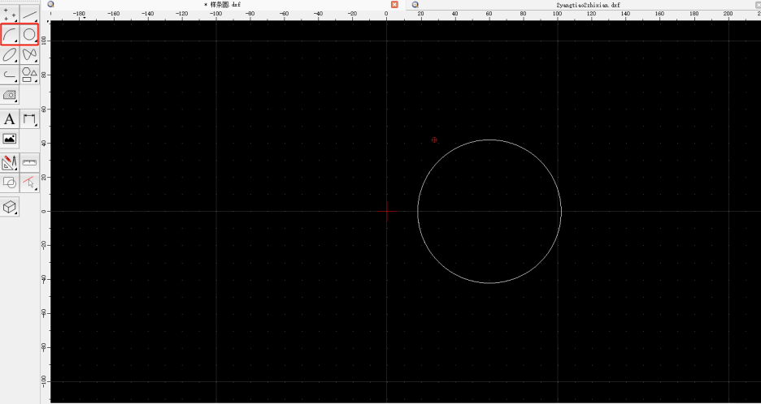

## AI 检索专用问答对 (Q&A for Retrieval)

**Q: DXF功能支持哪些图元类型？**

A: DXF功能支持读取直线、圆弧、多段线、样条曲线、整圆图元，其它图元暂不支持。

**Q: 如何正确准备DXF文件？**

A:

- 使用CAD软件绘制，导出文件时使用.dxf格式（建议使用QCAD制图软件）
- 工件与DXF文件须1：1还原，工件原点位置须与DXF文件中的图形原点对应
- 删除不需要的图形，尽可能简单，图形尽量是一条完整连续的轨迹
- 一个文件尽量使用同一个图元绘制一段完整的轨迹

**Q: 离散点参数的作用是什么？**

A: 离散点仅对样条曲线生效，离散点越高，生成的作业文件点位越多。其他支持的图元无需修改离散点，使用默认离散点即可，离散点值对其无效。目前支持离散点数值最高为5000。

**Q: 如何打开DXF文件？**

A:

- 示教器插入U盘（最好使用FAT32类型U盘）
- 填写需要的离散点（仅对样条曲线生效）
- 点击【打开】按钮
- 在弹窗内选择相应的DXF文件
- 点击【确定】

**Q: TCP和外部TCP有什么区别？**

A:

- 生成TCP作业文件：运行时法兰中心（工具手中心）沿DXF轨迹进行运动
- 生成外部TCP文件：运行时工件（DXF轨迹）中的每一个点都经过用户坐标原点

**Q: 使用外部TCP时需要注意什么？**

A:

- 使用外部TCP生成整圆轨迹时，轨迹的结束点是起始点相对于圆心进行中心对称的位置
- 使用外部TCP生成整圆或圆弧轨迹时，由于移动距离小，姿态变化大，运行速度会过快，需要手动修改指令速度
- 生成圆弧轨迹时，若出现动态限位超限报错，可手动在【变量】中将用户坐标修改为关节坐标

**Q: 如何正确标定工具手和用户坐标系？**

A:

- 工具手标定：在无工具手状态下点击【工具标定】，使用2点法进行标定，最后点击【计算】
- 用户坐标系标定：若使用工具手，需选中工具手，带着工具手进行标定用户坐标，标定的用户坐标须在同一水平面上（Z值须一致）

**Q: 如何循环运行生成的程序？**

A: 可在程序第一行或最后一行添加一个关节坐标下的点到点指令作为安全点，安全点设置好后需要运行看一下轨迹是否正确，若安全点设置不合理会导致关节超限，运行轨迹异常。

**Q: 为什么生成的作业文件运行轨迹与预期不符？**

A: 可能的原因包括：

- 工具手未正确标定
- 用户坐标系未正确标定
- DXF文件中存在杂乱图形或分段绘制
- 离散点设置不合理
- 抬升高度设置不当

**Q: 使用多个图元绘制时需要注意什么？**

A:

- 每段轨迹的开始点与结束点的方向需一致，即后一段轨迹的开头需与前一段轨迹的结尾相连
- 在QCAD中，使用圆弧或者圆图元绘制时，圆弧和圆的轨迹运行都为逆时针
- 若使用多个图元绘制，需注意每段轨迹的起始点，上一段轨迹的终点应与下一段轨迹的起点为同一个点
- 若生成作业文件时填写了抬升高度，机器人会在每段轨迹前后进行抬升
- 若不填写抬升高度，轨迹相接处可能会产生卡顿，建议填写平滑值使其运行流畅

