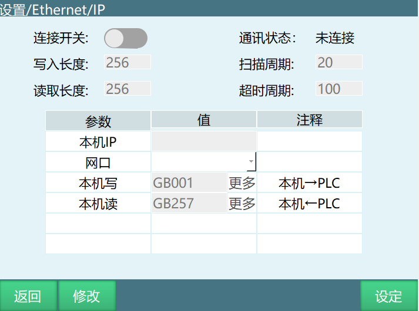
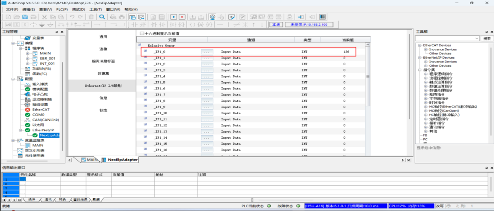
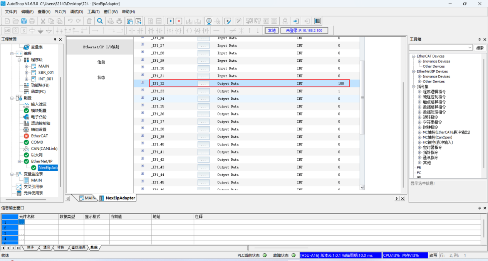
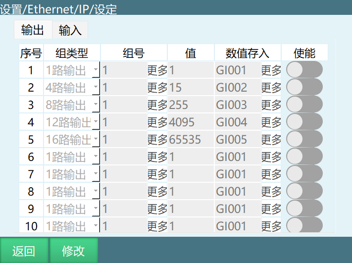
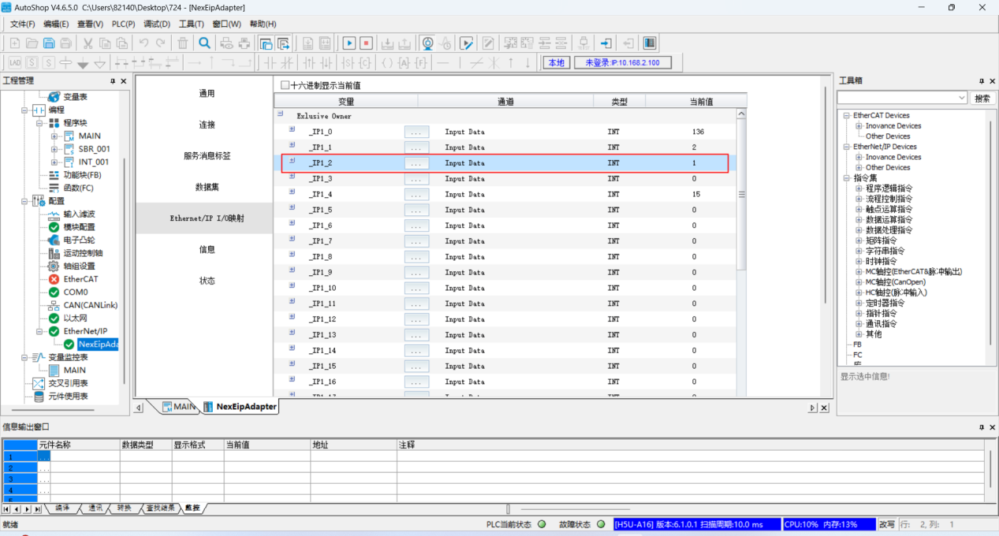
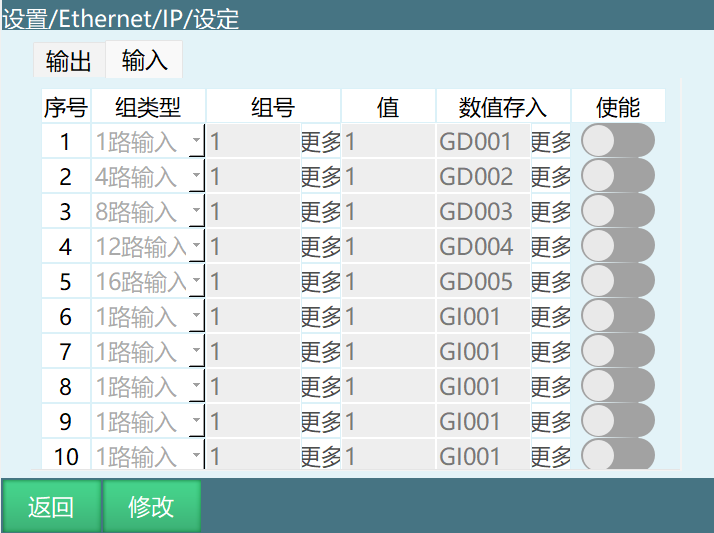
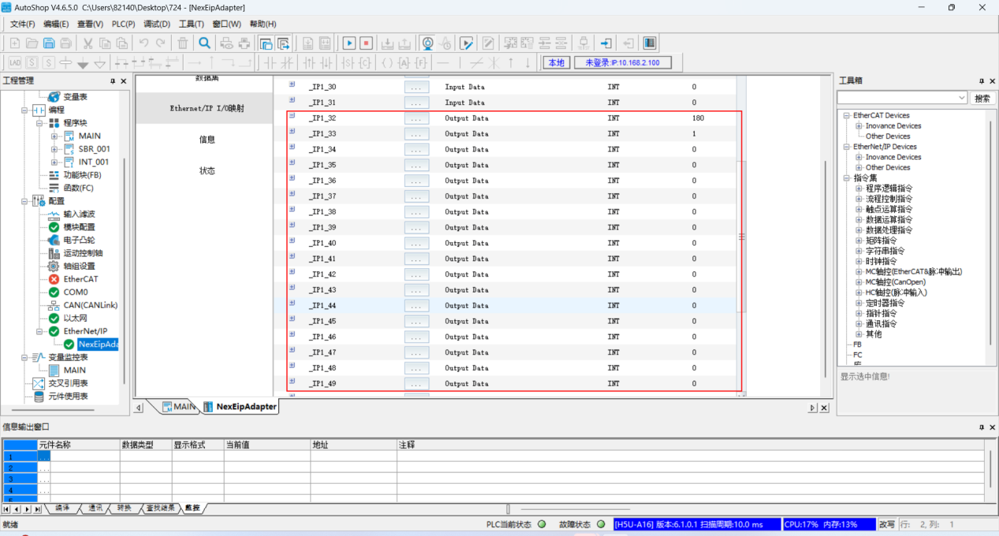
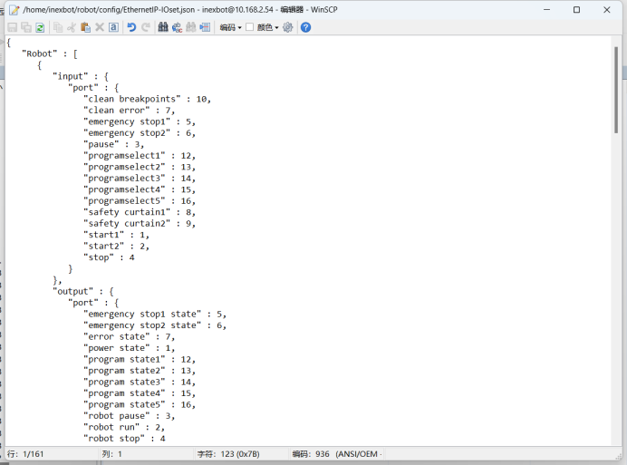

# EIP功能操作说明

## EIP主界面

**连接开关：**打开开关后，控制器可被plc扫描到。

**通讯状态：**根据控制器和plc是否连接成功，分为已连接和未连接两种状态。

**写入长度：**最长为256位，最短为16位。（前十六个端口做有功能，具体功能可看EIP.xlsx表格）

**读取长度：**最长为256位，最短为16位。（前十六个端口做有功能，具体功能可看EIP.xlsx表格）

**扫描周期：**控制器的扫描间隔,应该小于PLC端设置的RIP。

**超时周期：**范围为100\--1000ms。

**本机IP：**控制器IP地址，会自动识别，不能手填。

**网口：**这个网口是选择EIP通信的网口,如果是多网口（两个网口以上）设备建议让EIP通信和示教器网口分开。

**本机写：**本机的一些状态，写入到plc中。数据由GB001开始依次存入全局布尔型变量中。起始变量可自行填写，但是变量长度必须大于或者等于写入长度。

**本机读：**plc写入控制器，由GB257依次存入全局布尔型变量中。起始变量可自行填写，但是变量长度必须大于或者等于写入长度。

***注：本机读写的变量不能重叠，且变量编号必须大于写入长度或者读取长度。***

## 设定界面

### 设定界面-输出界面

**输出界面：**将数值写入plc中，为AutoShop软件中Input Data部分。

**序号：**目前只有十组。

**组类型：**目前有1路输出、4路输出、8路输出、12路输出、16路输出。

**数值存入：**将值部分的数值，存入到全局整型变量和全局浮点型变量内。

**使能：**当开关处于打开状态时，该功能才生效，反之不生效。

由于各路输出组号和值，可填范围不一致，所以在此详细写出。

**1路输出：**一个端口为一组，一共256组。

组号：由17开始，前十六个端口中做有功能。

值：数值为0或者1。

**4路输出：**4个端口为一组，一共64组。

组号：由5开始，前十六个端口中做有功能。

值：数值可填范围为0\--15。

**8路输出：**8个端口为一组，一共32组。

组号：由3开始，前十六个端口中做有功能。

值：数值可填范围为0\--255。

**12路输出：**12个端口为一组，一共22组左右。

组号：由2开始，前十六个端口中做有功能。

值：数值可填范围为0\--4095。

**16路输出：**16个端口为一组，一共16组。

组号：由2开始，前十六个端口中做有功能。

值：数值范围为0\--65535。

***注：各路输出，占用的端口不能一样，否则序号排前的数值，会被序号排后的数值覆盖。***

### 设定界面-输入界面

**输入界面：**由plc写入控制器中，为AutoShop软件中Output Data部分。

**序号：**目前只有十组。

**组类型：**目前有1路输入、4路输入、8路输入、12路输入、16路输入。

**数值存入：**将值部分的数值，存入到全局整型变量或者全局浮点型变量内。

**使能：**当开关处于打开状态时，该功能才生效，反之不生效。

由于各路输入组号和值，可填范围不一致，所以在此详细写出。

**1路输入：**一个端口为一组，一共256组。

组号：由17开始，前十六个端口中做有功能。

值：数值为0或者1。

**4路输入：**4个端口为一组，一共64组。

组号：由5开始，前十六个端口中做有功能。

值：数值可填范围为0\--15。

**8路输入：**8个端口为一组，一共32组。

组号：由3开始，前十六个端口中做有功能。

值：数值可填范围为0\--255。

**12路输入：**12个端口为一组，一共21组左右。

组号：由2开始，前十六个端口中做有功能。

值：数值可填范围为0\--4095。

**16路输入：**16个端口为一组，一共16组。

组号：由2开始，前十六个端口中做有功能。

值：数值范围为0\--65535。

***注：输入输出界面的数值存入，变量不能填写的一样，避免数值被覆盖。***

前十六个端口可自定义，可去后台的robot目录下的config文件夹内EthernetIP-IOset.json文件进行修改。

代码后的数字代表的是端口。

\"input\" : {

            \"port\" : {

               \"clean breakpoints\" : 10,      //清除断点

               \"clean error\" : 7,              //清错

               \"emergency stop1\" : 5,         //紧急急停1

               \"emergency stop2\" : 6,         //紧急急停2

               \"pause\" : 3,                    //暂停

               \"programselect1\" : 12,         //程序1

               \"programselect2\" : 13,         //程序2

               \"programselect3\" : 14,         //程序3

               \"programselect4\" : 15, //程序4

               \"programselect5\" : 16, //程序5

               \"safety curtain1\" : 8, //安全光幕1

               \"safety curtain2\" : 9, //安全光幕2

               \"start1\" : 1, //启动1

               \"start2\" : 2, //启动2

               \"stop\" : 4 //停止

            }

         },

         \"output\" : {

            \"port\" : {

               \"emergency stop1 state\" : 5,     //急停1状态

               \"emergency stop2 state\" : 6,     //急停2状态

               \"error state\" : 7,                //报错提示

               \"power state\" : 1,         //上电状态

               \"program state1\" : 12, //程序1输出

               \"program state2\" : 13, //程序2输出

               \"program state3\" : 14, //程序3输出

               \"program state4\" : 15, //程序4输出

               \"program state5\" : 16, //程序5输出

               \"robot pause\" : 3,           //机器人停止状态

               \"robot run\" : 2, //机器人运行状态

               \"robot stop" : 4  //机器人暂停状态
    }
}

##  AI 检索专用问答对 (Q&A for Retrieval)

**Q: EIP连接失败怎么办?**

A: 检查以下几点：1. 确保连接开关已打开；2. 检查网络连接是否正常，确保控制器和PLC在同一网段；3. 验证扫描周期设置是否合理，控制器的扫描间隔应小于PLC端设置的RIP；4. 检查超时周期设置是否在100-1000ms范围内；5. 确认网口选择是否正确，多网口设备建议让EIP通信和示教器网口分开。

**Q: 如何设置EIP的读写长度?**

A: EIP的写入长度和读取长度最长为256位，最短为16位。前十六个端口做有功能，具体功能可参考EIP.xlsx表格。设置时需要确保起始变量的长度大于或等于写入长度或读取长度，且本机读写的变量不能重叠。

**Q: 如何自定义前十六个端口的功能?**

A: 可以通过修改后台robot目录下的config文件夹内的EthernetIP-IOset.json文件来自定义前十六个端口的功能。在该文件中，可以修改输入和输出端口的功能映射，代码后的数字代表的是端口号。

**Q: 输出界面的组类型有哪些？如何选择?**

A: 输出界面的组类型有：1路输出、4路输出、8路输出、12路输出、16路输出。选择时需要根据实际需要传输的数据位数来确定：1路输出用于单个布尔值，4路输出用于0-15的数值，8路输出用于0-255的数值，12路输出用于0-4095的数值，16路输出用于0-65535的数值。

**Q: 输入输出界面的数值存入变量有什么要求?**

A: 输入输出界面的数值存入变量不能填写相同的变量名，避免数值被覆盖。对于输出界面，数值会存入全局整型变量和全局浮点型变量内；对于输入界面，数值会存入全局整型变量或者全局浮点型变量内。
