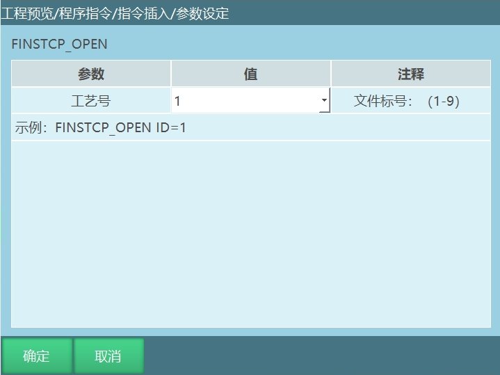
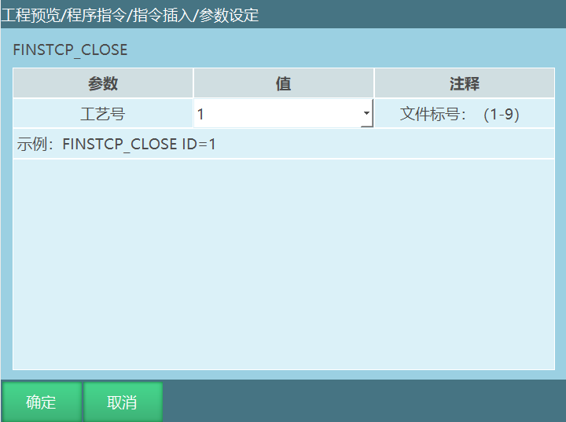
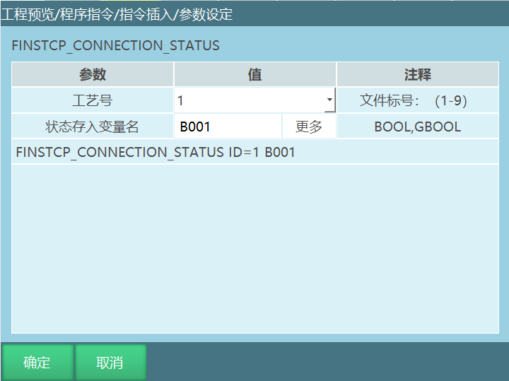
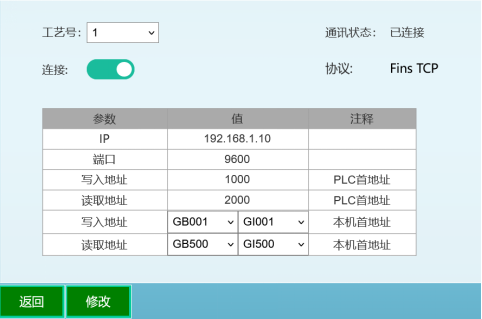
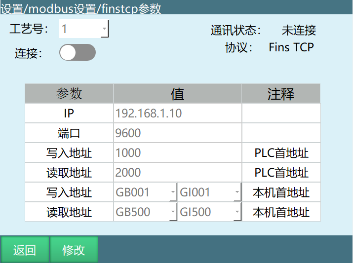

# FINSTCP使用手册

## 功能介绍

FINSTCP功能是一种通讯协议，用于控制器与欧姆龙PLC之间进行数据交互。通过FINSTCP，控制器可以与PLC交换各种数据，实现两者之间的实时通讯。

### 应用场景

- 工业自动化生产线中，PLC控制机器人的运行
- 机器人与PLC之间的状态数据交换
- 通过PLC对机器人进行远程控制
- 实现机器人与其他自动化设备的协同工作

## 系统要求

### 硬件要求

- 欧姆龙PLC（支持FINSTCP协议）
- 控制器（支持FINSTCP功能）
- 网线（用于连接PLC、控制器和电脑）
- 电脑（用于运行CX-Programmer软件）

### 软件要求

- CX-Programmer软件（欧姆龙PLC编程软件）
- 控制器固件（支持FINSTCP功能）

## FINSTCP指令

### FINSTCP_OPEN-打开FINSTCP连接

该指令用于在运行模式下打开FINSTCP通讯连接，工艺号绑定是FINSTCP参数工艺号。

### FINSTCP_CLOSE-断开FINSTCP连接

该指令用于在运行模式下断开FINSTCP通讯连接，工艺号绑定是FINSTCP参数工艺号。

### FINSTCP_CONNECTION_STATUS-获取FINSTCP连接状态

该指令将FINSTCP的连接状态存在BOOL/GBOOL变量中，通过获取变量的数值来判断FINSTCP的连接状态，每运行一次该指令就获取一次状态。

## FINSTCP参数

工艺号：一共有9个工艺号可选。（此功能内的工艺号不可用，不管是工艺号几，都只有一份填写的参数生效）。

连接：FinsTCP设置完成后需打开连接按钮，此连接按钮也可以通过打开FINSTCP连接、断开FINSTCP连接指令进行打开和关闭，右侧通讯状态可查看连接状态。

IP：PLC设备IP地址。

端口：PLC设备端口。

写入地址：PLC的写入地址。

读取地址：PLC的读取地址。

写入地址：控制器的写入地址。由PLC读取来自控制器的数据，写入到PLC中，可在示教器中对该数值进行修改。

读取地址：控制器的读取地址。控制器读取PLC写入的数据，存入到控制器的全局布尔变量与全局整数型变量中，该数值不能通过示教器进行修改，可通过CX-Programmer软件写入。

注：PLC的写入地址与读取地址数值不能设置成一样的数值，同时控制器的写入地址与读取地址中的变量也不能选相同的变量。

## FINSTCP功能的使用

FINSTCP功能概述:FINSTCP功能可使控制器与PLC之间进行数据的交互。

注：此功能只适用于欧姆龙PLC。

### 使用流程

示例说明：

1.  连接PLC、控制器和电脑------设置finstcp参数------打开CX-Programmer软件进行写入与读取操作

2.  连接PLC、控制器和电脑,用网线将PLC、控制器、电脑连接起来，电脑上需要安装CX-Programmer软件。

3.  设置finstcp参数，在"设置\--modbus设置\--finstcp参数"中设置相关参数。

IP地址写PLC的地址192.168.1.10，端口写PLC的端口9600，写入地址写CX-Programmer软件的PLC内存的1000，读取地址写CX-Programmer软件的PLC内存的2000,写入地址写GB001和GI001,读取地址写GB500和GI500。

### Finstcp参数说明

连接：FinsTCP设置完成后需打开连接按钮，此连接按钮也可以通过打开FINSTCP连接、断开FINSTCP连接指令进行打开和关闭，右侧通讯状态可查看连接状态。

IP：PLC设备IP地址。

端口：PLC设备端口号。

写入地址：CX-Programmer软件的PLC内存的1000。

说明：从GB001开始依次写入来自CX-Programmer软件的子单位，前十六个布尔型变量是通过获取控制器的状态来填写的。

从GI001开始依次写入来自CX-Programmer软件的单位，前六个整型变量是机器人当前直角坐标的数值，其余的数值就是控制器自身的数值。以上数值均是由CX-Programmer软件从控制器获取的数值。

读取地址：CX-Programmer软件的PLC内存的2000。

说明：从GB500开始的变量的数值是由CX-Programmer软件写入的，前十六个变量写入数值来控制控制器。

从GI500开始的数值是由CX-Programmer软件写入的。以上数值只能通过CX-Programmer软件写入。

注：一个单位=16个子单位，子单位均写入布尔变量中，单位均写入整型变量中。

### CX-Programmer软件操作

打开CX-Programmer软件，点击文件，选择新建，弹窗内的内容不做修改点击确定，双击内存，打开内存界面，然后双击D打开一个表格界面，然后点击监视按钮，表格界面就会出现数值，首地址填写1000，点击二进制，表格里面的数值就是子单位数值，控制器与PLC连接起来后，表格中9下面的数值会不断的在1和0之间转换，点击有符号十进制数后，表格里面的数值就是单位数值。当要从CX-Programmer软件写入时，需要将新建界面的只读按钮关闭，然后就可以从软件中写入数值。

### 控制器地址说明

1.  控制器写入地址中的全局布尔型变量

  全局布尔型变量中前128个变量的数值，是PLC读取控制器获取的。

  这128个变量的前16个变量的数值，是根据控制器的状态获取的。

  控制器是运行模式时，这16个变量中第2个变量的数值为1，否则为0

  控制器是远程模式时，这16个变量中第3个变量的数值为1，否则为0

  控制器伺服就绪时，这16个变量中第4个变量的数值为1，否则为0

  控制器急停时，这16个变量中第6个变量的数值为1，否则为0

  控制器中程序运行时，这16个变量中第8个变量的数值为1，否则为0

  控制器中程序暂停时，这16个变量中第9个变量的数值为1，否则为0

  控制器与PLC通讯连接上后，这16个变量中第10个变量的数值为跳动状态在1与0之间不断跳动。（当这个数值处于不断跳动的状态时，说明控制器与PLC连接成功。）

  控制器与PLC通讯状态连接时，这16个变量中第11个变量的数值为1此数值不会发生变化。

  控制器处于示教模式时，这16个变量中第12个变量的数值为1，否则为0

  全局布尔型变量中第16个到第128个变量的数值，这些变量的数值就是控制器自身的全局布尔型变量的数值，也是被PLC读取的数值，这些变量的数值可通过示教器直接进行修改和填写。

2.  控制器写入地址中的全局整数型变量

  控制器写入地址中全局整数型变量的前6个变量的数值，表示的是机器人坐标位置的数值。

  第6个变量到第40个变量,显示的数值是控制器全局整数型变量的数值，这些变量的数值可通过示教器进行修改和填写。

3.  控制器读取地址中的全局布尔型变量

  读取地址中全局布尔型变量的前128个变量的数值，是由PLC写入的数值。

  变量中的第2个变量PLC写入数值为1时，控制器伺服就绪（若不将该数值改为0，则控制器会一直处于伺服就绪状态。）

  变量中的第4个变量PLC写入数值为1时，控制器主程序开始运行（控制器需要处于运行模式。）

  变量中的第5个变量PLC写入数值为1时，控制器主程序运行暂停（控制器需要处于运行模式。）

  变量中的第7个变量PLC写入数值为1时，控制器的报警小白条被清除，与清错按钮的效果一致。

4.  控制器读取地址中的全局整数型变量

  读取地址绑定的整数型变量中，前81个变量的数值就是PLC写入的数值。此数值需要通过PLC进行修改和填写。

## 常见问题解答

### Q1: FINSTCP功能支持哪些PLC？

**A1:** FINSTCP功能仅适用于欧姆龙PLC，不支持其他品牌的PLC。

### Q2: 如何判断控制器与PLC是否连接成功？

**A2:** 当控制器与PLC通讯连接上后，全局布尔型变量中第10个变量的数值会在1与0之间不断跳动，说明连接成功。

### Q3: 为什么PLC的写入地址与读取地址不能设置成一样的数值？

**A3:** 如果设置成相同的数值，会导致数据冲突，影响通讯的正常进行。

### Q4: 如何通过PLC控制控制器的运行？

**A4:** 在控制器读取地址中的全局布尔型变量中，第4个变量PLC写入数值为1时，控制器主程序开始运行（控制器需要处于运行模式）。

### Q5: 如何通过PLC清除控制器的报警？

**A5:** 在控制器读取地址中的全局布尔型变量中，第7个变量PLC写入数值为1时，控制器的报警小白条被清除，与清错按钮的效果一致。

### Q6: 为什么控制器读取地址中的变量不能通过示教器修改？

**A6:** 控制器读取地址中的变量是由PLC写入的，为了保证数据的一致性，这些变量不能通过示教器修改，只能通过PLC进行修改。

## 注意事项

1. FINSTCP功能仅适用于欧姆龙PLC，不支持其他品牌的PLC
2. PLC的写入地址与读取地址数值不能设置成一样的数值
3. 控制器的写入地址与读取地址中的变量也不能选相同的变量
4. 控制器读取地址中的变量不能通过示教器修改，只能通过PLC进行修改
5. 使用FINSTCP功能前，需要确保PLC和控制器在同一网络中
6. 当修改FINSTCP参数后，需要重新打开连接才能使新参数生效
7. 在使用过程中，如果遇到通讯问题，可以检查网络连接和参数设置是否正确
8. 定期检查通讯状态，确保FINSTCP连接正常
