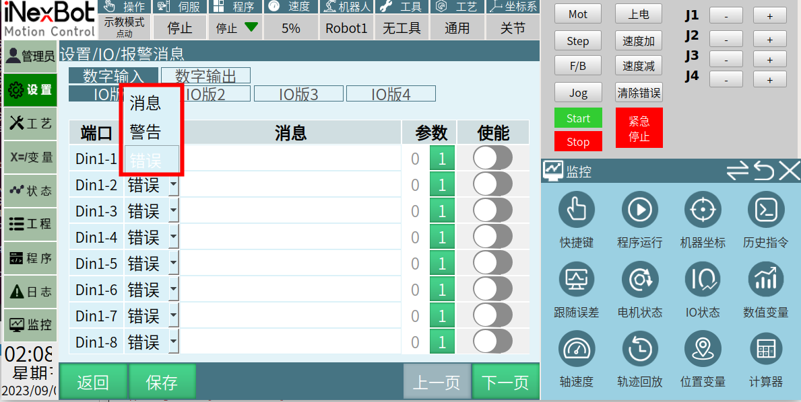
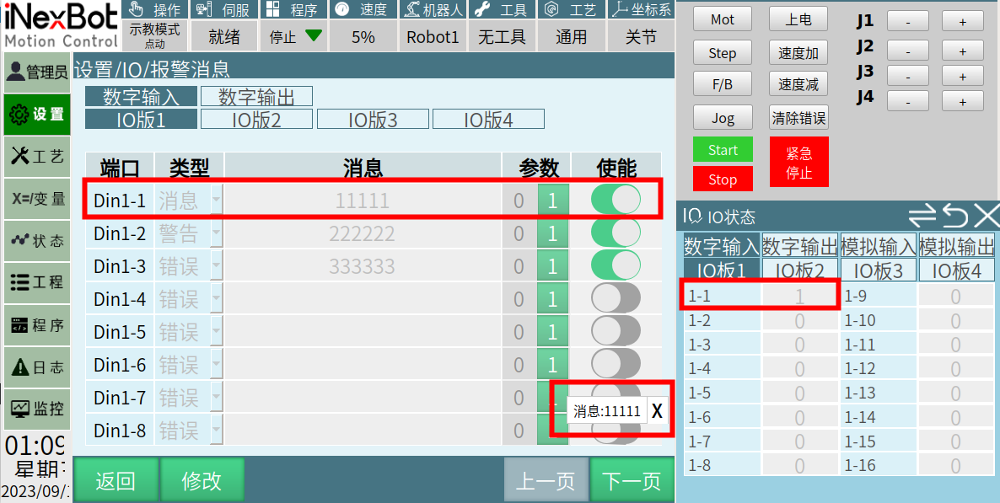
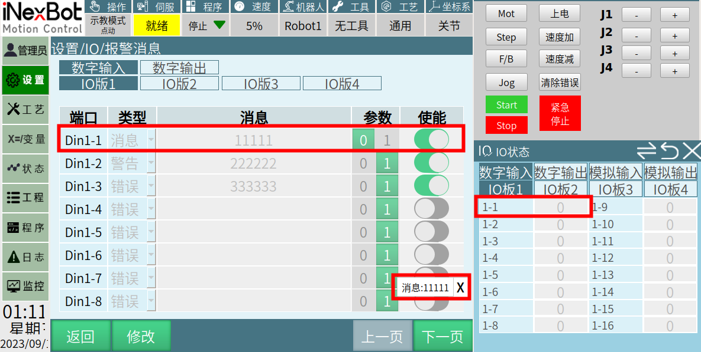
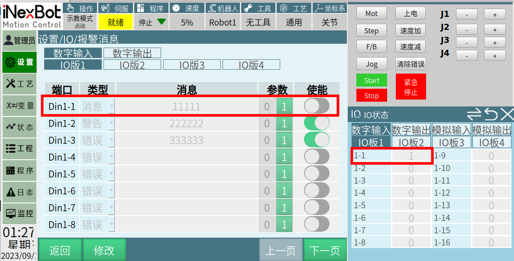

# io报警信息 

点击【设置】，选择【io报警信息】进入界面

- 【端口】io端口

- 【类型】io报警信息输出的类型，（消息，警告，错误）

- 【消息】触发io报警后输出的内容

- 【参数】当设置为0时，io端口状态为0时触发报警信息

- 当设置为1时，io端口状态为1时触发报警信息

- 【使能】当关闭使能开关后，不会触发io报警信息

当打开使能开关后，打开相应io会触发报警信息

1.  以下第一部分以报警信息为消息为例，对于参数设置为0/1，使能打开/关闭的详细介绍

当端口选择Din1-1；类型选择：消息；消息：11111；参数：1；使能：打开

当端口选择Din1-1；类型选择：消息；消息：11111；参数：0；使能：打开

当端口选择Din1-1；类型选择：消息；消息：11111；参数：1；使能：关闭。（当使能关闭时无论io什么状态都不会触发报警信息）

2.  报警类型的介绍

- 类型选择为：消息

当输出Din1-1为1时，触发io报警功能，在界面的右下角会显示小白条显示用户所输入在消息框中的信息，如下图：

- 类型选择为：警告

当输出Din1-2信号时，触发io报警功能，在界面的右下角会显示小黄条显示用户所输入在消息框中的信息，如下图：

- 类型选择为：错误

当输出Din1-3信号时，触发io报警功能，在界面的右下角会显示小红条显示用户所输入在消息框中的信息，若触发该报警时机器人正在运行，会使机器人强制下使能，如下图：

## AI 检索专用问答对 (Q&A for Retrieval)

**Q：错误类型报警会影响机器人运行吗？**

A：会，触发错误报警时机器人会强制下使能并停止。

**Q：消息、警告、错误三种类型有什么区别？**

A：消息：右下角白色提示条

警告：右下角黄色提示条

错误：右下角红色提示条，且会让机器人强制下使能

**Q：使能关闭会怎样？**

A：关闭使能后，无论 IO 状态如何，都不会触发报警。