# 控制器安装LUA教程

1.C1102脚本安装教程如下：

(1)该方式仅限于RTL-22.07.05及以上的版本使用

(2)将如下脚本以及压缩包通过在示教器版本升级页面，采用上传文件将其上传

(3)上传成功后，手动重启两次系统即可

(4)打开程序，插入lua语句指令，写入任意内容，单步该指令，未报错：此控制器未安装lua环境，则表示该lua已安装完成

2.C1102手动安装教程如下：

(1)将local.tar.gz压缩包放至U盘的upgrade路径下，在示教器版本升级页面，采用上传文件将该文件上传

(2)利用putty进入控制器后台，依次输入以下命令：将local.tar.gz文件复制至/home/inexbot路径下并解压

(3)在/etc/init.d/rc.local 文件，增加自启动环境变量 :/home/inexbot/local/bin

(4)重启控制器，后台打印：lua lib open ok

2.驱控一体安装LUA教程如下：

（1）打开控制器后台在/root/local下新建文件夹lib

（2）将lua5.2.so放在lib文件夹下（lua5.2.so存放于share\\192.168.0.79Z:\02控制器\lua目录下）

（3）lua5.2.so放入后重启控制器即可正常使用LUA

3.T5安装LUA教程如下：

注释：RTL-24.03.16版本及以上"liblua5.2.so“更改为”liblua.so”再进行上传操作

（1）目前仅做到24.03.07的下一版本上和dev6.5.9版本上

（2）liblua5.2.so文件放到U盘upgrade目录下通过示教器上传

（3）上传成功会提示消息：liblua5.2.so上传成功，请重启控制器

（4）重启控制器后，新建程序，插入lua语句指令，写入任意内容，单步该指令，未报错：此控制器未安装lua环境，则表示该lua已安装完成

## 使用示例

1.控制器作为服务器

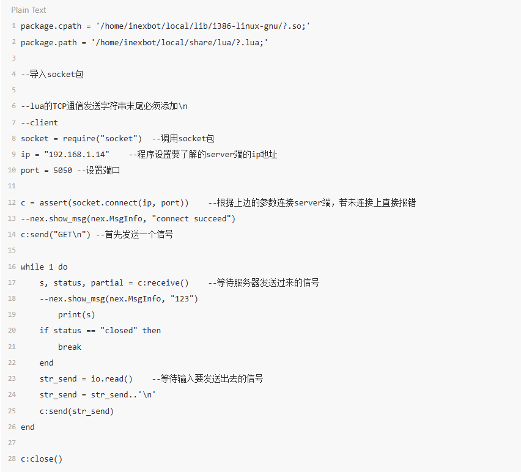

package.cpath = '/home/inexbot/local/lib/i386-linux-gnu/?.so;'

package.path = '/home/inexbot/local/share/lua/?.lua;'

--导入socket包

--lua的TCP通信发送字符串末尾必须添加\n

--client

socket = require("socket")  --调用socket包

ip = "192.168.1.14"    --程序设置要了解的
server端的ip地址

port = 5050 --设置端口
 
c = assert(socket.connect(ip, port))    --根据上边的参数连接server端，若未连接上直接报错

--nex.show_msg(nex.MsgInfo, "connect succeed") 

c:send("GET\n") --首先发送一个信号
 
while 1 do

    s, status, partial = c:receive()    --等待服务器发送过来的信号

    --nex.show_msg(nex.MsgInfo, "123") 
	print(s)

    if status == "closed" then 

        break

    end

    str_send = io.read()    --等待输入要发送出去的信号

    str_send = str_send..'\n'

    c:send(str_send)

end
 
c:close()

2.控制器作为客户端

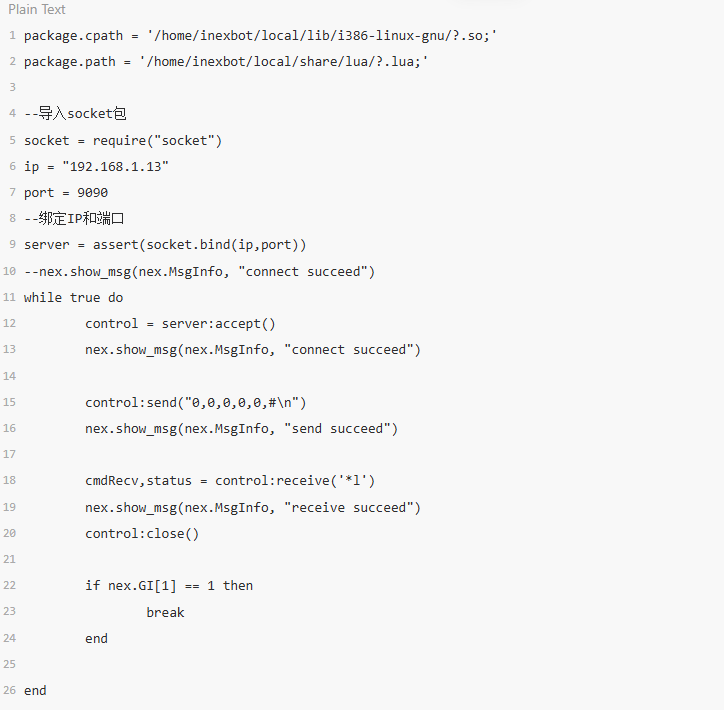

package.cpath = '/home/inexbot/local/lib/i386-linux-gnu/?.so;'

package.path = '/home/inexbot/local/share/lua/?.lua;'

--导入socket包

socket = require("socket")

ip = "192.168.1.13"

port = 9090

--绑定IP和端口

server = assert(socket.bind(ip,port))

--nex.show_msg(nex.MsgInfo, "connect succeed")

while true do

	control = server:accept()

	nex.show_msg(nex.MsgInfo, "connect succeed")
	
	control:send("0,0,0,0,0,#\n")

	nex.show_msg(nex.MsgInfo, "send succeed")
	
	cmdRecv,status = control:receive('*l')

	nex.show_msg(nex.MsgInfo, "receive succeed")

	control:close()
	
	if nex.GI[1] == 1 then

		break 

	end

end

3.将GP1的X值赋值给GE的X值

基础使用：将GP001的x值赋值给GE001的x值

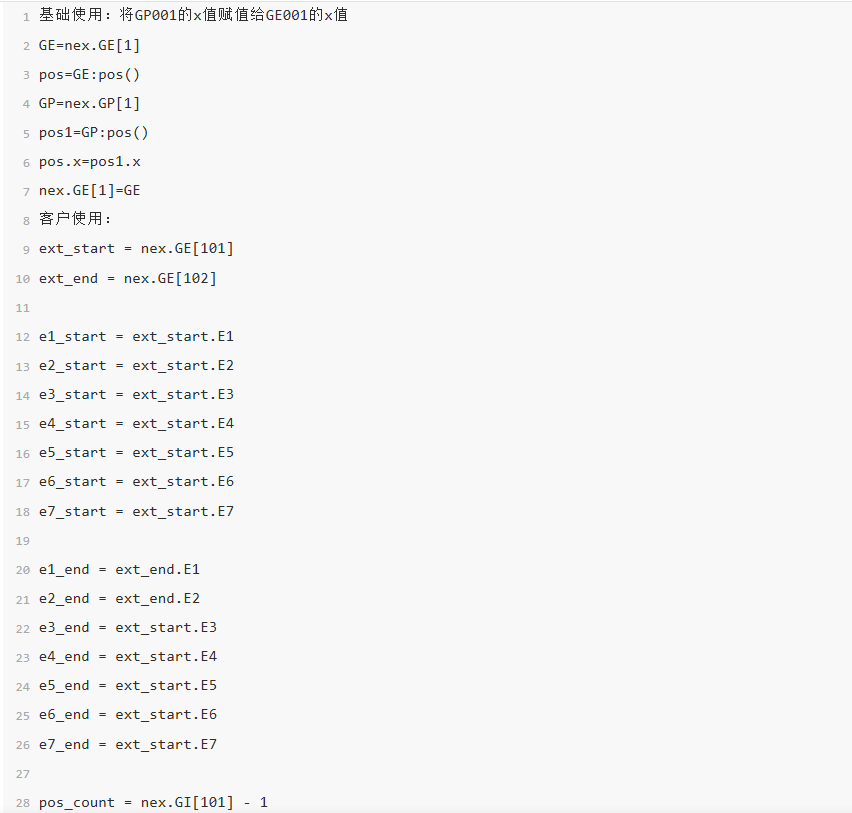 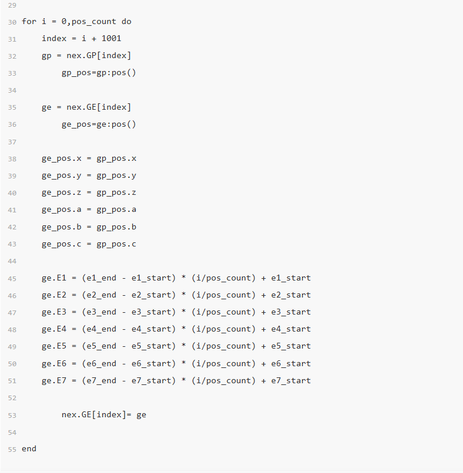

GE=nex.GE[1]

pos=GE:pos()

GP=nex.GP[1]

pos1=GP:pos()

pos.x=pos1.x

nex.GE[1]=GE

客户使用：

ext_start = nex.GE[101]

ext_end = nex.GE[102]

e1_start = ext_start.E1

e2_start = ext_start.E2

e3_start = ext_start.E3

e4_start = ext_start.E4

e5_start = ext_start.E5

e6_start = ext_start.E6

e7_start = ext_start.E7

e1_end = ext_end.E1

e2_end = ext_end.E2

e3_end = ext_start.E3

e4_end = ext_start.E4

e5_end = ext_start.E5

e6_end = ext_start.E6

e7_end = ext_start.E7

pos_count = nex.GI[101] - 1

for i = 0,pos_count do

    index = i + 1001

    gp = nex.GP[index]

	gp_pos=gp:pos()
	
    ge = nex.GE[index]

	ge_pos=ge:pos()

    ge_pos.x = gp_pos.x

    ge_pos.y = gp_pos.y

    ge_pos.z = gp_pos.z

    ge_pos.a = gp_pos.a

    ge_pos.b = gp_pos.b

    ge_pos.c = gp_pos.c
	
    ge.E1 = (e1_end - e1_start) * (i/pos_count) + e1_start

    ge.E2 = (e2_end - e2_start) * (i/pos_count) + e2_start

    ge.E3 = (e3_end - e3_start) * (i/pos_count) + e3_start

    ge.E4 = (e4_end - e4_start) * (i/pos_count) + e4_start

    ge.E5 = (e5_end - e5_start) * (i/pos_count) + e5_start

    ge.E6 = (e6_end - e6_start) * (i/pos_count) + e6_start

    ge.E7 = (e7_end - e7_start) * (i/pos_count) + e7_start
	
	nex.GE[index]= ge
	
end

### 指令使用

1.调用lua文件：CALL_LUAFILE:

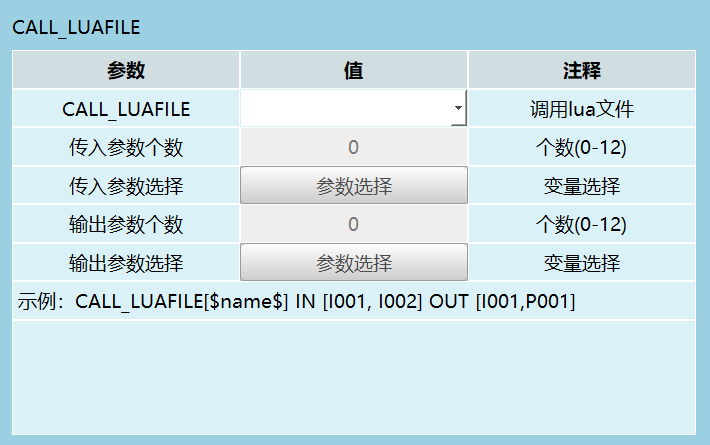

在示教器版本升级页面，采用上传文件上传demo.lua文件，上传的lua脚本会放置控制器后台：home/inexbot/robot/lua文件下

2.调用lua语句：CALL_LUASTRING

（1）修改全局数值变量

全局整数型：GI001=10  格式：nex.GI[1]=true

全局布尔型：GB001=1  格式: nex.GB[1]=1

全局浮点型：GD001=20  格式：nex.GD[1]=20

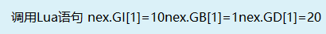

（2）修改局部数值变量

I001=12,B001=1,D001=12.12

nex.I[1]=12 nex.B[1]=1 nex.D[1]=12.12

注释：调用Lua语句时，参数值选择变量时，首先需要给字符型变量赋值，然后再调用lua语句

3.示教器打印信息

nex.show_msg(nex.MsgInfo, "消息")

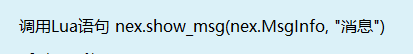

4.修改，设置延时参数

设置延时500毫秒：nex.delay_ms(500) 

5.获取全局/局部位置变量参数

GP1 = nex.GP[1]

P2 = nex.P[2]

6.修改全局/局部位置变量的修改 坐标系，单位制，形态，工具手，用户坐标

GP1.coord, GP1.unit, GP1.configuration, GP1.tool, GP1.user = 0,2,4,6,1

 P2.coord, P2.unit, P2.configuration, P2.tool, P2.user = 1,1,5,6,7

 6.获取机器人全局/局部点位的位置

 pos1=GP1:pos()

 pos1=P2:pos()

 7.修改机器人全局/局部点位

 nex.GP[1]=GP1 

 nex.P[2]=P2

 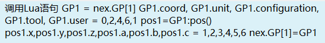  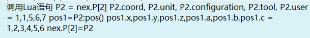

 7.获取全局/局部外部轴位置位置变量参数

 GE5 = nex.GE[5] 

 E1 = nex.E[1] 

 8.修改全局/局部外部轴位置位置变量的修改 坐标系，单位制，形态，工具手，用户坐标

 GE5.coord, GE5.unit, GE5.configuration, GE5.tool, GE5.user = 2,1,3,4,5

 E1.coord, E1.unit, E1.configuration, E1.tool, E1.user = 0,1,2,3,4

 8.获取机器人全局/局部外部轴点位的位置

 pos1=GE5:pos()

 pos1=E1:pos()

 9.修改机器人GE/E的位置数据

 pos1.x,pos1.y,pos1.z,pos1.a,pos1.b,pos1.c, = 1,2,3,4,5,6

 pos1.x,pos1.y,pos1.z,pos1.a,pos1.b,pos1.c,E1.E1,E1.E2 = 1,2,3,4,5,6,7,8

 10.修改外部轴的位置数据 E1，E2，E3，E4，E5

 GE5.E1,GE5.E2,GE5.E3,GE5.E4,GE5.E5 = 10,20,30,40,50  

 E1.E1,E1.E2,E1.E3,E1.E4,E1.E5 = 10,20,30,40,50  

 11.修改全局/局部外部轴位置位置变量

 nex.GE[5]=GE5 

 nex.E[1]=E1 

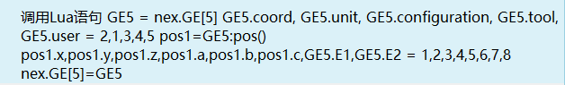  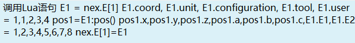

12.获取关节坐标、直角坐标、工具坐标和用户坐标系下的当前位置

Cur=nex.get_robot_current_pos(nex.ACS)  关节坐标系下当前位置

Cur=nex.get_robot_current_pos(nex.MCS)  直角坐标系下当前位置

Cur=nex.get_robot_current_pos(nex.PCS)  工具坐标系下当前位置

Cur=nex.get_robot_current_pos(nex.UCS)  用户坐标系下当前位置

13.获取当前机器人本体位置数据

pos=Cur:pos()

14.屏幕上打印当前位置数据

print("pos",pos.x,pos.y,pos.z,pos.a,pos.b,pos.c) 

15.屏幕上打印外部轴的当前位置数据 E1，E2，E3，E4，E5  （仅关节坐标系有外部轴数据）

print("Cur ext",Cur.E1,Cur.E2,Cur.E3,Cur.E4,Cur.E5) 

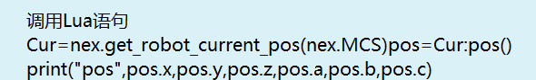  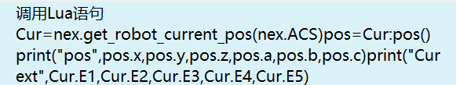

16.获取工具坐标值

T=nex.get_tool_frame(1)  “1”代表工具编号

print("tool",T.x,T.y,T.z,T.a,T.b,T.c) 

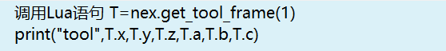

17.修改工具坐标值

T.x,T.y,T.z,T.a,T.b,T.c = 60,20,280,10,0,0  

nex.set_tool_frame(2, T)  --修改编号为2的工具坐标值

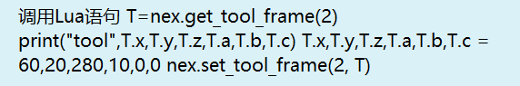

18.获取用户坐标值

U=nex.get_user_frame(1) “1”代表用编号为1的用户坐标

print("user",U.x,U.y,U.z,U.a,U.b,U.c) 

19.修改用户坐标值

U.x,U.y,U.z,U.a,U.b,U.c = 10,20,30,40,50,60

nex.set_user_frame(1, U)

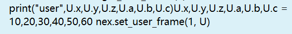

#### 控制器开放函数

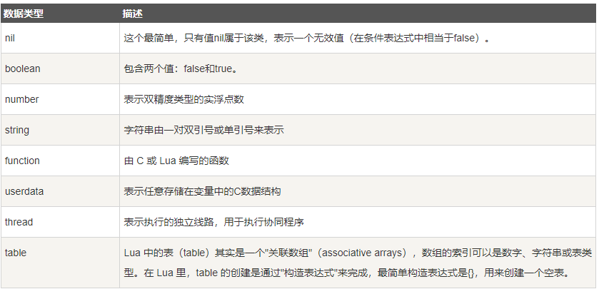

1.控制器状态类

（1）nex.get_controller_id()  作用：获取当前控制器ID

示例：A = nex.get_controller_id()  nex.log_info(A)

（2）nex.get_software_uptime_ms()  作用：控制器软件运行时间 

示例：T=nex.get_software_uptime_ms()  nex.show_msg(nex.MsgInfo,T)

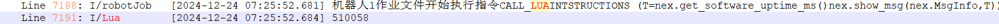

（3）nex.get_hardware_uptime_ms()  作用：控制器设备开机运行后的时间

示例：T1=nex.get_hardware_uptime_ms()  nex.show_msg(nex.MsgInfo,T1)

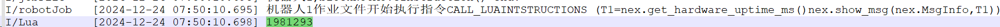

（4）nex.get_controller_sync_version()  作用：获取同步版本号

示例：Y=nex.get_controller_sync_version()  nex.show_msg(nex.MsgInfo,Y)

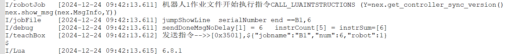
