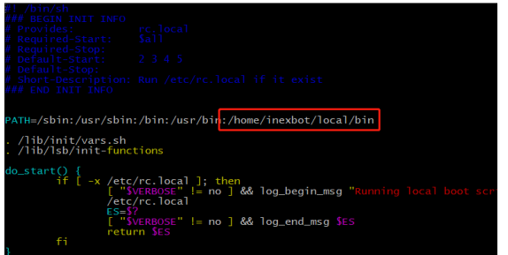
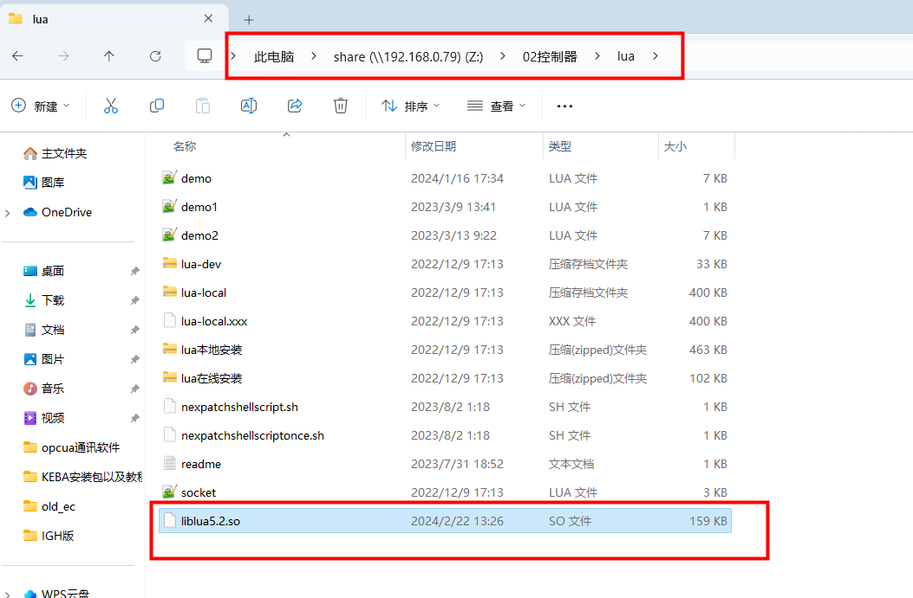
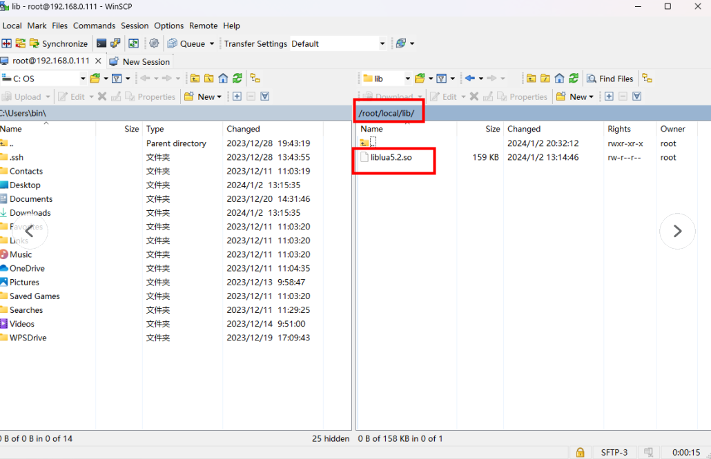

# 控制器安装LUA教程

1.C1102脚本安装教程如下：

(1)该方式仅限于RTL-22.07.05及以上的版本使用

(2)将如下脚本以及压缩包通过在示教器版本升级页面，采用上传文件将其上传

(3)上传成功后，手动重启两次系统即可

(4)打开程序，插入lua语句指令，写入任意内容，单步该指令，未报错：此控制器未安装lua环境，则表示该lua已安装完成

2.C1102手动安装教程如下：

(1)将local.tar.gz压缩包放至U盘的upgrade路径下，在示教器版本升级页面，采用上传文件将该文件上传

(2)利用putty进入控制器后台，依次输入以下命令：将local.tar.gz文件复制至/home/inexbot路径下并解压

(3)在/etc/init.d/rc.local 文件，增加自启动环境变量 :/home/inexbot/local/bin

(4)重启控制器，后台打印：lua lib open ok

2.驱控一体安装LUA教程如下：

（1）打开控制器后台在/root/local下新建文件夹lib

（2）将lua5.2.so放在lib文件夹下（lua5.2.so存放于share\\192.168.0.79Z:\02控制器\lua目录下）

（3）lua5.2.so放入后重启控制器即可正常使用LUA

3.T5安装LUA教程如下：

注释：RTL-24.03.16版本及以上"liblua5.2.so“更改为”liblua.so”再进行上传操作

（1）目前仅做到24.03.07的下一版本上和dev6.5.9版本上

（2）liblua5.2.so文件放到U盘upgrade目录下通过示教器上传

（3）上传成功会提示消息：liblua5.2.so上传成功，请重启控制器

（4）重启控制器后，新建程序，插入lua语句指令，写入任意内容，单步该指令，未报错：此控制器未安装lua环境，则表示该lua已安装完成