# 控制器安装LUA教程

1.C1102脚本安装教程如下：

(1)该方式仅限于RTL-22.07.05及以上的版本使用

(2)将如下脚本以及压缩包通过在示教器版本升级页面，采用上传文件将其上传

(3)上传成功后，手动重启两次系统即可

(4)打开程序，插入lua语句指令，写入任意内容，单步该指令，未报错：此控制器未安装lua环境，则表示该lua已安装完成

2.C1102手动安装教程如下：

(1)将local.tar.gz压缩包放至U盘的upgrade路径下，在示教器版本升级页面，采用上传文件将该文件上传

(2)利用putty进入控制器后台，依次输入以下命令：将local.tar.gz文件复制至/home/inexbot路径下并解压

(3)在/etc/init.d/rc.local 文件，增加自启动环境变量 :/home/inexbot/local/bin

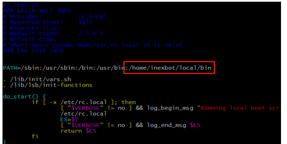

(4)重启控制器，后台打印：lua lib open ok

2.驱控一体安装LUA教程如下：

（1）打开控制器后台在/root/local下新建文件夹lib

（2）将lua5.2.so放在lib文件夹下（lua5.2.so存放于share\\192.168.0.79Z:\02控制器\lua目录下）

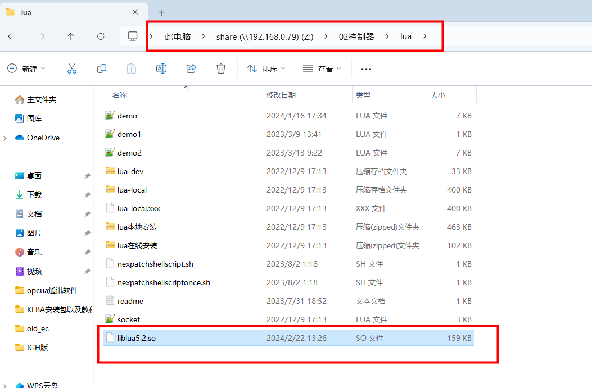

（3）lua5.2.so放入后重启控制器即可正常使用LUA

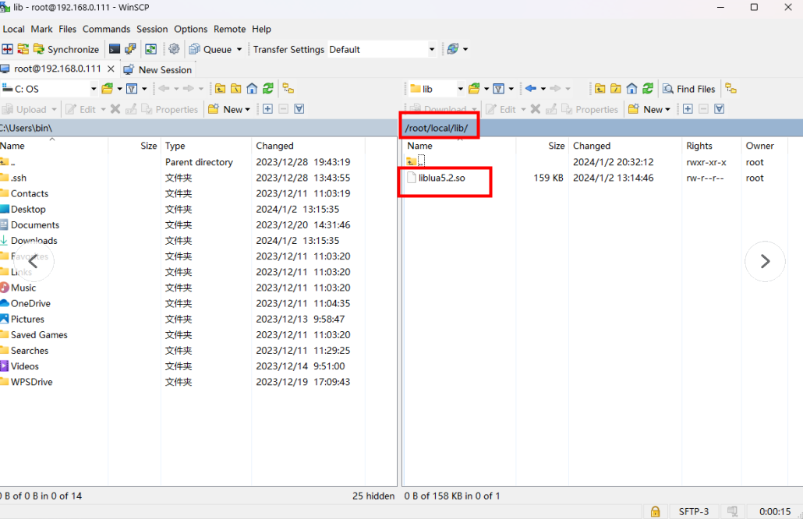

3.T5安装LUA教程如下：

注释：RTL-24.03.16版本及以上"liblua5.2.so“更改为”liblua.so”再进行上传操作

（1）目前仅做到24.03.07的下一版本上和dev6.5.9版本上

（2）liblua5.2.so文件放到U盘upgrade目录下通过示教器上传

（3）上传成功会提示消息：liblua5.2.so上传成功，请重启控制器

（4）重启控制器后，新建程序，插入lua语句指令，写入任意内容，单步该指令，未报错：此控制器未安装lua环境，则表示该lua已安装完成

## 使用示例

1.控制器作为服务器

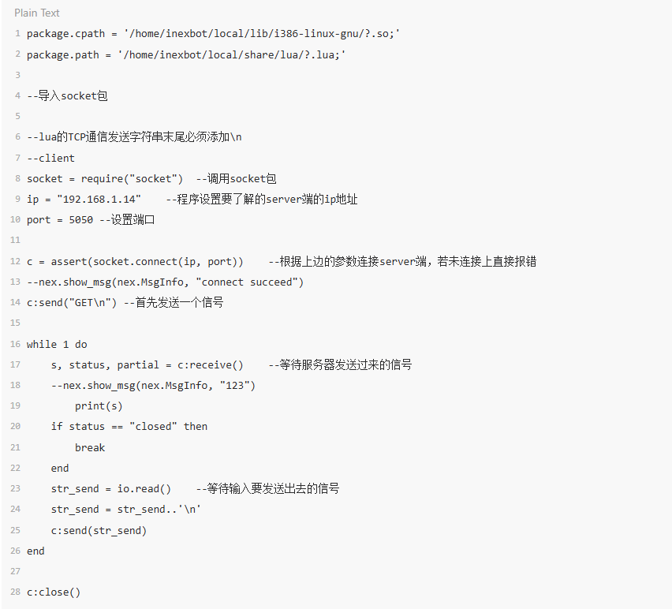

package.cpath = '/home/inexbot/local/lib/i386-linux-gnu/?.so;'

package.path = '/home/inexbot/local/share/lua/?.lua;'

--导入socket包

--lua的TCP通信发送字符串末尾必须添加\n

--client

socket = require("socket")  --调用socket包

ip = "192.168.1.14"    --程序设置要了解的
server端的ip地址

port = 5050 --设置端口
 
c = assert(socket.connect(ip, port))    --根据上边的参数连接server端，若未连接上直接报错

--nex.show_msg(nex.MsgInfo, "connect succeed") 

c:send("GET\n") --首先发送一个信号
 
while 1 do

    s, status, partial = c:receive()    --等待服务器发送过来的信号

    --nex.show_msg(nex.MsgInfo, "123") 
	print(s)

    if status == "closed" then 

        break

    end

    str_send = io.read()    --等待输入要发送出去的信号

    str_send = str_send..'\n'

    c:send(str_send)

end
 
c:close()

2.控制器作为客户端

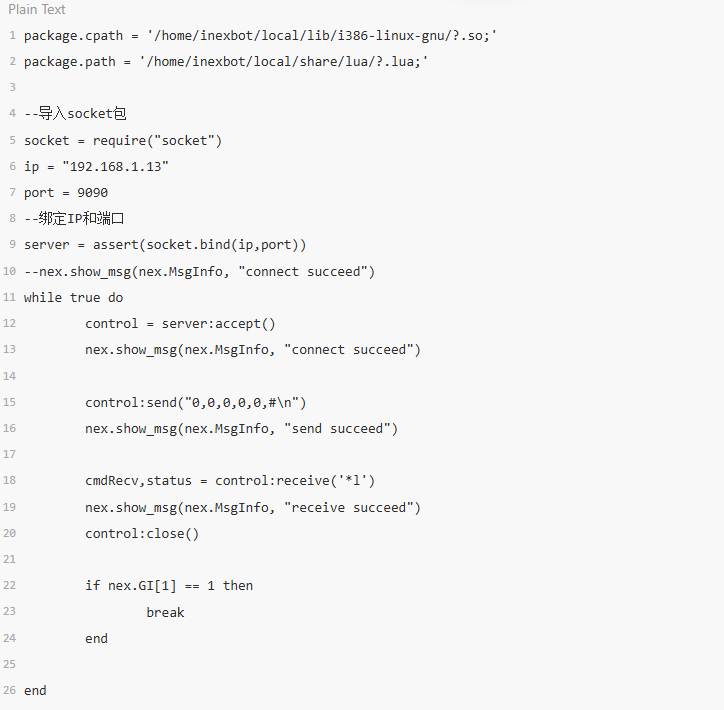

package.cpath = '/home/inexbot/local/lib/i386-linux-gnu/?.so;'

package.path = '/home/inexbot/local/share/lua/?.lua;'

--导入socket包

socket = require("socket")

ip = "192.168.1.13"

port = 9090

--绑定IP和端口

server = assert(socket.bind(ip,port))

--nex.show_msg(nex.MsgInfo, "connect succeed")

while true do

	control = server:accept()

	nex.show_msg(nex.MsgInfo, "connect succeed")
	
	control:send("0,0,0,0,0,#\n")

	nex.show_msg(nex.MsgInfo, "send succeed")
	
	cmdRecv,status = control:receive('*l')

	nex.show_msg(nex.MsgInfo, "receive succeed")

	control:close()
	
	if nex.GI[1] == 1 then

		break 

	end

end

3.将GP1的X值赋值给GE的X值

基础使用：将GP001的x值赋值给GE001的x值

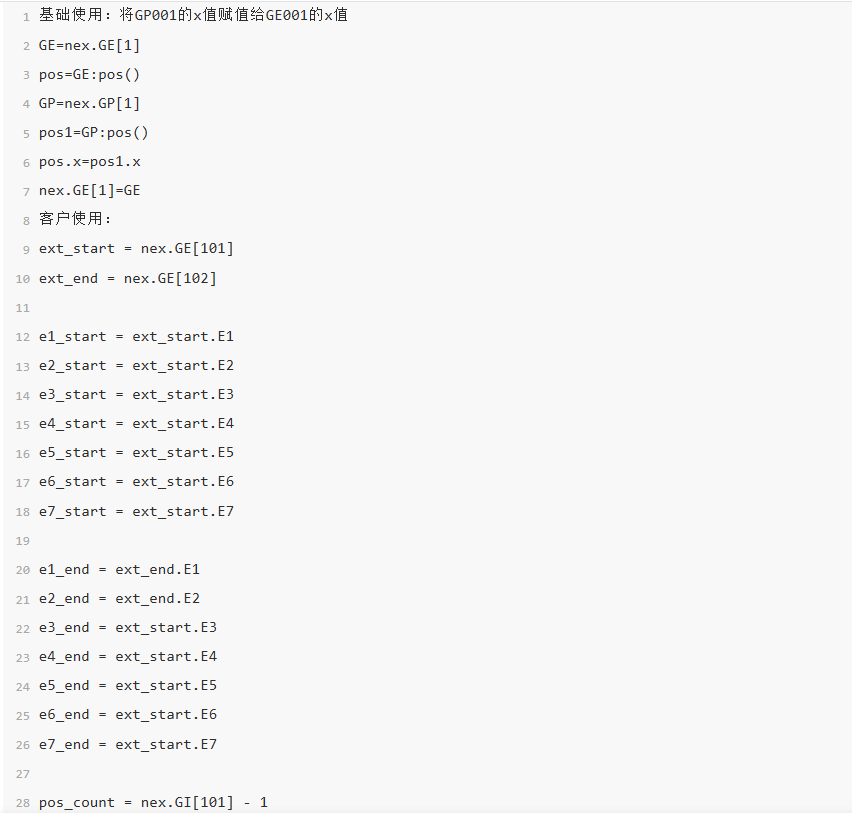 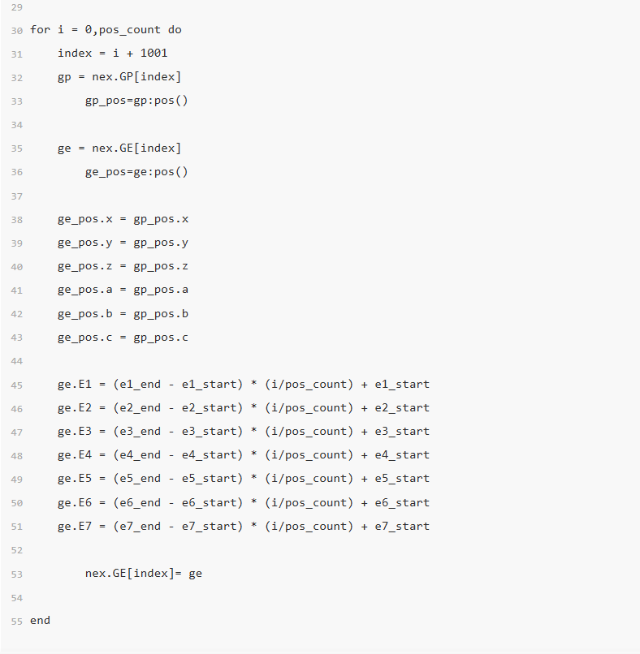

GE=nex.GE[1]

pos=GE:pos()

GP=nex.GP[1]

pos1=GP:pos()

pos.x=pos1.x

nex.GE[1]=GE

客户使用：

ext_start = nex.GE[101]

ext_end = nex.GE[102]

e1_start = ext_start.E1

e2_start = ext_start.E2

e3_start = ext_start.E3

e4_start = ext_start.E4

e5_start = ext_start.E5

e6_start = ext_start.E6

e7_start = ext_start.E7

e1_end = ext_end.E1

e2_end = ext_end.E2

e3_end = ext_start.E3

e4_end = ext_start.E4

e5_end = ext_start.E5

e6_end = ext_start.E6

e7_end = ext_start.E7

pos_count = nex.GI[101] - 1

for i = 0,pos_count do

    index = i + 1001

    gp = nex.GP[index]

	gp_pos=gp:pos()
	
    ge = nex.GE[index]

	ge_pos=ge:pos()

    ge_pos.x = gp_pos.x

    ge_pos.y = gp_pos.y

    ge_pos.z = gp_pos.z

    ge_pos.a = gp_pos.a

    ge_pos.b = gp_pos.b

    ge_pos.c = gp_pos.c
	
    ge.E1 = (e1_end - e1_start) * (i/pos_count) + e1_start

    ge.E2 = (e2_end - e2_start) * (i/pos_count) + e2_start

    ge.E3 = (e3_end - e3_start) * (i/pos_count) + e3_start

    ge.E4 = (e4_end - e4_start) * (i/pos_count) + e4_start

    ge.E5 = (e5_end - e5_start) * (i/pos_count) + e5_start

    ge.E6 = (e6_end - e6_start) * (i/pos_count) + e6_start

    ge.E7 = (e7_end - e7_start) * (i/pos_count) + e7_start
	
	nex.GE[index]= ge
	
end

### 指令使用

1.调用lua文件：CALL_LUAFILE:

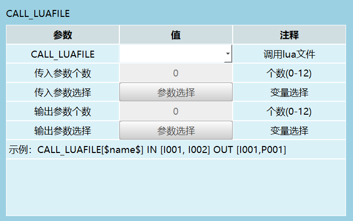

在示教器版本升级页面，采用上传文件上传demo.lua文件，上传的lua脚本会放置控制器后台：home/inexbot/robot/lua文件下

2.调用lua语句：CALL_LUASTRING

（1）修改全局数值变量

全局整数型：GI001=10  格式：nex.GI[1]=true

全局布尔型：GB001=1  格式: nex.GB[1]=1

全局浮点型：GD001=20  格式：nex.GD[1]=20

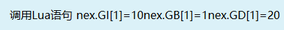

（2）修改局部数值变量

I001=12,B001=1,D001=12.12

nex.I[1]=12 nex.B[1]=1 nex.D[1]=12.12

注释：调用Lua语句时，参数值选择变量时，首先需要给字符型变量赋值，然后再调用lua语句

3.示教器打印信息

nex.show_msg(nex.MsgInfo, "消息")

4.修改，设置延时参数

设置延时500毫秒：nex.delay_ms(500) 

5.获取全局/局部位置变量参数

GP1 = nex.GP[1]

P2 = nex.P[2]

6.修改全局/局部位置变量的修改 坐标系，单位制，形态，工具手，用户坐标

GP1.coord, GP1.unit, GP1.configuration, GP1.tool, GP1.user = 0,2,4,6,1

 P2.coord, P2.unit, P2.configuration, P2.tool, P2.user = 1,1,5,6,7

 6.获取机器人全局/局部点位的位置

 pos1=GP1:pos()

 pos1=P2:pos()

 7.修改机器人全局/局部点位

 nex.GP[1]=GP1 

 nex.P[2]=P2

 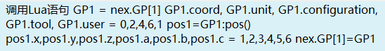  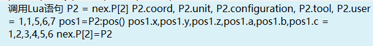

 7.获取全局/局部外部轴位置位置变量参数

 GE5 = nex.GE[5] 

 E1 = nex.E[1] 

 8.修改全局/局部外部轴位置位置变量的修改 坐标系，单位制，形态，工具手，用户坐标

 GE5.coord, GE5.unit, GE5.configuration, GE5.tool, GE5.user = 2,1,3,4,5

 E1.coord, E1.unit, E1.configuration, E1.tool, E1.user = 0,1,2,3,4

 8.获取机器人全局/局部外部轴点位的位置

 pos1=GE5:pos()

 pos1=E1:pos()

 9.修改机器人GE/E的位置数据

 pos1.x,pos1.y,pos1.z,pos1.a,pos1.b,pos1.c, = 1,2,3,4,5,6

 pos1.x,pos1.y,pos1.z,pos1.a,pos1.b,pos1.c,E1.E1,E1.E2 = 1,2,3,4,5,6,7,8

 10.修改外部轴的位置数据 E1，E2，E3，E4，E5

 GE5.E1,GE5.E2,GE5.E3,GE5.E4,GE5.E5 = 10,20,30,40,50  

 E1.E1,E1.E2,E1.E3,E1.E4,E1.E5 = 10,20,30,40,50  

 11.修改全局/局部外部轴位置位置变量

 nex.GE[5]=GE5 

 nex.E[1]=E1 

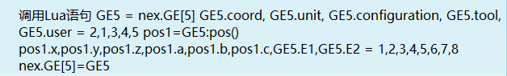  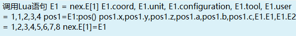

12.获取关节坐标、直角坐标、工具坐标和用户坐标系下的当前位置

Cur=nex.get_robot_current_pos(nex.ACS)  关节坐标系下当前位置

Cur=nex.get_robot_current_pos(nex.MCS)  直角坐标系下当前位置

Cur=nex.get_robot_current_pos(nex.PCS)  工具坐标系下当前位置

Cur=nex.get_robot_current_pos(nex.UCS)  用户坐标系下当前位置

13.获取当前机器人本体位置数据

pos=Cur:pos()

14.屏幕上打印当前位置数据

print("pos",pos.x,pos.y,pos.z,pos.a,pos.b,pos.c) 

15.屏幕上打印外部轴的当前位置数据 E1，E2，E3，E4，E5  （仅关节坐标系有外部轴数据）

print("Cur ext",Cur.E1,Cur.E2,Cur.E3,Cur.E4,Cur.E5) 

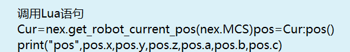  

16.获取工具坐标值

T=nex.get_tool_frame(1)  “1”代表工具编号

print("tool",T.x,T.y,T.z,T.a,T.b,T.c) 

17.修改工具坐标值

T.x,T.y,T.z,T.a,T.b,T.c = 60,20,280,10,0,0  

nex.set_tool_frame(2, T)  --修改编号为2的工具坐标值

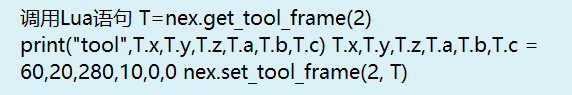

18.获取用户坐标值

U=nex.get_user_frame(1) “1”代表用编号为1的用户坐标

print("user",U.x,U.y,U.z,U.a,U.b,U.c) 

19.修改用户坐标值

U.x,U.y,U.z,U.a,U.b,U.c = 10,20,30,40,50,60

nex.set_user_frame(1, U)

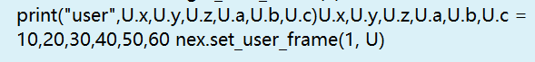

#### 控制器开放函数

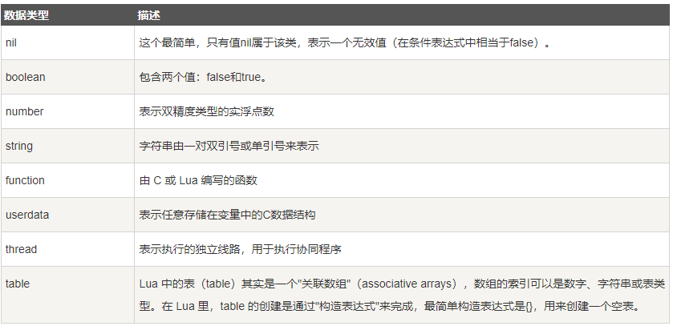

1.控制器状态类

（1）nex.get_controller_id()  作用：获取当前控制器ID

示例：A = nex.get_controller_id()  nex.log_info(A)

（2）nex.get_software_uptime_ms()  作用：控制器软件运行时间 

示例：T=nex.get_software_uptime_ms()  nex.show_msg(nex.MsgInfo,T)

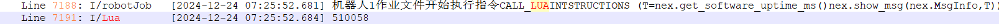

（3）nex.get_hardware_uptime_ms()  作用：控制器设备开机运行后的时间

示例：T1=nex.get_hardware_uptime_ms()  nex.show_msg(nex.MsgInfo,T1)

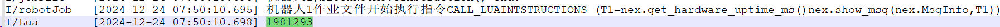

（4）nex.get_controller_sync_version()  作用：获取同步版本号

示例：Y=nex.get_controller_sync_version()  nex.show_msg(nex.MsgInfo,Y)

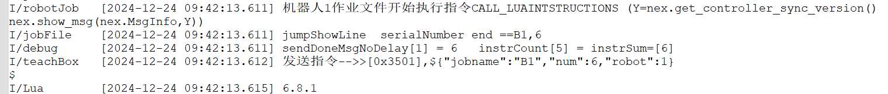

（5）nex.get_controller_release_version() 作用：获取发布版本号

示例：Y=nex.get_controller_release_version() nex.show_msg(nex.MsgInfo,Y)

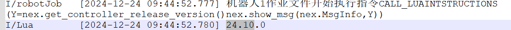

（6）nex.get_system_bits() 作用：获取控制器linux系统位数

示例：Y=nex.get_system_bits() nex.show_msg(nex.MsgInfo,Y)

（7）nex.get_controller_architecture() 作用：获取控制器架构类型

示例（C2200-A01）：=nex.get_controller_architecture() nex.show_msg(nex.MsgInfo,T)

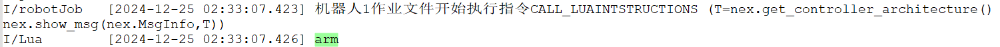

（8）nex.pulling_out_teach_pendant() 作用：控制器与示教器主动断开连接，当示教器发现控制器断连后，会主动去连接控制器

示例：nex.pulling_out_teach_pendant()--控制器与示教器主动断开连接，当示教器发现控制器断连后，会主动去连接控制器

（9）nex.get_teach_pendant_connect_state() 作用：获取示教器当前6000端口连接状态

示例：A=nex.get_teach_pendant_connect_state() nex.show_msg(nex.MsgInfo,A)

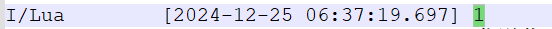

（10）nex.get_backup_teach_pendant_connect_state() 作用：查看socket通讯的6001端口连接状态

示例：A=nex.get_backup_teach_pendant_connect_state() nex.show_msg(nex.MsgInfo,A)

 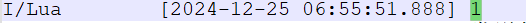

（11）nex.get_host_computer_service_connect_state() 作用：查看socket通讯的7000端口连接状态

示例：A=nex.get_host_computer_service_connect_state() nex.show_msg(nex.MsgInfo,A)

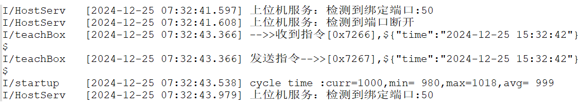 

（12）nex.get_slave_type_list() 作用：连接的从站类型列表

示例：local A = nex.get_slave_type_list()--获取从站列表并存入变量A
nex.show_msg(nex.MsgInfo,A[1])--打印从站列表第一个从站的名称

（13）nex.get_robot_sum() 作用：获取机器人数量

示例：A=nex.get_robot_sum() Anex.show_msg(nex.MsgInfo,A)

（14）nex.get_io_type_list() 作用：获取连接到的实际的io列表名称

示例：local A = nex.get_io_type_list() nex.show_msg(nex.MsgInfo,A[1])

（15）nex.get_simu_io_sum() 作用：获取配置了虚拟IO的个数

示例：A=nex.get_simu_io_sum() nex.show_msg(nex.MsgInfo,A)

（16）nex.get_current_robot_num() 作用：获取当前使用的机器人数目

示例： A=nex.get_current_robot_num() nex.show_msg(nex.MsgInfo,A)

（17）nex.get_current_operation_mode（）作用：获取当前系统的操作模式：示教模式、运行模式、远程模式 

示例：A=nex.get_current_operation_mode() nex.show_msg(nex.MsgInfo,A)

(18) nex.get_last_msg_content() 作用：获取上一次的报错内容，报错不区分消息、警告、报错等级

示例： A=nex.get_last_msg_content() nex.show_msg(nex.MsgInfo,A)

（19）nex.jobfile_step_reverse() 作用：获取当前的作业文件运行状态是正序或倒序

示例：A=nex.jobfile_step_reverse() nex.show_msg(nex.MsgInfo,A)

（20）nex.get_robot_teach_type() 作用：获取当前是点动模式还是拖拽模式

示例：A=nex.get_robot_teach_type() nex.show_msg(nex.MsgInfo,A)

（21）nex.get_teach_mode_speed_percentage() 作用：获取当前机器人下的示教模式下的速度百分比

示例：A = nex.get_teach_mode_speed_percentage() nex.log_info(A)

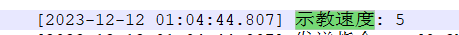 

（22）nex.rbt[number].get_teach_mode_speed_percentage() 作用：获取某个编号机器人的当前示教模式下的速度百分比

示例：A = nex.rbt[2].get_teach_mode_speed_percentage() nex.log_info(A)

（23）nex.get_run_mode_speed_percentage() 作用：获取当前机器人运行模式下的运行速度的百分比

示例：A = nex.get_run_mode_speed_percentage nex.show_msg(nex.MsgInfo,A)

（24）nex.rbt[number].get_run_mode_speed_percentage() 作用：获取当前编号下的机器人运行模式下的运行速度的百分比

示例：A = nex.rbt[3].get_run_mode_speed_percentage() nex.show_msg(nex.MsgInfo,A)

（25）nex.get_jobfile_exe_state() 作用：获取当前机器人状态下程序运行状态

示例：A = nex.get_jobfile_exe_state() nex.show_msg(nex.MsgInfo, A)

（26）nex.rbt[number].get_jobfile_exe_state() 作用：获取具体编号下机器人的当前程序运行状态

示例：A = nex.rtb[4].get_jobfile_exe_state() nex.show_msg(nex.MsgInfo, A)

（26）nex.get_jobfile_target_circle_times() 作用：获取当前机器人下的运行程序目标运行次数

示例：A = nex.get_jobfile_target_circle_times() nex.show_msg(nex.MsgInfo, A)

（27） nex.rbt[number].get_jobfile_target_circle_times() 作用：获取当前机器人下的运行程序目标运行次数

示例：A = nex.rbt[3].get_jobfile_target_circle_times() nex.show_msg(nex.MsgInfo, A)

（28）nex.get_jobfile_current_circle_times() 作用：获取当前程序当前已运行次数

示例：A = nex.get_jobfile_current_circle_times() nex.show_msg(nex.MsgInfo, A)

（29）nex.rbt[number].get_jobfile_current_circle_times() 作用：获取当前程序当前已运行次数

示例：A = nex.rbt[2].get_jobfile_current_circle_times() nex.show_msg(nex.MsgInfo, A)

（30）nex.get_executing_jobfile_name() 作用：获取当前机器人前台正在执行的程序名

崔A = nex.get_executing_jobfile_name() nex.show_msg(nex.MsgInfo,A)

（31）nex.rbt[number].get_executing_jobfile_name() 作用：获取具体编号的机器人前台正在执行的程序名

示例：A = nex.rbt[2].get_executing_jobfile_name() nex.show_msg(nex.MsgInfo,A)

（32）nex.get_executing_all_jobfile_name_list() 作用：获取当前机器人从主程序到正在运行的子程序所有层级的列表

示例：local A=nex.get_executing_all_jobfile_name_list() nex.show_msg(nex.MsgInfo,"初始化列表是："..table.concat(A,","))

（33）nex.get_executing_jobfile_line_num() 作用：获取当前机器人当前程序执行行号

示例：A = nex.get_executing_jobfile_line_num() nex.show_msg(nex.MsgInfo, A)

（34）nex.rbt[number].get_executing_jobfile_line_num() 作用：获取当前机器人当前程序执行行号

示例：A = nex.get_executing_jobfile_line_num() nex.show_msg(nex.MsgInfo, A)

（35）nex.get_executing_jobfile_elapsed_time_s() 作用：获取当前机器人下当前执行的前台作业文件已运行的时间

示例：A=nex.get_executing_jobfile_elapsed_time_s nex.show_msg(nex.MsgInfo, A)

（36）nex.rbt[number].get_executing_jobfile_elapsed_time_s() 作用：获取具体编号的机器人下当前执行的前台作业文件已运行的时间

示例：A=nex.rbt[2].get_executing_jobfile_elapsed_time_s nex.show_msg(nex.MsgInfo, A)

（37）nex.get_main_jobfile_name() 作用：获取当前机器人设置的主程序作业文件名

示例：A = nex.get_main_jobfile_name() nex.show_msg(nex.MsgInfo, A)

（38）nex.rbt[1].get_main_jobfile_name() 作用：获取具体编号机器人的当前设置的主程序作业文件名

示例：A = nex.rbt[2].get_main_jobfile_name() nex.show_msg(nex.MsgInfo, A)

（39）nex.can_jobfile_continue_exe() 作用：获取当前程序运行的指令是否支持断点执行

 示例：A = nex.can_jobfile_continue_exe() nex.show_msg(nex.MsgInfo,A)

 （40）nex.can_jobfile_current_row_exe() 作用：获取当前机器人程序运行的指令是否支持当前行执行

 示例：A = nex.can_jobfile_current_row_exe() nex.show_msg(nex.MsgInfo,A)

 （41）nex.rbt[number].can_jobfile_current_row_exe() 作用：获取特定编号机器人程序运行的指令是否支持当前行执行

 示例：A=nex.rbt[2].can_jobfile_current_row_exe() nex.show_msg(nex.MsgInfo,A)

 （42）nex.get_executing_global_backstage_jobfile_name_list() 作用：获取当前正在运行中的全局后台程序名列表

 示例：A = nex.get_executing_global_backstage_jobfile_name_list() nex.show_msg(nex.MsgInfo, "正在运行中的全局后台程序: "  table.concat(A))

 （43）nex.get_robot_actual_end_linear_vel() 作用：获取当前机器人的当前末端线速度

 示例：A = nex.get_robot_actual_end_linear_vel() nex.show_msg(nex.MsgInfo,A)

 （44）nex.rbt[B].get_robot_actual_end_linear_vel() 作用：获取特定编号机器人的当前的末端线速度

 示例：A = nex.rbt[2].get_robot_actual_end_linear_vel() nex.show_msg(nex.MsgInfo,A)

 （45）nex.get_robot_target_end_linear_vel() 作用：获取的是当前机器人下系统规划的末端线速度

 示例：A=nex.get_robot_target_end_linear_vel() nex.show_msg(nex.MsgInfo,A)

 （46）nex.rbt[number].get_robot_target_end_linear_vel() 作用：获取的是特定编号机器人下系统规划的末端线速度

 示例：A=nex.rbt[2].get_robot_target_end_linear_vel() nex.show_msg(nex.MsgInfo,A)

 （47）nex.get_robot_servo_state() 作用：获取当前伺服的状态

 示例：A=nex.get_robot_servo_state() nex.show_msg(nex.MsgInfo,A)

 （48）nex.rbt[number].get_robot_servo_state() 作用：获取当前伺服的状态

 示例：A=nex.rbt[4].get_robot_servo_state() nex.show_msg(nex.MsgInfo,A)

 （49）nex.get_current_collaboration_ext_axis_num 作用：获取当前机器人当前协作的外部轴组号

 示例：A =nex.get_current_collaboration_ext_axis_num nex.show_msg(nex.MsgInfo,A)

 （50）nex.rbt[number].get_current_collaboration_ext_axis_num 作用：获取特定编号下机器人当前协作的外部轴组号

 示例：A = nex.rbt[3].get_current_collaboration_ext_axis_num  nex.show_msg(nex.MsgInfo,A)

 （51）nex.emergency_stop_is_enabled(string) 作用：获取当前使能键开关状态

 示例：nex.GB[1]=nex.emergency_stop_is_enabled("weld")

 （52）nex.rbt[number].emergency_stop_is_enabled(string) 作用：获取当前使能键开关状态

 示例：nex.GB[1]=nex.rbt[2].emergency_stop_is_enabled("weld")

 （53）nex.emergency_stop_is_triggered() 作用：获取当前紧急停止触发状态

 示例：nex.GB[1]=nex.emergency_stop_is_triggered("iostop1")

 （54）nex.rbt[number].emergency_stop_is_triggered(string) 作用：获取特定编号机器人当前紧急停止触发状态

 示例：nex.GB[1]=nex.rbt[3].emergency_stop_is_triggered("iostop1")

 （55）nex.emergency_stop_is_shielded(string) 作用：获取当前紧急停止屏蔽状态

 示例：nex.GB[1]=nex.emergency_stop_is_shielded("iostop1")

 （56）nex.rbt[number].emergency_stop_is_shielded() 作用：获取特定编号机器人当前紧急停止屏蔽状态

 示例：nex.GB[1]=nex.rbt[4].emergency_stop_is_shielded("iostop1")

 （57）nex.safe_screen_is_enabled() 作用：获取当前安全光幕使能开关状态

 示例：nex.GB[1]=nex.safe_screen_is_enabled()

 （58）nex.safe_screen_is_triggered(number) 作用：将获取当前安全光幕触发状态

 示例：nex.GB[1]=nex.safe_screen_is_triggered(1)

 （59）nex.rbt[number].safe_screen_is_triggered(number) 作用：将获取特定编号机器人的当前安全光幕触发状态

 示例：nex.GB[1]=nex.rbt[2].safe_screen_is_triggered(1)

 （60）nex.get_encoder_value(number) 作用：获取对应端口号编码器的值

 示例：A=nex.get_encoder_value(1) nex.show_msg(nex.MsgInfo,A)

 （61）nex.set_motor_overload_protection_enable_state(boolean) 作用：打开或关闭当前机器人电机过载保护使能

 示例：nex.set_motor_overload_protection_enable_state(1) 
 
 nex.set_motor_overload_protection_enable_state(0)

 （62）nex.get_interference_zone_range( number,string ) 作用：获取当前机器人对应编号干涉区的maxX，maxY，minX，minY的值

 示例：nex.GD[1]=nex.get_interference_zone_range(2,maxY)

 （63）nex.rbt[number].get_interference_zone_range( number,string ) 作用：获取指定编号机器人的对应编号干涉区的maxX，maxY，minX，minY的值

 示例：nex.GD[1]=nex.rbt[2].get_interference_zone_range(2,maxY)

 （64）nex.interference_zone_takes_effect_within_region(number) 作用：获取当前机器人指定编号的干涉区的限制区域

 示例：nex.GB[1]=nex.interference_zone_takes_effect_within_region(2)

 （65）nex.rbt[number].interference_zone_takes_effect_within_region(number) 作用：获取指定机器人指定编号的干涉区的限制区域

 示例：nex.GB[1]=nex.rbt[2].interference_zone_takes_effect_within_region(2)

 （66）nex.get_interference_zone_enable_state( number ) 作用：获取当前机器人指定编号的干涉区使能开关状态

 示例：nex.GB[2]=nex.get_interference_zone_enable_state(1)

 （67）nex.rbt[number].get_interference_zone_enable_state( number ) 作用：获取指定机器人指定编号的干涉区使能开关状态

 示例：nex.GB[3]=nex.rbt[4].get_interference_zone_enable_state(1)

 （68） nex.set_interference_zone_enable_state( number,boolean ) 作用：打开或关闭当前机器人指定干涉区编号的使能开关

示例：nex.set_interference_zone_enable_state(1,true )

nex.set_interference_zone_enable_state(5,false )

（69） nex.rbt[number].set_interference_zone_enable_state( number,boolean ) 作用：打开或关闭指定机器人指定干涉区编号的使能开关

示例：nex.rbt[1].set_interference_zone_enable_state(1,true )

nex.rbt[2].set_interference_zone_enable_state(5,false )

（70） nex.get_interference_zone_is_triggered( number ) 作用：获取当前机器人干涉区使能触发状态

示例：nex.GD[1]=nex.body[6].get_actual_axis_vel()

（71）nex.rbt[number].body[number].get_actual_axis_vel() 作用：获取指定机器人指定轴的当前轴速度

示例：nex.GD[1]=nex.rbt[2].body[6].get_actual_axis_vel()

（72）nex.ext[number][number].get_actual_axis_vel() 作用：获取当前机器人指定绑定的外部轴组的指定轴的轴速度

示例：nex.GD[1]=nex.ext[2][2].get_actual_axis_vel()

（73）nex.rbt[number].ext[number][number].get_actual_axis_vel() 作用：获取指定编号机器人的指定绑定的外部轴组的指定轴的当前轴速度

示例：nex.GD[1]=nex.rbt[2].ext[2][2].get_actual_axis_vel()

（74）nex.body[number].get_target_axis_vel() 作用：获取当前机器人指定轴的目标轴速度

示例：nex.GD[1]=nex.body[1].get_target_axis_vel()

（75）nex.rbt[number].body[number].get_target_axis_vel() 作用：获取指定编号机器人的指定轴的目标轴速度

示例：nex.GD[1]=nex.rbt[2].body[1].get_target_axis_vel()

（76）nex.ext[number][number].get_target_axis_vel() 作用：获取当前机器人指定的绑定的外部轴轴组的指定轴的目标轴速度

示例：nex.GD[1]=nex.ext[1][2].get_target_axis_vel()

（77）nex.rbt[number].ext[number][number].get_target_axis_vel() 作用：获取指定机器人指定的绑定的外部轴轴组的指定轴的目标轴速度

示例：nex.GD[1]=nex.rbt[3].ext[1][2].get_target_axis_vel()

（78）nex.body[num].get_actual_motor_encoder_value() 作用：获取当前机器人指定轴的电机编码器位置实际值

示例：nex.GD[1]=nex.body[6].get_actual_motor_encoder_value()

（79）nex.rbt[number].body[num].get_actual_motor_encoder_value() 作用：获取指定机器人指定轴的电机编码器位置实际值

示例：nex.GD[1]=nex.rbt[2].body[6].get_actual_motor_encoder_value()

（80）nex.ext[number][number].get_actual_motor_encoder_value() 作用：获取当前机器人指定的绑定的外部轴轴组的指定轴的电机编码器位置实际值

示例：nex.GD[1]=nex.ext[1][2].get_actual_motor_encoder_value()

（81）nex.rbt[number].ext[number][number].get_actual_motor_encoder_value() 作用：获取指定机器人指定的绑定的外部轴轴组的指定轴的电机编码器位置实际值

示例：nex.GD[1]=nex.rbt[2].ext[1][2].get_actual_motor_encoder_value()

（82）nex.body[number].get_target_motor_encoder_value() 作用：获取当前机器人指定轴的电机编码器位置目标值

示例：nex.GD[1]=nex.rbt[2].body[6].get_target_motor_encoder_value()

（83）nex.ext[number][number].get_target_motor_encoder_value() 作用：获取当前机器人指定的绑定的外部轴轴组的指定轴的电机编码器位置目标值

示例：nex.GD[1]=nex.ext[1][2].get_target_motor_encoder_value()

（84）nex.rbt[number].ext[number][number].get_target_motor_encoder_value() 作用：获取指定编号机器人的指定的绑定的外部轴轴组的指定轴的电机编码器位置目标值

示例：nex.GD[1]=nex.rbt[3].ext[1][2].get_target_motor_encoder_value()

（85）nex.body[number].get_actual_motor_torque() 作用：获取当前机器人的指定轴的电机扭矩

示例：nex.GD[1]=nex.body[6].get_actual_motor_torque()

（86）nex.rbt[number].body[number].get_actual_motor_torque() 作用：获取指定机器人的指定轴的电机扭矩

示例：nex.GD[1]=nex.rbt[2].body[6].get_actual_motor_torque()

（87）nex.ext[number][number].get_actual_motor_torque() 作用：获取当前机器人指定的绑定的外部轴轴组的指定轴的电机扭矩值

示例：nex.GD[1]=nex.ext[1][2].get_actual_motor_torque()

（88）nex.rbt[number].ext[number][number].get_actual_motor_torque() 作用：获取指定编号机器人的指定的绑定的外部轴轴组的指定轴的电机扭矩

示例：nex.GD[1]=nex.rbt[3].ext[1][2].get_actual_motor_torque()

（89）nex.body[number].get_actual_motor_current() 作用：获取当前机器人的指定轴的电机电流

示例：nex.GD[1]=nex.body[6].get_actual_motor_current()

（90）nex.rbt[number].body[number].get_actual_motor_current() 作用：获取指定机器人的指定轴的电机电流

示例：nex.GD[1]=nex.rbt[2].body[6].get_actual_motor_current()

（91）nex.ext[number][number].get_actual_motor_current() 作用：获取当前机器人指定的绑定的外部轴轴组的指定轴的电机电流值 

示例：nex.GD[1]=nex.ext[1][2].get_actual_motor_current()

（92）nex.rbt[number].ext[number][number].get_actual_motor_current() 作用：获取指定编号机器人的指定的绑定的外部轴轴组的指定轴的电机电流

示例：nex.GD[1]=nex.rbt[3].ext[1][2].get_actual_motor_current()

（93）nex.body[number].get_actual_motor_rpm() 作用：获取当前机器人的指定轴的电机转速

 示例：nex.GD[1]=nex.body[6].get_actual_motor_rpm()

 （94）nex.rbt[number].body[number].get_actual_motor_rpm() 作用：获取指定机器人的指定轴的电机转速

 示例：nex.GD[1]=nex.rbt[2].body[6].get_actual_motor_current()

 （95）nex.ext[number][number].get_actual_motor_rpm() 作用：获取当前机器人指定的绑定的外部轴轴组的指定轴的电机转速值

 示例：nex.GD[1]=nex.ext[1][2].get_actual_motor_rpm()

 （96）nex.rbt[number].ext[number][number].get_actual_motor_rpm() 作用：获取指定编号机器人的指定的绑定的外部轴轴组的指定轴的电机转速

 示例：nex.GD[1]=nex.rbt[3].ext[1][2].get_actual_motor_rpm()

 （97）nex.body[number].get_actual_motor_overload() 作用：获取当前机器人的指定轴的电机负载

 示例：nex.GD[1]=nex.body[6].get_actual_motor_overload()

 （98）nex.rbt[number].body[number].get_actual_motor_overload() 作用：获取指定机器人的指定轴的电机负载

 示例：nex.GD[1]=nex.rbt[2].body[6].get_actual_motor_overload()

 （99）nex.ext[number][number].get_actual_motor_overload() 作用：获取当前机器人指定的绑定的外部轴轴组的指定轴的电机负载值

 示例：nex.GD[1]=nex.ext[1][2].get_actual_motor_overload()

 （100）nex.rbt[number].ext[number][number].get_actual_motor_overload() 作用：获取指定编号机器人的指定的绑定的外部轴轴组的指定轴的电机负载

 示例：nex.GD[1]=nex.rbt[3].ext[1][2].get_actual_motor_overload()

 （101）nex.body[number].get_motor_moder_of_operation() 作用：获取当前机器人的指定轴的伺服运行模式

 示例：nex.GD[1]=nex.body[6].get_motor_moder_of_operation()

 （102）nex.rbt[number].body[number].get_motor_moder_of_operation() 作用：获取指定机器人的指定轴的伺服运行模式

 示例：nex.GD[1]=nex.rbt[2].body[6].get_motor_moder_of_operation()

 （103）nex.ext[number][number].get_motor_moder_of_operation() 作用：获取当前机器人指定的绑定的外部轴轴组的指定轴的伺服运行模式

 示例：nex.GD[1]=nex.ext[1][2].get_motor_moder_of_operation()

 （104）nex.rbt[number].ext[number][number].get_motor_moder_of_operation() 作用：获取指定编号机器人的指定的绑定的外部轴轴组的指定轴的伺服运行模式
 
示例：nex.GD[1]=nex.rbt[3].ext[1][2].get_motor_moder_of_operation()

