# Modbus功能使用教程

## Modbus指令

### MODBUS_OPEN---打开MODBUS连接

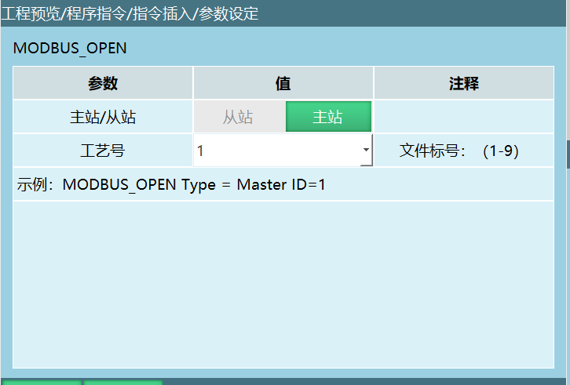
格式：MODBUS_OPEN【指令名称】Type=Master、Slave【主站、从站】ID【工艺号】。

功能：打开Modbus通讯连接。

参数：

| 主站/从站     | 选择主站，执行打开MODBUS连接指令，MODBUS主站连接成功 选择从站，执行打开MODBUS连接指令，MODBUS从站连接成功 |
| :--- | :--- |
| 工艺号        | 选择从站时工艺号无法修改，选择主站工艺号支持1---9    |

### MODBUS_CLOSE---断开MODBUS连接

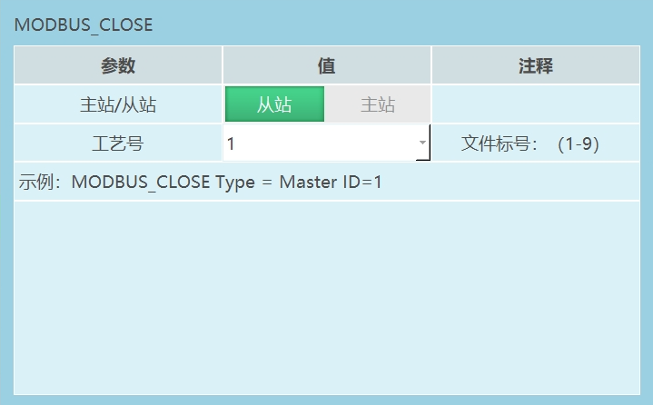

格式：MODBUS_CLOSE【指令名称】Type=Master、Slave【主站、从站】ID【工艺号】。

功能：断开Modbus通讯连接。

参数：

| 主站/从站     | 选择主站，执行MODBUS断开指令，MODBUS主站通讯断开 选择从站，执行MODBUS断开指令，MODBUS从站通讯断开    |
| :--- | :--- |
| 工艺号        | 选择从站时无工艺号，选择主站时工艺号支持1---9       |

### MODBUS_CONNECTION_STATUS---获取MODBUS连接

格式：MODBUS_CONNECTION_STATUS【指令名称】Type=Master、Slave【主站、从站】ID【工艺号】B/GB【状态存入的变量】。

功能：将Modbus通讯连接的状态存入变量，连接成功该变量值被赋值为1，连接失败选择的该变量被赋值为0。

参数：

| 主站/从站         | 选择主站，执行指令后将获取主站的连接状态 选择从站，执行指令后将获取从站的连接状态                                                                                                          |
| :--- | :--- |
| 工艺号            | 选择从站时无工艺号 选择主站工艺号支持1---9                                                                                                                           |
| 状态存入变量名    | 将获取到的状态存入到变量 例如：Modbus从站连接，选择的变量是GB001，首先执行打开Modbus连接指令，再执行获取Modbus连接指令，如果Modbus从站连接成功的话GB001=1，连接失败GB001=0 |

### MODBUS_READ---MODBUS读指令

格式：MODBUS_READ【指令名称】ID【工艺号】4X /3X/ 4X-bit/ 3X-bit/ 0X/
1X【地址类型】5【从站寄存器首地址】1【读从站地址个数】B001【数据存放首个变量】。

功能：读取Modbus中对应地址的数值。

参数：

1.  工艺号：范围\[1,9\]指令里面选择的工艺号需要和Modbus参数界面选择的工艺号保持一致。

2.  地址类型：

- 3X:读取

- Modbus中对应地址的值。

- 4X：同3X。

- 3X-bit：读取所选地址中所存值得任一bit的状态。

- 4X-bit：同3X-bit。

- 0X：可读可写的设备类型，相当于操作PLC的输出点。

- 1X：只读设备类型，相当于操作PLC的输入点。

3.  数据类型：当数据存放的首个变量选I或GI时，从站的数据类型可选short和ushort（分别对应短整型和无符号短整型，前者范围为\[-32768,32767\]后者的范围为\[0,65535\]）。

> 注意事项：数据存放首个变量选I或GI数据类型
> 时需要和从站的数据类型一致，否则可能导致数据出错。

4.  从站寄存器首地址：根据指令参数里面设置的首地址读取参数值，如果参数里面设置的首地址是5，在执行读指令后会从Modbus第5个地址开始读。

5.  读从站地址个数：读取的地址个数，如果设置的读从站地址个数为3，执行读指令后会从Modbus首地址开始读取3个地址（包含首地址一共读3个）。

6.  数据存放的首个变量：将读取到的参数存放到变量，如果选择的首个变量为I001,读取的地址个数为3，执行读指令会把参数值依次存入到I001、I002、I003。

**示例说明1：**地址类型4X，数据存放的首个变量为GI001从站首地址1，读从站地址个数10。

例如：如下图执行Modbus读指令，将Modbus地址1---地址10的值读取到变量GI001-GI010。

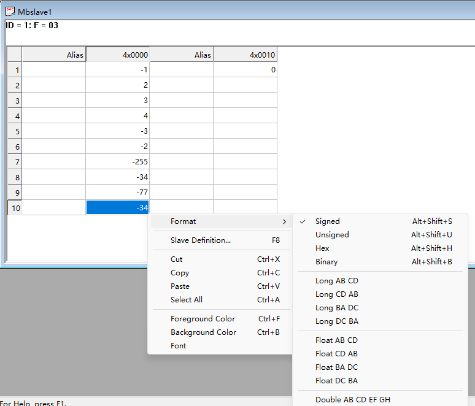

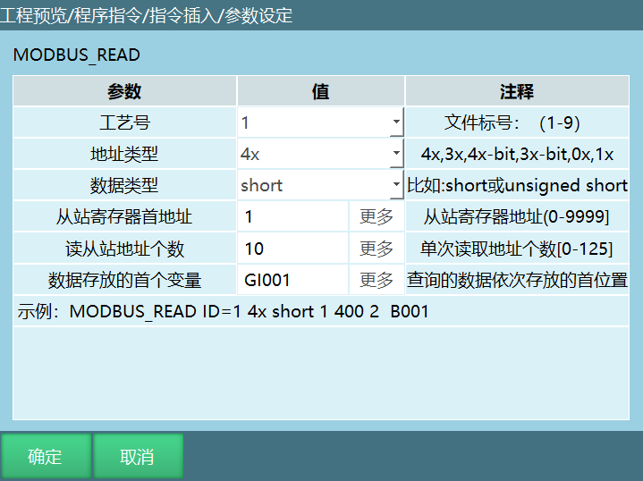

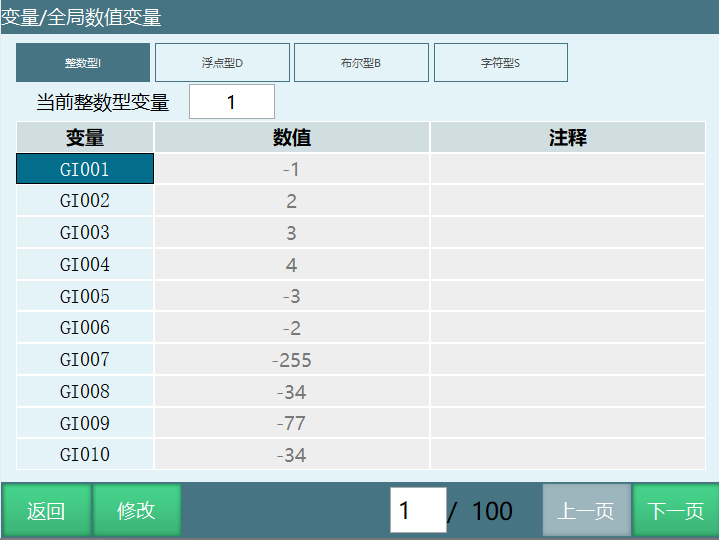

**示例说明2:**地址类型3X-bit，数据存放的首个变量为GI001从站首地址1，读从站地址个数16。

例如：Modbus地址1中所存值为259，一个地址16位，则用二进制表示为0000 0001
0000
0011，将16位值按顺序存入16个变量（从选择的首个变量开始按从右往左的顺序依次将16位原码存入）。

数据存放的首个变量为GI001,则将259转为二进制码后按从右往左的顺序将每个数存入GI001---GI016中。

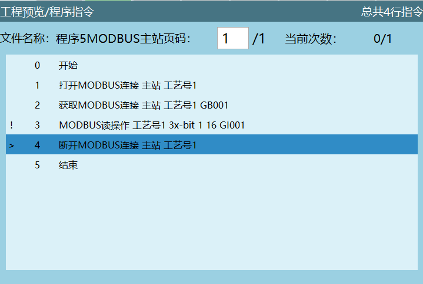

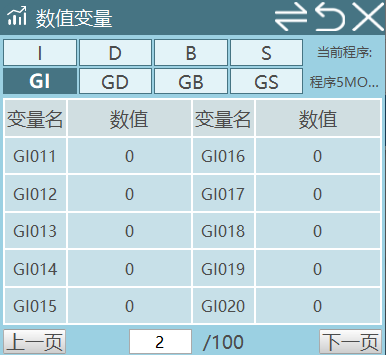

**示例说明3:**地址类型3X-bit，数据存放的首个变量为I001从站首地址1，读从站地址个数8。

Modbus地址1中所存值为259，则用二进制16位表示为0000 0001 0000
0011，因为选择的读从站地址个数为8，执行Modbus读指令，按顺序存入8个变量（从选择的首个变量开始按从右往左的顺序）。

数据存放的首个变量为I001,则将259转为二进制码后按从右往左的顺序将读取到的8个值（0000
0011）存入I001---I008中。

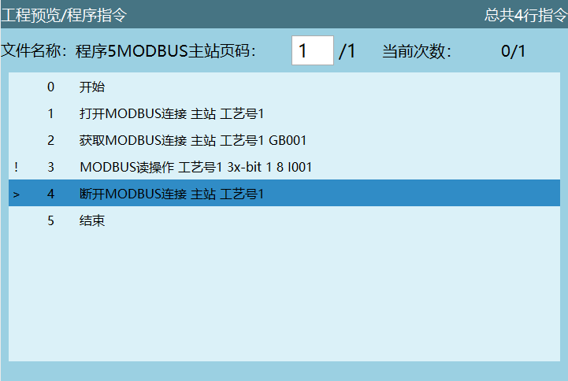

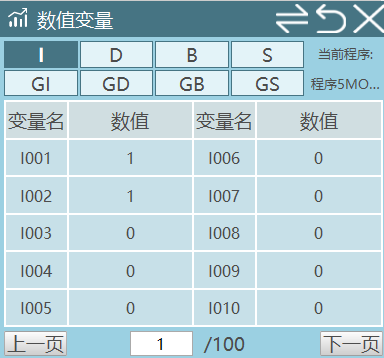

注意事项：

1.  地址类型为3X-bit时从站地址个数范围是\[0,16\]。

<!-- -->

2.  地址类型为3X-bit，存到变量时候的17位为符号位，0表示正数，1表示负数。

**示例说明4：**地址类型1X，数据存放的首个变量为I001，从站首地址1，读从站地址个数1。

例：如下图所示0X和1X只有"0"，"1"两种状态，Value选择On时表示1，选择Off时表示0，执行modbus读指令后将读取的对应地址状态存入到变量。

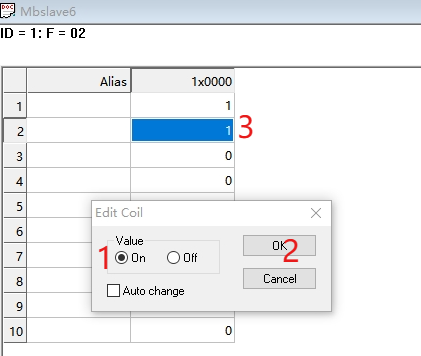

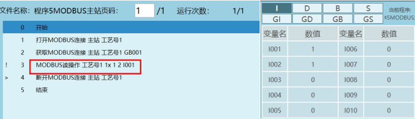

**示例说明5：**地址类型3X，数据存放的首个变量为S001，从站首地址1，读从站地址个数5。

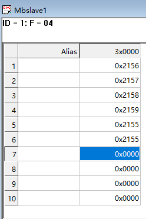

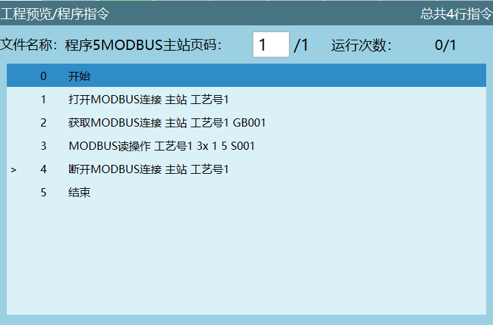

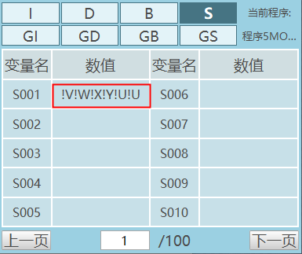

执行效果：执行指令后将读取到的主站地址1-地址5的值存入变量S001，超过读取地址个位数的地址是无法读取。

注意事项：

1.  读取字符时会将读取到的所有值存入到一个变量，它跟整型、浮点型、布尔型变量不一样，不会根据设置的首地址，读从站地址个数顺延存入其它变量。

例如：如果设置的首变量是S001会将读取到的所有值存入S001。

2.  选择读取字符型变量时地址的Format改成十六进制Hex。

3.  两个16进制数表示ASCII一个字符，例如上图所示的0X2156、21代表一个字符，56代表一个字符。具体读取的字符可查看ASCII码表。

[ASCII码对照表](https://blog.csdn.net/sunyctf/article/details/131397591)

**示例说明6：**地址类型3X，数据存放的首个变量为D001，从站首地址1，读从站地址个数10。

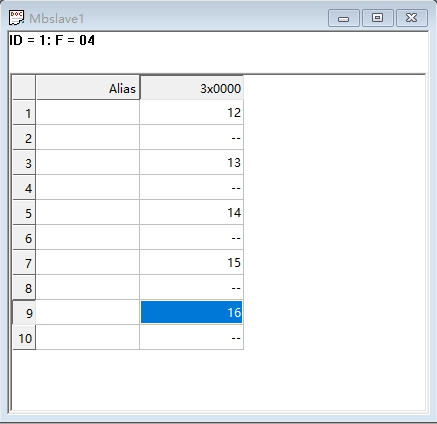

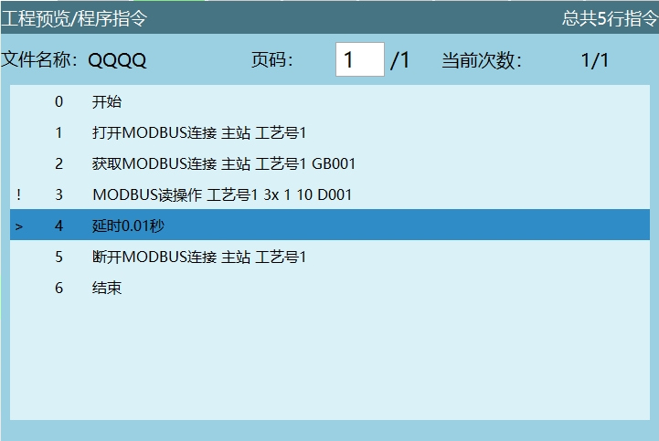

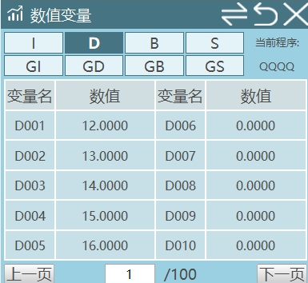

执行效果：执行Modbus读指令将读取到的浮点型数字存入D001-D005。

注意事项：由于寄存器中2个地址码表示一个浮点数，所以"读从站地址个数"应当是偶数，且读取浮点型变量时需要设置正确的大小端模式。

### 浮点数大小端交换设置

Modbus设置-Modbus参数，从站和主站界面都增加对浮点数的读取与写入大小端交换的设置选项，如图所示：

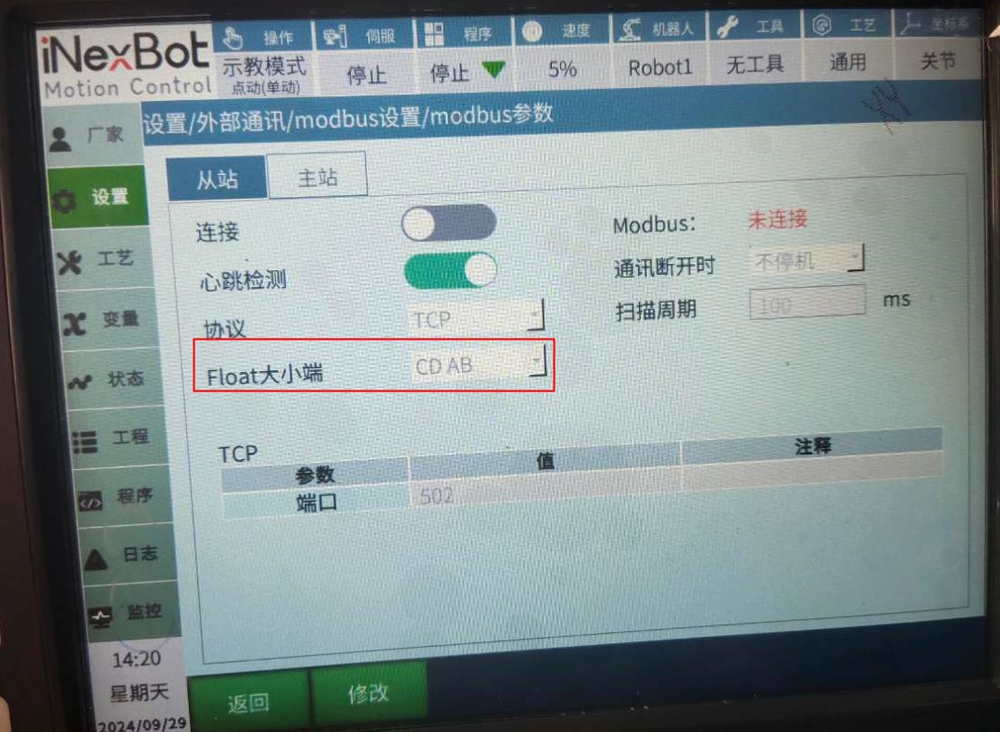

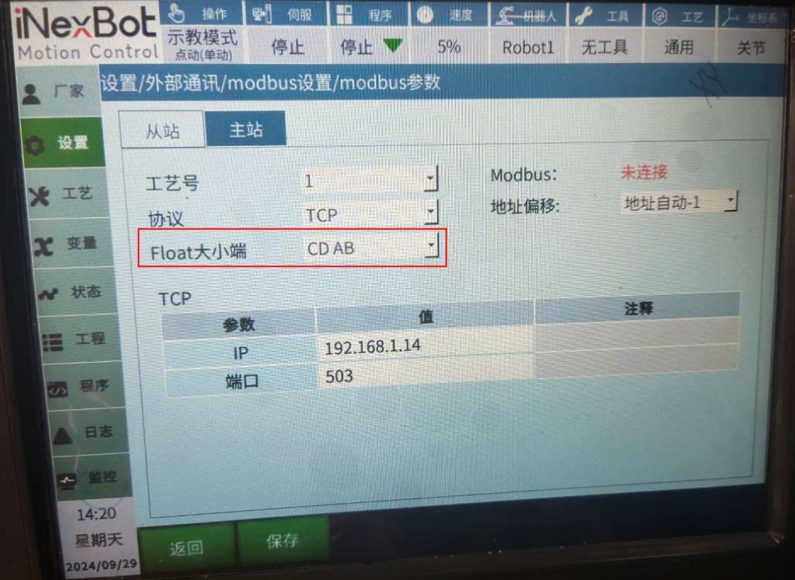

Float大小端选项有四个，分别是：

AB CD \CD AB \BA DC \DC BA

#### 大小端模式解释：

- **AB CD**: 这种模式表示数据是以大端模式存储的，高位字节在前。

- **CD AB**: 这种模式表示数据是以小端模式存储的，低位字节在前。

- **BA DC**: 同样是大端模式，但是高位字节和低位字节的顺序颠倒。

- **DC BA**: 同样是小端模式，但是高位字节和低位字节的顺序颠倒。

#### 示例：

如果示教器端选择了 CD AB 模式，那么这意味着数据是以小端模式存储的。在这种情况下，为了保证数据的正确传输和解析，**modbus poll** 软件也需要设置为相同的 Float CD AB 格式来读写、修改相应的地址。

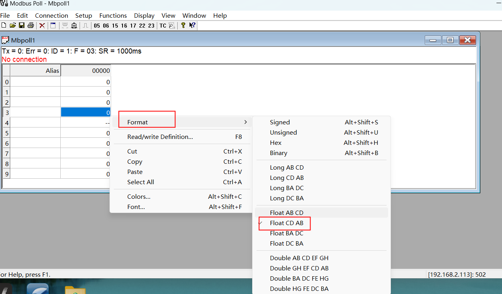

#### 注意事项：

- 在设置大小端模式时，必须保证发送方和接收方一致，否则会导致数据解析错误。

### MODBUS_WRITE---MODBUS写指令

格式：MODBUS_WRITE【指令名称】ID【工艺号】4X /4X-bit/
0X【地址类型】B001【数据存放首个变量】1【从站寄存器首地址】5【写从站地址个数】。

功能：该指令用于通过Modbus将变量写入从站寄存器中对应位置的地址中。

参数：

1.  工艺号：范围\[1,9\]指令里面选择的工艺号需要和modbus参数界面选择的工艺号保持一致。

2.  地址类型：

- 4X:将变量里的值写入地址码。

- 4X-bit：将变量组成16位二进制码写入地址码中。

- 0X：将变量值写入地址码，只有"0"，"1"两种状态，变量有值的话写入1，变量没值写入0。

3.  数据存放的首个变量：写入的变量类型。

4.  从站寄存器首地址：开始写入的第一个地址，如果首地址为5，执行写指令会从modbus第5个地址开始写入。

5.  写从站地址个数：写入的地址个数，如果写入的地址个数为3，表示从首地址开始写入3个地址（包括首地址）。

**示例说明1：**地址类型4X，数据存放的首个变量为GI001从站首地址1，写从站地址个数5。

执行modbus写指令，会将以及被赋值的变量的变量值写入到对应的modbus地址码\-\-\--GI001的值写入modbus地址1、GI002的值写入modbus地址2、依次写入，直到modbus地址5写入完成。

注意事项：当MODBUS_WRITE指令"数据存放的首个变量"。

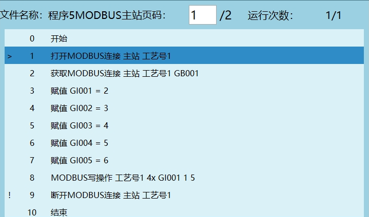

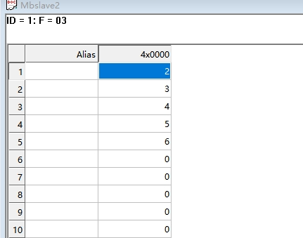

**示例说明2：**地址类型4X-bit，数据存放的首个变量为I001,从站首地址1，写从站地址个数10。

如下图所示I001=1对应地址1、I002=2对应地址2、I003=0对应地址3、I004=4对应地址4、I005=5对应地址5、I006=6对应地址6、I007=1对应地址7，依次排列I008、I009、I010分别对应的是地址8、地址9、地址10，因为I008、I009、I010没有赋值默认0表示。

因此I001-I010所赋的值用二进制表示（从左往右）为00 0111 1011，00 0111
1011转为十进制为123。

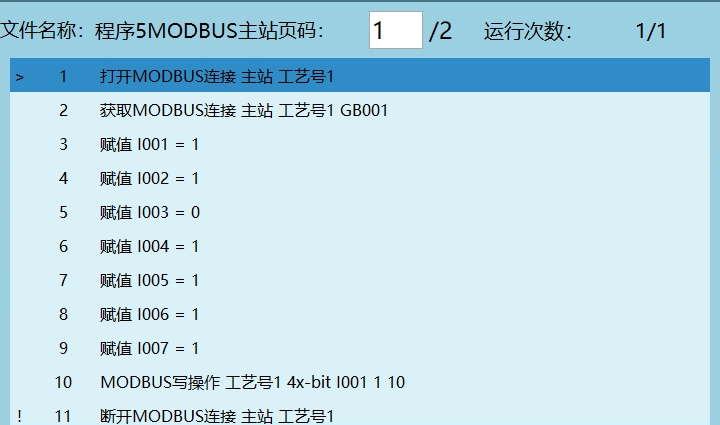

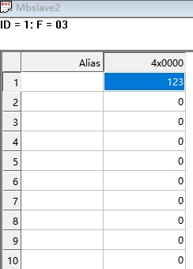

注意事项：

1.  地址类型4X-bit时地址个数范围为\[0,16\]。

2.  地址类型为4X-bit时存到变量时候的17位为符号位，0表示正数，1表示负数。

**示例说明3：**地址类型4X，数据存放的首个变量为GS001,从站首地址1，写从站地址个数5。

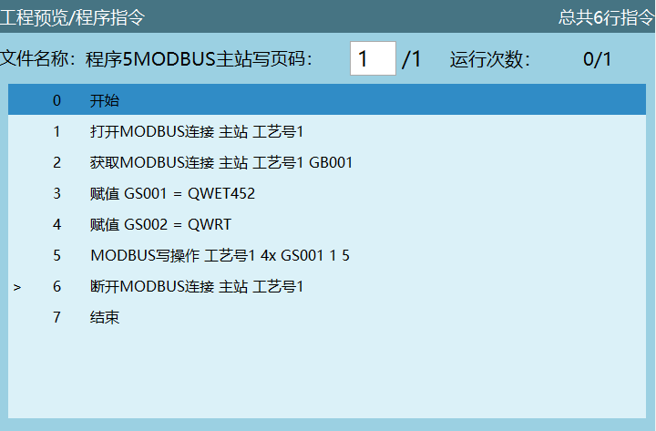

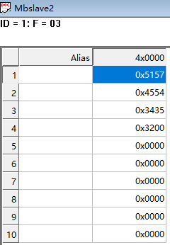

执行效果：执行Modbus写指令将字符变量GS001的值写入到地址。

注意事项：

字符变量只能写入到一个地址，不会顺延写入。

例如：如果设置的首变量是GS001,写入个数为5，在程序里面给变量GS001、GS002、GS003、GS004、GS005都赋值，执行modbus写指令只会将变量GS001的值写入到地址，GS002-GS005的值无法写入。

4.  地址的Format改成十六进制Hex。

5.  一个地址码对应两个字符，一个字符对应两位16进制数。

例如上图所示GS001=QWET452,Q转十六进制是51，W转十六进制是57，字符QW转十六进制后写入地址1，字符ET写入地址2，字符45写入地址3，字符2写入地址4的第一位。写入进去的数值是否正确可对照ASCII码表。

[ASCII码对照表](https://blog.csdn.net/sunyctf/article/details/131397591)

## Modbus从站

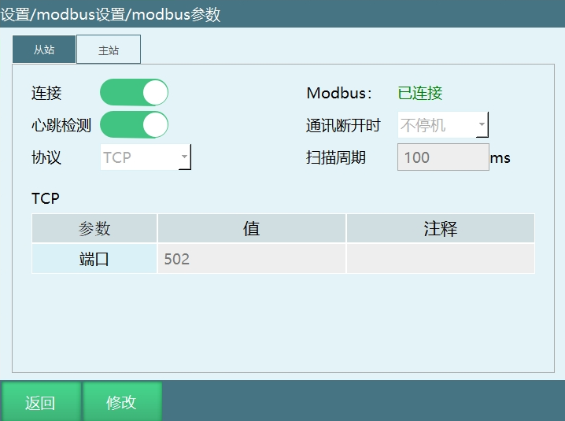

连接：打开连接使能开关后连接Modbus，不打开使能Modbus无法连接成功。

Modbus:监测Modbus连接状态。

心跳检测：打开后用于检测Modbus与控制器之间的收发频率，断开Modbus连接后心跳检测显示数据收发关闭。

通讯断开时：

- 停机：Modbus通讯断开时，机器人下电。

- 不停机：Modbus通讯断开时，机器人不下电。

协议：

- RTU：串口232、485通讯。

- TCP：TCP协议。

扫描周期：指系统扫描Modbus中范围内的数据的周期。

***系统默认的超时时间为500ms，500ms没有收到数据的话默认自动断开。***

### Modbus poll从站连接

#### TCP协议

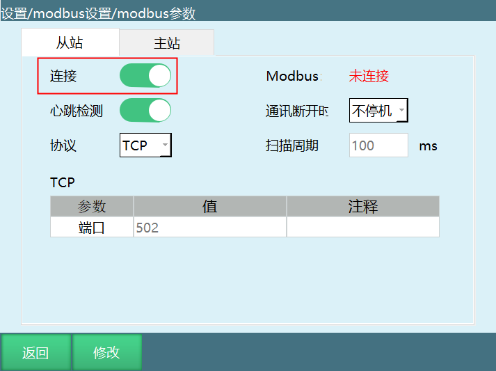

1.  点击设置-Modbus设置-Modbus参数，进入Modbus参数界面，打开连接开关。

2.  打开ModbusPoll软件。

3.  打开软件后点击 Connection，选择Connect,进入Concection Setup 界面。

4.  connection选择ModbusTCP/IP，IP Address为当前连接的控制器IP。

设置好参数（图片填写参数仅为示例），点击ok。

注：IP地址是当前连接控制器的IP,选择TCP协议时主机的IP网段需要和控制IP网段一致。

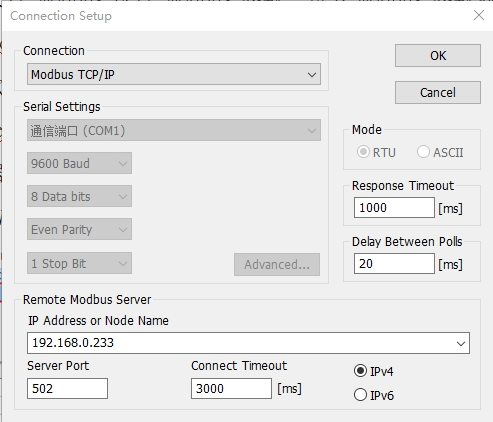

5.  示教器页面显示已连接，如在Modbus参数界面显示已连接和未连接闪烁画面，需要在Setup------Read/Write
    Definition将Scan Rate参数的1000ms改为100ms。

6.  Modbus 连接成功后就可以通过地址码控制机器人。

**示例说明1**：Modbus切换伺服状态；

4X类型地址码29写2，伺服停止；

4X类型地址码29写1，伺服就绪。

**操作方式**：

1.  点击Setup-Read/Write Definition。

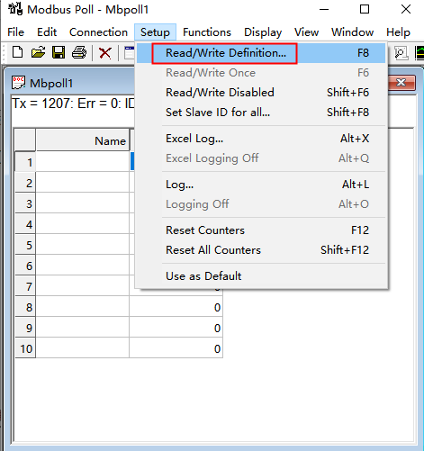

2.  进入Read/Write
    Definition界面，选择地址类型为4X，设置起始地址Address、地址个数Quantity，勾选PLC
    Addresses （Base
    1），设置好参数之后点击OK就可以在对应的地址码输入数值。

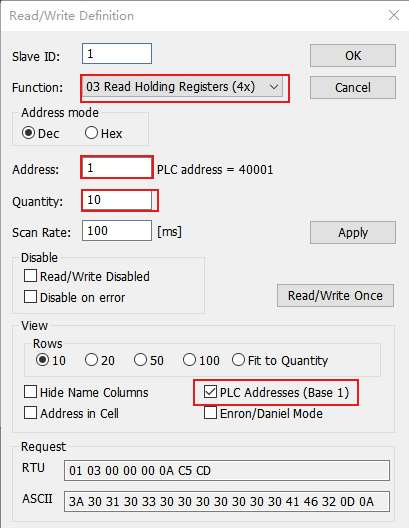

3.  双击对应的地址，填写相关地址码：

地址码29，Value写1，伺服状态切换为就绪；

地址码29，Value写2，伺服状态切换为伺服停止。

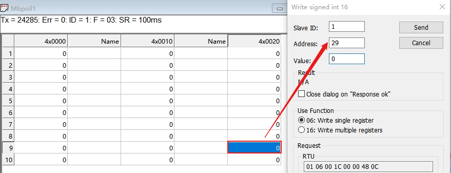

#### RTU协议

**232通讯**

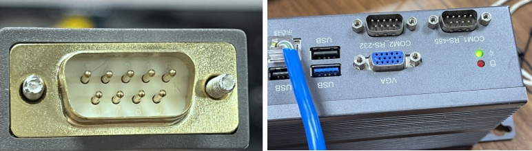

232通讯接线：

232串口线的引脚2接控制器COM2_RS-232端口的引脚3；

232串口线的引脚3接控制器COM2_RS-232端口的引脚2；

232串口线的引脚5接控制器COM2_RS-232端口的引脚5。

接线完成后打开ModbusPoll软件：

点击 Connection，选择Connect,进入Concection Setup 界面，如下图所示：

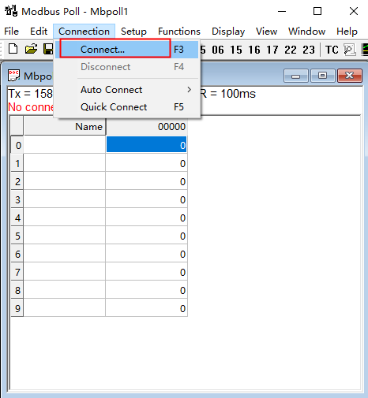

7.  connection选择Serial Port，Serial Setting 选择识别到的串口。

号，设置好参数（图片填写参数仅为示例），点击ok。

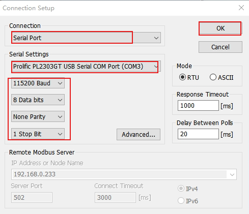

8.  Modbus连接成功。

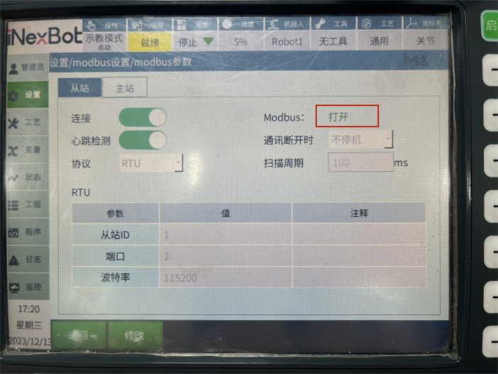

9.  Modbus
    连接成功后就可以通过地址码控制机器人，具体功能的地址码可以在《Modbus地址码列表》查看。

**485通讯**

485通讯接线：

485串口线的引脚1接控制器COM1_RS-485端口的引脚2；

485串口线的引脚2接控制器COM1_RS-485端口的引脚1。

1.  接线完成后打开ModbusPoll软件。

2.  点击 Connection，选择Connect,进入Concection Setup 界面。

3.  connection选择Serial Port，Serial Setting 选择识别到的串口。

号，设置好参数（图片填写参数仅为示例），点击ok。

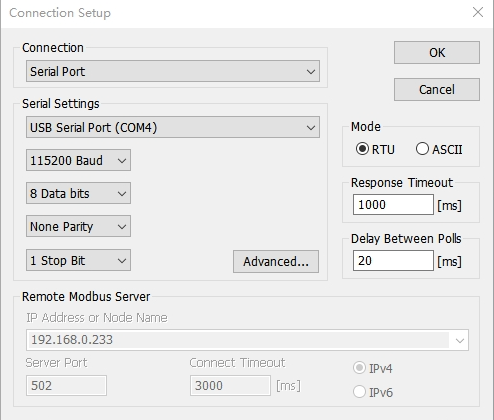

4.  Modbus连接成功。

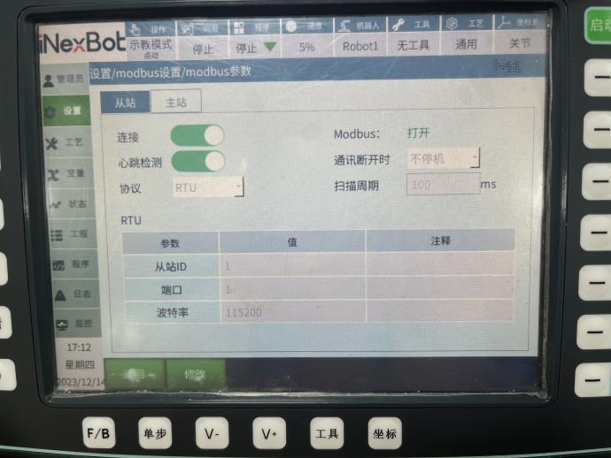

说明：

1.  232、485通讯时端口号要注意填写正确。

## Modbus主站

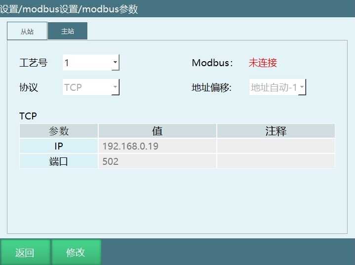

工艺号：主站连接时的工艺号，支持1-9个工艺号。

协议：TCP、RTU(232、485通讯)。

Modbus：监测Modbus主站连接状态。

地址偏移：

地址自动-1：起始地址为1。

地址不变：起始地址为0。

### Modbus slave主站连接

#### TCP协议

如下图所示，TCP通讯时的IP地址为当前主机地址，不是当前所连接的控制器IP。

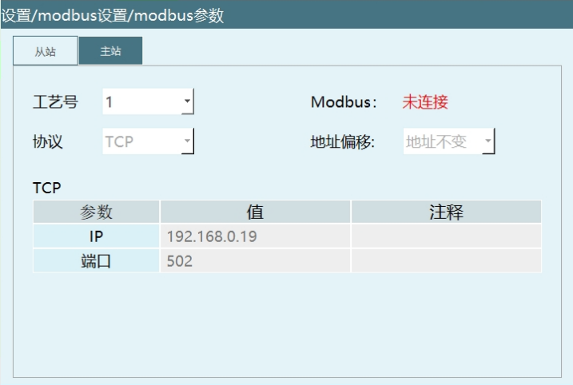

1.  Modbus主站参数界面设置参数。

2.  新建工程，插入modbus指令。

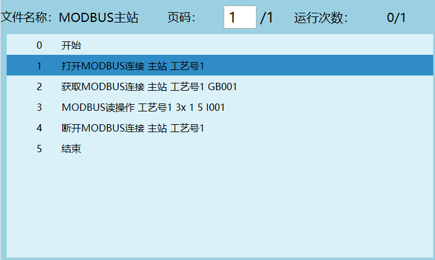

3.  打开Modbus Slave软件。

4.  打开软件后点击 Connection，选择Connect,进入Concection Setup 界面。

5.  Connection选择ModbusTCP/IP，Port端口号需要和Modbus参数界面设置的端口号一致，点击ok。

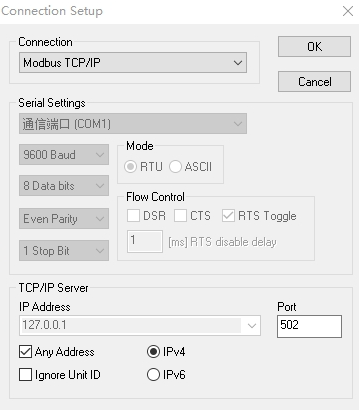

6.  执行第2步工程界面打开MODBUS连接指令,Modbus主站连接成功。

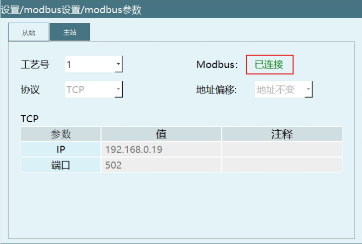

#### RTU协议

232、485通讯时接线方法可查看Modbus poll从站连接部分。

### Modbus 主站读取参数

功能：将Modbus地址里的参数读取到变量。

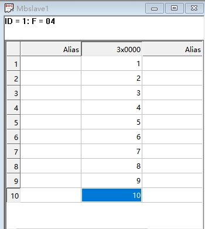

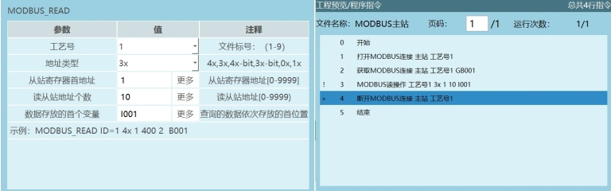
示例说明：

1.  打开Modbus主站通讯；

2.  Modbus主站连接成功的话变量GB001=1,否则GB001=0；

3.  执行Modbus读指令将Modbus
    slave对应地址的值读取到变量，首变量I001,读地址个数为10执行指令后将主站地址1-地址10的值读取到变量I001-I010；

4.  断开Modbus主站连接。

### Modbus 主站写入参数

功能：将赋值的变量值写入到对应的地址，如下为示意图。

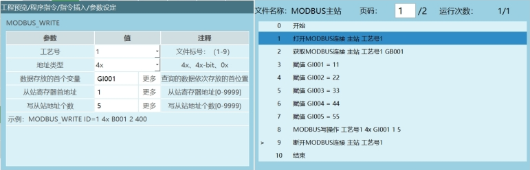

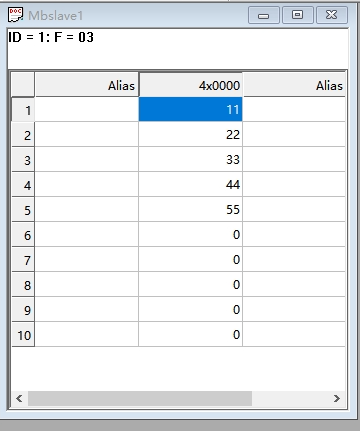

示例说明：

1.  打开Modbus主站通讯；

2.  Modbus主站连接成功的话变量GB001=1,否则GB001=0；

3.  3-8行指令给写入的变量赋值；

4.  执行Modbus写指令将GI001-GI005的值写入到主站地址1-地址5;

5.  断开Modbus主站连接。

### **Modbus修改地址码**

1.  插入u盘，导出控制器配置。

2.  在导出的配置文件中找到modbusAddr.json文件。

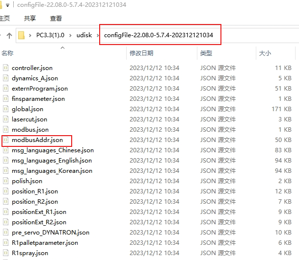

3.  使用Notepad++等文本编辑软件打开

4.  打开后可以看到一个{
    }中包含一组地址码参数（系统会自动生成一份原始地址码）。

5.  修改地址直接更改addr后的数字，数字为0时，该地址码功能无效。

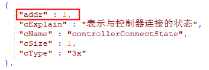

注意事项：修改的地址码不能和其它地址码一样，否则会影响其它功能的使用。

6.  修改完成后点击保存。

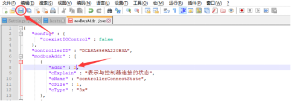

7.  然后重新导入修改完参数的配置文件，重启生效。

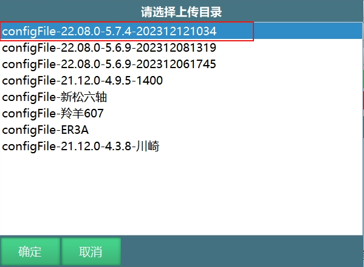

## Modbus配置地址码工具使用说明

Modbus配置地址码工具使用说明：

打开软件1导入地址码配置文件（modbusAddr），2打开配置文件

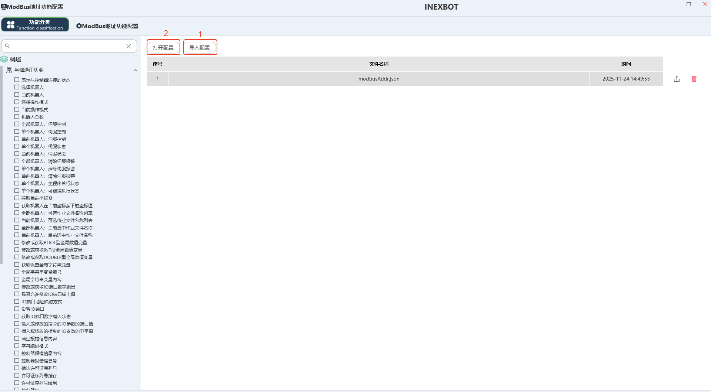

进入配置界面，软件左侧是功能分类

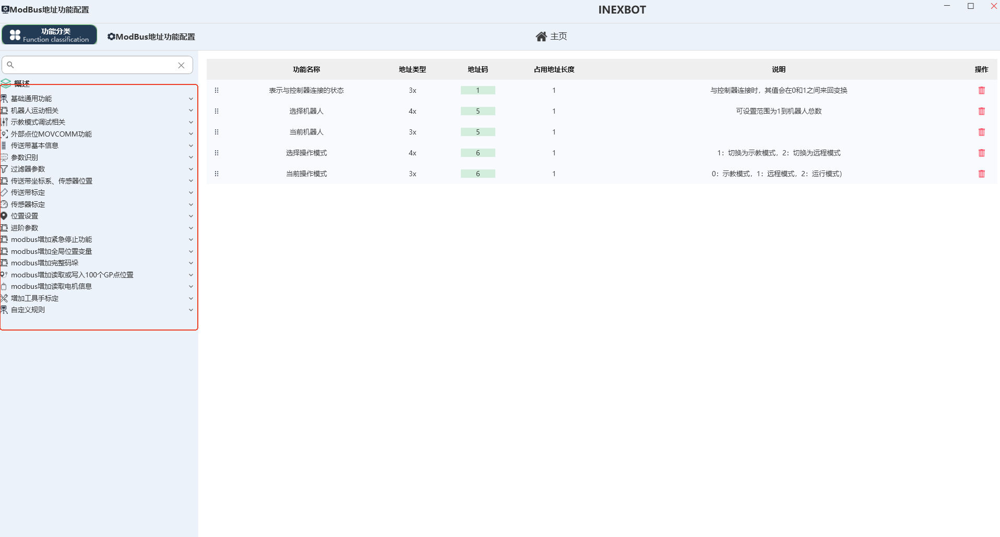

如下图所示选择对应功能软件这边会显示每个功能对应的功能名称，地址类型等信息，左侧1取消勾选，则对应地址码信息也会在2里面取消显示。

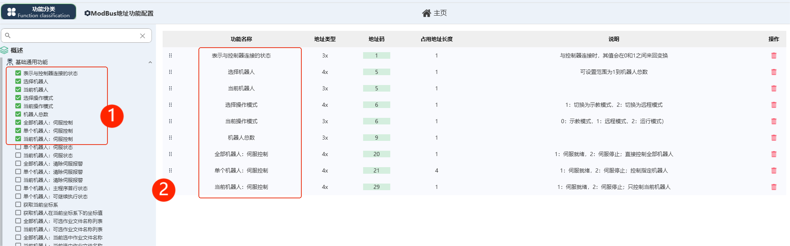

说明：用户可以自己修改对应功能的地址码（修改的地址码不能和其它功能地址码冲突，否则会导致其它功能无法使用）

点击删除会将这个功能在此配置文件删除掉，谨慎操作。

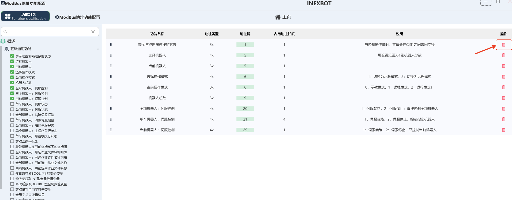

整个文件都修改结束后点击主页，进入到界面2

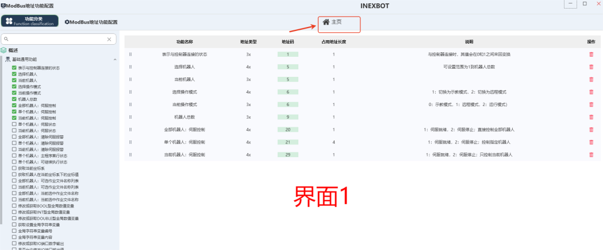

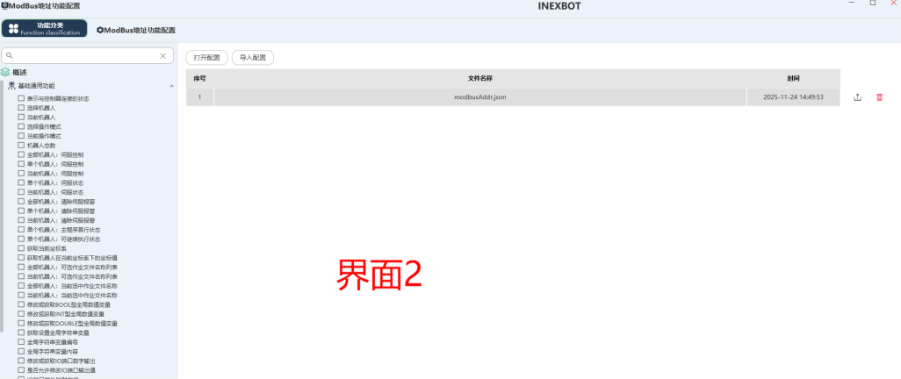

点击次按钮可以将配置文件导出

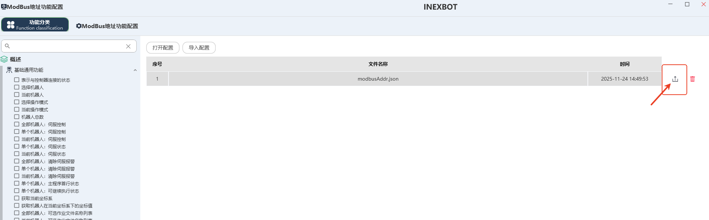

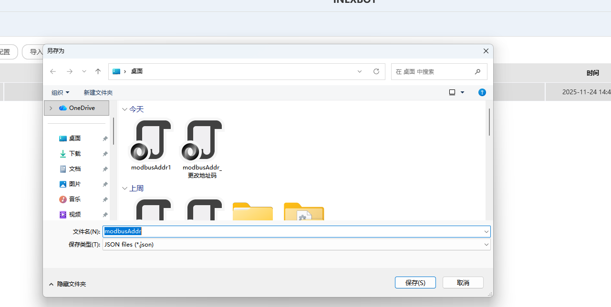

说明：软件里所有功能的划分是根据modbus地址码列表（新）来定义的

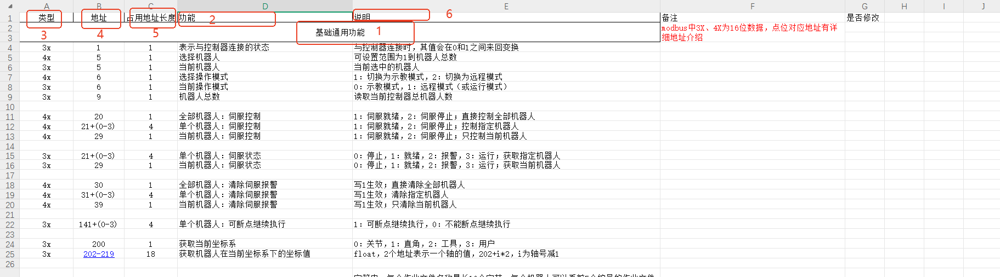

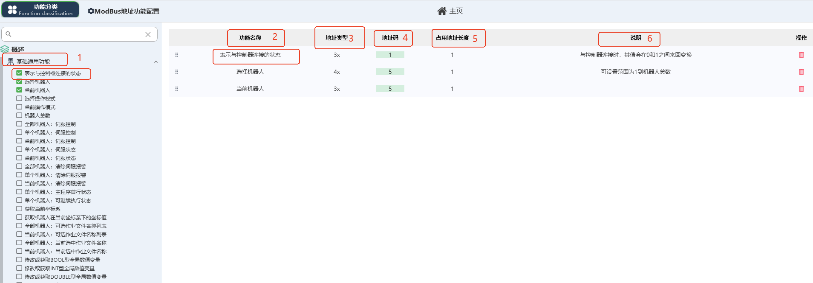

## Modbus的使用

#### Modbus远程运行程序

Modbus程序如何运行请看《示教与运行》手册。

#### Modbus修改全局位置变量

1.  4X类型2004地址码写0，表示GP点。

2.  4X类型2004地址码写1，表示GE点。

如下图2004地址码写0，变量类型为GP。

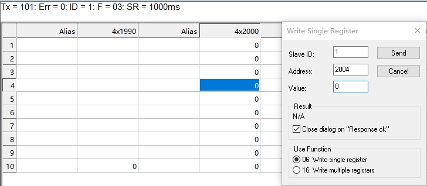

3.  4X类型2000地址码写的数值表示选中的变量编号，编号为1-9999。

如下图2000地址码写1，选中GP0001变量：

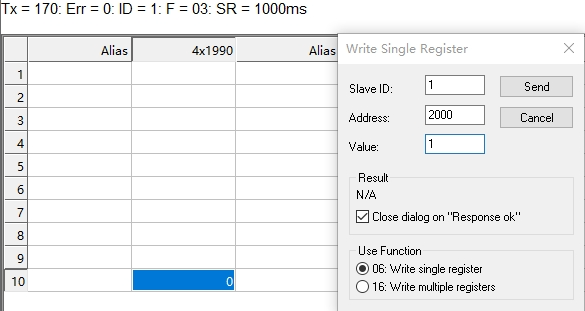

4.  修改机器人点位：地址码2017-2028。

2017-2028的Format改为FloatCD AB，输入参数值。

如图修改GP0001变量机器人点位为（34，45，23，23，34，56），地址码从2017开始包括2017，每2个地址码代表机器人一个轴的值，即2017、2018表示1轴坐标，2019、2020表示2轴坐标，2021、2022表示3轴坐标，2023、2024表示4轴坐标，2025、2026表示5轴坐标，2027、2028表示6轴坐标。

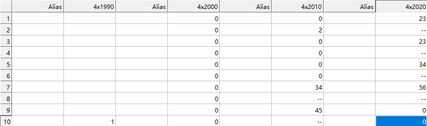

5.  修改外部轴点位：地址码2031-2036，且仅支持3个外部轴。

2031-2036的Format改为FloatCD AB，然后输入数值。

Modbus地址码从2031开始，包括2031。2031、2032表示O1坐标、2033、2034表示O2坐标、2035、2036表示O3坐标。

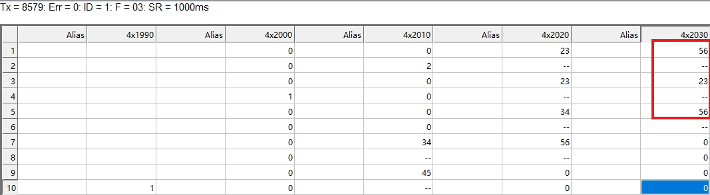

6.  修改完参数后地址码2003写1，表示将修改完的值写入变量，即保存。

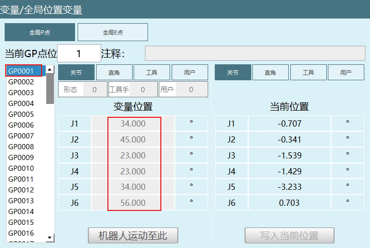

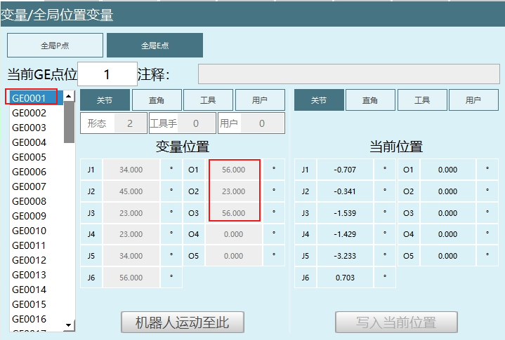

#### Modbus写入读取100个位置

起始地址3000,每个GP点坐标系占一位，形态占一位。每个轴位置占两位。

起始变量：GP0001。

如图所示：地址码3000表示GP0001的坐标系，地址码3001表示GP0001的形态，

地址码3002、3003表示一轴点位，地址码3004、3005表示二轴点位，地址码3006、3007表示三轴点位，地址码3008、3009表示四轴点位，地址码3010、3011表示五轴点位，地址码3012、3013表示六轴点位。

地址码3014、3015表示GP0002的坐标，形态，地址码3016-3027表示GP0002坐标轴点位，依次类推。

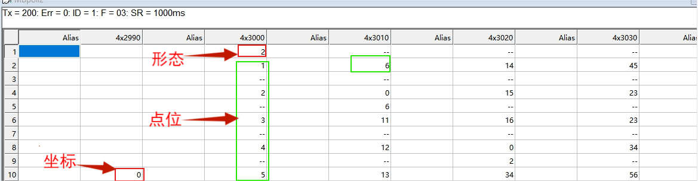

说明：每个轴位置的地址码Format为FloatCD AB。

## Modbus多主站连接

1.  将电脑与一个或多个触摸板通过交换机连接到控制器上。

2.  控制器作为从站，Modbus poll和触摸板作为主站，Modbus
    poll可以多开作为多个主站，目前最多支持同时连接9个主站。

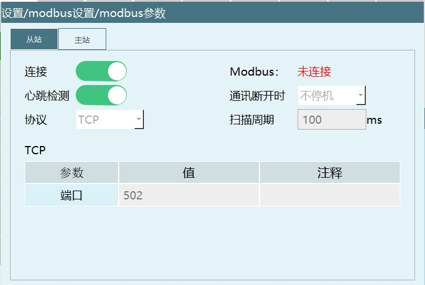

3.  Modbus
    poll点击connection选择connect，连接类型选TCP,IP地址与端口号与示教盒保持一致，扫描周期与示教盒一致。

4.  Modbus Poll与触摸板可以同时控制机器人。

## Modbus与IO优先级

1.  通过显示器进入控制器在robot/config/目录下找到ModbusAddr.json，或者导出配置后修改ModbusAddr.json文件。

2.  打开ModbusAddr.json。

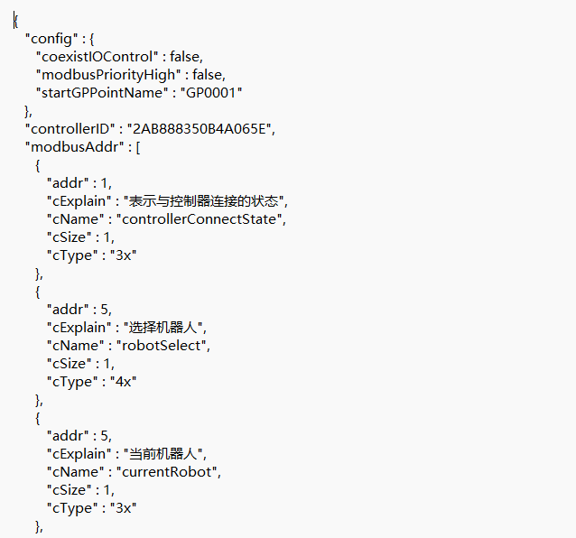

3.  coexistIOControl：false表示Modbus与IO不共用；Modbus连接上时IO不能控制机器人。

<!-- -->

4.  coexistIOControl：true表示Modbus与IO共用，Modbus和IO可以同时控制机器人。

当modbus与IO共用时，此时调取作业文件调取的是【远程程序设置】中的作业文件，同时【操作参数中-预约模式】必须打开。

5.  coexistIOControl：false，ModbusPriorityHigh：false/true都无影响。

Modbus默认优先级高且Modbus连接上时IO不能控制。

6.  coexistIOControl：true，ModbusPriorityHigh：false。

表示
modbus和IO共用且IO优先级高，即Modbus和IO可以同时控制机器人，modbus和IO的断点与当前行运行逻辑根据示教盒上设置的执行。

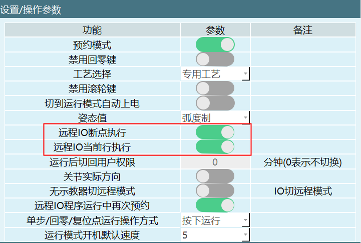

7.  当coexistIOControl：true，modbusPriorityHigh：true。

表示IO不能运行自己的程序，而是IO(在示教器上的设置）控制modbus选择的程序以及运行次数和总次数。
且在共用时，只要优先级高的那一方未连接，另一方功能不可用。

##  Modbus触摸屏使用流程

本节使用威纶通触摸屏、modbusTCP协议为例；触摸屏型号为MT6071iP。

编写程序------设置Modbus程序------设置Modbus参数------切换到远程模式------触摸屏准备------选择程序------运行。

1.  编写程序

用示教器编写程序，要保证能正常运行。

2.  设置Modbus程序

在"设置-Modbus设置-Modbus程序"中设置好程序，设置成功会已选程序列表会显示该程序名称，共可以设置1000个程序。

3.  设置Modbus参数

在"设置-Modbus设置-Modbus参数"中设置协议为TCP，控制器作为主/从站设置为从站，IP不修改，端口设置为502，打开连接使能；重启控制器后生效。

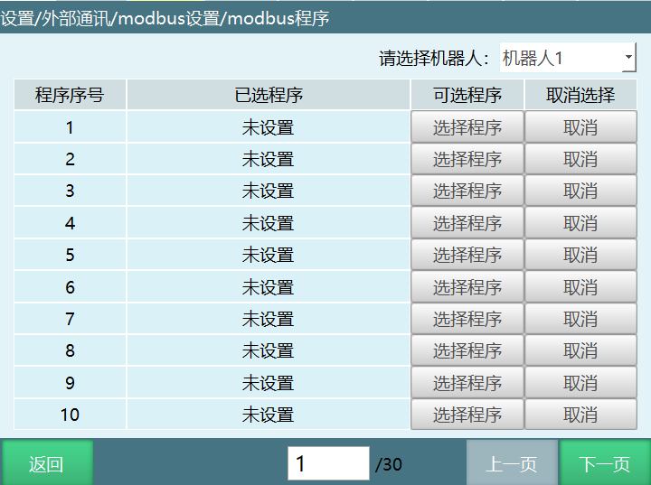

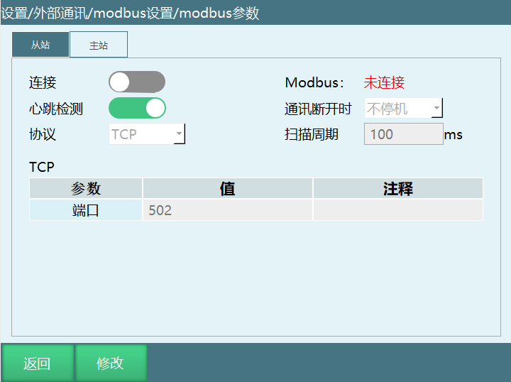

Modbus参数说明

连接：Modbus设置完成需打开连接按钮，右侧可查看连接状态。

心跳检测：打开后用于检测Modbus与控制器之间的收发频率，断开Modbus连接后心跳检测显示数据收发关闭。

协议：分为TCP协议、RTU协议。

主/从站：主站、从站。

TCP参数：

IP：Modbus设备IP地址，仅设置为主站时有效。

端口：Modbus设备端口。

RTU参数**：**

从站ID：默认为1即可。

端口：控制器串口号。

波特率：填触摸屏对应的波特率。

1.  切换到远程模式

将模式选择钥匙旋转到远程模式位置或点击程序中的模式状态，选择远程模式。

注：当控制器同时连接IO、Modbus设备、示教器时，三个设备的优先级为示教器\>Modbus设备\>IO设备。当切换到远程模式后，以Modbus设备有效，IO设备无效，此时关闭Modbus设备中的使能按钮，则IO有效。

2.  触摸屏准备

将触摸屏RJ45网口、示教器网口、控制器"示教盒"网口连接到同一交换机上。

触摸屏连接控制器IP：192.168.1.13，端口：502。

触摸屏程序编辑好后运行，示教盒远程界面Modbus未连接变为Modbus已连接。如图：

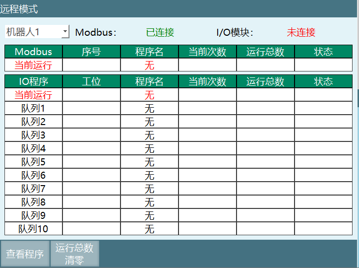

3.  选择程序

使用触摸屏向4x类型地址码45写1，机器人1选中演示程序1；

使用触摸屏向4x类型地址码61写5，机器人1设置运行次数为5（不生效），使用触摸屏向4x类型地址码71写1，确认修改运行次数（运行次数5生效）。

4.  运行

使用触摸屏向4x类型地址码29写1，切至伺服就绪；

使用触摸屏向4x类型地址码19写1，运行作业文件。

---

##  AI 检索专用问答对 (Q&A for Retrieval)

**Q: Modbus连接失败怎么办?**

A: 检查网络连接是否正常，确保IP地址和端口设置正确；确认Modbus参数中的连接使能开关是否打开；检查协议选择是否正确（TCP或RTU）；验证从站ID设置是否正确；检查串口接线是否正确（RTU协议）；查看系统默认超时时间为500ms，确保在超时时间内有数据收发。

**Q: 如何区分Modbus主站和从站?**

A: 主站：主动发起通讯请求，读取或写入从站数据；从站：被动响应主站请求，提供数据或接收数据；控制器可以作为主站或从站，根据实际应用场景选择；通常，PLC、触摸屏等设备作为主站，控制器作为从站。

**Q: 如何修改Modbus地址码?**

A: 1. 插入U盘，导出控制器配置；2. 在导出的配置文件中找到modbusAddr.json文件；3. 使用Notepad++等文本编辑软件打开；4. 修改addr后的数字，数字为0时该地址码功能无效；5. 注意：修改的地址码不能和其它地址码重复；6. 修改完成后保存，重新导入配置文件并重启控制器。

**Q: Modbus与IO的优先级如何设置?**

A: 通过修改ModbusAddr.json文件中的coexistIOControl和ModbusPriorityHigh参数；coexistIOControl：false表示Modbus与IO不共用；true表示共用；ModbusPriorityHigh：true表示Modbus优先级高；false表示IO优先级高；当coexistIOControl为true时，需要打开【操作参数中-预约模式】。

**Q: 如何使用Modbus读取不同类型的数据?**

A: 整型：选择对应的变量类型（如I、GI），地址类型选择3X或4X；浮点型：选择D类型变量，地址类型选择3X，将地址的Format改为Float CD AB，读从站地址个数应为偶数；字符型：选择S类型变量，地址类型选择3X，将地址的Format改成十六进制Hex；布尔型：选择B类型变量，地址类型选择0X或1X。

**Q: Modbus多主站连接的限制是什么?**

A: 控制器作为从站，支持多个主站同时连接；目前最多支持同时连接9个主站；多个主站（如Modbus Poll和触摸屏）可以同时控制机器人；所有主站的IP地址需要与控制器在同一网段。

**Q: 如何使用Modbus远程运行程序?**

A: 1. 在"设置-Modbus设置-Modbus程序"中设置好程序；2. 在"设置-Modbus设置-Modbus参数"中设置协议为TCP，控制器作为从站；3. 将模式选择钥匙旋转到远程模式位置；4. 使用触摸屏或其他Modbus主站向4x类型地址码45写入程序编号；5. 向4x类型地址码61写入运行次数，向71写入1确认；6. 向4x类型地址码29写1切至伺服就绪；7. 向4x类型地址码19写1运行作业文件。

**Q: 如何修改全局位置变量?**

A: 1. 4X类型2004地址码写0表示GP点，写1表示GE点；2. 4X类型2000地址码写变量编号（1-9999）；3. 修改机器人点位：地址码2017-2028，Format改为Float CD AB；4. 修改外部轴点位：地址码2031-2036，Format改为Float CD AB；5. 修改完参数后地址码2003写1保存。

**Q: Modbus通讯断开时机器人会停机吗?**

A: 在Modbus参数设置中，有"通讯断开时"选项；选择"停机"：Modbus通讯断开时，机器人下电；选择"不停机"：Modbus通讯断开时，机器人不下电；根据实际应用场景选择合适的选项。

**Q: 如何排查Modbus通讯问题?**

A: 检查网络连接和串口接线；验证IP地址、端口、从站ID等参数设置；打开心跳检测，观察数据收发状态；检查ModbusAddr.json文件中的地址码配置；查看控制器日志，了解具体错误信息；确保主站和从站的扫描周期设置合理。

**Q: 如何设置浮点数的大小端模式?**

A: 在Modbus参数设置界面，从站和主站界面都有浮点数大小端交换的设置选项；有四个选项：AB CD（大端模式）、CD AB（小端模式）、BA DC、DC BA；设置时需要保证发送方和接收方的大小端模式一致；例如，如果示教器端选择了CD AB模式，那么Modbus poll软件也需要设置为相同的Float CD AB格式。

**Q: 大小端设置错误会导致什么问题?**

A: 大小端设置错误会导致数据解析错误，可能会读取到完全不同的数值，甚至是无效的浮点数；例如，正确的浮点数123.45可能会被解析为一个非常大或非常小的数。

**Q: 如何测试大小端设置是否正确?**

A: 1. 在Modbus设备中写入一个已知的浮点数，如123.45；2. 使用Modbus poll软件以不同的大小端模式读取该地址；3. 找到能正确显示123.45的模式，即为正确的大小端设置。

**Q: 如何使用Modbus配置地址码工具?**

A: 1. 打开软件，导入地址码配置文件（modbusAddr）；2. 进入配置界面，左侧显示功能分类；3. 选择对应功能，软件会显示每个功能对应的功能名称、地址类型等信息；4. 可以修改对应功能的地址码（注意不能与其他功能地址码冲突）；5. 左侧取消勾选，对应地址码信息也会在右侧取消显示；6. 修改完成后点击主页进入界面2，点击导出按钮保存配置文件。

**Q: Modbus配置地址码工具的功能划分依据是什么?**

A: 软件里所有功能的划分是根据modbus地址码列表（新）来定义的。用户可以根据需要选择或取消选择对应功能，取消勾选后，对应地址码信息也会在配置文件中取消显示。

**Q: 如何导入和导出Modbus配置文件?**

A: 导入配置文件：打开软件后，点击导入地址码配置文件（modbusAddr）按钮，选择需要导入的配置文件。导出配置文件：修改完成后，点击主页进入界面2，然后点击导出按钮，将配置文件保存到指定位置。

**Q: Modbus配置地址码工具中删除功能的作用是什么?**

A: 点击删除会将这个功能在此配置文件中删除掉，这是一个谨慎操作，删除后对应功能将从配置文件中移除，无法恢复。建议在删除前备份原始配置文件。

---

##  相关资源

- [TCP通讯功能手册](./TCP通讯功能手册.md)

- [系统功能调试手册](./系统功能调试手册.md)
