# OPC-UA参数教程

## 服务端

环境准备：

1.  安装软件UaExpert。

2.  安装完成后打开软件，出现以下界面，下图标注的部分随便输入信息后点击"OK"。

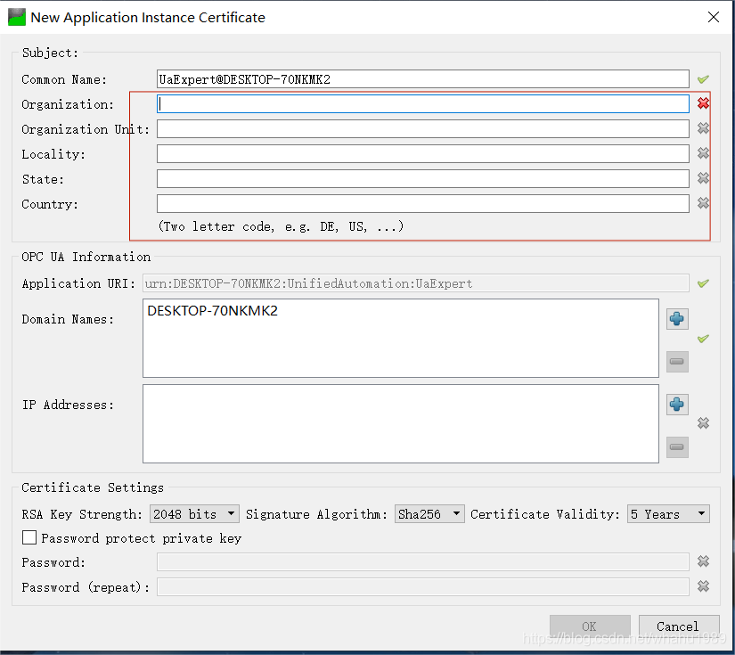

3.  界面启动，如图：

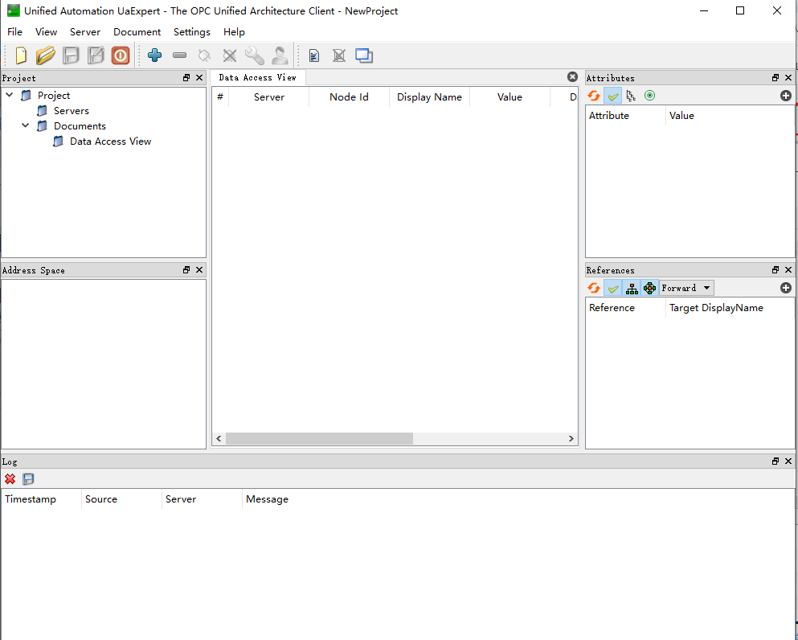

4.  连接server, opc.tcp//输入服务器ip地址：端口号。如下图所示：

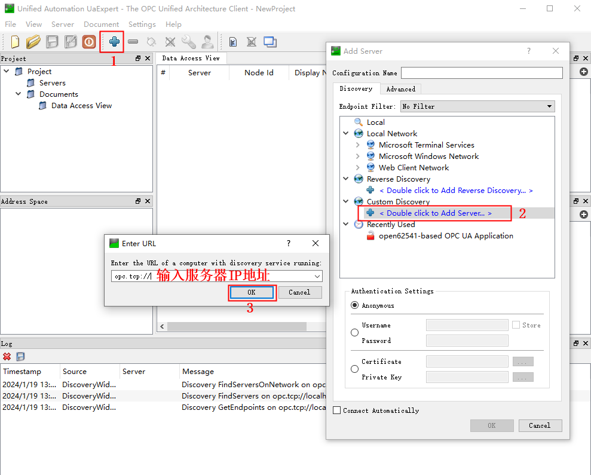

5.  出现1个open62541-based OPC UA
    Application（opc.tcp）,点击其左侧的">"符号进行展开，然后等一会就会出现server,如下图所示双击标注部分。

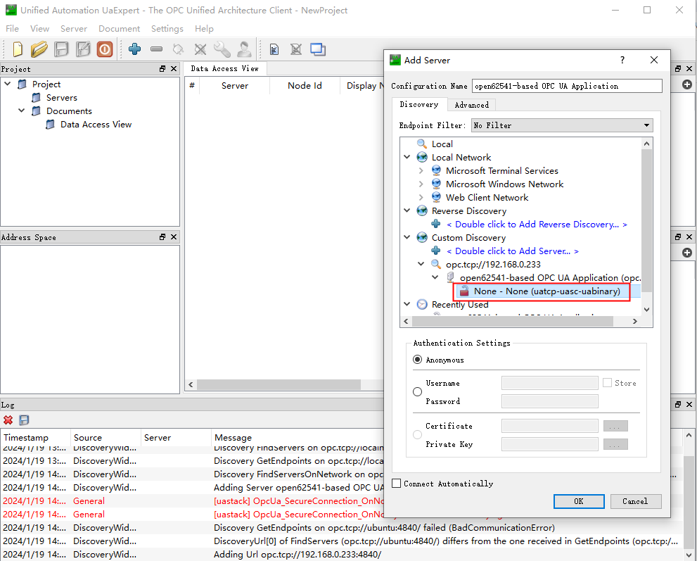

6.  点击图中标注部分，连接服务器。

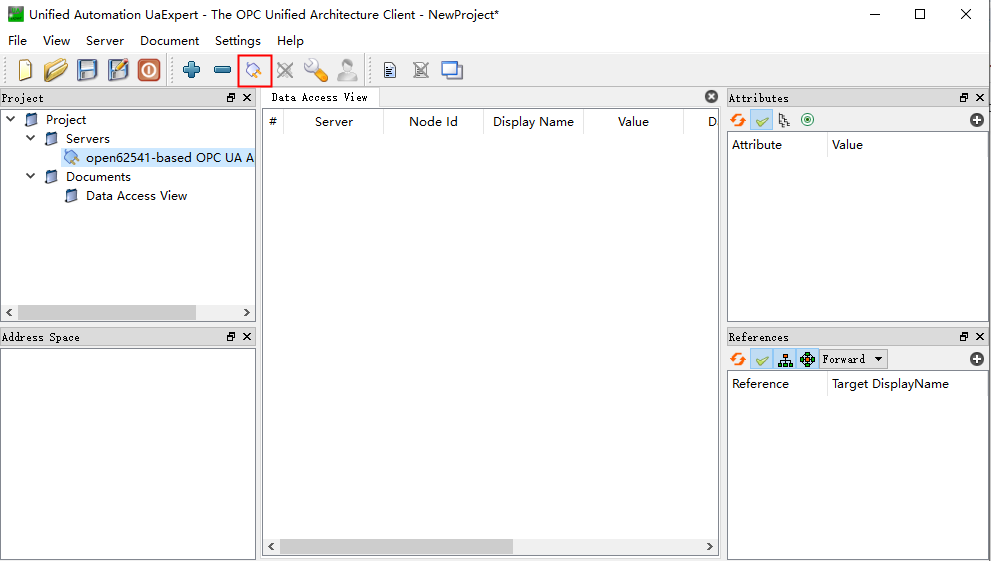

7.  连接成功。

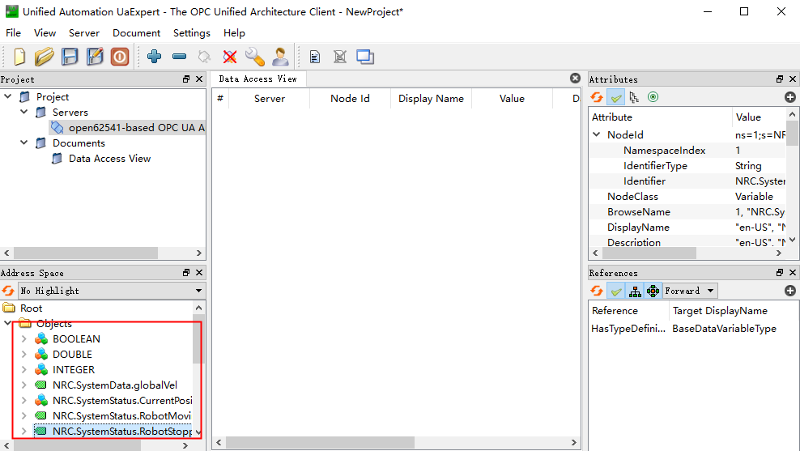

### OPC-UA参数

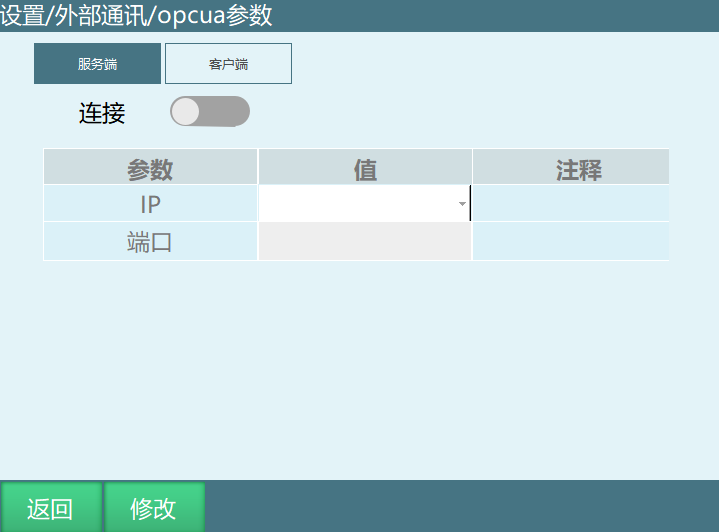

如上图所示，图中参数介绍：

连接：连接服务器。

IP:当前所连接的控制器IP。

端口：通讯端口。

## 读写参数

控制器和UaExpert软件连接成功后将绿色标签拖入右侧进行读写，需要修改或者读取某个参数，可将对应的文件拖动置右侧区域修改。

例如：如下图修改全局速度参数为23%。

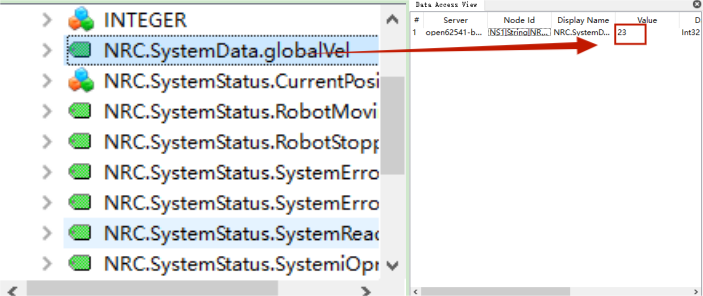

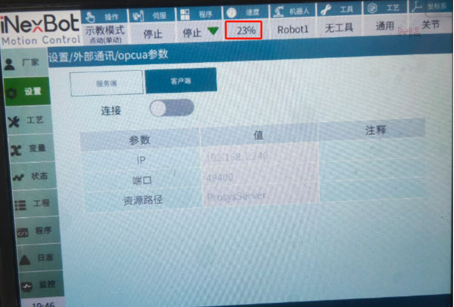

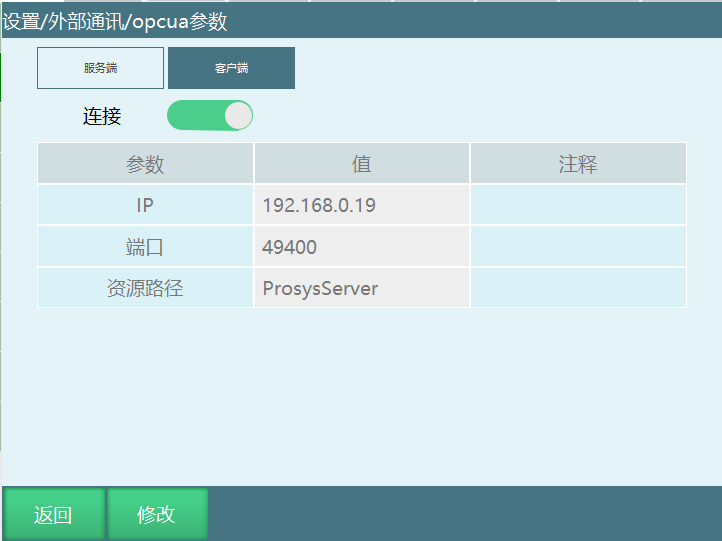

## 客户端

环境准备：

1.  安装软件Prosys-OPCUA-Simulation-Server。

2.  打开prosys-opc-ua-simulation软件，按照如下设置，设置完后关闭软件重新打开。

注：localhost即windows本机ip地址。

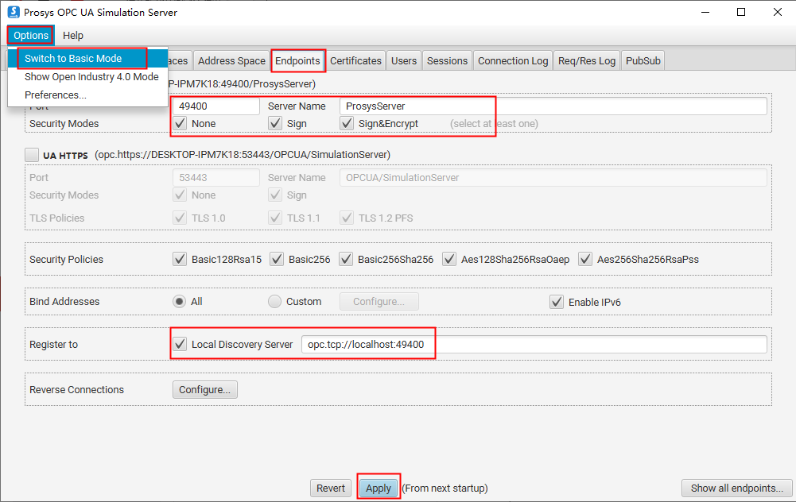

3.  添加变化的节点，以下操作以GI001为例。添加节点时Namespace所填IP为本机IP。

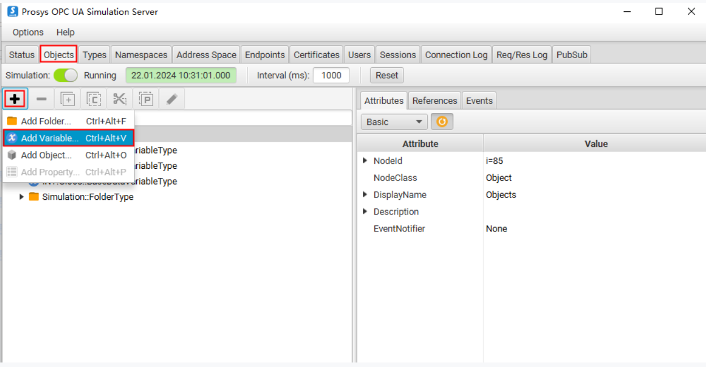

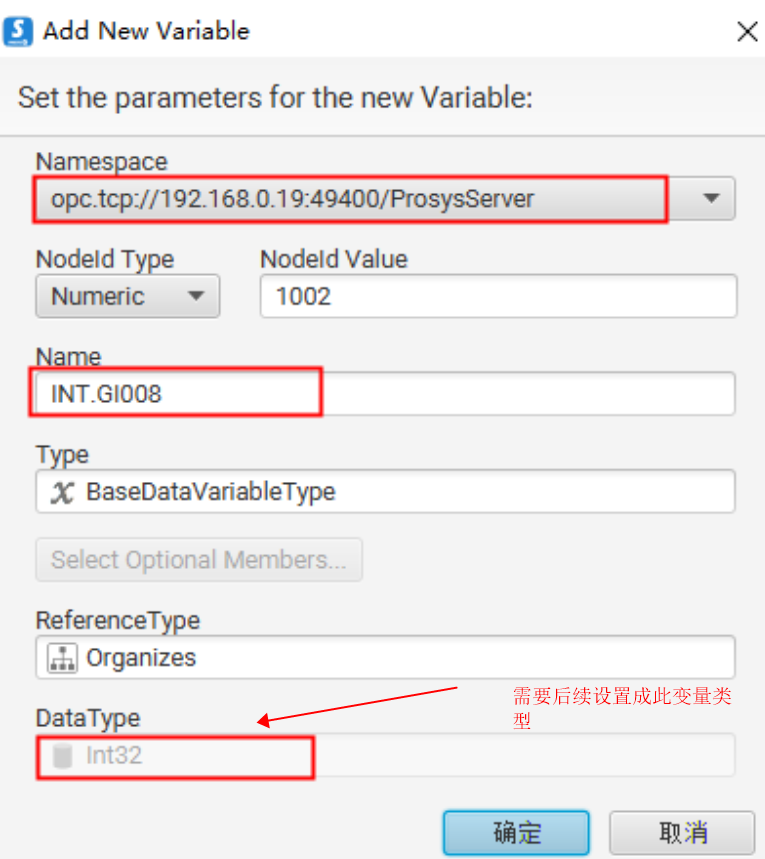

4.  设置节点value自动变化，然后观察示教器中对应的全局变量是否改变了。

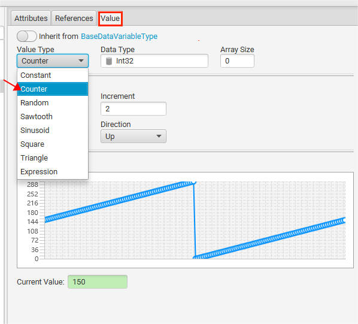

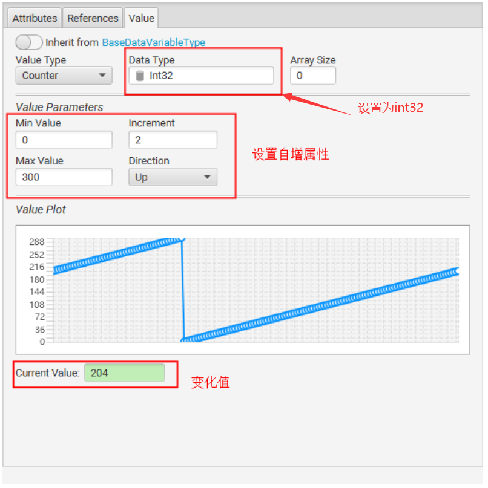

5.  添加节点后在示教器上查看对应变量的值在变化。

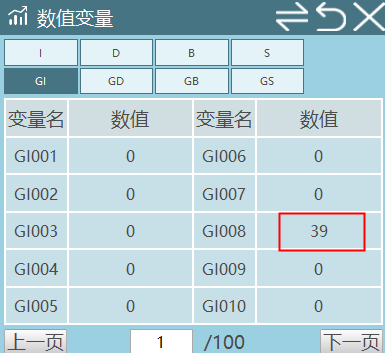

## AI 检索专用问答对 (Q&A for Retrieval)

**Q: OPC-UA连接失败怎么办?**

A: 检查网络连接是否正常，确保IP地址和端口设置正确；确认OPC-UA参数中的连接使能开关是否打开；检查UaExpert软件是否正确安装；验证防火墙是否阻挡了OPC-UA连接；确保控制器和客户端在同一网络内。

**Q: 如何区分OPC-UA服务端和客户端?**

A: 服务端：提供数据的一方，控制器作为服务端时，其他设备可以连接并读取其数据；客户端：请求数据的一方，如UaExpert软件作为客户端连接控制器；根据实际应用场景选择控制器作为服务端或客户端。

**Q: OPC-UA支持哪些数据类型?**

A: OPC-UA支持多种数据类型，包括布尔型、整型、浮点型、字符串型等；可以根据需要选择合适的数据类型进行读写操作；不同的数据类型在UaExpert软件中有不同的显示和编辑方式。

**Q: 如何修改OPC-UA的端口号?**

A: 在OPC-UA参数设置中修改端口号；默认端口号通常为4840；修改端口号后需要确保防火墙允许该端口的访问；修改后需要重新连接才能生效。

**Q: OPC-UA与Modbus有什么区别?**

A: OPC-UA是一种更现代、更安全的工业通讯协议，支持更多的数据类型和更复杂的通讯场景；Modbus是一种传统的工业通讯协议，结构简单，易于实现；OPC-UA支持更多的安全特性，如加密和认证；根据实际需求选择合适的通讯协议。

**Q: 如何验证OPC-UA连接是否成功?**

A: 在UaExpert软件中查看连接状态，连接成功后会显示绿色的连接图标；检查控制器上的OPC-UA参数设置界面，确认连接状态为已连接；尝试读写参数，验证数据传输是否正常；查看控制器日志，确认是否有连接失败的记录。

**Q: OPC-UA通讯会影响机器人正常运行吗?**

A: OPC-UA通讯设计为低优先级任务，不会影响机器人的正常运行；数据读写的过程是快速的，不会占用太多控制器资源；建议合理设置数据读写的频率，避免过于频繁的操作；如果通讯量较大，可以考虑使用更高效的网络设备。

**Q: 如何在示教器上查看OPC-UA客户端数据?**

A: 在示教器上打开OPC-UA参数设置界面；选择客户端模式；配置好服务器IP地址和端口号；连接成功后，在对应的变量中查看从服务器读取的数据；可以设置变量自动更新，实时显示服务器数据的变化。

**Q: OPC-UA支持多客户端连接吗?**

A: OPC-UA服务端支持多个客户端同时连接；多个客户端可以同时读取和写入数据；需要确保网络带宽足够，避免因通讯量过大导致的延迟；不同客户端之间的数据操作是独立的，不会相互影响。

**Q: 如何排查OPC-UA通讯问题?**

A: 检查网络连接和IP地址设置；验证防火墙是否允许OPC-UA端口的访问；查看控制器日志，了解具体错误信息；检查UaExpert软件的配置是否正确；尝试使用不同的客户端软件进行测试；确保控制器和客户端的OPC-UA版本兼容。

注意事项：

1.  如果想要测试其他数值是否可以读写，添加新的节点，不要在已有的基础上直接修改节点名，会导致一个节点被同时写。

2.  Bool类型可以设置Min Value为0，Max Value为1，Increment为1。

3.  String类型的变量可以设置为自增长读取字符串（Value
    Type选择Counter），也可设置为常量然后手动输入其他字符（Value
    Type选择Constat，Initial Value定义的变量值）。

| 节点格式 | 节点类型 | 绑定内容 |
| :--- | :--- | :--- |
| BOOL.GB001 - 999 | Boolean | 全局变量GB001-GB999 |
| INT.GI001 - 999 | Int32 | 全局变量GI001-GI999 |
| DOUBLE.GD001 - 999 | Double | 全局变量GD001-GD999 |
| STRING.GS001 - 999 | String | 全局变量GS001-GS999 |
| NRC.SystemData.GlobalSpeed | Int32 | 全局速度 |

### OPC-UA参数

{width="3.66125in"
height="2.7278127734033246in"}

注意： 不论是客户端、服务器连接和关闭时都需要重启系统才会生效。

---

##  相关资源

- [Modbus功能使用手册](./Modbus功能使用手册.md)

- [TCP通讯功能手册](./TCP通讯功能手册.md)

- [系统功能调试手册](./系统功能调试手册.md)
