# T30示教器按键介绍

## 1. T30示教器外部物理按键介绍

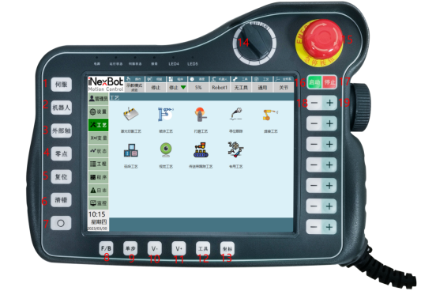

1. 点击【伺服】切换伺服状态，停止、就绪

停止：

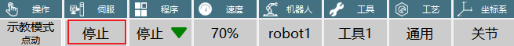
    
就绪：

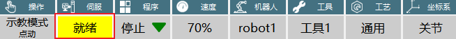

2. 点击【机器人】在连接多个机器人时，可以进行切换机器人

3. 点击【外部轴】在连接外部轴时，切换外部轴和机器人

外部轴：可以点动外部轴 ，例如：标记外部轴后插入外部轴指令，
执行外部轴点到点、 外部轴直线、外部轴圆弧等功能

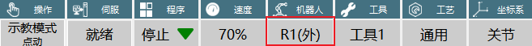

机器人：选择机器人可以对当前的机器人进行点动等操作

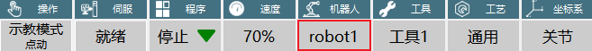

4. 点击【零点】，机器人回到零点位置

5. 点击【复位】，机器人运行到记录的复位点位置

6. 点击【清错】，机器人在出现错误提示时，点击清错按钮，错误提示消失

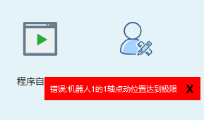

7. 点击【O】机器人进入拖拽模式，可以对机器人进行拖拽让机器人到达目标点位。注意：机器人只有在在辨识成功后才可以进行拖拽

8. 点击【F/B】在单步运行程序时可以选择正序或者倒序

正序运行：程序从第一行开始运行

倒序运行：程序从最后一行开始运行

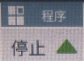

9.  点击【单步】在运行程序时，如下图所示，在示教模式下运行程序，点击【单步】运行第一行程序，当第一行程序运行结束后点击【单步】继续运行第二行程序，依次运行直到整个作业文件运行结束。

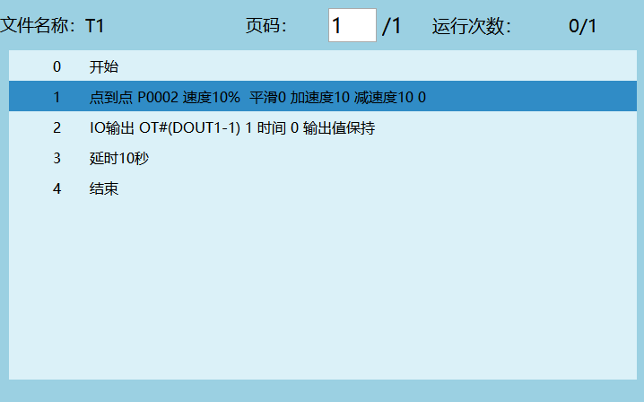

10. 【V-】减小全局速度，每点击一次全局速度减小5%

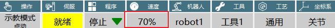

11. 【V+】增加全局速度，每点击一次全局速度增加5%

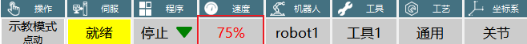

12. 【工具】切换工具手

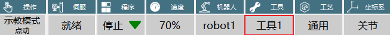

13. 【坐标】切换坐标

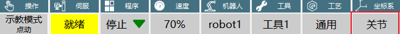

14. 【切换操作模式】旋钮在左边表示当前在示教模式、旋钮在中间表示当前在运行模式、旋钮在右边表示当前在远程模式

15. 【紧急停止按钮】当程序在运行过程中如果出现碰撞或者飞车等情况下按下急停按钮，机器人会停止运动并报错

16. 【启动】在运行模式下用来启动程序，点击【启动】程序开始运行

17. 【停止】在运行模式下用来暂停程序，点击【停止】,正在运行的程序会暂停运行，程序\"暂停\"后，再次点击【启动】程序会继续运行

18. 【-】点击对应坐标轴的【-】,当前坐标轴的坐标点位会减小

19. 【+】点击对应坐标轴的【+】,当前坐标轴的坐标点位会增加

## 2. 相关资源

- [示教器功能按键](./示教器功能按键.md)

- [示教器修改主题颜色](./示教器修改主题颜色.md)

- [示教器换图](./示教器换图.md)
