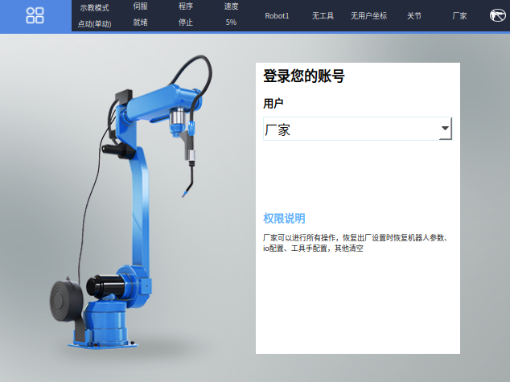
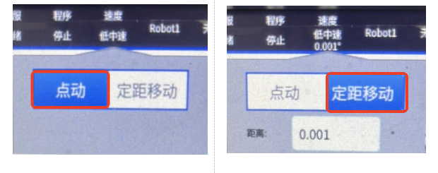

# 界面基础说明

## 1 界面区域划分

红色方框内可用手动方式点动，进行触屏操作，绿色方框内不可进行触屏操作

## 2 红色方框功能

### 2.1 全屏展示

红色方框第一个图标的功能是用于全屏展示，点击后如下图所示，再次点击可切换回非全屏

### 2.2 其他功能

红色方框内其他功能请看其他说明文档

## 3 绿色方框功能

### 3.1 示教模式

"示教模式"：示教器模式的一种，共有"示教模式、运行模式、远程模式"三种，可以通过旋钮切换

### 3.2 伺服状态

"伺服停止"：机器人状态的一种，同有"停止、就绪、运行"三种模式，通过"伺服准备"按键可切换"就绪、停止"两种状态，通过上电使能按键可以进行"就绪、运行"状态的切换

### 3.3 程序状态

"程序 停止"：机器人运行时，会显示"运行"状态，非运行状态显示"停止"

### 3.4 速度显示

"速度"：有两种显示方式，分别是"点动、定点距离"，速度的增、减可通过"高、低"两个按键调节（共有低速、低中速、中速、中高速、高速五个等级，每个等级的速度都可以自己调节，最低1%，最高100%)，'点动、定点距离'的显示方式如下图所示：

### 3.5 机器人选择

"Robot1"：表示当前机器人，如果设置了多个机器人，可以通过"机器人切换"按键进行切换

### 3.6 工具手

"工具7"：表示当前在用工具手7，可用"工具坐标+右边转换"切换不同工具手，一共能切换10种，从工具手1至工具手9以及无工具手

### 3.7 用户登录

"用户1"：表示当前是用户1在登陆使用

### 3.8 坐标系

"关节"：表示当前坐标系是"关节坐标系"，共有"关节、直角、工具、用户"等四种坐标系，可通过"工具坐标"按键来切换不同的坐标系

### 3.9 用户身份

"厂家"：表示当前用户在用厂家的身份进行操作，可以通过用户登陆不同身份来切换，共有"操作员、技术员、管理员、厂家"等四种身份

### 3.10 焊接使能

绿色方框从左至右最后一个图标代表焊接使能的开关，有两种不同的样式，如下图所示：

---

## AI 检索专用问答对 (Q&A for Retrieval)

**Q: T31示教器界面分为哪些区域？**

A: T31示教器界面分为红色方框和绿色方框两个区域。红色方框内可用手动方式点动，进行触屏操作；绿色方框内不可进行触屏操作。

**Q: 红色方框第一个图标的功能是什么？**

A: 红色方框第一个图标的功能是用于全屏展示，点击后进入全屏模式，再次点击可切换回非全屏模式。

**Q: 示教器有哪几种模式？**

A: 示教器共有"示教模式、运行模式、远程模式"三种模式，可以通过旋钮切换。

**Q: 机器人有哪几种伺服状态？**

A: 机器人有"停止、就绪、运行"三种伺服状态。通过"伺服准备"按键可切换"就绪、停止"两种状态，通过上电使能按键可以进行"就绪、运行"状态的切换。

**Q: 速度显示有哪两种方式？**

A: 速度有两种显示方式，分别是"点动、定点距离"。速度的增、减可通过"高、低"两个按键调节，共有低速、低中速、中速、中高速、高速五个等级，每个等级的速度都可以自己调节，最低1%，最高100%。

**Q: 如何切换不同的机器人？**

A: 如果设置了多个机器人，可以通过"机器人切换"按键进行切换。

**Q: 如何切换不同的工具手？**

A: 可用"工具坐标+右边转换"切换不同工具手，一共能切换10种，从工具手1至工具手9以及无工具手。

**Q: 有哪几种坐标系？**

A: 共有"关节、直角、工具、用户"等四种坐标系，可通过"工具坐标"按键来切换不同的坐标系。

**Q: 有哪几种用户身份？**

A: 共有"操作员、技术员、管理员、厂家"等四种身份，可以通过用户登陆不同身份来切换。

**Q: 绿色方框最后一个图标代表什么？**

A: 绿色方框从左至右最后一个图标代表焊接使能的开关，有两种不同的样式。

---

## 相关资源

- [示教器功能按键说明手册](../示教器功能按键说明手册.md)
- [系统功能调试手册](../系统功能调试手册.md)
